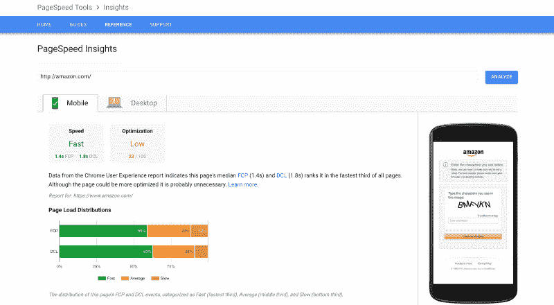
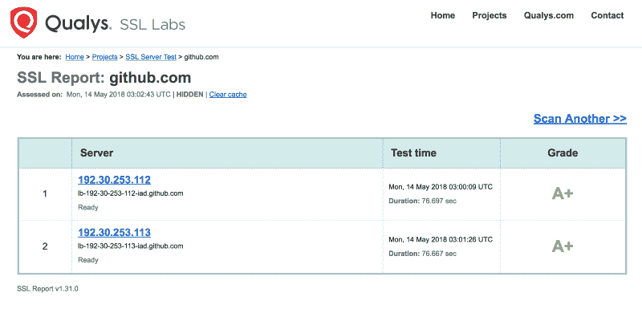
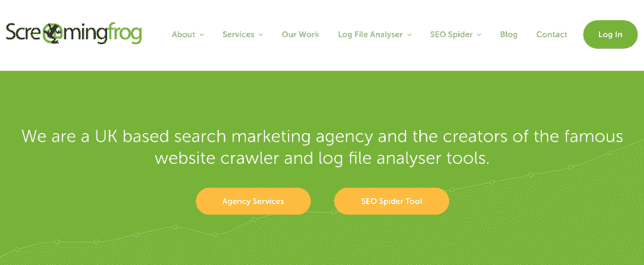
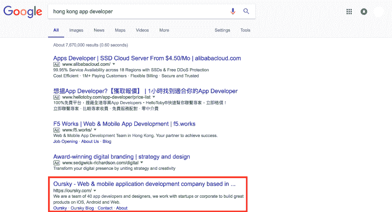
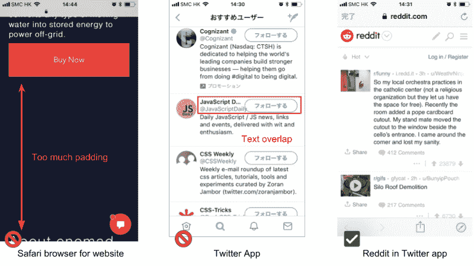

# Web 应用和移动应用的基本启动清单

> 原文：<https://www.freecodecamp.org/news/the-essential-launch-checklist-for-web-apps-and-mobile-apps-a0d52c6014b5/>

作者:本成

# Web 应用和移动应用的基本启动清单

Image Source: [Glenn Carstens-Peters](https://unsplash.com/@glenncarstenspeters) via Unsplash

这是我为产品和项目经理准备的一份简单的网络和移动应用启动清单，用于快速测试他们应用的性能。它还包括一个经常被忽略的简单移动应用程序测试列表，以确认应用程序的行为符合预期。

客户端的产品经理可以使用提供的工具来查看与数字机构或开发商店合作时的性能结果。

### 网络应用

对于 web 应用程序，启动检查表应包括以下内容:

1.  性能:通过谷歌页面速度洞察测试
2.  安全性
3.  断开的链接
4.  和睦相处
5.  搜索引擎优化/社交
6.  拥有很好

### 性能:通过谷歌页面速度洞察测试

*Note that Google will make [page speed a factor in mobile search ranking](https://techcrunch.com/2018/01/17/google-will-make-page-speed-a-factor-in-mobile-search-ranking-starting-in-july/) starting July 2018*

1.  将该网站插入 Google [PageSpeed Insights](https://developers.google.com/speed/pagespeed/insights/) 查看您的结果
2.  如果网站需要登录/凭证，首先登录网站，并使用 [Chrome 页面速度洞察扩展](https://chrome.google.com/webstore/detail/pagespeed-insights-with-p/lanlbpjbalfkflkhegagflkgcfklnbnh)检查性能
3.  另一个有用的工具是 [Pass GTMetrix Analysis](https://gtmetrix.com/)

**原因:**统计数据一致显示，几秒钟的加载时间会对保持力产生巨大影响。[如果一个网站的加载时间超过 3 秒](https://www.thinkwithgoogle.com/data-gallery/detail/mobile-site-abandonment-three-second-load/)，53%的网站访问会被放弃。拥有一个速度更快的网站有助于留住访问者，增加网站的参与度。这反过来会降低你的跳出率，有助于你的搜索引擎优化。

### 安全性

*Ensure your website / web app has at least Grade A score for SSL. Source: Qualsys*

1.  仅使用 HTTPS。HTTP 应该总是重定向到 HTTPS。
2.  [Qualys SSL 服务器测试](https://www.ssllabs.com/ssltest/index.html) -目标是 A 及以上的分数
3.  考虑这些免费/开源扫描工具(以及其他工具): [Qualys](https://www.qualys.com/forms/freescan/) ， [OpenVAS](http://www.openvas.org/) ， [Nmap](http://nmap.org/) ， [OSSEC](https://ossec.github.io/) ， [Security Onion](http://securityonion.blogspot.com/) ， [OpenSSH](http://www.openssh.org/)

**为什么:**如果没有清单，很容易忘记，因为这些功能通常不是用户界面的一部分，可能不会在[探索性测试](https://blog.oursky.com/2018/05/08/software-qa-exploratory-testing/)中发现。

### 断开的链接

Source: Screaming Frog

1.  检查所有页面在 [Monkeytest](https://monkeytest.it/) 上没有断开的链接
2.  检查所有页面在[尖叫青蛙](https://www.screamingfrog.co.uk/)上没有无效链接

**为什么:**这样对 UX 更好，断链会伤害你的 SEO。

### 和睦相处

1.  检查与主要桌面浏览器及其版本(Chrome、Firefox、Safari、Opera、Internet Explorer)的兼容性
2.  也检查移动浏览器！
3.  此外，检查 Safari (iOS)和 Chrome (Android)在各种屏幕尺寸上的表现。

应用内浏览器的行为也可能不同。由于它们非常常见，你可以尝试从脸书、Reddit、Twitter 甚至你的收件箱应用程序打开一个链接。

**为什么:**并非所有的桌面浏览器都以相同的方式呈现，您希望确保一致且高质量的用户体验。此外，响应式网站或 web 应用程序应该适应不同的屏幕大小(但有时呈现的版本不会按照特定大小的预期运行)。

例如，看看我们发现的一个案例，YouTube 的 ie 浏览器粘性标题为。

### 搜索引擎优化/社交媒体

1.  Google 取的对吗？(用[谷歌网站管理员工具](https://www.google.com/webmasters/)检查)
2.  它在谷歌搜索结果页面(SERPs)的第一页吗？
3.  它是否包含正确的用于社交分享的 OpenGraph 标签？将链接放入脸书/ Twitter / Pinterest 进行测试，看看会生成什么样的图片、标题和描述
4.  网站或应用程序是否有正确的标题/元描述标签？
5.  它有图标吗？

**为什么:**通过完成 SEO 和社交媒体的技术层面，确保你的应用、服务或网站是可发现的。SEO 可以帮助潜在用户使用关键词找到你。社会优化格式化您的网站内容，以便您的用户和社区可以轻松地分享，以引用更多的用户。

根据 Hubspot 的 2017 年统计数据，61%的营销人员表示，改善搜索引擎优化和增加有机在线存在是他们集客营销的首要任务。

### 拥有这些东西很好

*Image Source: [Paper CSS](https://github.com/cognitom/paper-css) by cognitom on GitHub*

1.  用[https://validator.w3.org](https://validator.w3.org/)验证 HTML/CSS
2.  用 [WAVE](https://wave.webaim.org/) 或在 https://www.w3.org/WAI/ER/tools/[的工具](https://www.w3.org/WAI/ER/tools/)检查基本的网页可访问性
3.  404 页内容丰富吗？
4.  你的网站需要一个打印样式表吗？
5.  当你的页面加载时，确保你的 JavaScript 没有错误(从谷歌浏览器的开发者工具中检查)
6.  URL 是否合理/具有描述性？合理的 URL 有助于访问者和搜索引擎理解你的内容。
7.  规范域有效吗？([www.abc.com](http://www.abc.com/)vs abc.com，以此类推)

### 对于移动应用程序

*Small screens like the iPhone 4SE pose UI challenges.*

这是一个测试移动应用的简单清单。以下是移动应用程序中一些常被忽视的问题:

1.  输入是否使用正确类型的键盘(例如，电子邮件或数字输入应使用相关类型的键盘)和 CTA？(例如，在一个表单中，iOS 右下角的键盘 CTA 应该显示 next，当点击它时，它应该转到表单的下一个输入)。
2.  应用程序在执行需要用户等待的工作时，是否有合适的加载指示器？
3.  在[恶劣的网络条件下](https://code.oursky.com/offline-first-network-connection-error/)测试应用程序，以检查其是否如预期那样运行。
4.  在飞行模式下测试应用程序(如果它应该离线工作)。
5.  测试不同屏幕尺寸(尤其是小屏幕)的 app 的兼容性。
6.  测试应用程序是否要求权限并给出适当的解释。
7.  测试应用程序是否显示易于理解的错误消息。
8.  测试应用程序在 Android 中断期间(如通话或低存储)是否正常工作。
9.  在不同的本地化/时区测试应用程序。
10.  用不同的字体大小测试应用程序(尤其是在 iOS 中)。

大概就是这样。如果你觉得这篇文章有帮助，请分享！

Oursky 是一家总部位于香港的工程师领导的数字机构，曾与全球品牌和上市公司合作。如果你有一个应用程序或者想为你的产品开发一个数字解决方案，[联系](https://oursky.com/contact)！

*这些笔记改编自我在香港一家企业为项目经理举办的研讨会，并于 2018 年 5 月 21 日在我们的博客上发表[。](https://blog.oursky.com/2018/05/21/launch-checklist-websites-web-apps/)*