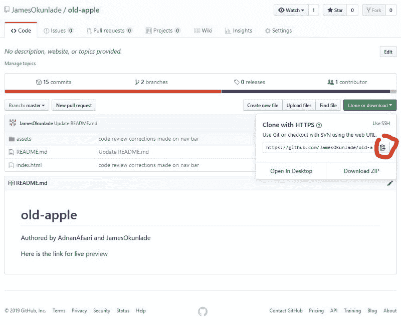

# 用五分钟解释 Git 的要点

> 原文：<https://www.freecodecamp.org/news/the-essentials-of-git-explained-in-five-minutes-d554019eded9/>

作者詹姆斯·奥昆拉德

# 用五分钟解释 Git 的要点


Photo by [Christin Hume](https://unsplash.com/photos/mfB1B1s4sMc?utm_source=unsplash&utm_medium=referral&utm_content=creditCopyText) on [Unsplash](https://unsplash.com/search/photos/computer?utm_source=unsplash&utm_medium=referral&utm_content=creditCopyText)

当你学习成为一名软件开发人员时，你会意识到大多数工作是在团队中完成的。当你在一个团队中时，你需要一个版本控制系统来管理来自不同开发人员的代码库的变更。

Git 是最流行的版本控制系统之一。然而，新开发人员在使用它时很容易不知所措——我知道我就是这样。事实上，我回避了好几年。

如果你是一个经验丰富的开发人员，或者一提到 Git 就不害怕，请随意跳到下一篇文章。然而，如果您是 g it 新手或者对使用它没有信心，花几分钟时间学习这些基本但强大的 Git 技巧。

以下是我们将要介绍的内容:

1.  Git clone
2.  Git checkout
3.  Git pull
4.  Git 添加并提交
5.  Git 存储和合并
6.  Git push



Screenshot of my old-apple repository on Github

### **Git 克隆**

总是克隆您正在处理的新存储库，这意味着将存储库文件的副本下载到您的本地计算机。虽然有许多方法可以克隆一个存储库，但是我将解释如何使用命令行来实现。

例如，如果您想要克隆上面的存储库，首先复制上面的克隆链接。然后，打开您的终端，cd 到本地计算机上您想要放置这些文件的位置。如果您想要克隆主分支，请键入 git clone，然后粘贴如下所示的链接。

`git clone [https://github.com/JamesOkunlade/old-apple.git](https://github.com/JamesOkunlade/old-apple.git)`

如果您想克隆这个存储库的一个特定分支，您应该这样做:

`git clone [https://github.com/JamesOkunlade/old-apple.git](https://github.com/JamesOkunlade/old-apple.git) -b branch-name`

### **Git checkout**

最佳实践是为不同的特性创建不同的分支，而不是直接在主分支上工作。当所有的特性都被认为通过了某些测试和需求，那么您就可以将它们合并到主分支中。

在不同的时候，您将不得不签出到您想要处理的特定存储库分支，您可以使用下面的命令来完成这个任务。

如果已经创建了分支:

`git checkout branch-name`

如果您只是创建新的要素分支:

`git checkout -b branch-name`

### **Git pull**

您的团队或结对编程伙伴将更改存储库的不同分支，并且您应该总是在开始编写代码之前获取这些新的更改。在您的终端上，检查到您将工作的分支，并运行`git pull`命令。最近的更改将被提取到您的本地存储库中。

### **Git 添加并提交**

add 和 commit Git 命令几乎总是一起使用。把它们想象成捕获和保存。如果你不先捕捉它，你就不能保存它。因此，add 命令应该总是在 commit 命令之前。当您使用 add 命令指向您想要在其当前状态下捕获的特定文件时，您使用 commit 来保存您捕获的内容的副本。

要捕获所有文件(除了那些被 Git ignore 排除的文件)，您将使用`git add .`来捕获特定文件的当前状态，比如说 index.html，您将必须键入`git add index.html`

拍摄快照后，您必须使用以下命令将快照提交并保存到本地存储库:

`git commit -m ‘commit message’`

提交消息应该解释您正在保存的快照的特性。例如:

`git add index.html`

`git commit -m ‘the form feature button created’`

您可以使用&&操作符同时完成这两项操作，如下所示；

`git add index.html && git commit -m ‘footer html structure created’`

### **Git stash and merge**

简单地做`git stash`将会隐藏你对分支所做的任何编辑，但是你不想提交。这意味着当等待另一个开发人员提交和推送他们的代码副本时，您可以在同一个分支中试验一些东西。Git 鼓励它。无论何时，当您准备好将新的变更加载到您的本地存储库中，但是不想将您自己的编辑合并到其中时，您就必须保存您自己的编辑。Git stash 会将副本保存在其他地方，可以通过 Git stash list 访问。

将两个不同的快照合并在一起的命令。它可以是由不同的开发人员合并同一个分支的不同快照，或者将不同分支的不同快照合并在一起。

当您签出到主分支时，git 合并开发会将开发分支合并到您的主分支，反之亦然。

### **去推**

就像将您的快照保存到 Google 相册中，供您共享相册的任何人使用一样，可以将 git push 视为将您的本地存储库发送到远程存储库，供其他人访问。

`git push -u origin branch-name`

虽然还有其他 Git 命令可供使用，但是通过掌握我在上面提到的几个命令，您可以获得有趣的结果。

欢迎在推特上联系我，问我任何问题

[**詹姆斯·奥昆莱德(@JamesOkunlade) |推特**](https://twitter.com/JamesOkunlade)
[*詹姆斯·奥昆莱德的最新推文(@JamesOkunlade)。全栈 SWE | JavaScript/React/Redux | Ruby/Ruby on Rails |…*twitter.com](https://twitter.com/JamesOkunlade)

```
def JamesOkunlade (beginnerDeveloper)
```

```
 unless you have a coding buddy OR you’re making a lot of money
```

```
 doing it
```

```
 puts “Coding is not fun!”
```

```
 end
```

```
end
```

我来自尼日利亚，每天都和来自孟加拉国的编程伙伴以及来自塞尔维亚、科索沃和乌克兰的其他开发人员一起编程。他们都帮助了我使用 Git。

作为一名学生，我每周至少做 40 个小时的远程结对编程。作为初学者学习编程可能非常乏味，因此降低了生产率，并使学习曲线变硬。然而，有了正确的编码伙伴，在适当的结构下，你会惊奇地发现学习是多么有趣。

[**詹姆斯·奥昆拉德-软件开发人员-Filmdrive | LinkedIn**](https://www.linkedin.com/in/james-okunlade-4a4502121/)
[*查看詹姆斯·奥昆拉德在全球最大的职业社区 LinkedIn 上的个人资料。詹姆斯在他们的…*www.linkedin.com](https://www.linkedin.com/in/james-okunlade-4a4502121/)上列出了 2 份工作