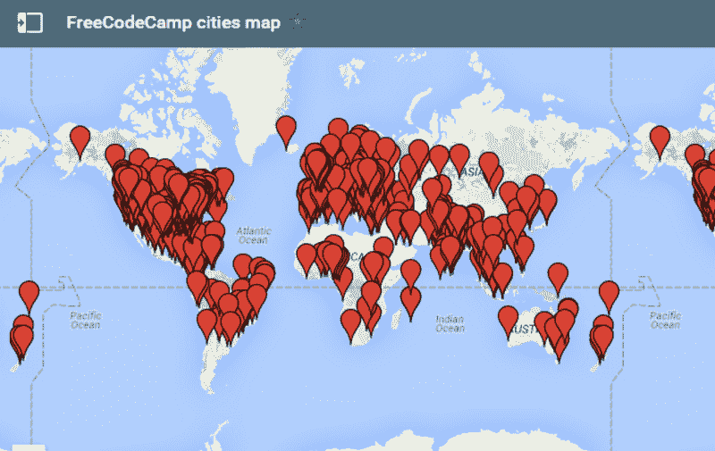
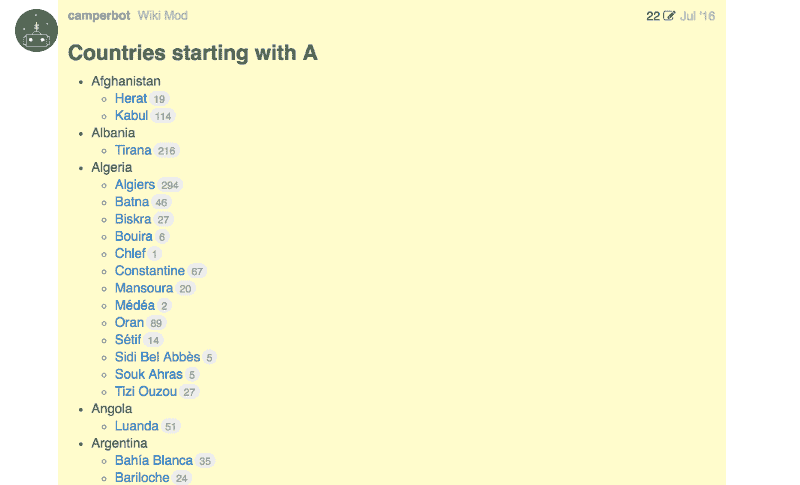
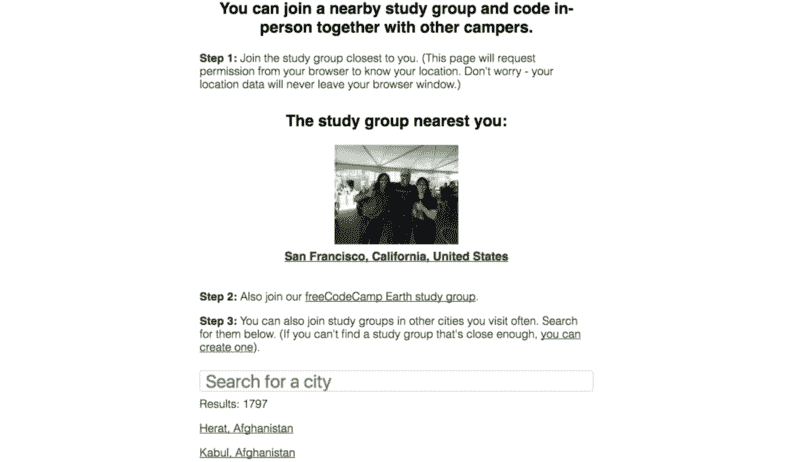
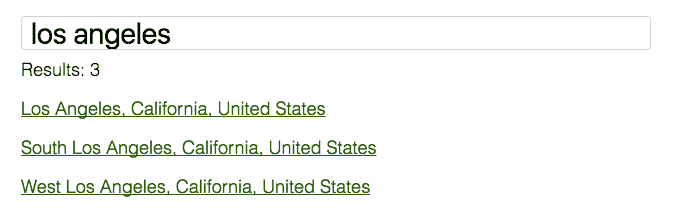
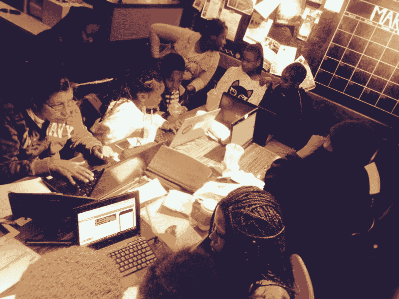
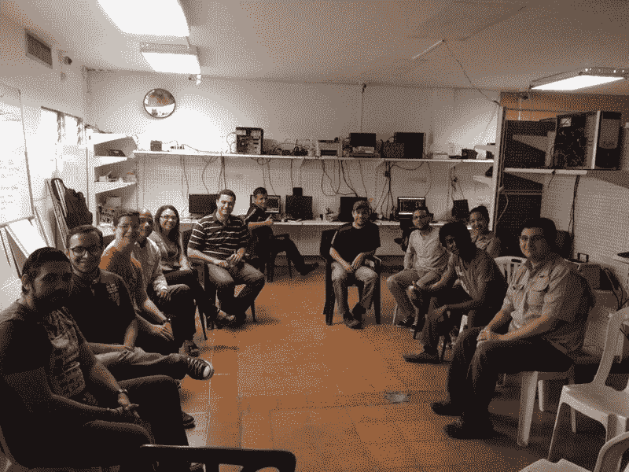
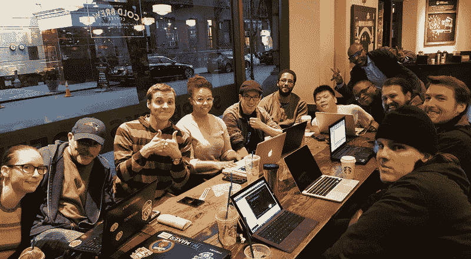

# 一种在你的城市中快速找到编码对象的新方法

> 原文：<https://www.freecodecamp.org/news/the-fastest-way-to-find-people-in-your-city-to-code-with-c71c956456c8/>

我们的开源社区现在在地球上几乎每个主要城市都有学习小组——有 1800 个。

A map with the locations of some of our study groups

有这么多的学习小组，探索他们曾经是不方便的。你不得不滚动浏览我们论坛上的帖子列表。

Our old forum-based approach.

今天，我很兴奋地宣布一个在你们城市找到学习小组的更简单的方法。

介绍我们新的[学习小组目录](https://study-group-directory.freecodecamp.org/)。

这是它目前的样子:

我们的目录会自动向您显示离您最近的学习小组。您也可以按城市、州/省和国家进行搜索。

一些大城市有几个学习小组可供选择:

[freeCodeCamp South Los Angeles](https://www.facebook.com/groups/freecodecampsola)

大多数 freeCodeCamp 学习小组是围绕脸书小组组织的。(脸书群是免费的，因为大多数人都有脸书帐户，所以很容易加入。)我们在 MeetUp 和微信上也有群。

每个研究小组都完全自主地运行。他们可以自己决定在哪里见面和做什么。他们中的一些人在咖啡馆或图书馆见面。其他人则与当地学校、公司或政府达成协议，设立指定场地。

[freeCodeCamp Coro, Venezuela](https://www.facebook.com/groups/free.code.camp.coro)

要在这些活动中保持一致的出席率是需要努力的。如果你所在城市的小组还没有每周开会，我建议从小型的咖啡和代码活动开始。这是关于一致性的。

[freeCodeCamp New York City](https://www.facebook.com/groups/free.code.camp.new.york.city)

如果你有兴趣让你所在城市的学习小组更上一层楼，我推荐你阅读以下文章:

[**自由代码营的 1，000 多个学习小组现已完全自治**](https://medium.freecodecamp.com/free-code-camps-1-000-study-groups-are-now-fully-autonomous-d40a3660e292)
[*当第一个本地自由代码营(FCC)学习小组出现时，我们没有想到在不到一年的时间里，近…*【medium.freecodecamp.com](https://medium.freecodecamp.com/free-code-camps-1-000-study-groups-are-now-fully-autonomous-d40a3660e292)[**自由代码营如何让我作为一名新的训练营毕业生保持脚踏实地**](https://medium.freecodecamp.com/how-free-code-camp-keeps-me-grounded-as-a-bootcamp-grad-fc08f880371)
[*过去的一年简直是疯了。是的，我从卡车司机转型为全职初级开发人员。但这不是…*medium.freecodecamp.com](https://medium.freecodecamp.com/how-free-code-camp-keeps-me-grounded-as-a-bootcamp-grad-fc08f880371)[**去年我主持了 40 场编码活动。以下是我学到的。**](https://medium.freecodecamp.com/i-hosted-40-coding-events-last-year-heres-what-i-learned-94d607cd04f4)
[*这里有三个环节值得你花时间:*medium.freecodecamp.com](https://medium.freecodecamp.com/i-hosted-40-coding-events-last-year-heres-what-i-learned-94d607cd04f4)

### 我们如何构建学习小组目录应用程序

我们的学习小组目录应用程序是一个简单的单页静态 web 应用程序，运行在 GitHub 页面上。这样，我们可以很容易地添加新的学习小组，并立即部署对代码的改进。

德克萨斯州圣安东尼奥的教师兼开发人员威廉·麦克唐纳开发并维护了这款应用。

像我们所做的一切一样，它是完全开源的。

如果你碰巧经营一个组织，并且你想要一个这样的目录来存放你所有的本地分会，请随意使用。

我们欢迎您的[问题和拉动请求](https://github.com/freeCodeCamp/study-group-directory/issues)。？

感谢阅读。我希望你能参加这个月的学习小组活动。编码快乐！