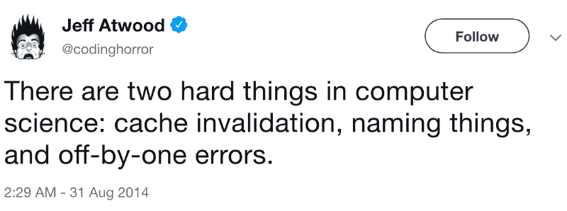
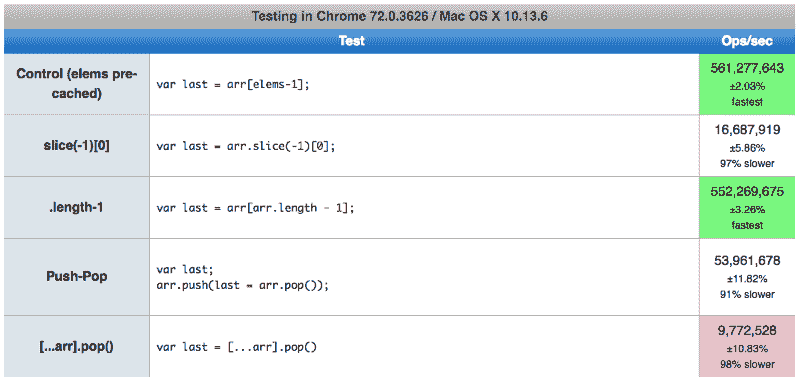
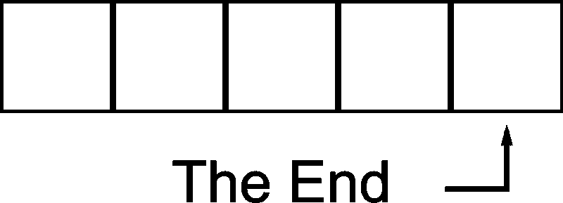

# 第一个应该是 JavaScript 数组的最后一个

> 原文：<https://www.freecodecamp.org/news/the-first-shall-be-last-with-javascript-arrays-11172fe9c1e0/>

作者托马斯·巴拉索

# 第一个应该是 JavaScript 数组的最后一个


[Sea Salps](https://www.reddit.com/r/TheDepthsBelow/comments/6j1gj6/sea_salps_forming_a_strange_looking_chain_video/) forming natural “arrays”

> 所以最后一个应该是`[0]`，第一个应该是【length — 1】。

> –改编自[马太福音 20:16](https://www.biblegateway.com/passage/?search=Matthew+20%3A16&version=KJV)

我将跳过马尔萨斯灾难，直接进入主题:数组是最简单也是最重要的数据结构之一。虽然终端元素(第一个和最后一个)经常被访问，但是 Javascript 没有提供方便的属性或方法来这样做，并且使用索引可能是多余的，容易产生副作用和[一个接一个的错误](https://en.wikipedia.org/wiki/Off-by-one_error)。

一个鲜为人知的，[最近的 JavaScript TC39 提案](https://github.com/keithamus/proposal-array-last)以两个“新”属性的形式提供了安慰:`Array.lastItem` & `Array.lastIndex`。



[Jeff Atwood @codinghorror](https://twitter.com/codinghorror/status/506010907021828096?lang=en)

### **Javascript 数组**

在包括 Javascript 在内的许多编程语言中，数组是零索引的。终端元素——第一个和最后一个——分别通过`[0]`和`[length — 1]`索引访问。我们把这种快乐归功于由 C 设定的[先例，其中一个索引代表从数组头部的偏移量。这使得零成为第一个索引，因为它*是*数组头。Dijkstra 也宣称“T6”是一个最自然的数字。](https://medium.com/@albertkoz/why-does-array-start-with-index-0-65ffc07cbce8)“那就这么写吧。所以就这样吧。

我猜想，如果您按索引对访问进行平均，您会发现 terminal 元素被引用得最多。毕竟，数组通常用于存储排序后的集合，这样做是为了放置最高级的元素(最高的、最低的、最老的、最新的等等。)在两端。

与其他脚本语言不同(比如说 [PHP](https://secure.php.net/manual/en/function.end.php) 或 [Elixir](https://hexdocs.pm/elixir/List.html#last/1) ，Javascript 不提供对终端数组元素的方便访问。考虑一个交换两个数组中最后一个元素的简单例子:

```
let faces = ["?", "?", "?", "?", "?"];let animals = ["?", "?", "?", "?", "?"]; 
```

```
let lastAnimal = animals[animals.length - 1];animals[animals.length - 1] = faces[faces.length - 1];faces[faces.length - 1] = lastAnimal;
```

交换逻辑需要在 3 行中引用 8 次的 2 个数组！在真实世界的代码中，这可能很快变得非常重复，人类很难解析(尽管它对于机器来说是完全可读的)。

更重要的是，仅仅使用索引，你不能在同一个表达式中定义一个数组并得到最后一个元素。这似乎并不重要，但是考虑另一个例子，其中函数`getLogins()`进行异步 API 调用并返回一个排序后的数组。假设我们希望最近的登录事件位于数组的末尾:

```
let lastLogin = async () => {  let logins = await getLogins();  return logins[logins.length - 1];};
```

除非长度是固定的并且事先知道，否则我们*需要*将数组赋给一个局部变量来访问最后一个元素。在像 [Python](http://knowledgehills.com/python/negative-indexing-slicing-stepping-comparing-lists.htm) 和 [Ruby](http://rubyquicktips.com/post/996814716/use-negative-array-indices) 这样的语言中，解决这个问题的一个常见方法是使用负索引。那么`[length - 1]`可以缩短为`[-1]`，不需要本地参考。

我发现`-1`的可读性只比`length — 1`强一点点，尽管用 [ES6 代理](https://developer.mozilla.org/en-US/docs/Web/JavaScript/Reference/Global_Objects/Proxy)或`Array.slice(-1)[0]`来近似 Javascript 中的[负数组索引是可能的，但这两者都伴随着](https://h3manth.com/new/blog/2013/negative-array-index-in-javascript/)[显著的性能暗示](https://jsperf.com/last-array-element2/14)，否则它们将构成简单的随机访问。



#### **下划线&罗达什**

软件开发中最广为人知的一个原则就是不要重复自己(干)。既然访问终端元素如此普遍，为什么不写一个助手函数来做呢？幸运的是，许多像[下划线](https://underscorejs.org/)和 [Lodash](https://lodash.com/) 这样的库已经为`_.first` & `_.last`提供了实用程序。

这在上面的`lastLogin()`示例中提供了一个很大的改进:

```
let lastLogin = async () => _.last(await getLogins());
```

但是在交换最后一个元素的例子中，改进并不显著:

```
let faces = ["?", "?", "?", "?", "?"];let animals = ["?", "?", "?", "?", "?"]; 
```

```
let lastAnimal = _.last(animals);animals[animals.length - 1] = _.last(faces);faces[faces.length - 1] = lastAnimal;
```

这些实用函数删除了 8 个引用中的 2 个，只是现在我们引入了一个外部依赖，奇怪的是，它不包括用于设置终端元素的函数。

最有可能的是，这样的函数被故意排除，因为它的 API 会令人困惑，难以阅读。Lodash 的早期版本提供了一个方法`[_.last(array, n)](https://github.com/lodash/lodash/issues/946)`，其中 *n* 是从末尾开始的项目数，但最终为了支持`[_.take](https://lodash.com/docs#take)(array, n)`而被移除。

假设`nums`是一个数字数组，那么`_.last(nums, n)`的预期行为是什么？它可以像`_.take`一样返回最后两个元素，或者它可以设置最后一个元素的值等于 *n* 。

如果我们要编写一个函数来设置数组中的最后一个元素，只有几种方法可以考虑使用纯函数、方法链或使用 prototype:

```
let nums = ['d', 'e', 'v', 'e', 'l']; // set first = last
```

```
_.first(faces, _.last(faces));        // Lodash style
```

```
$(faces).first($(faces).last());      // jQuery style
```

```
faces.first(faces.last());            // prototype
```

我不认为这些方法有什么改进。事实上，这里丢失了一些重要的东西。每个都执行一个赋值，但是没有一个使用赋值操作符(`=`)。这可以通过像`getLast`和`setFirst`这样的命名约定变得更加明显，但是这很快变得过于冗长。更不用说[地狱的第五层](https://blog.toggl.com/seven-levels-developer-hell/)充满了被迫浏览“自我记录”遗留代码的程序员，在那里访问或修改数据的唯一方式是通过 getters 和 setters。

不知何故，看起来我们被`[0]`&`[length — 1]`……

还是我们？？

#### **提案**

如上所述，ECMAScript 技术候选(TC39)提案试图通过在`Array`对象上定义两个新属性来解决这个问题:`lastItem` & `lastIndex`。这个提议[已经在](https://kangax.github.io/compat-table/esnext/) [core-js 3](https://github.com/zloirock/core-js) 中得到的支持，并且现在可以在 Babel 7 & TypeScript 中使用。即使你没有使用 transpiler，这份建议书也包含了一个[多填充](https://github.com/keithamus/proposal-array-last#polyfill)。

就我个人而言，我认为`lastIndex`没有太大的价值，我更喜欢 Ruby 对`[first](https://stackoverflow.com/questions/18212240/ruby-convention-for-accessing-first-last-element-in-array)` [和`last`](https://stackoverflow.com/questions/18212240/ruby-convention-for-accessing-first-last-element-in-array) 的较短命名，尽管由于[潜在的网络兼容性问题](https://github.com/keithamus/proposal-array-last/issues/4)这一点被排除了。我也很惊讶这个提议没有暗示一致性和对称性的`firstItem`属性。

在此期间，我可以在 ES6 中提供一种无依赖性的、Ruby 风格的方法:

#### **第一名&最后一名**

我们现在有两个新的阵列属性—`first`&`last`—以及一个解决方案:

使用赋值运算符

不克隆阵列

可以在一个表达式中定义一个数组并获得一个终端元素

人类可读

为获取和设置提供一个界面

我们可以用一行代码重写`lastLogin()`:

```
let lastLogin = async () => (await getLogins()).last;
```

但是当我们用一半的引用数交换两个数组中的最后一个元素时，真正的胜利来了:

```
let faces = ["?", "?", "?", "?", "?"];let animals = ["?", "?", "?", "?", "?"]; 
```

```
let lastAnimal = animals.last;animals.last = faces.last;faces.last = lastAnimal;
```

一切都很完美，我们已经解决了 CS 最困难的问题之一。这种方法中没有隐藏邪恶的契约…

#### **原型妄想症**

> 当然，世界上没有一个(程序员)正直到做好事却从不犯罪。——改编自[传道书 7:20](https://www.biblegateway.com/passage/?search=Ecclesiastes+7%3A20&version=NRSVA)

许多人认为[扩展本地对象的原型是一种反模式](https://we-are.bookmyshow.com/prototype-pattern-in-js-5c1f44440081)，是一种可以用 Java 编程 100 年来惩罚的罪行。在引入`[enumerable](https://developer.mozilla.org/en-US/docs/Web/JavaScript/Enumerability_and_ownership_of_properties)`属性之前，[扩展`Object.prototype`](https://javascriptweblog.wordpress.com/2011/12/05/extending-javascript-natives/) 可以改变`for in`循环的行为。它还可能导致各种库、框架和第三方依赖关系之间的冲突。

也许最阴险的问题是，如果没有编译时工具，一个简单的拼写错误可能会无意中创建一个关联数组。

```
let faces = ["?", "?", "?", "?", "?"];let ln = faces.length 
```

```
faces.lst = "?"; // (5) ["?", "?", "?", "?", "?", lst: "?"] 
```

```
faces.lst("?");  // Uncaught TypeError: faces.lst is not a function 
```

```
faces[ln] = "?"; // (6) ["?", "?", "?", "?", "?", "?"] 
```

这个问题并不是我们的方法所独有的，它适用于所有本机对象原型(包括数组)。然而，这以不同的形式提供了安全。Javascript 中的数组长度不固定，因此没有`IndexOutOfBoundsExceptions`。使用`Array.last`可以确保我们不会无意中试图进入`[length]`并且无意中进入`undefined`的领地。

无论你采取哪种方法，都有陷阱。再一次，软件被证明是一门权衡取舍的艺术。

继续无关的圣经引用，假设我们不相信扩展`Array.prototype`是一个永恒的罪，或者我们愿意咬一口禁果，我们今天可以使用这个简洁易读的语法！

### **遗言**

> 程序必须写给人们阅读，并且只是附带地给机器执行。–[哈罗德·艾贝尔森](https://www.goodreads.com/book/show/43713.Structure_and_Interpretation_of_Computer_Programs?from_choice=false&from_home_module=false)

在像 Javascript 这样的脚本语言中，我更喜欢功能性的、简洁的、可读的代码。当访问终端数组元素时，我发现`Array.last`属性是最优雅的。在生产前端应用程序中，我可能倾向于使用 Lodash 来最小化冲突和跨浏览器问题。但是在我控制环境的节点后端服务中，我更喜欢这些自定义属性。

我肯定[不是第一个](https://esdiscuss.org/topic/array-prototype-last)，也不会是最后一个，欣赏像`Array.lastItem`这样的属性的价值(或对其含义的警告)，它有望很快成为你身边的 ECMAScript 版本。



在[LinkedIn](https://www.linkedin.com/in/tombarrasso)[GitHub](https://github.com/Tombarr)[Medium](https://medium.com/@tbarrasso)上关注我