# 什么是五层模型？互联网的框架解释

> 原文：<https://www.freecodecamp.org/news/the-five-layers-model-explained/>

计算机网络是一个美丽而令人惊叹的话题。网络涉及从物理到算法等不同领域的大量知识。

在处理计算机网络时，有一个框架可以把一切都安排妥当，那就是层次模型。

在这篇文章中，你将了解*为什么*我们需要层次，以及*什么是*五层模型。您还将了解该模型中每一层的作用。

# 为什么要分层？

想象一下，你被赋予设计和实现互联网的任务！你从哪里开始？我们实际上想从一个网络，一个重要的网络，如互联网，得到什么？

嗯，我们其实想要很多东西。仅举几个例子:

*   我们希望它是**快速**——也就是说，允许快速通信。我们不想长时间等待信息从一个主机传到另一个主机。
*   它还应该**可靠**——当发送一条消息时，我们希望接收方能够真正接收到它。
*   网络应该是可扩展的，也就是说，允许更多的设备加入。我们不希望从两台计算机开始，然后无法添加第三台计算机。
*   网络应该支持**不同的设备和连接**——例如，它应该能够连接有线 PC、无线笔记本电脑和手机。

这只是部分列表。

那么，当我们想要实现这么多不同的事情时，我们如何着手实施互联网呢？

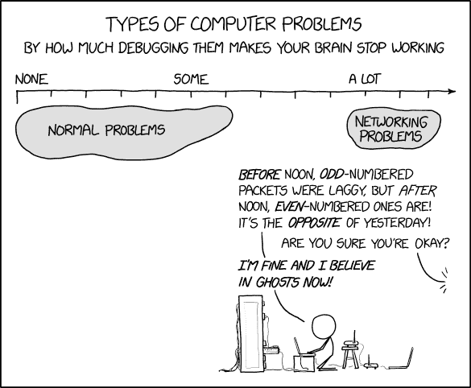

Computer Networks are complex (Source: [XKCD](https://xkcd.com/2259/))

为了简化事情，使网络灵活，通信分为**层**。

每一层都有自己的职责。它向上层提供服务，并使用下层提供的服务。

考虑一个由三台设备组成的示例网络:

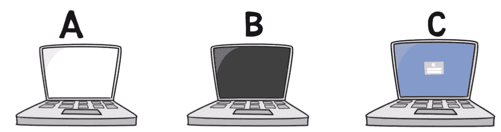

An example network with three devices (Source: [Brief](https://www.youtube.com/watch?v=iHp5J_f_ToQ&ab_channel=Brief))

我们有两层:

【Alpha 层负责在彼此直接相连的主机之间传输数据。在上图中，它位于主机 A 和 B 之间，或者主机 B 和 c 之间。

【Beta 层负责远距离主机之间的数据传输。在图中，它位于主机 A 和 c 之间。

我们从这种分裂中获得了什么？我们获得了很大的灵活性。

每一层都可以由不同的人开发和实现。上层不关心下层的实现，反之亦然。

例如，主机 A 和 B 之间的连接可以是 WiFi 连接，而 B 和 C 之间的连接可以由信鸽组成。这些是 Alpha 层(完全)不同的实现。

注意，这种方式也使我们能够有不同的专业和专长——训练信鸽的专家不一定必须有资格建立稳固的 WiFi 网卡，反之亦然。

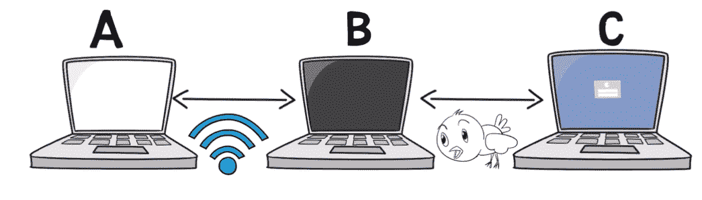

The Alpha Layer may have different implementations on the same network (Source: [Brief](https://www.youtube.com/watch?v=iHp5J_f_ToQ&ab_channel=Brief))

Layer Beta 的开发者不需要为这种差异而自寻烦恼。在这一层，主机 A 需要知道为了到达主机 C，它首先需要把它的消息发送给主机 B，而不是例如主机 d。然后，主机 B 将把它转发给主机 C。

这样，Beta 层只负责查找发送消息的路由。它使用 Alpha 层提供的服务，在直接相连的主机之间传输数据。

一般来说，网络非常复杂，并且有各种各样的要求。将交流分成不同的层次可以让我们简化事情，让交流更加灵活。

现在你明白了*为什么*我们需要层，我们可以继续学习网络中实际使用的层。

# 什么是五层模型？

多年来已经提出了一些层模型，最著名的是五层模型、七层模型(也称为 OSI 模型)或四层模型(也称为 TCP/IP 模型)。

它们的相似之处多于不同之处，我选择将重点放在五层模型上，因为它是所有模型中最实用的，并且最好地描述了互联网的实际工作方式。

## 第一层——物理层

第一层负责**在网络上传输单个位**–0 或 1。

为了获得关于这一层负责什么的一些直觉，考虑传输的时间。假设我们有某种电缆来传输数据，我们使用`+5`电压来传输`1`，使用`-5`电压来传输`0`。下图代表哪些位？

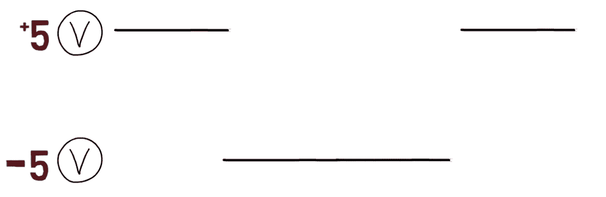

A physical layer implementation encoding 1 as +5 Voltage and 0 as -5 Voltage (Source: [Brief](https://www.youtube.com/watch?v=Q3qqd6Y2FbQ&ab_channel=Brief))

嗯，可能是`1001`。如果*用这个*时间来传输一个比特，就是这种情况(下图中橙色虚线所示):

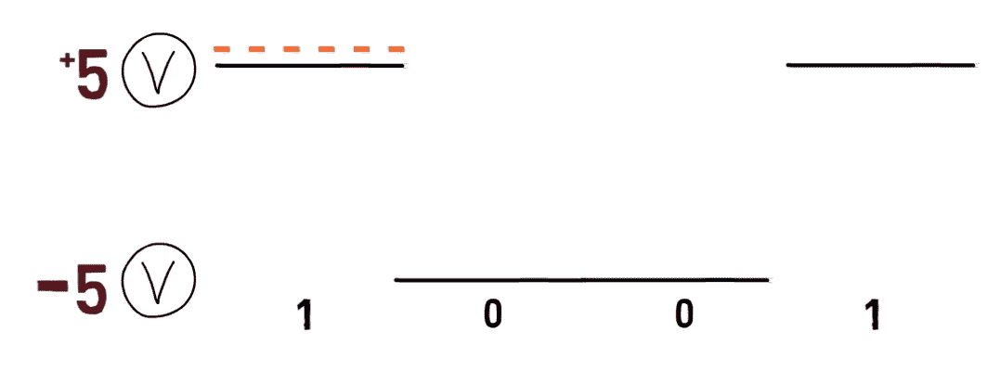

An example bitstream encoded by this signal (Source: [Brief](https://www.youtube.com/watch?v=Q3qqd6Y2FbQ&ab_channel=Brief))

然而，它也可以表示其他比特流。例如，如果传输一个比特只需要一半的时间(由下面的绿色虚线表示)，那么比特流可能是`11000011` :

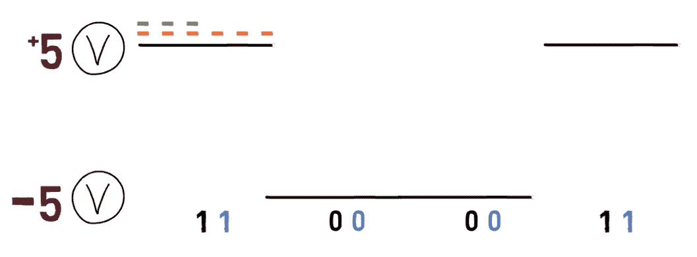

Another possible bitstream encoded by the same signal (Source: [Brief](https://www.youtube.com/watch?v=Q3qqd6Y2FbQ&ab_channel=Brief))

区别在于传输单个比特所用的时间。这被称为**比特率–**,即单位时间内传输的比特数。

当然，实现高比特率是更可取的，因为这意味着我们可以在短时间内发送许多位。但是要达到高比特率而不出错是很难的。

这只是第一层需要考虑的事情之一。现在重要的是这一层的目标:传输和接收单个比特。

## 第二层——数据链路层

第二层负责在**两台直接链接**的主机之间传输数据，尽管可能存在错误。

我们所说的“直接关联”是什么意思？现在，假设两个设备之间没有设备。因此，如果我们有两台计算机，计算机 A 和计算机 B，它们通过计算机 M 连接，那么计算机 A 和计算机 B 没有直接链接。但是电脑 A 和电脑 M **是**直接链接的，电脑 M 和电脑 b 也是。

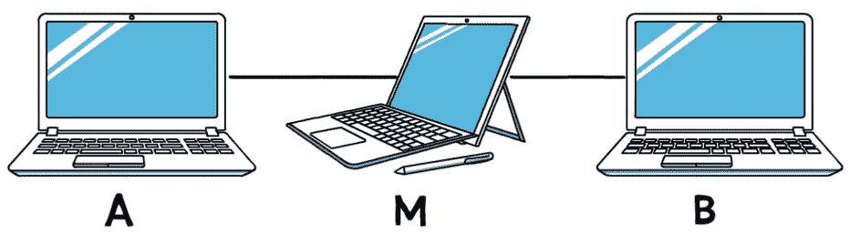

Two remote hosts connected via another device (Source: [Brief](https://www.youtube.com/watch?v=Q3qqd6Y2FbQ&ab_channel=Brief))

换句话说，计算机 A 和计算机 M 相距**一跳**，而计算机 A 和计算机 B 相距**两跳**。

也就是说，为了从计算机 A 到计算机 B，我们需要两次“跳跃”——一次从 A 到 M，另一次从 M 到 B。

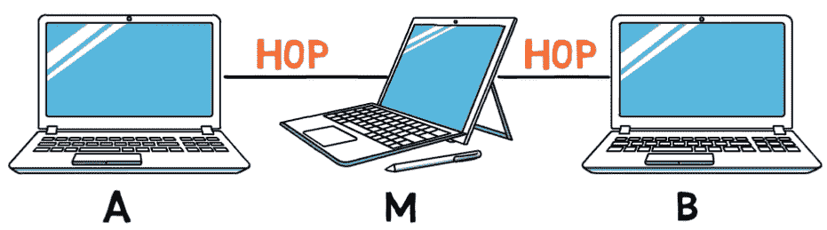

Every direct connection is called a Hop (Source: [Brief](https://www.youtube.com/watch?v=Q3qqd6Y2FbQ&ab_channel=Brief))

回到第二层的职责——我们提到过它负责在直接链接的两台主机之间传输数据，尽管可能存在错误。

我们所说的**错误**是什么意思？物理层可能会提供错误的数据。比如用`1`代替`0`。因此，像`000110`这样的比特流可能作为`001110`被接收。

许多原因可能导致这种错误。例如，我们可以想象一辆卡车在传输比特的线路上行驶，引起了一些问题。不管什么原因，第二层必须处理通信，尽管有这些错误。

第二层以*数据报*的形式发送数据，即以块的形式。这一层的数据报被称为**帧**。帧通常包含 **MAC 地址**，这是物理地址，一个标识发送方，另一个标识接收方。为什么我们需要一个 MAC 地址？

首先，接收设备想知道该帧是否是给它们的。接收者不愿意浪费宝贵的时间去读取别人的数据。如果该帧包含不属于接收方设备的 MAC 地址，该设备可以简单地忽略该帧。

第二，出于隐私原因——我们希望消息只到达预定的接收者，这样只有他们才能读取数据。

第三，发送方希望接收方知道是谁发送了该帧。这样，接收者将能够把他们的响应发送回发送者，而不是发送给其他人。

请注意，我们希望这些地址是唯一的。也就是说，我们希望用一个地址来标识一台设备。通过这种方式，我们知道如果我们向特定的地址发送消息，它将只被发送到预定的设备。

## 第三层——网络层

第三层负责**路由**——也就是决定数据将“行进”的路径。

你可以把这一层想象成成功的路由 app，谷歌地图。当你上车使用谷歌地图时，你告诉应用程序你的目的地，谷歌地图会找出你开车的最佳路线。

请注意，谷歌地图是动态的——它不一定每次都选择相同的路线。有时候，一条路径会堵车，所以谷歌地图会倾向于另一条路线。

我们说过第二层有物理地址，称为 MAC 地址。第三层负责**逻辑地址**，比如 **IP 地址**。

在这一层，数据报被称为**包**。

考虑以下网络图:

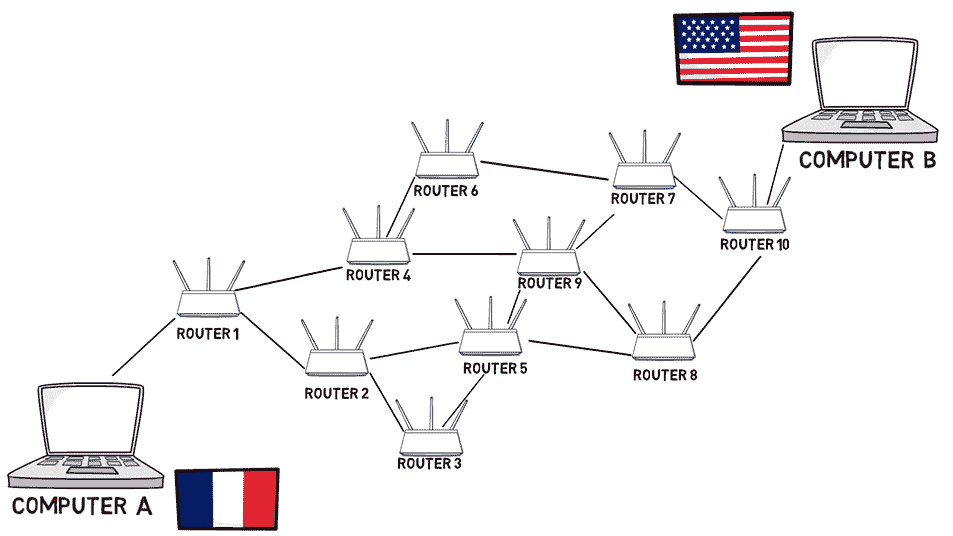

A network diagram with Computer A in France, Computer B in the US, and 10 routers in between (Source: [Brief](https://www.youtube.com/watch?v=Q3qqd6Y2FbQ&ab_channel=Brief))

我们这里有两台电脑，一台在法国，一台在美国。当然，它们没有直接联系。相反，它们通过被称为**路由器**的第三层设备连接在一起。

哪一层负责每个连接？

考虑计算机 A 和路由器 1 之间的连接。第二层负责这种连接。路由器 2 和路由器 5 的连接呢？对，这是第二层。这同样适用于两个直接链接的设备之间的每个连接。

第三层负责定义路由，即从计算机 A 发送到计算机 B 的消息将通过路由器 1、2、5、8 和 10，而不是以其他方式。

注意，每一层可能有不同的实现。例如，我们可能有第二层的不同实现。因此，虽然计算机 A 和路由器 1 之间的连接可能是通过以太网电缆，但路由器 1 和 2 之间的连接可能是无线的，并且使用 WiFi。路由器 2 和路由器 5 之间的连接可能使用信鸽，而路由器 5 和路由器 9 之间的连接也将使用 WiFi。

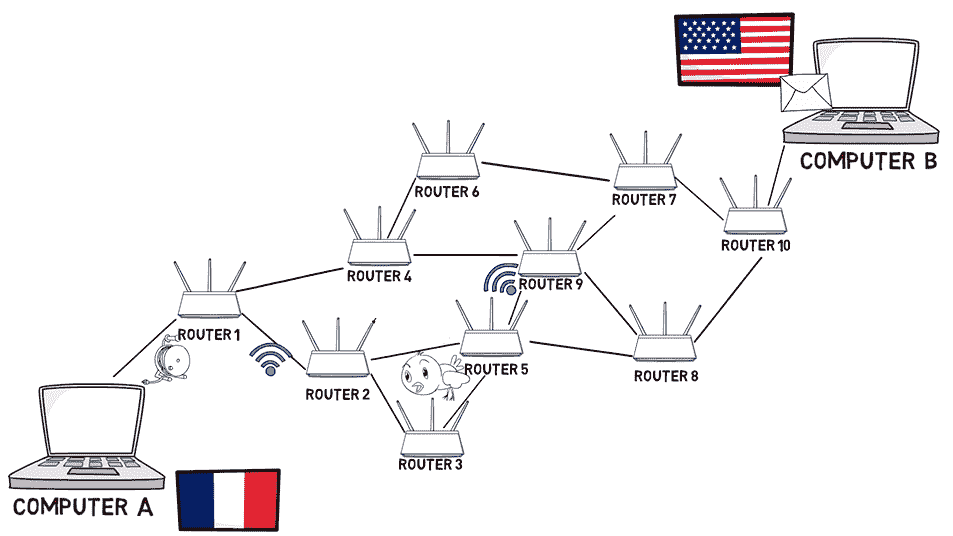

The second layer may be implemented differently on every link (Source: [Brief](https://www.youtube.com/watch?v=Q3qqd6Y2FbQ&ab_channel=Brief))

第三层不关心这些变化，但是第二层肯定关心。如果从路由器 2 到路由器 5 传输数据的信鸽生病了，第二层就要处理了。数据链路层还必须确保路由器 1 和 5 之间的空中传输数据有效无误。

## 中期总结

到目前为止，我们已经讨论了五层中的三层。概括一下:

*   物理层负责通过网络传输单个比特位`1`或`0`。
*   数据链路层负责在直接链接的设备(即通过单跳连接的设备)之间传输数据。
*   第三层负责在通过多跳连接的主机之间传输数据。它决定了路由，即数据包将要经过的路径。

## 第四层——运输层

第四层是端到端层。也就是说，它负责从源一直到最终目的地的通信。

它允许多个服务的多路复用。例如，一台服务器可以作为 Web 服务器，也可以作为邮件服务器。当客户端转向该服务器时，客户端应该能够指定它想要访问哪个服务。第三层指定服务器的地址，传输层识别哪个**服务**与当前通信相关。

此外，传输层*可以*确保可靠性。因此，当这一层从上层接收数据时，它会将其拆分成数据块发送出去，并确保所有这些数据块都正确到达另一端。

请注意，网络层通常是*不*可靠的。数据包可能以不正确的顺序到达，它们可能带着不正确的数据到达，甚至根本没有到达。可靠的传输层确保数据被正确接收。

在这一层，数据报被称为**段**。

再次考虑下面的网络图:

The network diagram again (Source: [Brief](https://www.youtube.com/watch?v=Q3qqd6Y2FbQ&ab_channel=Brief))

哪一层负责什么？

我们已经说过，网络层负责路由，即数据包传输的路径。我们还提到，第二层负责两台直接相连的设备之间的数据传输。例如，路由器 1 和路由器 2 之间的链路。

第四层将网络图视为一个抽象的云。它不知道路由器，也不关心网络结构或路由。它假设网络可以从一端向另一端发送数据包:

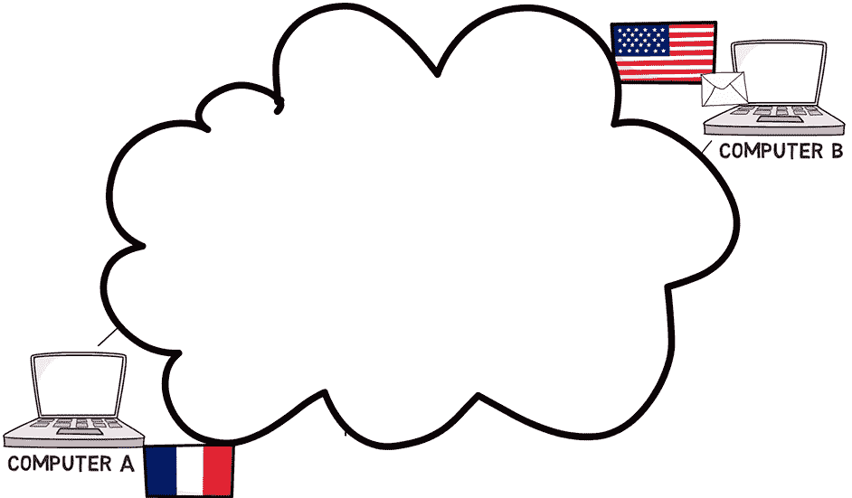

The fourth layer sees the network as an abstract cloud (Source: [Brief](https://www.youtube.com/watch?v=LYH4DwydVAM&ab_channel=Brief))

传输层确保端点可以通过不同的服务进行通信，例如 web 和电子邮件。此外，它可能会确保连接是可靠的。

一个例子是确认每个接收到的数据段。例如，当计算机 A 向计算机 B 发送一个数据段时，计算机 B 将发送一个特殊的确认数据段，宣布它已收到该数据包。

## 第五层——应用层

最后但绝对不是最不重要的，我们有第五层，或**应用层。**这一层为用户的应用提供服务，包括 web 服务、IP 语音(VoIP)、网络游戏、流媒体等。

根据分层模型，第五层根本不关心网络。它依靠第四层以及更低的层将数据从一个端点传输到另一个端点。第五层将使用该服务来满足应用程序的各种需求。

不同的协议将用于不同的应用。例如，HTTP 协议通常用于在万维网上提供网页服务。SMTP 是用于电子邮件的协议，FTP 用于交换文件，还有很多很多。

# 什么是封装？

网络的目标是将数据从一台主机传输到另一台主机。

为了实现这一目标，每一层都向数据添加自己的**头**。报头包含特定于该层的信息，它位于数据本身之前。

考虑这样一种情况，我们有一个查找服务，用于在给定人名的情况下查找一个人的电话号码。数据由人的名和姓组成。

在发送数据包之前，第五层可能会添加自己的**报头**，说明这是一个请求数据包。报头还可以指定这是一个从人名映射到电话号码的请求，而不是相反。

Header of the 5th layer, with data (Source: [Brief](https://www.youtube.com/watch?v=DBLtFjrTvD0&ab_channel=Brief))

然后，第五层将数据传递给第四层。请注意，第四层将一切视为数据——1 和 0。它不关心第五层是否添加了标题，也不关心标题中写了什么。

然后，第四层添加自己的报头。例如，它可能指定所请求的服务是姓名和电话服务。它还可能包含数据包的序列号，以便以后识别。

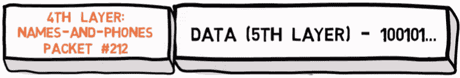

Header of the 4th layer, with data which includes the 5th layer's header (Source: [Brief](https://www.youtube.com/watch?v=DBLtFjrTvD0&ab_channel=Brief))

然后，第四层将数据包传递给第三层。同样，第三层将把它接收到的所有内容——包括数据本身、第五层添加的报头和第四层添加的报头——简单地视为一个数据块。

然后，第三层将添加自己的头。例如，它可能包括数据包的源地址和目的地址。

Header of the 4th layer, with data which includes the 4th layer's header and data (Source: [Brief](https://www.youtube.com/watch?v=DBLtFjrTvD0&ab_channel=Brief))

这个过程一直在继续。因此，每一层都会在数据包中添加自己的报头*。这个过程叫做**封装**。

另一方面，接收方收到数据包，需要读取并删除报头。

*第二层可能还包括一个*尾部*——数据后面的一个附加位块，包含一些信息。

# 把所有的放在一起

既然我们已经涵盖了五个层次，让我们有一个例子使用所有他们在一起。

比方说，当我们正在阿根廷旅行时，我们想给住在法国的朋友发送视频文件。为此，我们使用电子邮件服务。

第五层定义了电子邮件的传输方式。例如，它包括发件人和收件人的电子邮件地址。它包含标题和消息正文。它要求我们遵循一个特定的电子邮件地址模板，这将包括在这一层的标题。

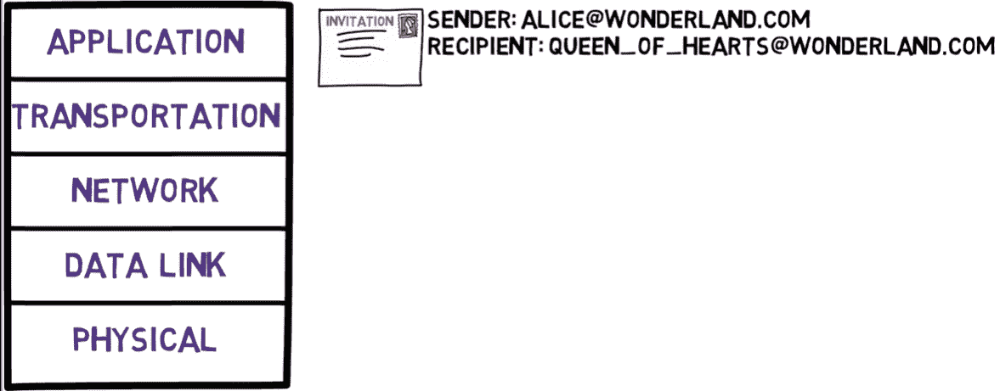

The five layers model, with an example of sending an email (Source: [Brief](https://www.youtube.com/watch?v=LYH4DwydVAM&ab_channel=Brief))

然后，第五层使用第四层，以便将电子邮件分割成块。当然，每个块也将携带第四层的头。它还用于说明我们目前正在使用电子邮件服务。

在这种情况下，我们肯定希望连接是可靠的——这样接收器就能够正确播放我们的视频文件。因此，第四层也将处理可靠性。在接收端，它可能会为收到的每个数据包发送一个确认数据包。

第三层将为每个要发送的数据包定义最佳路由。它可能为不同的数据包选择不同的路由。其中，它的报头将包含数据包的源地址和目的地址。

第二层将负责两台直接相连设备之间的每条链路。其报头将包含每台设备的 MAC 地址。

第一层负责编码所有的 1 和 0，并通过线路传递它们。然后，在另一端解码和读取这些 1 和 0。在这一层，我们实际上没有报头，因为它只由单个比特组成。

这样，每一层都使用下层提供的服务，通过网络传输数据的巨大问题就变得可行了。多神奇啊。

# 摘要

在这篇文章中，你学习了什么是五层模型以及为什么我们需要层。你现在应该明白每一层负责什么，你可以把你在计算机网络中遇到的每一个话题都装进这个模型。

## 关于作者

奥马尔·罗森鲍姆是 [Swimm](https://swimm.io/) 的首席技术官。他是简介 [YouTube 频道](https://youtube.com/@BriefVid)的作者。他还是一名网络培训专家和 Checkpoint Security Academy 的创始人。他是[计算机网络(希伯来语)](https://data.cyber.org.il/networks/networks.pdf)的作者。你可以在推特上找到他。

### 附加参考

*   [电脑网络播放列表-在我的简短频道](https://www.youtube.com/playlist?list=PL9lx0DXCC4BMS7dB7vsrKI5wzFyVIk2Kg)上。
*   [用通俗易懂的英语解释的七层模型](https://www.freecodecamp.org/news/osi-model-networking-layers-explained-in-plain-english/)
*   [TCP/IP 模型–解释的层和协议](https://www.freecodecamp.org/news/what-is-tcp-ip-layers-and-protocols-explained/)