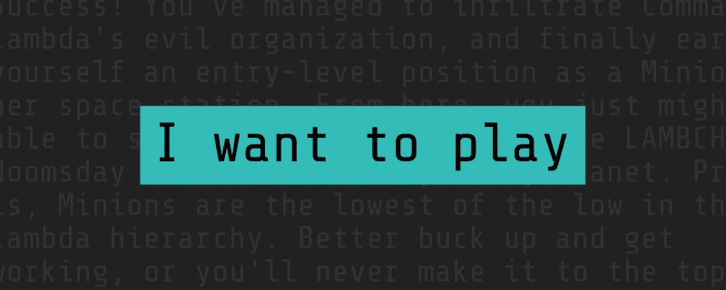
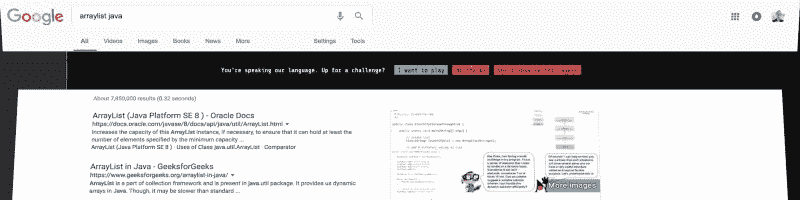
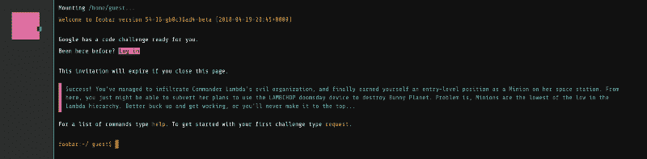
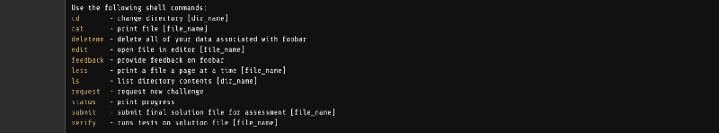
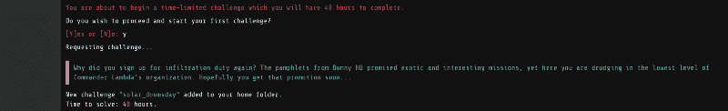
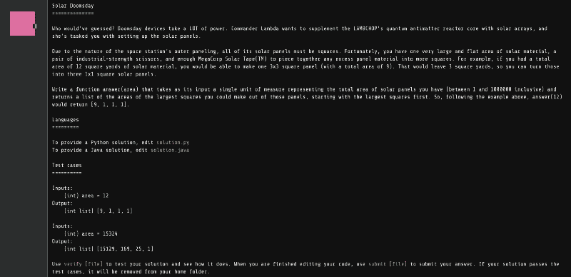

# Foobar 挑战:谷歌对开发者的隐藏测试

> 原文：<https://www.freecodecamp.org/news/the-foobar-challenge-googles-hidden-test-for-developers-ed8027c1184/>

丹尼尔·西蒙斯

# Foobar 挑战:谷歌对开发者的隐藏测试



你只是坐在办公桌前，想着自己的事情，努力完成一些工作。然后，不可避免地，您遇到了一个小障碍:您的代码抛出了一个神秘的错误消息。

你认为“没问题”。这不是你的第一次竞技表演。因此，您将错误信息逐字复制并粘贴到 Google 中，看看您会得到什么。

运气不好。

有大量的搜索结果，但没有一个符合你的情况，足以真正提供一个有用的答案。

于是开始了创造性的谷歌搜索过程。你尝试了错误+你使用它的上下文的几种组合。您可以尝试包含您正在使用的库的名称。你知道你越来越接近…

现在，在第六次尝试时，您尝试了另一种搜索词组合，并按下 return 键。页面加载完毕，您刚刚开始浏览结果，突然，您的浏览器窗口打开了，您看到了以下内容:



> “你在说我们的语言。准备好接受挑战了吗？”

“等等，什么？”

“这是哪里来的？”

“来自谷歌的某种挑战……这是基于我的搜索历史吗？”

你完全忘记了代码中的错误。你现在完全沉浸在你发现自己所处的奇异情况中。而且，尽管所有这些已经很有趣了，你会注意到一些只会增加阴谋的东西。在消息旁边，您会看到第一个按钮写着:

> “我想玩”

哦，所以这是一个**游戏**？有意思…

克服好奇心，你接受了。浏览器窗口的裂口慢慢变大，露出一个大黑屏，然后消失。然后你会被重定向到[www.google.com/foobar/](http://www.google.com/foobar/?eid=...)。黑屏淡入，出现一些文本。它看起来像一个 Unix 外壳。

页面的美感(复古的电脑字体，隐藏的终端，缺乏现代的用户界面)结合“007——你的使命，你应该选择接受它”的感觉，这整个体验让你感觉自己被带入了一个秘密的世界。你现在完全全神贯注。

屏幕顶部有一些文本:

> “谷歌为你准备了代码挑战”

就在下面，有一段蓝色的文字为一场科幻冒险做好了准备:

> “成功了！你已经设法渗透到指挥官拉姆达的邪恶组织，并最终为自己赢得了一个入门级的职位，成为她的空间站上的一个奴才。从这里，你也许可以颠覆她用小羊排末日装置摧毁兔子星球的计划。问题是，奴才是 Lambda 等级中最底层的。最好振作起来，开始工作，否则你永远也不会成功……”



“那好吧。所以看起来我要么探索终端，要么开始挑战……”

你的好奇心再次战胜了你，你想“我不能不四处打探一下就开始游戏”。所以你输入“帮助”然后按回车键。弹出一个 shell 命令列表。



“很有意思。因此，我们显然将使用文件系统。但这是一个非常有限的选择列表。”

您决定查看是否有任何未列出的常用命令可用，因此您尝试了一些简单的命令:

```
foobar:~/guest$ pwd
```

有用！你看:

```
/home/guest
```

太棒了。

“好吧，让我们看看主目录。那里肯定会有更有趣的东西”

所以你试着:

```
foobar:~/guest$ cd ..
```

还有…

没什么。

你得到一个没有错误的新行，但是当你再次运行`pwd`时，只是为了检查，你仍然看到`/home/guest`。好吧，这可能不是你所希望的塞满复活节彩蛋的开放世界 unix 外壳。所以你决定继续挑战。

你输入“请求”这个词，然后按回车键。

将出现一个提示，警告您这是一个限时挑战，您将有 48 小时的时间来完成它。

“哇。好，所以是定时的……”

您同意并继续。



更多的科幻叙事，然后你看到一个叫`solar_doomsday`的东西被添加到了你的 home 文件夹。因此，您导航到该文件夹，打开它，找到四个文件:

```
constraints.txtreadme.txtsolution.javasolution.py
```

Readme 似乎是一个显而易见的起点。您打开自述文件，看到以下内容:



“好吧”你想“当你去掉叙述的时候，他们想让我写一个函数，返回所有平方数(包括 1)的排序数组，这些平方数加起来就是一个给定的数，从最大的开始。”相当酷。

"所以这就是谷歌用来测试解决问题能力的那种挑战？"

“嗯，我已经走了这么远了。不妨试一试！”

#### 关于 Foobar 挑战

以上是对谷歌 Foobar challenge 的描述:Chrome 中的一种复活节彩蛋，表面上是用来为谷歌的工程团队寻找新的人才；虽然谷歌似乎没有以任何有意义的方式承认 Foobar(至少，我没有发现)。然而，经历过这一过程的开发人员提供了大量第一手资料，清楚地说明了这是怎么回事。

Foobar challenge 的独特之处在于它会找到 T2，你会找到 T3。而不是不请自来的招聘邮件或推销短信“找到你”。它通过跟踪你的搜索活动来找到你，并(表面上)将其与谷歌工程部门的已知需求进行匹配。此外，谷歌搜索结果页面这一在其他方面如此稳定&不变的东西的突然视觉中断，足以让你真正被吸引进去——这无疑是对谷歌资产的一次非常聪明的使用。

鉴于谷歌可以接触到(1)你的个人浏览活动和(2)你浏览互联网的平台，他们真的有绝佳的机会以一种真正直接和吸引人的方式抓住有才华的人，无论他们在哪里。他们似乎试图根据你的搜索历史找出你的基本技能水平和能力范围，然后试图通过这个“游戏”吸引你进入他们的人才漏斗，如果成功完成，可能会也可能不会获得面试邀请。

第一次提到 Foobar 挑战赛似乎是在 2014 年 HackerNews 上的[这篇文章](https://news.ycombinator.com/item?id=8588080)。

#### 旁注:withgoogle.com

当你在 Foobar challenge 页面上时，如果你打开 devtools 并查看 DOM，你会看到整个页面都在一个 iFrame 中，它的来源是:[https://foobar.withgoogle.com/?eid=...](https://foobar.withgoogle.com/?eid=...)当我第一次看到它时，我想“用 google.com？那究竟是什么？”

同样，这完全偏离了 Foobar 挑战的主题，但事实证明，挑战本身存在于谷歌的“副项目领域”中，名为“withgoogle.com”。如果你深入研究一下，你会发现其他一些非常有趣的项目。以下是我遇到的几个例子:

[纸信号](https://papersignals.withgoogle.com/)、[快画](https://quickdraw.withgoogle.com/)、 [CSFirst](https://csfirst.withgoogle.com/) 、 [QiblaFinder](https://qiblafinder.withgoogle.com/) 、[ai projects](https://aiyprojects.withgoogle.com/)、[科学杂志](https://sciencejournal.withgoogle.com/)