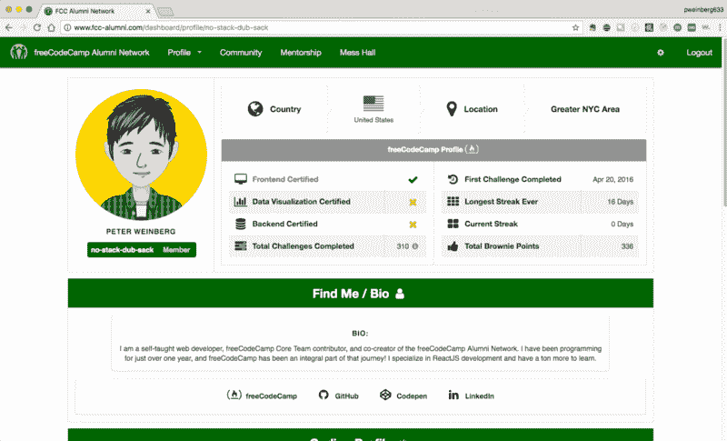
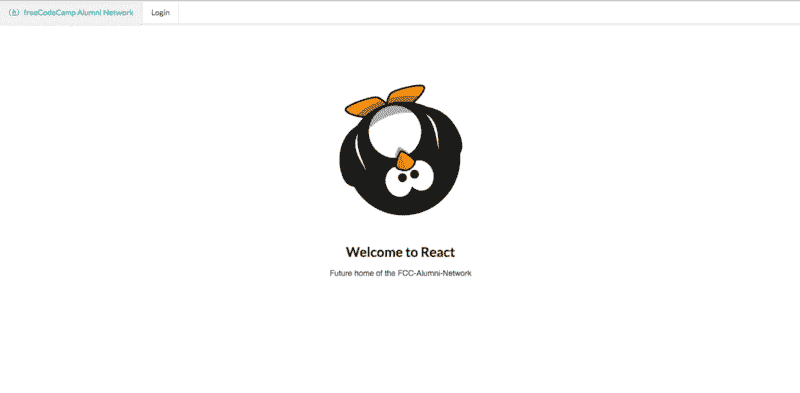
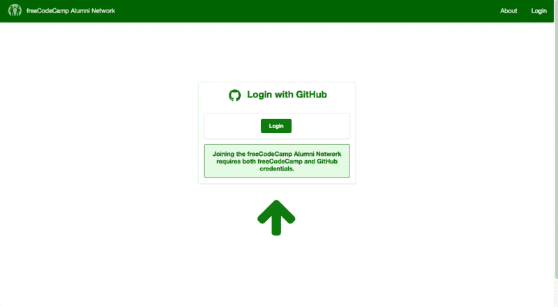
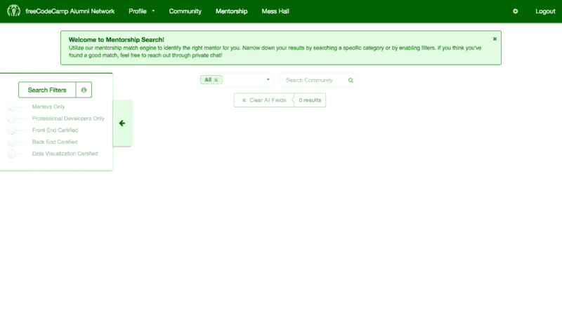
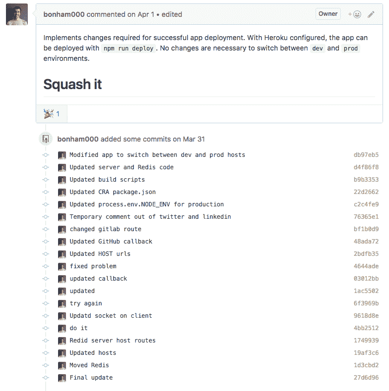
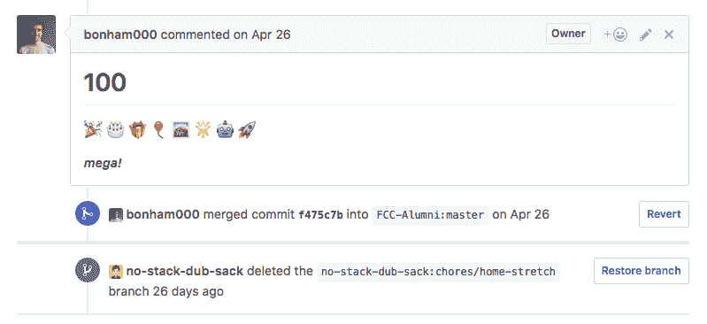
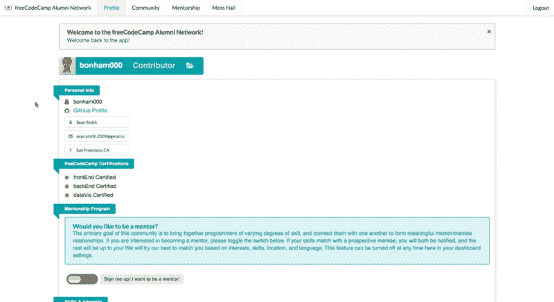
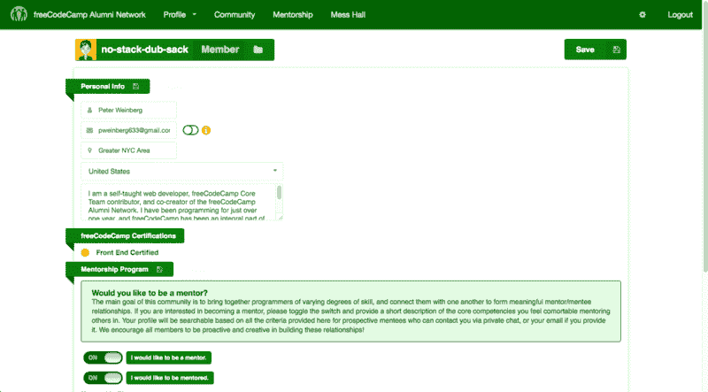

# freeCodeCamp 校友网络:FCC 校友的本土导师网络

> 原文：<https://www.freecodecamp.org/news/the-freecodecamp-alumni-network-a-homegrown-mentorship-network-for-fcc-alumni-529e4531c34f/>

彼得·魏因贝格

# freeCodeCamp 校友网络:FCC 校友的本土导师网络

My “public” profile page — visible only to other FCCAN members

去年，我几乎把所有的空闲时间都花在了学习编码上。我一直是 freeCodeCamp 的定期贡献者，从事各种项目，如新的 [React](http://hysterical-amusement.surge.sh/) 和 [Beta](https://beta.freecodecamp.com/) 课程、[可测试项目](https://github.com/freeCodeCamp/testable-projects-fcc)，一个加载 CDN 的前端测试套件。

但是大约 3 个月前，我开始大规模提升我的编码技能。我只有一个标准:我想接受我最大的编码挑战。

最终的结果是 2 名营员努力、60 天开发和数百小时工作的结果。当然，我非常兴奋地向大家介绍一个项目:freeCodeCamp 校友网络(FCCAN)！

FCCAN 是 freeCodeCamp 社区的扩展，至少有一个 freeCodeCamp 证书的持有者可以来连接。

简而言之，我们的目标是促进有经验的营员之间有意义的关系。尤其是那些希望提高技能和/或与其他营员分享专业知识的人。这里有一些我们知道你会喜欢的功能:

*   **无缝用户认证**。使用您的 GitHub 帐户登录，并使用您的 freeCodeCamp 凭据进行验证。
*   **导师机会**。面向未来导师和学员的可选导师计划。
*   **个人简介**。确定编码技能和兴趣、个人统计数据、导师地位等等。
*   **会员搜索**。一个搜索引擎，根据技能、兴趣、位置等帮助你找到其他成员(和潜在的导师)。
*   **协作。**寻找新应用的帮助？在这里与其他营员分享你的开源项目。
*   保持联系。确定了潜在的导师？通过 FCCAN 私人聊天，或访问公共房间谈论所有代码。

FCCAN 是一个平台，可以帮助你把你和其他营员的关系提升到一个新的水平。

但是要完全实现这个愿景，我们需要你，营员们，和我们一起前进。我们邀请您访问该应用程序并查看我们的“关于”页面。如果你感兴趣，注册看看它到底是怎么回事！

我们的新家是 www.fcc-alumni.com。

总有改进的空间，但是我们对我们拥有的 MVP 很满意，我们希望你也一样。

本着 freeCodeCamp 和开源软件的精神，这个项目是 100%开源的。我们鼓励您查看[回购](https://github.com/FCC-Alumni/alumni-network)并探索代码库。

这个项目将继续积极开发，所以如果你发现一个 bug 或者对某个特性有建议，请随时[提出问题](https://github.com/FCC-Alumni/alumni-network/issues/new)。如果你有兴趣投稿，我们已经从我们的团队和测试人员那里收集了[一些建议](https://github.com/FCC-Alumni/alumni-network/issues)，我们希望能得到一些帮助！如果您想了解更多信息，请查看我们的[投稿指南](https://github.com/FCC-Alumni/alumni-network/blob/master/CONTRIBUTING.md)。

现在你已经看到了这个项目(并建立了一个完全 rad 的个人资料！)，我希望你能留下来听我们的故事。

三个月前，我认为编写这种级别的代码是我永远也做不到的。我知道很多露营者都会有这种感觉。

因此，如果你感兴趣，请继续阅读，了解更多关于****免费代码营校友网络**以及两个免费代码营成员如何在短短两个月内开发了一个复杂的全栈网络应用。**

**我一年多前开始编程，我的旅程是完全自学的。在这段短暂的历史中，我几乎完全依靠 [freeCodeCamp](https://freecodecamp.com/) 来提高我的技能。**

**在此期间，我学会了一些 JavaScript、React、HTML5、CSS3 和 Sass 的基本技能。你可能会认为这些是 freeCodeCamp 当前课程中宣扬的一些核心技能。**

**虽然我已经完成了很多，但我发现我已经到达了一个平稳期。对我完全不面向技术的大脑来说，这看起来像是快速的进步，实际上只是勉强将我定位为初级程序员。**

**我知道我需要一个更强大的技能库。但是，从基本的前端项目过渡到从零开始开发生产级全栈应用程序，感觉就像是一个我永远无法跨越的鸿沟。但是，我知道我需要某种方式，所以我开始探索一些新的途径。**

**我发现的一件事是，当我和其他程序员一起工作时，我学得更多更快。所以我联系了吉斯·麦卡利斯特(T1)(又名 T2·吉斯被带走，T3)，他是[钦古团队](https://chingu-cohorts.github.io/chingu-directory/)的父亲和组织者。吉斯经常在团队中支持团队项目，他给我安排了一个团队，这个团队最近完成了他们自己的一个项目。**

**这个项目是 Campfire Stories(一个以自由代码营为中心的应用程序，讲述营员的故事)，他们需要一些帮助来维护和改进他们的遗留代码库。所以我和其中一个创作者通了电话，让我了解一下最新情况。哇…应用程序的复杂性和架构对我来说太复杂了。**

**尽管我对他们的技术非常熟悉，但结构和编码模式对我来说似乎完全陌生。我比我意识到的要落后得多，我离开了那个电话，感觉有点沮丧。我在过去几个月中获得的所有信心几乎都消失了。**

**我怎么能学会这些东西呢？后端完全令人生畏，我几乎不理解状态管理，复杂的视图超出了我的处理能力。**

**这花了我几天时间，但我最终克服了我的失败主义。尽管我被篝火故事代码库的复杂性弄得不知所措，但我却比以往任何时候都更有动力去完成这项工作。只是我的方法不对。**

**我意识到，我成功的秘诀是从零开始构建和定义架构。这样我就可以跟踪从零到复杂的过程中的每一步。**

****

**所以，在第一次失败的尝试之后，我决定是时候尝试一下我自己的想法了。**

**受到篝火故事的启发，我也想建立一个与 freeCodeCamp 相关的应用程序。关于 freeCodeCamp，我最喜欢的事情之一是我经常听到的成功故事，关于人们从 freeCodeCamp“毕业”，并在现实世界中获得编码工作。**

**这些故事是其他营员成功的重要部分。知道彩虹的尽头有一桶金是一个巨大的动力！**

**考虑到这一点，我设想了一个地方，在那里营员们可以相互联系并追踪彼此的成就。随着时间的推移，这个想法可能会有所改变，但这已经足够开始行动了。我把这个想法告诉了吉斯，他帮助我进一步发展这个想法，不久之后，我们组建了一个团队。**

**我非常兴奋，这正是我需要承担的那种项目，让我的技能达到我想要的水平！一旦我们定义了我们的最小可行产品(MVP)的样子，很明显这个项目对于一些初级程序员来说是相当雄心勃勃的。我们需要:**

*   **工作用户注册/认证**
*   **存储用户数据的数据库**
*   **用户输入、编辑和维护个人数据的界面**
*   **用户在应用程序中相互通信的方式**
*   **供用户相互查找的搜索功能**
*   **从一个视图到下一个视图的有效路由**
*   **管理复杂应用程序状态的状态管理**

**这只是为了让我们离开地面！我的愿望实现了——这是我接手过的最复杂、最具挑战性的项目。**

**我们定义了我们的技术堆栈并开始工作。我们选择了经典的 freeCodeCamp，并选择 ReactJS 作为 JavaScript 框架，在完全接受这一选择的过程中，Redux 和 React-Redux 是对状态管理的自然补充。一个 MongoDB 数据库和一个 Express/NodeJS 后端完善了我们应用程序的核心。我们用 Create-React-App 引导我们的项目，为 Sass 支持做了一些调整，安装了一大批 NPM 包，然后就上路了。**

**到目前为止，我已经做了足够的研究来了解这些技术。但是除了 React 和 Sass，我从来没有碰过一个。不用说，这对我将是一个挑战。**

**然而，通过一些结对编程，以及与我的队友[肖恩·史密斯](https://github.com/bonham000/)密切合作，我能够克服我遇到的每一个技术障碍。**

**在配置 Create-React-App 与代理服务器一起工作之后，我们的第一步是实现用户认证和注册。这是一个相当大的挑战——我们希望将注册与应用程序本身分离开来(我们需要管理的敏感数据更少，您需要的用户名和密码更少)。因此，通过 PassportJS 启用基于 GitHub 的登录似乎是一条可行之路。**

**然而，我们还需要实现某种用户验证过程，因为我们希望强制成员必须是 freeCodeCamp 的校友(即至少获得一个证书的营员)。在设计了使用 [Axios](https://github.com/mzabriskie/axios) 验证用户证书的[端点重定向计数技术](https://github.com/FCC-Alumni/alumni-network/blob/master/server/routes/user.js#L36)之后，我们终于上路了！**

**这是我第一次介绍后端编程，也是这个应用的一个重要里程碑。现在我们可以成功地登录和注销，真正的工作可以开始了。**

**

Our earliest iteration of successful user login and registration (shout out to the Chingu Penguins Cohort!).** **

We’ve come a long way: A look at our current user authentication process.** 

**接下来是解决国家管理问题。例如，要创建 FCCAN 用户体验的核心——用户资料页面，我们需要实现 CRUD 功能，或者创建、读取、更新和删除。**

**preferences 页面是高度可编辑的——十几个字段构成了一些复杂的状态，对于 React 来说太复杂了，无法单独管理。这是 Redux 的工作。这意味着我们在跨越堆栈两端的 3 个不同级别上管理状态:React 在组件级别，Redux 在存储级别，MongoDB 在数据库级别。**

**弄清楚如何有效地操作和管理一个复杂的状态对象被证明是一个巨大的挑战。然而，一旦我们把它写下来，我们就能够在整个应用程序中一遍又一遍地重用这个相同的范例。**

**这是另一个很好的例子，与我们的 CRUD 例子不同，它只使用 React 和 Redux(见下面的 gif):**

****

**请注意，即使我已经离开了搜索页面，当我返回时，状态仍然和我离开时一样。**

**组件卸载后，React 在本地管理的状态会立即清除，但是将该状态传递给 Redux 允许我们在 React 组件的生命周期之外保留该状态，并且在需要时将该状态传递给数据库允许我们在 Redux 存储的生命周期之外保留该状态，Redux 存储的生命周期只在用户会话持续时才存在。**

**FCCAN 应用程序中最复杂的 CRUD 功能实现是我们的聊天功能。虽然这看起来不像是典型的 CRUD 实现，但核心原理是完全相同的。**

**基本上，数据库是我们唯一的事实来源。对于任何 CRUD 操作，我们都发布到处理该操作的路由。当且仅当我们从服务器获得一个成功的响应时(表明数据库是该动作的最新版本)，我们通过 Socket.IO 广播一个实时更新。同时，我们通过 Redux 发送一个对 UI 执行更新的动作，其中聊天数据使用 ImmutableJS 数据结构持久化。**

**这样，如果我们实际上已经首先更新了数据库中的数据，我们只向用户显示更新。使用这种模式，我们能够实现一些核心的聊天功能，包括赞、编辑和删除消息，而且只是为了好玩，还有一些非常酷的表情符号！**

**在继续检查 MVP 特性清单的同时，我们必须考虑设计的每一步。从这个角度来看，我们早期将 Semantic-UI 作为 CSS 库的决定被证明是明智的。我们大量使用了它，并对其时尚、易于使用的样式和布局选项、语义-UI-React 集成以及深思熟虑的响应式设计功能非常满意。当谈到后者时，当默认休息和媒体查询不够时，我们有时会用 [React-Screen-Size](https://github.com/eloytoro/react-screen-size) 来补充语义。**

**为了更细粒度地控制样式，我们用一些定制的 Sass 样式表和[样式化组件](https://github.com/styled-components/styled-components)来补充语义。Styled-Components 是 React 的一个较新的 CSS/JavaScript 包，允许更直观和有条件地呈现 CSS，直接写入组件文件。我强烈建议你去看看。**

**一旦我们完成了核心功能，我们就为下一个大步骤做好了准备:部署。**

**我以前从未部署过应用程序，很快发现这带来了一系列全新的挑战。**

**我们配置了 Heroku，订阅了 MongoDB 和 Redis 的云托管实例，经过数小时的故障排除和 19 次提交后，我们到达了另一个重要的里程碑。FCCAN 的测试版终于上线了！**

**

Deployment looks like fun? It wasn’t.** 

**尽管这并不像我希望的那样辉煌。一旦应用程序上线，一些新的问题立即暴露出来。首先，我们需要一个更强大的移动用户界面(到目前为止我们还无法可靠地测试)。当然，跨设备兼容性是一个主要问题。**

**但是，我们在最后阶段。几乎到了那里，我们都非常积极地看到这个项目通过完成。**

**

Celebrating our 100th PR!** 

**在接下来的几周里，我们忙于对我们的应用程序进行最后的润色。更不用说解决几个大问题了。例如，令人震惊的是，如果有人在登录时分心，并且从未尝试“验证”他们的帐户，整个应用程序将会崩溃！**

**作为最后一步，我们决定放弃默认的语义用户界面主题，它感觉不够时尚。此外，我们希望露营者有宾至如归的感觉，即使是第一次来。我们认为实现这一点的最佳方式是尽可能地重新创建 freeCodeCamp 主题，而不必回溯和妥协我们已经做出的风格选择。**

**因此，我们没有通过 CDN 引入语义，而是使用他们的 Gulp 构建工具和自定义主题功能，并将包直接构建到我们的项目中。结果棒极了。该网站从一个俗气和不专业的蓝绿色变成了一个鲜明和杰出的 freeCodeCamp 绿色。**

**

Before custom theming (above), and after (below). What a difference!** ****

**经过 60 天的开发和每周 20-30 小时的工作，我们差不多完成了。我们对现场用户进行了一轮简短的测试，现在，当我写这篇文章时，我们终于准备好正式发布了！**

**这被证明是我一直在寻找的最典型的经历。在整个过程中，随着事情变得越来越复杂，现代单页面 web 应用程序的架构和内部工作方式对我来说变得越来越清晰。随着代码库的增长，我一直在那里，要么贡献代码，要么审查和理解我没有的代码。**

**现在我们已经结束了，我不能再重复足够多的时间来丰富我的经历。关键的要点是:有时候一小步一小步的走是行不通的。如果你对自己的进步速度感到沮丧，或者你觉得自己已经停滞不前，不要放弃。**

**相反，走出去，找到比你以前做过的任何事情都难两到三倍的事情。**

**这将会很困难，有时任何人都会觉得不可能。但是最终完成挑战的回报，以及你在这个过程中获得的知识的价值是不可估量的！**

**无论是 1 人还是 100 人加入 freeCodeCamp 校友网络，这都是值得的。如果你能理解我在开始开发这个项目之前的心态，我会鼓励你思考什么代表你的下一个最大挑战，攻击它，并拥有它！我希望你能和我一样从中得到乐趣。**