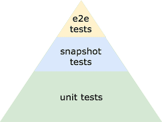
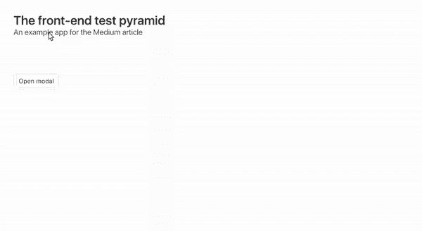
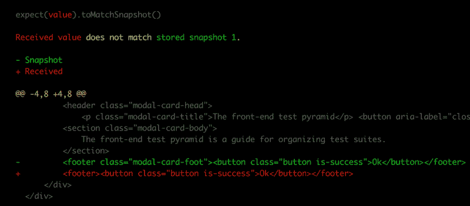

# 前端测试金字塔:如何重新思考你的测试

> 原文：<https://www.freecodecamp.org/news/the-front-end-test-pyramid-rethink-your-testing-3b343c2bca51/>

作者:艾德·耶伯格

# 前端测试金字塔:如何重新思考你的测试


如果你正在测试前端应用，你应该了解前端测试金字塔。

在本文中，我们将了解什么是前端测试金字塔，以及如何使用它来创建全面的测试套件。

### 前端测试金字塔

前端测试金字塔代表了前端测试套件应该如何构建。

理想的测试套件由单元测试、一些快照测试和一些端到端(e2e)测试组成。



The front-end test pyramid

这是[测试金字塔](https://martinfowler.com/bliki/TestPyramid.html)的改进版本，专门用于测试前端应用。

在本文中，我们将详细介绍每一种测试类型。为此，我们将为一个示例应用程序创建一个测试套件。

### 该应用程序

为了详细了解前端测试金字塔，我们将看看如何测试 web 应用程序。

该应用程序是一个简单的模态应用程序。单击按钮将打开一个模式，单击模式上的“确定”按钮将关闭该模式。



The finished app

我们将从基于组件的框架构建应用程序。不要担心细节，我们会保持高水平。

这款应用由三个组件组成——一个`Button`组件、一个`Modal`组件和一个`App`组件。

我们要写的第一个测试是单元测试。在前端测试金字塔中，我们的大部分测试都是单元测试。

### 单元测试

单元测试测试代码库的单元。

它们直接调用函数或单元，并确保它们返回正确的结果。

在我们的应用程序中，我们的组件是单元。所以我们将为按钮和模态编写单元测试。没有必要为我们的`App`组件编写测试，因为其中没有任何逻辑。

单元测试将**浅层呈现**组件，并断言当我们与它们交互时它们行为正确。

[浅渲染](https://reactjs.org/docs/shallow-renderer.html)意味着我们渲染组件一层深。这样，我们可以确保我们只测试组件，我们的单元，而不是几层之下的子组件。

在我们的测试中，我们将触发组件上的动作，并检查组件是否如预期的那样运行。

我们不会看代码。但是我们组件的规格看起来像这样:

*   当 displayModal 为 true 时，Modal 具有 is-active 类
*   当 displayModal 为 false 时，Modal 没有 is-active 类
*   单击成功按钮时，Modal 调用 toggleModal
*   单击删除按钮时，Modal 调用 toggleModal
*   单击按钮时，按钮调用 toggleModal

我们的测试将浅层渲染组件，然后检查每个规范的作品。

单元测试应该构成我们测试套件的主体有几个原因:

#### 单元测试很快。

一套数百个单元测试在几秒钟内运行。

这使得单元测试对于开发非常有用。当重构代码时，我们可以更改代码，并运行单元测试来检查这些更改没有破坏组件。我们会在几秒钟内知道我们是否破坏了什么，因为其中一个测试会失败。

#### 单元测试是细粒度的

换句话说，它们非常具体。

如果一个单元测试失败了，失败的测试会告诉我们失败的方式和原因。

单元测试有助于检查我们的应用程序如何工作的细节。它们是开发时最好的工具，尤其是当你遵循测试驱动开发的时候。

但是他们不能测试所有的东西。

为了确保我们呈现正确的样式，我们需要使用快照测试。

### 快照测试

快照测试是拍摄渲染组件的图片并将其与组件的前一张图片进行比较的测试。

用 JavaScript 编写快照测试的最佳方式是使用 [Jest](https://facebook.github.io/jest/) 。

Jest 不是拍摄呈现组件的图片，而是拍摄呈现组件标记的快照。这使得 Jest 快照测试比传统快照测试快得多。

要在 Jest 中注册一个快照测试，您需要添加如下代码:

```
const renderedMarkup = renderToString(ModalComponent)expect(renderedMarkup).toMatchSnapshot()
```

一旦你注册了一个快照，Jest 会处理所有其他的事情。每次运行单元测试时，它都会重新生成一个快照，并将其与之前的快照进行比较。

如果代码发生变化，Jest 会抛出一个错误，并警告标记已经改变。然后开发人员可以手动检查没有类被意外删除。

在下面的测试中，有人从`<foot` er >中删除了`modal-card-foot`类。



A failing snapshot test

快照测试是一种检查组件的样式或标记没有任何变化的方法。

如果快照测试通过，我们知道我们的代码更改没有影响组件的显示。

如果测试失败，那么我们知道我们**影响了组件的渲染，并且可以手动检查样式是否仍然正确。**

每个组件至少应该有一个快照测试。典型的快照测试使用某种状态来呈现组件，以检查它是否正确呈现。

现在我们有了单元测试和快照测试，是时候看看端到端(e2e)测试了。

### 端到端测试

端到端(e2e)测试是高级测试。

他们执行的操作与我们手动测试应用程序时执行的操作相同。

在我们的应用程序中，我们有一个用户之旅。当用户点击按钮时，模式将打开，当用户点击模式中的按钮时，模式关闭。

我们可以编写贯穿整个旅程的端到端测试。测试将打开浏览器，导航到网页，并运行每个操作以确保应用程序正常运行。

这些测试告诉我们，我们的单位正在正确地一起工作。这让我们对应用程序的主要功能很有信心。

有几种方法可以为 JavaScript 应用程序编写端到端测试。像 test cafe 这样的程序可以记录你在浏览器中执行的操作，并作为测试回放。

也有像 nightwatch 这样的项目可以让你用 JavaScript 编写测试。我会推荐使用像 nightwatch 这样的库。它很容易上手，并且测试比记录的测试运行得更快。

也就是说，nightwatch 测试仍然相对较慢。一套 200 个单元测试需要几秒钟来运行，一套 200 个端到端测试需要几分钟来运行。

端到端测试的另一个问题是它们很难调试。当测试失败时，很难找出失败的原因，因为测试覆盖了很多功能。

### 结论

为了有效地测试基于前端组件的 web 应用程序，您需要三种类型的测试。单元测试、快照测试和 e2e 测试。

每个组件应该有多个单元测试，每个组件一个或两个快照测试，以及一个或两个测试多个连接在一起的组件的端到端测试。

整体单元测试将构成你测试的主体，你将有一些快照测试，和一些 e2e 测试。

如果您遵循前端测试金字塔，您将创建具有杀手级测试套件的可维护 web 应用程序。

*你可以在 GitHub 上看到一个包含快照测试、单元测试和端到端测试的[应用示例库。](https://github.com/eddyerburgh/example-front-end-test-pyramid-app)*