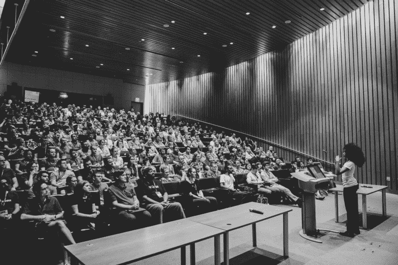

# “我如何开始学习编码？”这个令人沮丧的答案

> 原文：<https://www.freecodecamp.org/news/the-frustrating-answer-to-how-do-i-start-learning-to-code-a243fcf28720/>

by Saron Yitbarek

# “我如何开始学习编码？”这个令人沮丧的答案

几个月来，我一直致力于 [CodeNewbie Challenge](http://bit.ly/2DISkLU) (又名#CNC2018)。这是一个帮助程序员做以下四件事之一的项目:开始编码，写更多的代码，写更多的博客，或者找一份工作。

你选择一个挑战，在 5、7 或 9 周的过程中，你会得到一个每周阅读、研究和家庭作业的任务来帮助你达到目标。它基于强有力的问题、引导性的研究和精选的资源，帮助你找到正确的方向。[你可以在这里了解更多信息并注册(第一个任务将于 1 月 22 日发布，请在那之前注册)](http://bit.ly/2DISkLU)。

这个挑战基于一个非常简单的前提:当你学习编码时，没有一个通用的路线图。很沮丧，但这是事实。

#### 我是如何想到#CNC2018 的

她举起手时，我呷了一口蔓越莓汁。她坐在几乎空无一人的房间中央，耐心地等待着被人注意。他们叫她，她站起来问了一个臭名昭著的问题，“我如何开始学习编码？”

所有的小组成员都转向我，我的胸部收紧。在我们四个人中，我是“新的编码专家”，所以我放下饮料，不情愿地把麦克风拉过来。

我经常被问到这个问题。我一般都会很兴奋的回答。但是今天，我担心我会让她失望。

这是一个看似难以回答的问题。它首先假设*有*个答案；一个单一的，无可争议的，合乎逻辑的答案。它如此关注“开始学习编码”，而不是“我”，但是“我”是最重要的部分。

我过去常常给出有趣、令人满意的答案:从 Ruby 开始，它是世界上最友好的语言！试试 JavaScript，网络语言！使用 Codecademy 给你一点小滋味，它是免费的，你可以从今天开始！

当我感觉更加面向资源的时候，我去我的网站包里拿出几个。树屋非常适合视频和课程。FreeCodeCamp 是一个很棒的 JavaScript 社区和学习资源。查看 Coursera 获得更多计算机科学的选择。你不能忘记优秀的老式 YouTube！搜索一种语言或框架，并选择一个简短的视频让你开始！

我说话时，他们做了激烈的记录，证明我说的是有价值的和正确的。但事实并非如此。

开始编码有很多种方法。有很多东西要学，有很多资源可以挑选。在铺天盖地的选择中，我们寻找一个路线图。要到达这个特定的目的地，我可以采取哪一套连续的步骤？

但是，在我与希望编码的人进行的数百次对话中，我了解到“我如何学习开始学习编码”中的“我”决定了任何这样的路线图，并且每个路线图都是个人的和独特的。

为什么我要学习编码？如果你是专门为了找工作而学习，你的路线图将会与你只是为了好玩而学习大不相同。现在，我们必须考虑你想要什么样的工作，你想挣多少钱，那份工作在哪里(你是愿意跳槽，还是应该专注于本地市场？)，你需要得到这份新工作的时间有截止日期吗？这么多问题。

让我们看看时间和金钱。我可以在这种学习中投入多少？如果我没有很多钱(我认为多少钱是“很多钱”？)，这消除了学习代码选项的一个子部分。如果我没有很多时间，我可以学些什么东西，既容易掌握，又不需要投入太多的时间来开始？为了那种轻松，我牺牲了什么？这么多问题。

接下来，让我们检查社区。在我的生活中，有没有人可以做我的导师、老师，甚至是导师？我是住在一个可以获得面对面支持的地方，还是主要通过网络获得支持？有关系吗？如果我一个人做这些，找一个面对面的课程可能会让旅程更容易。如果我的生活中有开发人员，我可以联系他们来纠正和指导我，让我的旅程更有效率。问题很多。

所有这些问题都非常重要，而且都与你有关。所以我拿着麦克风，深吸了一口气，告诉这个女人这一点。如果能给她一个路线图，一个三步走的魔术，让她到达她想去的地方，那就太好了。但就是没有。

当我完成时，我停顿了一下，看着她，然后在房间里看看这个答案会被接受。我做好了失望的准备。其他小组成员点点头，房间里的人都笑了，这位女士似乎真心感激。惊讶，但反思。我如释重负地叹了口气，喝了一口果汁。

从那以后，这一直是我的首选答案，我能感觉到它有多大的帮助。问题是，要从这个答案中获得最大价值，通常需要一次对话，一次来回探索和剖析。我一直在想办法解决这个问题。当有如此多的事情需要考虑，却没有一个正确的答案时，你如何衡量这样一个个人问题的答案呢？你创建了[代码新手挑战](http://bit.ly/2DISkLU)。

随着时间的推移，#CNC2018 将根据您的需求和生活方式，帮助您创建和迭代您的个人路线图、您自己的课程。像大多数冒险一样，和朋友一起做要容易得多。因此，我们创建了一个封闭的脸书小组，以便您可以与他人分享您的成功、经验和故事。

终于发布了，我太激动了。这是崭新的一年，接受新挑战的最佳时机。因此，请加入 [#CNC2018](http://bit.ly/2DISkLU) 并在 1 月 22 日前注册。我很高兴看到您的路线图将带您走向何方。