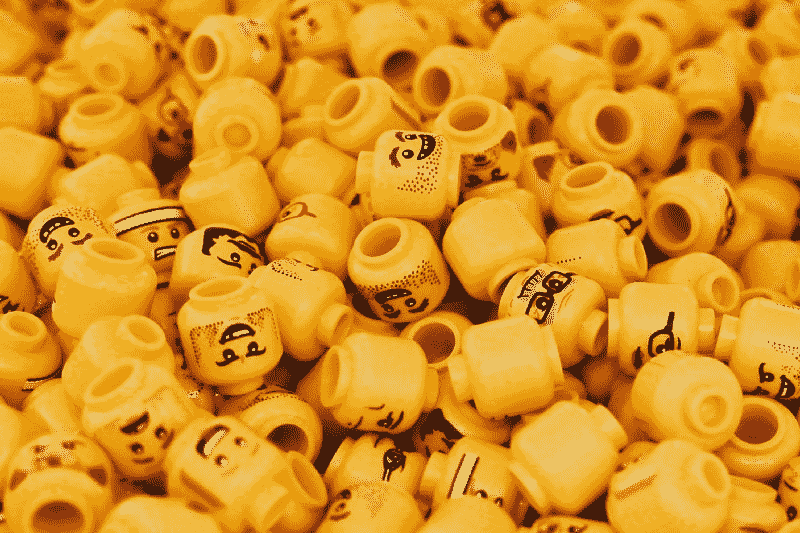
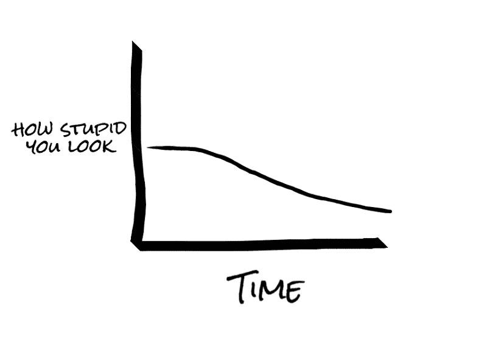
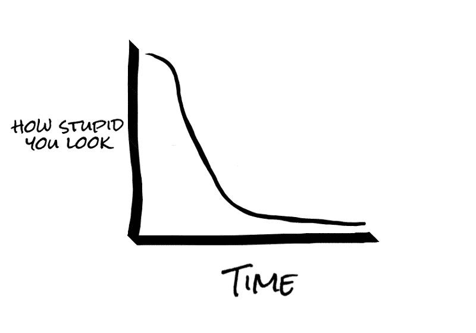

# 学习困难事物的困难之处在于

> 原文：<https://www.freecodecamp.org/news/the-hard-thing-about-learning-hard-things-168e655ac7f2/>

作者 Haseeb Qureshi

# **学习困难事物的困难之处**

没人能教你的东西你怎么学？

无论我在职业生涯中取得了什么样的成功，我几乎都将其归功于我对无组织学习的天赋。当钻研一个前沿领域、寻找一份新工作或创造任何真正的新事物时，这种学习是必需的。值得注意的是，这与学校所教的和大多数人所说的“教育”截然相反

在结构化学习中(就像在学校一样)，有你可以遵循的练习，有指导你的老师，有一条从 A 到 z 的常用路径。困难的部分是每天去做这些工作。

这个应该看着眼熟。大多数人在他们生命的前二十年执行结构化学习的小的、量化的任务，在容易分级的基准上与他们的同龄人竞争。像这样的结构化学习在课堂和小游戏之外基本上是没有用的。

在现实世界中，没有教科书或课程。没办法练。没有持续反馈的来源。没有老师——只有你和你能说服来帮助你的人。

那么如何学习没人能教你的东西呢？在一些很少有人理解的事情上，你是如何成为世界级专家的？

非结构化学习需要走神。你必须自己四处打探，使用试错法，搜索，探索，绊倒和发现。当试图学习没人知道如何做的事情时，通常的格拉德威尔式的“10，000 小时和刻意练习”是不可行的。

但这是这个世界唯一关心的一种学习。

海军拉维康德曾经说过:

> “这个世界奖励你，因为你创造了它不知道如何获取的东西。”

如果有一个结构化的方法来学习一个领域，你可以打赌这个世界不需要你的创造力:它可以自己培养专家。但只要它不能，世界就会慷慨地奖励那些能够征服那个领域的人。

大多数人不擅长无组织的学习。但是你可以改进它。这里有五条原则可以帮助大多数人更好地进行无组织学习。

### 1.选择装傻。

不要试图不显得愚蠢。

不要试图让自己看起来不傻。

大多数人希望有这样的进展:

他们开始时尽量不装聋作哑，假装理解，并希望在他们逐渐学习的过程中，他们的伪装能帮他们渡过难关。问题来了:**当你在伪装的时候，你学到的大部分只是如何伪装得更好。**

隐藏自己的无知是人的本能。你必须对抗这种本能。你的曲线应该是这样的:

你必须在前面看起来很蠢。你必须选择它。

但是“假装直到你成功”呢？我是第一个承认的人，装病对于*进门*绝对至关重要。但是一旦你进去了，你就需要停止伪装，专注于制造它。

诚实面对你知识的局限。反复问一些基本的、显而易见的问题。即使不正确，也要把事情重复一遍，总结一下。一遍又一遍地向别人解释你刚学到的东西，即使你错了。尽可能经常做笔记，即使看起来你不应该做。在其他人都离开后，把聪明人拉到一边，问他们你的问题。

这就是为自己的学习而奋斗的样子。所有最优秀的学习者都这样做，人们因此而尊敬他们。

如果你正在学习一个新的领域或者开始一份新的工作，而你不担心人们会认为你很笨，那么你的学习不够积极。

### 2.问第三个问题。

在莫里哀的戏剧《假想的病人》中，一个病人问一个医科学生，“为什么鸦片能让人入睡？”

医科学生回答道:“因为，正如医生们所了解的，鸦片含有一种*休眠原理*。”几乎任何人(戏剧之外的人)都会问第二个问题:“休眠原理到底是什么？”

学生可能会回答:“为什么，这是使人入睡的物质的基本性质。”

大多数人在这里放弃了。由于无法理解不透明的回答，他们认为自己知道的还不够多，无法评估答案。

但是有些人——那些决心学习的人——会问第三个问题。“我不明白。它包含一个催眠原则，因为它使人入睡？这不是同义反复吗？”

当然，休眠原理是一个笑话。但是你可以想象一种不那么明显的情况。如果主题是关于一些新颖的科学研究呢？或者为什么你们公司所有的小配件都是从中国进口的？或者为什么团队对老板隐瞒销售数字？你会问第三个问题吗——你会坚持理解吗？

这里有强大的要求闭嘴的社会压力。如果你不理解，也许你不配理解。

大多数人保持沉默。

你必须战胜它。你必须大声疾呼，为你的知识而战，即使这意味着看起来很愚蠢或践踏一种规范。很难！但是在你的一生中，这种学习会补偿你所有的社会成本。而且往往不是只有你一个人不明白，其他人也会从你的勇气中获益。

这就是我在 16 岁时第一次学习玩扑克，并在几年内成为世界级扑克玩家的原因。每当我不明白某件事时，我会争辩、反驳、恳求人们给我解释，这样我就能理解了。我拒绝不得到它。经过多年的辩论手牌分析和扑克理论，这种固执导致我成为一名顶级扑克玩家(也是那些和我谈论扑克的人的眼中钉)。

尊重那些拖慢课堂进度的人，他们会问第三个问题。因为问第三个问题需要勇气。从权利这个词的最佳意义上来说，它需要权利。记住学习是神圣的，每个人都值得学习。包括你。

### 3.沉浸其中。

许多人想学法语。少数人会对自己感到厌倦，并为此采取措施。他们可能会支付在线课程的费用，聘请一名家庭教师，尝试多语，购买一本语法书，将手机菜单切换到法语菜单，所有这些都是学习法语应该做的事情。

但是有一条捷径，而且是大多数人永远不会想到要做的一件事:移居法国。

当然，仅仅为了学习一门语言，就把生活连根拔起，搬到一个新的国家，这是一件很可笑的事情。但是你不得不承认，沉浸在法国会比教科书教你更好的法语。这需要很高的成本，但是沉浸式学习是你能得到的最划算的学习方式。

你看，你的大脑在数千年的进化中被设计成从其环境中吸收统计模式——无论它需要什么来生存、交流和提升社会等级。但是你的大脑需要赌注，它需要沉浸在足够的原始信息中来提取模式。你的工作是把它带到水里。你的大脑能承受饮酒。

我就是这样进入区块链世界的。我把自己沉浸在一个我不理解的世界里。我阅读学术论文、白皮书、博客帖子，其中大部分对我来说毫无意义。除了区块链的播客，我什么也不听，看技术讲座，做笔记，旋转节点，自己做了一个区块链的原型，并尽可能多地与区块链专家交谈(他们都比我知道得多)。

我沉浸在区块链的一切中，直到我的大脑开始理解它。令人惊奇的是，尽管如此，我遇到的学习区块链的人中几乎没有人这么做。

所以我学得比他们快。你也可以。

### 4.加倍发挥你的优势。

大多数人都回避自己的长处。他们确信，在开始写博客、组织活动、制作 Youtube 视频或与有影响力的人交朋友之前，他们需要成为某方面的专家。

这与事实相去甚远。

发挥你的优势，加倍努力。人们经常出于有用性自我选择自己，认为他们的优势在一个新的领域没有用。他们几乎总是错的。

**做得早，做得差。如果你失败了，你会惊讶于几乎没人关心或注意到。如果你成功了，你会惊讶地发现这是多么容易，而其他人在这方面要差得多。**

我有写作的诀窍。所以每当我想学习一个新的领域，我就开始写博客。事情是这样的:一开始，我的写作相当糟糕！没人看也没人在乎。但是随着时间的推移，写作迫使我更深入地参与这个领域，建立联系，更仔细地研究，最终学到更多。

我知道很多人是有能力的作家，但是选择不写他们不太了解的东西。当我问他们为什么不这样做时，他们告诉我:“当我有话要说但还没有说的时候，我会写博客。”

我笑了。

我说的一切都已经被说过了。但是今天，是我说的，所以今天想听的人可以从我这里听到。

### 5.找借口教。

一个鲜为人知的秘密是，在任何教室里，对这门学科了解最多的人是老师。学习任何领域最快的方法就是教授它。教学需要你自发地回忆你所学的东西，组织并流畅地呈现概念，提出类比和框架，并回答关于某个主题的任意问题。

但你自己还是个业余爱好者！你怎么可能进入一个你可以教的环境？

简单。找到仅次于你的人，主动提出教他们。

如果你做不到，组织一次免费的课程、研讨会或网络直播。即使只有一个人出现，也要教那个人。在像 [StackExchange](https://stackexchange.com/) 这样的在线论坛或公共 Slack 频道上回答问题。编写或录制教程。你背后总有人会从你的帮助中受益。

当我在 App Academy 学习计算机科学时，我组织了一些小型学习小组，在那里我教授高级算法和数据结构——这种东西通常在大学的高级课程中教授。当然，当时我还没资格。

我是怎么教他们的？简单。我告诉人们我会的。然后，在做出承诺后，我一遍又一遍地观看斯坦福和普林斯顿关于算法的讲座，直到我理解它们。然后我给它们编写程序，编写测试，并计划一个讲座。

讲座很好，尽管我的业余性表现出来了。没关系。它们对与会者仍然有用——但更重要的是，它们对我来说是无价的。如果我只教我自己掌握的东西，我永远不会有今天的成就。

### 学会学习

最后，学习既是科学也是艺术。当你的领域结构化时，它是科学，当它不结构化时，它是艺术。

如果你正试图在一个结构化的领域学习，芭芭拉·奥克利的传奇 MOOC[Learning How To Learning](https://www.coursera.org/learn/learning-how-to-learn)中总结了这个主题的许多最佳研究。这里有一些很好的浓缩课堂笔记[可用](https://workflowy.com/s/E9HW.jGUYboLrGj)。这是学习的科学，当你试图学习一些很好理解的东西时，这是很好理解的。

但是学习的艺术更加微妙。在于你如何探索未知的领域。这是人类第一次学习任何东西。

最好的学习者，我最尊敬的人，他们通过勇敢的小行动为他们的学习而奋斗。他们探索，冒险，看起来很傻，坚持不放过任何一块岩石。虽然我经常失败，但这是我渴望成为的那种学习者。