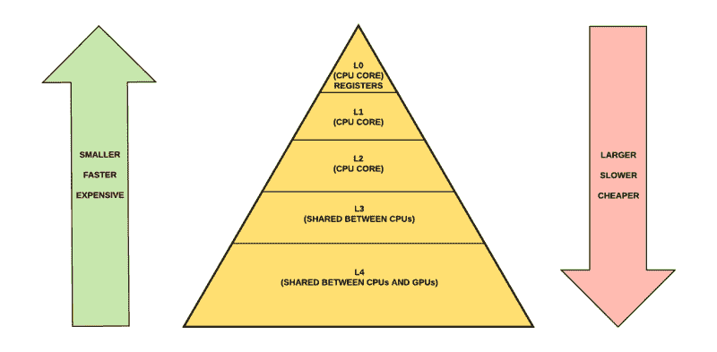
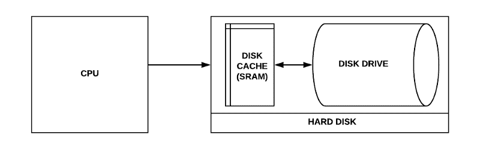
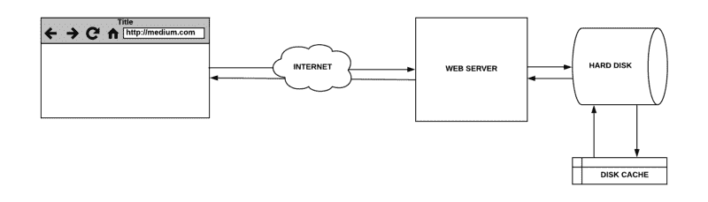
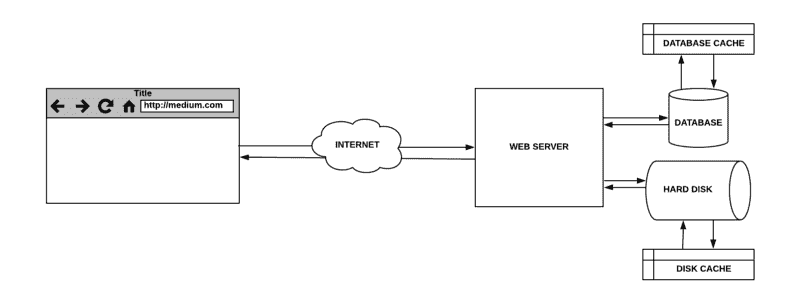
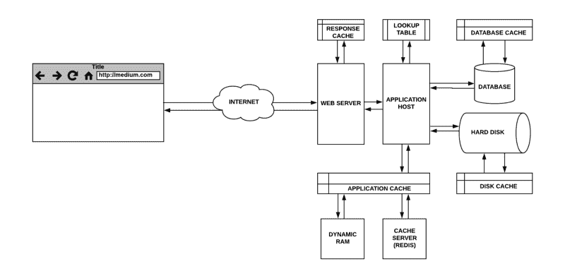
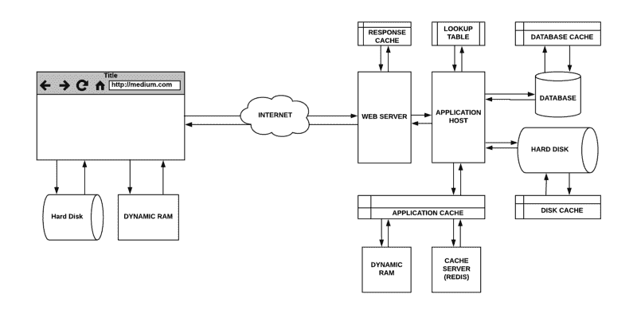
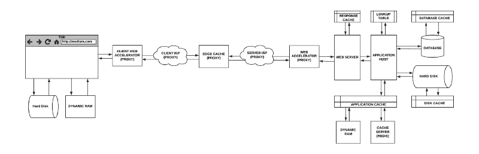

# Web 缓存的隐藏组件

> 原文：<https://www.freecodecamp.org/news/the-hidden-components-of-web-caching-970854fe2c49/>

作者:尼克·卡尔尼克

# Web 缓存的隐藏组件

缓存允许您提高应用程序的处理速度。存储先前获取的数据或计算结果的副本可以提高处理速度。这使得将来的请求能够得到更快的服务。这是一种有效的架构模式，因为大多数程序反复访问相同的数据或指令。

它适用于从网络浏览器到网络服务器，从硬盘到 CPU 的所有东西。让我们采用自下而上的方法来理解缓存的各个层次。我们将关注**在哪里可以缓存**数据，而不是**如何缓存**数据。

### CPU 缓存

高速缓存是一种速度极快的内存类型，充当 RAM 和 CPU 之间的缓冲区。它保存频繁请求的数据和指令，以便在需要时 CPU 可以立即使用它们。

CPU 是由一种叫做“寄存器”的特殊片上存储器构成的，它通常由少量的快速存储器组成。它们是离它最近、最小、最快的内存。有时，这些寄存器被称为“L0 缓存”。

CPU 还可以访问从 L1 高速缓存(1 级)到 L4 高速缓存(4 级)的多达 4 个额外级别的高速缓存。CPU 和主板架构决定了寄存器是 L0 还是 L1 缓存。它们还决定了各层是驻留在 CPU 上还是主板上。

Cache Memory structure in some of the newest CPU’s

### 磁盘

与易失性随机存取存储器(RAM)相比，硬盘驱动器(HDD)速度较慢，但使用固态驱动器(SSD)速度会更快。

在计算机存储中，磁盘缓存(也称为磁盘缓冲区或缓存缓冲区)是硬盘驱动器中的嵌入式内存，充当 CPU 和用于存储的物理硬盘之间的缓冲区。

A disk cache seeks to take advantage of faster memory speeds

磁盘缓存的工作前提是，当你在磁盘上读或写东西时，你很快就会再次读取。

### 随机存取存储

将临时数据存储在 RAM 和 HDD 上的区别在于其性能、成本和与 CPU 的接近程度。

RAM 的响应时间为几十纳秒，而 HDD 的响应时间为几十毫秒。那就是**六个数量级**的差别！

对缓存工作原理的深入理解将允许您设计高效、廉价和可维护的应用程序。

### 简单网络服务器

当你发出一个 web 请求时，它从你的 web 浏览器传到一个 web 服务器，该服务器从硬盘上的文件系统中提供静态资源。

Simple Web-Server

让我们假设当一个网站被请求时，我们正在提供一个静态文件。在典型的工作流程中，传入的请求将由 web 服务器处理。它将从硬盘中获取文件，并以其内容作为响应。

在第一次请求时，硬盘将检查缓存，这将导致“缓存未命中”它将继续从磁盘驱动器获取数据，并将其存储在缓存中，假设可能会再次请求它。

在后续请求中，缓存中的查找将导致“缓存命中”该数据将从缓冲区提供服务，直到它被覆盖，并且查找导致缓存未命中。

### 数据库缓存

由于可能需要在数据库服务器上计算结果，数据库查询可能会很慢而且很密集。如果这些查询是重复的，那么将它们缓存在数据库中会改善它们的响应时间。当多台机器访问同一个数据库并执行同一个查询时，这也很有用。

Simple Web-Server with a Database

大多数数据库服务器将被配置为开箱即用，以获得最佳缓存。但是，有许多参数可以修改，以满足您的应用需求。

### 响应缓存

可以将 web 服务器配置为缓存响应，这样它就不会将类似的请求转发给应用程序主机。类似地，应用程序主机可以缓存其对昂贵的数据库查询或频繁请求的文件的部分响应。

Response and Application Cache

web 服务器响应缓存在内存中。应用程序缓存可以存储在本地内存中，也可以存储在运行 Redis 等内存数据结构存储的缓存服务器上。

> web 服务器和应用程序主机可以是同一服务的一部分，也可以是不同的服务，这取决于应用程序的体系结构。

### 功能记忆化

记忆化是一种缓存形式，在这种形式中，您可以优化昂贵的函数调用，以便它们对于特定的输入只运行一次。这是通过查找表实现的，其中键对应于函数输入参数，值是结果。

Function Memoization via Lookup Table

这是一种用于加速程序的常用技术。但是，对于不常调用的函数或响应时间快的函数来说，这可能并不理想。

### 通过 HTTP 头的浏览器缓存

每个浏览器都带有 HTTP 缓存(也称为 web 缓存)的实现，用于临时存储 web 文档，如 HTML 页面、javascript 文件和图像。

当服务器响应提供正确的 HTTP 头指令来指示浏览器何时以及在多长时间内可以缓存响应时，就利用了这一点。

这是一个非常强大的功能，因为它有几个好处:

*   用户体验得到了改善，因为资源可以从本地缓存中快速加载。没有往返时间(RTT ),因为请求不是通过线路发送的
*   它减少了应用服务器和管道中其他组件的负载
*   每个人都省下了支付不必要带宽的费用，并为互联网上的其他用户释放了带宽

Browser Caching

### 代理服务系统

在计算机网络中，代理服务器是计算机系统、硬件设备或应用程序。它充当从其他服务器寻求资源的客户端请求的中介，反之亦然。

代理服务器有多种形式。它们可能位于用户的本地计算机、网络路由器或客户端和目的主机之间的各种中间服务器上。所有代理服务器都能够缓存。

让我们看看代理服务器的常见变体。

#### 门

简单地转发传出请求或传入响应而不进行修改的代理服务器被称为**网关、隧道代理、web 代理、代理或应用层代理**。这些代理通常由防火墙内的所有客户机共享，这使它们成为请求缓存的良好候选对象。

#### 正向代理

转发代理(也称为代理服务器)通常安装在客户端基础设施上。配置为使用转发代理的 web 浏览器将向其发送传出请求。然后，它将被转发到互联网上的目的服务器。转发代理的优点之一是它隐藏了客户的身份(然而，VPN 对于匿名来说更安全)。

#### 网络加速器

web 加速器是一种代理服务器，可以减少网站访问时间。它通过预取可能在不久的将来被访问的文档来做到这一点。它们还可以压缩文档、加速加密、降低图像质量等等。

#### 反向代理

反向代理通常是面向内部的代理，用于防止直接访问专用网络上的服务器。它用于跨内部服务器的负载平衡请求，提供 SSL 身份验证或请求缓存。服务器端托管缓存，它们可以帮助管理大量的请求。

#### 边缘缓存

另一方面，边缘缓存(也称为内容交付网络(CDN))指的是使用缓存服务器来存储离最终用户更近的内容。例如，如果你访问一个流行的网站并下载一些静态内容，这些内容会被缓存。每个后续用户将直接从缓存服务器获得该内容，直到过期。

源服务器是内容的真实来源，能够提供 CDN 上所有可用的内容。

Proxy Servers in the request pipeline

### 关闭

缓存发生在从硬件和软件到网络设备和服务的每一步。它在提高源服务器的整体性能方面起着重要的作用。每台机器都有一套类似的硬盘和 CPU 缓存机制。

缓存减少了延迟和网络流量，从而减少了显示资源表示所需的时间。所有 web 应用程序都有某种形式的与 CPU 计算相关的响应延迟。例如，磁盘查找、网络延迟、请求排队、网络节流等等。如果考虑到管道中各种机器的这些组合，往返时间会很快增加。

最后，这里是我们从缓存中体验到的一些好处:

*   减少延迟可以缩短响应时间。
*   由于网络流量减少，往返时间缩短(RTT)。
*   更高的吞吐量，因此源服务器可以处理更多的请求。
*   降低带宽消耗可以减少网络流量，减少网络拥塞。这意味着实际未缓存内容的检索速度要快得多。
*   从附近的代理缓存提供文档可以最小化传输延迟。
*   由于因特网上的各种高速缓存服务于数据，原始网络服务器的工作负荷减少了。
*   在远程服务器由于崩溃或网络问题而不可用的情况下，可以通过代理获得资源的缓存副本。

#### 如果这篇文章是有帮助的？？？在推特上关注我。

[**GitHub 扩展提升你的生产力**](https://medium.freecodecamp.org/github-extensions-to-boost-your-productivity-4692ad2b1796)
[*以下是我使用的 GitHub 扩展。它们将帮助您提高在 GitHub 上的工作效率。请分享你的…*medium.freecodecamp.org](https://medium.freecodecamp.org/github-extensions-to-boost-your-productivity-4692ad2b1796)