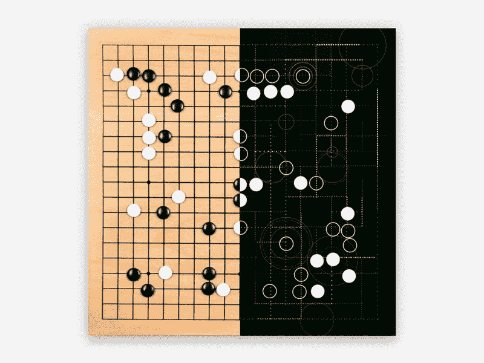
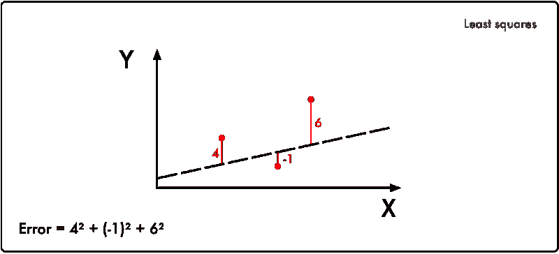
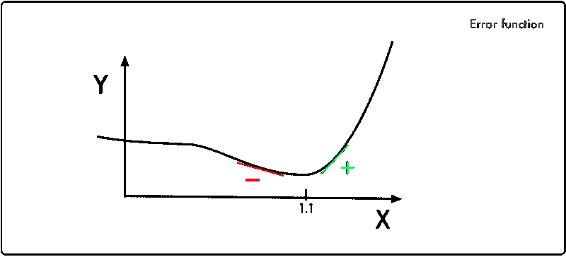
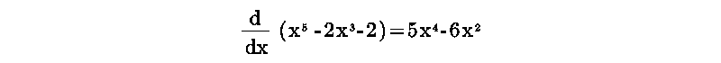
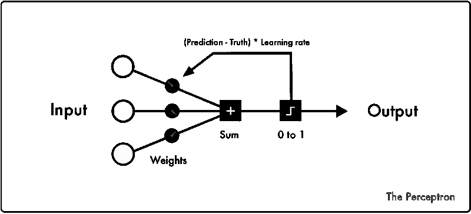
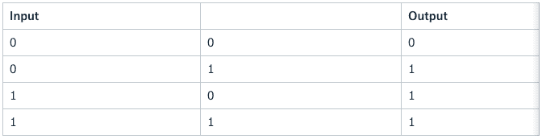
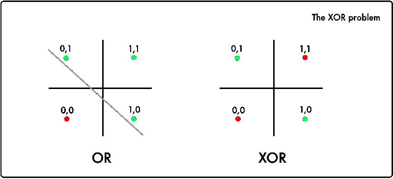
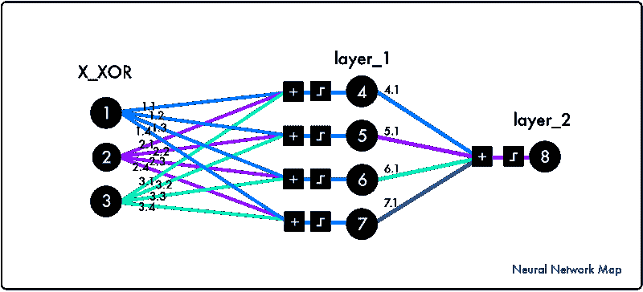
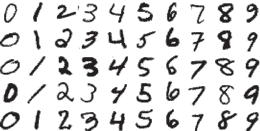

# 深度学习的历史——通过 6 个代码片段探索

> 原文：<https://www.freecodecamp.org/news/the-history-of-deep-learning-explored-through-6-code-snippets-d0a0e8545202/>

作者:emailwallner

# 深度学习的历史——通过 6 个代码片段探索



Source: Google press image for Deep Mind

在本文中，我们将探索六个代码片段，这些代码片段成就了深度学习的今天。我们将介绍发明者和他们突破的背景。每个故事都包含了在 [FloydHub](https://www.floydhub.com/emilwallner/projects/deep-learning-from-scratch/) 和 [GitHub](https://github.com/emilwallner/Deep-Learning-From-Scratch) 上的简单代码样本，供大家使用。

如果这是你第一次接触深度学习，我建议阅读我的[开发者深度学习 101](https://medium.freecodecamp.org/deep-learning-for-developers-tools-you-can-use-to-code-neural-networks-on-day-1-34c4435ae6b)。

要在 FloydHub 上运行代码示例，请安装[Floyd 命令行工具](https://www.youtube.com/watch?v=byLQ9kgjTdQ&t=167s)。然后将我提供的代码实例克隆到你的本地机器上。

**注意:**如果你是 FloydHub 的新手，你可能想先阅读我之前的帖子中的[开始使用 FloydHub](http://blog.floydhub.com/my-first-weekend-of-deep-learning) 部分。

在本地计算机上的示例项目文件夹中启动 CLI。现在，您可以使用以下命令在 FloydHub 上启动项目:

```
floyd run --data emilwallner/datasets/mnist/1:mnist --tensorboard --mode jupyter
```

### 最小二乘法

深度学习是从一个数学片段开始的。

我把它翻译成了 Python:

```
# y = mx + b# m is slope, b is y-interceptdef compute_error_for_line_given_points(b, m, coordinates):    totalError = 0    for i in range(0, len(coordinates)):        x = coordinates[i][0]        y = coordinates[i][1]        totalError += (y - (m * x + b)) ** 2    return totalError / float(len(coordinates))# example compute_error_for_line_given_points(1, 2, [[3,6],[6,9],[12,18]])
```

这本书由阿德里安-玛丽·勒让德于 1805 年首次出版。他是巴黎的数学家，也以测量米而闻名。

他特别痴迷于预测彗星未来的位置。他有一些过去彗星的位置。他毫不留情地用它们来寻找计算它们轨迹的方法。

这真的是那种墙上挂意大利面的时刻。他尝试了几种方法，然后一个版本最终坚持了下来。

勒让德的过程从猜测彗星未来的位置开始。然后，他对他所犯的错误进行平方，最后重新进行猜测，以减少平方误差的总和。这就是线性回归的起源。

在我提供的 Jupyter 笔记本中使用上面的代码来感受一下。`m` 是你预测的常数中的系数和`b`，`coordinates`是彗星的位置。目标是找到误差尽可能小的`m`和`b`的组合。



这是深度学习的核心:

*   取一个输入和一个期望的输出
*   然后搜索两者之间的相关性

### 梯度下降

Legendre 手动尝试降低错误率的方法非常耗时。彼得·约瑟夫·威廉·德拜是来自荷兰的诺贝尔奖获得者。一个世纪后的 1909 年，他正式提出了这个过程的解决方案。

让我们想象一下，勒让德有一个需要担心的参数——我们称之为`X`。`Y`轴代表每个`X`值的误差值。Legendre 正在寻找`X`产生最低误差的地方。

在这个图形表示中，我们可以看到使误差`Y`最小的`X`值是当`X = 1.1`时。



彼得·约瑟夫·威廉·德拜注意到最小值左边的斜率是负的，而另一边是正的。因此，如果你知道任何给定的`X`值的斜率值，你可以引导`Y`向其最小值移动。

这就产生了**梯度下降**的方法。该原理几乎用于每一个深度学习模型。

为了玩这个，我们假设误差函数是`Error = x⁵ -2x³-2`。为了知道任何给定的`X`值的斜率，我们对其求导，即`5x⁴ - 6x²​​`:



如果你需要复习衍生品知识，请观看可汗学院的视频。

德拜的数学翻译成 Python:

```
current_x = 0.5 # the algorithm starts at x=0.5learning_rate = 0.01 # step size multipliernum_iterations = 60 # the number of times to train the function
```

```
#the derivative of the error function (x**4 = the power of 4 or x^4) def slope_at_given_x_value(x):    return 5 * x**4 - 6 * x**2
```

```
# Move X to the right or left depending on the slope of the error functionfor i in range(num_iterations):   previous_x = current_x   current_x += -learning_rate * slope_at_given_x_value(previous_x)   print(previous_x)
```

```
print("The local minimum occurs at %f" % current_x)
```

这里的诀窍是`learning_rate`。沿着与斜坡相反的方向，它接近最小值。此外，它越接近最小值，斜率就越小。当斜率接近零时，每一步都会减小。

`num_iterations` 是您在达到最小值之前估计的迭代时间。玩参数它得到一个梯度下降的直觉。

### 线性回归

结合最小二乘法和梯度下降法，你得到线性回归。在 20 世纪 50 年代和 60 年代，一群实验经济学家在早期的计算机上实现了这些想法的版本。逻辑是在实体穿孔卡上实现的——真正手工制作的软件程序。准备这些打孔卡花了几天时间，通过计算机进行一次回归分析花了 24 小时。

下面是一个翻译成 Python 的线性回归示例，这样您就不必在打孔卡上做了:

```
#Price of wheat/kg and the average price of breadwheat_and_bread = [[0.5,5],[0.6,5.5],[0.8,6],[1.1,6.8],[1.4,7]]
```

```
def step_gradient(b_current, m_current, points, learningRate):    b_gradient = 0    m_gradient = 0    N = float(len(points))    for i in range(0, len(points)):        x = points[i][0]        y = points[i][1]        b_gradient += -(2/N) * (y - ((m_current * x) + b_current))        m_gradient += -(2/N) * x * (y - ((m_current * x) + b_current))    new_b = b_current - (learningRate * b_gradient)    new_m = m_current - (learningRate * m_gradient)    return [new_b, new_m]
```

```
def gradient_descent_runner(points, starting_b, starting_m, learning_rate, num_iterations):    b = starting_b    m = starting_m    for i in range(num_iterations):        b, m = step_gradient(b, m, points, learning_rate)    return [b, m]
```

```
gradient_descent_runner(wheat_and_bread, 1, 1, 0.01, 100)
```

这不应该引入任何新的东西。然而，将误差函数与梯度下降相结合可能有点难以理解。运行代码，用这个[线性回归模拟器](https://www.mladdict.com/linear-regression-simulator)玩一玩。

### 感知器

弗兰克·罗森布拉特出场了——他白天解剖老鼠大脑，晚上寻找外星生命的迹象。1958 年，他登上了《纽约时报》的头版:“[新的海军设备通过模仿](http://query.nytimes.com/mem/archive-free/pdf?res=9D01E4D8173DE53BBC4053DFB1668383649EDE)[神经元](http://citeseerx.ist.psu.edu/viewdoc/download?doi=10.1.1.335.3398&rep=rep1&type=pdf)的机器做来学习。

如果你向罗森布拉特的机器展示 50 组两幅图像，一幅在左边，另一幅在右边，它可以在没有预编程的情况下做出区分。公众被真正的学习机器的可能性冲昏了头脑。



对于每个训练周期，您从左侧的输入数据开始。初始随机权重被添加到所有输入数据中。然后对它们进行总结。如果总和为负，它被转换成`0`，否则，它被映射成一个`1`。

如果预测是正确的，那么在那个周期中权重不会发生任何变化。如果它是错的，你用学习率乘以误差。这会相应地调整权重。

让我们用经典或逻辑来运行[感知器](https://en.wikipedia.org/wiki/Perceptron)。



把感知器机器翻译成 Python:

```
from random import choice from numpy import array, dot, random 1_or_0 = lambda x: 0 if x < 0 else 1 training_data = [ (array([0,0,1]), 0),                     (array([0,1,1]), 1),                     (array([1,0,1]), 1),                     (array([1,1,1]), 1), ] weights = random.rand(3) errors = [] learning_rate = 0.2 num_iterations = 100 
```

```
for i in range(num_iterations):     input, truth = choice(training_data)     result = dot(weights, input)     error = truth - 1_or_0(result)     errors.append(error)     weights += learning_rate * error * input     for x, _ in training_data:     result = dot(x, w)     print("{}: {} -> {}".format(input[:2], result, 1_or_0(result)))
```

1969 年，马文·明斯基和西蒙·派珀特摧毁了这个想法。当时，明斯基和帕佩特在麻省理工学院经营人工智能实验室。他们写了一本书，证明感知器只能解决线性问题。他们还揭穿了关于多层感知器的说法。可悲的是，弗兰克·罗森布拉特两年后死于一场船难。

1970 年，一名芬兰硕士生发现了用多层感知器解决非线性问题的[理论](http://people.idsia.ch/~juergen/linnainmaa1970thesis.pdf)。因为感知器的主流批评，AI 的经费枯竭了十几年。这被称为第一个人工智能冬天。

明斯基和帕佩特批判的力量在于异或问题。该逻辑与 OR 逻辑相同，只有一个例外，即当有两个 true 语句(1 & 1)时，返回 False (0)。



在 OR 逻辑中，可以区分正确的组合和错误的组合。但是你可以看到，你不能用一个线性函数来划分异或逻辑。

### 人工神经网络

到 1986 年，几项实验证明神经网络可以解决复杂的非线性问题。当时，计算机的速度比该理论发展的时候快了一万倍。这就是鲁梅尔哈特介绍这份传奇论文的方式:

> 我们描述了一种新的学习过程，反向传播，用于神经元样单元的网络。该过程反复调整网络中连接的权重，以便最小化网络的实际输出向量和期望输出向量之间的差的度量。作为权重调整的结果，不属于输入或输出的内部“隐藏”单元开始代表任务域的重要特征，并且任务中的规律性被这些单元的相互作用所捕获。创建有用的新特征的能力将反向传播与早期的更简单的方法区分开来，如感知器收敛程序*——**自然** 323，533–536(1986 年 10 月 9 日)*

为了理解本文的核心，我们将由 DeepMind 的 Andrew Trask 编写实现代码。这不是一段随机的代码。它已经被用于安德鲁·卡帕西在斯坦福大学的深度学习课程和西拉杰·拉瓦尔的 Udacity 课程。它解决了异或问题，解冻了第一个 AI 冬天。



在我们钻研代码之前，先用[这个模拟器](https://www.mladdict.com/neural-network-simulator)玩一到两个小时，掌握核心逻辑。然后阅读[查斯克的博文](http://iamtrask.github.io/2015/07/12/basic-python-network/)。

注意`X_XOR`数据中增加的参数`[1]`是[偏置神经元](https://stackoverflow.com/questions/2480650/role-of-bias-in-neural-networks)。

它们的行为与线性函数中的常数相同:

```
import numpy as np
```

```
X_XOR = np.array([[0,0,1], [0,1,1], [1,0,1],[1,1,1]]) y_truth = np.array([[0],[1],[1],[0]])
```

```
np.random.seed(1)syn_0 = 2*np.random.random((3,4)) - 1syn_1 = 2*np.random.random((4,1)) - 1
```

```
def sigmoid(x):    output = 1/(1+np.exp(-x))    return outputdef sigmoid_output_to_derivative(output):    return output*(1-output) 
```

```
for j in range(60000):    layer_1 = sigmoid(np.dot(X_XOR, syn_0))    layer_2 = sigmoid(np.dot(layer_1, syn_1))    error = layer_2 - y_truth    layer_2_delta = error * sigmoid_output_to_derivative(layer_2)    layer_1_error = layer_2_delta.dot(syn_1.T)    layer_1_delta = layer_1_error * sigmoid_output_to_derivative(layer_1)    syn_1 -= layer_1.T.dot(layer_2_delta)    syn_0 -= X_XOR.T.dot(layer_1_delta)    print("Output After Training: \n", layer_2)
```

反向传播、矩阵乘法和梯度下降结合在一起可能很难让你理解。这个过程的可视化通常是对幕后发生的事情的简化。专注于理解它背后的逻辑，但不要太担心它的心理图像。

另外，看看安德鲁·卡帕西关于反向传播的讲座，玩玩[这些可视化](http://www.benfrederickson.com/numerical-optimization/)，读读迈克尔·尼尔森关于它的[章节](http://neuralnetworksanddeeplearning.com/chap2.html)。

### 深度神经网络

深度神经网络是在输入和输出层之间具有多于一层的神经网络。这个概念是由 Rina Dechter 在 1986 年提出的。但是直到 [2012](https://trends.google.com/trends/explore?date=all&q=deep%20learning) 它才获得主流关注。这是在 IBM 沃森的[危险胜利](http://www.nytimes.com/2011/02/17/science/17jeopardy-watson.html?pagewanted=all&mcubz=0)和谷歌的[猫识别器](https://www.youtube.com/watch?v=TK4qLwTye_s)之后不久。

深度神经网络的核心结构保持不变。但是它们现在被应用于几个不同的问题。正规化方面也有了很大改善。

在 1963 年，它是一套简化噪音地球数据的数学函数。它们现在被用于神经网络，以提高它们的[泛化](https://machinelearningmastery.com/overfitting-and-underfitting-with-machine-learning-algorithms/)的能力。

创新的很大一部分归功于计算能力。这改善了研究人员的创新周期——在八十年代中期，超级计算机需要一年才能完成的计算，在今天的 GPU 技术下只需要半秒钟。

计算成本的降低和深度学习库的发展现在已经让普通公众可以使用它。让我们看一个常见深度学习堆栈的示例，从底层开始:

*   **GPU&**gt；英伟达特斯拉 K80。通常用于图形处理的硬件。与 CPU 相比，它们的深度学习速度平均快 50-200 倍。
*   **CUDA** >用于 GPU 的低级编程语言
*   **CuDNN** > Nvidia 的库优化 CUDA
*   **tensor flow**>cud nn 之上的谷歌深度学习框架
*   用于 Tensorflow 的前端框架

让我们来看看 [MNIST](https://www.tensorflow.org/get_started/mnist/beginners) 数字的图像分类，深度学习的“Hello World”。



在 TFlearn 中实现:

```
from __future__ import division, print_function, absolute_importimport tflearnfrom tflearn.layers.core import dropout, fully_connectedfrom tensorflow.examples.tutorials.mnist import input_datafrom tflearn.layers.conv import conv_2d, max_pool_2dfrom tflearn.layers.normalization import local_response_normalizationfrom tflearn.layers.estimator import regression
```

```
# Data loading and preprocessingmnist = input_data.read_data_sets("/data/", one_hot=True)X, Y, testX, testY = mnist.train.images, mnist.train.labels, mnist.test.images, mnist.test.labelsX = X.reshape([-1, 28, 28, 1])testX = testX.reshape([-1, 28, 28, 1])
```

```
# Building convolutional networknetwork = tflearn.input_data(shape=[None, 28, 28, 1], name='input')network = conv_2d(network, 32, 3, activation='relu', regularizer="L2")network = max_pool_2d(network, 2)network = local_response_normalization(network)network = conv_2d(network, 64, 3, activation='relu', regularizer="L2")network = max_pool_2d(network, 2)network = local_response_normalization(network)network = fully_connected(network, 128, activation='tanh')network = dropout(network, 0.8)network = fully_connected(network, 256, activation='tanh')network = dropout(network, 0.8)network = fully_connected(network, 10, activation='softmax')network = regression(network, optimizer='adam', learning_rate=0.01,                        loss='categorical_crossentropy', name='target')
```

```
# Trainingmodel = tflearn.DNN(network, tensorboard_verbose=0)model.fit({'input': X}, {'target': Y}, n_epoch=20,            validation_set=({'input': testX}, {'target': testY}),            snapshot_step=100, show_metric=True, run_id='convnet_mnist')
```

有很多很棒的文章解释了 MNIST 问题:这里和这里。

### 让我们总结一下

正如你在 TFlearn 的例子中看到的，深度学习的主要逻辑仍然类似于罗森布拉特的感知器。今天的网络大多使用 Relu(整流器线性单元)激活，而不是使用二元 Heaviside 阶跃函数。

在卷积神经网络的最后一层，损耗等于`categorical_crossentropy`。这是勒让德最小二乘法的演变，是对多个类别的逻辑回归。优化器`adam`源于德拜的梯度下降工作。

吉洪诺夫的正则化概念以缺失层和正则化函数的形式广泛实施。

如果你想对神经网络以及如何实现它们有更好的直觉，请阅读我以前的帖子: [***程序员的深度学习 101。***](https://medium.freecodecamp.org/deep-learning-for-developers-tools-you-can-use-to-code-neural-networks-on-day-1-34c4435ae6b)

感谢 Ignacio Tonoli de Maussion 、Brian Young、 [Paal Rgd](https://www.freecodecamp.org/news/the-history-of-deep-learning-explored-through-6-code-snippets-d0a0e8545202/undefined) 、[to MAS moka](https://www.freecodecamp.org/news/the-history-of-deep-learning-explored-through-6-code-snippets-d0a0e8545202/undefined)和 [Charlie Harrington](https://www.freecodecamp.org/news/the-history-of-deep-learning-explored-through-6-code-snippets-d0a0e8545202/undefined) 阅读本文的草稿。代码源包含在 Jupyter 笔记本中。

#### 关于埃米尔·沃纳

这是我学习深度学习的多部分博客系列的一部分。我花了十年探索人类的学习。我在牛津大学商学院工作，投资教育初创公司，建立了一家教育科技企业。去年，我注册了 Ecole 42，将我在人类学习方面的知识应用到机器学习中。

你可以在 Twitter 上关注我的学习之旅。如果您有任何问题/建议，请在下面留下评论或在 [M](https://medium.com/@emilwallner) edium 上 ping 我。

这篇文章最初发表在 Floydhub 的博客上。