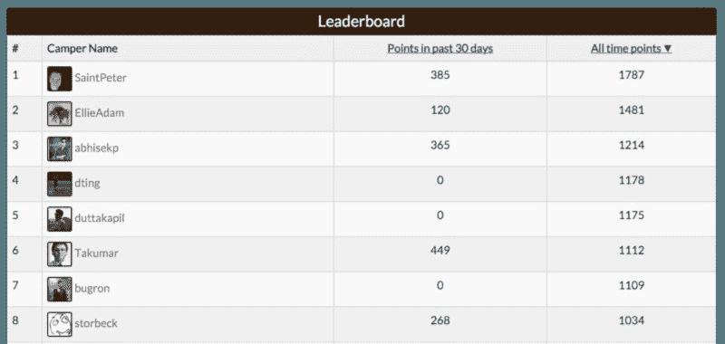
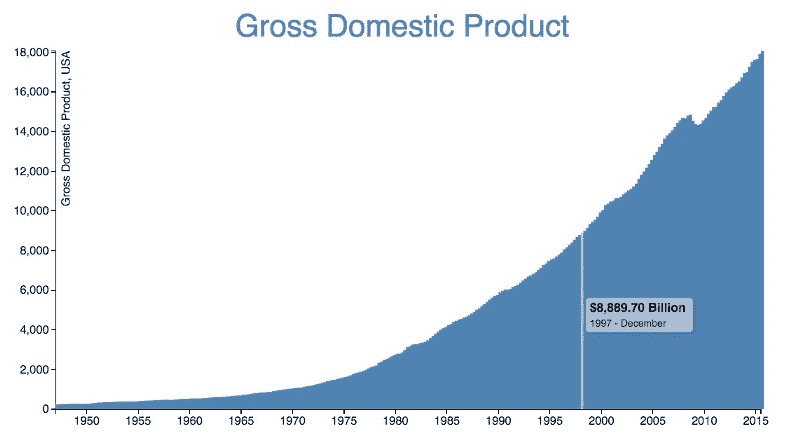
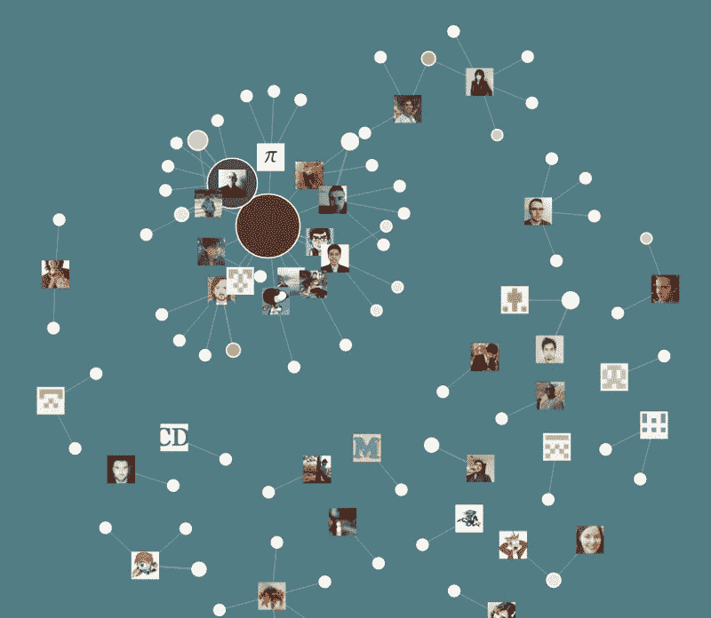
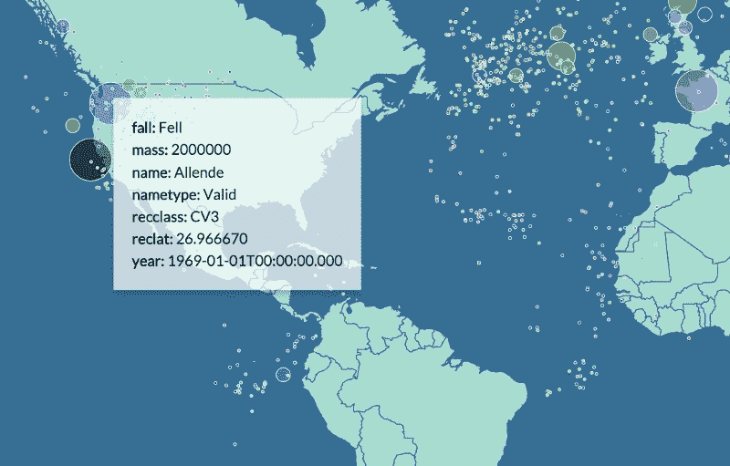

# 代码 x 2,080 的小时

> 原文：<https://www.freecodecamp.org/news/the-hour-of-code-times-2-080-67dda26be3af/>

本月早些时候，我们宣布打算将 1600 小时的课程增加到 2080 小时。没错——整整一年的编码工作经验。

现在，距离我们的元旦截止日期还有几天，我们已经准备好发布我们课程中新的数据可视化认证组件。

这意味着今天，我们将启动 15 个新的编码项目。这将给你数百小时的时间来练习像 D3.js、React 和 Sass 这样的重要新技术。

当你完成我们新扩展的项目时，你将已经构建了超过 30 个项目，所有这些都来自于一个空白的页面，一个敏捷用户故事的列表，和一个装满库的拳头。

这是我们增加到课程中的 15 个新项目。

### React 和 Sass 项目

我们早就计划从 Angular 过渡到 React。由于 Sass 正迅速成为 CSS 预处理器(现在包含在 Bootstrap 中)，我们决定也教授它。

#### 减价预览器

许多开发人员在第一次尝试 React 时，选择构建一个 Markdown 预览器。这种类型的 web 应用很好地展示了 React 的数据绑定能力，所以我们决定将其作为我们的第一个 React 挑战。

来自华盛顿的开发人员 Herman Fassett 制作了这个演示。

#### 露营者排行榜

来自荷兰的 Roel Verbunt 设计了这个免费代码营排行榜演示，并在 React 中实现。

#### 食谱盒

Herman Fassett 为 [Geoff Storbeck](http://freecodecamp.com/storbeck) 和 [Juan Martínez](http://gitter.im/jbmartinez) 的[食谱盒应用](http://codepen.io/GeoffStorbeck/full/bVKyzd/)构建了这个极简 React 实现(它最初是作为一个额外的假日挑战而构建的)。它包括构建一个创建-读取-更新-删除(CRUD)的应用程序，但有一点不同。您不使用数据库，而是使用浏览器的本地存储。

#### 康威的生活游戏

康威的生活游戏非常适合 React 的基于 web 组件的方法。

Philip Michaels 设计了这个挑战并制作了这个演示。

#### Roguelike 地下城爬虫游戏

总部位于华盛顿的开发者 Logan Tegman 设计并实现了这项挑战，它基于极简主义的角色扮演游戏类型，深受独立游戏玩家的欢迎。

### 用 D3.js 实现数据可视化

越来越多的 web 开发人员应该知道如何获取数据并以直观的方式将其可视化。最流行的库是 D3.js，它可以帮助你使用 JavaScript 和 JSON 构建令人瞠目结舌的图形——这些工具我们的露营者已经知道并且喜欢。

#### 美国国内生产总值条形图

苏珊娜·阿特金森和 T2【布鲁斯·杨制作了这个基本的条形图挑战，将美国经济在过去 65 年的增长可视化。

#### 循环和掺杂散点图

来自匹兹堡的医生兼铁人三项教练苏珊娜·阿特金森(Suzanne Atkinson)创造了这个以兴奋剂丑闻为主题的散点图可视化挑战。

#### 气候变化热图

来自佛罗里达州哈德逊的开发人员 Bruce Young 设计了这个挑战，在这个挑战中，你可以建立一个过去 250 年全球气温上升的真实热图。

#### 营员新闻力有向图

Bruce Young 也设计了这个挑战，你可以想象在[露营者新闻](http://www.freecodecamp.com/news)上发帖的人和他们发布的故事领域之间的关系。

#### 陨石撞击世界地图

在哥伦布的开发者 Geoff Storbeck 的挑战中，你将在世界地图上绘制陨石撞击。

### API/微服务项目

我们还在后端开发人员认证中增加了五项新的 API/微服务挑战。这些新的挑战依赖于返回 JSON 而不是 HTML，并且是我们更困难的动态 Web 应用挑战的垫脚石。

正如我们新的 React 和 D3 挑战一样，这些都是由露营者设计的。

乔治·斯捷潘内克是一名来自奥克兰的开发人员。他设计了一个请求头解析器挑战、一个文件元数据检查器挑战和一个以日志记录和分页为特色的 Google 图片搜索抽象层挑战。

Herman Fassett 设计了我们新的 Unix 时间戳微服务挑战赛和 URL Shortener 微服务挑战赛。

设计和建造这些新挑战的营员们在过去几周的课程中，在晚上和周末[这样做，一边建造一边学习这些技术。](https://github.com/FreeCodeCamp/FreeCodeCamp/issues?q=milestone%3Ajan2016+is%3Aclosed)

因此，我们相信我们的时间估计(React/Sass 和 D3 挑战 400 小时，API/微服务挑战 100 小时)对于那些之前只有 web 开发经验的营员来说是合理的，他们正在完成我们的前端开发认证。

也就是说，我们现在有几十名研究人员和数据科学家在研究我们的公开数据，我相信在接下来的几个月里，他们会证实这些估计有多现实。

我们在自由代码营的哲学一直是[学习编码是困难的](https://medium.freecodecamp.com/learn-to-code-by-coding-d1e241de81c0)。学习编程的最好方法是用[严格的课程](http://www.freecodecamp.com)挑战自己，要知道——在[支持社区](https://github.com/FreeCodeCamp/FreeCodeCamp/wiki/Official-Free-Code-Camp-Chat-Rooms)的帮助下——你最终会成功。

加入我们的开源社区，成功学习编码。

*如果您喜欢，请点击？下面。关注我和免费代码营，获取更多关于技术的文章。*

