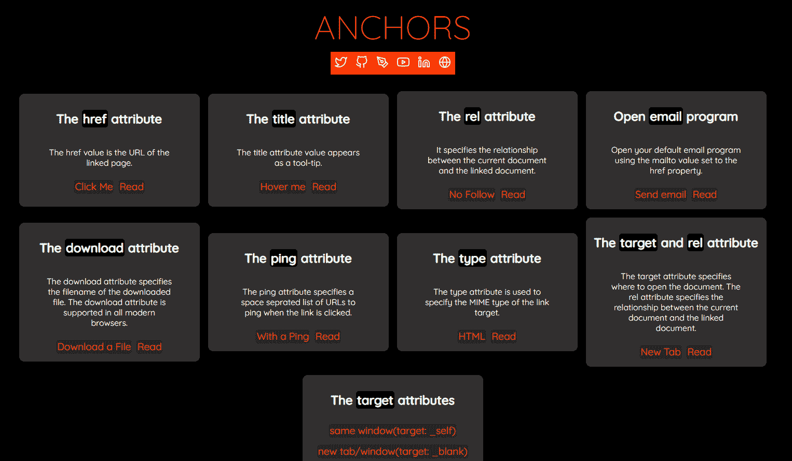
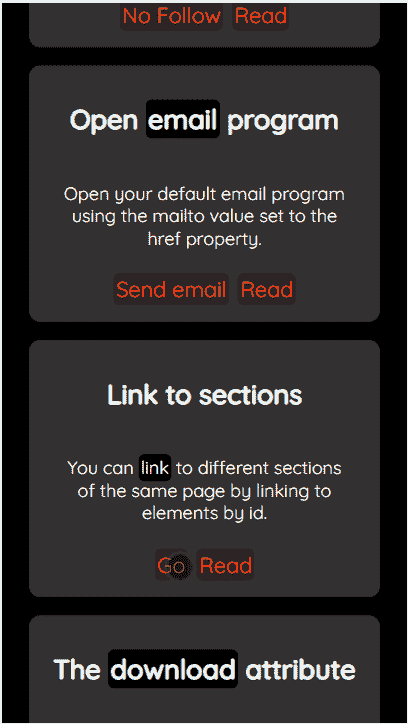
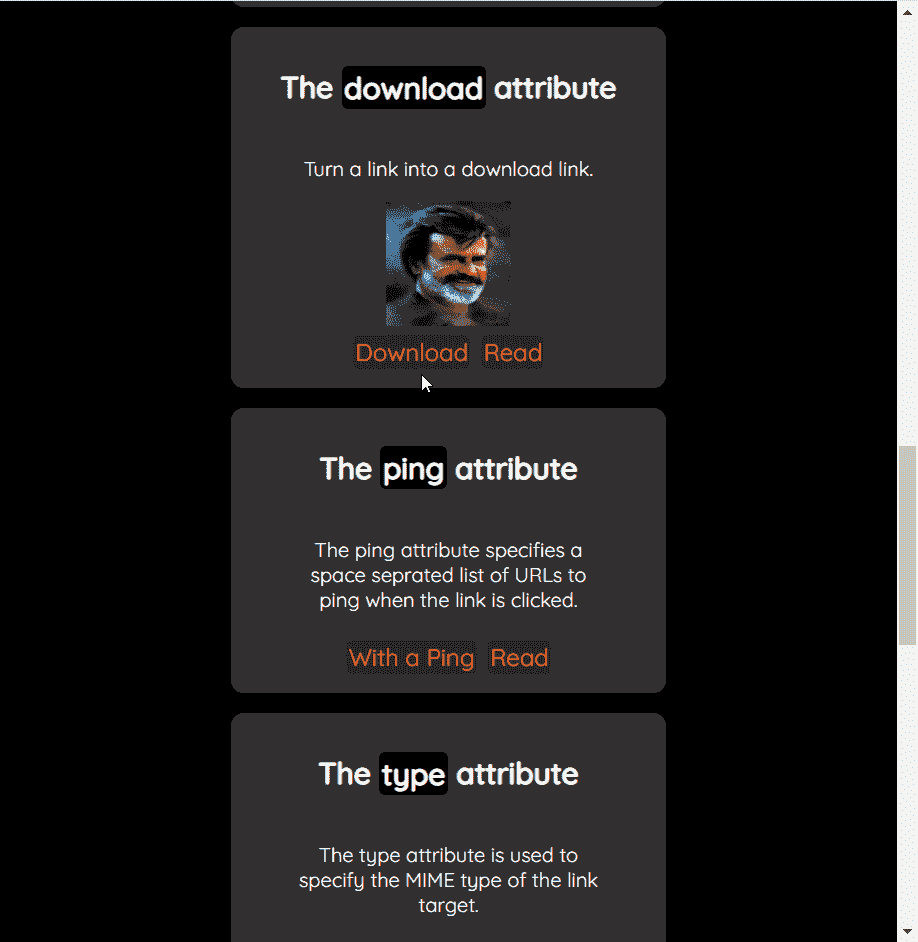

# HTML 

> 原文：<https://www.freecodecamp.org/news/the-html-a-tag-anchor-tag-example-code/>

(**H**yper**T**ext**M**arkup**L**language)是我们用来创建 web 应用程序的语言之一。它给你的网页增加了结构。

HTML 有各种我们用来创建元素的标签。多个元素组合在一起创建有意义的网页和应用程序。

`anchor`标签是 HTML 中最常用和最著名的标签之一。在本文中，我们将通过许多例子来了解锚标记(< a >)及其主要用途。

但是，如果主播标签已经广为人知，为什么还要谈论它呢？这个标签有一些重要的细节是许多开发者不知道的——但是他们应该知道。所以让我们来学习它们。

我已经创建了一个应用程序来演示锚标签的不同行为。您可以在阅读本文时查看并使用它。

[](https://anchors.vercel.app/)[AnchorsAnchors is a demo application to show the use of HTML anchor tags using simple interface and documentation.](https://anchors.vercel.app/)

Anchors - An app to demonstrate anchor tags(https://anchors.vercel.app/)

如果您也喜欢从视频内容中学习，本文也可以作为视频教程在此处获得:🙂

[https://www.youtube.com/embed/neWThioR5hw?list=PLIJrr73KDmRzBs_I3rfndvH_GPrF_byYD](https://www.youtube.com/embed/neWThioR5hw?list=PLIJrr73KDmRzBs_I3rfndvH_GPrF_byYD)

# HTML 中的锚标签是什么？

标签的主要目的是将一个页面链接到另一个页面或同一页面的一个部分。锚定标签也被称为`HyperLink`。像任何其他 HTML 标记一样，您可以使用以下构造来创建锚标记:

```
<a>My Website</a>
```

上面的 anchor 标签是一个有效的 HTML 标签，但是它除了充当占位符之外没有什么作用。让我们使用这个锚标记来链接到一个网页。您需要使用`href`属性来链接到另一个页面。

```
<a href="https://tapasadhikary.com">My Website</a>
```

`href`属性的值通常是一个指向网页的 URL(如上图所示)。您还可以链接另一个 HTML 元素或协议(例如，发送电子邮件)，并且可以使用 href 属性执行 JavaScript。我们将在下面看到如何做到这一切的例子。

# 锚定标签与示例一起使用

除了`href`之外，还有其他重要的属性使锚标记变得有用。让我们用例子来了解它们。

### 如何链接到页面的某个部分

我们已经看到了如何链接到外部网页(网站)。但是您也可以通过使用 id 链接到元素来链接到同一页面的某个部分。假设我们的页面有一个 id 为`news`的`div`部分。

```
<div id="news">
	<h2>News</h2>
	<p>
		Lorem ipsum dolor sit amet, consectetur adipiscing elit.
		Sed non risus. Suspendisse lectus tortor, dignissim sit amet,
		adipiscing nec, ultricies sed, dolor. Lorem ipsum dolor sit amet, 
        consectetur adipiscing elit.
	</p>
</div>
```

现在可以使用 anchor 标记链接到这个部分(div)。为此，只需使用带有`#`的部分的 id 作为`href`值的前缀。

```
<a href="#news">Go</a>
```

所以，当你点击`Go`链接时，你会滚动到页面的新闻部分。



Demonstration of the in-page link. You can try it using the Anchors app.

### 如何链接到电子邮件客户端

当用户点击一个链接时，您可能需要打开带有该电子邮件地址的默认电子邮件客户端。您可以通过使用`mailto`协议作为`href`属性的值来做到这一点。值的语法应该是`mailto:<email address>`的形式。

```
<a href="mailto:me@example.com">Send email</a>
```

现在点击`Send email`链接将打开你的操作系统上的默认电子邮件客户端，在`TO`字段中指定电子邮件地址(【me@example.com】T2)。

类似地，当有人点击链接时，您可以使用`tel:<Phone Number>`构造打开带有电话号码的默认电话应用程序。

```
<a href="tel:+914123456765">Call +914123456765</a>
```

### 如何链接到脚本并执行它

您可以链接到 JavaScript 代码，并在有人点击该链接时执行它。您不应该经常这样做，因为依靠事件处理程序来执行操作总是比链接它们更好的做法。但是让我们也学习这个方法。

```
<a href="javascript:alert('Hello World!')">Click me</a>
```

现在，如果您单击`Click me`链接，您将看到一个浏览器警告，其中包含文本`Hello World!`。

### 如何下载文件

anchor 标签有一个`download`属性，可以将一个普通链接变成一个下载链接。您可以通过单击链接下载文件。它会打开下载弹出窗口，将文件保存在设备上。

```
<a href="./images/rajni.jpg" download="Thalaiva">Download</a> 
```

通过将名称分配给`download`属性，您可以选择指定一个自定义文件名。在指定自定义名称时，不需要指定文件扩展名。它将根据您试图下载的文件扩展名自动添加。

请注意，该功能仅在文件属于`same origin`时有效。您正在下载的文件必须位于添加链接的同一站点下。



Demonstration of the download link. Please try it out using the Anchors app.

看看这条微博，

> HTML 锚标记有一个“下载”属性，可以将链接转换为下载链接。
> 
> -可以随意设置下载文件名。
> -点击它会显示下载弹出保存文件在设备上。
> -仅适用于同源文件 URL(来自同一站点)【pic.twitter.com/SVfakpbsp7 
> 
> — Tapas Adhikary (@tapasadhikary) [December 13, 2021](https://twitter.com/tapasadhikary/status/1470260903257858058?ref_src=twsrc%5Etfw)