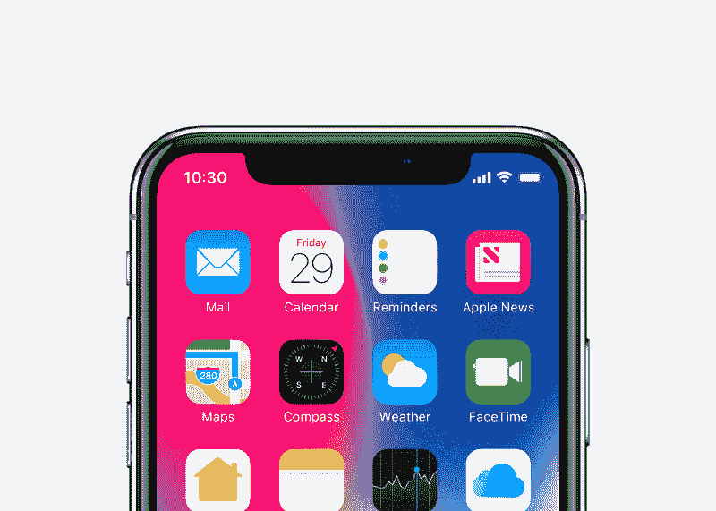
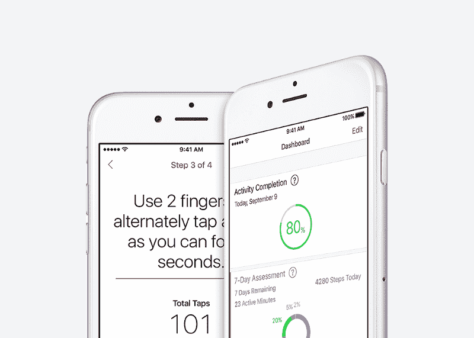

# iPhone X 的 TrueDepth 红外摄像头:超越阿尼莫吉斯和 Face ID 的无限可能

> 原文：<https://www.freecodecamp.org/news/the-iphone-xs-truedepth-ir-camera-a-universe-of-possibilities-beyond-animojis-and-face-id-ebcb5d2a7aca/>

作者詹姆斯·许

# iPhone X 的 TrueDepth 红外摄像头:超越阿尼莫吉斯和 Face ID 的无限可能

(Photo credit: Apple)

iPhone X 发布两个多月后，对于一些人来说，究竟哪些功能可以证明苹果旗舰手机 1000 多美元的价格是合理的，这仍然是一个难题。

有些人可能会押注于几乎是边到边的有机发光二极管显示屏，这是 iPhone 上第一次取消了以前所有型号的触摸主页按钮和突出的顶部和底部边框。诚然*华丽*。

然而，事实证明，iPhone X 最具突破性的功能乍一看并不明显，尽管它就在你面前。

### 认识 TrueDepth 红外摄像机

在史蒂夫·乔布斯去世后的六年里，苹果公司的产品路线图已经变得保守和可预测。新的 TrueDepth 红外摄像头，苹果称之为 iPhone X 的第二前置摄像头，可以很好地帮助苹果驱散那些自满的谣言。

这项技术是 iPhone X 的新技术，位于显示屏顶部的黑色凹槽中，包括许多高科技组件，如“泛光照明器”、红外(IR)摄像头和红外发射器。当检测到人脸时，后者会以已知的模式发射 30，000 个红外点，使 iPhone X 能够生成用户面部的 3D 地图。值得注意的是，TrueDepth 红外相机可以足够快地做到这一点，以支持 3D 运动数据的创建。

TrueDepth IR can create a 3D map of your face using an infrared camera and emitter. (Photo credit: Apple)

#### **目前，iPhone X 上新的 TrueDepth 红外摄像头目前有两种受支持的用例:**

*   Animoji(动画表情符号)——相机会用你捕捉到的面部表情制作一个 3D 表情符号，然后你可以通过 Messenger 或 SMS 发送它。
*   **Face ID** —这款相机使用本地存储的你面部的 3D 图像来验证和解锁你的 iPhone X。因为它使用 3D 图像数据，所以比以前使用 2D 图像的移动人脸识别系统更难欺骗，因此可能会被照片欺骗。

Animojis are certainly fun, but they only scratch the surface of what’s possible. (Photo credit: Apple)

### “什么——就这样？”

不可否认的是，这项技术的当前用例是有限的。

Animoji 只是一个有趣的表情符号，解锁手机并不是现代智能手机用户的一个痛点，许多手机上都有指纹传感器，图案绘制是一个足够的次要选项。

令人难以置信的是，TrueDepth 红外相机技术可以并将在不久的将来有更强大的应用。与 iPhone 之前的触控 ID(指纹传感器)一样，iOS SDK 使应用程序开发人员可以轻松地将 Face ID 和 TrueDepth 红外相机用于无数其他更引人注目的用例。事实上，Face ID 使用与触控 ID 完全相同的 API，使得在移动应用中的实现非常简单。

以下是 TrueDepth 红外相机可以产生有用或有趣的移动应用的一些领域:

### 金融服务和网上银行

十多年来，网上银行认证的黄金标准一直是双因素认证。双因素身份认证最常见的形式之一是向您的手机或电子邮件地址发送验证码，然后必须手动输入验证码和密码才能访问您的帐户。

在过去的几年里，手机银行应用迅速增加了对指纹认证的支持。这使得使用手机在线访问您的银行账户变得前所未有的容易。对于银行来说，这意味着客户可以更容易地获得他们的服务，从而增加收入。

既然基于指纹的身份认证已经变得更加方便，为什么银行还会关心在他们的移动应用中实现人脸识别呢？为了理解原因，让我们考虑假阳性率，即任何给定的身份验证协议提供假身份验证的比率。苹果声称，其基于指纹的认证触控 ID 的误报率为五万分之一。相比之下，猜中四位数密码的几率是万分之一。

现在，让我们来看看 iPhone X 的新 Face ID 功能。苹果声称 Face ID 的误报率约为 1/100 万。*如果属实，这表示与基于指纹的身份验证相比，准确性提高了 20 倍，与四位数 PIN 相比，准确性提高了 100 倍。*

这肯定会引起提供网上银行服务的银行的注意，也会引起从增强的欺诈保护中受益的消费者的注意。事实上，许多银行已经在其 iOS 应用中实现了 Face ID 支持。例如，Chase 在 iPhone X 发布后两周内就增加了对 Face ID 的支持。

### 娱乐和乐趣

iOS 11 推出了 [ARKit](https://developer.apple.com/arkit/) ，这是一个新的框架，允许开发者轻松地为 iPhone 和 iPad 创建无与伦比的增强现实体验。结合 iPhone X 的 TrueDepth 红外摄像头，ARKit 为跨多个应用类别的鲁棒人脸跟踪开辟了一个革命性的功能。

想象一下:

*   进入《刺客信条:身份》的角色创建界面，不仅可以选择刺客的职业，还可以选择他们的视觉身份，用你自己的脸代替默认角色模型的脸
*   在您选择在 Tinder、Bumble 或 POF 上向左滑动或向右滑动之前，更准确地查看潜在匹配者的面部
*   能够跳过去丝芙兰或 ULTA 的旅程，尝试新的化妆品，而不用预先支付所有费用

几年前，虚拟现实(VR)技术与 TrueDepth IR 背后的技术现在处于相同的位置:这是一项有前途的技术，需要在视频游戏和娱乐中有更强的应用。

虚拟现实公司 Oculus 成立于 2012 年，当年在 Kickstarter 上进行了一次成功的活动，筹集了 250 万美元。仅仅两年后的 2014 年，Oculus 被脸书以 20 亿美元的价格收购，相当于初始融资的近 1000 倍。投资于使用 TrueDepth IR 技术的娱乐应用的公司能找到类似的轨迹吗？

这个领域也有先例。两年前，当面部跟踪仍然基于二维图像时，[脸书收购了(未披露金额)masquence](http://www.latimes.com/business/technology/la-fi-tn-facebook-masquerade-20160309-snap-story.html)，这是一家初创公司，其 MSQRD 应用程序允许用户使用面部跟踪技术创建自我改变的图像和视频。

### 医疗和健身

想象一下，在你的床、沙发或办公椅上，根据需要，可以在一天的任何时间进行体检。在 iPhone X 的 TrueDepth 红外摄像头的帮助下，这可能会成为现实。

TrueDepth IR 技术有潜力用于医学成像，因为它可以创建详细的面部 3D 地图，包括皮肤表面。值得注意的是，它还可以捕捉 3D 运动，包括面部表情的细微变化。

考虑以下潜在的医疗使用案例:

*   例如，让皮肤科医生检查异常的皮肤生长，并能够旋转图像以更好地查看潜在肿瘤的结构。
*   让你的手机在注意到可能与中风、癫痫或心脏病发作有关的面部暗示或细微动作时自动提醒你。
*   对于正在康复的中风患者，你可能会有一个应用程序来跟踪任何肌肉退化，并根据需要向医生提供详细的 3D 图像数据。

虽然这些使用案例肯定不会取代亲自检查的需要，但通过手机摄像头进行定期筛查可以在实现早期检测或定期监测已知医疗状况方面发挥支持作用。

再考虑一下，苹果已经发布了一个名为 Apple Healthkit 的软件开发工具包(SDK)，它允许应用程序开发人员 API 访问各种来源的丰富健康和健身信息:健身可穿戴设备、健康设备和软件应用程序。新的或更新的移动应用程序可能会将苹果 Healthkit 的健康指标与 3D 面部图像数据相结合，以提供对用户健康或健身的更完整评估。

Apple Healthkit integrations will allow TrueDepth IR to be used for health and fitness assessments. (Photo credit: Apple)

### 未来就在这里

iPhone X 是第一款提供深度感应红外摄像头的手机，但肯定不会是最后一款。

CitrusBits 的首席执行官哈利·李(Harry Lee)表示:“随着该技术使广泛的新用例成为可能，软件开发商和大胆的企业现在有动力将这些应用程序带入生活。CitrusBits 总部位于洛杉矶和旧金山，是一家移动应用开发机构，为一些世界知名品牌设计和开发屡获殊荣的移动应用，包括汉堡王、赛门铁克和 Quiksilver。

李开复解释道:“那些现在确实采用该技术的公司可以享受先发优势，例如建立可观市场份额的能力，以及阻止未来市场进入者的强大网络效应——更不用说被脸书、微软或另一家行业巨头收购的机会，”。

想看更多像这样的故事，订阅 CitrusBits 的时事通讯， [Bits & Bytes](http://eepurl.com/dhLqQ9) 。