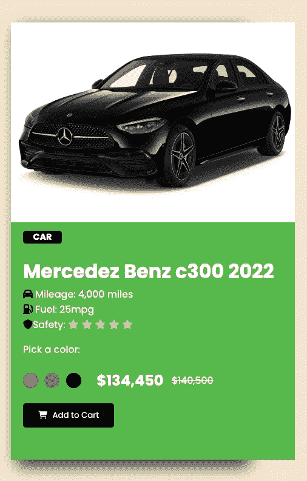
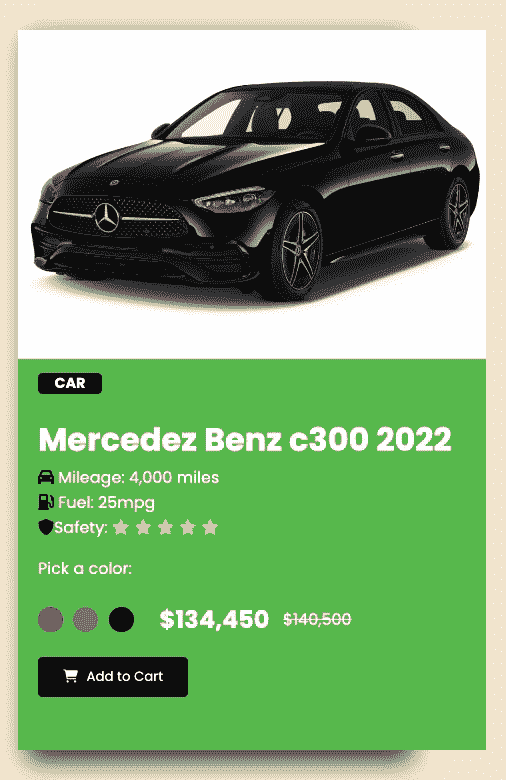
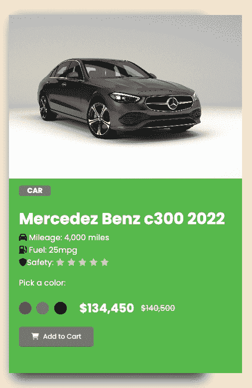
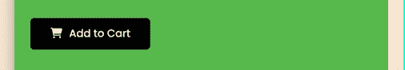

# JavaScript DOM 如何工作——实用教程

> 原文：<https://www.freecodecamp.org/news/the-javascript-dom-a-practical-tutorial/>

如果你在一个应用程序上听音乐，你想暂停或跳过一首歌，你必须通过应用程序来完成。

这个过程类似于文档对象模型或 DOM 的工作方式。在这里，音乐应用程序代表了 DOM，因为它充当了对音乐进行更改的媒介。

在本教程中，您将学习什么是 DOM，以及它是如何以一种实用的方式工作的。

## 这只狗是什么

DOM 是一个 Web API，它允许开发人员使用编程逻辑来修改他们的 HTML 代码。这是一种将静态网站转变为动态网站的可靠方法。

这是 web 开发中的一个重要话题，因为 DOM 是 JavaScript 在浏览器中的初始用途。

在被浏览器解析之前，HTML 代码不被认为是 DOM 的一部分。要查看解析发生时 HTML 代码会发生什么，从 **`<body>`** 标签复制代码并粘贴到[这里](https://software.hixie.ch/utilities/js/live-dom-viewer/)(在三个点后标题为“要测试的标记”的框内)。

## 我们在建造什么？

在本文中，我们将通过构建这个简单的项目来学习 DOM 中最重要和最常用的部分:



在 CodePen [上查看此处](https://codepen.io/ophyboamah/pen/bGMdbve)。

## 项目功能

正如您在上面的项目演示中看到的，这些是我们将实施的功能:

1.  **动态颜色变化**:当点击一种颜色时，汽车图像、addToCart 按钮和标签的颜色都会发生变化，以匹配所选的颜色。
2.  **按钮开关**:点击 addToCart 按钮显示成功按钮，反之亦然。

## 先决条件

*   HTML 和 CSS 的基础知识。
*   JavaScript 的基础知识
*   一个 IDE(文本编辑器)
*   网络浏览器

**NB:** 因为本文的目标是学习 JavaScript 和 DOM，所以我们不会过多强调 HTML 和 CSS 代码。我们将先快速浏览一遍，以便您可以设置应用程序。然后我们将深入了解 DOM。

## HTML 代码:

在我们的`index.html`文件中，我们将创建项目的基本结构，包括链接我们的 CSS 文件、字体 Awesome 和 Google 字体——所有这些都在我们的`<head>`标签中。在我们的`<body>`标签中，我们将创建我们的产品卡，并在`<body>`标签的末尾链接我们的 JavaScript 标签。

```
<!DOCTYPE html>
<html lang="en">
  <head>
    <meta charset="UTF-8" />
    <meta http-equiv="X-UA-Compatible" content="IE=edge" />
    <meta name="viewport" content="width=device-width, initial-scale=1.0" />
    <link
      rel="stylesheet"
      href="https://cdnjs.cloudflare.com/ajax/libs/font-awesome/6.1.2/css/all.min.css"
      integrity="sha512-1sCRPdkRXhBV2PBLUdRb4tMg1w2YPf37qatUFeS7zlBy7jJI8Lf4VHwWfZZfpXtYSLy85pkm9GaYVYMfw5BC1A=="
      crossorigin="anonymous"
      referrerpolicy="no-referrer"
    />
    <link rel="preconnect" href="https://fonts.gstatic.com" crossorigin />
    <link
      href="https://fonts.googleapis.com/css2?family=Poppins:wght@400;500;700&display=swap"
      rel="stylesheet"
    />
    <link rel="stylesheet" href="style.css" />
    <title>Practicalized DOM</title>
  </head>
  <body>
    <div class="product-card">
      <div class="product-image">
        <!--  -->
      </div>
      <div class="product-description">
        <h3 class="tag">CAR</h3>
        <h1 class="product-title">Mercedez Benz c300 2022</h1>
        <p class="product-details">
          <span class="mileage">
            <span style="font-size: 1em; color: black"
              ><i class="fa-solid fa-car"></i
            ></span>
            Mileage: 4,000 miles
          </span>
          <span class="fuel">
            <span style="font-size: 1em; color: black"
              ><i class="fa-solid fa-gas-pump"></i
            ></span>
            Fuel: 25mpg
          </span>
          <span class="safety">
            <span style="font-size: 1em; color: black"
              ><i class="fa-solid fa-shield"></i></span
            >Safety:
            <span class="stars">
              <i class="fa-solid fa-star"></i>
              <i class="fa-solid fa-star"></i>
              <i class="fa-solid fa-star"></i>
              <i class="fa-solid fa-star"></i>
              <i class="fa-solid fa-star"></i>
            </span>
          </span>
        </p>
        <p>Pick a color:</p>
        <div class="colors-price">
          <div class="colors">
            <span class="red"></span>
            <span class="gray"></span>
            <span class="black"></span>
          </div>
          <div class="pricing">
            <h2 class="new-price">$134,450</h2>
            <h4 class="old-price"><s>$140,500</s></h4>
          </div>
        </div>
        <button id="button">
          <span style="font-size: 1em; color: white">
            <i class="fa-solid fa-cart-shopping"></i>
          </span>
          <span class="button-text">Add to Cart</span>
        </button>
        <button class="feedback">
          <span id="white-button"
            >🥳 Woohoo, You're about to own a benz 🎊</span
          >
        </button>
      </div>
    </div>
    <script src="app.js"></script>
  </body>
</html>
```

## CSS 代码:

在我们的`style.css`文件中，我们将首先像这样设置我们的通用样式:

```
* {
  font-family: "Poppins", sans-serif;
}

body {
  height: 100vh;
  display: flex;
  justify-content: center;
  align-items: center;
  overflow-y: hidden;
  background-color: antiquewhite;
} 
```

接下来，我们将设计我们的产品，从标签、图片、描述和细节开始。

```
/* product tag */
.tag {
  font-size: 0.9rem;
  background-color: black;
  border-radius: 5px;
  width: 4rem;
  display: flex;
  justify-content: center;
  color: #fff;
}

/* product*/
.product-title {
  font-size: 2rem;
  font-weight: 700;
}

.product-card {
  background: #fff;
  display: grid;
  /* align-items: center; */
  grid-template-rows: 55% 45%;
  height: 80%;
  width: 30%;
  box-shadow: 10px 10px 25px 0px #3c3c3c;
}

.product-image {
  /* border: 2px solid black; */
  background-image: url("./img/black-benz.jpg");
  background-position: center;
  background-repeat: no-repeat;
  background-size: cover;
  padding: 40px 10px;
  width: 28rem;
  height: 66%;
}

.product-description {
  background-color: #62c256;
  color: #fff;
  padding-left: 20px;
  margin-top: -67px;
}

.product-details {
  display: flex;
  flex-direction: column;
  margin-top: -20px;
}

.product-image img {
  width: 28rem;
}

.stars {
  color: yellow;
  font-size: 1em;
}
```

然后，我们将样式化我们的颜色:它们的价格，作为一个组的颜色，和单独的颜色。

```
/* colors */
.colors-price {
  display: flex;
  align-items: center;
  width: 70%;
  justify-content: space-between;
  margin-top: -15px;
}

.colors {
  display: flex;
  width: 6rem;
  justify-content: space-between;
  cursor: pointer;
}

.red {
  background: red;
  width: 25px;
  height: 25px;
  border-radius: 50%;
}

.gray {
  background: gray;
  width: 25px;
  height: 25px;
  border-radius: 50%;
}

.black {
  background: black;
  width: 25px;
  height: 25px;
  border-radius: 50%;
}

.pricing {
  display: flex;
  width: 12rem;
  justify-content: space-between;
  align-items: center;
}

.old-price {
  font-weight: 100;
} 
```

最后，我们将使用以下代码来设计按钮的样式:

```
/* buttons */
button {
  cursor: pointer;
}

#button {
  background-color: #000;
  padding: 10px 25px;
  border: none;
  border-radius: 5px;
}

button white-button {
  background-color: #fff;
}

.button-text {
  color: #fff;
  margin-left: 5px;
}

.feedback {
  display: none;
  padding: 10px 25px;
  border: none;
  border-radius: 5px;
}
```

## DOM 实现

DOM 中的所有东西都属于这两类:选择元素和操作元素。创建完 HTML 和 CSS 文件后，我们进入`app.js`文件来实现以下内容:

1.  **Select** :我们从 HTML 代码中引用所有想要动态化的元素，并在 JavaScript 文件中给它们分配变量。
2.  **操纵**:一旦我们选择并链接了变量，我们就创建负责操纵的各种函数，然后链接到变量。

## 如何在 DOM 中选择元素

要访问您想要操作的 HTML 元素，您需要让 JavaScript 知道这些元素的存在。这就是通常所说的“选择”元素——基本上是将它们链接起来。

在 DOM 中，没有一种方法可以定位和引用元素进行操作。相反，它将取决于您在元素标签中使用的[选择器](https://developer.mozilla.org/en-US/docs/Web/CSS/CSS_Selectors)。

您可以通过将元素赋给变量来实现这一点。它采用以下格式。请记住，所有 DOM 选择器前面都有一个文档对象和一个点:

```
const example = document.[DOMselector]
```

在我们的 JavaScript 文件中，我们必须选择所有想要操作的元素，比如按钮、颜色、图像卡和标签。

我们将尽可能多地使用 DOM 选择器，所以让我们了解更多关于它们的知识。

### 如何使用`querySelector`

`querySelector`是一个在字符串中接受精确 CSS 选择器并返回一个元素的方法。您可以使用它来选择红色和黑色以及图像卡，使用它们的类名。

如果你想用这种方法选择并返回多个元素，你可以用 **`QuerySelectorAll`** 来代替。

```
const redColor = document.querySelector(".red");
```

上面的代码将 HTML 代码中带有类“red”`<span class="red"></span>`的 span 链接到 JavaScript 中的变量 redColor。

```
const blackColor = document.querySelector(".black"); 
```

上面的代码将 HTML 代码中的 span 和 class "black" `<span class="black"></span>`链接到 JavaScript 中的变量 blackColor。

```
const imageCard = document.querySelector(".product-image");
```

上面的代码将 HTML 代码中带有“product-image”`<div class="product-image">`类的 div 链接到 JavaScript 中的变量 imageCard。

```
const feedbackBtn = document.querySelector(".feedback");
```

上面的代码将我们的 HTML 代码中带有“feedbackBtn】类的按钮链接到我们的 JavaScript 中的变量 feedbackBtn。

### 如何使用`getElementsByClassName`

您可以使用此选择器来选择灰色。和`querySelector`很像。唯一的区别是这个方法只接受类名，没有前面的点(。)

```
const grayColor = document.getElementsByClassName("gray");
```

上面的代码将 HTML 代码中带有类" gray" `<span class="gray"></span>`的 span 链接到 JavaScript 中的变量 grayColor。

### 如何使用`getElementById`

您可以使用这个选择器来选择购物车按钮。和`getElementsByClassName`很像。唯一的区别是，因为我们使用 ID 来显示惟一性，所以它只用于一个元素。这个方法读取不带 s 的 getElement，*。*

```
const cartButton = document.getElementById("button");
```

上面的代码将 HTML 代码中 id 为" button" `<button id="button">`的按钮链接到 JavaScript 中的变量 cartButton。

### 如何使用`GetElementsByTagName`

属性不是选择元素的唯一方式。您也可以使用标记名。如果你不止一次使用了你的目标标签，那么它将返回一个元素列表。使用索引来选择正确的。

```
const itemTag = document.getElementsByTagName("h3")[0];
```

上面的代码将包含我们的 HTML 代码中的产品标签`<h3 class="tag">`的 h3 链接到我们的 JavaScript 中的变量 itemTag。

在所有这些方法中，querySelector 和 querySelectorAll 可能是最受欢迎的，因为它们非常通用且限制较少。

## 如何操作 DOM 中的元素

操作是 DOM 的主要目的。它是在您引用并选择您想要处理的元素之后发生的所有事情。这导致元素的状态从静态变为动态。

理解 DOM 操作需要知道的两个概念是**事件**和**处理程序**。

### 什么是事件？

让我们用之前同样的音乐类比。在音乐应用程序上，你必须执行一个动作(点击或滑动)才能启动功能。

在 DOM 中，这个动作被称为事件。有点击、滚动、鼠标悬停、更改等事件。

在 DOM 中，响应与每个事件相关联。这意味着应该对事件进行监视，以便做出响应。这就是所谓的**事件监听器**。事件监听器通常以带两个参数(事件、事件处理程序)的`addEventListener`方法的形式出现。

#### 对事件的剖析

DOM 事件通常包含一个元素、它的事件侦听器和一个函数。

```
element.[eventListenerMethod(event, eventHandler)
```

### 什么是事件处理程序？

事件处理程序是当我们的事件侦听器方法读取事件时触发的响应。如果没有事件处理程序，就没有办法提醒我们的代码事件已经发生。

DOM 中发生的所有修改，比如样式化、追加、删除等等，都依赖于事件处理程序。它们是在 **addEventListener** 方法的第二个参数中找到的函数。一旦事件(第一个参数)发生，它们总是警觉地运行。

```
redColor.addEventListener("click", function () {
  cartButton.style.backgroundColor = "red";
  itemTag.style.backgroundColor = "red";
  imageCard.style.backgroundImage = 'url("./img/red-benz.webp")';
});
```

在上面的代码中,“click”事件之后的函数是事件处理程序。这意味着一旦红色被点击，该函数中的所有内容都将被执行。

## 如何实现事件和事件处理程序

在这个项目中，我们将在大约 5 个实现中使用事件和事件处理程序。我们现在将逐一介绍。

首先，我们将使用它们来**使红色起作用**。一旦用户点击红色，购物车按钮和商品标签就会被赋予红色背景的样式。图像卡也会被分配一个红色背景图像。

我们通过获取变量`redColor`并添加一个“click”事件监听器来实现这一点。这意味着我们希望我们的代码在红色被点击时得到提醒。作为回报，事件处理程序`function`将立即运行。

```
redColor.addEventListener("click", function () {
  cartButton.style.backgroundColor = "red";
  itemTag.style.backgroundColor = "red";
  imageCard.style.backgroundImage = 'url("./img/red-benz.webp")';
});
```

Making Red Color Functional



Red color preview

然后我们将**使灰色起作用**。当用户单击灰色时，购物车按钮和商品标签以灰色背景色的形式被分配样式。图像卡也被分配了一个灰色背景图像。

我们通过获取变量`grayColor`并添加一个“click”事件监听器来实现这一点。这意味着我们希望我们的代码在灰色被点击时得到提醒。作为回报，事件处理程序`function`将立即运行。

```
grayColor[0].addEventListener("click", function () {
  cartButton.style.backgroundColor = "gray";
  itemTag.style.backgroundColor = "gray";
  imageCard.style.backgroundImage = 'url("./img/gray-benz.jpg")';
});
```

Making Gray Color Functional


Gray color preview

接下来，我们将使**黑色功能**。当用户单击黑色时，购物车按钮和商品标签以黑色背景色的形式被分配样式。图像卡也被分配了黑色背景图像。

我们通过获取变量`blackColor`并添加一个“click”事件监听器来实现这一点。这意味着我们希望我们的代码在黑色被点击时得到提醒。作为回报，事件处理程序`function`将立即运行。

```
blackColor.addEventListener("click", function () {
  cartButton.style.backgroundColor = "black";
  itemTag.style.backgroundColor = "black";
  imageCard.style.backgroundImage = 'url("./img/black-benz.jpg")';
});
```

Making Black Color Functional



Black color preview

我们已经看到了一种处理事件的方法，即在 addEventListener 方法中创建函数。

另一种方法是在 addEventListener 方法中将函数名作为参数传递之前创建一个函数。

### 如何实现购物车按钮

我们首先创建一个名为 cart 的函数。购物车功能隐藏购物车按钮并显示反馈按钮。然后将函数名 cart 作为第二个参数传递给事件监听器方法。

```
const cart = () => {
  cartButton.style.display = "none";
  feedbackBtn.style.display = "block";
};
cartButton.addEventListener("click", cart);
```

Cart Button Implementation



Cart button preview

### 如何实现反馈按钮

我们首先创建一个名为 feedback 的函数。反馈功能隐藏反馈按钮并显示购物车按钮。然后，函数名反馈作为第二个参数传递给事件侦听器方法。

```
const feedback = () => {
  cartButton.style.display = "block";
  feedbackBtn.style.display = "none";
};
feedbackBtn.addEventListener("click", feedback);
```

Feedback Button Implementation


Feedback button preview

## 完整的项目代码

这是我们在本文中共同构建的项目:


以下是完整的 HTML 代码:

```
<!DOCTYPE html>
<html lang="en">
  <head>
    <meta charset="UTF-8" />
    <meta http-equiv="X-UA-Compatible" content="IE=edge" />
    <meta name="viewport" content="width=device-width, initial-scale=1.0" />
    <link
      rel="stylesheet"
      href="https://cdnjs.cloudflare.com/ajax/libs/font-awesome/6.1.2/css/all.min.css"
      integrity="sha512-1sCRPdkRXhBV2PBLUdRb4tMg1w2YPf37qatUFeS7zlBy7jJI8Lf4VHwWfZZfpXtYSLy85pkm9GaYVYMfw5BC1A=="
      crossorigin="anonymous"
      referrerpolicy="no-referrer"
    />
    <link rel="preconnect" href="https://fonts.gstatic.com" crossorigin />
    <link
      href="https://fonts.googleapis.com/css2?family=Poppins:wght@400;500;700&display=swap"
      rel="stylesheet"
    />
    <link rel="stylesheet" href="style.css" />
    <title>Practicalized DOM</title>
  </head>
  <body>
    <div class="product-card">
      <div class="product-image">
        <!--  -->
      </div>
      <div class="product-description">
        <h3 class="tag">CAR</h3>
        <h1 class="product-title">Mercedez Benz c300 2022</h1>
        <p class="product-details">
          <span class="mileage">
            <span style="font-size: 1em; color: black"
              ><i class="fa-solid fa-car"></i
            ></span>
            Mileage: 4,000 miles
          </span>
          <span class="fuel">
            <span style="font-size: 1em; color: black"
              ><i class="fa-solid fa-gas-pump"></i
            ></span>
            Fuel: 25mpg
          </span>
          <span class="safety">
            <span style="font-size: 1em; color: black"
              ><i class="fa-solid fa-shield"></i></span
            >Safety:
            <span class="stars">
              <i class="fa-solid fa-star"></i>
              <i class="fa-solid fa-star"></i>
              <i class="fa-solid fa-star"></i>
              <i class="fa-solid fa-star"></i>
              <i class="fa-solid fa-star"></i>
            </span>
          </span>
        </p>
        <p>Pick a color:</p>
        <div class="colors-price">
          <div class="colors">
            <span class="red"></span>
            <span class="gray"></span>
            <span class="black"></span>
          </div>
          <div class="pricing">
            <h2 class="new-price">$134,450</h2>
            <h4 class="old-price"><s>$140,500</s></h4>
          </div>
        </div>
        <button id="button">
          <span style="font-size: 1em; color: white">
            <i class="fa-solid fa-cart-shopping"></i>
          </span>
          <span class="button-text">Add to Cart</span>
        </button>
        <button class="feedback">
          <span id="white-button"
            >🥳 Woohoo, You're about to own a benz 🎊</span
          >
        </button>
      </div>
    </div>
    <script src="app.js"></script>
  </body>
</html> 
```

Project HTML Code

这是 CSS:

```
* {
  font-family: "Poppins", sans-serif;
}

body {
  height: 100vh;
  display: flex;
  justify-content: center;
  align-items: center;
  overflow-y: hidden;
  background-color: antiquewhite;
}

/* product tag */
.tag {
  font-size: 0.9rem;
  background-color: black;
  border-radius: 5px;
  width: 4rem;
  display: flex;
  justify-content: center;
  color: #fff;
}

/* product*/
.product-title {
  font-size: 2rem;
  font-weight: 700;
}

.product-card {
  background: #fff;
  display: grid;
  /* align-items: center; */
  grid-template-rows: 55% 45%;
  height: 80%;
  width: 30%;
  box-shadow: 10px 10px 25px 0px #3c3c3c;
}

.product-image {
  /* border: 2px solid black; */
  background-image: url("./img/black-benz.jpg");
  background-position: center;
  background-repeat: no-repeat;
  background-size: cover;
  padding: 40px 10px;
  width: 28rem;
  height: 66%;
}

.product-description {
  background-color: #62c256;
  color: #fff;
  padding-left: 20px;
  margin-top: -67px;
}

.product-details {
  display: flex;
  flex-direction: column;
  margin-top: -20px;
}

.product-image img {
  width: 28rem;
}

.stars {
  color: yellow;
  font-size: 1em;
}

/* colors */
.colors-price {
  display: flex;
  align-items: center;
  width: 70%;
  justify-content: space-between;
  margin-top: -15px;
}

.colors {
  display: flex;
  width: 6rem;
  justify-content: space-between;
  cursor: pointer;
}

.red {
  background: red;
  width: 25px;
  height: 25px;
  border-radius: 50%;
}

.gray {
  background: gray;
  width: 25px;
  height: 25px;
  border-radius: 50%;
}

.black {
  background: black;
  width: 25px;
  height: 25px;
  border-radius: 50%;
}

.pricing {
  display: flex;
  width: 12rem;
  justify-content: space-between;
  align-items: center;
}

.old-price {
  font-weight: 100;
}

/* buttons */
button {
  cursor: pointer;
}

#button {
  background-color: #000;
  padding: 10px 25px;
  border: none;
  border-radius: 5px;
}

button white-button {
  background-color: #fff;
}

.button-text {
  color: #fff;
  margin-left: 5px;
}

.feedback {
  display: none;
  padding: 10px 25px;
  border: none;
  border-radius: 5px;
} 
```

Project CSS Code

下面是 JavaScript 代码:

```
// 1\. Change color of car and addToCart button color when a color is selected
// - Selecting Elements
const redColor = document.querySelector(".red");
const grayColor = document.getElementsByClassName("gray");
const blackColor = document.querySelector(".black");
const cartButton = document.getElementById("button");
const itemTag = document.getElementsByTagName("h3")[0];
const imageCard = document.querySelector(".product-image");
const feedbackBtn = document.querySelector(".feedback");

// Modifying Elements
// - Add Event Listeners
// - Red Color
redColor.addEventListener("click", function () {
  cartButton.style.backgroundColor = "red";
  itemTag.style.backgroundColor = "red";
  imageCard.style.backgroundImage = 'url("./img/red-benz.webp")';
});

// - Gray Color
grayColor[0].addEventListener("click", function () {
  cartButton.style.backgroundColor = "gray";
  itemTag.style.backgroundColor = "gray";
  imageCard.style.backgroundImage = 'url("./img/gray-benz.jpg")';
});

// - Black Color
blackColor.addEventListener("click", function () {
  cartButton.style.backgroundColor = "black";
  itemTag.style.backgroundColor = "black";
  imageCard.style.backgroundImage = 'url("./img/black-benz.jpg")';
});

// Button Click Implementation
// - Cart Button
const cart = () => {
  cartButton.style.display = "none";
  feedbackBtn.style.display = "block";
};
cartButton.addEventListener("click", cart);

// - Feedback Button
const feedback = () => {
  cartButton.style.display = "block";
  feedbackBtn.style.display = "none";
};
feedbackBtn.addEventListener("click", feedback); 
```

Project JavaScript Code

# 结论

DOM 是现代 web 开发的重要组成部分，因为它帮助开发人员将网站和 web 应用程序从静态转换为动态。

作为一个初学者，很难理解 DOM 和它所包含的一切。花点时间构建几个像这样的简单项目将有助于你强化这些概念。

感谢阅读👋🏾。希望对你有帮助。