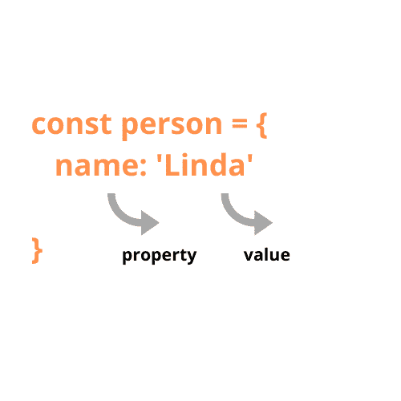

# JavaScript 的‘in’操作符用例子解释

> 原文：<https://www.freecodecamp.org/news/the-javascript-in-operator-explained-with-examples/>

学习 JavaScript(或任何其他编程语言)时，您首先会遇到的话题之一是运算符。

最常见的运算符是算术运算符、逻辑运算符和比较运算符。但是你知道 JavaScript 有一个`in`操作符吗？

如果你没有，不要烦恼。我最近在谷歌上搜索一个问题的解决方案时偶然发现了它。

在本文中，您将确切地了解 JavaScript `in`操作符做什么，何时使用它，以及如何使用它。

## operator 中的 JavaScript 到底是什么？

JavaScript `in`操作符用于检查一个指定的属性是否存在于一个对象或者它的继承属性中(换句话说，它的原型链)。如果指定的属性存在，`in`操作符返回`true`。



Anatomy of a simple JavaScript object.

JavaScript 原型链是对象或对象实例访问原本不属于它们的属性和方法的方式。这些对象继承了在它们的构造函数或原型中定义的属性和方法，可以通过它们的`__proto__`属性访问它们。

本文假设您对什么是对象、如何创建对象、对象的用途以及 JavaScript 继承的工作原理有基本的了解。如果你不知道，这篇关于 MDN 的文章应该会有所帮助。

## 何时使用 JavaScript in 运算符

### 验证对象上是否存在属性的步骤

```
const car = {
  make: 'Toyota',
  model:'Camry',
  year: '2018',
  start: function() {
    console.log(`Starting ${this.make} ${this.model}, ${this.year}`);
  }
}

'make' in car // Returns true.
'start' in car // Returns true.
'Toyota' in car // Returns false. 'Toyota' is not a property name, but a value.
```

### 验证属性是否由对象继承。

让我们使用 ES6 类语法来创建一个对象构造函数。这也适用于函数构造函数:

```
class Car {
  constructor(make, model, year) {
    this.make = make;
    this.model = model;
    this.year = year;
  }
  start() {
    console.log(`Starting ${this.make} ${this.model}, ${this.year}`);
  }
}

const toyota = new Car('Toyota', 'Camry', '2018');

'start' in toyota;
/* Returns true as toyota is an instance of the Car object constructor. The toyota object therefore inherits all properties of the Car constructor. */

'toString' in toyota;
/* Returns true. toString is a method property of the Object type, of which the Car constructor is an instance of. */
```

### 验证数组中是否存在索引/键。

您可能想知道，既然我们已经确定 JavaScript `in`操作符可以用于对象，为什么我们也可以用于数组呢？

嗯，数组实际上是`Object`类型的原型(实例)。事实上，JavaScript 中的一切都是`Object`类型的实例。

这听起来可能很疯狂，但是让我们在浏览器的控制台中运行一个简单的程序来确认一下。

首先，定义一个数组，并使用`instanceof`操作符确认它是否是`Object`类型的实例:

```
const number = [2, 3, 4, 5];

number instanceof Object // Returns true 
```

还在怀疑？在控制台中键入`number`并按 enter 键，然后打开输出。

您会注意到一个属性列表，其中一个是指向`Array`的`__proto__`。打开这个列表，我们会看到另一个价值为`Object`的`__proto__`房产。

这表明`number`数组是`Array`类型的一个实例，而后者是`Object`类型的一个实例。

现在，回到使用`in`操作符:

```
const number = [2, 3, 4, 5];

3 in number // Returns true.
2 in number // Returns true.

5 in number // Returns false because 5 is not an existing index on the array but a value;

'filter' in number
/* Returns true because filter is a method property on the Array type of which the number array is an instance of. The number array inherits the filter property.*/
```

### 验证 Html 元素上是否存在属性

在 Kirupa 的文章[中，他强调了这个功能:](https://www.kirupa.com/html5/check_if_you_are_on_a_touch_enabled_device.htm)

```
function isTouchSupported() {
  var msTouchEnabled = window.navigator.msMaxTouchPoints;
  var generalTouchEnabled = "ontouchstart" in document.createElement("div");

  if (msTouchEnabled || generalTouchEnabled) {
    return true;
  }
  return false;
} 
```

如果你在支持触摸的设备上，这个函数返回`true`，如果你在不支持触摸的设备上，通过检查属性`window.navigator.msMaxTouchPoints`和`ontouchstart`是否存在，这个函数返回`false`。这些属性只存在于支持触摸的设备上。

相当简单！

让我们关注突出显示的行。还记得我们如何确定如果指定的属性存在于一个对象中，`in`操作符返回`true`吗？JavaScript 中使用的 HTML 元素实际上变成了`Object`类型的实例，因此得名“文档对象模型”或 DOM。

当然，如果没有证据，你可能不会相信我。像以前一样，让我们在控制台中键入一些命令。

创建一个`div`元素，并使用`console.dir()`列出它的属性:

```
const element = document.createElement('div');

console.dir(element); 
```

然后您会看到`div`元素及其属性列在控制台中。

打开下拉菜单，您会注意到它有一个`HtmlDivElement`的`__proto__`属性。打开它，你会发现另一个`__proto__`属性的`HtmlElement`、**、**然后是`Element`、`Node`、`Eventtarget`，最后是`Object`、T10。

也运行:

```
element instanceof Object
```

这将返回`true`，表明`div`元素是`Object`类型的一个实例，这就是为什么可以对它使用`in`操作符。

## 结论

您已经了解了不太流行的 JavaScript `in`操作符，它用于验证对象或`Object`类型实例上属性的存在。在编写验证逻辑时，这应该会派上用场。

如果你喜欢这篇文章，你肯定会喜欢我博客上的其他文章[codewithlinda.com](https://www.codewithlinda.com/blog)。在那里，我发表了关于前端开发的初学者友好的文章，尽可能没有技术术语？。