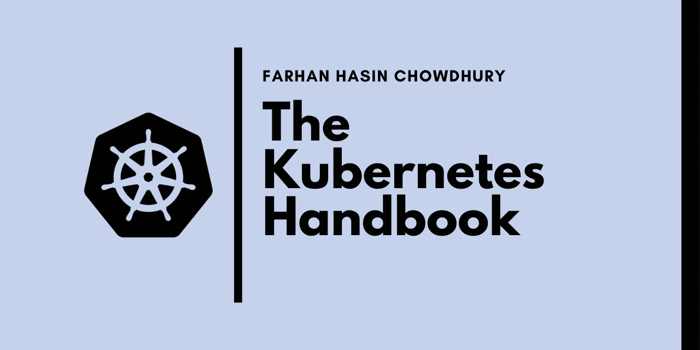
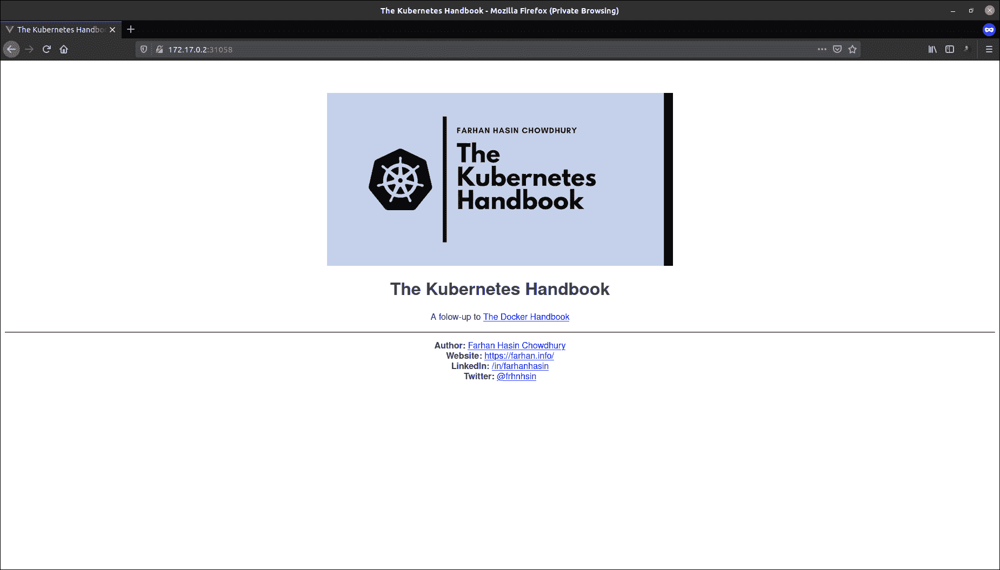
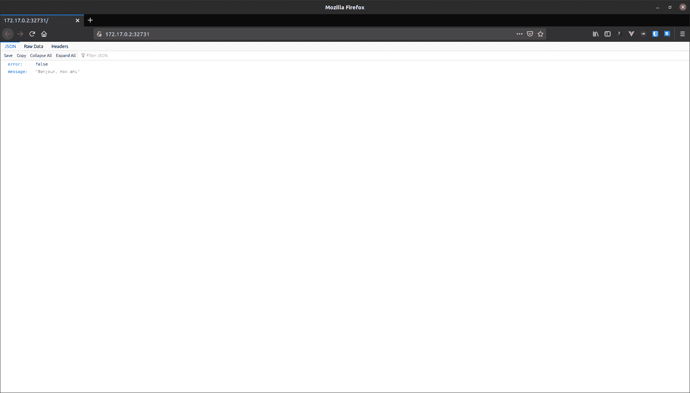
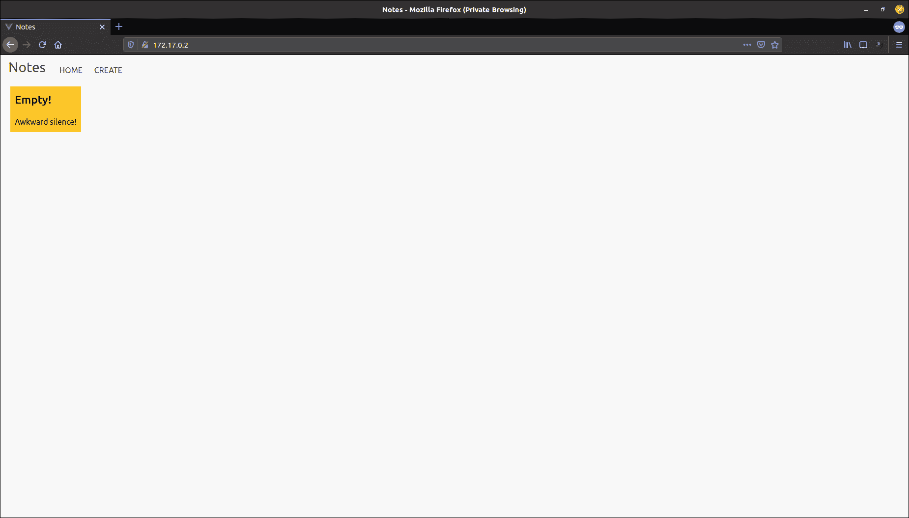
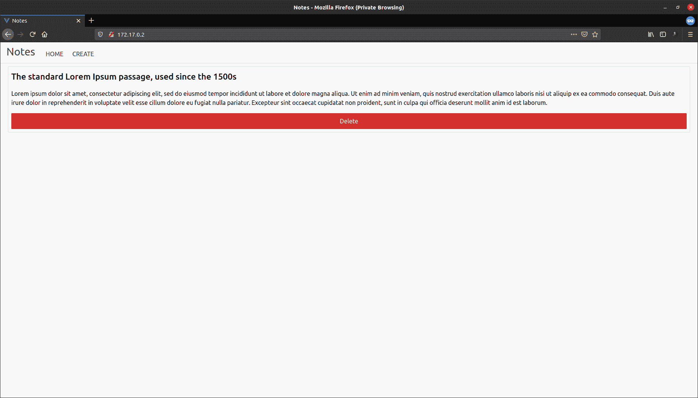

# Kubernetes 手册——初学者学习 Kubernetes

> 原文：<https://www.freecodecamp.org/news/the-kubernetes-handbook/>

Kubernetes 是一个开源的容器编排平台，它自动化了容器的部署、管理、扩展和联网。

它是由[谷歌](https://opensource.google/projects/kubernetes)使用[围棋编程语言](https://golang.org/)开发的，这项令人惊叹的技术从 2014 年开始开源。

根据 [Stack Overflow 开发者调查- 2020](https://insights.stackoverflow.com/survey/2020#overview) ，Kubernetes 是 [#3 最受喜爱的平台](https://insights.stackoverflow.com/survey/2020#technology-most-loved-dreaded-and-wanted-platforms-loved5)和 [#3 最受欢迎的平台](https://insights.stackoverflow.com/survey/2020#technology-most-loved-dreaded-and-wanted-platforms-wanted5)。

除了非常强大之外，Kubernetes 还以难以上手而闻名。我不会说这很容易，但是如果你具备了先决条件，并且用心耐心地阅读本指南，你应该能够:

*   对基本面有扎实的理解。
*   创建和管理 Kubernetes 集群。
*   将(几乎)任何应用程序部署到 Kubernetes 集群。

## 先决条件

*   熟悉 JavaScript
*   熟悉 Linux 终端
*   熟悉码头工人(建议阅读:[码头工人手册](https://www.freecodecamp.org/news/the-docker-handbook/)

## 项目代码

示例项目的代码可以在以下存储库中找到:

[fhsinchy/kubernetes-handbook-projectsProject codes used in “The Kubernetes Handbook” :notebook: - fhsinchy/kubernetes-handbook-projectsfhsinchyGitHub](https://github.com/fhsinchy/kubernetes-handbook-projects)

Spare a ⭐ to keep me motivated

你可以在`completed`分支中找到完整的代码。

## 目录

*   [容器编排和 Kubernetes 简介](#introduction-to-container-orchestration-and-kubernetes)
*   [安装立方结构](#installing-kubernetes)
*   [Kubernetes 的 Hello World](#hello-world-in-kubernetes)
    *   [立方结构](#kubernetes-architecture)
    *   [控制平面组件](#control-plane-components)
    *   [节点组件](#node-components)
    *   [Kubernetes 对象](#kubernetes-objects)
    *   [豆荚](#pods)
    *   [服务](#services)
    *   [全貌](#the-full-picture)
    *   [清除 Kubernetes 资源](#getting-rid-of-kubernetes-resources)
*   [声明式部署方法](#declarative-deployment-approach)
    *   [编写您的第一套配置](#writing-your-first-set-of-configurations)
    *   [Kubernetes 仪表盘](#the-kubernetes-dashboard)
*   [使用多容器应用程序](#working-with-multi-container-applications)
    *   [部署计划](#deployment-plan)
    *   [复制控制器、副本集和部署](#replication-controllers-replica-sets-and-deployments)
    *   [创建您的第一个部署](#creating-your-first-deployment)
    *   [考察 Kubernetes 资源](#inspecting-kubernetes-resources)
    *   [从 pod 获取集装箱日志](#getting-container-logs-from-pods)
    *   [环境变量](#environment-variables)
    *   [创建数据库部署](#creating-the-database-deployment)
    *   [持久卷和持久卷声明](#persistent-volumes-and-persistent-volume-claims)
    *   [永久卷的动态供应](#dynamic-provisioning-of-persistent-volumes)
    *   [用 pod 连接卷](#connecting-volumes-with-pods)
    *   [连接好一切](#wiring-everything-up)
*   [使用入口控制器](#working-with-ingress-controllers)
    *   [设置 NGINX 入口控制器](#setting-up-nginx-ingress-controller)
    *   [Kubernetes 中的秘密和配置图](#secrets-and-config-maps-in-kubernetes)
    *   [在 Kubernetes 中执行更新部署](#performing-update-rollouts-in-kubernetes)
    *   [组合配置](#combining-configurations)
*   [故障排除](#troubleshooting)
*   [结论](#conclusion)

## 容器编排和 Kubernetes 简介

根据[红帽](https://www.redhat.com/en/topics/containers/what-is-container-orchestration) —

> 容器编排是自动化容器的部署、管理、扩展和联网任务的过程。它可以在任何使用容器的环境中使用，并且可以帮助您在不同的环境中部署相同的应用程序，而不需要任何重新设计”。

让我给你看一个例子。假设您已经开发了一个惊人的应用程序，它根据一天中的不同时间向人们建议应该吃什么。

现在假设您已经使用 Docker 封装了应用程序，并将其部署在 AWS 上。


如果应用程序由于任何原因关闭，用户将立即无法访问您的服务。

要解决这个问题，您可以制作同一应用程序的多个拷贝或副本，并使其高度可用。


即使其中一个实例关闭，其他两个实例仍可供用户使用。

现在假设您的应用程序在夜猫子中变得非常流行，并且您的服务器在晚上您睡觉时被请求淹没。

如果所有实例都因过载而停止运行，该怎么办？谁来做缩放？即使您扩大规模，为您的应用程序制作 50 个副本，谁来检查它们的运行状况？如何设置网络，使请求到达正确的端点？负载平衡也将是一个大问题，不是吗？

Kubernetes 可以让这种情况变得简单得多。这是一个容器编排平台，由几个组件组成，它不知疲倦地工作，以保持您的服务器处于您想要的状态。

假设您想让应用程序的 50 个副本连续运行。即使用户数量突然增加，服务器也需要自动扩展。

你只需要告诉 Kubernetes 你的需求，它会为你做剩下的工作。


Kubernetes 不仅会实现国家，还会维护它。如果任何旧的副本失效，它将制作额外的副本，管理网络和存储，部署或回滚更新，甚至在必要时升级服务器。

## 正在安装 kubernetes

在本地机器上运行 Kubernetes 实际上与在云上运行 Kubernetes 有很大不同。要启动并运行 Kubernetes，您需要两个程序。

*   minikube -它在本地计算机上的虚拟机(VM)中运行单节点 Kubernetes 集群。
*   kube CTL——Kubernetes 命令行工具，允许您对 Kubernetes 集群运行命令。

除了这两个程序，您还需要一个管理程序和一个容器化平台。Docker 是集装箱化平台的明显选择。推荐的虚拟机管理程序如下:

*   用于 Windows 的 Hyper-V
*   [Mac 版 HyperKit](https://github.com/moby/hyperkit)
*   用于 Linux 的坞站

Hyper-V 作为可选功能内置于 Windows 10(专业版、企业版和教育版)中，可以从控制面板中打开。

HyperKit 作为核心组件与 Docker Desktop for Mac 捆绑在一起。

而在 Linux 上，你可以直接使用 Docker 绕过整个 hypervisor 层。这比使用任何管理程序都要快得多，是在 Linux 上运行 Kubernetes 的推荐方式。

您可以继续安装上述任何虚拟机管理程序。或者如果你想让事情变得简单，只需获得 [VirtualBox](https://www.virtualbox.org/) 。

在本文的其余部分，我将假设您使用的是 VirtualBox。不过不要担心，即使你用的是别的东西，也不会有太大的区别。

> 在整篇文章中，我将在一台 [Ubuntu](https://www.freecodecamp.org/news/p/c4f90e6f-97af-41ce-b775-b6e52a5a5152/ubuntu.com/) 机器上使用`minikube`和 Docker 驱动程序。

一旦安装了管理程序和容器化平台，就该安装`minikube`和`kubectl`程序了。

通常与 Mac 和 Windows 上的 Docker 桌面捆绑在一起。Linux 的安装说明可以在[这里](https://kubernetes.io/docs/tasks/tools/install-kubectl/)找到。

另一方面，`minikube`必须安装在所有三个系统上。可以在 Mac 上使用[家酿](https://brew.sh/)，在 Windows 上使用[巧克力](https://chocolatey.org/)安装`minikube`。Linux 的安装说明可以在[这里](https://kubernetes.io/docs/tasks/tools/install-minikube/)找到。

安装后，您可以通过执行以下命令来测试这两个程序:

```
minikube version

# minikube version: v1.12.1
# commit: 5664228288552de9f3a446ea4f51c6f29bbdd0e0

kubectl version

# Client Version: version.Info{Major:"1", Minor:"18", GitVersion:"v1.18.6", GitCommit:"dff82dc0de47299ab66c83c626e08b245ab19037", GitTreeState:"clean", BuildDate:"2020-07-16T00:04:31Z", GoVersion:"go1.14.4", Compiler:"gc", Platform:"darwin/amd64"}
# Server Version: version.Info{Major:"1", Minor:"18", GitVersion:"v1.18.3", GitCommit:"2e7996e3e2712684bc73f0dec0200d64eec7fe40", GitTreeState:"clean", BuildDate:"2020-05-20T12:43:34Z", GoVersion:"go1.13.9", Compiler:"gc", Platform:"linux/amd64"}
```

如果您已经下载了适用于您的操作系统的正确版本，并正确设置了路径，那么您应该准备好了。

正如我已经提到的，`minikube`在本地计算机上的虚拟机(VM)中运行单节点 Kubernetes 集群。我将在下一节更详细地解释集群和节点。

现在，请理解`minikube`使用您选择的虚拟机管理程序创建一个常规虚拟机，并将其视为 Kubernetes 集群。

> 如果您在本部分遇到任何问题，请查看本文末尾的[故障排除](#troubleshooting)部分。

在您启动`minikube`之前，您必须为它设置正确的管理程序驱动程序。要将 VirtualBox 设置为默认驱动程序，请执行以下命令:

```
minikube config set driver virtualbox

# ❗ These changes will take effect upon a minikube delete and then a minikube start
```

您可以根据自己的喜好将`virtualbox`替换为`hyperv`、`hyperkit`或`docker`。该命令仅在第一次使用时需要。

要启动`minikube`，执行以下命令:

```
minikube start

# ? minikube v1.12.1 on Ubuntu 20.04
# ✨ Using the virtualbox driver based on existing profile
# ? Starting control plane node minikube in cluster minikube
# ? Updating the running virtualbox "minikube" VM ...
# ? Preparing Kubernetes v1.18.3 on Docker 19.03.12 ...
# ? Verifying Kubernetes components...
# ? Enabled addons: default-storageclass, storage-provisioner
# ? Done! kubectl is now configured to use "minikube"
```

您可以通过执行`minikube stop`命令来停止`minikube`。

## 你好库伯内斯的世界

现在您的本地系统上已经有了 Kubernetes，是时候动手了。在本例中，您将向本地集群部署一个非常简单的应用程序，并熟悉基本原理。

> 在本节中将会有类似于 **pod** 、**服务**、**负载平衡器**等术语。如果你不能马上理解他们，不要紧张。我将在[全图](#the-full-picture)小节中详细解释它们。

如果你已经开始了前一部分的`minikube`，那么你已经准备好了。否则你必须现在就开始。一旦`minikube`启动，在您的终端中执行以下命令:

```
kubectl run hello-kube --image=fhsinchy/hello-kube --port=80

# pod/hello-kube created
```

您几乎会立即看到`pod/hello-kube created`消息。 [run](https://kubernetes.io/docs/reference/generated/kubectl/kubectl-commands#run) 命令运行 pod 中给定的容器映像。

pod 就像一个封装容器的盒子。要确保 pod 已创建并正在运行，请执行以下命令:

```
kubectl get pod

# NAME         READY   STATUS    RESTARTS   AGE
# hello-kube   1/1     Running   0          3m3s
```

您应该会在`STATUS`列中看到`Running`。如果你看到类似`ContainerCreating`的东西，等一两分钟再检查。

默认情况下，无法从群集外部访问 pod。要使它们可访问，您必须使用服务公开它们。因此，一旦 pod 启动并运行，执行以下命令来公开 pod:

```
kubectl expose pod hello-kube --type=LoadBalancer --port=80

# service/hello-kube exposed
```

要确保已成功创建负载平衡器服务，请执行以下命令:

```
kubectl get service

# NAME         TYPE           CLUSTER-IP     EXTERNAL-IP   PORT(S)        AGE
# hello-kube   LoadBalancer   10.109.60.75   <pending>     80:30848/TCP   119s
# kubernetes   ClusterIP      10.96.0.1      <none>        443/TCP        7h47m
```

确保在列表中看到`hello-kube`服务。现在您已经有了一个正在运行的暴露的 pod，您可以继续访问它了。为此，请执行以下命令:

```
minikube service hello-kube

# |-----------|------------|-------------|-----------------------------|
# | NAMESPACE |    NAME    | TARGET PORT |             URL             |
# |-----------|------------|-------------|-----------------------------|
# | default   | hello-kube |          80 | http://192.168.99.101:30848 |
# |-----------|------------|-------------|-----------------------------|
# ? Opening service default/hello-kube in default browser...
```

您的默认 web 浏览器应该会自动打开，您应该会看到如下内容:


这是一个非常简单的 JavaScript 应用程序，我用 [vite](https://github.com/vitejs/vite) 和一点 CSS 组装而成。要理解您刚才所做的事情，您必须对 Kubernetes 架构有一个很好的理解。

### 不可思议的建筑

在 Kubernetes 的世界里，一个**节点**可以是一个物理机，也可以是一个具有给定角色的虚拟机。使用共享网络相互通信的这种机器或服务器的集合被称为**集群**。


在您的本地设置中，`minikube`是一个单节点 Kubernetes 集群。因此，`minikube`没有像上图中那样有多个服务器，而是只有一个服务器同时充当主服务器和节点。


Kubernetes 集群中的每个服务器都有一个角色。有两种可能的角色:

*   控制平面(control-plane)—做出大多数必要的决定，充当整个集群的大脑。这可以是单台服务器，也可以是大型项目中的一组服务器。
*   **节点** —负责运行工作负载。这些服务器通常由控制平面进行微观管理，并按照提供的指令执行各种任务。

集群中的每台服务器都有一组选定的组件。这些组件的数量和类型因服务器在集群中的角色而异。这意味着节点不具有控制平面所具有的所有组件。

在接下来的小节中，您将更详细地了解构成 Kubernetes 集群的各个组件。

### 控制平面组件

Kubernetes 集群中的控制平面由五个组件组成。这些措施如下:

1.  **kube-api-server:** 它充当 Kubernetes 控制平面的入口，负责验证和处理使用客户端库(如`kubectl`程序)提交的请求。
2.  **etcd:** 这是一个分布式键值存储，它充当关于您的集群的唯一真实来源。它保存配置数据和有关集群状态的信息。 [etcd](https://etcd.io/) 是一个开源项目，由红帽背后的人开发。该项目的源代码托管在 [etcd-io/etcd](https://github.com/etcd-io/etcd) GitHub repo 上。
3.  **kube-controller-manager:**Kubernetes 中的控制器负责控制集群的状态。当您让 Kubernetes 知道您想要在集群中包含什么时，控制器会确保您的请求得到满足。`kube-controller-manager`是将所有控制器进程组合成一个进程。
4.  **kube-scheduler:** 考虑到节点的可用资源和任务的要求，将任务分配给某个节点，这就是调度。`kube-scheduler`组件在 Kubernetes 中执行调度任务，确保集群中没有服务器过载。
5.  **cloud-controller-manager:**在真实的云环境中，这个组件可以让你用云提供商的( [GKE](https://cloud.google.com/kubernetes-engine) / [EKS](https://aws.amazon.com/eks/) ) API 连接你的集群。通过这种方式，与云平台交互的组件与只与集群交互的组件保持隔离。在`minikube`这样的本地集群中，这个组件是不存在的。

### 节点组件

与控制平面相比，节点的组件数量非常少。这些组件如下:

1.  **kubelet:** 该服务充当控制平面和集群中每个节点之间的网关。从控制平面到节点的每个指令都要通过这个服务。它还与`etcd`存储交互以保持状态信息更新。
2.  **kube-proxy:** 这个小服务运行在每个节点服务器上，维护它们上面的网络规则。到达集群内部服务的任何网络请求都会通过该服务。
3.  **容器运行时:** Kubernetes 是一个容器编排工具，因此它在容器中运行应用程序。这意味着每个节点都需要有一个类似于 [Docker](https://www.docker.com/) 或 [rkt](https://coreos.com/rkt/) 或 [cri-o](https://cri-o.io/) 的容器运行时。

### Kubernetes 对象

根据 Kubernetes [文档](https://kubernetes.io/docs/concepts/overview/working-with-objects/kubernetes-objects/) —

> “对象是 Kubernetes 系统中的持久实体。Kubernetes 使用这些实体来表示集群的状态。具体来说，他们可以描述哪些容器化的应用程序正在运行，可供他们使用的资源，以及有关他们行为的政策。”

当您创建一个 Kubernetes 对象时，您实际上是在告诉 Kubernetes 系统，无论发生什么情况，您都希望这个对象存在，并且 Kubernetes 系统将不断地工作以保持该对象的运行。

### 分离舱

根据 Kubernetes [文档](https://kubernetes.io/docs/concepts/workloads/pods/) —

> “Pods 是您可以在 Kubernetes 中创建和管理的最小可部署计算单元”。

pod 通常封装一个或多个容器，这些容器紧密相关，共享一个生命周期和可消耗的资源。


虽然一个容器可以容纳不止一个容器，但是你不应该随便把容器放在一个容器里。pod 中的容器必须紧密相关，以至于它们可以被视为单个应用程序。

例如，您的后端 API 可能依赖于数据库，但这并不意味着您将它们放在同一个 pod 中。在整篇文章中，您不会看到任何一个 pod 有多个容器在运行。

通常，您不应该直接管理 pod。相反，您应该使用更高级别的对象，这些对象可以为您提供更好的可管理性。您将在后面的章节中了解这些更高级的对象。

### 服务

根据 Kubernetes [文档](https://kubernetes.io/docs/concepts/services-networking/service/) —

> “Kubernetes 中的服务是一种抽象的方式，将运行在一组 pod 上的应用程序作为网络服务公开”。

库伯内特豆荚本质上是短命的。它们被创造出来，经过一段时间后，当它们被销毁时，它们就不再被回收。

相反，新的相同的豆荚取代了旧的豆荚。一些更高级的 Kubernetes 对象甚至能够动态地创建和销毁豆荚。

每个单元在创建时都会分配一个新的 IP 地址。但是如果一个高级对象可以创建、销毁和组合多个 pod，那么在一个时刻运行的 pod 组可能与稍后运行该应用程序的 pod 组不同。

这就产生了一个问题:如果集群中的一组 pod 依赖于集群中的另一组 pod，那么它们如何找到并跟踪彼此的 IP 地址呢？

Kubernetes [文档](https://kubernetes.io/docs/concepts/services-networking/service/)说—

> “服务是一种抽象，它定义了一组逻辑单元和访问它们的策略”。

这实质上意味着一个服务将许多执行相同功能的 pod 组合在一起，并将它们作为单个实体呈现。

这样，跟踪多个 pod 的混乱就不复存在了，因为单个服务现在充当了所有 pod 的某种通信者。

在`hello-kube`示例中，您创建了一个`LoadBalancer`类型的服务，它允许来自集群外部的请求连接到集群内部运行的 pod。


每当您需要将一个或多个 pods 的访问权授予另一个应用程序或集群之外的某个东西时，您都应该创建一个服务。

例如，如果您有一组可以从互联网访问的运行 web 服务器的 pods，服务将提供必要的抽象。

### 完整的画面

现在您已经对 Kubernetes 的各个组件有了正确的理解，下面是它们如何在幕后协同工作的可视化展示:


https://kubernetes.io/docs/concepts/overview/components/

在我开始解释个别细节之前，先看看 Kubernetes [文档](https://kubernetes.io/docs/concepts/overview/working-with-objects/kubernetes-objects/)是怎么说的——

> “要使用 Kubernetes 对象——无论是创建、修改还是删除它们——您都需要使用 [Kubernetes API](https://kubernetes.io/docs/concepts/overview/kubernetes-api/) 。当您使用`kubectl`命令行界面时，CLI 会为您进行必要的 Kubernetes API 调用。”

您运行的第一个命令是`run`命令。内容如下:

```
kubectl run hello-kube --image=fhsinchy/hello-kube --port=80
```

`run`命令负责创建运行给定映像的新 pod。发出这个命令后，Kubernetes 集群中会发生以下一系列事件:

*   `kube-api-server`组件接收请求，验证并处理它。
*   然后，`kube-api-server`与节点上的`kubelet`组件通信，并提供创建 pod 所需的指令。
*   然后,`kubelet`组件开始创建并运行 pod，并保持状态信息在`etcd`存储中更新。

`run`命令的通用语法如下:

```
kubectl run <pod name> --image=<image name> --port=<port to expose>
```

您可以在 pod 内运行任何有效的容器映像。[FH sinchy/hello-kube](https://hub.docker.com/r/fhsinchy/hello-kube)Docker 镜像包含一个非常简单的 JavaScript 应用程序，它运行在容器内部的 80 端口上。`--port=80`选项允许 pod 从容器内部暴露端口 80。


新创建的 pod 在`minikube`集群内部运行，从外部无法访问。要公开 pod 并使其可访问，您发出的第二个命令如下:

```
kubectl expose pod hello-kube --type=LoadBalancer --port=80
```

`expose`命令负责创建类型为`LoadBalancer`的 Kubernetes 服务，该服务允许用户访问 pod 内部运行的应用程序。

就像`run`命令一样，`expose`命令的执行也要经过集群中相同的步骤。但是在这种情况下，`kube-api-server`为`kubelet`组件提供了创建服务所必需的指令，而不是 pod。

`expose`命令的通用语法如下:

```
kubectl expose <resource kind to expose> <resource name> --type=<type of service to create> --port=<port to expose>
```

对象类型可以是任何有效的 Kubernetes 对象类型。该名称必须与您试图公开的对象名称相匹配。

`--type`表示您需要的服务类型。有四种不同类型的服务可用于内部或外部网络。

最后，`--port`是您希望从正在运行的容器中公开的端口号。


一旦创建了服务，最后一个难题就是访问 pod 内部运行的应用程序。为此，您执行的命令如下:

```
minikube service hello-kube
```

与前面的命令不同，这最后一个命令没有发送到`kube-api-server`。相反，它使用`minikube`程序与本地集群通信。`minikube`的`service`命令返回给定服务的完整 URL。

当您使用`--port=80`选项创建`hello-kube` pod 时，您指示 Kubernetes 让 pod 从容器内部公开端口 80，但是从集群外部无法访问它。

然后，当您使用`--port=80`选项创建`LoadBalancer`服务时，它将端口 80 从该容器映射到本地系统中的任意端口，使其可以从集群外部访问。

在我的系统上，`service`命令返回 pod 的`192.168.99.101:30848` URL。这个 URL 中的 IP 实际上是`minikube`虚拟机的 IP。您可以通过执行以下命令来验证这一点:

```
minikube ip

# 192.168.99.101
```

要验证`30848`端口是否指向 pod 内部的端口 80，您可以执行以下命令:

```
kubectl get service hello-kube

# NAME         TYPE           CLUSTER-IP     EXTERNAL-IP   PORT(S)        AGE
# hello-kube   LoadBalancer   10.109.60.75   <pending>     80:30848/TCP   119s
```

在`PORT(S)`列，您可以看到端口`80`确实映射到本地系统上的端口`30484`。因此，不用运行`service`命令，你可以只检查 IP 和端口，然后手动将其放入你的浏览器来访问`hello-kube`应用。


现在，群集的最终状态可以如下所示:


如果你来自 Docker，那么使用一个服务来公开一个 pod 的重要性现在对你来说可能看起来有点太冗长了。

但是当您深入到处理多个 pod 的示例中时，您会开始欣赏 Kubernetes 所提供的一切。

## 摆脱 Kubernetes 资源

既然您已经知道如何创建 Kubernetes 资源，比如 pod 和服务，那么您需要知道如何删除它们。删除 Kubernetes 资源的唯一方法是删除它。

您可以通过对`kubectl`使用`delete`命令来实现。该命令的一般语法如下:

```
kubectl delete <resource type> <resource name>
```

要删除名为`hello-kube`的 pod，命令如下:

```
kubectl delete pod hello-kube

# pod "hello-kube" deleted
```

要删除名为`hello-kube`的服务，命令如下:

```
kubectl delete service hello-kube

# service "hello-kube" deleted
```

或者，如果你心情不好，可以使用`delete`命令的`--all`选项一次性删除所有同类对象。该选项的一般语法如下:

```
kubectl delete <object type> --all
```

因此，要删除所有的 pod 和服务，您必须分别执行`kubectl delete pod --all`和`kubectl delete service --all`。

## 声明式部署方法

老实说，您在上一节中看到的`hello-kube`示例并不是使用 Kubernetes 执行部署的理想方式。

您在该部分采用的方法是**命令式方法**，这意味着您必须手动一个接一个地执行每个命令。采取命令式的方法违背了 Kubernetes 的全部要点。

使用 Kubernetes 进行部署的理想方法是**声明式方法**。作为一名开发人员，你要让 Kubernetes 知道你希望你的服务器处于什么状态，Kubernetes 会想出一个方法来实现它。

在本节中，您将使用声明式方法部署同一个`hello-kube`应用程序。

如果您还没有克隆上面链接的代码库，那么现在就开始吧。

一旦你有了，进入`hello-kube`目录。这个目录包含了`hello-kube`应用程序的代码以及构建图像的`Dockerfile`。

```
├── Dockerfile
├── index.html
├── package.json
├── public
└── src

2 directories, 3 files
```

JavaScript 代码位于`src`文件夹中，但您对此不感兴趣。您应该查看的文件是`Dockerfile`,因为它可以让您深入了解应该如何规划您的部署。`Dockerfile`的内容如下:

```
FROM node as builder

WORKDIR /usr/app

COPY ./package.json ./
RUN npm install
COPY . .
RUN npm run build

EXPOSE 80

FROM nginx
COPY --from=builder /usr/app/dist /usr/share/nginx/html
```

如您所见，这是一个[多阶段构建](https://www.freecodecamp.org/news/the-docker-handbook/#multi-staged-builds)过程。

*   第一阶段使用`node`作为基础映像，并将 JavaScript 应用程序编译成一堆生产就绪文件。
*   第二阶段复制第一阶段构建的文件，并将其粘贴到默认的 NGINX 文档根目录中。假设第二阶段的基本映像是`nginx`，那么得到的映像将是一个`nginx`映像，为第一阶段在端口 nginx 的默认端口)上构建的文件提供服务。

现在，要在 Kubernetes 上部署这个应用程序，您必须找到一种方法将映像作为容器运行，并使外部世界可以访问端口 80。

### 编写您的第一组配置

在声明式方法中，不是在终端中发出单独的命令，而是在 YAML 文件中写下必要的配置，并将其提供给 Kubernetes。

在`hello-kube`项目目录中，创建另一个名为`k8s`的目录。`k8s`是 k(ubernete = 8 字符)s 的简称

您不需要这样命名文件夹，您可以随意命名。

甚至没有必要将它保存在项目目录中。这些配置文件可以存在于计算机中的任何地方，因为它们与项目源代码没有关系。

现在在`k8s`目录中，创建一个名为`hello-kube-pod.yaml`的新文件。我会先写这个文件的代码，然后一行一行地给你解释。该文件的内容如下:

```
apiVersion: v1
kind: Pod
metadata:
  name: hello-kube-pod
  labels:
    component: web
spec:
  containers:
    - name: hello-kube
      image: fhsinchy/hello-kube
      ports:
        - containerPort: 80 
```

每个有效的 Kubernetes 配置文件都有四个必填字段。它们如下:

*   `apiVersion`:你正在使用哪个版本的 Kubernetes API 来创建这个对象。该值可能会根据您正在创建的对象的种类而变化。要创建一个`Pod`，需要的版本是`v1`。
*   `kind`:你想创建什么样的对象。Kubernetes 中的对象可以有很多种。在阅读本文的过程中，您将会了解到其中的许多内容，但是现在，请理解您正在创建一个`Pod`对象。
*   `metadata`:帮助唯一识别对象的数据。在该字段下，您可以有`name`、`labels`、`annotation`等信息。`metadata.name`字符串将出现在终端上，并将在`kubectl`命令中使用。`metadata.labels`字段下的键值对不一定是`components: web`。你可以给它贴上任何类似`app: hello-kube`的标签。这个值将在很快创建`LoadBalancer`服务时用作选择器。
*   `spec`:包含您希望对象的状态。`spec.containers`子字段包含关于将在这个`Pod`中运行的容器的信息。`spec.containers.name`值是节点内的容器运行时将分配给新创建的容器的值。`spec.containers.image`是用于创建这个容器的容器图像。并且`spec.containers.ports`字段保存关于各种端口配置的配置。`containerPort: 80`表示您想要从容器中暴露端口 80。

如果你在树莓 Pi 上，用`raed667/hello-kube`代替`fhsinchy/hello-kube`作为图像。现在要将这个配置文件提供给 Kubernetes，您将使用`apply`命令。该命令的通用语法如下:

```
kubectl apply -f <configuration file>
```

要输入名为`hello-kube-pod.yaml`的配置文件，命令如下:

```
kubectl apply -f hello-kube-pod.yaml

# pod/hello-kube-pod created
```

为确保`Pod`启动并运行，执行以下命令:

```
kubectl get pod

# NAME         READY   STATUS    RESTARTS   AGE
# hello-kube   1/1     Running   0          3m3s
```

您应该会在`STATUS`列中看到`Running`。如果你看到类似`ContainerCreating`的东西，等一两分钟，再检查一遍。

一旦`Pod`启动并运行，就该为`LoadBalancer`服务编写配置文件了。

在`k8s`目录中创建另一个名为`hello-kube-load-balancer-service.yaml`的文件，并将以下代码放入其中:

```
apiVersion: v1
kind: Service
metadata:
  name: hello-kube-load-balancer-service
spec:
  type: LoadBalancer
  ports:
    - port: 80
      targetPort: 80
  selector:
    component: web
```

像前面的配置文件一样，`apiVersion`、`kind`和`metadata`字段在这里起相同的作用。如您所见，这里的`metadata`中没有`labels`字段。这是因为服务使用`labels`选择其他对象，其他对象不选择服务。

> 请记住，服务为其他对象设置访问策略，其他对象不会为服务设置访问策略。

在`spec`字段中，您可以看到一组新的值。不像`Pod`，服务有四种类型。这些是`ClusterIP`、`NodePort`、`LoadBalancer`和`ExternalName`。

在本例中，您使用的是类型`LoadBalancer`，这是在集群外部公开服务的标准方式。该服务将为您提供一个 IP 地址，然后您可以使用该地址连接到集群中运行的应用程序。


`LoadBalancer`类型需要两个端口值才能正常工作。在`ports`字段下，`port`值用于访问 pod 本身，它的值可以是您想要的任何值。

`targetPort`值是来自容器内部的值，必须与您想要从容器内部公开的端口相匹配。

我已经说过`hello-kube`应用程序运行在容器内部的端口 80 上。您甚至已经在`Pod`配置文件中公开了这个端口，所以`targetPort`将是`80`。

`selector`字段用于标识将连接到该服务的对象。`component: web`键值对必须与`Pod`配置文件中`labels`字段下的键值对匹配。如果您已经在配置文件中使用了其他的键值对，比如`app: hello-kube`，请使用它。

要将这个文件馈送给 Kubernetes，您将再次使用`apply`命令。进给名为`hello-kube-load-balancer-service.yaml`的文件的命令如下:

```
kubectl apply -f hello-kube-load-balancer-service.yaml

# service/hello-kube-load-balancer-service created
```

要确保已成功创建负载平衡器，请执行以下命令:

```
kubectl get service

# NAME                               TYPE           CLUSTER-IP       EXTERNAL-IP   PORT(S)        AGE
# hello-kube-load-balancer-service   LoadBalancer   10.107.231.120   <pending>     80:30848/TCP   7s
# kubernetes                         ClusterIP      10.96.0.1        <none>        443/TCP        21h
```

确保在列表中看到`hello-kube-load-balancer-service`名称。现在您已经有了一个正在运行的暴露的 pod，您可以继续访问它了。为此，请执行以下命令:

```
minikube service hello-kube-load-balancer-service

# |-----------|----------------------------------|-------------|-----------------------------|
# | NAMESPACE |           NAME                   | TARGET PORT |             URL             |
# |-----------|----------------------------------|-------------|-----------------------------|
# | default   | hello-kube-load-balancer-service |          80 | http://192.168.99.101:30848 |
# |-----------|----------------------------------|-------------|-----------------------------|
# ?  Opening service default/hello-kube-load-balancer in default browser...
```

您的默认 web 浏览器应该会自动打开，您应该会看到如下内容:



您也可以将两个文件放在一起，而不是单独放入。为此，您可以将文件名替换为目录名，如下所示:

```
kubectl apply -f k8s

# service/hello-kube-load-balancer-service created
# pod/hello-kube-pod created
```

在这种情况下，请确保您的终端位于`k8s`目录的父目录中。

如果您在`k8s`目录中，您可以使用一个点(`.`)来引用当前目录。当大规模应用配置时，去掉以前创建的资源是一个好主意。这样，发生冲突的可能性就会大大降低。

使用 Kubernetes 时，声明性方法是最理想的方法。除了一些特殊情况，你会在文章结尾看到。

### Kubernetes 仪表板

在上一节中，您使用了`delete`命令来删除一个 Kubernetes 对象。

然而，在本节中，我认为引入仪表板是个好主意。Kubernetes 仪表板是一个图形用户界面，您可以使用它来管理您的工作负载、服务等。

要启动 Kubernetes 仪表板，请在终端中执行以下命令:

```
minikube dashboard

# ? Verifying dashboard health ...
# ? Launching proxy ...
# ? Verifying proxy health ...
# ? Opening http://127.0.0.1:52393/api/v1/namespaces/kubernetes-dashboard/services/http:kubernetes-dashboard:/proxy/ in your default browser...
```

仪表板应该会在您的默认浏览器中自动打开:


用户界面非常友好，你可以在这里自由漫游。尽管完全可以在这个 UI 中创建、管理和删除对象，但在本文的剩余部分，我将使用 CLI。

在*Pod*列表中，您可以使用右侧的三点菜单*删除*Pod。您也可以对`LoadBalancer`服务做同样的事情。事实上，*服务*列表被方便地放置在*窗格*列表之后。

您可以通过点击`Ctrl + C`组合键或关闭终端窗口来关闭仪表板。

## 使用多容器应用程序

到目前为止，您已经使用了在单个容器中运行的应用程序。

在本节中，您将使用由两个容器组成的应用程序。您还将熟悉`Deployment`、`ClusterIP`、`PersistentVolume`、`PersistentVolumeClaim`以及一些调试技巧。

您将使用的应用程序是一个简单的 express notes API，具有完整的 CRUD 功能。该应用程序使用 [PostgreSQL](https://www.postgresql.org/) 作为其数据库系统。因此，您不仅要部署应用程序，还要在应用程序和数据库之间建立内部网络。

应用程序的代码在项目报告的`notes-api`目录中。

```
.
├── api
├── docker-compose.yaml
└── postgres

2 directories, 1 file
```

应用程序源代码驻留在`api`目录中，而`postgres`目录包含一个用于创建自定义`postgres`映像的`Dockerfile`。`docker-compose.yaml`文件包含使用`docker-compose`运行应用程序的必要配置。

就像前面的项目一样，您可以查看每个服务的单独的`Dockerfile`,以了解应用程序如何在容器内运行。

或者您可以检查`docker-compose.yaml`并使用它来规划您的 Kubernetes 部署。

```
 version: "3.8"

services: 
    db:
        build:
            context: ./postgres
            dockerfile: Dockerfile.dev
        volumes: 
            - db-data:/var/lib/postgresql/data
        environment:
            POSTGRES_PASSWORD: 63eaQB9wtLqmNBpg
            POSTGRES_DB: notesdb
    api:
        build: 
            context: ./api
            dockerfile: Dockerfile.dev
        ports: 
            - 3000:3000
        volumes: 
            - /home/node/app/node_modules
            - ./api:/home/node/app
        environment: 
            DB_CONNECTION: pg
            DB_HOST: db
            DB_PORT: 5432
            DB_USER: postgres
            DB_DATABASE: notesdb
            DB_PASSWORD: 63eaQB9wtLqmNBpg

volumes:
    db-data:
        name: notes-db-dev-data
```

查看`api`服务定义，可以看到应用程序运行在容器内部的端口 3000 上。它还需要一堆环境变量才能正常工作。

可以忽略这些卷，因为它们只是开发所必需的，并且构建配置是特定于 Docker 的。因此，您可以几乎不加修改地将两组信息转移到 Kubernetes 配置文件中，如下所示:

*   端口映射——因为您必须从容器中公开相同的端口。
*   环境变量——因为这些变量在所有环境中都是相同的(尽管值会改变)。

`db`服务更简单。它只有一堆环境变量。你甚至可以使用官方的`postgres`图片来代替自定义的图片。

但是定制映像的唯一原因是您希望数据库实例带有预先创建的`notes`表。

该表是应用程序所必需的。如果您查看`postgres/docker-entrypoint-initdb.d`目录，您会看到一个名为`notes.sql`的文件，该文件用于在初始化期间创建数据库。

### 部署计划

与您部署的前一个项目不同，这个项目会稍微复杂一些。

在这个项目中，您将创建三个而不是一个 notes API 实例。这三个实例将使用`LoadBalancer`服务在集群外部公开。


除了这三个实例，还有一个 PostgreSQL 数据库系统的实例。notes API 应用程序的所有三个实例都将使用一个`ClusterIP`服务与这个数据库实例通信。

服务是 Kubernetes 服务的另一种类型，它在您的集群中公开应用程序。这意味着没有外部流量可以到达使用`ClusterIP`服务的应用。


在这个项目中，数据库只能由 notes API 访问，因此在集群中公开数据库服务是一个理想的选择。

我已经在前面提到过，你不应该直接创建 pod。所以在这个项目中，你将使用一个`Deployment`而不是一个`Pod`。

### 复制控制器、副本集和部署

根据 Kubernetes [文档](https://kubernetes.io/docs/concepts/architecture/controller/) -

> “在 Kubernetes 中，控制器是监控集群状态的控制回路，然后根据需要做出或请求更改。每个控制器都试图将当前群集状态移至更接近所需的状态。控制回路是调节系统状态的非终止回路。

一个`ReplicationController`，顾名思义可以让你非常轻松地创建多个副本。一旦创建了所需数量的副本，控制器将确保状态保持不变。

如果过了一段时间，你决定减少复制品的数量，那么`ReplicationController`将立即采取行动，处理掉多余的 pod。

否则，如果副本的数量变得比你想要的少(也许一些 pod 已经崩溃了),`ReplicationController`将创建新的副本来匹配期望的状态。

虽然听起来很有用，但是现在不推荐使用`ReplicationController`来制作复制品。一个叫做`ReplicaSet`的更新的 API 已经取而代之。

除了一个`ReplicaSet`可以给你提供更大范围的选择之外，`ReplicationController`和`ReplicaSet`或多或少是一回事。

有更广泛的选择器选择是好的，但更好的是在推出和回滚更新方面有更大的灵活性。这就是另一个叫做`Deployment`的 Kubernetes API 的用武之地。

一个`Deployment`就像一个已经很好的`ReplicaSet` API 的扩展。`Deployment`不仅可以让你立即创建副本，还可以让你发布更新或只需一两个`kubectl`命令就能回到以前的功能。

| 复制控制器 | replication set-复制集 | 部署 |
| --- | --- | --- |
| 允许轻松创建多个 pod | 允许轻松创建多个 pod | 允许轻松创建多个 pod |
| 库伯内特的原始复制方法 | 有更灵活的选择器 | 通过轻松的更新转出和回滚来扩展复制集 |

在这个项目中，您将使用一个`Deployment`来维护应用程序实例。

### 创建您的第一个部署

让我们从编写 notes API 部署的配置文件开始。在`notes-api`项目目录中创建一个`k8s`目录。

在该目录中，创建一个名为`api-deployment.yaml`的文件，并将以下内容放入其中:

```
apiVersion: apps/v1
kind: Deployment
metadata:
  name: api-deployment
spec:
  replicas: 3
  selector:
    matchLabels:
      component: api
  template:
    metadata:
      labels:
        component: api
    spec:
      containers:
        - name: api
          image: fhsinchy/notes-api
          ports:
            - containerPort: 3000 
```

在该文件中，`apiVersion`、`kind`、`metadata`和`spec`字段的作用与上一个项目相同。与上一个文件相比，该文件中值得注意的变化如下:

*   为了创建一个 Pod，所需的`apiVersion`是`v1`。但是对于创建部署，所需的版本是`apps/v1`。Kubernetes API 版本有时会有点混乱，但是随着您继续使用 Kubernetes，您将会掌握其中的窍门。你也可以参考官方的[文件](https://kubernetes.io/docs/home/)比如 YAML 的文件来参考。那种是`Deployment`，这是不言自明的。
*   `spec.replicas`定义运行副本的数量。将这个值设置为`3`意味着您让 Kubernetes 知道您想要应用程序的三个实例一直运行。
*   `spec.selector`是你让`Deployment`知道控制哪个吊舱的地方。我已经提到过，`Deployment`是对`ReplicaSet`的扩展，可以控制一组 Kubernetes 对象。将`selector.matchLabels`设置为`component: api`意味着这个`Deployment`将控制标签为`component: api`的吊舱。这一行让 Kubernetes 知道您希望这个`Deployment`控制所有带有`component: api`标签的 pod。
*   `spec.template`是配置 pod 的模板。它几乎与前面的配置文件相同。

如果你用的是覆盆子 Pi，用`raed667/notes-api`代替`fhsinchy/notes-api`作为图像。现在要查看这个配置的运行情况，就像前面的项目一样应用这个文件:

```
kubectl apply -f api-deployment.yaml

# deployment.apps/api-deployment created
```

为了确保已经创建了`Deployment`，执行以下命令:

```
kubectl get deployment

# NAME             READY   UP-TO-DATE   AVAILABLE   AGE
# api-deployment   0/3     3            0           2m7s
```

如果你看一下`READY`栏，你会看到`0/3`。这意味着荚还没有被创造。等待几分钟，再试一次。

```
kubectl get deployment

# NAME             READY   UP-TO-DATE   AVAILABLE   AGE
# api-deployment   0/3     3            0           28m
```

如你所见，我已经等了将近半个小时，仍然没有一个豆荚准备好。API 本身只有几百千字节。这种规模的部署不应该花这么长时间。这意味着有一个问题，我们必须解决它。

### 考察库伯内特斯资源

在你能解决一个问题之前，你必须先找出问题的根源。一个很好的起点是`get`命令。

您已经知道了`get`命令，它打印一个包含一个或多个 Kubernetes 资源的重要信息的表格。该命令的一般语法如下:

```
kubectl get <resource type> <resource name>
```

要在您的`api-deployment`上运行`get`命令，请在您的终端中执行以下代码行:

```
kubectl get deployment api-deployment

# NAME             READY   UP-TO-DATE   AVAILABLE   AGE
# api-deployment   0/3     3            0           15m
```

您可以省略`api-deployment`名称来获得所有可用部署的列表。您也可以在配置文件上运行`get`命令。

如果您想获得关于在`api-deployment.yaml`文件中描述的部署的信息，命令应该如下:

```
kubectl get -f api-deployment

# NAME             READY   UP-TO-DATE   AVAILABLE   AGE
# api-deployment   0/3     3            0           18m
```

默认情况下，`get`命令显示非常少量的信息。您可以通过使用`-o`选项获得更多收益。

`-o`选项设置`get`命令的输出格式。你可以使用`wide`输出格式来查看更多细节。

```
kubectl get -f api-deployment.yaml

# NAME             READY   UP-TO-DATE   AVAILABLE   AGE   CONTAINERS   IMAGES               SELECTOR
# api-deployment   0/3     3            0           19m   api          fhsinchy/notes-api   component=api
```

如您所见，现在列表包含了比以前更多的信息。你可以从官方的[文档](https://kubernetes.io/docs/reference/generated/kubectl/kubectl-commands#get)中了解到`get`命令的选项。

在`Deployment`上运行`get`，说实话并没有吐槽出什么有趣的东西。在这种情况下，你必须深入到较低层次的资源。

查看 pods 列表，看看您是否能在其中找到一些有趣的内容:

```
kubectl get pod

# NAME                             READY   STATUS             RESTARTS   AGE
# api-deployment-d59f9c884-88j45   0/1     CrashLoopBackOff   10         30m
# api-deployment-d59f9c884-96hfr   0/1     CrashLoopBackOff   10         30m
# api-deployment-d59f9c884-pzdxg   0/1     CrashLoopBackOff   10         30m
```

这很有趣。所有的豆荚都有一个新的`CrashLoopBackOff`的`STATUS`。以前你只看到过`ContainerCreating`和`Running`状态。你也可以看到`Error`代替`CrashLoopBackOff`。

查看`RESTARTS`列，您可以看到 pod 已经重启了 10 次。这意味着出于某种原因，豆荚无法启动。

现在要更详细地查看其中一个窗格，您可以使用另一个名为`describe`的命令。这很像`get`命令。该命令的一般语法如下:

```
kubectl get <resource type> <resource name>
```

要获得`api-deployment-d59f9c884-88j45`窗格的详细信息，您可以执行以下命令:

```
kubectl describe pod api-deployment-d59f9c884-88j45

# Name:         api-deployment-d59f9c884-88j45
# Namespace:    default
# Priority:     0
# Node:         minikube/172.28.80.217
# Start Time:   Sun, 09 Aug 2020 16:01:28 +0600
# Labels:       component=api
#               pod-template-hash=d59f9c884
# Annotations:  <none>
# Status:       Running
# IP:           172.17.0.4
# IPs:
#   IP:           172.17.0.4
# Controlled By:  ReplicaSet/api-deployment-d59f9c884
# Containers:
#  api:
#     Container ID:   docker://d2bc15bda9bf4e6d08f7ca8ff5d3c8593655f5f398cf8bdd18b71da8807930c1
#     Image:          fhsinchy/notes-api
#     Image ID:       docker-pullable://fhsinchy/notes-api@sha256:4c715c7ce3ad3693c002fad5e7e7b70d5c20794a15dbfa27945376af3f3bb78c
#     Port:           3000/TCP
#     Host Port:      0/TCP
#     State:          Waiting
#       Reason:       CrashLoopBackOff
#     Last State:     Terminated
#       Reason:       Error
#       Exit Code:    1
#       Started:      Sun, 09 Aug 2020 16:13:12 +0600
#       Finished:     Sun, 09 Aug 2020 16:13:12 +0600
#     Ready:          False
#     Restart Count:  10
#     Environment:    <none>
#     Mounts:
#      /var/run/secrets/kubernetes.io/serviceaccount from default-token-gqfr4 (ro)
# Conditions:
#   Type              Status
#   Initialized       True
#   Ready             False
#   ContainersReady   False
#   PodScheduled      True
# Volumes:
#   default-token-gqfr4:
#     Type:        Secret (a volume populated by a Secret)
#     SecretName:  default-token-gqfr4
#     Optional:    false
# QoS Class:       BestEffort
# Node-Selectors:  <none>
# Tolerations:     node.kubernetes.io/not-ready:NoExecute for 300s
#                  node.kubernetes.io/unreachable:NoExecute for 300s
# Events:
#   Type     Reason     Age                         From               Message
#   ----     ------     ----                        ----               -------
#   Normal   Scheduled  <unknown>                   default-scheduler  Successfully assigned default/api-deployment-d59f9c884-88j45 to minikube
#   Normal   Pulled     2m40s (x4 over 3m47s)       kubelet, minikube  Successfully pulled image "fhsinchy/notes-api"
#   Normal   Created    2m40s (x4 over 3m47s)       kubelet, minikube  Created container api
#   Normal   Started    2m40s (x4 over 3m47s)       kubelet, minikube  Started container api
#   Normal   Pulling    107s (x5 over 3m56s)        kubelet, minikube  Pulling image "fhsinchy/notes-api"
#   Warning  BackOff    <invalid> (x44 over 3m32s)  kubelet, minikube  Back-off restarting failed container
```

整个文本墙中最有趣的部分是`Events`部分。仔细看看:

```
Events:
  Type     Reason     Age                         From               Message
  ----     ------     ----                        ----               -------
  Normal   Scheduled  <unknown>                   default-scheduler  Successfully assigned default/api-deployment-d59f9c884-88j45 to minikube
  Normal   Pulled     2m40s (x4 over 3m47s)       kubelet, minikube  Successfully pulled image "fhsinchy/notes-api"
  Normal   Created    2m40s (x4 over 3m47s)       kubelet, minikube  Created container api
  Normal   Started    2m40s (x4 over 3m47s)       kubelet, minikube  Started container api
  Normal   Pulling    107s (x5 over 3m56s)        kubelet, minikube  Pulling image "fhsinchy/notes-api"
  Warning  BackOff    <invalid> (x44 over 3m32s)  kubelet, minikube  Back-off restarting failed container
```

从这些事件中，您可以看到容器映像被成功提取。容器也创建好了，但是从`Back-off restarting failed container`中可以明显看出容器无法启动。

describe 命令非常类似于`get`命令，并且具有相同种类的选项。

您可以省略`api-deployment-d59f9c884-88j45`名称来获取所有可用窗格的信息。或者您也可以使用`-f`选项将配置文件传递给命令。访问官方[文档](https://kubernetes.io/docs/reference/generated/kubectl/kubectl-commands#describe)了解更多信息。

既然您知道容器有问题，那么您必须深入到容器级别，看看那里发生了什么。

### 从 pod 获取容器日志

还有另一个名为`logs`的`kubectl`命令可以帮助您从 pod 内部获取容器日志。该命令的通用语法如下:

```
kubectl logs <pod>
```

要查看`api-deployment-d59f9c884-88j45`窗格中的日志，命令应该如下:

```
kubectl logs api-deployment-d59f9c884-88j45

# > api@1.0.0 start /usr/app
# > cross-env NODE_ENV=production node bin/www

# /usr/app/node_modules/knex/lib/client.js:55
#     throw new Error(`knex: Required configuration option 'client' is missing.`);
    ^

# Error: knex: Required configuration option 'client' is missing.
#     at new Client (/usr/app/node_modules/knex/lib/client.js:55:11)
#     at Knex (/usr/app/node_modules/knex/lib/knex.js:53:28)
#     at Object.<anonymous> (/usr/app/services/knex.js:5:18)
#     at Module._compile (internal/modules/cjs/loader.js:1138:30)
#     at Object.Module._extensions..js (internal/modules/cjs/loader.js:1158:10)
#     at Module.load (internal/modules/cjs/loader.js:986:32)
#     at Function.Module._load (internal/modules/cjs/loader.js:879:14)
#     at Module.require (internal/modules/cjs/loader.js:1026:19)
#     at require (internal/modules/cjs/helpers.js:72:18)
#     at Object.<anonymous> (/usr/app/services/index.js:1:14)
# npm ERR! code ELIFECYCLE
# npm ERR! errno 1
# npm ERR! api@1.0.0 start: `cross-env NODE_ENV=production node bin/www`
# npm ERR! Exit status 1
# npm ERR!
# npm ERR! Failed at the api@1.0.0 start script.
# npm ERR! This is probably not a problem with npm. There is likely additional logging output above.

# npm ERR! A complete log of this run can be found in:
# npm ERR!     /root/.npm/_logs/2020-08-09T10_28_52_779Z-debug.log
```

现在这就是你调试问题所需要的。看来 [knex.js](http://knexjs.org/) 库缺少一个必需的值，这使得应用程序无法启动。你可以从官方[文档](https://kubernetes.io/docs/reference/generated/kubectl/kubectl-commands#logs)中了解更多关于`logs`命令的信息。

这是因为您在部署定义中缺少一些必需的环境变量。

如果您再看一下`docker-compose.yaml`文件中的`api`服务定义，您应该会看到类似这样的内容:

```
 api:
        build: 
            context: ./api
            dockerfile: Dockerfile.dev
        ports: 
            - 3000:3000
        volumes: 
            - /home/node/app/node_modules
            - ./api:/home/node/app
        environment: 
            DB_CONNECTION: pg
            DB_HOST: db
            DB_PORT: 5432
            DB_USER: postgres
            DB_DATABASE: notesdb
            DB_PASSWORD: 63eaQB9wtLqmNBpg
```

这些环境变量是应用程序与数据库通信所必需的。所以将这些添加到部署配置中应该可以解决这个问题。

### 环境变量

向 Kubernetes 配置文件添加环境变量非常简单。打开`api-deployment.yaml`文件并更新其内容，如下所示:

```
apiVersion: apps/v1
kind: Deployment
metadata:
  name: api-deployment
spec:
  replicas: 3
  selector:
    matchLabels:
      component: api
  template:
    metadata:
      labels:
        component: api
    spec:
      containers:
        - name: api
          image: fhsinchy/notes-api
          ports:
            - containerPort: 3000

          # these are the environment variables
          env:
            - name: DB_CONNECTION
              value: pg 
```

`containers.env`字段包含所有的环境变量。如果您仔细观察，您会发现我没有添加来自`docker-compose.yaml`文件的所有环境变量。我只加了一个。

`DB_CONNECTION`表示应用程序正在使用 PostgreSQL 数据库。添加这个变量应该可以解决问题。

现在，通过执行以下命令再次应用配置文件:

```
kubectl apply -f api-deployment.yaml

# deployment.apps/api-deployment configured
```

与其他时候不同，这里的输出表明资源已经被`configured`。这就是 Kubernetes 的妙处。您可以立即修复问题并重新应用相同的配置文件。

现在再次使用`get`命令来确保一切正常运行。

```
kubectl get deployment

# NAME             READY   UP-TO-DATE   AVAILABLE   AGE
# api-deployment   3/3     3            3           68m

kubectl get pod

# NAME                              READY   STATUS    RESTARTS   AGE
# api-deployment-66cdd98546-l9x8q   1/1     Running   0          7m26s
# api-deployment-66cdd98546-mbfw9   1/1     Running   0          7m31s
# api-deployment-66cdd98546-pntxv   1/1     Running   0          7m21s
```

所有三个吊舱都在运行，`Deployment`也运行良好。

### 创建数据库部署

既然 API 已经启动并运行，那么就该为数据库实例编写配置了。

在`k8s`目录下创建另一个名为`postgres-deployment.yaml`的文件，并将以下内容放入其中:

```
apiVersion: apps/v1
kind: Deployment
metadata:
  name: postgres-deployment
spec:
  replicas: 1
  selector:
    matchLabels:
      component: postgres
  template:
    metadata:
      labels:
        component: postgres
    spec:
      containers:
        - name: postgres
          image: fhsinchy/notes-postgres
          ports:
            - containerPort: 5432
          env:
            - name: POSTGRES_PASSWORD
              value: 63eaQB9wtLqmNBpg
            - name: POSTGRES_DB
              value: notesdb 
```

如果你用的是覆盆子 Pi，用`raed667/notes-postgres`代替`fhsinchy/notes-postgres`作为图像。配置本身和上一个很像。我不打算解释这个文件中的所有内容——希望你用目前为止从这篇文章中获得的知识自己理解它。

PostgreSQL 默认运行在端口 5432 上，运行`postgres`容器需要`POSTGRES_PASSWORD`变量。API 还将使用该密码连接到该数据库。

`POSTGRES_DB`变量是可选的。但是由于这个项目的结构方式，它在这里是必要的——否则初始化将会失败。

你可以从 Docker Hub 页面了解更多关于官方 postgres 的信息。为了简单起见，我在这个项目中将副本计数保持为 1。

要应用此文件，请执行以下命令:

```
kubectl apply -f postgres-deployment.yaml

# deployment.apps/postgres-deployment created
```

使用`get`命令确保部署和吊舱正常运行:

```
kubectl get deployment

# NAME                  READY   UP-TO-DATE   AVAILABLE   AGE
# postgres-deployment   1/1     1            1           13m

kubectl get pod

# NAME                                   READY   STATUS    RESTARTS   AGE
# postgres-deployment-76fcc75998-mwnb7   1/1     Running   0          13m
```

尽管部署和 pod 运行正常，但是数据库部署存在一个大问题。

如果您以前使用过任何数据库系统，您可能已经知道数据库将数据存储在文件系统中。现在，数据库部署如下所示:


容器由一个容器封装。无论保存什么数据，都保留在容器的内部文件系统中。

现在，如果由于某种原因，容器崩溃或封装容器的 pod 关闭，文件系统中保存的所有数据都将丢失。

崩溃后，Kubernetes 将创建一个新的 pod 来维持所需的状态，但无论如何，两个 pod 之间没有数据传递机制。

要解决这个问题，您可以将数据存储在集群中 pod 外部的单独空间中。


管理这样的存储与管理计算实例是截然不同的问题。Kubernetes 中的`PersistentVolume`子系统为用户和管理员提供了一个 API，它从存储的使用方式中抽象出了存储提供的细节。

### 持久卷和持久卷声明

根据 Kubernetes [文档](https://kubernetes.io/docs/concepts/storage/persistent-volumes/) —

> “一个`PersistentVolume` (PV)是群集中由管理员调配或使用`StorageClass`动态调配的一块存储。它是群集中的资源，就像节点是群集资源一样。”

这实质上意味着`PersistentVolume`是一种从你的存储空间中取出一部分并为某个 pod 保留的方式。卷总是由 pod 使用，而不是像部署这样的高级对象。

如果您想要将一个卷用于具有多个 pod 的部署，您必须完成一些额外的步骤。

在`k8s`目录下创建一个名为`database-persistent-volume.yaml`的新文件，并将以下内容放入该文件:

```
apiVersion: v1
kind: PersistentVolume
metadata:
  name: database-persistent-volume
spec:
  storageClassName: manual
  capacity:
    storage: 5Gi
  accessModes:
    - ReadWriteOnce
  hostPath:
    path: "/mnt/data" 
```

`apiVersion`、`kind`和`metadata`的作用与任何其他配置文件相同。然而，`spec`字段包含了一些新的字段。

*   `spec.storageClassName`表示该卷的类名。假设云提供商有三种可用的存储。这些可以是*慢*、*快*和*非常快*。您从提供商处获得的存储类型将取决于您支付的金额。如果你要求非常快的存储，你将不得不支付更多。这些不同类型的存储就是类。我在这里用`manual`作为例子。您可以在本地集群中使用任何您喜欢的东西。
*   `spec.capacity.storage`是该卷将拥有的存储量。在这个项目中，我给了它 5gb 的存储空间。
*   `spec.accessModes`设置卷的访问模式。有三种可能的访问模式。`ReadWriteOnce`表示卷可以由单个节点以读写方式装载。`ReadWriteMany`另一方面意味着卷可以被许多节点以读写方式装载。`ReadOnlyMany`表示卷可以由许多节点以只读方式装载。
*   是开发特有的东西。它表示本地单节点群集中被视为持久卷的目录。`/mnt/data`意味着保存在这个持久卷中的数据将位于集群中的`/mnt/data`目录中。

要应用此文件，请执行以下命令:

```
kubectl apply -f database-persistent-volume.yaml

# persistentvolume/database-persistent-volume created
```

现在使用`get`命令验证卷已经创建:

```
kubectl get persistentvolume

# NAME                         CAPACITY   ACCESS MODES   RECLAIM POLICY   STATUS      CLAIM   STORAGECLASS   REASON   AGE
# database-persistent-volume   5Gi        RWO            Retain           Available           manual                  58s
```

既然已经创建了持久卷，您需要一种方法让 postgres pod 访问它。这就是`PersistentVolumeClaim` (PVC)的用武之地。

持久卷声明是 pod 对存储的请求。假设在一个集群中，您有相当多的卷。该声明将定义卷必须满足的特征，以便能够满足 pod 的需求。

现实生活中的一个例子是你从商店购买固态硬盘。你去商店，售货员向你展示了以下型号:

| 模型 1 | 模型 2 | 模型 3 |
| --- | --- | --- |
| 128GB | 256GB | 512GB |
| 萨塔（人名） | NVME | 萨塔（人名） |

现在，您声称拥有至少 200GB 存储容量的 NVME 硬盘。

第一个不到 200GB，是 SATA，不符合你的说法。第三个有 200GB 以上，但不是 NVME。然而，第二个有 200GB 以上，也是一个 NVME。这就是你得到的。

销售人员向您展示的 SSD 型号相当于永久卷，而您的需求相当于永久卷声明。

在`k8s`目录中创建另一个名为`database-persistent-volume-claim.yaml`的新文件，并将以下内容放入该文件:

```
apiVersion: v1
kind: PersistentVolumeClaim
metadata:
  name: database-persistent-volume-claim
spec:
  storageClassName: manual
  accessModes:
    - ReadWriteOnce
  resources:
    requests:
      storage: 2Gi
```

同样，`apiVersion`、`kind`和`metadata`与任何其他配置文件的作用相同。

*   声明配置文件中的`spec.storageClass`指示该声明想要的存储类型。这意味着任何将`spec.storageClass`设置为`manual`的`PersistentVolume`都适合被该声明消费。如果您有多个具有`manual`类的卷，声明将获得其中任何一个卷，如果您没有具有`manual`类的卷，将动态配置一个卷。
*   `spec.accessModes`再次在此设置访问模式。这表明该声明想要一个具有`ReadWriteOnce`的`accessMode`的存储。假设您有两个 class 设置为`manual`的卷。其中一个将其`accessModes`设置为`ReadWriteOnce`，另一个设置为`ReadWriteMany`。这个索赔会得到带`ReadWriteOnce`的那个。
*   `resources.requests.storage`是该声明想要的存储量。`2Gi`并不意味着给定的卷必须正好有 2gb 的存储容量。这意味着它必须至少有 2gb。我希望您记得您将持久卷的容量设置为 5gb，这超过了 2gb。

要应用此文件，请执行以下命令:

```
kubectl apply -f database-persistent-volume-claim.yaml

# persistentvolumeclaim/database-persistent-volume-claim created
```

现在使用`get`命令验证卷已经创建:

```
kubectl get persistentvolumeclaim

# NAME                               STATUS   VOLUME                       CAPACITY   ACCESS MODES   STORAGECLASS   AGE
# database-persistent-volume-claim   Bound    database-persistent-volume   5Gi        RWO            manual         37s
```

看`VOLUME`栏。这个声明绑定到您之前创建的`database-persistent-volume`持久卷。还看了一下`CAPACITY`。是`5Gi`，因为索赔要求一个至少有 2gb 存储容量的卷。

### 永久卷的动态供应

在前一小节中，您已经创建了一个持久卷，然后创建了一个声明。但是，如果以前没有任何持久卷，该怎么办呢？

在这种情况下，将自动提供与声明兼容的永久卷。

要开始此演示，请使用以下命令删除之前创建的永久卷和永久卷声明:

```
kubectl delete persistentvolumeclaim --all

# persistentvolumeclaim "database-persistent-volume-claim" deleted

kubectl delete persistentvolumeclaim --all

# persistentvolume "database-persistent-volume" deleted
```

打开`database-persistent-volume-claim.yaml`文件，将其内容更新如下:

```
apiVersion: v1
kind: PersistentVolumeClaim
metadata:
  name: database-persistent-volume-claim
spec:
  accessModes:
    - ReadWriteOnce
  resources:
    requests:
      storage: 2Gi 
```

我已经从文件中删除了`spec.storageClass`字段。现在重新应用`database-persistent-volume-claim.yaml`文件而不应用`database-persistent-volume.yaml`文件:

```
kubectl apply -f database-persistent-volume-claim.yaml

# persistentvolumeclaim/database-persistent-volume-claim created
```

现在使用`get`命令查看索赔信息:

```
kubectl get persistentvolumeclaim

# NAME                               STATUS   VOLUME                                     CAPACITY   ACCESS MODES   STORAGECLASS   AGE
# database-persistent-volume-claim   Bound    pvc-525ae8af-00d3-4cc7-ae47-866aa13dffd5   2Gi        RWO            standard       2s
```

如您所见，名为`pvc-525ae8af-00d3-4cc7-ae47-866aa13dffd5`且存储容量为`2Gi`的卷已被动态调配并绑定到声明。

对于该项目的其余部分，您可以使用静态或动态配置的持久卷。我将使用一个动态配置的。

### 使用 pod 连接卷

现在您已经创建了一个持久卷和一个声明，是时候让数据库 pod 使用这个卷了。

您可以通过将 pod 连接到您在上一小节中创建的持久卷声明来实现这一点。打开`postgres-deployment.yaml`文件，将其内容更新如下:

```
apiVersion: apps/v1
kind: Deployment
metadata:
  name: postgres-deployment
spec:
  replicas: 1
  selector:
    matchLabels:
      component: postgres
  template:
    metadata:
      labels:
        component: postgres
    spec:
      # volume configuration for the pod
      volumes:
        - name: postgres-storage
          persistentVolumeClaim:
            claimName: database-persistent-volume-claim
      containers:
        - name: postgres
          image: fhsinchy/notes-postgres
          ports:
            - containerPort: 5432
          # volume mounting configuration for the container
          volumeMounts:
            - name: postgres-storage
              mountPath: /var/lib/postgresql/data
              subPath: postgres
          env:
            - name: POSTGRES_PASSWORD
              value: 63eaQB9wtLqmNBpg
            - name: POSTGRES_DB
              value: notesdb 
```

我在这个配置文件中添加了两个新字段。

*   `spec.volumes`字段包含 pod 查找永久卷声明的必要信息。`spec.volumes.name`可以是你想要的任何东西。`spec.volumes.persistentVolumeClaim.claimName`必须与`database-persistent-volume-claim.yaml`文件中的`metadata.name`值相匹配。
*   `containers.volumeMounts`包含将卷装入容器所需的信息。`containers.volumeMounts.name`必须与`spec.volumes.name`中的值相匹配。`containers.volumeMounts.mountPath`表示将安装该卷的目录。`/var/lib/postgresql/data`是 PostgreSQL 的默认数据目录。`containers.volumeMounts.subPath`表示将在卷内创建的目录。假设其他 pod 也使用相同的音量。在这种情况下，您可以将特定于 pod 的数据放在该卷内的另一个目录中。保存在`/var/lib/postgresql/data`目录中的所有数据将进入卷内的`postgres`目录。

现在通过执行以下命令重新应用`postgres-deployment.yaml`文件:

```
kubectl apply -f postgres-deployment.yaml

# deployment.apps/postgres-deployment configured
```

现在，您有了一个适当的数据库部署，数据丢失的风险小得多。

我想在这里提到的一点是，这个项目中的数据库部署只有一个副本。如果有一个以上的复制品，事情会有所不同。

多个 pod 在不知道彼此存在的情况下访问同一个卷可能会带来灾难性的结果。在这种情况下，为该卷中的 pod 创建子目录可能是个好主意。

### 把所有东西都装好

既然您已经运行了 API 和数据库，那么是时候完成一些未完成的工作并建立网络了。

您已经在前面的章节中了解到，要在 Kubernetes 中建立网络，您需要使用服务。在您开始编写服务之前，请看看我为这个项目制定的网络计划。


*   数据库将只在使用`ClusterIP`服务的集群中公开。不允许外部流量。
*   然而，API 部署将对外界公开。用户将与 API 通信，API 将与数据库通信。

您以前曾经使用过一个向外界公开应用程序的`LoadBalancer`服务。另一方面,`ClusterIP`公开集群内的应用程序，不允许外部流量。


假设数据库服务应该只在集群中可用，那么`ClusterIP`服务是这个场景的最佳选择。

在`k8s`目录下创建一个名为`postgres-cluster-ip-service.yaml`的新文件，并将以下内容放入其中:

```
apiVersion: v1
kind: Service
metadata:
  name: postgres-cluster-ip-service
spec:
  type: ClusterIP
  selector:
    component: postgres
  ports:
    - port: 5432
      targetPort: 5432 
```

如您所见，`ClusterIP`的配置文件与`LoadBalancer`的配置文件完全相同。唯一不同的是`spec.type`值。

到目前为止，您应该能够毫无困难地解释这个文件。5432 是运行 PostgreSQL 的默认端口。所以那个端口必须暴露。

下一个配置文件是针对`LoadBalancer`服务的，负责向外界公开 API。创建另一个名为`api-load-balancer-service.yaml`的文件，并将以下内容放入其中:

```
apiVersion: v1
kind: Service
metadata:
  name: api-load-balancer-service
spec:
  type: LoadBalancer
  ports:
    - port: 3000
      targetPort: 3000
  selector:
    component: api 
```

这个配置与您在上一节中编写的配置相同。API 在容器内部的端口 3000 中运行，这就是为什么该端口必须公开的原因。

最后要做的事情是将其余的环境变量添加到 API 部署中。因此，打开`api-deployment.yaml`文件，像这样更新它的内容:

```
apiVersion: apps/v1
kind: Deployment
metadata:
  name: api-deployment
spec:
  replicas: 3
  selector:
    matchLabels:
      component: api
  template:
    metadata:
      labels:
        component: api
    spec:
      containers:
        - name: api
          image: fhsinchy/notes-api
          ports:
            - containerPort: 3000
          env:
            - name: DB_CONNECTION
              value: pg
            - name: DB_HOST
              value: postgres-cluster-ip-service
            - name: DB_PORT
              value: '5432'
            - name: DB_USER
              value: postgres
            - name: DB_DATABASE
              value: notesdb
            - name: DB_PASSWORD
              value: 63eaQB9wtLqmNBpg 
```

以前在`spec.containers.env`下只有`DB_CONNECTION`变量。新变量如下:

*   `DB_HOST`表示数据库服务的主机地址。在非容器化的环境中，该值通常是`127.0.0.1`。但是在 Kubernetes 环境中，您不知道数据库 pod 的 IP 地址。因此，您只需使用公开数据库的服务名。
*   `DB_PORT`是数据库服务公开的端口，为 5432。
*   `DB_USER`是连接数据库的用户。`postgres`是默认用户名。
*   `DB_DATABASE`是 API 将要连接的数据库。这必须与来自`postgres-deployment.yaml`文件的`spec.containers.env.DB_DATABASE`值相匹配。
*   `DB_PASSWORD`是连接数据库的密码。这必须与来自`postgres-deployment.yaml`文件的`spec.containers.env.DB_PASSWORD`值相匹配。

完成这些之后，现在就可以测试 API 了。在此之前，我建议通过执行以下命令再次应用所有配置文件:

```
kubectl apply -f k8s

# deployment.apps/api-deployment created
# service/api-load-balancer-service created
# persistentvolumeclaim/database-persistent-volume-claim created
# service/postgres-cluster-ip-service created
# deployment.apps/postgres-deployment created
```

如果您面临任何错误，只需删除所有资源并重新应用文件。应该立即创建服务、持久卷和持久卷声明。

使用`get`命令确保部署全部启动并运行:

```
kubectl get deployment

# NAME                  READY   UP-TO-DATE   AVAILABLE   AGE
# api-deployment        3/3     3            3           106s
# postgres-deployment   1/1     1            1           106s
```

正如您在`READY`栏中看到的，所有的 pod 都已启动并运行。要访问 API，请对`minikube`使用`service`命令。

```
minikube service api-load-balancer-service

# |-----------|---------------------------|-------------|-----------------------------|
# | NAMESPACE |           NAME            | TARGET PORT |             URL             |
# |-----------|---------------------------|-------------|-----------------------------|
# | default   | api-load-balancer-service |        3000 | http://172.19.186.112:31546 |
# |-----------|---------------------------|-------------|-----------------------------|
# * Opening service default/api-load-balancer-service in default browser...
```

API 应该会在您的默认浏览器中自动打开:



这是 API 的默认响应。你也可以使用 [`http://172.19.186.112:31546/`](http://172.19.186.112:31546/) 和一些 API 测试工具，比如[失眠](https://insomnia.rest/)或者[邮差](https://www.postman.com/)来测试 API。该 API 具有完整的 CRUD 功能。

您可以将 API 源代码附带的测试视为文档。只要打开`api/tests/e2e/api/routes/notes.test.js`文件。如果你有使用 JavaScript 和 [express](https://expressjs.com/) 的经验，你应该可以毫不费力地理解这个文件。

## 使用入口控制器

到目前为止，在本文中，您已经使用了`ClusterIP`来公开集群内的应用程序，使用了`LoadBalancer`来公开集群外的应用程序。

虽然我引用了`LoadBalancer`作为在集群外公开应用程序的标准服务种类，但是它有一些缺点。

当使用`LoadBalancer`服务在云环境中公开应用程序时，您必须为每个公开的服务单独付费，这在大型项目的情况下可能很昂贵。

还有另一种叫做`NodePort`的服务可以作为`LoadBalancer`服务的替代。


`NodePort`打开集群中所有节点上的特定端口，并处理通过该开放端口的任何流量。

正如您已经知道的，服务将许多 pod 组合在一起，并控制它们的访问方式。因此，通过公开端口到达服务的任何请求都将在正确的 pod 中结束。

创建`NodePort`的配置文件示例如下:

```
apiVersion: v1
kind: Service
metadata:
  name: hello-kube-node-port
spec:
  type: NodePort
  ports:
    - port: 8080
      targetPort: 8080
      nodePort: 31515
  selector:
    component: web
```

这里的`spec.ports.nodePort`字段必须有一个介于 30000 和 32767 之间的值。这个范围超出了各种服务通常使用的众所周知的端口，但也不常见。我的意思是你见过多少次有这么多数字的端口？

> 您可以尝试用一个`NodePort`服务替换您在前面几节中创建的`LoadBalancer`服务。这应该不难，可以作为对你目前所学知识的测试。

为了解决我提到的问题，我们创建了`Ingress` API。非常明确地说，`Ingress`实际上不是一种服务。相反，它位于多个服务的前面，充当某种路由器。

需要一个`IngressController`来使用集群中的`Ingress`资源。在 Kubernetes [文档](https://kubernetes.io/docs/concepts/services-networking/ingress-controllers/)中可以找到可用入口控制器的列表。

### 设置 NGINX 入口控制器

在本例中，您将通过添加前端来扩展 notes API。您将使用`Ingress`来公开应用程序，而不是使用像`LoadBalancer`或`NodePort`这样的服务。

您将使用的控制器是 [NGINX 入口控制器](https://github.com/kubernetes/ingress-nginx/blob/master/README.md)，因为 [NGINX](https://www.nginx.com/) 将用于将请求路由到这里的不同服务。NGINX 入口控制器使得在 Kubernetes 集群中使用 NGINX 配置变得非常容易。

该项目的代码位于`fullstack-notes-application`目录中。

```
.
├── api
├── client
├── docker-compose.yaml
├── k8s
│   ├── api-deployment.yaml
│   ├── database-persistent-volume-claim.yaml
│   ├── postgres-cluster-ip-service.yaml
│   └── postgres-deployment.yaml
├── nginx
└── postgres

5 directories, 1 file
```

你会在那里看到一个`k8s`目录。它包含您在上一小节中编写的所有配置文件，除了`api-load-balancer-service.yaml`文件。

原因是，在这个项目中，旧的`LoadBalancer`服务将被替换为`Ingress`。此外，不是公开 API，而是向外界公开前端应用程序。

在开始编写新的配置文件之前，先看看事情是如何在幕后进行的。


用户访问前端应用程序并提交必要的数据。然后，前端应用程序将提交的数据转发给后端 API。

然后，API 将数据保存在数据库中，并将其发送回前端应用程序。然后使用 NGINX 实现请求的路由。

您可以查看`nginx/production.conf`文件，了解该路由是如何设置的。

现在，实现这一目标所需的必要网络如下:


该图可以解释如下:

*   `Ingress`将充当这个应用程序的入口点和路由器。这是一个`NGINX`类型的`Ingress`，所以端口将是默认的 nginx 端口 80。
*   到达`/`的每个请求都将被路由到前端应用程序(左边的服务)。因此，如果这个应用程序的 URL 是`https://kube-notes.test`，那么任何到达`https://kube-notes.test/foo`或`https://kube-notes.test/bar`的请求都将由前端应用程序处理。
*   到达`/api`的每个请求都将被路由到后端 API(右边的服务)。因此，如果 URL 仍然是`https://kube-notes.test`，那么任何到达`https://kube-notes.test/api/foo`或`https://kube-notes.test/api/bar`的请求都将由后端 API 处理。

完全可以配置`Ingress`服务来处理子域，而不是像这样的路径，但是我选择了基于路径的方法，因为我的应用程序就是这样设计的。

在这一小节中，您必须编写四个新的配置文件。

*   `ClusterIP`API 部署的配置。
*   `Deployment`前端应用的配置。
*   `ClusterIP`前端应用的配置。
*   `Ingress`路由配置。

我将快速浏览前三个文件，不会花太多时间解释它们。

第一个是`api-cluster-ip-service.yaml`配置，文件内容如下:

```
apiVersion: v1
kind: Service
metadata:
  name: api-cluster-ip-service
spec:
  type: ClusterIP
  selector:
    component: api
  ports:
    - port: 3000
      targetPort: 3000
```

尽管在前面的小节中，您直接向外界公开了 API，但是在这一小节中，您将让`Ingress`来完成繁重的工作，同时使用一个良好的旧`ClusterIP`服务在内部公开 API。

在这一点上，配置本身应该是不言自明的，所以我不会花时间解释它。

接下来，创建一个名为`client-deployment.yaml`的文件，负责运行前端应用程序。该文件的内容如下:

```
apiVersion: apps/v1
kind: Deployment
metadata:
  name: client-deployment
spec:
  replicas: 3
  selector:
    matchLabels:
      component: client
  template:
    metadata:
      labels:
        component: client
    spec:
      containers:
        - name: client
          image: fhsinchy/notes-client
          ports:
            - containerPort: 8080
          env:
            - name: VUE_APP_API_URL
              value: /api
```

它几乎与`api-deployment.yaml`文件相同，我假设您能够自己解释这个配置文件。

这里的`VUE_APP_API_URL`环境变量表示 API 请求应该被转发到的路径。这些转发的请求将依次由`Ingress`处理。

为了在内部公开这个客户端应用程序，需要另一个`ClusterIP`服务。创建一个名为`client-cluster-ip-service.yaml`的新文件，并将以下内容放入其中:

```
apiVersion: v1
kind: Service
metadata:
  name: client-cluster-ip-service
spec:
  type: ClusterIP
  selector:
    component: client
  ports:
    - port: 8080
      targetPort: 8080 
```

所有这些都是公开集群内的端口 8080，默认情况下前端应用程序在该集群上运行。

无聊的旧配置已经完成，下一个配置是`ingress-service.yaml`文件，文件内容如下:

```
apiVersion: networking.k8s.io/v1
kind: Ingress
metadata:
  name: ingress-service
  annotations:
    kubernetes.io/ingress.class: nginx
    nginx.ingress.kubernetes.io/rewrite-target: /$1
spec:
  rules:
    - http:
        paths:
        - pathType: Prefix
          path: "/?(.*)"
          backend:
            service:
              name: client-cluster-ip-service
              port: 
                number: 8080
        -  pathType: Prefix
           path: "/api/?(.*)"
           backend:
             service:
              name: api-cluster-ip-service
              port:
                number: 3000 
```

这个配置文件对您来说可能有点陌生，但实际上非常简单。

*   `Ingress` API 仍处于测试阶段，因此`apiVersion`是`extensions/v1`。
*   `kind`和`metadata.name`字段的作用与您之前编写的任何配置相同。
*   `metadata.annotations`可以包含关于`Ingress`配置的信息。`kubernetes.io/ingress.class: nginx`表示`Ingress`对象应该由`ingress-nginx`控制器控制。`nginx.ingress.kubernetes.io/rewrite-target`表示您想要[在适当的位置重写](https://kubernetes.github.io/ingress-nginx/user-guide/nginx-configuration/annotations/#rewrite)URL 目标。
*   `spec.rules.http.paths`包含关于您之前在`nginx/production.conf`文件中看到的单个路径路由的配置。`paths.pathType`对应于路径的类型。在 NGINX 中默认为`Prefix`。`paths.path`字段指示应该路由的路径。`backend.serviceName`是上述路径应该路由到的服务，而`backend.servicePort`是该服务内的目标端口。
*   `/?(.*)`和`/api/?(.*)`是简单的正则表达式，这意味着`?(.*)`部分将被路由到指定的服务。

你配置重写的方式可以随时改变，所以查看官方的[文档](https://kubernetes.github.io/ingress-nginx/examples/rewrite/)是个好主意。

在应用新配置之前，你必须使用`addons`命令激活`minikube`的`ingress`插件。通用语法如下:

```
minikube addons <option> <addon name>
```

要激活`ingress`插件，执行以下命令:

```
minikube addons enable ingress

# ? Verifying ingress addon...
# ? The 'ingress' addon is enabled
```

您可以使用`addon`命令的`disable`选项来禁用任何插件。你可以在官方[文档](https://minikube.sigs.k8s.io/docs/commands/addons/)中了解更多关于`addon`命令的信息。

一旦插件被激活，你可以应用配置文件。我建议在应用新资源之前删除所有资源(服务、部署和持久卷声明)。

```
kubectl delete ingress --all

# ingress.extensions "ingress-service" deleted

kubectl delete service --all

# service "api-cluster-ip-service" deleted
# service "client-cluster-ip-service" deleted
# service "kubernetes" deleted
# service "postgres-cluster-ip-service" deleted

kubectl delete deployment --all

# deployment.apps "api-deployment" deleted
# deployment.apps "client-deployment" deleted
# deployment.apps "postgres-deployment" deleted

kubectl delete persistentvolumeclaim --all

# persistentvolumeclaim "database-persistent-volume-claim" deleted

kubectl apply -f k8s

# service/api-cluster-ip-service created
# deployment.apps/api-deployment created
# service/client-cluster-ip-service created
# deployment.apps/client-deployment created
# persistentvolumeclaim/database-persistent-volume-claim created
# ingress.extensions/ingress-service created
# service/postgres-cluster-ip-service created
# deployment.apps/postgres-deployment created
```

等到所有的资源都创建完毕。您可以使用`get`命令来确保这一点。一旦它们都在运行，您就可以在`minikube`集群的 IP 地址上访问应用程序。要获取 IP，您可以执行以下命令:

```
minikube ip

# 172.17.0.2
```

您也可以通过运行检查`Ingress`来获得这个 IP 地址:

```
kubectl get ingress

# NAME              CLASS    HOSTS   ADDRESS      PORTS   AGE
# ingress-service   <none>   *       172.17.0.2   80      2m33s
```

如您所见，IP 和端口在`ADDRESS`和`PORTS`列下可见。通过访问`127.17.0.2:80`，你应该可以直接进入 notes 应用程序。



您可以在这个应用程序中执行简单的 CRUD 操作。端口 80 是 NGINX 的默认端口，所以不需要在 URL 中写端口号。

如果你知道如何配置 NGINX，你可以用这个入口控制器做很多事情。毕竟，这就是这个控制器的用途——在 Kubernetes `ConfigMap`上存储 NGINX 配置，您将在下一小节中了解这一点。

### Kubernetes 中的秘密和配置映射

到目前为止，在您的部署中，您已经以纯文本的形式存储了敏感信息，比如`POSTGRES_PASSWORD`，这不是一个好主意。

要在集群中存储这些值，您可以使用一个`Secret`来存储密码、令牌等等，这是一种更加安全的方式。

> 在 Windows 命令行中，下一步的工作方式可能不同。你可以使用 [git](https://git-scm.com/) bash 或者 [cmder](https://cmder.net/) 来完成任务。

要在一个`Secret`中存储信息，你必须首先通过 base64 传递你的数据。如果明文密码是`63eaQB9wtLqmNBpg`，那么执行下面的命令来获得 base64 编码的版本:

```
echo -n "63eaQB9wtLqmNBpg" | base64

# NjNlYVFCOXd0THFtTkJwZw==
```

这一步不是可选的，您必须通过 base64 运行纯文本字符串。现在在`k8s`目录下创建一个名为`postgres-secret.yaml`的文件，并将以下内容放入其中:

```
apiVersion: v1
kind: Secret
metadata:
  name: postgres-secret
data:
  password: NjNlYVFCOXd0THFtTkJwZw==
```

`apiVersion`、`kind`和`metadata`字段是不言自明的。`data`字段保存实际的秘密。

如您所见，我已经创建了一个键-值对，其中键是`password`，值是`NjNlYVFCOXd0THFtTkJwZw==`。您将使用`metadata.name`值来标识其他配置文件中的这个`Secret`，并使用密钥来访问密码值。

现在要在数据库配置中使用这个秘密，更新`postgres-deployment.yaml`文件，如下所示:

```
apiVersion: apps/v1
kind: Deployment
metadata:
  name: postgres-deployment
spec:
  replicas: 1
  selector:
    matchLabels:
      component: postgres
  template:
    metadata:
      labels:
        component: postgres
    spec:
      volumes:
        - name: postgres-storage
          persistentVolumeClaim:
            claimName: database-persistent-volume-claim
      containers:
        - name: postgres
          image: fhsinchy/notes-postgres
          ports:
            - containerPort: 5432
          volumeMounts:
            - name: postgres-storage
              mountPath: /var/lib/postgresql/data
              subPath: postgres
          env:
          	# not putting the password directly anymore
            - name: POSTGRES_PASSWORD
              valueFrom:
                secretKeyRef:
                  name: postgres-secret
                  key: password
            - name: POSTGRES_DB
              value: notesdb 
```

如您所见，除了`spec.template.spec.continers.env`字段，整个文件都是一样的。

用于存储密码值的`name`环境变量以前是纯文本的。但是现在有了一个新的`valueFrom.secretKeyRef`字段。

这里的`name`字段指的是您刚才创建的`Secret`的名称，`key`值指的是那个`Secret`配置文件中的键-值对中的键。Kubernetes 会在内部将编码值解码为纯文本。

除了数据库配置，您还必须更新`api-deployment.yaml`文件，如下所示:

```
apiVersion: apps/v1
kind: Deployment
metadata:
  name: api-deployment
spec:
  replicas: 3
  selector:
    matchLabels:
      component: api
  template:
    metadata:
      labels:
        component: api
    spec:
      containers:
        - name: api
          image: fhsinchy/notes-api
          ports:
            - containerPort: 3000
          env:
            - name: DB_CONNECTION
              value: pg
            - name: DB_HOST
              value: postgres-cluster-ip-service
            - name: DB_PORT
              value: '5432'
            - name: DB_USER
              value: postgres
            - name: DB_DATABASE
              value: notesdb
              # not putting the password directly anymore
            - name: DB_PASSWORD
              valueFrom:
                secretKeyRef:
                  name: postgres-secret
                  key: password 
```

现在，通过执行以下命令来应用所有这些新配置:

```
kubectl apply -f k8s

# service/api-cluster-ip-service created
# deployment.apps/api-deployment created
# service/client-cluster-ip-service created
# deployment.apps/client-deployment created
# persistentvolumeclaim/database-persistent-volume-claim created
# secret/postgres-secret created
# ingress.extensions/ingress-service created
# service/postgres-cluster-ip-service created
# deployment.apps/postgres-deployment created
```

根据集群的状态，您可能会看到一组不同的输出。

> 如果您有任何问题，请删除所有 Kubernetes 资源，并通过应用配置重新创建它们。

使用`get`命令检查并确保所有的 pod 都启动并运行。

现在，为了测试新的配置，使用`minikube` IP 访问 notes 应用程序，并尝试创建新的 notes。要获取 IP，您可以执行以下命令:

```
minikube ip

# 172.17.0.2
```

通过访问`127.17.0.2:80`，您应该可以直接进入 notes 应用程序。



还有另一种方法可以在没有任何配置文件的情况下创建密码。要使用`kubectl`创建相同的`Secret`，执行以下命令:

```
kubectl create secret generic postgres-secret --from-literal=password=63eaQB9wtLqmNBpg

# secret/postgres-secret created
```

这是一种更方便的方法，因为您可以跳过整个 base64 编码步骤。这种情况下的秘密将被自动编码。

`ConfigMap`类似于`Secret`,但用于非敏感信息。

要将 API 部署中的所有其他环境变量放在一个`ConfigMap`中，在`k8s`目录中创建一个名为`api-config-map.yaml`的新文件，并在其中放入以下内容:

```
apiVersion: v1 
kind: ConfigMap 
metadata:
  name: api-config-map 
data:
  DB_CONNECTION: pg
  DB_HOST: postgres-cluster-ip-service
  DB_PORT: '5432'
  DB_USER: postgres
  DB_DATABASE: notesdb 
```

`apiVersion`、`kind`和`metadata`也是不言自明的。`data`字段可以保存作为键值对的环境变量。

与`Secret`不同，这里的键必须与 API 要求的键完全匹配。因此，我从`api-deployment.yaml`文件中复制了一些变量，并在语法上稍加修改后粘贴到这里。

要在 API 部署中使用这个秘密，打开`api-deployment.yaml`文件并更新其内容，如下所示:

```
apiVersion: apps/v1
kind: Deployment
metadata:
  name: api-deployment
spec:
  replicas: 3
  selector:
    matchLabels:
      component: api
  template:
    metadata:
      labels:
        component: api
    spec:
      containers:
        - name: api
          image: fhsinchy/notes-api
          ports:
            - containerPort: 3000
          # not putting environment variables directly
          envFrom:
            - configMapRef:
                name: api-config-map
          env:
            - name: DB_PASSWORD
              valueFrom:
                secretKeyRef:
                  name: postgres-secret
                  key: password 
```

除了`spec.template.spec.containers.env`字段，整个文件几乎没有变化。

我已经将环境变量移到了`ConfigMap`。`spec.template.spec.containers.envFrom`用于从`ConfigMap`获取数据。`configMapRef.name`此处表示将从中提取环境变量的`ConfigMap`。

现在，通过执行以下命令来应用所有这些新配置:

```
kubectl apply -f k8s

# service/api-cluster-ip-service created
# configmap/api-config-map created
# deployment.apps/api-deployment created
# service/client-cluster-ip-service created
# deployment.apps/client-deployment created
# persistentvolumeclaim/database-persistent-volume-claim created
# ingress.extensions/ingress-service configured
# service/postgres-cluster-ip-service created
# deployment.apps/postgres-deployment created
# secret/postgres-secret created
```

根据集群的状态，您可能会看到一组不同的输出。

> 如果您有任何问题，请删除所有 Kubernetes 资源，并通过应用配置重新创建它们。

使用`get`命令确保 pod 启动并运行后，使用`minikube` IP 访问 notes 应用程序并尝试创建新的 notes。

要获取 IP，您可以执行以下命令:

```
minikube ip

# 172.17.0.2
```

通过访问`127.17.0.2:80`，您应该可以直接进入 notes 应用程序。


`Secret`和`ConfigMap`还有一些锦囊妙计，我现在不打算说了。但是如果你好奇，你可以查看官方的 T2 文件。

### 在 Kubernetes 中执行更新部署

既然您已经在 Kubernetes 上成功地部署了一个由多个容器组成的应用程序，那么是时候学习如何执行更新了。

尽管 Kubernetes 对您来说可能很神奇，但是将容器更新到新的图像版本还是有点痛苦。人们经常采用多种方法来更新容器，但我不打算一一介绍。

相反，我将直接采用我在更新容器时通常采用的方法。如果您打开`client-deployment.yaml`文件并查看`spec.template.spec.containers`字段，您会发现类似这样的内容:

```
containers:
    - name: client
      image: fhsinchy/notes-client
```

如您所见，在`image`字段中，我没有使用任何图像标签。现在，如果您认为在映像名称的末尾添加`:latest`可以确保部署总是获得最新的可用映像，那么您就大错特错了。

我通常采取的方法是命令式的。我在上一节已经提到，在一些情况下，使用命令式方法而不是声明式方法是一个好主意。创建一个`Secret`或者更新一个容器就是这样一种情况。

可以用来执行更新的命令是`set`命令，通用语法如下:

```
kubectl set image <resource type>/<resource name> <container name>=<image name with tag>
```

资源类型为`deployment`，资源名称为`client-deployment`。容器名可以在`client-deployment.yaml`文件中的`containers`字段下找到，在本例中是`client`。

我已经构建了一个标签为`edge`的`fhsinchy/notes-client`映像版本，我将用它来更新这个部署。

所以最后的命令应该如下所示:

```
kubectl set image deployment/client-deployment client=fhsinchy/notes-client:edge

# deployment.apps/client-deployment image updated
```

更新过程可能需要一段时间，因为 Kubernetes 将重新创建所有的 pod。您可以运行`get`命令来了解是否所有的 pod 都已启动并再次运行。

一旦它们都被重新创建，使用`minikube` IP 访问 notes 应用程序并尝试创建新的 notes。要获取 IP，您可以执行以下命令:

```
minikube ip

# 172.17.0.2
```

通过访问`127.17.0.2:80`，您应该可以直接进入 notes 应用程序。


假设我没有对应用程序代码做任何实际的更改，一切都将保持不变。您可以使用`describe`命令确保 pod 使用新图像。

```
kubectl describe pod client-deployment-849bc58bcc-gz26b | grep 'Image'

# Image:          fhsinchy/notes-client:edge
# Image ID:       docker-pullable://fhsinchy/notes-client@sha256:58bce38c16376df0f6d1320554a56df772e30a568d251b007506fd3b5eb8d7c2
```

在 Mac 和 Linux 上可以使用`grep`命令。如果你在 windows 上，用 git bash 代替 Windows 命令行。

虽然命令式更新过程有点繁琐，但是使用一个好的 CI/CD 工作流可以使它变得容易得多。

### 组合配置

正如您已经看到的，尽管只有三个容器，但这个项目中配置文件的数量相当大。

实际上，您可以按如下方式组合配置文件:

```
apiVersion: apps/v1
kind: Deployment
metadata:
  name: client-deployment
spec:
  replicas: 3
  selector:
    matchLabels:
      component: client
  template:
    metadata:
      labels:
        component: client
    spec:
      containers:
        - name: client
          image: fhsinchy/notes-client
          ports:
            - containerPort: 8080
          env:
            - name: VUE_APP_API_URL
              value: /api

---

apiVersion: v1
kind: Service
metadata:
  name: client-cluster-ip-service
spec:
  type: ClusterIP
  selector:
    component: client
  ports:
    - port: 8080
      targetPort: 8080 
```

如您所见，我使用分隔符(`---`)将`client-deployment.yaml`和`client-cluster-ip-service.yaml`文件的内容组合在一起。尽管这是可能的，并且在容器数量非常多的项目中有所帮助，但我建议保持它们的分离、干净和简洁。

## 解决纷争

在这一节中，我将列出一些您在使用 Kubernetes 时可能会遇到的常见问题。

*   如果你在 Windows 或 Mac 上使用`minikube`的 Docker 驱动程序，`Ingress`插件将不工作。
*   如果你在 Mac 上运行了 [Laravel Valet](https://laravel.com/docs/7.x/valet) ，并且使用了`minikube`的 HyperKit 驱动程序，它将无法连接到互联网。关闭`dnsmasq`服务将解决该问题。
*   如果你有一台锐龙(我的是 R5 1600) PC，运行的是 Windows 10，VirtualBox 驱动可能会因为缺乏对嵌套虚拟化的支持而无法启动。你必须在 Windows 10 上使用 Hyper-V 驱动程序(专业版、企业版和教育版)。对于家庭版用户来说，遗憾的是在该硬件上没有安全的选择。
*   如果您运行的 Windows 10(专业版、企业版和教育版)带有针对`minikube`的 Hyper-V 驱动程序，虚拟机可能无法启动，并显示内存不足的消息。不要惊慌，再次执行`minikube start`命令来正确启动虚拟机。
*   如果您看到本文中执行的一些命令在 Windows 命令行中丢失或行为不当，请使用 [git](https://git-scm.com/) bash 或 [cmder](https://cmder.net/) 来代替。
*   如果你在树莓皮上，我的图像就不会工作。使用由 Raed Chammam 创建的图像。这三张图片都可以在他的 [Docker Hub 个人资料](https://hub.docker.com/u/raed667)上找到。关于 Raspberry Pi 的图像构建的说明可以在这个 [GitHub 问题](https://github.com/fhsinchy/kubernetes-handbook-projects/issues/2#issue-899658948)中找到。

我建议在你的系统上安装一个好的 Linux 发行版，并为`minikube`使用 Docker 驱动程序。这是迄今为止最快、最可靠的设置。

## 结论

我衷心感谢您花时间阅读这篇文章。我希望你已经享受了你的时间，并且已经学会了所有的基本知识。

除了这本书，我还在 [freeCodeCamp](https://www.freecodecamp.org/news/author/farhanhasin/) 上免费写过关于其他复杂主题的长篇手册。

这些手册是我的使命的一部分，为每个人简化难以理解的技术。这些手册中的每一本都需要花费大量的时间和精力来编写。

如果你喜欢我的写作，想让我保持动力，可以考虑在 [GitHub](https://github.com/fhsinchy/) 上离开 starts，并在 [LinkedIn](https://www.linkedin.com/in/farhanhasin/) 上为我的相关技能背书。我也接受赞助，所以如果你愿意，你可以考虑[请我喝咖啡](https://www.buymeacoffee.com/farhanhasin)。

我总是乐于接受 Twitter 或 T2 LinkedIn 上的建议和讨论。用直接信息打击我。

最后，考虑与他人分享资源，因为

> 分享知识是友谊最基本的行为。因为这是一种你可以给予而不失去的方式。—理查德·斯托尔曼

直到下一个，保持安全，继续学习。