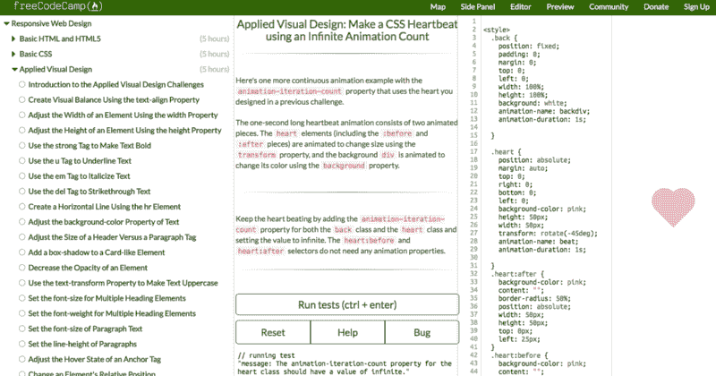

# 最后 10%的工作占用了 90%的时间。帮我完成最后的 10%。

> 原文：<https://www.freecodecamp.org/news/the-last-10-of-the-work-takes-90-of-the-time-help-me-finish-that-last-10-901ce86529b/>

2016 年，我们开始了 freeCodeCamp 学习平台的雄心勃勃的扩张。它包括:

*   一个扩展的课程，现在教授可访问性、安全性和测试等概念，以及 React、Redux、Sass 和 D3 等新工具——所有这些都在基于浏览器的代码编辑器中交互进行
*   速度极快的单页网络应用程序
*   显著扩展的营员档案，您可以在其中展示您的代码和您过去的成就
*   一个大规模的新面试准备部分，包含数百个新算法、数据结构和系统设计挑战

嗯，花了一年时间。但是我们已经准备好发布这个新扩展的平台了。

A screenshot from the current build of the expanded freeCodeCamp platform.

尽管我们看到了隧道尽头的曙光，但仍有大量的编码工作要做。这就是我们需要你帮助的地方。

### 你可以提供帮助的三种方式

#### 选项 1:帮助我们完成关键路径平台功能

A screenshot of [our Beta Release Kanban board](https://github.com/freeCodeCamp/freecodecamp/projects/1?fullscreen=true) on GitHub.

扩展平台[在公测](https://beta.freecodecamp.org)。我们不会在接下来的一两周内启用帐户创建，但您可以访问所有的编码挑战。它仍然很粗糙，但大部分艰苦的工作已经完成——我们只需要修复一些 bug，引入一些编码挑战，并润色 UI。

在此发布[之前，我们对需要解决的问题有一个清晰的路线图。](https://github.com/freeCodeCamp/freecodecamp/projects/1?fullscreen=true)

#### 选项 2:帮助我们将 React 和 Redux 挑战移植到扩展的平台

One of the alpha React challenges.

freeCodeCamp [Alpha React 和 Redux challenges](http://hysterical-amusement.surge.sh/) 主要由[肖恩·史密斯](https://www.freecodecamp.org/news/the-last-10-of-the-work-takes-90-of-the-time-help-me-finish-that-last-10-901ce86529b/undefined)和[彼得·温伯格](https://www.freecodecamp.org/news/the-last-10-of-the-work-takes-90-of-the-time-help-me-finish-that-last-10-901ce86529b/undefined)在 2016 年末设计。成千上万的露营者已经完成了这 78 个交互式编码挑战。

这花了很长时间，但我们现在可以在 freeCodeCamp 平台上运行这些挑战。我们只需要克服所有这些挑战，并对它们进行质量保证。

我们已经编写了一些脚本来处理这个过程，但是其中一些需要手工操作。我们可以利用你的帮助来移植这些，然后在 QA 过程中找到破坏它们的方法。

#### 选项 3:帮助我们改进新的面试准备部分的挑战

Our interview prep section features a wide variety of common interview questions, some of them in a multiple-choice quiz format.

我们新的面试准备部分包括:

*   几十个新的编码面试算法的挑战
*   许多新的数据结构挑战
*   系统设计测验
*   编码面试带回家的项目
*   数百个 Rosetta 代码和项目 Euler 问题，适用于浏览器并增加了测试套件

我们需要你的帮助来改进和扩展这些挑战。这是目前需要完成的最大任务。

请注意，无论准备了多少面试准备挑战，我们仍将首先发布扩展平台。但是我们准备的挑战越多越好！

### 为什么您应该向 freeCodeCamp 平台贡献代码

每年，成千上万的露营者作为开发者获得他们的第一份工作。他们中的大多数人没有计算机科学学位，有些人根本没有学位。

最常见的原因，他们归因于他们的求职成功是开源的贡献。

为开源做贡献不仅会帮助你建立自己的事业——在这个过程中你会学到很多东西。

如果你贡献给 freeCodeCamp 的平台，数百万人会使用你贡献的代码。

没错。几百万。

### 如何获得帮助

**步骤#1** :让 freeCodeCamp 平台在你的电脑上运行。[下面是如何操作](https://github.com/freeCodeCamp/freecodecamp/blob/staging/CONTRIBUTING.md)。

**第二步**:一旦你完成了，加入免费代码营[贡献者聊天室](https://gitter.im/FreeCodeCamp/Contributors)。自我介绍一下，告诉我们您对这些选项中的哪些感兴趣。

感谢您花时间阅读本文，并考虑向 freeCodeCamp 平台贡献代码。在您的帮助下，我们可以在接下来的几周内发运扩展的平台！