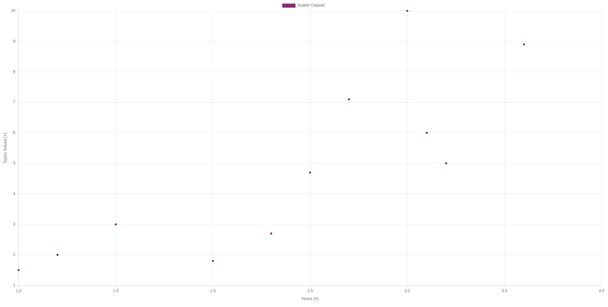
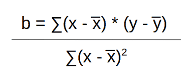
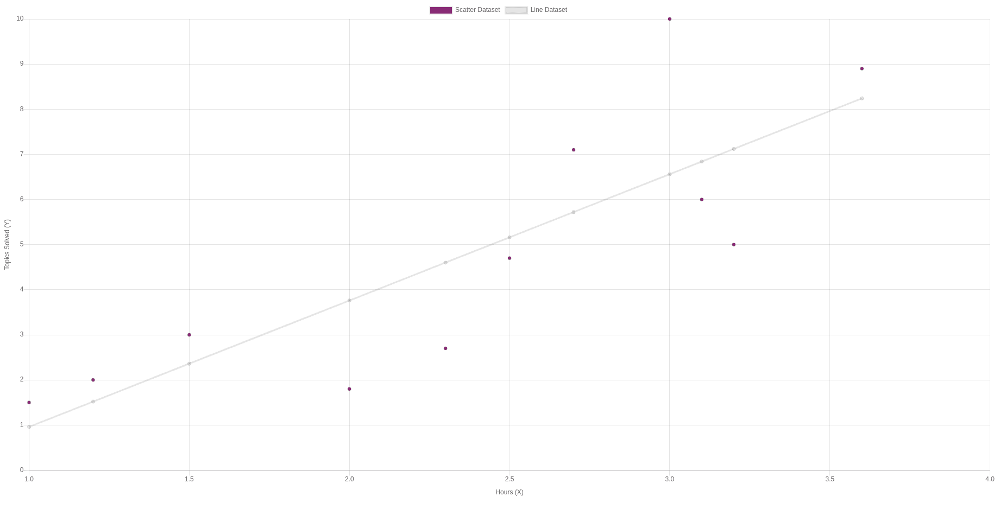
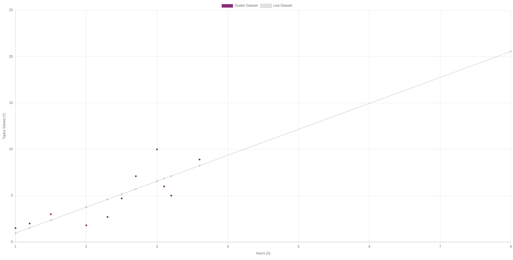
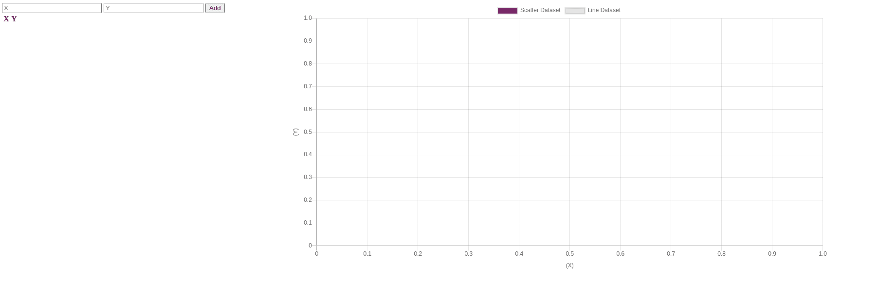
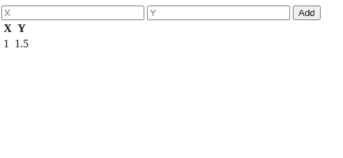
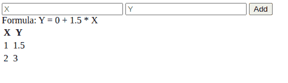
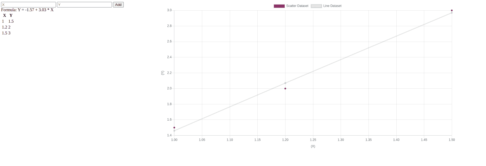
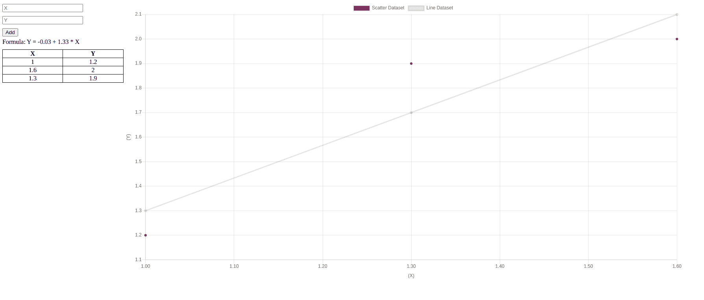
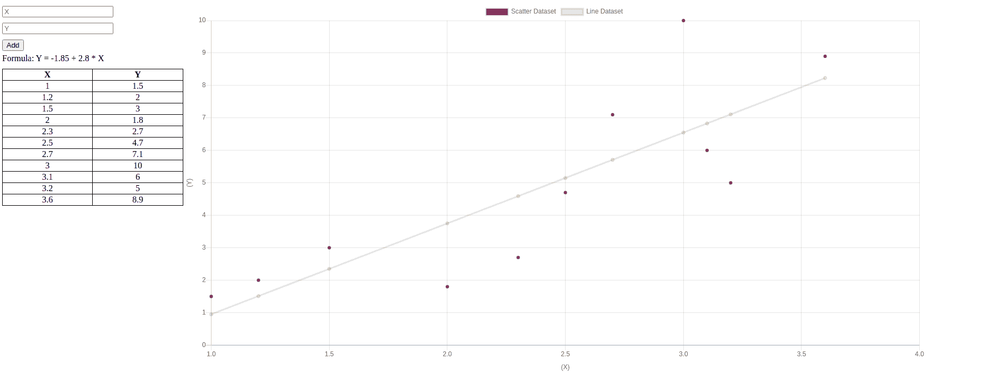

# 最小二乘回归法——如何找到最佳拟合线

> 原文：<https://www.freecodecamp.org/news/the-least-squares-regression-method-explained/>

你想知道如何用一个简单的公式和一些数据预测未来吗？

有多种方法可以解决试图预测未来的问题。但是我们将研究如何用公式 **Y = a + b * X** 来计算的理论。

在我们介绍完理论之后，我们将创建一个 JavaScript 项目。这将帮助我们使用 [Chart.js](https://www.chartjs.org/) 来表示数据，从而更容易地将公式可视化。

## 什么是最小二乘回归法，为什么要用？

最小二乘法是一种应用线性回归的方法。它帮助我们根据现有的一组数据预测结果，并清除数据中的异常。异常值是太好或太坏而不真实的值，或者代表罕见情况的值。

例如，假设我们有一个清单，上面列出了未来 freeCodeCamp 的工程师如果连续投入 1、2 或 3 个小时可以解决的问题。然后，我们可以预测在 4 个小时的连续学习后，即使没有数据可供我们使用，我们将覆盖多少主题。

这种方法被许多专业人士使用，例如统计学家、会计师、经理和工程师(就像在机器学习问题中)。

## 树立榜样

在我们进入公式和代码之前，让我们定义我们将要使用的数据。

为了做到这一点，让我们扩展一下前面提到的例子。

让我们假设我们的目标是计算出一个学生每小时学习了多少主题。

每一对(X，Y)代表一名学生。由于我们都有不同的学习速度，在投入相同时间的情况下，解决的题目数量可能会更高或更低。

| 小时(X) | 解决的主题(Y) |
| --- | --- |
| one | One point five |
| One point two | Two |
| One point five | three |
| Two | One point eight |
| Two point three | Two point seven |
| Two point five | Four point seven |
| Two point seven | Seven point one |
| three | Ten |
| Three point one | six |
| Three point two | five |
| Three point six | Eight point nine |

你可以这样读:“有人花了 1 个小时，解决了 2 个题目”或者“一个学生 3 个小时后解决了 10 个题目”。

在图表中，这些点看起来像这样:



Each point is a student (X, Y) and how long it took that specific student to complete a certain number of topics

**免责声明:**此数据是虚构的，由随机按键产生。我不知道实际的价值。

## 公式

> **Y = a + bX**

对于那些不熟悉的人来说，这个公式可能看起来没什么意思——考虑到我们的例子中已经有了 **Y** 和 **X** 的值，就更是如此了。

话虽如此，现在我们并没有被公式吓倒，我们只需要算出 **a** 和 **b** 的值。

为了说明它们的含义:

*   **a** 是截距，换句话说，我们期望从练习一个小时的学生身上得到的平均值。一个小时是我们将接受到我们的示例数据集的最少时间。
*   **b** 是斜率或系数，换句话说就是特定小时内解决的题目数( **X)** 。随着我们花在学习上的时间( **X** )增加， **b** 也越来越多。

## 计算“b”



Looks scarier than it is

**X** 和 **Y** 是我们之前表格中的位置。当它们上面有一个 **-** (马克龙)时，这意味着我们应该使用将它们相加并除以总数得到的平均值:

**͞x**->1+1.2+1.5+2+2.3+2.5+2.7+3+3.1+3.2+3.6 =**2.37**

**͞y** - > 1，5+2+3+1，8+2，7+4，7+7，1+10+6+5+8，9 / 11 = **4.79**

现在我们已经有了平均值，我们可以扩展我们的表来包括新的结果:

| 小时(X) | 解决的主题(Y) | (X - ͞x) | (y - ͞y) | (x--- | (x-□ |
| --- | --- | --- | --- | --- | --- |
| one | One point five | -1.37 | -3.29 | Four point five one | One point eight eight |
| One point two | Two | -1.17 | -2.79 | Three point two six | one point three seven |
| One point five | three | -0.87 | -1.79 | One point five six | Zero point seven six |
| Two | One point eight | -0.37 | -2.99 | One point one one | Zero point one four |
| Two point three | Two point seven | -0.07 | -2.09 | Zero point one five | Zero |
| Two point five | Four point seven | Zero point one three | -0.09 | -0.01 | Zero point zero two |
| Two point seven | Seven point one | Zero point three three | Two point three one | Zero point seven six | Zero point one one |
| three | Ten | Zero point six three | Five point two one | Three point two eight | Zero point four |
| Three point one | six | Zero point seven three | One point two one | Zero point eight eight | Zero point five three |
| Three point two | five | Zero point eight three | Zero point two one | Zero point one seven | Zero point six nine |
| Three point six | Eight point nine | One point two three | Four point one one | Five point zero six | One point five one |

奇怪的符号 sigma ( **∑** )告诉我们要总结一切:

>4.51+3.26+1.56+1.11+0.15+0.01+0.76+3.28+0.88+0.17+5.06 =**20.73**

>【t1+1.37+0.76+0.14+0.00+0.02+0.11+0.40+0.53+0.69+1.51 =**7.41**

最后我们做 **20.73 / 7.41** ，我们得到 **b = 2.8**

**注意:**当使用表达式输入计算器时，比如 Ubuntu 中可用的那个，2 返回-4 而不是 4。以避免输入(-2)。

## 计算“a”

剩下的就是 **a** ，公式为**͞͞͞y = a+**b ͞x.我们已经得到了所有其他的值，所以我们可以代入它们，得到:

*   4.79 = **a** + 2.8*2.37
*   4.79 = **a** + 6.64
*   **a** = -6.64+4.79
*   **a = -1.85**

## 结果呢

我们的最终公式变成:

> **Y = -1.85 + 2.8*X**

现在，我们将公式中的 **X** 替换为每个值:

| 小时(X) | -1.85 + 2.8 * X |
| --- | --- |
| one | Zero point nine five |
| One point two | One point five one |
| One point five | Two point three five |
| Two | Three point seven five |
| Two point three | Four point five nine |
| Two point five | Five point one five |
| Two point seven | Five point seven one |
| three | Six point five five |
| Three point one | Six point eight three |
| Three point two | Seven point one one |
| Three point six | Eight point two three |

这是一个类似这样的图表:



We now have a line that represents how many topics we expect to be solved for each hour of study

如果我们想预测我们期望一个学生在 8 小时的学习中解决多少题目，我们在公式中替换它:

*   **Y = -1.85 + 2.8*8**
*   **Y = 20.55**

在图表中我们可以看到:



The further it is in the future the least accuracy we should expect

## 限制

永远记住方法的局限性。这有望帮助你避免错误的结果。

和其他方法一样，这种方法也有其局限性。这里有几个例子:

*   它没有考虑到所解决主题的复杂性。在“[响应式网页设计认证](https://www.freecodecamp.org/learn/responsive-web-design/basic-html-and-html5/)”开始时涉及的主题很可能比做一个期末项目花费更少的时间来学习和解决。因此，如果我们拥有的数据来自一门课程的不同起点，预测就不会准确
*   对于一个人来说，连续学习 240 个小时或者解决比现有课题更多的课题是不可能的。不管怎样，该方法允许我们预测这些值。在这一点上，该方法不再准确地给出结果，因为它是不可能的。

## JavaScript 项目示例

手动操作是不必要的。我们可以创建我们的项目，输入 X 和 Y 值，它用这些点绘制一个图形，并应用线性回归公式。

项目文件夹将包含以下内容:

```
src/
  |-public // folder with the content that we will feed to the browser
    |-index.html
    |-style.css
    |-least-squares.js
  package.json
  server.js // our Node.js server
```

以及 **package.json** :

```
{
  "name": "least-squares-regression",
  "version": "1.0.0",
  "description": "Visualize linear least squares",
  "main": "server.js",
  "scripts": {
    "start": "node server.js",
    "server-debug": "nodemon --inspect server.js"
  },
  "author": "daspinola",
  "license": "MIT",
  "devDependencies": {
    "nodemon": "2.0.4"
  },
  "dependencies": {
    "express": "4.17.1"
  }
} 
```

一旦我们有了 package.json 并运行了 *npm install* ，我们就可以使用 Express 和 nodemon 了。您可以根据自己的喜好为其他人更换它们，但我使用这些是出于方便。

在 **server.js** 中:

```
const express = require('express')
const path = require('path')

const app = express()

app.use(express.static(path.join(__dirname, 'public')))

app.get('/', function(req, res) {
  res.sendFile(path.join(__dirname, 'public/index.html'))
})

app.listen(5000, function () {
  console.log(`Listening on port ${5000}!`)
})
```

这个微型服务器是为了让我们在浏览器中写东西时可以访问我们的页面而设计的。在我们运行它之前，让我们创建剩余的文件:

**public/index.html**

```
<html>
  <head>
    <title>Least Squares Regression</title>
    <script src="https://cdn.jsdelivr.net/npm/chart.js@2.9.3/dist/Chart.min.js"></script>
    <link rel="stylesheet" href="style.css">
  </head>
  <body>
    <div class="container">
      <div class="left-half">
        <div>
          <input type="number" class="input-x" placeholder="X">
          <input type="number" class="input-y" placeholder="Y">

          <button class="btn-update-graph">Add</button> 
        </div>
        <div>
          <span class="span-formula"></span>
        </div>
        <div>
          <table class="table-pairs">
            <thead>
              <th>
                X
              </th>
              <th>
                Y
              </th>
            </thead>
            <tbody></tbody>
          </table>
        </div>
      </div>
      <div class="right-half">
        <canvas id="myChart"></canvas>
      </div>
    </div>
    <script src="/js/least-squares.js"></script>
  </body>
</html>
```

我们创造我们的元素:

*   我们的线对有两个输入，一个用于 X，一个用于 Y
*   将这些值添加到表中的按钮
*   添加值时显示当前公式的跨度
*   展示我们添加的配对的表格
*   和一张我们图表的画布

我们还导入了带有 CDN 的 [Chart.js](https://www.chartjs.org/) 库，并添加了 CSS 和 JavaScript 文件。

**public/style.css**

```
.container {
  display: grid; 
}

.left-half {
  grid-column: 1;
}

.right-half {
  grid-column: 2;
}
```

我们添加了一些规则，这样我们的输入和表格在左边，图表在右边。这利用了 CSS 网格的优势。

**public/least-squares.js**

```
document.addEventListener('DOMContentLoaded', init, false);

function init() {
  const currentData = {
    pairs: [],
    slope: 0,
    coeficient: 0,
    line: [],
  };

  const chart = initChart();
}

function initChart() {
  const ctx = document.getElementById('myChart').getContext('2d');

  return new Chart(ctx, {
    type: 'scatter',
    data: {
      datasets: [{
        label: 'Scatter Dataset',
        backgroundColor: 'rgb(125,67,120)',
        data: [],
      }, {
        label: 'Line Dataset',
        fill: false,
        data: [],
        type: 'line',
      }],
    },
    options: {
      scales: {
        xAxes: [{
          type: 'linear',
          position: 'bottom',
          display: true,
          scaleLabel: {
            display: true,
            labelString: '(X)',
          },
        }],
        yAxes: [{
          type: 'linear',
          position: 'bottom',
          display: true,
          scaleLabel: {
            display: true,
            labelString: '(Y)',
          },
        }],
      },
    },
  });
}
```

All the properties of the chart on how to style it can be found in their documentation [here](https://www.chartjs.org/docs/latest/axes/styling.html)

最后，我们初始化我们的图表。开始时，它应该是空的，因为我们还没有向它添加任何数据。

现在，如果我们运行 *npm 运行服务器调试*并在 localhost:5000 上打开我们的浏览器，我们应该会看到类似这样的内容:



Our inputs to the left with an add button, or table with just the headers X and Y, to the right an empty graph

## 添加功能

下一步是让“添加”按钮做一些事情。在我们的案例中，我们希望实现:

*   将 X 和 Y 值添加到表格中
*   当我们添加一对以上时，更新公式(我们至少需要两对来创建一条线)
*   用点和线更新图表
*   清理输入，这样更容易不断引入数据

### 将值添加到表中

**public/least-squares.js**

```
document.addEventListener('DOMContentLoaded', init, false);

function init() {
  const currentData = {
    pairs: [],
    slope: 0,
    coeficient: 0,
    line: [],
  };
  const btnUpdateGraph = document.querySelector('.btn-update-graph');
  const tablePairs = document.querySelector('.table-pairs');
  const spanFormula = document.querySelector('.span-formula');

  const inputX = document.querySelector('.input-x');
  const inputY = document.querySelector('.input-y');

  const chart = initChart();

  btnUpdateGraph.addEventListener('click', () => {
    const x = parseFloat(inputX.value);
    const y = parseFloat(inputY.value);

    updateTable(x, y);
  });

  function updateTable(x, y) {
    const tr = document.createElement('tr');
    const tdX = document.createElement('td');
    const tdY = document.createElement('td');

    tdX.innerHTML = x;
    tdY.innerHTML = y;

    tr.appendChild(tdX);
    tr.appendChild(tdY);

    tablePairs.querySelector('tbody').appendChild(tr);
  }
}

// ... rest of the code as it was
```

我们得到了所有我们不久将使用的元素，并在“add”按钮上添加了一个事件。该事件将获取当前值并可视化地更新我们的表。

我们需要解析金额，因为我们得到了一个字符串。当我们必须应用公式时，这对于下一步将是重要的。



When we press add we should see the pairs on the table

### 进行计算

我们之前说的所有数学(得到 **X** 和 **Y** 的平均值，计算 **b** ，计算 **a** )现在都应该变成代码了。我们还将显示 **a** 和 **b** 值，这样我们就可以看到它们随着我们添加值而变化。

**public/least-squares.js**

```
// ... rest of the code as it was

btnUpdateGraph.addEventListener('click', () => {
  const x = parseFloat(inputX.value);
  const y = parseFloat(inputY.value);

  updateTable(x, y);
  updateFormula(x, y);
});

function updateFormula(x, y) {
  currentData.pairs.push({ x, y });
  const pairsAmount = currentData.pairs.length;

  const sum = currentData.pairs.reduce((acc, pair) => ({
    x: acc.x + pair.x,
    y: acc.y + pair.y,
  }), { x: 0, y: 0 });

  const average = {
    x: sum.x / pairsAmount,
    y: sum.y / pairsAmount,
  };

  const slopeDividend = currentData.pairs
    .reduce((acc, pair) => parseFloat(acc + ((pair.x - average.x) * (pair.y - average.y))), 0);
  const slopeDivisor = currentData.pairs
    .reduce((acc, pair) => parseFloat(acc + (pair.x - average.x) ** 2), 0);

  const slope = slopeDivisor !== 0
    ? parseFloat((slopeDividend / slopeDivisor).toFixed(2))
    : 0;

  const coeficient = parseFloat(
    (-(slope * average.x) + average.y).toFixed(2),
  );

  currentData.line = currentData.pairs
    .map((pair) => ({
      x: pair.x,
      y: parseFloat((coeficient + (slope * pair.x)).toFixed(2)),
    }));

  spanFormula.innerHTML = `Formula: Y = ${coeficient} + ${slope} * X`;
}

// ... rest of the code as it was
```

这里没有太多关于代码的内容，因为它是我们前面已经讨论过的所有理论。我们对这些值进行循环，以获得总和、平均值和所有其他我们需要的值，从而获得系数( **a** )和斜率( **b** )。



The span so we can display the formula and see it change as we add values

我们在*当前*变量中有*对*和*线*，所以我们在下一步使用它们来更新我们的图表。

### 更新图表并清除输入

**public/least-squares.js**

```
// ... rest of the code as it was

btnUpdateGraph.addEventListener('click', () => {
  const x = parseFloat(inputX.value);
  const y = parseFloat(inputY.value);

  updateTable(x, y);
  updateFormula(x, y);

  updateChart();

  clearInputs();
});

function updateChart() {
  chart.data.datasets[0].data = currentData.pairs;
  chart.data.datasets[1].data = currentData.line;

  chart.update();
}

function clearInputs() {
  inputX.value = '';
  inputY.value = '';
}

// ... rest of the code as it was
```

更新图表和清除 X 和 Y 的输入非常简单。我们有两个数据集，第一个(位置 0)是我们的对，所以我们在图上显示点。第二个(位置一)是我们的回归线。

我们必须获取图表的实例并调用 *update* ，这样我们就可以看到新值被考虑在内。



At least three values are needed so we can take any kind of information our of the graph

## 添加一些风格

我们可以稍微改变一下布局，这样更容易管理。没什么大不了的，它只是提醒我们可以随时更新 UI

**public/style.css**

```
.container {
  display: grid; 
}

.left-half {
  grid-column: 1;
}

.right-half {
  grid-column: 2;
}

.pairs-style input[type="number"],
.pairs-style button {
  margin: 5px 0px;
}

.table-pairs {
  border-collapse: collapse;
  width: 100%;
}

.table-pairs td {
  text-align: center;
}

.table-pairs,
.table-pairs th,
.table-pairs td {
  margin: 10px 0px;
  border: 1px solid black;
}
```

**public/index.html**

```
<html>
  <head>
    <title>Least Squares Regression</title>
    <script src="https://cdn.jsdelivr.net/npm/chart.js@2.9.3/dist/Chart.min.js"></script>
    <link rel="stylesheet" href="style.css">
  </head>
  <body>
    <div class="container">
      <div class="left-half">
        <div class="pairs-style">
          <div>
            <input type="number" class="input-x" placeholder="X">
          </div>
          <div>
            <input type="number" class="input-y" placeholder="Y">
          </div>
          <button class="btn-update-graph">Add</button> 
        </div>
        <div>
          <span class="span-formula">Formula: Y = a + b * X</span>
        </div>
        <div>
          <table class="table-pairs">
            <thead>
              <th>
                X
              </th>
              <th>
                Y
              </th>
            </thead>
            <tbody></tbody>
          </table>
        </div>
      </div>
      <div class="right-half">
        <canvas id="myChart"></canvas>
      </div>
    </div>
    <script src="/js/least-squares.js"></script>
  </body>
</html>
```



Not a big change, but at least the elements are a bit better aligned

## 概念证明



We add the same values as earlier in the theory and obtain the same graph and formula! :D

## 结束语

为了简洁起见，我删除了许多可以用来极大地改进项目的内容。例如:

*   添加对空值等的检查
*   这样我们就可以删除错误插入的数据
*   为 X 或 Y 添加一个输入，并应用当前的数据公式来“预测未来”，类似于理论的最后一个例子

不管怎样，预测未来是一个有趣的概念，即使在现实中，我们最多希望预测的是基于过去数据点的近似值。

这是一个强大的公式，如果你用它来构建任何项目，我很乐意看到它。

我希望这篇文章有助于介绍这个概念。文中用到的代码可以在我的 GitHub **[这里](https://github.com/daspinola/least-squares-regression)** *找到。*

下一集再见，同时，去写代码吧！