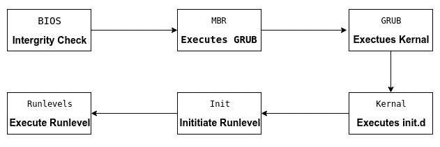

# Linux 引导过程-详细描述的 6 个步骤

> 原文：<https://www.freecodecamp.org/news/the-linux-booting-process-6-steps-described-in-detail/>

操作系统(OS)是管理资源、控制外围设备并为其他软件提供基本服务的低级软件。在 Linux 中，典型的引导过程有 6 个不同的阶段。



### **1。BIOS**

BIOS 代表基本输入输出系统。简而言之，BIOS 加载并执行主引导记录(MBR)引导加载程序。

当您第一次打开计算机时，BIOS 首先对 HDD 或 SSD 执行一些完整性检查。

然后，BIOS 搜索、加载并执行引导加载程序，该程序可以在主引导记录(MBR)中找到。MBR 有时在 u 盘或 CD-ROM 上，比如 Linux 的实时安装。

一旦检测到引导加载程序，它就被加载到内存中，BIOS 将系统控制权交给它。

### **2。MBR**

MBR 代表主引导记录，负责加载和执行 GRUB 引导加载程序。

MBR 位于可引导磁盘的第一个扇区，通常是`/dev/hda`或`/dev/sda`，这取决于您的硬件。MBR 还包含关于 GRUB 的信息，或者非常旧的系统中的 LILO。

### **3。GRUB**

有时称为 GNU GRUB，是 GNU GRand Unified Bootloader 的缩写，是大多数现代 Linux 系统的典型引导加载程序。

GRUB 闪屏通常是你启动电脑时看到的第一个东西。它有一个简单的菜单，你可以从中选择一些选项。如果您安装了多个内核映像，您可以使用键盘选择您希望系统启动时使用的映像。默认情况下，选择最新的内核映像。

闪屏将等待几秒钟，让您选择一个选项。如果没有，它将加载默认的内核映像。

在许多系统中，您可以在`/boot/grub/grub.conf`或`/etc/grub.conf`找到 GRUB 配置文件。下面是一个简单的`grub.conf`文件的例子:

```
#boot=/dev/sda
default=0
timeout=5
splashimage=(hd0,0)/boot/grub/splash.xpm.gz
hiddenmenu
title CentOS (2.6.18-194.el5PAE)
      root (hd0,0)
      kernel /boot/vmlinuz-2.6.18-194.el5PAE ro root=LABEL=/
      initrd /boot/initrd-2.6.18-194.el5PAE.img
```

### **4。内核**

内核通常被认为是任何操作系统的核心，包括 Linux。它完全控制了你系统中的一切。

在引导过程的这个阶段，GRUB 选择的内核首先挂载在`grub.conf`文件中指定的根文件系统。然后它执行`/sbin/init`程序，它总是第一个被执行的程序。您可以用它的进程 id (PID)来确认这一点，它应该总是为 1。

然后内核使用初始 RAM 磁盘(initrd)建立一个临时根文件系统，直到真正的文件系统被挂载。

### **5。初始化**

此时，您的系统执行运行级程序。在某一点上，它会寻找一个 init 文件，通常在`/etc/inittab`找到，以决定 Linux 的运行级别。

现代 Linux 系统使用 systemd 来选择运行级别。根据 [TecMint](https://www.tecmint.com/change-runlevels-targets-in-systemd/) ，这些是可用的运行级别:

> **运行级别 0** 由 **poweroff.target** 匹配(而 **runlevel0.target** 是到 **poweroff.target** 的符号链接)。
> 
> **运行级别 1** 由 **rescue.target** 匹配(而**运行级别 1.target** 是到 **rescue.target** 的符号链接)。
> 
> **运行级别** 3 由**多用户目标**模拟(并且**运行级别 3 .目标**是一个到**多用户目标**的符号链接)。
> 
> **运行级别 5** 由 **graphical.target** 模拟(而**运行级别 5.target** 是一个到 **graphical.target** 的符号链接)。
> 
> **运行级别 6** 由 **reboot.target** 模拟(而**运行级别 6.target** 是指向 **reboot.target** 的符号链接)。
> 
> **紧急**与**紧急目标**相匹配。

systemd 将开始执行运行级程序。

### **6。运行级程序**

根据您安装的 Linux 发行版，您可能会看到不同的服务开始运行。比如你可能会抓到`starting sendmail …. OK`。

这些被称为运行级程序，根据您的运行级从不同的目录执行。上述 6 个运行级别中的每一个都有自己的目录:

*   运行级别 0-`/etc/rc0.d/`
*   运行级别 1-`/etc/rc1.d/`
*   运行级别 2-`/etc/rc2.d/`
*   运行级别 3-`/etc/rc3.d/`
*   运行级别 4-`/etc/rc4.d/`
*   运行级别 5-`/etc/rc5.d/`
*   运行级别 6-`/etc/rc6.d/`

请注意，这些目录的确切位置因发行版而异。

如果您查看不同的运行级目录，您会发现以“S”或“K”开头的程序分别用于启动和终止。启动程序在系统启动时执行，在关机时终止程序。

这就是关于 Linux 引导过程你需要知道的一切。现在出去，让燕尾服为你骄傲。