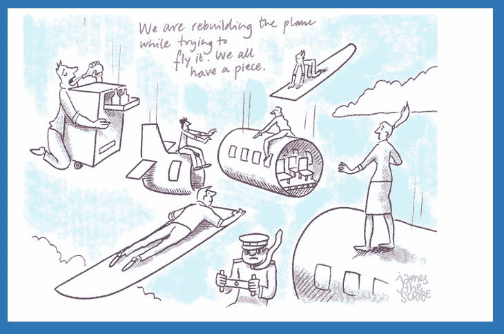
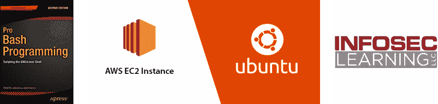
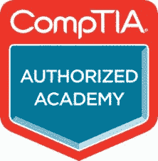
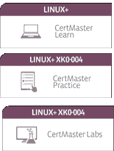
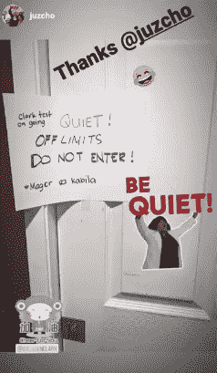
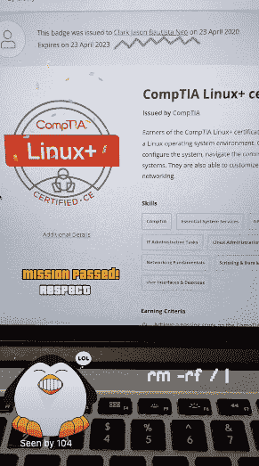
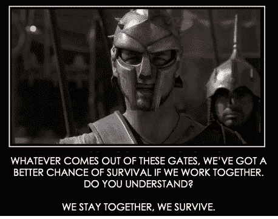
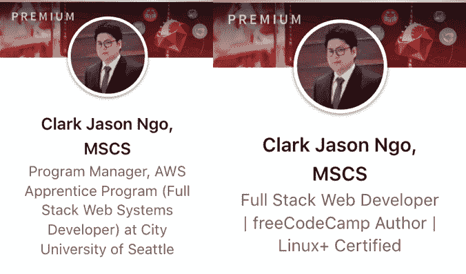

# 我是如何通过 CompTIA Linux+考试的

> 原文：<https://www.freecodecamp.org/news/the-linux-exam-story/>

### 本文摘要:

*   背景故事:为什么 CompTIA Linux+考试。
*   学习资源回顾:什么是好的，什么是不好的。
*   学习回顾:什么有效，什么无效。
*   我在考试期间的经历:考试是怎么进行的，我有什么感受。
*   我的考试方法:使用什么策略和心态。
*   获得一个令人敬畏的徽章:它看起来像什么，对我有什么好处？
*   额外收获:由于我的大部分材料都是由学校赞助的，我已经为考试寻找了免费的内容供你学习，例如[文件系统层次](https://en.wikipedia.org/wiki/Filesystem_Hierarchy_Standard)、[基本 linux 命令](https://refspecs.linuxfoundation.org/FHS_3.0/fhs-3.0.html#binEssentialUserCommandBinaries)，使用 [AWS EC2 Ubuntu](https://aws.amazon.com/mp/linux/) 作为你的 Linux 环境。我还在 Trello 中创建了一个闪存卡，这里有[和](https://trello.com/b/viGl7wam/linux-prep)。免责声明:免费内容可能是不够的。
*   考试目标:[正式 CompTIA Linux+考试目标](https://www.comptia.jp/pdf/comptia-linux-xk0-004-exam-objectives.pdf)。

### TLDR 考试提示(我没有 Linux 专业经验):

*   重点关注 CompTIA 学习指南的活动部分，并遵循您自己的 Linux 环境。
*   基于表现的问题(pbq)练习。他们展示了大约 10 个选择，所有的选择看起来都是正确的。
*   使用管道(|)试验 Linux 命令组合
*   配置 IP 表、防火墙和故障排除。
*   了解配置步骤、引导过程和备份文件。
*   基本的 bash 脚本和正则表达式。

关于如何以正确的心态和策略来回答难题，请阅读到最后。此外，我在我们学校的一次俱乐部会议上总结这篇文章的视频可以在文章的底部找到。一定要看看这个视频，因为它在结尾有一个 Q & A 部分。

首先，我要衷心感谢[西雅图城市大学](https://www.cityu.edu/)的[技术与计算学院](https://ciae.cityu.edu/programs/)。他们为我提供了一份工作、职业发展，并赞助了我的 CompTIA 学习资料和考试券。

作为一名工作机会有限的 F-1 学生签证持有者，这让我获得了额外的收入，我每月都会将其中的一部分捐给 freeCodeCamp。

这是我的故事的松散延续: *[为什么我放弃了我的 MBA 学位去获得计算机科学的硕士学位](https://www.freecodecamp.org/news/cjn-why-i-abandoned-my-mba-to-get-a-masters-in-computer-science/)* 。

City University of Seattle Campus

## 为什么选择 CompTIA Linux+？

2019 年 7 月，我们学校在对外关系主任的帮助下，与亚马逊网络服务公司(AWS)和华盛顿技术产业协会(WTIA)签订了一份合同，名为 AWS 学徒计划(AAP)。

我们有机会培训了 23 名退伍军人和退伍军人配偶。他们的要求是通过 CompTIA Linux+考试和城市大学的全栈系统开发计划，其中包括 CompTIA Linux+考试准备。一旦他们满足了这两个标准，他们就可以过渡到 AWS 的在职培训。

我当时的角色是首席助教(TA ),我的任务是帮助建立院长的项目提案。我与其他 6 名助教合作建立了这些课程，包括:Linux I、Linux II、网络、Web 开发、JavaScript/TypeScript、全栈- MEAN Stack、Python 和全栈- Django。

由于这是我们的第一份合同，我们一边试着驾驶飞机，一边制造飞机。

Picture looks fun! But not in real life lol!

### 我们在 Linux 操作系统课程中使用了以下资源:

*   教材:Pro Bash 编程:编写 GNU/Linux Shell 脚本，第二版，作者 Chris F. A. Johnson，Jayant Varma
*   学生的 Linux 环境:带 Ubuntu 的 AWS EC2 实例
*   虚拟实验室:信息安全学习

### 我学到了什么

*   大量 bash 脚本练习和编码挑战
*   如何将 SSH 连接到远程服务器(EC2 实例)
*   与 CompTIA Linux+相关的各种 Linux 命令和配置设置

项目开始几周后，我们做了更多的研究，并听取了学生的反馈。结果是我们做了太多的 bash 脚本，缺少了对 CompTIA Linux+考试的准备。

> 在 bash 脚本编写的前几周，学生们都在地狱里

我们立即与 CompTIA 合作，以批量价格获得 CompTIA Linux+考试学习材料。为了融入新的学习材料，我们努力改变了项目的部分内容。

Cool badge

> 好在我们部门正在实践敏捷方法，这让我们变得非常敏捷。

### 新资源如下:

*   CertMaster Learn -包括电子书、基于性能的问题(PBQ)和 CompTIA 视频(注意:这是去年的内容。如果您是今年购买的，您将没有 PBQs，但您会得到一个新的界面和一个额外的模拟测试)。
*   CertMaster 练习-类固醇的选择题。一旦你积累了大量的错误答案，你会得到为什么你的答案是错误的反馈，它也解释了其他的选择。然后，它会把你的进度条推回去。
*   CertMaster 实验室-与 InfoSec 实验室相比，实验室活动时间更短。

The CompTIA Linux+ Learning bundle

### 我对新资源的思考

我从头到尾阅读了这本电子书，它有助于获得一个概览。然而，我无法从阅读中保留任何知识。我轻松地通过了 CertMaster 实践和 CertMaster 实验室，我也一无所获。

> 我怎么了？嗯（表示踌躇等）..

因为一次在 AAP 项目中教授 JavaScript/TypeScript 课程的机会和我爸去世的不幸事件，我的 Linux+考试之路最终脱轨，被人遗忘。

> 男人....多糟糕啊...

## 快进到 AWS 学徒计划的结束

2019 年 11 月，我们成功过渡了全部 23 名学员！一个百分百！我们是唯一一所这样做的合作学校。

大部分功劳归于技术与计算学院院长反复引用的“不让一个人掉队”——类似于士兵的信条:“我永远不会丢下一个倒下的战友”，以及“我们待在一起，我们生存”(出自电影《角斗士》)。

这个项目的成功很大程度上归功于助教，他们从第一天起就支持学生。

我们向学生征求反馈，了解关于 CompTIA Linux+材料，哪些有用，哪些没用。我们得到了以下信息:

*   关注学习指南的活动部分
*   重复进行虚拟实验
*   经历模拟考试是没有效果的
*   观看 ITPro.tv 视频(我们当时无法提供)

我有几个月没有学习 Linux+考试，因为我专注于学习 MEAN Stack(特别是 Angular 前端框架)。我定期应对 leetcode 编码挑战，为软件开发人员的工作面试做准备。

我也正在完成我的顶点项目: [*软件文档和全栈开发的架构分析*](https://www.freecodecamp.org/news/cjn-understanding-mean-stack-through-diagrams/) ，并且教两个班:信息系统，和数据管理通信和网络。

> 一会儿工夫...根本没有时间...还是只是借口？

当我的最后一个季度接近尾声时，我感到内疚，并再次开始为 Linux+考试学习。

> 这一次，新的攻击计划。

我又开始从头到尾阅读电子书。第二次不同的是，对于每一个理论、定义、命令、选项、子命令等等。我会在 Trello 中创建一个闪存卡(这里有[和](https://trello.com/b/viGl7wam/linux-prep))。我用这个和朋友一起训练做一个突击测验，并在 Linux 终端中执行命令。

就我自己而言，我将拥有自己的 Linux 环境，以及电子书的活动部分。这确实帮助我保留了 Linux 命令和配置方面的知识。我还在装有 MacBook Pro 的个人笔记本电脑中使用 Linux 命令，因为 MacOS 有类似 Unix 的终端。

我又利用了 CertMaster 模拟考试。而这一次，我让一个朋友过去，用排除法讨论为什么每个选择都是对的或错的。

> 似乎动手实践和与朋友讨论真的能帮助你掌握一个话题。

我真的不喜欢 CertMaster 实验室，在我的研究中没有使用它。

### 我犹豫地研究了以下内容:

*   bash 脚本——我是一名软件开发人员，我已经知道如何编码了。我构建了 bash 脚本来提高我的生产力，从课堂笔记到 web 应用程序。
*   版本控制——我一直在我的课程和个人项目中使用 git 和 GitHub。
*   容器和编排——我有很好的基础，因为我一直在读 DevOps 的书。

## 值得狂欢的 ITPro.tv 视频

> 我偶然发现的。这是及时和有效的。

where you can binge-watch IT videos

在 2020 年 4 月初，我们得到了即将到来的 AAP 学生的消息。院长让我再次检查 CompTIA 商店的材料，并找出这些 ITPro.tv 视频的内容。

起初，我甚至不愿意购买这些视频，因为我记得《CompTIA 学习指南》的视频开头有 ITPro.tv 徽标。我开始计算 CompTIA 学习指南视频的总时长。总时长只有 22 分钟。

与包含 16 小时内容的独立 ITPro.tv 视频相比，这是一个巨大的差异。我购买了它(当然是报销的)。

好家伙，我不后悔。那些视频棒极了。他们深入主题，在一位主持人的帮助下全面解释了这些命令，并询问我们为什么需要使用这些命令。

视频的平均时长约为 15 分钟。与平均每段视频 2 分钟的其他资源相比，这是一个很大的反差。

我开始根据我知道无法向任何人解释的话题挑选视频观看。我将这一策略与类固醇多项选择实践结合起来，以填补我的知识空白。

2020 年 4 月中旬，我安排了我的 CompTIA Linux+考试在线测试。由于疫情，他们创建了在线测试环境。由于接近预定日期，我放松了学习模式，只限于观看 ITPro.tv 视频。

## 考试程序

在线考试要求您遵守以下程序:

*   有互联网连接
*   拥有外置网络摄像头或笔记本电脑网络摄像头
*   配备外置麦克风或笔记本电脑麦克风
*   有有效身份证件的照片
*   有你自己的测试环境的前、后、左、右的照片
*   不要戴耳机，智能手机和电子产品也不要放在手边

点击查看全部详情[。](https://www.comptia.org/testing/testing-options/take-online-exam)

## 考试时间

instagram post of my ever supportive partner

> 我非常感谢你的支持！

### 我对在线测试应用的体验

*   考试安排在午夜 12:15。这是我避免房子里有任何噪音的意图。
*   监考老师可以通过网络摄像头看到你，而你看不到他们。
*   在线测试应用程序运行缓慢，并多次崩溃。监考人说这是因为大量的考生。

### 考试时的感受

我在考试中得到的前几个问题是基于表现的问题。太难了。我真的没办法百分百自信的回答。我在使用 Linux 命令 *grep* 和 *awk* 连接另一个命令时遇到了一个问题。

另一个问题是关于调查违反 SELinux 策略的情况，这要求您必须检查每个命令及其各自的输出，以查明哪个文件或目录需要额外的配置。

> 如果我有这样的职业经历，事情会简单得多。

随着问题越来越多，我真的觉得自己很笨，也失去了信心。我不知道如何回答关于网络、系统或用户配置的问题。在 bash 脚本部分，我知道我不太擅长 RegEx(正则表达式)。

> 我的考试还剩 30 分钟，感觉自己要失败了...

我又想起了 B 计划——我会重新参加考试。这部分是因为我自己对生活的看法。我总是告诉人们，我已经习惯了失败，只要我能坚持到我达到目标，我不介意失败。

大约 28 分钟的时候，我正准备停止，这时我听到了另一个声音(我告诉你，我没有疯。真是绝地念力绝招，看完 *[如何自学再学](https://www.freecodecamp.org/news/cjn-how-to-teach-yourself-to-learn-again/)* )。

> 那个声音说:“现在不要想失败，用剩下的几分钟，尽你最大的努力！”

所以我用剩下的时间跳到不同的问题上，直到我把它们都解决了。这次更加专注。我修改了几乎 80%的答案，并开始采取以下策略来增加我得到正确答案的机会:

*   排除过程——我删除了我知道是完全错误的选择。
*   我坚持我所知道的——如果我不知道答案是什么意思，我就不会选择。
*   更深层次的关注——我一个字一个字地阅读，并试图同时运用理解力和逻辑思维。
*   闭上眼睛，打开思维——我说服自己，为了这次考试，我已经非常努力地学习了，所以它一定存储在我大脑的某个地方。考虑到这一点，我试图找回那些记忆，以便在一些我有 70%把握回答的问题上达到 100%的把握。

我一直重复这些策略，直到最后一刻。

## 考试成绩

考试结束了，我通过了——1000 分中的 739 分！及格分数是 720 分。30 分钟后，我收到了 CompTIA 的邮件。

my cool instagram post celebrating my achievement

我仍然会谦卑地对人们说，我很幸运。但对我自己来说，我不会说我很幸运，因为我用更好的心态和更有效的策略改变了我的大多数答案。

## 经验教训

*   在我还没有专业经验的时候，真的应该停止参加这些考试。为什么？我之前也遇到过同样的困难，没有通过 AWS 开发者认证考试(这里是文章: *[我没有通过 AWS 开发者考试。现在怎么办？](https://www.freecodecamp.org/news/cjn-i-failed-my-aws-developer-exam/)* )。
*   在学习中，我应该早点做更多的评估来关注我的知识差距，而不是快速浏览所有的材料。
*   在考试期间，我需要提醒自己这就是我现在的现实。在这种情况下，我该怎么做才能变得伟大？这种心态也可以应用到我目前的工作中。
*   记得和朋友或同事一起学习，因为你将有机会成倍地增长你的知识。

quote from Gladiator (2000) movie

## 现在怎么办，克拉克？

我于 2019 年 4 月 20 日重新加入城大，担任 AWS 学徒项目(全栈网络系统开发者)的项目经理。

有了 Linux+认证，我获得了额外的经验，加上我以前在同一项目中担任助教的经历。这让我能够更好地领导、教导和指导新的团队。这包括我的团队，其中包括我确信会比我更成功的新助教。

我将尽最大努力继续教授和指导学生，同时提高我的软件开发技能，因为我仍在寻找科技行业软件开发人员的工作。我知道从一个非技术背景的人来过渡是很难的，但我们都会及时到达那里。

给我的读者们，感谢你们阅读我的文章。我真的想更多地关注技术文章，但我不能让一个好故事溜走。=)

在 LinkedIn [这里](https://www.linkedin.com/in/clarkngo/)和我联系。

I couldn't decide on my LinkedIn headline lol

**视频摘要和 Q 条&一条**

[https://www.youtube.com/embed/5evBAfJi4l0?feature=oembed](https://www.youtube.com/embed/5evBAfJi4l0?feature=oembed)