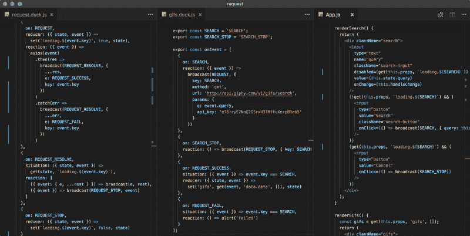
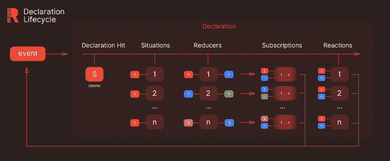

# 状态管理中的逻辑

> 原文：<https://www.freecodecamp.org/news/the-logic-in-state-management-2820d0353fed/>

作者奥古兹·杰拉勒

# 状态管理中的逻辑

事务状态管理的标准化为前端开发带来了可预测性。然后有了状态的不变性和单一来源的真实性，应用程序变得更加可维护和健壮。然而，围绕如何处理业务逻辑仍然存在一些模糊之处。

我提出了一个模型，其中**业务逻辑在 reducers 使用的**相同的命令通道下运行。用相同的单向事务管理逻辑在开发过程中会带来很多好处。我将首先更详细地讨论这个问题。然后，我将解释这个模型如何在实现这个模型的库[](https://github.com/reclarejs/reclare)**上工作。最后，我将讨论其中的一些好处。**

**

From the [request example](https://github.com/reclarejs/reclare/tree/master/examples/request) with [Reclare](https://github.com/reclarejs/reclare) and [React-Reclare](https://github.com/reclarejs/react-reclare)** 

### **与数据的永恒斗争**

**在早期，人们习惯用普通的 HTML 和 CSS 来构建用户界面。他们使用 JavaScript 或 jQuery 处理 DOM(文档对象模型)操作。这在当时是合理的——前端应用程序很简单，不像数据驱动的。但是后来责任变成了获取和处理数据，而不仅仅是显示数据。DOM 操作失去了可行性。**

**前端框架[通过让 DOM 反映应用程序的底层状态解决了这个问题](https://medium.com/dailyjs/the-deepest-reason-why-modern-javascript-frameworks-exist-933b86ebc445)。开发人员不再担心更新 DOM，但是管理状态仍然是他们的工作。**

**然后，现代国家管理开始取得一些进展。 [Elm](https://guide.elm-lang.org/architecture/) 和 [Flux](https://facebook.github.io/flux/) 在前端开发中标准化[事件源](https://martinfowler.com/eaaDev/EventSourcing.html)式的事务状态管理。状态更新的方式和时间受到单向数据流的限制。这给国家带来了可预测性，使其更容易跟踪和推理。**

**Redux 突破了状态的不变性和单源性。它还介绍了灵活，纯粹，功能和可组合的还原剂。这些给[带来了一些优于 Flux 架构的优势](https://stackoverflow.com/a/32920459/2770460)，但是[对于如何处理业务逻辑以及它应该存在于何处仍然有些模糊](https://redux.js.org/faq/code-structure#how-should-i-split-my-logic-between-reducers-and-action-creators-where-should-my-business-logic-go)。关于这个话题有很多文章和讨论，但是似乎没有明确的答案。**

**这让我和其他人一样困惑。我决定解决这个问题，并找到一种干净的方法来处理我的应用程序中的业务逻辑。然后我想到了用 reducers 把业务逻辑捆绑在一起的想法。这允许逻辑在同一事件通道下与 reducers 一起操作。**

**我意识到这种方法带来的不仅仅是一些组织上的好处。它带来了其他优势，如逻辑的可预测性和声明性。需要一个库来协调逻辑和状态，并保持现代状态管理的所有好处。这是我决定创建[重新分类](https://github.com/reclarejs/reclare)的时候。**

### **reclame 简介**

**Reclare 是一个简单的库，围绕着**声明**和**事件**。声明是一个简单的对象，可通过重分类调用。它描述了**调用它的情境条件**，以及**如果调用发生了**该做什么。它的反应可能是更新状态，执行逻辑/副作用，或者两者兼而有之。下面是一个声明的样子:**

**[在 js dild 上查看示例](https://jsfiddle.net/r89vzhuq/)**

**它是一个通用的 API，有不同种类的声明。不同的种类以不同的方式被调用。目前有两种类型:事件和订阅声明。**

****活动声明**收听活动频道，订阅特定活动。`broadcast`方法可用于向事件通道广播事件。第一个参数是事件键，后面是事件负载。这个有效载荷被传递给声明函数。**

```
`broadcast("event_key", { bar: 'foo' })`
```

****订阅声明**在每次状态改变时被调用。根据声明类型，函数可能会接收额外的参数，但结构不会改变。**

**当创建重分类上下文时，所有的声明通过它们的`on`键合并。这将寻找广播上的声明的复杂性降低到 O(1)时间。这也使得使用声明变得非常自然，因为有可能多个声明使用同一个事件键。这里有一个例子:**

**

The lifecycle of declaration invocation** 

#### **声明生命周期**

**当一个或多个声明被触发时，声明生命周期开始。首先，对所有在`on`键上有广播事件的声明的所有情况函数进行评估。如果情境条件成立，该声明的归约者和反应会排队。然后，排队的缩减器开始被执行。**

**每一个都接收状态并返回一个新的状态，然后通过管道传递给下一个状态。每个缩减器触发订阅声明。它们接收触发它们的减压器前后的状态。接下来，执行排队的反应。每个反应都接收初始状态和当前状态作为参数。它们在 reducers 之后执行，所以它们接收的状态是 final。事件有效负载被传递给每个步骤中执行的每个函数。**

### **利益**

**现代状态管理库只关注管理应用程序状态。幕后的逻辑是[通常被忽略的](http://krasimirtsonev.com/blog/article/managing-state-in-javascript-with-state-machines-stent)。**将国家和商业逻辑结合在一起有好处**。当然，这两者需要分开。逻辑的杂质和副作用应该远离国家的管理。但是它们在功能上属于彼此，所以它们应该共存并一起操作。**

#### **可预测的逻辑**

**使用 reducers 管理具有相同单向事务的业务逻辑为逻辑带来了与状态相似的可预测性。它使得推理、遵循、理解和测试代码变得更加容易。**

**业务逻辑上下文中的可预测性与状态的可预测性不是一对一的比较，但基本思想是相同的。广播事件可以用它们的有效负载和它们引起的调用来记录。因此，可以在事件历史中回溯，以了解执行过程中发生了什么。您可以调查调用了哪些声明，它们执行了哪些反应，以及它们如何改变状态。**

#### ****代码结构和分段****

**典型的前端代码库包含许多不同类型的实体。例如，一个典型的 React + Redux + redux-saga 代码库将包含容器、组件、动作、缩减器、类型、选择器、saga、服务和其他依赖于库选择的内容。丹·阿布拉莫夫在他的文章[中提到你可能不需要 Redux](https://medium.com/@dan_abramov/you-might-not-need-redux-be46360cf367) :**

> **人们往往在需要之前就选择 Redux。“如果没有它，我们的应用无法扩展怎么办？”后来，开发人员不喜欢在代码中引入间接 Redux。"为什么我要接触三个文件才能获得一个简单的功能？"为什么真的！**

**你不必接触三个不同的文件来处理一个功能。**具有功能相关性的代码不应被分割成不同的实体**。相反，应该将它们分组并一起处理。**

**Reclare 试图通过**声明**和**鸭子档案**让这种折磨变得更加愉快。**

**声明是将还原器和反应放在一起的包。因为它们在同一事件上执行，所以它们在功能上是相关的。**

****duck files 的**方法是基于 [Erik Rasmussen 的](https://github.com/erikras) [ducks 模块化冗余](https://github.com/erikras/ducks-modular-redux)。建议将 Redux 的碎片捆绑在一起，作为一个独立的模块。**

**Reclare 以自己的方式遵循这一模式。它允许将声明和其他相关实体捆绑到一个文件中。而且，它支持组合，让你有逻辑的父子关系。Duck 文件可以导出其他实体，如常量和选择器。这是将代码划分成模块的一种简单而方便的方法。**

#### **模块化和声明性**

**Reclare 同时操作还原和反应以及单向事务。这允许您以声明性和模块化的方式构建逻辑。我将用一个简单的登录场景来解释:**

**登录表单组件在提交时广播带有电子邮件和密码的`login_submitted`。它还接收 props 中的加载状态，由下面的请求模块处理。**

**上面是管理登录过程的模块。如果输入有效，第一个声明在`login_submitted`被调用。它广播带有请求细节的`on_request`事件。注意到它根本不关心请求的处理了吗？该模块只对 login 类型的请求的结果感兴趣。**

**接下来的两个声明监听`request_success`和`request_fail`事件。对于这些事件，如果请求类型条件成立，它们将被调用。第一个将用户保存到状态并触发路由更改，第二个显示错误消息。**

**这是一个处理请求和加载状态的通用模块的例子。第一个声明在`on_request`事件上被调用。一旦被调用，它将为请求类型设置加载状态，然后启动请求。然后根据结果，它将广播`request_success`或`request_fail`事件。还会广播`request_resolved`，终止加载状态。**

**这个例子有两个要点。首先是如何管理业务逻辑。大多数使用单向数据流的状态管理库将允许您以声明方式管理状态。但是使用 Reclare，您也可以利用这种模式来管理您的业务逻辑。**

**其次是模块化。每个声明和模块都是由特定事件调用的一段独立的代码。声明接收一个有效载荷并完成它们的工作:执行一组动作和/或更新状态。他们不知道代码的其他部分，也不受其影响。**

**这将有助于您保持代码的心理映射，即使它是可伸缩的。在测试您的代码时，它也带来了许多好处。**

### **最后的话**

**自从我完成了 Reclare 的实现和测试之后，我已经在工作中的辅助项目和生产环境中使用过几次了。到目前为止，这是一次有趣的经历，除了成功，我一无所有。我真心希望 Reclare 能像帮助我一样帮助社区。**

**最后一件事:在新的[上下文 API](https://reactjs.org/docs/context.html) 之上有一个[官方 React 中间件](https://github.com/reclarejs/react-reclare)。当我写这篇文章时，Reclare 已经可以在 React 项目中使用了。它也可以在没有中间件的情况下用于任何 JavaScript 项目。我将考虑为其他框架创建中间件([，除非有人想这么做](mailto:o.gelal77@gmail.com)？).**

**至于未来的计划，这里有一个短期**路线图**:**

*   **创建用于调试的重分类开发工具**
*   **我还将研究 Redux DevTools 集成**
*   **更多文档和示例**
*   **投稿指南**
*   **类型脚本支持**
*   **反应堆回收的试验和改进**
*   **扩展声明 API 的能力**
*   **`reducerDefault` / `reactionDefault`**

**你还可以在知识库上找到一些例子:
**重新分类**——[https://github.com/reclarejs/reclare](https://github.com/reclarejs/reclare)
**反应——重新分类**——[https://github.com/reclarejs/react-reclare](https://github.com/reclarejs/react-reclare)**

****