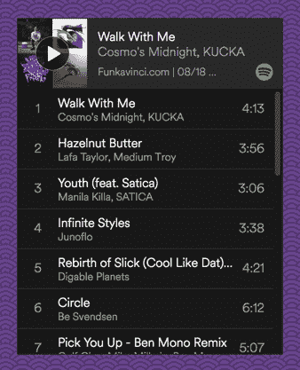
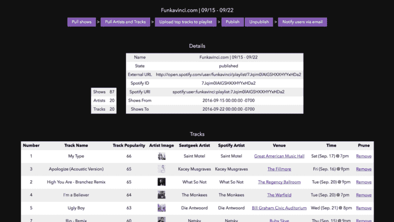
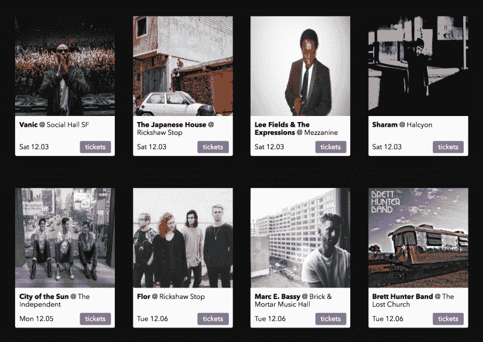
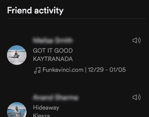
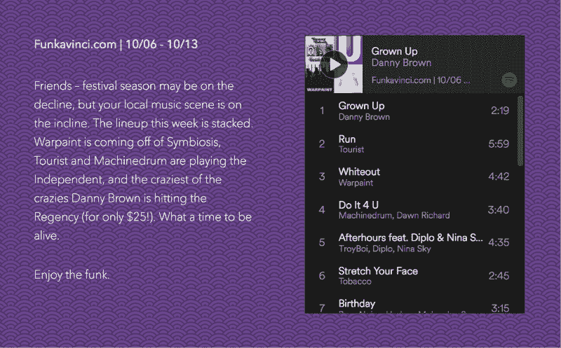

# 我是如何设计一个算法来混合来到你们镇上的乐队的播放列表的

> 原文：<https://www.freecodecamp.org/news/the-machine-made-playlist-faec2c8bc7ba/>

由新浪哈比边

# 我是如何设计一个算法来混合来到你们镇上的乐队的播放列表的

这是对 funkavinci.com 的回顾，是我去年夏天参与的一个网络项目。这是一系列每周由电脑生成的播放列表，展示了镇上最好的即将到来的音乐会。

受 Spotify 的 Discover Weekly 的启发，Funkavinci 使用一种算法来生成一个包含 20 首歌曲的每周播放列表。每首曲目对应一位将在接下来的一周现场演奏的艺术家。如果听众喜欢一首曲目，他们知道艺术家将在镇上，可以购买门票观看他们的表演。

在兼职运营了几个月后，我最近停止了对 Funkavinci 的支持。我写这篇文章是为了描述我建造它的过程，并分享一些心得。

### 动机

去年夏天我发现了许多新音乐。我想看很多现场表演，我知道谁迟早会在旧金山表演。我还想知道是否可以通过监视在城市中巡回演出的艺术家来建立一个音乐发现工具。

像城里的乐队和 Songkick 这样的服务部分地解决了这些想法，但也有缺点。他们每天发送通知，提到镇上乐队的名字，但我很难认出这些名字。我错过了本该去看的演出。做了一些研究，我发现这是一个普遍的问题。更有效的方法是将注意力从艺人的名字转移到他们的歌曲上，让音乐自己说话。

我还了解到音乐会在整个音乐产业中变得越来越重要。今天的音乐家依靠现场音乐，而不是录音音乐，来获得大部分收入。然而，大多数音乐会门票并未售罄。建立一个列出城里最好的音乐会的服务不仅能帮助乐迷发现音乐；这也有助于音乐家销售门票。

我决定建立一个应用程序，每周生成一个新的播放列表，其中 20 首曲目代表 20 场即将举行的音乐会，并将其发送到我的电子邮件中。

### 建立解决方案的原型

在检查了几个 API 之后，我决定使用 [Seatgeek](http://platform.seatgeek.com/) 作为最新音乐会列表的来源。他们有一个相对完整的事件数据库，提供一个 JSON API，并允许商业使用他们的 API。

为了生成包含最佳音乐会的播放列表，我设计了以下算法:

1.  查询 Seatgeek API ,了解下周即将在旧金山举行的所有音乐会。这通常会返回大约 100 个事件。
2.  提取每个事件的主要表演者，并在 [Spotify 搜索 API](https://developer.spotify.com/web-api/search-item/) 中查询该表演者。
3.  在 Spotify top tracks API 中查询每位艺术家最受欢迎的歌曲。
4.  将结果列表过滤为按流行程度排序的前 20 首歌曲，并将它们添加到 Spotify 播放列表中以供收听。这是接下来一周城里 20 位最佳艺术家的名单，至少是根据他们在 Spotify 上最受欢迎的歌曲的受欢迎程度来决定的。

我对结果感到惊喜。播放列表的格式把音乐放在最前面和中心。不再被古怪的乐队名字吓倒，我倾听并爱上了几个艺术家。更好的是，他们都在旧金山巡回演出，所以我在不到一周的时间里就看到了他们的现场演出。我和几个有类似结果的朋友分享了这个播放列表。

The first Funkavinci playlist

### 构建产品

我很快意识到，给一个播放列表添加 20 首流行歌曲并不能带来流畅的聆听体验。电子音乐、嘻哈音乐和摇滚音乐依次出现。此外，Seatgeek 和 Spotify 的搜索数据并不总是完美的。偶尔会有不在镇上表演的艺术家，但他们的名字与在镇上表演的艺术家的名字相似。

我修改了算法，将前 50 首曲目添加到私人播放列表中。我个人会听这些，并删减掉前 20 名。我确保所有的艺术家都在这个城市表演，并且音乐作为一个整体在播放列表中流动。

我构建了一个 Rails 应用程序来管理各种播放列表、节目、艺术家和曲目。我添加了一个管理 UI，允许我可视化、添加或删除这些不同的实体。

The Admin UI

艺术家和播放列表以及播放列表和城市之间有一个清晰的底层结构。这意味着在未来，我可以在后端添加一个抽象层来生成其他城市的播放列表。

然后我转向了面向用户的网站。我使用了基于卡片的布局来展示音乐会和补充播放列表。如果我决定为登录的用户个性化播放列表，这种布局也允许容易的试验和重新排序。

Using cards to display concert information

### 到野外去

我在 8 月份推出了这个网站。起初有一群朋友注册了，在接下来的几周里，这个范围逐渐扩大。

Funkavinci 播放列表在每周日上午 10 点以每周简讯的形式发布。这封邮件提供了一点价值，并围绕它的每周到达建立了一种期待感。用户可以简单地将邮件转发给朋友，创造了一个有机的增长途径。

另一个增长黑客是使用 Spotify 社交 feed 来传播意识。播放列表的名字类似于“[Funkavinci.com | 12/29–01/05](http://www.funkavinci.com/playlists/24)”。如果有人发现一个朋友在听这个播放列表，并想了解更多，他们可以简单地访问这个网站。

Funkavinci.com on the Spotify social feed

整理每周播放列表的过程是自动化的，每周需要一个小时的时间。我会听 50 首歌，然后写一个对话式的广告来宣布新的播放列表。这包括在网站和时事通讯中。

I had fun writing these weekly blurbs.

### 我的外卖

当我关闭 Funkavinci 并开始做其他事情时，我给自己的一些提示是:

#### **了解使用外部 API 的利弊**

有一次，我有了把 Funkavinci 发展成一家企业的想法。我经常听到朋友们因为这项服务而购买门票和去听音乐会。我想知道它是否能放大。

出于多种原因，我最终决定不这么做，其中一个原因是 Funkavinci 的杠杆率很低。它既不拥有内容(即音乐)，也不拥有数据(即 Spotify 上的收听指标或票务网站上的购买指标)。

构建一个消费者应用程序需要深入了解用户行为，而我无法获得重要的数据点。一个潜在的解决方案是通过独立托管音乐和提供媒体播放器来抑制对 Spotify(或其替代产品 Soundcloud)的依赖。像 [8tracks](http://8tracks.com/) 或[常驻顾问](https://www.residentadvisor.net/)这样的网站遵循这种方法。这带来了额外的复杂性，包括音乐版权的处理，而且考虑到有限的上升空间，这似乎不值得。

API 允许我们利用现有的平台并构建解决方案，否则这是不可能的。他们也可以让一个人处于低杠杆地位，依靠外部平台生存或获取关键数据。

#### **推动宣传，启动项目**

在 Funkavinci，我陷入了一个典型的避开公众的工程师陷阱。抱着对产品的高标准，并且仍然保留着旧的完美主义倾向的痕迹，我认为这个应用程序还没有准备好进入黄金时间。因此，我并没有在营销方面做出真正的努力，只是在一些在线论坛上分享。

我现在明白了，尽早公布一个项目会非常有帮助。这将有助于创建一个早期的用户社区，为你的决策提供信息。此外，也许更重要的是在早期，它会给你增加责任感和动力。

#### **挑选容易发音和拼写的名字**

俗话说:“计算机科学只有两个硬东西:缓存失效和事物命名。”同样适用于产品。我选择了 Funkavinci 这个名字，因为它让人想起一个时髦的达芬奇的形象，也因为它很前卫。看着许多人纠结于发音或拼写，给我上了宝贵的一课。

说完这些，我告别了一个有趣的项目，进入下一个。

想打个招呼吗？在推特上给我发短信。