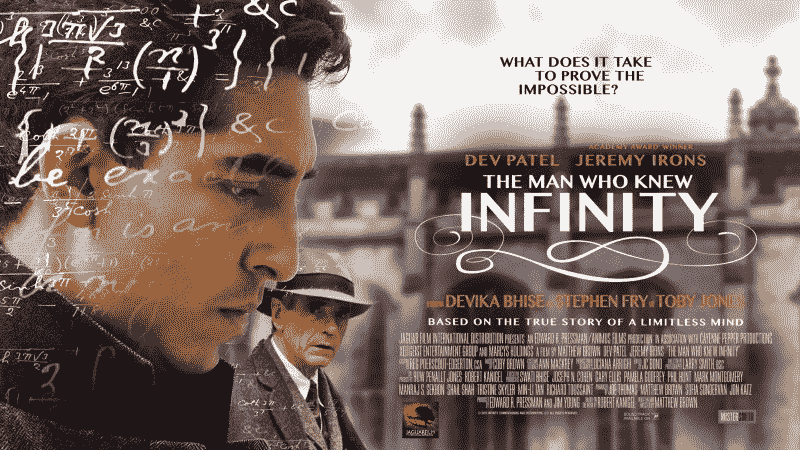
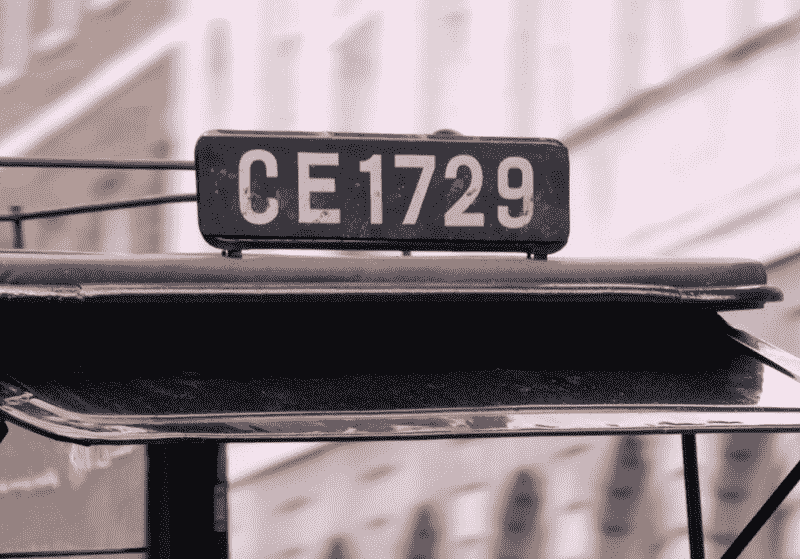

# 知道无限的人:编码 Ramanujan 的出租车

> 原文：<https://www.freecodecamp.org/news/the-man-who-knew-infinity-coding-ramanujans-taxi-52e4c3696e53/>

杰弗里·伯恩

Ramanujan is on the left

# 知道无限的人:编码 Ramanujan 的出租车

你看过电影(或书)吗[认识无限的人](http://www.imdb.com/title/tt0787524/)？

这部由戴夫·帕特尔和杰瑞米·艾恩斯主演的新电影探索了印度数学家斯里尼瓦瑟·拉马努金以及他对数学的深刻理解、独创性和热爱。

这部电影在智力和情感层面上启发了我。但是真正吸引我注意的是一个特别的五秒钟场景。

这个场景发生在 1918 年。Ramanujan 的导师兼朋友 G.H. Hardy 开玩笑说，他刚刚乘坐了 1729 号出租车，发现这个号码“相当无聊”。

Ramanujan 充满激情地回答，“不，哈代，这是一个非常有趣的数字！这是可以用两种不同方式表达为两个立方之和的最小数字。”

Ramanujan 能够超越简单的出租车号码，看到它背后的深层表达:a+b = c+d…更好地被称为 [Ramanujan 的出租车](https://en.wikipedia.org/wiki/Taxicab_number)。我认为这个问题很有趣，并想知道代码实现会是什么样子。我没有意识到这个算法有很多优化层。

The taxi Ramanujan took — at least in the movie

#### 实现 Ramanujan 出租车的第一次尝试

我从一个用 Scala 编写的简单实现开始。带有性能计时的代码可以在 [GitHub](https://github.com/gbourne1/Ramanujan_Taxi) 上找到:

我们从强力实现开始，遍历所有组合以找到 a + b = c + d 的位置。我们实现了 O(n⁴)性能，因为使用了四个循环来计算 a、b、c 和 d 等于或小于参数 n 的所有值，这限制了我们的搜索范围。

这种蛮力实现，与 O(n⁴)的性能，有点糟糕。那么，如何才能做得更好呢？

#### 我们可以做得更好

首先要问的问题是:我们是否总是需要计算 a、b、c 和 d 的所有值？请记住，我们使用的等式是 a + b = c + d。如果我们求解 d，我们会得到 d = a + b - c。因此，一旦我们知道 a、b 和 c，我们就可以直接计算 d 的值，而不是遍历 d 的所有值。

我的下一个实现也是在 Scala 中，用计算 d = a + b — c 替换了第四个循环:

第二个版本具有 O(n)性能，因为我们跳过了最后一个循环。整洁！

#### 第三次是一种魅力

我们还没完呢。还有第三个，也是最好的一个，需要考虑的增强。如果我们不仅不需要求解 d 的所有值，也不需要求解 c 的所有值，那会怎么样呢？需要了解一些事情:

1.  如果我们计算 a 和 b 的所有值都等于或小于 n，我们实质上不仅有 a 和 b 的所有可能值，还有 c 和 d 的所有可能值。
2.  a + b 的和等于 c + d 的和
3.  如果对于给定的一对整数(a，b ),上述#2 的和与另一对整数(a，b)的和相匹配，我们实质上找到了 c 和 d 对。

如果我们存储 a + b 和对应对(a，b)的每个组合，任何有两对的和意味着我们已经找到 a + b = c + d，其中列表中的第一对可以被认为是(a，b)，下一对是(c，d)。

例如，如果我们遍历 a + b 的组合，我们将把和 1729 与对(1，12)一起存储。继续迭代，我们将看到另一个 1729 的和，但这次是对(9，10)。因为我们有两个不同的对，它们的总和都是 1729，所以我们找到了一个 Ramanujan 出租车，它求解 a + b = c + d。

在第三个版本中，我们使用 Hashmap 将 sum(键)和相应的对列表存储为一个排序集(值)。如果列表中包含不止一对，我们就有了赢家！

这个实现具有 O(n)的性能，因为我们只需要两个循环来计算 a 和 b 的组合，非常简洁！

我怀疑存在第四种优化，其中我们只需要计算 a 的值并从 a 中导出 b(“b”循环只是“a”循环的偏移),性能为 O(n)。

另外，另一个挑战是将实现重写为函数式编程模式。我会留给你去探索。

#### 一部了不起的电影，一个了不起的人

看了《知道无限的人》之后，我对 Ramanujan 的天才感到敬畏。通过实现他的出租车算法——及其几项性能优化——我瞥见了他在“不，哈迪，这是一个非常有趣的数字！”

Ramanujan 的出租车已有近一个世纪的历史，但仍有新的发现。埃默里大学的数学家们[发现](http://phys.org/news/2015-10-mathematicians-magic-key-ramanujan-taxi-cab.html)数字 1729 与椭圆曲线和 K3 曲面有关——它们是当今弦理论和量子物理中的重要对象。

我想我们只了解了 Ramanujan 的出租车号码和他惊人的天赋。

**关于作者:** [杰弗里·伯恩](https://www.freecodecamp.org/news/the-man-who-knew-infinity-coding-ramanujans-taxi-52e4c3696e53/undefined)是[退休](https://www.retirety.com)的首席执行官——帮助退休或接近退休的人找到更好的退休方式。

#### 感谢阅读！

### 如果你喜欢这篇文章，请随意点击下面的按钮。去帮助别人找到它！