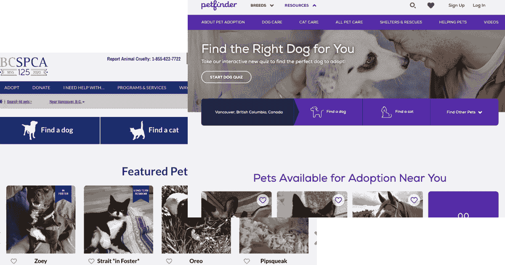

# 如何使用指导框架学习新技能

> 原文：<https://www.freecodecamp.org/news/the-mentoring-framework/>

去年 10 月，我在工作中创建了一个指导框架。目标是使用 Ruby on Rails 从头开始创建一个项目。在那次旅程中，我想学习更多关于 Ruby、前端开发、项目管理和 Git、数据库和 DevOps 的知识。

这个指导框架类似于训练营。这里的不同之处在于，我分享了一个建议的功能/学习内容列表，每个人都可以专注于对他们来说重要的事情。

**一言以蔽之:目标→项目→执行→知识(和利润)。**

这篇文章分为 4 个主要部分:开始之前，项目想法，执行，例子和资源。

## 开始之前

你的主要目标是什么？在下面的列表中，选择你希望获得的知识水平:“基本理解”、“中级理解”或“高级理解”。这将有助于确定你将在哪些方面投入更多的时间和精力。

*   学习 Ruby / Ruby on Rails
*   了解前端
*   学习项目管理和 Git
*   学习数据库
*   学习 DevOps

## 项目创意

一旦你知道了你的主要目标，你就需要一个项目。看看以下两个想法:

### 书店

假设你想在网上卖书。书店有什么样的特色？

*   按标题列出书籍
*   按作者列出图书
*   按类别列出图书
*   搜索书籍
*   买书
*   列出您的订单

### 宠物收养网站

想象一下，你想为一个照顾动物的组织创建一个网站(在不列颠哥伦比亚省，我们有 SPCA)。宠物收养网站有什么样的特点？

*   按类型列出宠物(狗、猫和其他)
*   按大小(或品种，或年龄)列出宠物
*   列出每个地点的宠物
*   根据名字搜索宠物
*   请求收养
*   列出你的领养请求

## 执行

一旦你知道了自己的主要目标，有了想法，就该开始工作了。检查您将要执行的任务列表:

### 学习 Ruby on Rails

*   使用脚手架创建你的实体(基本理解)或创建你自己的控制器、模型和视图(中级)
*   使用 Devise 添加认证(基本理解)或创建自己的认证(中级)。或者使用带有 Oauth 认证的设备(脸书、谷歌等-中级)
*   用 gem 添加友好的 URL(基本)或创建自己的解决方案(中级)
*   添加搜索(中级)
*   为所有代码添加测试
*   为您的数据创建种子，因此您不需要手动创建数据
*   向用户发送电子邮件(中级)
*   创建不同的用户角色(中级)
*   添加分页(基本)
*   添加本地化(中级)
*   添加标签系统(中级)
*   添加图像(中间)

### 了解前端

*   使用 Tailwind CSS(初级)或您自己的 CSS/SASS(中级)创建一个漂亮的布局
*   使用 Turbolinks(高级/可选)
*   添加基本动画-例如，当在购物车中添加一本书时，显示一些动画(高级/可选)
*   在你的应用中添加谷歌地图(中级)
*   在您的用户中添加 Google Places
*   添加带有照片的旋转木马
*   使用 Ajax 或无限分页添加分页(高级)

### 学习项目管理和 Git

*   使用 Github 项目来组织您的功能
*   使用 Git 中的特性分支，为所有特性创建 PR

### 学习数据库

编写简单的 SQL 来查找相关信息。几个例子:

*   在书店里寻找畅销书作家
*   查找每个城市的订单数或宠物请求数
*   找出哪一天有更多的销售
*   在应用程序中添加图表以显示数据

### 学习 DevOps

*   将网站部署到 Heroku(初级/中级)或 AWS(高级)
*   在 Heroku 中设置配置项(初级/中级)
*   添加 Airbrake 以监控应用程序中的错误(基本)
*   购买域，设置 Cloudflare(高级/可选)

## 例子

*   [SPCA](https://adopt.spca.bc.ca)
*   [宠物寻找器](https://www.petfinder.com/)

## 资源

*   课程: [Ruby on Rails 5 基础培训](https://www.linkedin.com/learning/ruby-on-rails-5-essential-training)和 [Ruby on Rails 6 基础培训](https://www.linkedin.com/learning/ruby-on-rails-6-essential-training)——第一个课程比第二个长。
*   截屏: [RubyTapas](https://rubytapas.com) ， [GoRails](https://gorails.com)

也发布在[我的博客](https://bit.ly/2XI2BCE)上。如果你喜欢这些内容，请在 [Twitter](https://twitter.com/leozera) 和 [GitHub](https://github.com/leonardofaria) 上关注我。由 [Maxwell Nelson 在 Unsplash](https://unsplash.com/photos/taiuG8CPKAQ) 拍摄的封面照片。