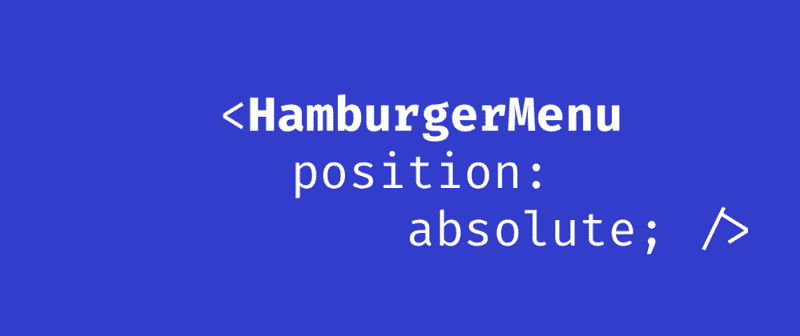

# 开发人员在编写汉堡菜单时犯的错误

> 原文：<https://www.freecodecamp.org/news/the-mistake-developers-make-when-coding-a-hamburger-menu-f46c7a3ff956/>

贾里德·汤

# 开发人员在编写汉堡菜单时犯的错误



《纽约时报》的开发者在汉堡菜单上犯了什么错误，迪士尼和维基百科又做对了什么？

据我所知，我只找到了一种方式来样式化支持 iOS Safari 的汉堡菜单的打开状态。(想必你希望移动视图能在 iPhone 上工作吧！)

都是汉堡菜单怎么定位的问题。

### 许多汉堡菜单的问题是

如果你的汉堡菜单不需要滚动…祝贺你！你现在想到的 CSS 解决方案可能会工作得很好:当用户点击菜单图标时，将侧边栏完全置于视窗之外。

如果您的菜单上的项目比视窗一次显示的项目多，这就是当您的汉堡菜单被绝对定位时发生的情况:

如果你不想看视频，我试着用文字描述一下。

*   在`position: absolute`菜单中滚动是不愉快的:它不会平滑地滚动，当它到达滚动的末尾时，它不会以[令人满意的专利橡皮筋方式](https://www.youtube.com/watch?v=FSv5x3V_KHY)弹回。试试纽约时报或[干草叉](https://pitchfork.com)上的汉堡菜单。
*   如果您在汉堡菜单中过度滚动，iOS Safari 将改为滚动主体。试试 [Viki](https://viki.com) 上的侧边栏。
*   另一种方法是在工具条上使用`position:fixed`和`-webkit-overflow-scrolling: touch`。即便如此，如果你点击菜单之外，比如滚动侧边栏旁边的主要内容，你将失去在菜单内滚动的能力。尝试在[抓取](https://grab.com)上的汉堡菜单。

注意 iOS 有时滚动菜单，有时滚动菜单后面的正文？令人沮丧！

另外，你也可以打破 Apple.com 的卷轴。触发汉堡菜单滚动的一个简单方法是水平使用你的手机。

### 解决方案

基本上，关于菜单的最终打开状态，你必须记住的关键事情是:当侧边栏打开时，它将是定位的主要内容，而不是绝对定位菜单。换句话说，**不是定位菜单，而是定位其他所有东西**！

下面是代码，以及解释性注释:

```
<html><head></head><body>  <div class="sidebar">Hamburger menu links go here</div>  <div class="main-content"><button class="hamburger-menu-icon" onClick="toggleSidebar()">?</button></div></body></html> 
```

```
/* Arbitrary CSS variable values for explanatory purposes */:root {  --sidebar-width: 100px;  --sidebar-bg-colour: blue;}.sidebar {  display: none;  position: relative;  width: var(--sidebar-width);}@media (max-width: 767px) {  html.sidebar-is-open .sidebar {    display: block;      /*       The sidebar is just rendered in default position,      as it appears in the document flow     */  }  html.sidebar-is-open .main-content {    position: fixed;     /*      It is the main content that is positioned.      This is the crux of the implementation. The rest is all sugar.     Cons: the body will scroll to the top, losing your user's scroll position    */    /* prevents resizing from its original full-screen width */    bottom: 0;    left: 0;    right: 0;    top: 0;    width: 100%;     overflow: hidden;  }  /* Optional enhancement:      make the over-scroll on iPhone the same color as the sidebar */  html.sidebar-is-open body {    background-color: var(--sidebar-bg-colour);  }  .sidebar {    background-color: var(--sidebar-bg-colour);  }}
```

```
const documentElement = document.querySelector("html");const contentElement = document.querySelector(".main-content");const sidebarElement = document.querySelector(".sidebar");const sidebarIsOpen = () => documentElement.classList.contains("sidebar-is-open");const openSidebar = () => {  /* How you trigger the change is up to you */  documentElement.classList.add("sidebar-is-open");};const closeSidebar = () => {  documentElement.classList.remove("sidebar-is-open");};const toggleSidebar = () => {  sidebarIsOpen() ? closeSidebar() : openSidebar();};
```

### 结论

到目前为止，我发现有两个大玩家做对了:[维基百科](https://wikipedia.org)和[迪士尼美国](https://disney.go.com)。

在 iOS 上尝试他们的汉堡菜单，看看滚动是多么棒的体验！

希望你能传播这个消息，从现在开始修改汉堡菜单。

如果你是初学者，你可以在我的博客上找到关于[什么是汉堡菜单](https://jaredtong.com/how-to-code-a-hamburger-menu/)和[如何从头开始制作汉堡菜单的解释。](https://jaredtong.com/how-to-code-a-hamburger-menu/)