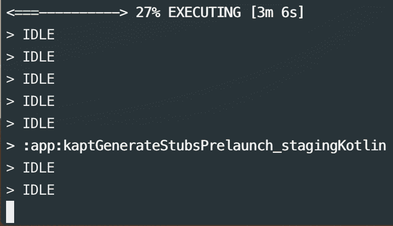

# 移动应用发布清单——如何像老板一样发布应用

> 原文：<https://www.freecodecamp.org/news/the-mobile-app-launch-checklist-how-to-ship-apps-like-a-boss-84a20f5d8a45/>

作者:米哈尔·比亚拉斯

在这篇文章中，我想介绍一个关于如何发布移动应用的简短指南。我将强调内部版本。我也不把自己局限于 Android，因为我相信这也适用于 iOS。

我把这篇文章分成几点，只是为了增加可读性。如果你想了解更多，请和我呆在一起！我希望你会喜欢它。

### **1。确保你所有的测试都通过了✅的测试**

如果您编写端到端的单元和集成测试，您应该始终注意检查它们的输出。如果他们失败了，让他们工作。

### **2。对你的应用程序** ✅进行一次全新的完整构建

如果你在 Android 上混淆代码并使用 [**ProGuard**](https://stuff.mit.edu/afs/sipb/project/android/sdk/android-sdk-linux/tools/proguard/docs/index.html#manual/introduction.html) ，确保它不会删除可能导致应用崩溃的代码。你可以在这里阅读关于代码收缩的。

完整的构建可以在您的本地机器上执行，也可以使用**持续集成**。

如果你或你的公司拥有一台服务器，你可以使用 [**【詹金斯】**](https://jenkins.io/) (免费开源自动化服务器)来设置你的 **CI** 流程。如果没有，您可以很容易地使用市场上提供的许多 CI 服务之一。我可以推荐，比如[**bit rise**](https://app.bitrise.io/users/sign_up?referrer=6ee27e581bdc8285)**[circle ci](https://circleci.com/)[Travis](https://travis-ci.org/)**和 [**Bitbucket 管道**](https://bitbucket.org/product/features/pipelines) 。

特拉维斯已经与 Github 整合，所以我如果你有付费计划，它可能是你的选择。如果您使用 Bitbucket，那么 Bitbucket 管道也是如此。
[**Bitrise**](https://app.bitrise.io/users/sign_up?referrer=6ee27e581bdc8285) 与 Slack、Fabric、 [XCode Archive](https://www.bitrise.io/integrations/steps/xcode-archive) 、 [CocoaPods](https://cocoapods.org/) 、 [Gradle Runner](https://www.bitrise.io/integrations/steps/gradle-runner) 、[吉拉](https://pl.atlassian.com/software/jira)等等服务有很多很好的集成。前段时间写了一篇关于 **CircleCI** 的小文章，有兴趣的可以上 [**我的博客**](http://mmbs.github.io/tools/ci/2016/07/31/circleci-for-android-projects/) 看看。

### **3。执行静态代码分析** ✅

确保您使用以下工具:

*   Lint ( *用于 Java 和 Kotlin，在 Android Studio 版本中默认可用。3.1 及以上*)、 [ktlint](https://github.com/shyiko/ktlint) 、pmd、checkstyle、findbugs、 [detekt](https://github.com/arturbosch/detekt) 、[grad le-static-analysis-plugin](https://github.com/novoda/gradle-static-analysis-plugin)**for Android**
*   [OCLint](http://oclint.org/) ，[裁缝](https://github.com/sleekbyte/tailor)， [SwiftLint](https://github.com/realm/SwiftLint) ， [Clang 静态分析器](http://clang-analyzer.llvm.org/)，[推断](https://fbinfer.com/)， [SwiftFormat](https://github.com/nicklockwood/SwiftFormat) ， [Swimat](https://github.com/Jintin/Swimat) ，[失礼](http://fauxpasapp.com/)**iOS**

当然，只使用你认为有助于提高你当前工作项目质量的工具。

### **4。为内部需求准备调试和生产版本** ✅

确保准备好应用程序的调试和生产版本，并在内部发布以供测试。你还应该使用类似于 [**Instabug 的崩溃报告**](https://instabug.com/crash-reporting) 或者[**Fabric**](https://get.fabric.io/)**(Crashlytics)**这样的崩溃报告工具。

检查您的应用程序如何与调试/试运行 API 一起工作，然后与生产一起工作，这一点至关重要。对于 Android 来说，混淆代码并检查它是否被适当收缩也很重要。

在为您的团队发布版本时，您可以使用 iOS 的[**Test flight**](https://developer.apple.com/testflight/)**和 Android 的 [**Google Play 测试频道**](https://developer.android.com/distribute/best-practices/launch/test-tracks) 。也可以考虑像 **Fabric** (将于 2019 年中关闭[)或者目前正在过渡到](https://fabric.io/blog/the-future-of-fabric) [**App Center**](https://appcenter.ms/) 的 [**曲棍球 App**](https://hockeyapp.net/#s) 这样的免费工具。**

### ****5。**自动机**

****

**准备构建也可以自动化。你可能听说过 [**快车道**](https://fastlane.tools/) 。这是一个免费的工具，用于自动截图、测试版部署、应用商店/ Google Play 部署和代码签名。它受到我前面提到的所有 CI 和分发服务的支持。**

****

**Android 和 T2 iOS 的配置非常简单，但只有在你有 macOS 的情况下才有可能。不幸的是，目前[没有非 macOS 平台支持](https://github.com/fastlane/fastlane/issues/11687)。这对于在 Linux 和 Windows 上编码的 Android 开发者来说是痛苦的。但是有解决的办法！？？？**

****

**[**Gradle Play Publisher**](https://github.com/Triple-T/gradle-play-publisher)是一个 grad le 插件，可以自动将应用捆绑包或 APK 和其他应用细节上传到谷歌 Play 商店。这是浪子的一个很好的选择。我前段时间用过，效果真的很好，我可以推荐。[文档](https://github.com/Triple-T/gradle-play-publisher/blob/master/README.md)很全面，它允许你平滑工具的配置。**

### ****6。了解并倾听你的用户** ✅**

****

**因此，您检查了您的代码，为自动化设置了工具，准备了一个完全可操作且经过测试的构建，并将其发布给您的团队进行测试。但是有多少次你觉得没有人关心你或者没有时间给你反馈？根据经验，我知道很难让团队来检查和使用你新发布的应用。**

**答案是 [**Instabug**](https://instabug.com/) 。大约 3 年前，我做了很多关于收集反馈、bug、报告等工具的研究，从那以后，我坚持使用 Instabug。**

****

**它真的很容易与你的任何应用程序集成(它支持 Android，iOS，React Native，Xamarin，Unity，Cordova)——它只是几行代码。**

**如何使用该工具:**

*   **你的用户只需摇摇手机，然后[用已经截图的内容写下反馈](https://instabug.com/bug-reporting)。他们甚至可以绘制或记录一部电影，缺少什么或如何重现一个 bug。超级有帮助。**
*   **最终用户可以[通过应用内聊天](https://instabug.com/in-app-chat)询问功能或给出反馈，而不是通过联系表格联系开发者。这有助于始终与用户保持联系。
    此外，开发者可以轻松回复报告错误或崩溃的用户，从他们那里获得更多上下文信息，或者感谢他们，甚至告诉他们错误/崩溃已经修复，他们可以将应用程序更新到最新版本。**
*   **使用[应用内功能请求](https://instabug.com/feature-requests)并通过用户驱动的优先级排序来支持您的待办事项。由于这个特性，团队和产品负责人将知道首先发布哪个特性。**

### **7 .**。班长订婚** ✅**

****

**这款应用已经投入生产，但你感觉人们并没有使用你的应用。那怎么办呢？**

**可以集成 **Google Analytics** 、 **Fabric** 、[Amazon Pinpoint](https://aws.amazon.com/pinpoint/)、 [**Mixpanel**](https://mixpanel.com/) 或 [**Segment.io**](http://segment.io) 等工具来查看:**

*   **活跃用户，**
*   **会话间隔，**
*   **应用程序中的时间，**
*   **屏幕流，**
*   **保留，**
*   **转换，**
*   **终身价值。**

**将新的应用功能发布到生产中时，检查这些 KPI 也至关重要。不要低估他们。？**

**我相信这就是了。我希望你喜欢这个清单。如果你有任何有助于应用发布的见解或其他工具，请在评论中告诉我。你也可以看看我的其他文章:**

*   **[七个幸运儿 Android 开发者的新工具和插件&设计师](https://proandroiddev.com/lucky-7-new-tools-and-plugins-for-android-developers-designers-1545e5c59f27)**
*   **[2018 年初要检查的 25 个新 Android 库和项目](https://proandroiddev.com/25-new-android-libraries-and-projects-to-check-at-the-beginning-of-2018-ba3b422bbbb4)**
*   **[类固醇终末](https://medium.com/@mmbialas/terminal-on-steroids-bbf88f3dcbdb)**

**如果你喜欢我的文章，请别忘了点击？？？去推荐给别人？？？。**

**此外，要获得关于我的新文章和故事的通知，请在[媒体](https://medium.com/@mmbialas)和[推特](https://twitter.com/mmbialas)上关注我。你也可以在 [LinkedIn](https://www.linkedin.com/in/mmbialas) 上找到我。干杯！**