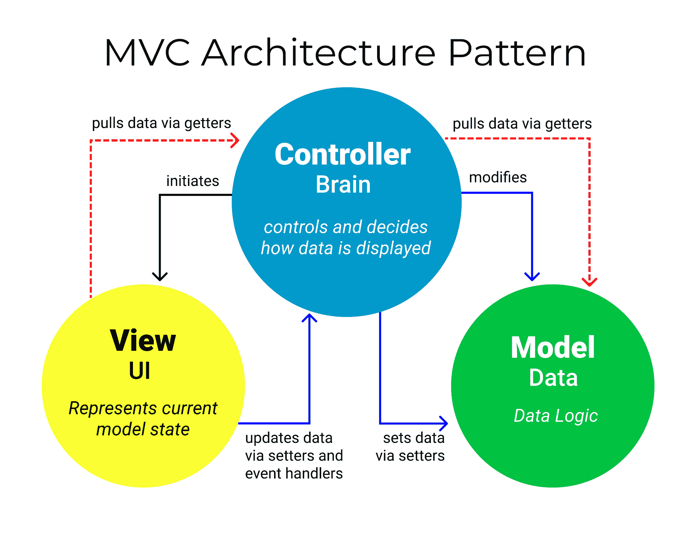
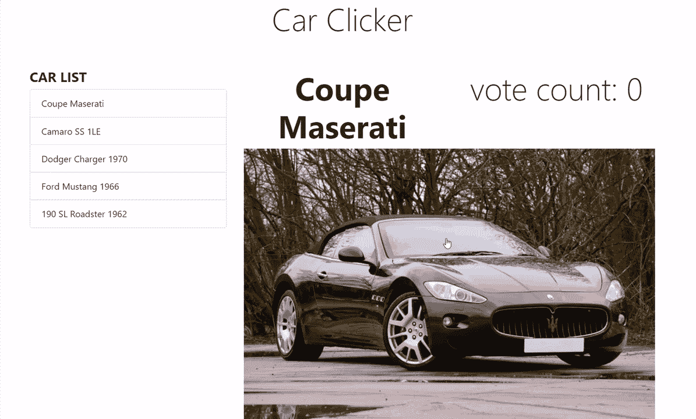

# 模型视图控制器模式——解释 MVC 架构和框架

> 原文：<https://www.freecodecamp.org/news/the-model-view-controller-pattern-mvc-architecture-and-frameworks-explained/>

MVC 架构模式将复杂的应用程序开发变成了一个更易于管理的过程。它允许几个开发人员同时处理应用程序。

当我第一次学习 MVC 模式时，我被所有的术语吓住了。当我开始将这些概念应用到实际的应用程序中时，情况就更是如此。

通过后退一步关注 MVC 是什么以及它能完成什么，理解并应用该模式到任何 web 应用程序就容易多了。

## 什么是 MVC？

MVC 代表模型-视图-控制器。这些组件的含义如下:

*   **模型**:包含所有数据逻辑的后端
*   **视图**:前端或图形用户界面(GUI)
*   **控制器**:控制数据显示方式的应用程序的大脑



MVCs 的概念首先是由 Trygve Reenskaug 提出的，他把它作为开发桌面应用程序 GUI 的一种方式。

今天，MVC 模式被用于现代 web 应用程序，因为它允许应用程序可伸缩、可维护且易于扩展。

## 为什么应该使用 MVC？

三个字:**关注点分离**，简称 SoC。

MVC 模式帮助你将前端和后端代码分解成独立的组件。这样，管理和更改任何一方都容易得多，而不会互相干扰。

但是这说起来容易做起来难，尤其是当几个开发人员需要同时更新、修改或调试一个成熟的应用程序时。

## 如何使用 MVC

为了更好地说明 MVC 模式，我包含了一个 web 应用程序来展示这些概念是如何工作的。

我的 Car Clicker 应用程序是一个著名的 Cat Clicker 应用程序的变体。

以下是我的应用程序中的一些主要差异:

1.  没有猫，**只有**肌肉车图片(对不起爱猫人士！)
2.  列出了多种汽车型号
3.  有多个点击计数器
4.  它只显示选定的汽车



现在让我们深入研究组成 MVC 架构模式的这三个组件。

### 模型(数据)

模型的工作就是简单地管理数据。无论数据来自数据库、API 还是 JSON 对象，模型都负责管理它。

在 Car Clicker 应用程序中，模型对象包含一个 Car 对象数组，其中包含应用程序所需的所有信息(数据)。

它还使用一个初始设置为`null`的变量来管理当前显示的汽车。

```
const model = {
    currentCar: null,
    cars: [
        {
            clickCount: 0,
            name: 'Coupe Maserati',
            imgSrc: 'img/black-convertible-coupe.jpg',
        },
        {
            clickCount: 0,
            name: 'Camaro SS 1LE',
            imgSrc: 'img/chevrolet-camaro.jpg',
        },
        {
            clickCount: 0,
            name: 'Dodger Charger 1970',
            imgSrc: 'img/dodge-charger.jpg',
        },
        {
            clickCount: 0,
            name: 'Ford Mustang 1966',
            imgSrc: 'img/ford-mustang.jpg',
        },
        {
            clickCount: 0,
            name: '190 SL Roadster 1962',
            imgSrc: 'img/mercedes-benz.jpg',
        },
    ],
};
```

### 视图(用户界面)

视图的工作是决定用户将在他们的屏幕上看到什么，以及如何看到。

汽车点击器 app 有两个视图:`carListView`和`CarView`。

这两个视图都有两个关键的功能，它们定义了每个视图想要初始化和呈现的内容。

这些功能是应用程序决定用户将看到什么以及如何看到的地方。

#### carListView

```
const carListView = {
    init() {
        // store the DOM element for easy access later
        this.carListElem = document.getElementById('car-list');

        // render this view (update the DOM elements with the right values)
        this.render();
    },

    render() {
        let car;
        let elem;
        let i;
        // get the cars to be render from the controller
        const cars = controller.getCars();

        // to make sure the list is empty before rendering
        this.carListElem.innerHTML = '';

        // loop over the cars array
        for(let i = 0; i < cars.length; i++) {
            // this is the car we've currently looping over
            car = cars[i];

            // make a new car list item and set its text
            elem = document.createElement('li');
            elem.className = 'list-group-item d-flex justify-content-between lh-condensed';
            elem.style.cursor = 'pointer';
            elem.textContent = car.name;
            elem.addEventListener(
                'click',
                (function(carCopy) {
                    return function() {
                        controller.setCurrentCar(carCopy);
                        carView.render();
                    };
                })(car)
            );
            // finally, add the element to the list
            this.carListElem.appendChild(elem);
        }
    },
};
```

#### CarView

```
const carView = {
    init() {
        // store pointers to the DOM elements for easy access later
        this.carElem = document.getElementById('car');
        this.carNameElem = document.getElementById('car-name');
        this.carImageElem = document.getElementById('car-img');
        this.countElem = document.getElementById('car-count');
        this.elCount = document.getElementById('elCount');

        // on click, increment the current car's counter
        this.carImageElem.addEventListener('click', this.handleClick);

        // render this view (update the DOM elements with the right values)
        this.render();
    },

    handleClick() {
    	return controller.incrementCounter();
    },

    render() {
        // update the DOM elements with values from the current car
        const currentCar = controller.getCurrentCar();
        this.countElem.textContent = currentCar.clickCount;
        this.carNameElem.textContent = currentCar.name;
        this.carImageElem.src = currentCar.imgSrc;
        this.carImageElem.style.cursor = 'pointer';
    },
};
```

### 控制器(大脑)

控制器的职责是向用户提取、修改和提供数据。本质上，控制器是视图和模型之间的链接。

通过 getter 和 setter 函数，控制器从模型中提取数据并初始化视图。

如果视图有任何更新，它会用 setter 函数修改数据。

```
const controller = {
    init() {
        // set the current car to the first one in the list
        model.currentCar = model.cars[0];

        // tell the views to initialize
        carListView.init();
        carView.init();
    },

    getCurrentCar() {
    	return model.currentCar;
    },

    getCars() {
    	return model.cars;
    },

    // set the currently selected car to the object that's passed in
    setCurrentCar(car) {
    	model.currentCar = car;
    },

    // increment the counter for the currently-selected car
    incrementCounter() {
        model.currentCar.clickCount++;
        carView.render();
    },
};

// Let's goooo!
controller.init();
```

## MVC 框架

JavaScript 越来越受欢迎，近年来它已经接管了后端。越来越多成熟的 JavaScript 应用程序以这样或那样的方式选择了 MVC 架构模式。

框架来来去去，但是不变的是从 MVC 架构模式中借用的概念。

应用这些概念的早期框架有 **KnockoutJS** 、 **Django** 和 **Ruby on Rails。**

## 结论

MVC 模式最吸引人的概念是关注点分离。

现代 web 应用程序非常复杂，做出改变有时会非常令人头疼。

在较小的、独立的组件中管理前端和后端允许应用程序可伸缩、可维护且易于扩展。

** *如果你想看一下汽车点击器 app，代码可以在 [GitHub](https://github.com/RafaelDavisH/car-clicker/blob/main/README.md) 上找到，或者在这里查看现场版[。**](https://rafaeldavish.github.io/car-clicker/)*

🌟谢谢你读到这里！🌟