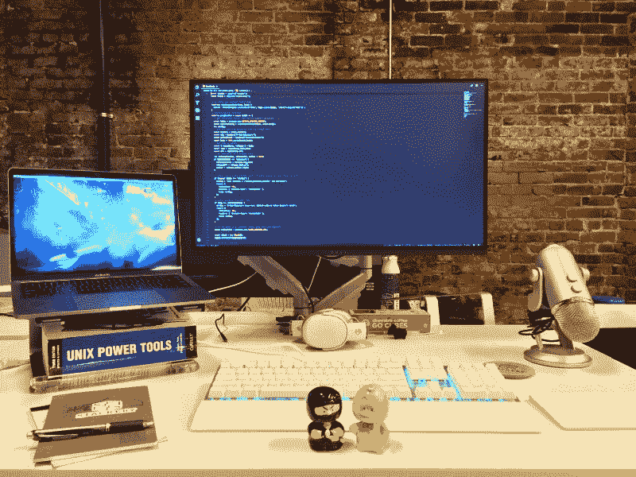

# 当我觉得自己是个开发者的时候

> 原文：<https://www.freecodecamp.org/news/the-moment-i-felt-like-a-developer-6c9a7e67b919/>

安娜·斯皮兹

# 当我觉得自己是个开发者的时候

想象一下这个场景:在一个典型的波特兰周二早晨，我正在上班。与外面的天气不同，办公室明亮而温暖，我已经把我那张别致的桌子设置为“站立”(它可以上下移动。当你按下按钮时。花式)。

我打开了我的 Spotify 编码播放列表,一边工作一边敲着我的脚。


Yup, that’s basically me

我在我们的[应用](https://www.stackery.io/)中，当我发现一个正在生产中的 bug 时，我正在做一些完全不相关的事情。这不是一个应用程序崩溃的错误，但仍然是一个优先事项。

我开了一张罚单。然后，我有了一个前所未有的认识:我可以解决这个问题。不需要打扰其他任何人，不需要发出一般警报，我可以进入我们的代码库，找出发生了什么，并**实际修复它**。

就在这时，这首歌响起:

似乎宇宙是一致的。我切换到我的控制台，开始工作，试图找出发生了什么事。

为了提升气氛，这是下一首歌:

哦，我完全明白了。

几分钟过去了。

嗯，错误似乎出现在我们的 API 中。401，哈？它在我们的后端，这并不是我的强项(我的意思是，从技术上讲，这些都不是我的强项)。

没关系，我还有这个。我想。

就这样，上午变成了下午，我继续往下钻，顺着面包屑找到了罪魁祸首。我尽可能地接近它:一个引起所有大惊小怪的功能。除了我碰到的那个案子，其他案子都管用的那个函数。

这个函数不是我写的，我自己也搞不清楚。

我可能没有这个。

此时，我那张漂亮的桌子已经稳稳地处于“坐着”的位置，我无精打采地坐下，然后坐起来，希望视角是正确理解我面前代码的一个关键因素。

如果 Spotify AI 像我想象的那样神一般，那么就应该在这里播放一些缓慢而伤感的小提琴音乐。唉，音乐保持乐观，而我的情绪却越来越低落:我不得不寻求帮助。

尽管我很想自己解决这个难题，但事实是，我最近刚从代码学校毕业，从事一份很棒的工作已经六个月了，我每天 90%的时间都在学习，因为还有很多东西我不知道。

我也很幸运能在这样一个环境中工作，在需要的时候寻求帮助从来不会被拒绝。我知道我自己无法修复大多数错误，尽管我似乎比开始时更接近答案了。

> 在那一刻，我也意识到，在过去的六个月里，我已经成为一名真正的资本开发人员。

我撞到了一只虫子。我记下了。我试图自己解决这个问题。我将问题缩小到一个文件中的一个函数。我向一位更熟悉该代码的同事寻求帮助，他很快指出我需要传入一个布尔值作为参数来防止错误发生。

工作了半天，添加了一个单词作为参数 un-break 函数:

```
true
```

在一天结束的时候，我有一个 fix PRed(发送 fix pull 请求),虽然花了很长时间，但我对代码库做出了一些贡献，同时在这个过程中学习了几十个新东西。

我是开发商。

挺甜的(史诗音乐排队)。



My actual desk. I like it even better.