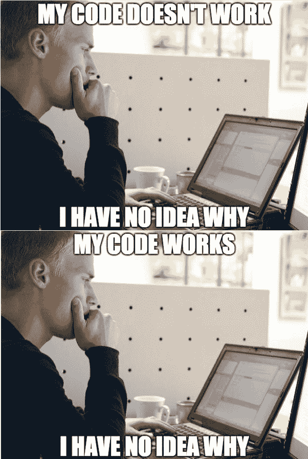
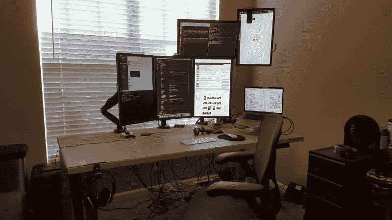

# 自学编码最困难的事情——以及如何解决它们

> 原文：<https://www.freecodecamp.org/news/the-most-difficult-things-about-learning-to-code-by-yourself-b24ac8c3c23a/>

周翔

# 自学编码最困难的事情——以及如何解决它们

“white book on brown wooden table” by [Alexander Michl](https://unsplash.com/@amichl?utm_source=medium&utm_medium=referral) on [Unsplash](https://unsplash.com?utm_source=medium&utm_medium=referral)

近年来，许多人对学习编码产生了兴趣。

他们要么通过在线课程，要么通过离线聚会找到编程的方法，要么只是简单地尝试一下。

像 code.org、codecademy 和免费代码营这样的网站越来越受欢迎。在网上有[大量的编码课程](https://medium.freecodecamp.org/640-free-online-programming-computer-science-courses-you-can-start-in-september-f0bd3a184625)，在 YouTube 上也可以找到。

但是编码并不容易。以下是我们在学习编码时都面临的一些挑战。

#### 1.找到每天编码的“正确”时间。

如果你正在自学编程，很可能你在生活中还有其他的责任。

你可以有一份兼职工作，或者一份全职工作，或者你可以是一个全职妈妈。重点是，这辈子大家都在忙。那么，你每天是如何找到时间编写代码的呢？

有人可能会说:“嗯，如果你足够敬业，你总能找到时间的。”没错。我同意。

那么问题就变成了:“你每天应该花多少时间写代码？如果我每天只能睡半个小时，那还算吗？”

这个问题只有你自己能回答。很难估计你每天应该编码多少小时。有些人建议保持简短和甜蜜。15 分钟足够了。

另一方面，我也听说有人通过每天写 9 到 10 个小时的代码在一年左右的时间里进入了开发领域。如果你想要一些动力，你可以看看那个线程。

底线是:**只有你自己知道你每天能写多少代码，并养成这样做的习惯，而不会筋疲力尽。**最后一部分真的很重要。 [freeCodeCamp](https://www.freecodecamp.org/news/the-most-difficult-things-about-learning-to-code-by-yourself-b24ac8c3c23a/undefined) 创始人[昆西·拉森](https://www.freecodecamp.org/news/the-most-difficult-things-about-learning-to-code-by-yourself-b24ac8c3c23a/undefined)曾在他的推特上说:

> "这不是关于你每天的进步，而是关于每天的进步."

这是一个关于一位在技术领域工作了几十年的高级开发人员的视频，他讲述了程序员在工作时每天做多少编程工作。

这不会是黄金标准，但它会给你一个想法，告诉你如何为自己制定一个现实的，最重要的，可持续的计划，当谈到学习每天编码时。

#### 2.在“没有取得足够好的进展”和“筋疲力尽”之间找到平衡

对我个人来说，我为此挣扎了很久。

有时候，我无法理解我正在阅读的书中的任何一个概念或代码片段。它只是没有进入我的大脑。我会烧得很厉害，以至于我不得不让自己冷静下来，走到阳台上，深呼吸。

从那时起，我会不断提醒自己不要过度劳累，以至于再也回不来了。

编程不容易。它需要你集中注意力，尤其是当你学习新东西的时候。这在精神上是很费力的，而且有时候你也搞不明白——为什么你的代码不能工作，甚至为什么它能工作。

我发现，每当我真正专注于当时正在处理的问题时，我的效率最高，但同时我也非常放松，享受整个过程。

这是当我:

*   找到了我需要解决的问题。
*   通过在线论坛找到了解决方案。
*   尝试了一堆不同的方法来解决它，只是为了看看哪一个有效。
*   我彻底解决了这个问题。

为了应对我们正在学习的很多东西非常平凡和复杂的事实(数据结构和算法等)，每当我学习编码时，我都制定了这个 50/50 规则。

我用 50%的时间做困难的任务，研究基础知识、概念、算法等等。另外 50%的时间我在做我自己的项目，我真正热爱的项目。这样在我的日常学习中就有了平衡。

所以，说白了，你需要热爱你所做的事情。这就引出了下一点。

#### 3.热爱你所做的是战胜所有这些障碍的唯一方法。

虽然听起来很老套，但有时这就是事实。如果你热爱你正在走的路，热爱你正在做的工作，热爱你将要去的方向……你不需要外界的认可。

这种满足感是无法借用或替代的，更糟糕的是，无法伪造。

#### 4.在承担了生活中的其他责任后，继续回到编码上来。

事实是，当谈到自我学习时，永远不会是你自己，在那里，学习。

在生活中，我们都需要承担各种各样的责任。你可能是丈夫，或者妻子，或者某人的父母。你需要照顾你的家庭，或者你有工作要做。或者你是一个需要完成文凭或学位的学生。

我们有这么多的责任，我们哪里有时间去编码呢？

事实是，有时候你不知道或者你就是不能知道。有时候我会跳过编码。我最长的一次“休息”是两个月。

但在那之后，我马上回去编码了。我发现我已经忘记了很多我学过的东西。当你拿起同一本书时，你可能会感到沮丧，你简直不知道如何继续下去。“上帝，我真的要重读所有的章节，重新做所有的任务吗？”

这是一个你必须坚持的时刻，必须坚持到底。

你需要告诉自己，“好吧，这第一个小时的学习可能看起来很慢，也没什么成效。不过没关系，明天我会多学点东西来弥补的。”

除了继续前进，继续前进，没有任何方法可以掩饰这一点。去一个编码论坛或 Twitter，表达你的沮丧。但是一旦你完成了，马上回到编码上来。

#### 5.以各种方式激励自己。

自学和上学是非常不同的。你在编码的时候身边没有人。没有同学，没有社交，你找不到在隧道尽头等着你的“盛大仪式”。大多数时候你都是一个人做。而且大部分时间，你都是一个人。

所以你需要找到某种动力，让自己不断前进。

我一直在查看这个子 Reddit([r/MAC setups](https://www.reddit.com/r/macsetups/))，因为那里的很多人都是开发者。他们使用同样强大的硬件来创造他们想要的软件。没有比这更有意义的了。

也奖励自己，并使之成为一种习惯。

它可能很小，也可能很大。可能是在一天结束时洗个热水澡，或者喝杯冷饮。告诉自己你做得很好。学习编码的时候经常需要。把这张照片挂在你面前的墙上——因为你要相信有一天你会成为坐在照片前面的那个人。

#### 6.不要陷入“为了学习而学习”的谬误。去面试，去见 ups，去申请工作。

学习编码时，我们有时会偏离主题。我觉得有时候你只想偷懒。不是以你不想再学的方式，而是以你偷偷希望整天坐在你的显示器前，你不必面对真正的挑战:**得到一份开发人员的工作。**

不要陷入“我正在学习，这样就够了”的思维误区。当我准备好的时候，我会考虑乔布斯。”

坦率地说，这是我应该经常做的事情。接触潜在客户，即使是为家人和朋友免费建立网站。

所以下次你去面试的时候，你可以展示你做过什么样的工作。这会给你的简历增加价值。第一步总是最难的。但无论如何你都要做。

以上都是你在成为一名开发者的道路上将要面临的挑战/情况。承认它们，用正确的态度面对它们——你面对的那些障碍只会让你变得更强更好。

最后但同样重要的是，编码快乐！享受你正在建造的东西，无论是你的项目还是你自己的未来。

在 Twitter 上关注我[，在](https://twitter.com/zh0ux1ang) [GitHub](http://github.com/zhouxiang19910319) (在那里我对著名的 YDKJS 系列做了一个总结)，并查看我的网站【slowpacedcoding.com】获取更多类似的文章。