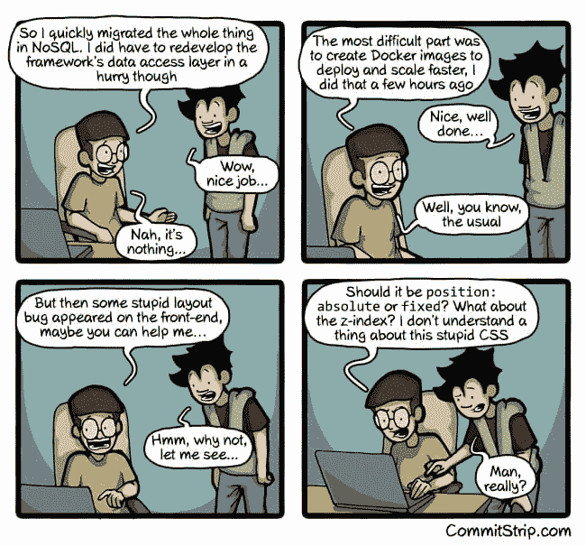
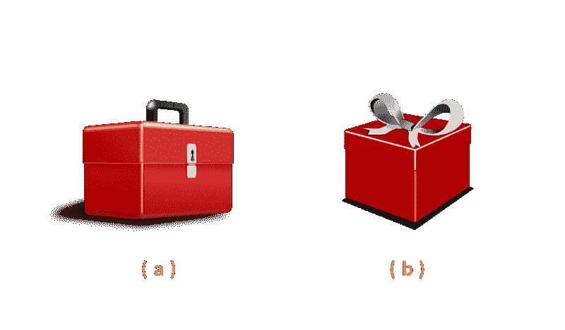
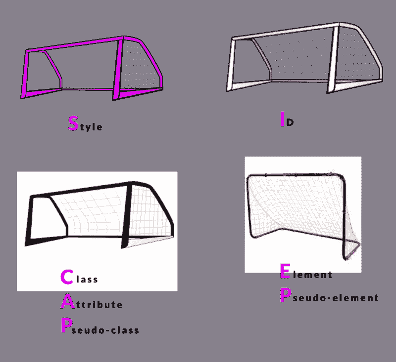
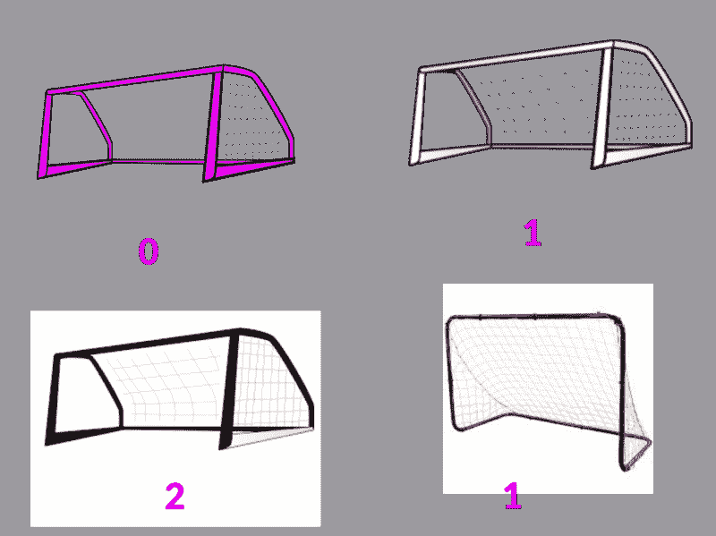

# 要学习的最重要的 CSS 概念

> 原文：<https://www.freecodecamp.org/news/the-most-important-css-concept-to-learn-8e929c944a19/>

从一开始 CSS 就被设计成了**层叠**，这也是它被称为 CSS 的原因——层叠样式表！

可悲的是，CSS 在它所基于的相同的基本概念上名声不佳。

但是级联到底是什么，它真的像大多数人说的那样糟糕吗？

### 介绍

假设约翰写了一堆 CSS，然后上浏览器测试。令他惊讶的是，他编写的样式并没有应用到他刚刚设计的元素上，而是应用到了其他一些样式上！

你看到那边了吗？这是每个人在说“CSS 烂透了”时抱怨的最糟糕的事情之一。

使用 CSS，多种样式可以影响单个元素。所以，你在网页上有一个`paragraph`。但是这个`paragraph`可以由任何 CSS 块进行样式化。

这就像拥有一个可以被代码中的任何函数操作的全局 JavaScript 变量。这似乎是灾难的一个原因。

但是，级联形成了 CSS 最初是如何被创建的背后的基本推理。

拥抱它？

你不能改变它。



You’ve been there before, haven’t you?

### 什么是级联？

层叠是浏览器如何决定对特定元素应用什么样式。就这么简单，对于一个前端开发人员来说，这是一个很好的面试问题。

幸运的是，与级联相关的噩梦是可以理解的，因为它仅由两个因素控制:

1.  元素选择器的特性
2.  正在编写的样式的顺序

让我们快速浏览一下。

### 选择器特异性

你可以把选择器特异性比作人类大脑如何解释指令。

例如，考虑下图:



如果我对你说，“把红盒子递给我。”，你会把哪个传给我？他们有两个人！

你可能会问下一个问题，“哪个盒子，a 还是 b？”*。*

或者你甚至可以抓住两个盒子！不都是红盒子吗？

这是浏览器在处理特殊性时发现自己的情况。

当你说，将段落设计成红色背景色…

```
p {   background-color: red;}
```

由于页面上可能有很多段落元素，浏览器会问，“什么段落？”

浏览器不能问你后续的问题，所以它继续尝试用背景`red`设计页面上每个段落的样式**。**

但是，如果您想说，用红色背景的类名`reddy`来设计段落的样式:

```
p.reddy {  background-color: red;}
```

这是一个更具体的要求！

现在，浏览器将为您请求的特定段落元素设置样式。

就是这样！

从技术上来说，浏览器会查看每个针对特定元素的选择器，并为每个选择器分配“分数”，具有更高特异性分数的选择器获胜。

它计算分数的方式很简单。

假设浏览器在解释你的 CSS 时有 4 个标杆。


1.  对于每个使用`style`属性定位元素的内联样式，1 个目标被分配给目标 post `(a)`。
2.  对于每个`id`选择器，1 个目标被分配给岗位`(b)`。
3.  对于每个出现的`class`选择器、属性选择器和伪类，1 个目标被分配给 post `(c)`。
4.  对于每个元素选择器和伪元素，1 个目标被分配给 post `(d)`。

我记得这是通过使用缩写，SICAPEP:



在分配分数时，通过*串联*计算总分数，作为一个 4 位数的数字。

#### 一个快速具体的例子

考虑以下样式声明:

```
#nav .removed > a:hover {}
```

```
li:last-child h3 .title {}
```

浏览器如何计算这些选择器的特异性“点”？

`#nav .removed > a:ho`看

这是细目分类:

(a)没有内嵌样式，所以第一个球门柱的得分为 0。

(b)有一个`id`选择器`#nav`，第二个球门柱的得分为 1。

(c)还有一个`class`选择器`.removed`和一个伪类选择器`:hover`，第三个球门柱的总得分为 2。

(d)有一个元素选择器，`a`，这是第四个帖子的得分 1。

这是分数的图示。



总特异性分数被连接为`0121`。

与常规数学一样，`0001`小于`0005`,`0121`大于`0021`。

现在，你明白特异性是如何计算的了。

你能尝试计算另一个选择器`li:last-child h3 .title`的特异性吗？

请在评论区告诉我你的想法:)

### 样式顺序

影响层叠的第二个因素是样式的顺序。一个非常基本的例子是在两个不同的代码块中设计相同的元素。

例如:

```
p.reddy {  background: red;}p.reddy {   background: blue;}
```

尽管两个选择器具有相同的特性`0011`，但是规则集的顺序开始起作用。

第二个声明将覆盖前一个声明，段落将是蓝色的，而不是红色的。

### 恶作剧问题

考虑下面的文档，链接文本的颜色是什么？

```
<!doctype html> <html><head><title>Inline Styles and Specificity</title> <style type="text/css">    #nav-force &gt; ul > li > a.nav-link { 	color: blue;     };</style> </head>   <body>      <nav id="nav-force">	<;ul> 	 <li>	  <a href="/" class="nav-link" style="color: red;">		Link          </a> 	 </li>	</ul>       </nav>  </body> </html>
```

蓝色还是红色？

请注意，链接的样式是内联的，并且在`<style>&l`t；/style >块。

哦，如果你感到自信，大声说出答案——对你自己。

但真正的答案是，内联风格永远是赢家。进球是在第一个门柱得分，这比其他任何一个门柱得分都要高。

为什么？

最终的特异性将在数千——1000——的数量级，这胜过了第二个帖子中的 9 个目标。1000 大于 0900。

**注:**正如[保罗·麦肯](https://www.freecodecamp.org/news/the-most-important-css-concept-to-learn-8e929c944a19/undefined)在评论部分指出的，上面的段落过于简化。看看[他说的](https://medium.com/@paul_mccann/be-careful-when-explaining-specificity-values-as-numbers-in-the-thousands-theyre-not-153502c3d97f)。

### 结论

希望您现在已经对级联如何工作有了坚实的理解。学习更高级的 CSS 现在可能会变得更容易，更重要的是，当你有那些讨厌的 bug 时，你现在知道去哪里找了。

回头见！

### 准备好成为职业选手了吗？

我已经创建了一个免费的 CSS 指南，让你的 CSS 技能立即得到提高。[获取免费电子书](https://pages.convertkit.com/0c2c62e04a/60e5d19f9b)。


Seven CSS Secrets you didn’t know about