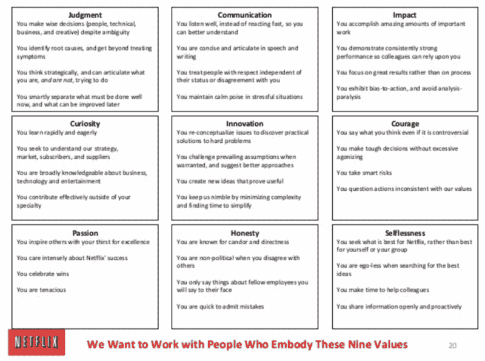
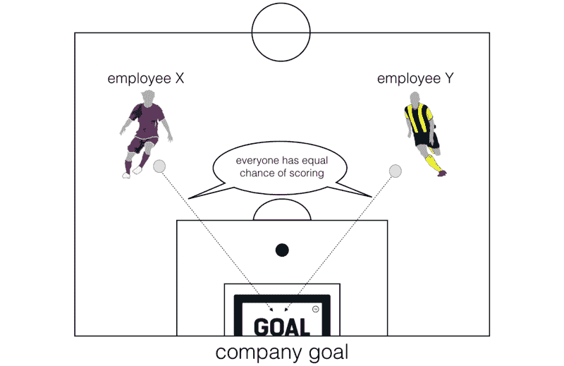
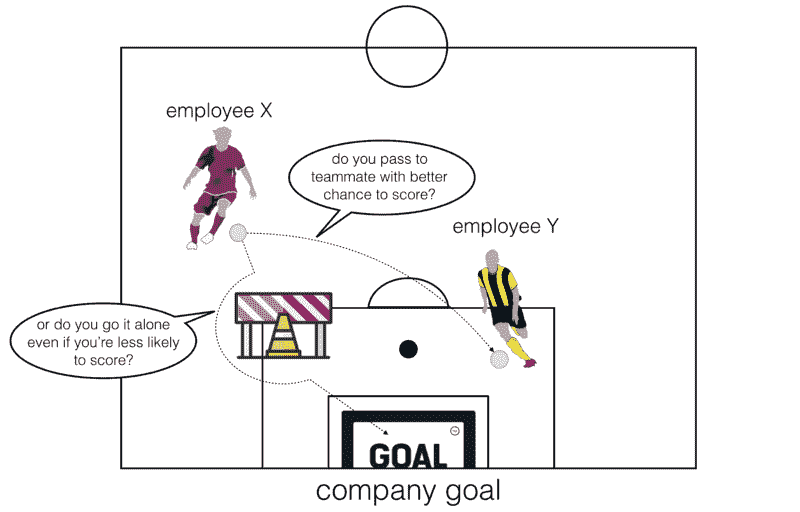
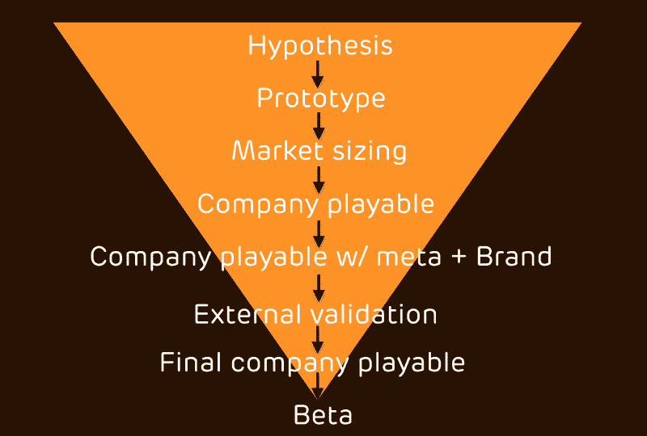

# 我从在一家令人惊叹的初创公司工作中学到的最重要的经验

> 原文：<https://www.freecodecamp.org/news/the-most-important-lessons-i-learned-from-working-at-an-amazing-startup-3a95279eea04/>

作者:崔琰

# 我从在一家令人惊叹的初创公司工作中学到的最重要的经验

Photo by [Mantas Hesthaven](https://unsplash.com/photos/_g1WdcKcV3w?utm_source=unsplash&utm_medium=referral&utm_content=creditCopyText) on [Unsplash](https://unsplash.com/search/photos/lesson?utm_source=unsplash&utm_medium=referral&utm_content=creditCopyText)

在一个成功的一年后，我最近离开了太空猿游戏公司。我学到了很多，并解决了一些[挑战性的技术难题](https://tech.spaceapegames.com/2017/10/24/tackling-scalability-challenges-in-realtime-multiplayer-games-with-akka-and-aws/)。

在我 13 年的职业生涯中，我从一家运营得最好的公司学到了七条经验。

### 定义你想要什么样的文化，并组织你自己去实现这种文化

许多公司谈论他们的文化有多伟大，但是很少有人谈论他们的文化到底是什么。更糟糕的是，我想大多数人最终会得到一种他们不想要的文化，因为这种文化在没有指导的情况下无意识地生长。

直到今天，2009 年的 [Net flix cul ture deck](https://www.slideshare.net/reed2001/culture-2009/) 仍然是你能读到的关于文化的最好的东西之一。

> 真正的公司价值是我们在员工中特别看重的行为和技能。

> —里德·哈斯廷斯

从一开始就明确你想要建立的文化。这些是我们在 Space Ape 中相互重视的特征和技能:

**激情吃**:你对游戏有激情，你想开发有趣且吸引人的游戏。

创新:你不害怕偏离常规，尝试新事物。你接受伴随创新而来的风险。你不会让失败阻止你成功。

判断:你下了明智的赌注。你可以通过对潜在回报的方法分析来平衡风险，从而做出明智的选择。

可信赖的:你是可信赖的，值得信任的。我们相信小型的自治团队。要做到这一点，我们需要能够依靠团队中的每一个人。

专注:需要时，你可以把个人项目放在一边，专注于提供最好的游戏职位。

你是你手艺的大师。你想成为最好的自己，并且总是在寻找改进的方法。

你与他人合作愉快。你愿意为了公司的更大利益而做出重大的牺牲。游戏制作是一个与生俱来的创新和创造过程。我们需要能在实验室的相对环境中茁壮成长的人。

你会因为别人是谁而欢迎他们。你平等公平地对待他人，就像你希望别人对待你一样。

**瑞特吃了** **这种视力有规律的**。我们发现，如果每隔几个月不重申一次，那么它就开始从集体意识中溜走。

确保新员工被你的愿景所感染。提醒员工他们有责任维护你的文化。

### 文化的生死取决于你雇佣和解雇的人

这种对文化的共同理解需要渗透到每一个招聘决策中。

“C *ul ture fit* ”经常被用来加强现有的偏见，尤其是当所述文化从未被预先定义时。幸运的是，在我坐过的任何一个招聘委员会中，这种情况从未发生过。当“文化契合度”作为一个问题被提出来时，你必须从你与媒体的互动中给出清晰的例子。

与此同时，你不应该雇用可能对你的文化有害的人——即使你被甲板上的另一双手所拒绝！

一个糟糕的雇佣对你的文化来说代价太大了。

创始人也是你文化的先锋。他们在远处观望，但是当他们看到危险的迹象时，他们从不害怕介入。如果一个长期雇员开始表现出自信的迹象，那么就等着公司承诺包容和公平的提醒吧。

即使你已经建立了一个伟大的文化，你也不能想当然。保持这种文化的强大是每个人的责任。

### 人是你最重要的产品

对大多数公司来说都是如此，这就是为什么投资于员工并帮助他们成长应该是一件不需要动脑筋的事情。

为每一个人提供培训，并为经理提供经理指导。结果将是非常值得的。

### 创始人需要公开、清晰、频繁地传达公司的愿景

避免印象深刻但含糊不清的陈述。模糊的目标没有明确的、可操作的目标，很难遵循和应用。当人们不理解公司的愿景时，就会产生协作。

我们的创始人在每一次季度公司会议上都宣读了公司使命。**代表**在实现目标的*共享* *中发挥了重要作用。我最近还看到 Ryan Cald beck，Cir cle Up 的首席执行官，在推特上说了同样的话。*

我们的目标是“通过拥有一个流派来打造一款顶级的手机游戏。”简单，不华丽，但容易理解。

### 诚实面对利益冲突

当经理们为他们的职责制定个人目标时，他们通常是最有意图的。每个人都有一套与公司目标一致的目标。利益冲突在哪里？

What you might think when you set out personal objectives.

然而，事情很少会如你所愿。通常情况下，有些项目会比其他项目进行得更顺利。同时，一些项目比其他项目给公司带来更多的价值。

如果这个场景听起来很熟悉，请点头。

你在 X 项目上工作，你的年终加薪、奖金和晋升希望都随着 X 项目的成功而破灭。

一个同事正在做 Y 项目，他需要你做一些事情来解除他的项目。项目 Y 对公司来说更有价值，但是帮助这个联盟意味着项目 x 的进度会损失。

你是做什么的？

你为公司做了正确的事情，帮助了这个联盟吗？在这个过程中，你可能会失去你一直努力争取的加薪、奖金和晋升。

还是把他的要求放在 back log，专注于 project X？

Hel lo，*利益冲突。*

What actually happens when employees need to collaborate with one another, and often have to sacrifice their self-interest for the greater good of the company.

如果你认为这只会发生在经营不善的公司，那你就错了。就连谷歌也不能幸免于这种利益冲突，迈克尔·林奇关于他为何离开谷歌的文章中的证据就是如此。

**团队工作需要*将 ing* sac ri 办公室。**

在足球比赛中,“团队合作者”是指愿意为团队做出贡献的人。无论是在 50 比 50 的挑战中冒着受伤的风险，还是把球传给更有可能得分的队友。

你怎么把这个传到工作的地方？你如何鼓励人们为了公司的利益而立遗嘱？

你必须首先诚实地面对这一利益冲突。

你的雇员不是圣人，他们是现实世界问题的血肉之躯。如果他们需要加薪来建立一个家庭呢？想要职业生涯有什么错？

雇员完全有权为他们最大利益行事。作为雇主，你的职责是创造一个环境，让雇员不会因为自作主张而受到惩罚。

你可以用几种方法来做这件事。

最大、最有效的方法是**对每个人的目标进行评级** **以及对绩效和薪资进行 360 度评估**。

个人目标仅用于您的个人发展。你的经理可以帮你决定哪些方面需要改进，但最终决定权在你。你已经长大了，但并不需要为每个人设定目标。

360 点评也是给你的，也是给你一个人的。您可以选择希望从谁那里获得反馈，以及如何处理收到的反馈。

反馈是匿名的，只有审阅者的经理知道是谁提供的反馈。这主要是为了防止任何不必要的不良反馈。

如果你需要他们的帮助，你的经理和创始人也会帮助你处理反馈。

绩效和工资评估是基于你的实际贡献，而不是几个月前制定的一些任意的目标。

对我们来说，这种不同寻常的工作方式始于对这种利益冲突的坦率讨论。随着时间的推移，它已经得到了验证，并将继续发展。为一家不仅认识到问题，而且积极寻求解决问题的公司工作，对我来说是一股清新的空气。

### 将创造力与所有权结合起来

使用游戏堵塞和黑客马拉松从整个公司中发掘创造力。但是请记住，创造力需要被引导，假设需要被检验。

我们使用创意漏斗来引导想法从假设到生产。

游戏 jams gen er 吃点子喂漏斗顶端。每个人都可以想出新游戏的点子。你有**自己的船**和**的责任**来宣传你的想法并把它推销给公司的其他人。

团队围绕着他们感到兴奋并认为可能是最棒的想法形成。这不是一个自上而下的决定。

创始人在那里提供指导和帮助。虽然你的想法可能很棒，但创始人可以指导你根据你的理想来改变想法。

这是一个很容易建立的经济名字吗？

市场竞争是什么样的？这种类型已经被高质量的作品所接受了吗？这种类型有巨大的潜力吗？

我们有建造它的技术经验吗？如果不是，雇用有这方面经验的人有多难？

围绕一个想法形成的团队专注于对这个想法的论证和尝试。这个想法变成了一个可玩的游戏，然后公司的其他人开始玩并提供反馈。

这个团队拥有这个想法，如果他们不再相信这个想法，他们就被委托做出继续下去或者取消这个想法的决定。同样，**这不是自上而下的决策—** 决策是在团队内部做出的。

这就引出了下一点。

### 认识到创造力需要错误

**创新需要失败才能成功**。

创新和尝试新想法意味着承担风险。如果你不冒险，你就不会大获全胜——至少在没有既定的特许经营权所带来的市场和品牌的情况下不会。

让团队承担风险，并相信他们会代表公司做出正确的决策，并杀死一个打字高手，这很难。

要做到这一点，你需要一个雇员不会因为做出牺牲而受到惩罚的环境。

我们通过为工作创造安全网来做到这一点。

你的工作并不局限于打字。如果一个团队决定放弃它的想法，那么这个团队的成员会转移到其他游戏团队，或者他们会留在一起，亲打另一个游戏想法。

为了证明这种方法在我们的规模之外有效，con sid er *Super cell* 和 *Clash Royale* 。《T4》背后的团队在想出这个主意之前一直在想另一个主意。这个想法在测试版中得到了很好的测试，它有很好的保留和监控统计。但它并不伟大，肯定比不上《部落冲突》。

这个团队决定取消这个想法，因为他们相信他们可以做得更好。所以他们从之前的游戏中吸取了经验，进一步探讨了这些想法，并创造了皇家冲突。

倪泽先生:人民和他们的才智是你最大的财富。雇佣并留住优秀的员工，而不是雇佣并留住特定的职位。

### 结论

所以你有它。我在*太空猿游戏*中学到的七件事。

对我来说最突出的是，一家公司需要有一个明确的身份——它需要知道自己想成为什么样的人，它需要组织倪泽自己成为那样的公司。

虽然我喜欢小型自治团队的精神和扁平的层级结构，但它也有不好的一面:在我职业生涯的这个阶段，我习惯于承担广泛的责任，我渴望这样。

随着时间流逝，我感到对更多责任的渴望又回来了。当我的老朋友布鲁诺·塔瓦雷斯向我提出加入 ing *DAZN* 为他们正在做的伟大事业工作时，我很难拒绝

怀着沉重的心情，这是我给太空猿人运动会和在场的伟大人们的告别信。你们太棒了！我希望我在那里学到的经验也能帮助其他人。