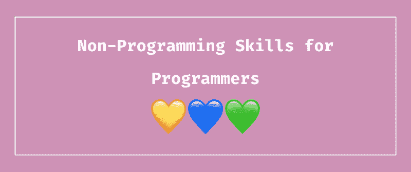

# 程序员最重要的非编程技能

> 原文：<https://www.freecodecamp.org/news/the-most-important-non-programming-skills-for-programmers-d39fadc1a0fa/>

作者:阿里·斯皮特尔

# 程序员最重要的非编程技能

当我想到我想作为一名程序员一起工作的人时，我会更多地考虑使某人成为一名好同事的非技术技能，而不是技术技能。

事实上，这篇文章中的所有技能都有助于编写改善技术项目的优秀代码。它们中的大多数对编程之外的职业也很有帮助，但是我将重点讨论为什么它们对程序员特别有用。

### 神入

要打造一个伟大的产品，你必须设身处地为用户着想。他们会如何使用你的产品？哪些功能会对他们有帮助？你的项目如何帮助他们或改善他们的生活？反过来说，它会如何伤害他们或对他们的生活产生负面影响？你的申请有什么道德含义？

同理心对你的许多程序来说是必不可少的。如果它们不安全，那么您的用户信息可能会被第三方负面使用。

如果它们不可访问，那么您就限制了可以使用您的项目的人数。如果它们运行缓慢或需要大量的带宽来运行，那么用户就会离开，互联网速度慢的地区的人或移动用户将无法运行它们。

似乎每天都有一篇文章披露某家公司实施了一些有害的算法，比如 [YouTube 算法激进化了 alt-right](https://www.theguardian.com/media/2018/sep/18/report-youtubes-alternative-influence-network-breeds-rightwing-radicalisation) 、[亚马逊创造了一种性别歧视的招聘算法(他们最终没有使用)](https://www.inc.com/guadalupe-gonzalez/amazon-artificial-intelligence-ai-hiring-tool-hr.html)，或者[人工智能误导黑人女性](https://www.youtube.com/watch?v=QxuyfWoVV98)。当你写代码的时候，想想每一个人！

此外，同理心有助于成为团队成员和导师。设身处地为你的经理或其他开发人员着想。他们为什么要做决定？你能做些什么来帮助他们？拥有同理心一定会提高你成为一个有效的队友的能力。如果你是一名雇主，你可以更长时间地留住你的员工，如果你表现出同理心，他们会更有效率。

对其他程序员要有耐心，尤其是那些正在学习新事物的程序员。提醒自己一些对你来说很难学的东西，以及那种感觉。他们可能有类似的感觉。对他们无礼，削弱他们的进步，或者迂腐只会对他们有害，并使他们的进程更加艰难。

你的言语和行为会产生真正的后果——你可以用它来做出积极的改变或伤害他人。这不仅仅是面对面的交流，在线交流也很重要。你可能认为你很有趣或者只是在发泄情绪，但是你可能实际上对某人的生活造成了非常负面的影响。如果你伤害了某人，如何道歉来弥补伤害，这取决于你自己。

### 问题解决

当我教人们编码时，我看到更多的人在为解决问题而奋斗，而不是代码本身。将一个问题分解成小问题，然后解决所有这些小问题的能力需要大量的练习。善于解决问题可以帮助你成为一名更强的程序员。

此外，对于大多数问题，将有一个以上的解决方案。作为软件开发人员，我们工作的很大一部分是考虑这些不同的解决方案，并选择最好的一个。一个实现起来更快吗？还是运行效率更高？还是会便宜一点？所有这些都是重要的问题，选择正确的解决方案是软件开发中具有挑战性但又重要的部分。

### 合作

你很有可能作为一名程序员和其他人一起工作。即使你是自由职业者或企业家，你也必须与其他开发人员、商业人士、经理、开源贡献者、利益相关者和无数其他人一起工作。学会如何与不同的人和他们的性格很好地合作是至关重要的。

有很多事情有助于良好的合作。首先是知道一个人不可能做所有的事情，或者至少做好所有的事情。不同的人有不同的技能、观点和人生经历，结合起来比孤立起来更有力量。不要觉得你总是需要“把团队放在你的背上”或成为每个人的一切。如果你允许其他人也做出贡献，你会变得更好。

向别人寻求帮助，并愿意帮助别人作为回报。你不需要成为所有事情的专家，不同的人会成为不同事情的专家。依靠他人，如果你在某件事上遇到困难，一定要寻求帮助，这样你就不会被困太久。

当有人向你求助时，要乐意帮助他们。通过很好地解释事情，你可以学到很多东西，你将能够巩固你对该主题的知识。如果你在管理岗位上，确保给人们时间进行指导和有效的合作！

同样的，不要谈论别人或马上否定他们的观点。如果他们的意见不被重视或考虑，他们将来可能不太可能做出贡献。

当人们分享他们的想法时，积极倾听——不要在他们说话时考虑你的回应或为什么你的想法更好，而是试着想想为什么他们的方法也很好或如何实施。

然后，一旦你实现了他们令人敬畏的想法，就给予他们信任。作为一名员工，没有什么比在一个我的想法被团队中的其他人驳回、低估和不信任的团队中更让我效率降低了。

### 沟通

当你与其他人一起工作时，无论这些人是同事、客户、使用你的项目的人、经理还是你管理的人，良好的沟通都是至关重要的。诚实而友好地给出事情进展的最新信息，项目目前的进展情况，以及你对事情的看法。如果你粗鲁或没有建设性，人们会不太容易接受反馈。但是，如果你不诚实或粉饰真相，那么你可能看不到积极的变化。这里绝对有一条细线。

我生活中的一个真实例子:有人看了我的一篇博客后写了一封很长的信，说我的语气听起来有多蠢。我通常会使用很多感叹号，并试图让我的帖子听起来令人兴奋——这是非常有意的，试图让可能令人生畏或无聊的话题变得更有趣。这个人在这封邮件中非常性别歧视，说了一些非常伤人的话。也就是说，我可能会减少感叹号的数量，但仍然会让人们对编程感到兴奋。如果这个人的批评更有建设性，我会更容易接受这一点。

如果事情进展不顺利，一定要说出来。诚实地承认需要推迟截止日期，或者工作中有些事情不顺利。如果你说出来，你会有更好的机会去改变它，让环境变得更好。

### 包容性

我曾经在一个夏令营做过攀岩教练和辅导员，接触最多的年龄段是中学女生。他们是我曾经共事过的最喜欢的人。但是，也就是说，中学生通常不是最能接受差异或反对小团体的人。

我们曾经运行一个游戏，我们在一个大圈子里开始，然后一个顾问会告诉人们他们“在圈子之外”，他们将不得不基于一些他们不知道和无法控制的特征离开游戏。仍在圈内的人会玩一个游戏，圈外的人被排除在外，只能远远地看着。

这个活动非常有效地向这些女孩展示了由于你无法控制的原因而被排除在外是什么感觉，我现在仍然时常回想起这件事。作为成年人，我们仍然将人们排除在圈子之外，并基于他们控制之外的某些特征将他们排除在外。但是，如果我们让他们回到圈子里，让他们做出贡献，那么我们的产品就会吸引更多不同的体验，变得更好。

**有很多研究表明多元化的团队表现更好。但是站在个人的角度，想想被排除在圈子之外是什么感觉，努力让自己的圈子变大，而不是变小。**

很有可能，你的很多用户可能是传统上被排除在技术圈子之外的人。从我自己的经历来看，我可以告诉你，作为一个团队中唯一像你这样的人真的很难，因为在我的编程生涯中，有大约 5%的时间我都和另一个女人在一个团队中。

这也与同理心有关——确保你的程序是为各种各样的用户设计的。不仅仅是身体健全的人或拥有尖端互联网或技术的人。你将能够接触到更多的人。

### 耐心

当你编程时，你需要耐心对待的第一个人是你自己。编程很难，有时你会遇到一些错误或困难的问题需要克服。如果它总是很容易，那么你就没有挑战自己，你也没有成长为一名程序员。

有毅力坚持解决问题，并且在困难的时候不放弃。但是，也要知道你可以休息一下，过一会儿再回到这个问题上来。也许休息一会儿会帮助你更有效地解决问题，或者当你回来的时候用不同的眼光看待它。

此外，对其他人要有耐心。事情需要一段时间来学习，人也不是完美的。犯错和失败可能是学习过程中最重要的经历，所以要考虑到这一点，而不是创造一个冒险或成长不安全的环境。理解不同的事情对不同的人更容易产生共鸣，知道学习需要一段时间。

### 创造力

作为一名程序员，我最喜欢的一点是，我可以用我的创造力去创造一些其他人可以从中受益的东西。你可以跳出框框去思考，去创造真正酷的东西。

有创造性的想法对于想出新的功能、界面和应用程序是很重要的。我让某人购买了我为一家公司开发的产品的许可证，这在很大程度上是因为它的创造性界面，我的[作品集网站](https://alispit.tel/)也因为它的创造性而受到关注。

除此之外，很多问题需要创造力来解决。几乎每个编程问题都有不止一个解决方案，想出创造性的方法来解决它们通常会导致优化的解决方案。

### 谦逊

你可以从其他程序员那里学到很多东西——一个人不可能知道代码世界中的所有事情或与之相近的任何事情。接受建设性的批评，而不是防御性的。你可以从反馈中改进你的代码和你自己，而固步自封不会带来成长。你并不总是对的，你应该接受别人的观点。

### 信心

另一方面，也要自信。我承认，对我这样一个有很多骗子综合症的人来说，这可能是最困难的一个，在我职业生涯中的每一次绩效评估中，提高自己的绩效一直是我的首要任务。我可以(很可能会)单独就这个话题写一整篇博文，但是相信自己，对自己的能力有信心真的很重要。

首先，要有信心你能承担项目。当你被分配到困难的事情时，不要把自己降级到更容易的项目或怀疑自己。尽你所能解决它，然后寻求帮助度过最困难的部分。

此外，不要觉得有必要把研究一切作为第一手段。在谷歌搜索答案之前，相信自己会尝试一些事情。或者谷歌一下问题的一部分而不是全部。如果你做的一切都是正确的，那么在开发过程中尝试一些东西，看看它们是否有效，不会有任何伤害。你可能会对自己知道的东西感到惊讶。

我做的另一件事是记录我的胜利。我电脑里有一个文档，里面有我做过的很酷的事情，以及人们对我的好评。当我度过了艰难的一天或怀疑自己时，我会回到过去，通常会对自己正在做的事情更有信心。

### 适应性

编程仍然是一个新世界，而且发展速度非常快。当事情发生变化时，能够适应是至关重要的。当一个新的框架、库或语言出现时，能够学习它是很重要的(当然是在合理的范围内)。如果我们都还在用 Fortran 写代码，我们的行业看起来会有很大的不同。当事情发生变化时，我们需要能够进化和适应。

此外，项目的目标和特性经常会改变，尤其是客户工作。当这种情况发生时，我们必须适应并合并这些请求(同样，在合理的范围内)。

### 社区参与

社区对编程非常重要——会议、博客帖子、社交媒体和聚会对学习和成长非常重要。此外，开源软件和围绕它们的社区是这个行业的命脉。能够与人交流和联系对于教育、分享你的经历和寻找新的机会是非常重要的。

即使你是一个内向的人或者不喜欢面对面的社交，也有很多很棒的在线社区可以让你学到很多东西。而且，即使在公司内部，拥有一个紧密团结的团队也有助于人们更好地合作。

### 结论

这些技能通常被称为“软技能”，但我觉得这是一种简化。这些技能对编写代码和成为一名好同事都有很大帮助。它们比了解特定的语言、库或框架重要得多，甚至远远超出了技术范畴。

作为程序员和普通人，所有这些技能都非常重要。也就是说，没有人是完美的，每个人都有成长的空间。所以继续成长，努力一小步一小步地提高这些非编程技能，我也会的！

### 保持联络

*   [推特](https://twitter.com/aspittel)
*   [简讯](https://mailchi.mp/b4216331e284/zen-of-programming)
*   [GitHub](https://github.com/aspittel)

*最初发布于[开发至](https://dev.to/aspittel/the-most-important-non-programming-skills-for-programmers-iii)。*