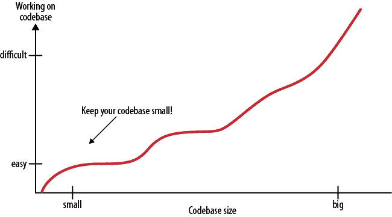

# 程序员能学到的最重要的技能

> 原文：<https://www.freecodecamp.org/news/the-most-important-skill-a-programmer-can-learn-9d410c786baf/>

**不，不，不，不，不，不，不**

一个大大的不。就这么清楚。

你所要做的就是把这两个字母放在一起，说出这个单词。

现在，让我们一起说。不不。

好的开始。

但是等一下。什么时候对什么说不？

嗯，这是大多数程序员(甚至是资深程序员)容易混淆的重要一点。

作为程序员，写代码是你工作中最大的部分。在您的编程生涯中，您将不得不处理不同种类的代码请求。每个要求都会迫使你做出艰难的决定。一切都没问题。这没什么不对。这就是大家对你这个程序员的期望:写代码。然而，这里有一个问题:你应该写所有要求你写的代码吗？

这个问题让我们想到了程序员可以学习的最重要的技能:

> 知道什么时候不编码可能是程序员可以学习的最重要的技能。— [可读代码的艺术](https://www.amazon.com/Art-Readable-Code-Practical-Techniques/dp/0596802293)

我完全同意。这是为什么呢？

编程是解决问题的艺术。所以很自然，程序员是问题的解决者。作为程序员，当我们面前有一个新问题需要解决，或者任何其他原因需要我们写代码时，我们会很兴奋。

这没关系，因为我们是程序员。我们喜欢写代码。

然而，对编写代码过于兴奋会让我们变得盲目。它使我们忽略了一些重要的事实，这些事实会导致我们将来不得不处理的更大的问题。

那么，那些我们容易忽视的重要事实是什么呢？

你写的每一行代码都是:

*   其他程序员必须阅读和理解的代码
*   必须测试和调试的代码
*   会增加软件缺陷的代码
*   将来可能会引入新错误的代码

正如里奇·斯克伦塔所写的，[代码是我们的敌人](http://www.skrenta.com/2007/05/code_is_our_enemy.html):

> 代码是坏的。它腐烂了。它需要定期维护。它有需要被发现的错误。新的特性意味着旧的代码必须被修改。
> 
> 代码越多，bug 藏身的地方就越多。签出或编译花费的时间越长。新员工理解你的系统需要的时间越长。如果你不得不重构，会有更多的东西需要移动。
> 
> 再者，更多的代码往往意味着更少的灵活性和功能性。这是违反直觉的，但是很多时候，一个简单、优雅的解决方案比一个不太有天赋的程序员编写的一堆代码更快、更通用。
> 的
> 代码是由工程师制作的。制造更多的代码需要更多的工程师。工程师有 n 个通信成本，他们添加到系统中的所有代码，在扩展其功能的同时，也增加了一篮子成本。

太真实了，不是吗？用他们的生产力和编码心态激励你的程序员是那些知道什么时候说不，什么时候不编码的人。易于维护、持续时间长并不断帮助用户的软件是不包含任何不必要的代码行的软件。

> 最好的代码是根本没有代码，最有效的程序员是知道什么时候不编码的人。

### 你怎么知道什么时候不编码？

当你在做一个项目时，想到所有你想实现的很酷的特性，兴奋是很自然的。但是程序员倾向于高估他们的项目需要多少特性。许多功能没有完成或没有使用，或者只是使应用程序过于复杂。你应该知道什么对你的项目是必不可少的，以避免犯这个错误。

> 理解软件的用途及其核心定义是知道何时不编码的第一步。

我给你举个例子。假设你的软件只有一个目的:管理电子邮件。为此，发送和接收电子邮件是你的项目的两个基本功能。你不能指望这个软件也能管理你的待办事项列表，对吧？

所以你应该拒绝任何与这个定义无关的可能的特性请求。这是你可以确切地知道什么时候不写代码的时刻。

> 永远不要扩展你的软件的用途。

一旦你知道什么对你的项目是必不可少的，下次当你评估可能的代码请求时，你就会有意识了。你将确切地知道你写代码的需求。应该实现哪个功能？哪个代码值得写？你会质疑一切，因为你会确切地知道不必要的代码会如何扼杀你的项目。

> 知道什么时候不编码可以保持你的代码基数小。

[The Art Of Readable Code](https://www.amazon.com/Art-Readable-Code-Practical-Techniques/dp/0596802293)

当您开始项目时，只有两三个源文件。一切看起来如此简单。编译和运行代码只需要几秒钟。你知道在哪里可以找到你想要的东西。

然后，随着项目的增长，越来越多的源文件填满了您的目录。每个代码文件包含数百行代码。要组织它们，你很快就需要多个目录。记住哪个函数调用其他函数更加困难，跟踪 bug 需要更多的工作。管理你的项目变得困难，你需要更多的程序员来帮助。[通信开销](https://en.wikipedia.org/w/index.php?title=Communication_overhead&action=edit&redlink=1)随着程序员数量的增加而增加。你变得越来越慢。

最终，项目变得巨大。添加新功能是痛苦的。即使是小小的改变也需要几个小时。修复现有的错误总是会引入新的错误。你开始错过最后期限。

现在，生活对你来说是一场斗争。为什么？

因为你不知道什么时候不编码，所以你对每一个可能的特性请求都说好。你瞎了。编写新的代码会导致你忽略重要的事实。

就像恐怖电影一样，对吧？

如果你一直对所有的事情都说好，这就是会发生的事情。确切地知道什么时候不编码。从项目中删除所有不必要的代码。这会让你的生活更轻松，让你的软件更耐用。

> 我最有效率的一天是扔掉了 1000 行代码。—肯·汤普森

我知道知道什么时候不编码是很难的。即使是高级程序员。也许我在这篇文章里写的东西对于初级程序员来说很难理解，那也没关系，可以理解。

我知道你刚刚开始你的编程之旅，你想写代码。你对此很兴奋。这很好。永远不要失去这种兴奋，但也永远不要忽视重要的事实。我们通过犯自己的错误来学习。你也会犯错误，你也会从中吸取教训。但如果你能从我们的经验中吸取教训，至少你可以更加清醒。

> 坚持编码，但要知道何时对编码说不。

*最初发表于[http://huseyinpolatyuruk.com](http://huseyinpolatyuruk.com/the-most-important-skill-a-programmer-can-learn)。*