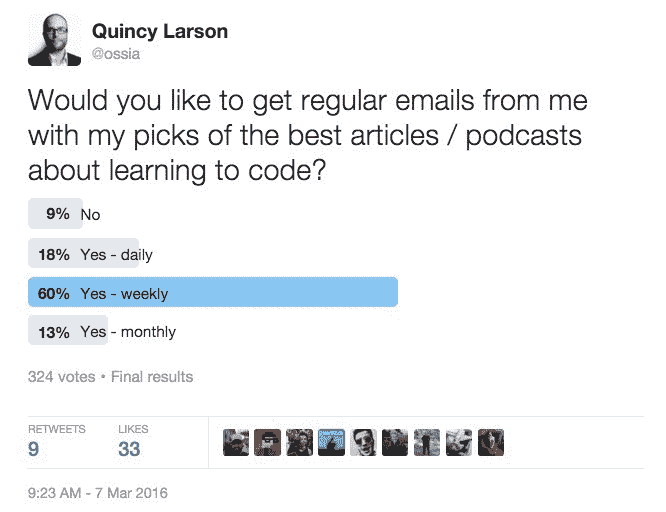

# 这一周我读过的最有趣的东西

> 原文：<https://www.freecodecamp.org/news/the-most-interesting-thing-i-ve-read-all-week-dd251d866ce5/>

和你们许多人一样，我也是媒体的贪婪消费者。我狼吞虎咽。技术书籍、博客文章、播客、纪录片——它们都是我的顶级捕食者信息食谱的一部分。

和你们中的许多人一样，我太忙了，没时间去参加那些烧烤、科技会议，以及在沙漠中长达一周的嬉戏，在那里人们通常会讨论他们接触到的所有这些想法。

相反，这些想法最终大多在我的脑海里跳跃，偶尔在我实时编码或与地球另一端的人结对编程时涌出。

但是，除了对碰巧在声音频道另一端的人进行肥皂拳击之外，我如何才能将这些多余的见解转化为对他人有用的东西呢？

我已经在努力传播科技知识了。每个月，我们的[开源社区](http://www.freecodecamp.com)都会吸引超过 200，000 名开发人员和培训中的开发人员。除了他们一起完成的以激光为重点的课程，我们的社区还产生了一个“扩展的知识宇宙”——在我们的媒体出版物上，在像 [Twitch.tv](http://twitch.tv/freecodecamp) 和 [Reddit](https://www.reddit.com/r/freecodecamp) 这样的平台上。

那么为什么不就此打住呢？

好吧，尽管所有这些交流方式都变得如此复杂，但仍然有一个我们几乎每天都在使用的可靠工具:电子邮件。

所以我问你们(好吧，你们所有 324 个那天碰巧在推特上的人):

你们中 91%的人说，你们愿意定期收到我的电子邮件，里面有我挑选的关于学习编码的最佳文章和播客。

所以如果你同意的话，我打算每周二给你发一封简单明了的电子邮件，里面有一些链接。这些链接会带你去一些我认为值得你花时间的文章、视频或播客。

如果不想要，可以一键退订。不会伤害我的感情。

或者你可以阅读它们。

或者你干脆忽略它们，直到有一天你奇迹般地有足够的时间去读几本。

如果你愿意，你甚至可以回复这些邮件。我会阅读并回复。

我会在 Reddit 上交叉发布这些链接，在那里我们可以作为一个社区来讨论它们。

如果你之前已经注册了免费代码营，你会收到这样一封邮件:

> *科目:AlphaGo a-go 围棋*

> 这是我的新邮件的第一版，旨在扩展你对编程和技术的理解。每周，我会给你发三个值得你花时间的链接。

> 你收到这封邮件是因为你在某个时候注册了免费代码营。如果不想这样，可以在这封邮件底部一键退订。

> 以下是本周值得你花时间去做的三个环节:

> *1。了解密码学的历史及其与国家安全的关系:[http://bit.ly/1pjvFNr](http://bit.ly/1pjvFNr)*

> *2。DropBox 将数 Pb 的数据从亚马逊的云中转移到了他们自己的数据中心。本文探究了云和所涉及的海量数据:[http://bit.ly/1LmC2tV](http://bit.ly/1LmC2tV)*

> *3。深度学习摧毁人工智能难题的战争之路还在继续。谷歌的 AlphaGo 已经在四局比赛中击败了围棋世界冠军，决赛将于周二晚上举行。下面是 AlphaGo 团队的一名工程师谈论他们的人工智能如何赢得比赛的片段:[http://bit.ly/1TIUT52](http://bit.ly/1TIUT52)*

> *Bonus: Inc 杂志发表了我的《为什么和机器说话是本世纪你能学到的最有价值的技能》:[http://bit.ly/22etFbp](http://bit.ly/22etFbp)*

> *快乐编码，*

> 昆西·拉森

> *老师在[http://www.FreeCodeCamp.com](http://www.FreeCodeCamp.com)*

我欢迎你在评论区对我的新每周邮件有任何想法。

*如果您喜欢，请点击？下面。关注我和免费代码营，获取更多关于技术的文章。*

