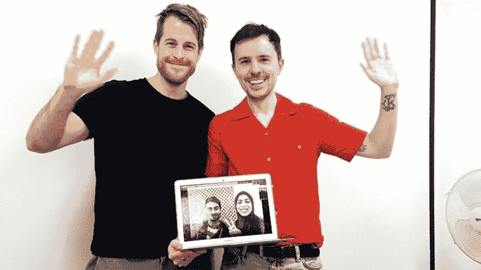
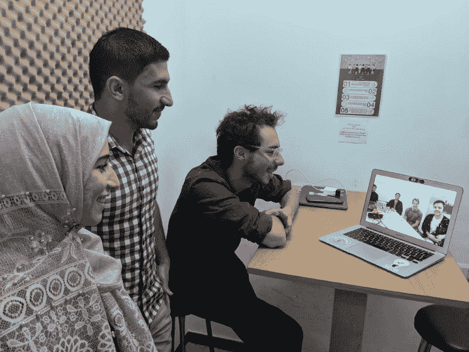
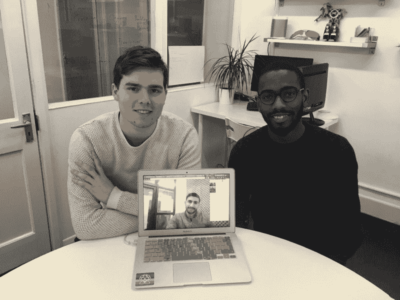
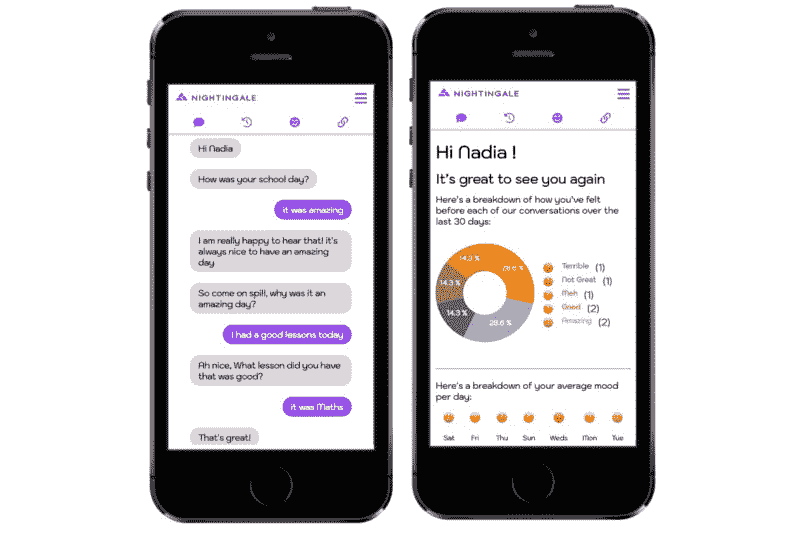

# “最国际化的微机构:”两个伦敦训练营的毕业生如何建立一个远程…

> 原文：<https://www.freecodecamp.org/news/the-most-international-micro-agency-how-two-london-bootcamp-graduates-built-a-remote-3eeda0be1b2a/>

丽贝卡·帕丁

# “最国际化的微型机构:”两个伦敦训练营的毕业生如何与加沙的软件工程师建立远程合作

#### 采访乔·弗列尔和西蒙·杜普利，创始人项目的第一对参与者，创始人和程序员社会影响研究生奖学金

当我第一次与乔·弗列尔和西蒙·杜普利坐下来讨论他们在创始人项目上的经历时，这让我想起了阿图尔·加万德在《纽约客》上发表的文章“[牛仔和维修站工作人员](https://www.newyorker.com/news/news-desk/cowboys-and-pit-crews)”，他在文章中探讨了医生的传统牛仔角色，以及他认为更有必要围绕医疗问题组建的团队。

从某种程度上来说，Joe 和 Simon 是两个成功的专业人士，他们通过与加沙的开发人员合作的经历，学会了加入“维修队”需要做些什么——跨越地理、语言和政治边界进行有效的合作。

Simon (left) and Joe (right) online with Ismail and Hansen in Gaza

#### 什么是创始人计划？

> ***"*** *创始人方案提供了一个创建自由职业组合的平台，并提供了与加沙的开发商一起从事具有社会和环境意识的项目的机会。这几乎是一个我无法放弃的机会！”* —西蒙·杜普利

**Rebecca:** 你在 2018 年 10 月毕业于伦敦的编码训练营[创始人和程序员](http://www.foundersandcoders.com)之前在做什么？

**Joe:** 最近，我经营了一家社交媒体营销公司，将有影响力的人与品牌联系起来；在此之前，我在一家儿童媒体品牌工作。

我当时住在柏林，在柏林大学从事农学和环境数据科学的研究。

丽贝卡:既然有这么有趣的职业，为什么要转行做网络开发呢？

**Joe:** 我所有的角色都非常关注数字和构建事物——最近我负责监督一个平台的开发，该平台使品牌能够识别、衡量和管理影响者——这意味着我要花大量时间管理数字项目并与开发人员合作。我发现这既有益又令人沮丧。这是值得的，因为它激起了我对 web 开发的好奇心，我开始自学编程。令人沮丧，因为我依赖的人不一定像我一样对想法投入，我只是真的希望能够自己做东西！

与此同时，我的工作重点是吸引年轻人，我亲眼目睹了技术的发展——最终在道德上是中立的——是如何远远超过监管的。我越来越担心公司没有对他们的社会影响负责，并决定我想做一名开发人员，专注于具有积极社会影响的项目。创始人和程序员是这些东西的惊人结合，我很高兴被这个项目录取。

**Simon:** 和 Joe 一样，我最初是在与一个开发团队一起从事一些数据科学工作时，开始兼职编写代码的，对我来说，是一点 Python。我心想，哇，开发者的思维方式有这么大的自由度，真是疯狂！你只要给他们带来想法，他们就能从零开始创造东西。我想做更多那样的事。

丽贝卡:用你自己的话来说，“创始人计划”到底是什么

**Simon:**Founders program 是一个机会，让一对来自 Founders and Coders 的毕业生(加沙代码学院的毕业生)与加沙的开发人员合作，为非营利组织和社会企业家开展公益项目。开发人员赚取少量的津贴，同时建立一个自由职业组合，为他们提供一个建立自己的机构或社会影响创业公司的跑道。

丽贝卡:你们每个人为什么要申请这个项目？

Joe: 我知道我想利用我作为一名开发人员的技能对社会产生影响，但我认为在我为商业公司工作之前，我负担不起这笔费用。因此，当创始人项目出现时，我抓住了这个机会，快速实现了进入影响导向型工作的愿望。

创始人项目是我们通过 Tech for Better 在训练营开展的客户项目的延续。我非常投入地争取客户，我对这些非营利组织和社会企业家给这个领域带来的各种问题非常感兴趣。

西蒙:我一直梦想有独立工作的自由，所以在整个课程中，我一直在纠结是做一份全职工作还是从事自由职业。当我遇到一些以前的同事分享他们自由职业的成功经验时，我知道这就是我想做的。

#### 乔和西蒙合作

> “前几天有人问我，如果我和很多其他人一起，我会不会这么做，我说可能不会。面对如此陡峭的学习曲线，你需要一个可以托付终身的伙伴！” —西蒙·杜普利

Ramy and Marwa with Max Gerber (a Founders and Coders alumnus who was visiting Gaza to mentor on the Code Academy); Joe, Simon, and Elysabeth, the Connect 5 product owner, are online in London

丽贝卡:你是什么时候意识到想要一起工作的？

Joe: 如果当有人使用德语键盘时你还在配对，这是一个好迹象，表明你很擅长配对！

当我们都加入这个项目时，尽管我们是单独申请的，但我们明确表示希望一起工作。我们甚至一起开发我们的应用程序。根据我们的反馈,“创始人和程序员”对项目进行了调整，现在人们成对申请。

西蒙:前几天有人问我，如果我和许多其他人一起，我会不会这样做，我说可能不会。面对如此陡峭的学习曲线，你需要一个可以托付终身的伙伴！

乔:是的。创始人和编码员的经历已经很紧张了。我们 16 个人在一个很热的房间里(臭名昭著的 2018 年夏天！)不断学习所有这些新事物，一起建造东西，对找工作感到紧张，不确定我们的生活在做什么！然后在创始人项目中，就只剩下我们两个人了，与加沙的开发者远程合作。可以肯定地说，从一开始，知道我们会相处得很好对我来说就很重要。

丽贝卡:那你是怎么做到的？

西蒙:首先，我们已经成为好朋友，除了编程之外，我们还有共同的兴趣。重要的是要有别的话题可谈:就我们而言，我们都在兼职创作音乐。

我们的技术水平也大致相同。虽然我们有不同的长处和短处，但我们一起解决问题。以我的经验来看，如果你的编码伙伴更高级，那就没那么好了。

乔:老实说，我们有过矛盾。但是即使我们有几次感到压力，我们也善于读懂对方，给对方空间。

起初，有一点 FOMO(害怕错过)，我们觉得我们必须了解每件事的每一部分。但在某些时候，这变得不那么重要了，这很有帮助。我们两个都变得更善于制定策略，把精力放在哪里，这样我们就可以更独立地工作，同时仍然能够配对。因此，事情逐渐变得不那么紧张了。

#### 维修人员

> 很快就清楚了，作为一个远程团队，我们的生死取决于我们对敏捷过程的坚持 —乔·弗列尔

Aaron and George, co-founders of Nightingale, online with Ramy in Gaza.

丽贝卡:告诉我你所说的“创始人的双重使命项目”

Joe: 第一部分是关于为非营利组织提供解决方案，否则这些组织将没有资源进行数字服务开发。

第二部分是为加沙的开发商提供就业机会。在伦敦找到一份好的自由职业已经够难的了，但当你在远离加沙的地方工作时，这种困难是难以想象的。这是关于让伦敦开发者适应与加沙开发者合作，而不是作为一个外包池，而是作为合作者。

**Simon:** 我也希望 Founders 计划能够加强创始人和程序员与加沙天空极客之间的联系。除非你是少数几个去过那里的导师之一，否则加沙代码学院是幻灯片上很酷的东西。创始人项目的惊人之处在于，我们有机会与加沙人民交朋友，尽管我们没有亲自去过加沙。

乔:别误会，我们很想去，而且我们希望很快就能去。但是这些遥远的关系本身就很重要。

Rebecca: 告诉我更多关于在加沙与开发人员一起在远程团队工作的信息。创始人项目期间的设置是怎样的？

**Simon:** 我们四人一组工作，所以在每个项目中，Joe 和我与加沙的不同开发人员合作。在四个客户项目的过程中，我们与 Ramy、Asala、Haneen、Ismail 和 Marwa 合作。这是一次真正的旅程——激动人心，硕果累累，有时令人不知所措，总是紧张激烈。建立一个完善的远程工作流程的过程并不总是容易的，但是我们已经学到了很多。

丽贝卡:到目前为止，你学到的最重要的经验是什么？

乔:第一，流程非常重要。我们在训练营中学到了最佳实践——敏捷、编写适当的 GitHub 问题、scrum。但是，当和你一起工作的人就在笔记本电脑的另一边，而且你很了解他们，并且已经一起工作了三个月的时候，你很容易陷入对最佳实践的口头承诺。

在我们的远程团队中，我们不仅工作时间不同(伦敦和加沙之间有两个小时的时差)，而且在一周的不同日子工作(他们在周日至周四工作，而不是我们的周一至 Fri)。所以一周有两天我们不重叠。然后我们就有了语言障碍。他们的英语很棒，但我们仍然有误解。

很快就清楚了，作为一个远程团队，我们的生死取决于我们对敏捷过程的坚持。

西蒙:在我们的第一个项目中，我们经历了艰难的过程。我们没有足够好地跟踪我们的过程，没有很好地规划范围，没有使用 GitHub 合理地规划项目，等等。在与客户见面之前，我们也没有计划足够的时间去了解加沙的开发商。花时间互相了解是如此重要的一部分，有利于和谐的工作流程。

乔:很有意思。我只是在查看我们的技术，寻找更好的学生项目，并注意到我们如何偶尔使用标签，以及我们如何不经常写出完整的问题。在那种情况下，这绝对没问题。但是，如果我们和我们在加沙的伙伴做同样的事情，我就不知道 Ramy 周日在做什么，所以我可能会以同样的代码结束工作；或者我会停滞不前，因为拉米不知道什么是好的工作，不能找到我们。

不用说，远程团队的自由职业者让我们成为了敏捷过程的忠实拥护者。

有时敏捷被认为是一种以用户和产品所有者为中心的方式，这当然很重要，但是我们知道敏捷过程对团队和用户同样重要。敏捷涉及团队中的每个人，并为我们每个人提供角色。这是一个来回弹跳的球。

丽贝卡:给我介绍一下你当前流程中最重要的部分。

西蒙:如果我们和一对新人一起工作，我们会抽出时间让所有的开发人员互相了解。然后，我们将用户故事定义为人们可以独立解决的离散问题。

**Joe:** 从周一到周四，我们每天都通过 Google Hangouts 进行面对面的交流，这对发展与加沙开发者的个人关系大有帮助。我们很快意识到，即使有伟大的过程，事情仍然会出错，所以你需要有一个信任的基础，这样人们就不会把错误放在心上。加沙的开发人员对客户来说感觉像是“遥远的”人，他们可能担心错过了一些对话，并担心他们没有意识到一些事情。

例如，在我们的一个项目中，产品负责人一直在改变范围，我们在加沙的合作伙伴认为我们可能更清楚发生了什么，但实际上我们也不知道！他们可能认为我们与客户进行了更多的对话，这是完全可以理解的。我们有责任确保所有这些对话都在 GitHub 中记录下来，这样他们就不会担心错过了。

西蒙:重要提示:缺乏沟通绝对会扼杀项目。

#### 最国际化的微型机构

> “我们都可以坦率地说话，这非常重要，这样你就知道你将作为一个团队做出最终决定，每个人都会参与进来。”—西蒙·杜普利

Cat, founder of MyPickle, with Joe, Simon, Haneen, and Ismail

丽贝卡:跟我说说你在加沙和哪些开发商合作。

Ramy Shurafa 毕业于加沙代码学院，之前在土木工程和 GIS 领域学习和工作。

西蒙:拉米是一个比我们更好的开发人员！他为代码而活，而且超级聪明，所以他真的很擅长思考后端和数据库工作。但即使这样也不能公平对待他，因为他真的可以自学任何东西。

乔:重要的是，他也教我们！几乎每当西蒙或我遇到问题时，拉米都会在那里帮助我们并找到解决办法。

**Simon:** 此外，更棒的是，随着我们相互了解——我们已经在一起工作了将近半年——我们在项目运作中的真正协作方面变得更好了。这很重要，我们都可以坦率地说，所以你知道你是一个团队的最后决定，每个人都被收买了。

乔:阿萨拉实际上最近才找到一份全职工作，她只有 20 岁，是参加训练营的最年轻的人之一。她对设计很有眼光，和拉米很般配。这也很重要，因为在一个远程团队中，如果人们不能在可能的时候配对，事情会很快变得非常孤立，只有一个人理解代码库的某个部分。

Rebecca: 换个话题，告诉我一些你在创始人项目中开发的产品。

**西蒙:**我们开发了三款应用:[夜莺](https://github.com/yalla-coop/nightingale)，这款应用旨在帮助学生反思自己的情绪，并找出在学校影响他们的因素；[我的泡菜](https://github.com/yalla-coop/myPickle)，提供支持的人和寻求支持的人的连接器；和 [Connect 5](https://github.com/yalla-coop/connect5) ，一个允许 [Connect 5 培训师](https://www.nwppn.nhs.uk/index.php/our-work/connect-5-train-the-trainer-programme)轻松与课程参与者共享调查表格并收集结果的移动应用程序。

The dashboard on the Nightingale app

丽贝卡:你认为这个过程中最重要的一课是什么？

Joe: 我学到的最大的一个教训是，同意一个狭窄的范围并坚持下去是非常重要的。对于我们的一个项目，我们的产品负责人非常热情，我们真的投入到了项目中，这导致我们同意了太多的功能，在我们知道之前，我们有了一个臃肿的项目。

我们还了解到确保客户(或“产品所有者”)接受并坚持这个过程是多么重要！你必须通过告诉客户来推销这个过程，“我们想确保为你实现我们所同意的。如果我们添加更多内容，您可能得不到您想要的功能。”

上一个项目我们做得很好，我们积极而坚定，所以我们的客户理解其中的原因。这真的向我们展示了经验是多么重要。没有第一手经验，很难坚定。

西蒙:同样有趣的是，付钱会改变人们的行为。在创始人项目中，产品所有者没有付费，所以他们可能没有完全理解改变范围的后果。另一方面，它让诚实变得容易。例如，在最后一个创始人项目中，我们正在建造一个聊天机器人，这是我们以前从未做过的，承认这一点没关系。

我们目前正在进行的项目是一个付费项目，你可以清楚地看到金钱是如何改变行为的。我们的客户检查我们的每日站立日志，这影响了过程，并使拥有一致的团队过程变得更加重要。

丽贝卡:你们是创始人项目的真正“创始人”。你的经验是如何影响下一个项目的？

如前所述，除了两人一组申请之外，下一组创始人项目将持续更长时间。我们很快意识到，两个月完成两个项目并不能为自由职业者的实践提供太多的机会，所以现在是三个月完成三个项目。

Joe: 我们还记录了创建初始手册的整个过程。我们意识到每个项目前的初始“设置”是多么重要。只需考虑一下您想要构建的应用程序就很容易了。但是，为了让这个过程尽可能顺利，你需要做很多事情——建立沟通渠道，建立团队关系，给自己时间建立渠道。我们犯了很多错误！但希望这意味着下一对选手现在有能力做得更好。反过来，他们可以在手册上不断重复。

我们也会在附近，希望能以任何他们喜欢的方式提供帮助。互相帮助是创始人和程序员精神的核心，所以在创始人项目中保持这一点也很重要。

丽贝卡:你们俩的下一步是什么？

如你所知，我们最近成立了 Yalla 合作社。我们是英国、加沙和德国的自由网络开发者的集体。目前，我们的团队由 Joe、Michael、Ramy、Asala 和我组成——我们都经历了创始人和编码员或加沙代码学院。我们希望能够承担更多的项目，这样我们就可以建立我们的机构，给加沙带来更多的工作！我确信，我们将能够衍生出更多像 Yalla 这样的远程工作的微型机构，使技术多样化并促进个人授权。

**Joe:** 是的，覆盖英国、加沙和德国，我们认为自己是那里最国际化的微型机构！事实上，我们刚刚为一家名为 [Tempo](https://www.heytempo.com/talent) 的英国领先慈善机构交付了我们的第一个付费项目，令人兴奋的是，我们的一个创始人项目刚刚从我们为他们开发的应用程序背后获得了资金，因此我们也将致力于此。这有点令人惊讶——如果你说在训练营结束几个月后，我们将为我们自己的数字机构做有偿工作，我们可能会笑！

创始人计划的资金由国际石油协会慷慨提供。

要了解更多关于你的组织如何与像乔和西蒙这样的开发者合作，请访问[www.foundersandcoders.com/techforbetter](http://www.foundersancoders.com/techforbetter)。