# 最受欢迎的编码挑战网站

> 原文：<https://www.freecodecamp.org/news/the-most-popular-coding-challenge-websites/>

如果你想提高你的分析能力，没有比解决问题更好的方法了。

如果你是一名程序员，那么这是你应该为自己做的事情。程序员几乎每天都需要处理各种各样的问题。

最重要的是，以高效的方式解决问题可以让你更有效率。解决挑战性的问题有助于我们做到这一点。

## 如果你愿意，你也可以在 YouTube 上观看这个完整的视频🎥

[https://www.youtube.com/embed/45wrQ-RAefI?feature=oembed](https://www.youtube.com/embed/45wrQ-RAefI?feature=oembed)

## 为什么你应该发展你解决问题的技能？

如今，技术发展迅速，我们几乎每天都在看到一些惊人的变化和改进。

每当我们谈论技术时，一个时髦的词就会出现在我们的脑海中，那就是编码或编程。现在，编码/编程不仅仅是使用不同的编程语言来解决不同种类的问题，而是作为一名开发人员所要做的事情的很大一部分。

Web 开发、机器学习、人工智能、增强现实、应用程序开发和许多其他领域都需要很强的解决问题的技能。

有许多流行的网站通过提供各种类型的问题来帮助你做到这一点，在这些网站上，你需要运用你的分析和数学技能，使用编程语言来解决每个问题。

我将为您提供一个编码挑战网站列表，它将帮助您一天天变得更高级。

请记住，这些网站对每个人都有用，无论你是编码挑战的新手还是专业程序员等等。

# 内容

1.  [beecrowd](#1beecrowdformerlyuri)
2.  [黑客排名](#2hackerrank)
3.  [Codeforces](#3codeforces)
4.  [LeetCode](#4leetcode)
5.  [卡格尔](#5kaggle)
6.  [主厨](#6codechef)
7.  AtCoder
8.  [Topcoder](#8topcoder)
9.  [码字节](#9coderbyte)
10.  [项目欧拉](#10projecteuler)
11.  [代码大战](#11codewars)
12.  [SPOJ](#12spoj)
13.  [编码名称](#13codingame)
14.  [GeeksforGeeks](#14geeksforgeekspopularlyknownasgfg)
15.  [顶部](#15toph)
16.  [LightOJ](#16lightoj)
17.  [练习](#17exercism)
18.  [在线评判](#18onlinejudgecommonlyknownasuva)
19.  [黑客地球](#19hackerearth)
20.  [代码堵塞——谷歌的编码竞赛](#20codejamgooglescodingcompetitions)
21.  [ICPC](#21icpcinternationalcollegiateprogrammingcontest)

# 最佳编码挑战网站

## 1.蜜蜂群(原名 URI)

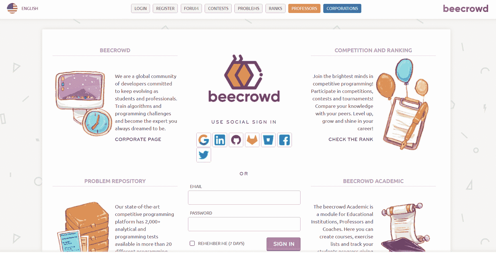

beecrowd 非常适合那些刚刚开始解决编码挑战并正在寻找一个初学者友好网站的人。它曾经被命名为 **URI** ，所以有可能你已经熟悉了这个叫 URI 的地方。

如果你想解决某个特定类别的问题，那么你很幸运，因为这个网站也提供这种服务。

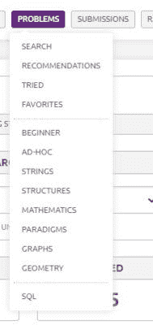

这是一张**字符串**问题集的图片。还可以按 ID (#)、名称(name)、主题(Subject)、已解决(solved)等来筛选问题。新手很喜欢这些功能。

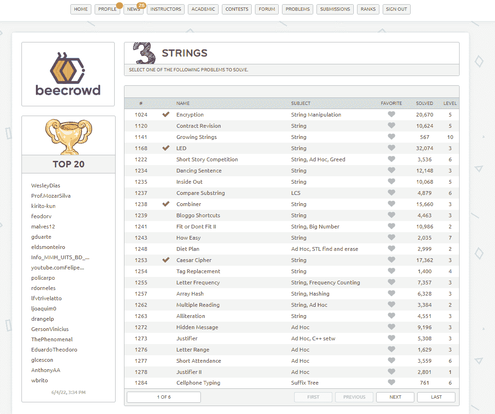

在这个网站上，你还可以参加不同的编程比赛，并检查你的全球排名，全国排名，大学排名。

还有，可以查看自己的进度，报名后过了多少天，解决了多少个问题，得了多少分等等。

你也会得到一个漂亮的个人资料页面，看起来也很漂亮。😊当我刚刚开始我的 CP(竞争性编程)之旅时，我曾经在这个网站上练习解决问题。更不用说，我在大学时在 1250 名学生中名列第三。🎉

你也可以点击查看我的 [beecrowd 简介。](https://www.beecrowd.com.br/judge/en/profile/436965)

## 2.[黑客排名](https://www.hackerrank.com/)

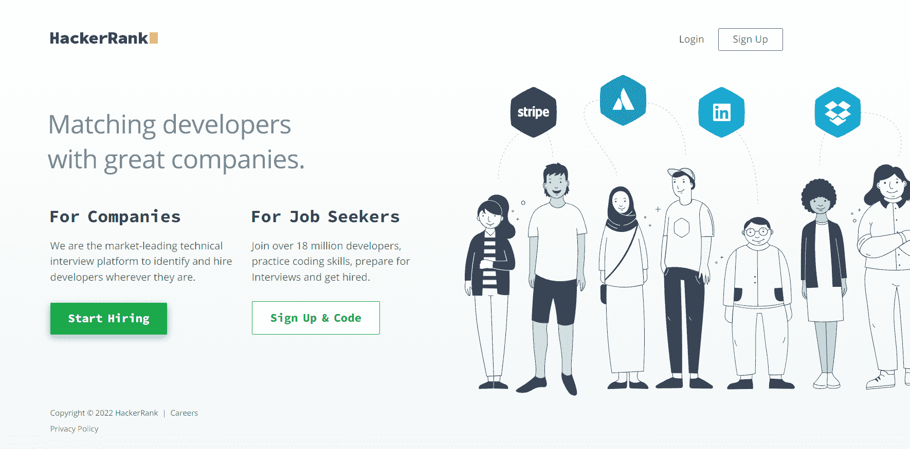

HackerRank 是最受欢迎的编码实践网站之一。这对每个人来说都是一个很好的平台，尤其是初学者。

网站看起来很漂亮，第一次来这里的用户在浏览网站时不会感到吃力，所以这绝对是一件积极的事情。

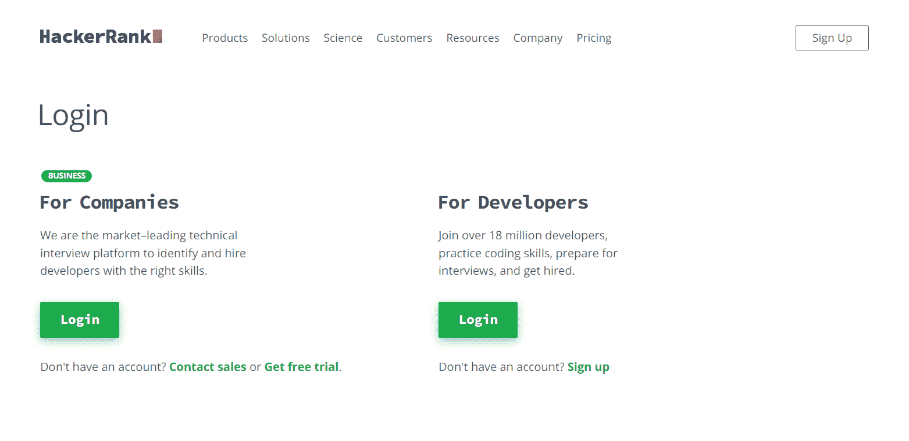

HackerRank 为公司和开发者提供了不同的门户。如果你是在学习解决问题，那么你会选择**为开发者**版块。

如果你想学习任何特定的主题或编程语言，那么这个网站是开始学习的最佳地方。你可以按题目来准备。也可以参加他们的认证考试，脱颖而出。我已经通过了他们的 Python(基础)认证考试。

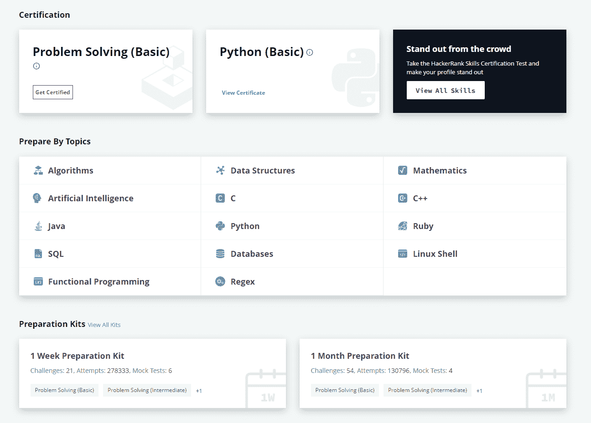

你也可以从那里选择准备工具包，如果你愿意，在面试前做好准备。此外，你可以参加编程竞赛。

在这里，你还会得到一个不错的个人资料页面。你可以从 HackerRank [这里](https://www.hackerrank.com/FahimFBA)查看我的个人资料。

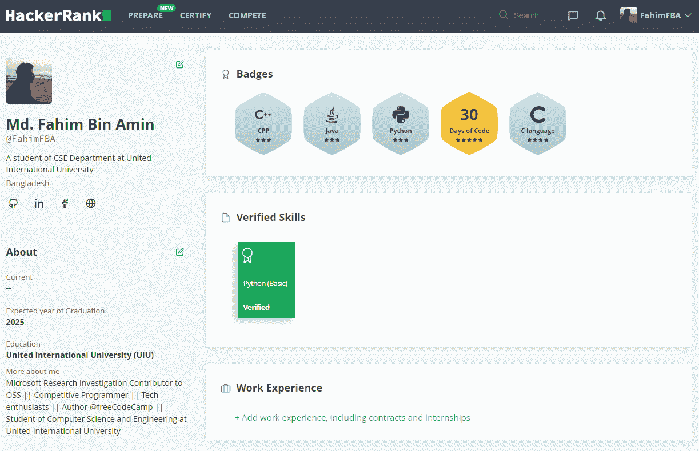

## 3. [Codeforces](https://codeforces.com/)

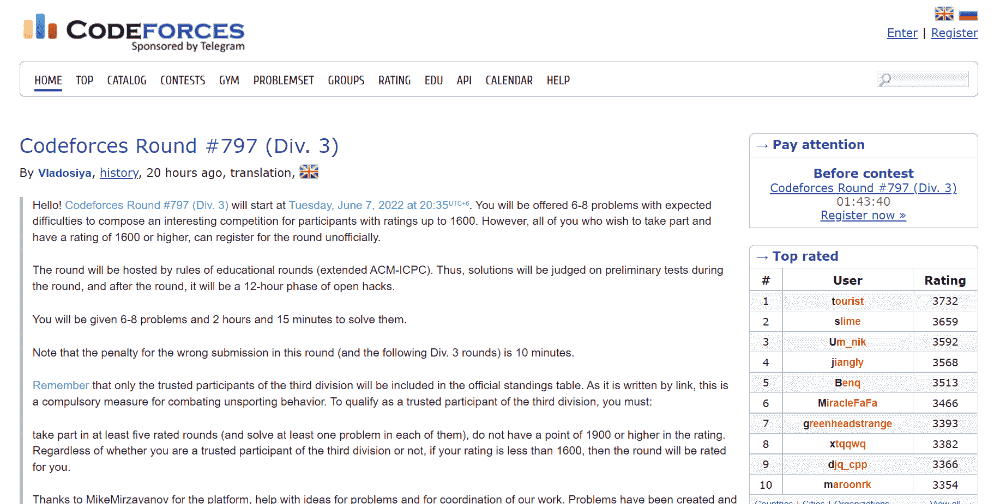

Codeforces 是世界上使用最多、最知名的编码挑战和实践网站之一，由 Telegram 赞助。尤其是如果你了解 CP(竞技编程)，那么你很有可能听说过这个网站。

尽管对新人来说，这个网站可能看起来有点不同，但你不需要太多时间来适应它。你可以通过解决不同类别、不同难度的问题来训练自己。

有竞争力的程序员根据他们在编程竞赛中的成功结果进行排名。如果你听说过**红色**编码器/ **紫色**编码器等等，那么它肯定是来自 Codeforces。

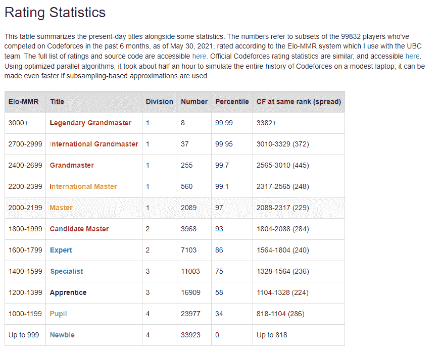

你可以从上面的图片中了解 Codeforces 的排名系统。更多细节，你可以查看这篇博客文章。

Codeforces 每周定期安排比赛，他们被分为 1 区、2 区、3 区和 4 区。他们还安排全球赛和教育赛。你可以直接从[这里](https://codeforces.com/contests)获得比赛的时间表。

Codeforces 还在其网站上提供了一个不错的用户资料。你也可以在这里查看我的[。](https://codeforces.com/profile/FahimFBA)

## 4. [LeetCode](https://leetcode.com/)

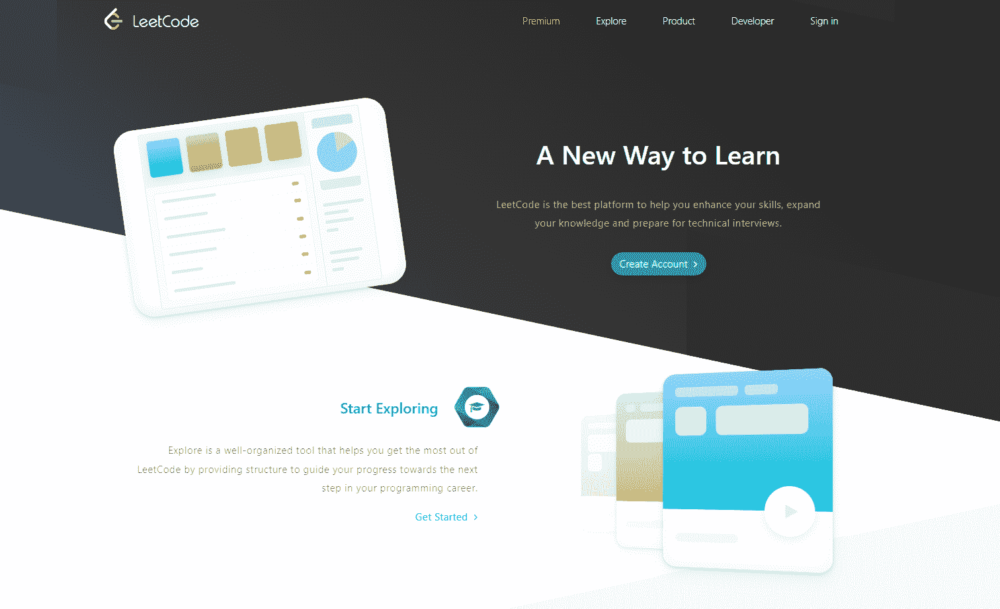

如果你熟悉 **FAANG** (脸书、苹果、亚马逊、网飞、谷歌)这个流行语，那么你一定知道这个网站！如果你想为像 FAANG 这样的大型科技公司的编码面试进行练习，那么他们都会做**leet codeing**。

你可能认为我在上面的段落中犯了一个错别字。不，我没有。LeetCode 在以 FAANG 为目标的人和那些致力于解决问题的人中间变得如此流行。在 LeetCode 上参加比赛已经变得很普遍，人们称之为 leetcoding！

在这里，您可以解决许多问题，并通过列表、难度、状态和标签来过滤问题。

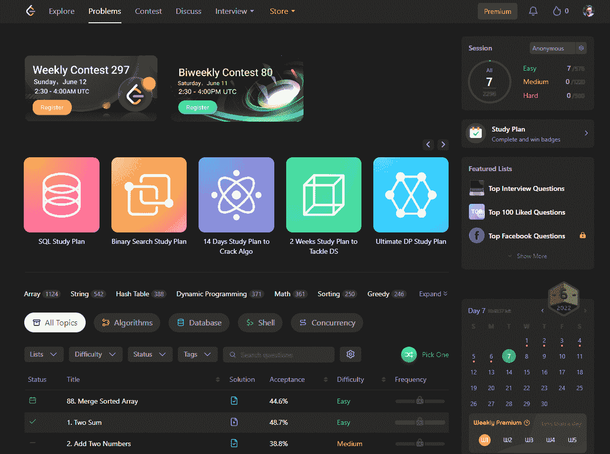

你也可以选择关于数组、字符串、哈希表、动态编程和许多其他类别的问题。

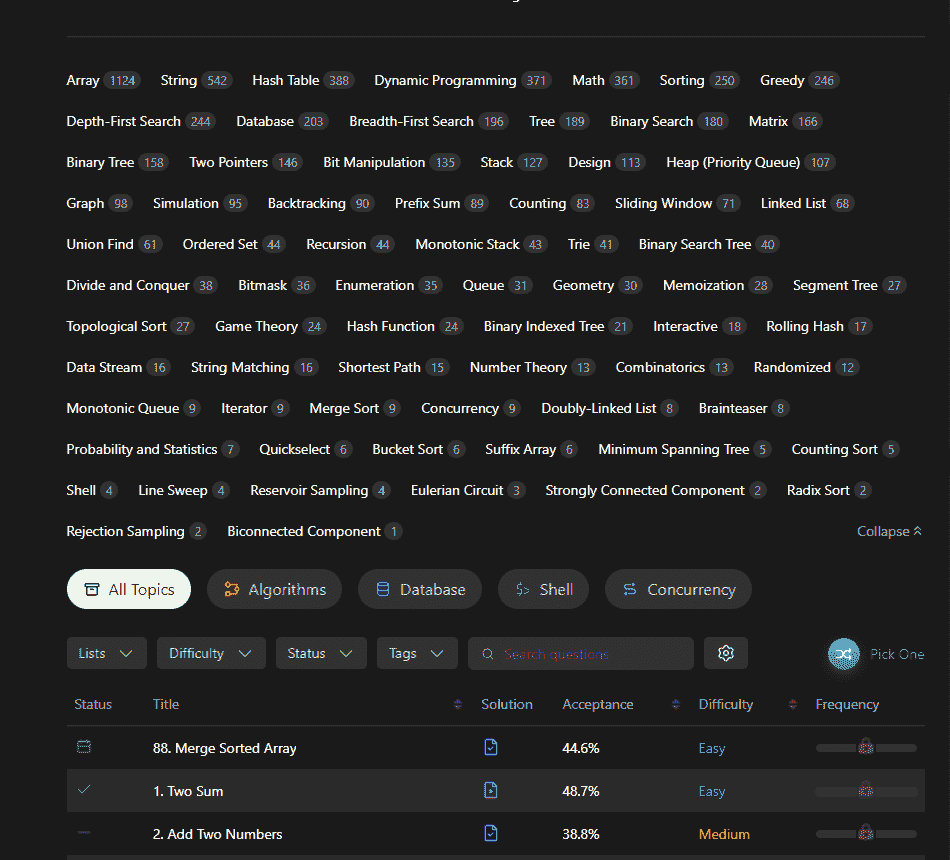

正如我上面提到的，你也可以参加编程竞赛。LeetCode 唯一与众不同的是，它是基于算法实践的。是啊，LeetCode 不像其他任何编码网站，因为它只专注于算法实践。

在这里，您不需要提供解决问题的完整代码，您只需要使用任何能够解决问题的流行语言，通过提供有效的算法来破解解决方案。

您还可以看到您的代码在其他代码中的表现如何，需要多少空间和时间，等等。

最重要的是，LeetCode 有一个令人惊叹的讨论组，人们在这里谈论他们的问题、解决方案、如何改进他们的算法、如何提高他们代码的效率等等。这是 LeetCode 最强大的特性之一。

LeetCode 的一个可悲之处是，你不会免费获得每一个特性！是啊，是真的。你必须按月或按年付费才能解锁所有功能。你会发现网站上锁定了很多问题。如果您没有购买 premium 计划，则无法解锁它们。

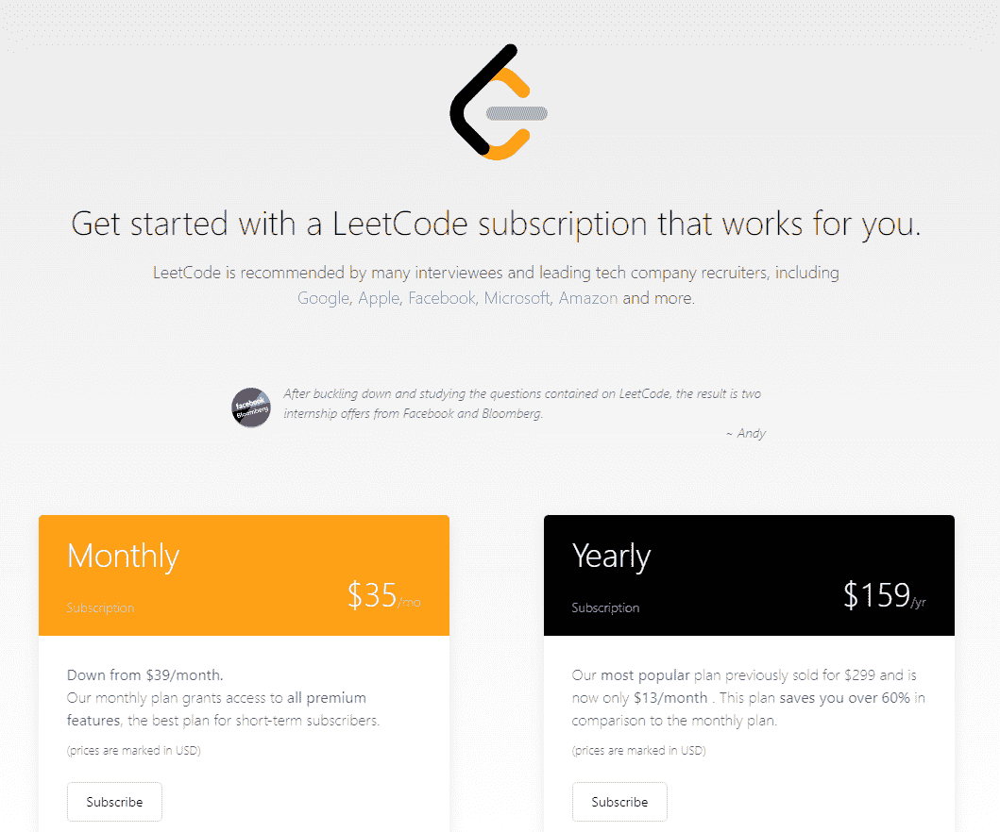

如果你只是在 LeetCode 上开始你的算法之旅，那么实际上你不需要担心他们的收费计划，因为免费版本对你来说已经足够了。

后来，如果你想变得更严肃，那么为他们付费订阅将是一件大事，因为你会得到更多的功能。这是非常有帮助的，包括像顶级面试问题，顶级 FAANG 问题，视频解释，等等。

你还可以在 LeetCode 上获得一个不错的个人资料页面。你可以在这里查看我的。

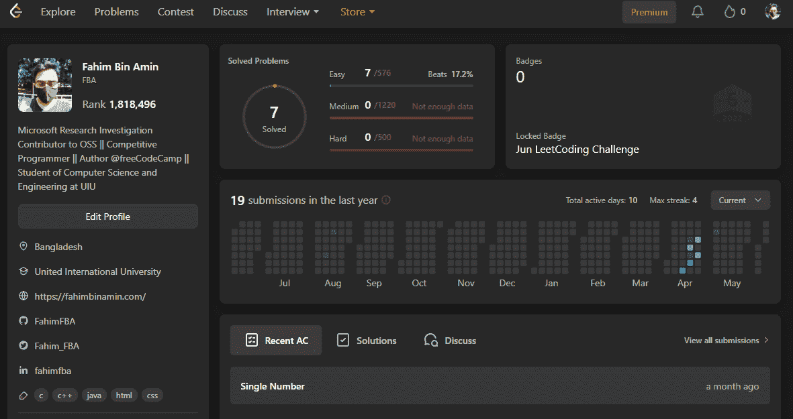

## 5.[卡格尔](https://www.kaggle.com/)

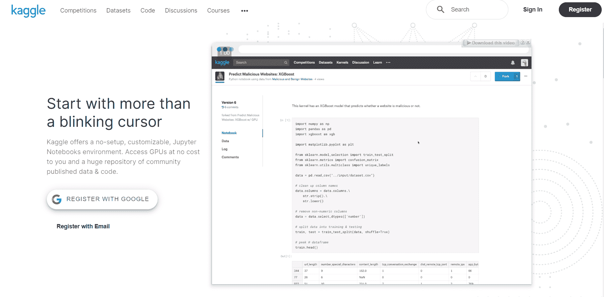

在写这一节之前，我很困惑，因为 Kaggle 不是一个典型的编码实践网站。这个网站基本上是为数据科学服务的，它是这方面最受欢迎的网站之一。

> Kaggle 是一个面向数据科学家和机器学习爱好者的在线社区平台。

> 这是一个受欢迎的众包平台，旨在吸引、培养、培训和挑战来自世界各地的数据科学和机器学习爱好者，共同解决众多数据科学、预测分析和机器学习问题。

因此，如果你对数据科学感兴趣，那么你应该检查这个网站。在这里，您可以检查他人的笔记本，提交您的笔记本，参加竞赛，改进数据集，等等。

> Kaggle 允许用户与其他用户协作，查找和发布数据集，使用 GPU 集成笔记本，并与其他数据科学家竞争，以解决数据科学挑战。

还有，如果你对数据科学感兴趣，但是不知道从哪里开始，那么也不要着急！卡格尔会掩护你的。你可以去他们的学习区看看，那里有很多免费的课程，从一开始就会教你很多东西。

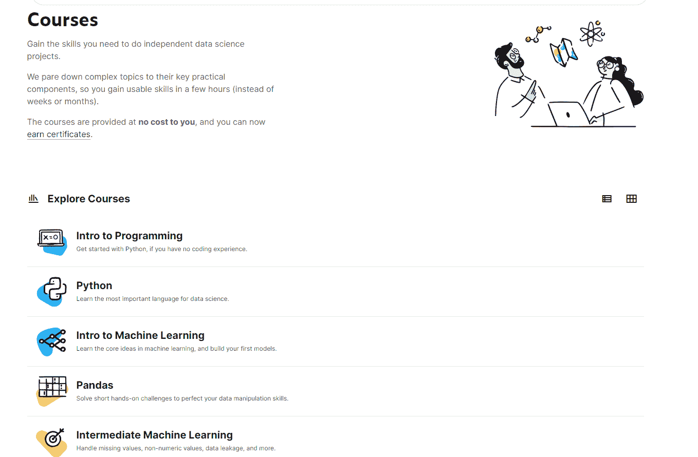

✨奖金:如果你想了解更多，那么我建议你完成 freeCodeCamp 的 YouTube 频道的[数据科学播放列表](https://www.youtube.com/playlist?list=PLWKjhJtqVAblQe2CCWqV4Zy3LY01Z8aF1)。

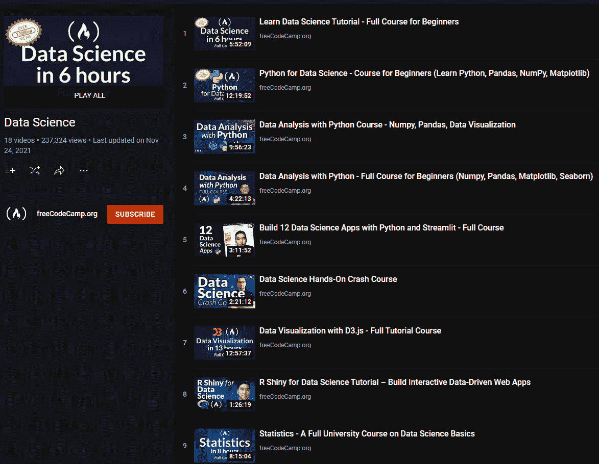

Kaggle 还提供排名和不错的用户资料。你可以在这里查看我的简介。

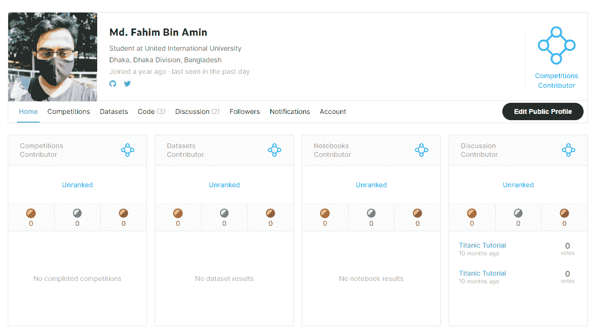

## 6.[主厨](https://www.codechef.com/)

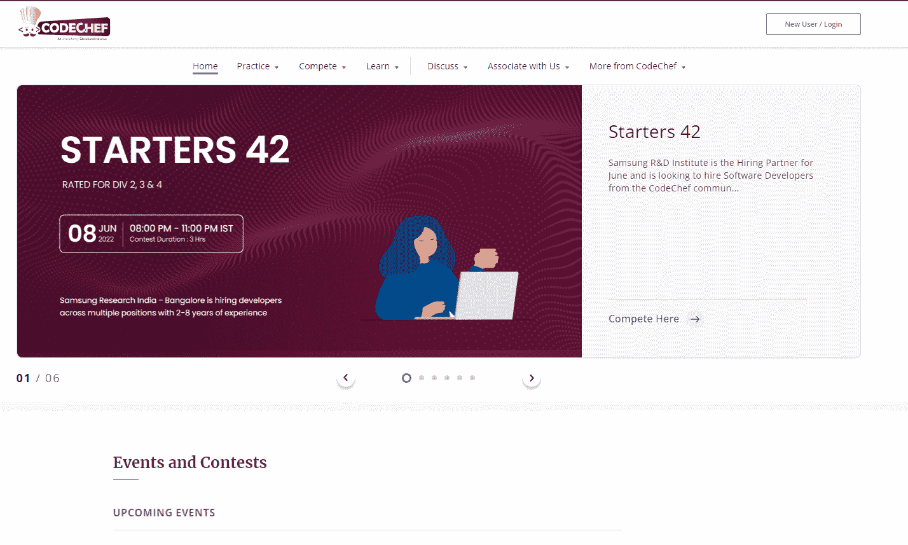

CodeChef 是另一个像 [HackerRank](#2hackerrank) 一样受欢迎的印度网站，在那里你可以解决很多问题，参加竞赛等等。

您可以根据不同的类别过滤问题，并使用任何最流行的编程语言来解决它们。

他们的网站上还有一个学习部分，在那里你可以学习如何系统地解决问题。这个超级有帮助，尤其是对新手。

在他们的学习部分，你可以选择自学、指导学习和疑问支持。有些是免费的，但有些课程，你必须付费才能开始。

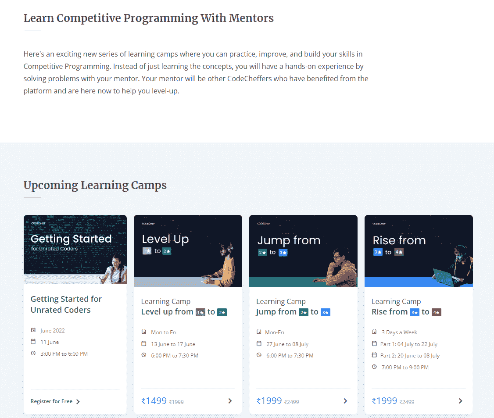

该网站还提供用户排名，包括全球排名和全国排名。他们还在自己的网站上提供用户简介。你可以在这里查看我的虽然我现在在大多数网站上都不活跃。😅

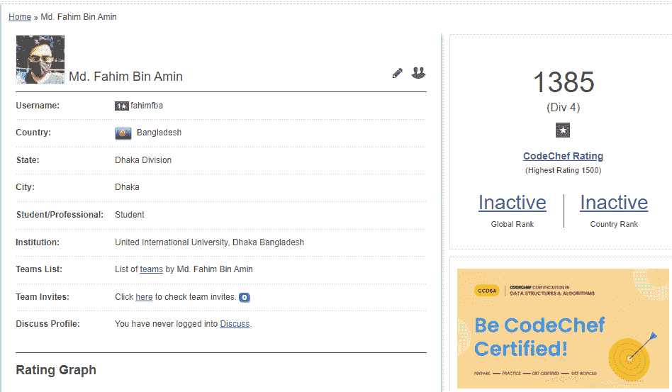

## 7.AtCoder

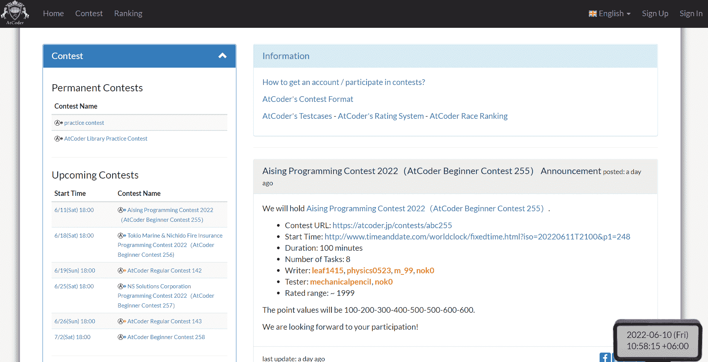

> AtCoder 是一个位于日本的编程竞赛网站。Makoto Soejima (rng_58)是 Topcoder 的前管理员和问题作者之一，也是 AtCoder 的创始成员之一。

在这个网站上，你可以参加不同的编程竞赛。他们在周六和周日定期举行编程竞赛。此外，您可以解决以前举行的编程竞赛中的问题。

我见过很多人定期参加编程竞赛，并通过在 AtCoder 上解决问题来定期解决以前在竞赛中使用的问题。我也尝试了一段时间来检查效率，说实话，它真的很有效。

在这里你还可以查看全球排名。在这里，你也将获得自己的个人资料页面，你和其他人可以看到你的全球排名等。

## 8. [Topcoder](https://www.topcoder.com/)

> Topcoder(以前的 TopCoder)是一家众包公司，拥有一个由设计师、开发人员、数据科学家和有竞争力的程序员组成的开放的全球社区。Topcoder 为社区成员的项目工作支付报酬，并向公司、中型企业和小型企业客户出售社区服务。

在这里，你可以在他们的 MVP 项目中赚取、学习和做更多的事情。为了赚钱，你可以参加五个不同的轨道，成为副驾驶，成为评论者，还可以通过 [Topcoder gig Work](https://www.topcoder.com/community/member-programs/gigs) 获得一份自由职业合同 Gig。

我个人觉得这个网站对初学者来说有点太难了。你可以在我为你制作的 YouTube 视频中了解更多细节。

## 9.[码字节](https://coderbyte.com/)

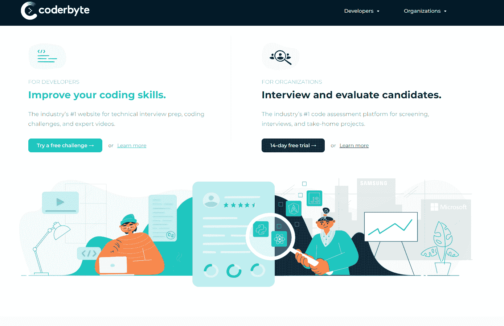

Coderbyte 收集了大量您可以解决的问题。他们还提供具有挑战性的图书馆、入门课程、面试工具包、职业资源等等。

要获得所有功能，您需要向他们购买订阅计划。我个人非常喜欢他们的采访包。

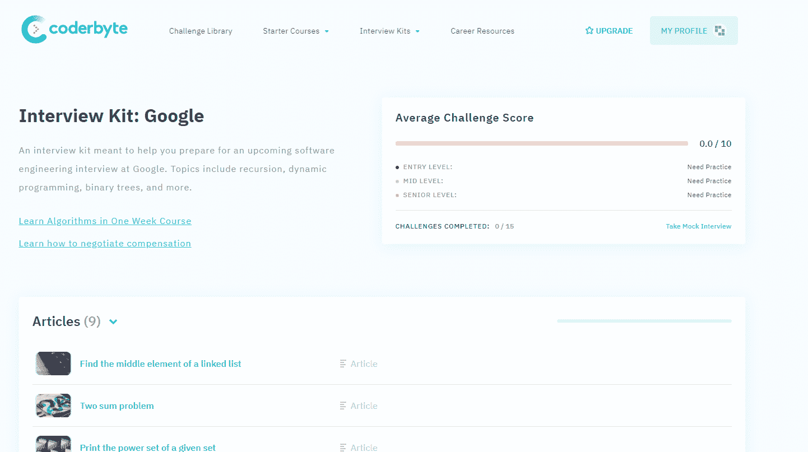

在这里，您还会看到一个个人资料页面。

## 10.[项目欧拉](https://projecteuler.net/)

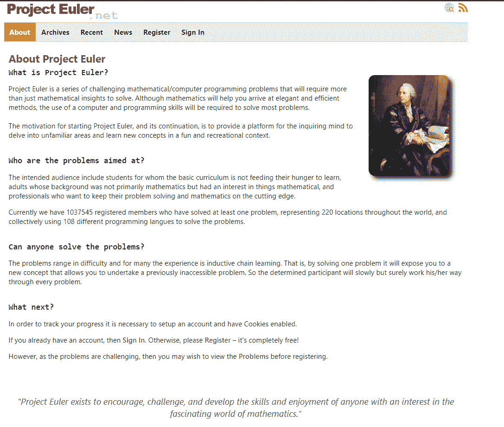

> 欧拉项目是一系列具有挑战性的数学/计算机编程问题，解决这些问题需要的不仅仅是数学洞察力。

欧拉工程是一个解决数学难题的伟大网站。但是在这个网站上解决一个问题需要的不仅仅是简单的数学知识。

如果你想用更具分析性的方法解决数学问题，那么这个网站就派上用场了。

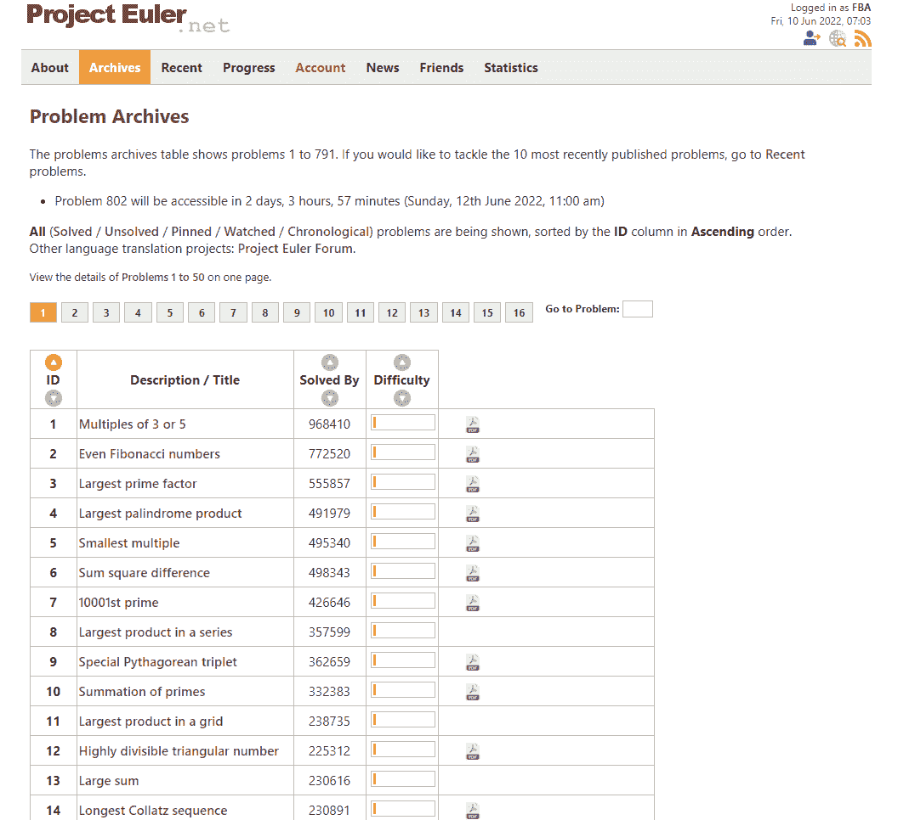

## 11.[代码大战](https://www.codewars.com/)

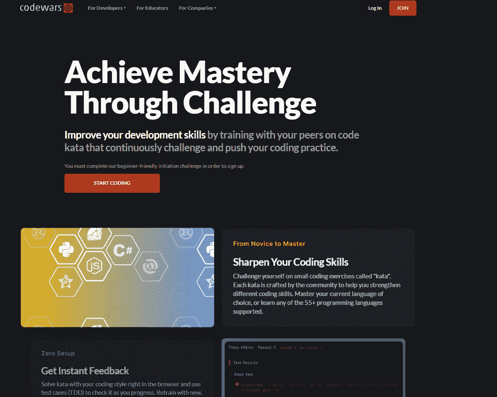

Codewars 是一个面向所有编程水平的人的编码挑战网站。它声称拥有一个超过 300 万开发者的社区。

这个网站最大的好处之一就是高度专注于 LeetCode 这样的算法。此外，如果你的目标是非常擅长编写干净高效的程序，那么这个网站会是你的巨大财富。

在《代码战争》中，你会经常看到**形**和**圭**。

> Kyu(或 Ky)表示偏离主级别(Dan)的度数。这就是他们倒数的原因。一旦你达到大师级别，我们向上数。武术黑带是丹级。

> 在代码战中，形是专注于提高技能和技巧的代码挑战。一些培训编程基础，而另一些侧重于复杂问题的解决。其他的是用来测试你创造性解决问题的谜题，而其他的是基于真实世界的编码场景。

如果你想知道更多关于 Codewars 排名系统的工作原理，那么只需查看他们的文档[这里](https://docs.codewars.com/gamification/ranks/)。

在 Codewars 上，你还会得到一个漂亮的个人资料页面，比如 [mine](https://www.codewars.com/users/FBA) 。记住我在这个网站上还没解决那么多；因此，我的个人资料页面似乎是空的。😅

此外，我发现他们的[排行榜页面](https://www.codewars.com/users/leaderboard)非常有趣。

## 12\. [SPOJ](https://www.spoj.com/)

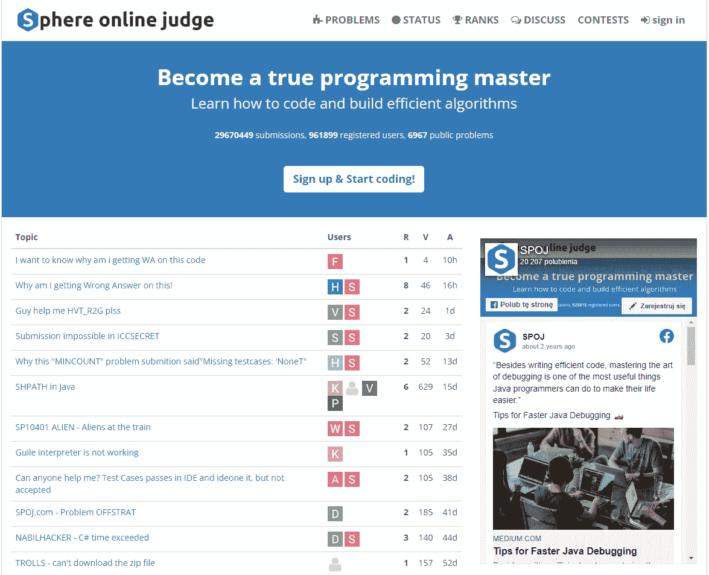

SPOJ 是一个包含大量待解决问题的网站。它声称拥有 315，000 名注册用户和超过 20，000 个问题。

根据 GFG 的说法，

> 你可以从最大提交量开始解决问题，在这里关注或查看好的编码者的提交。一旦你解决了大约 50-70 个问题并建立了一些信心，你就可以参加不同的竞赛。

他们的问题集也很有趣。

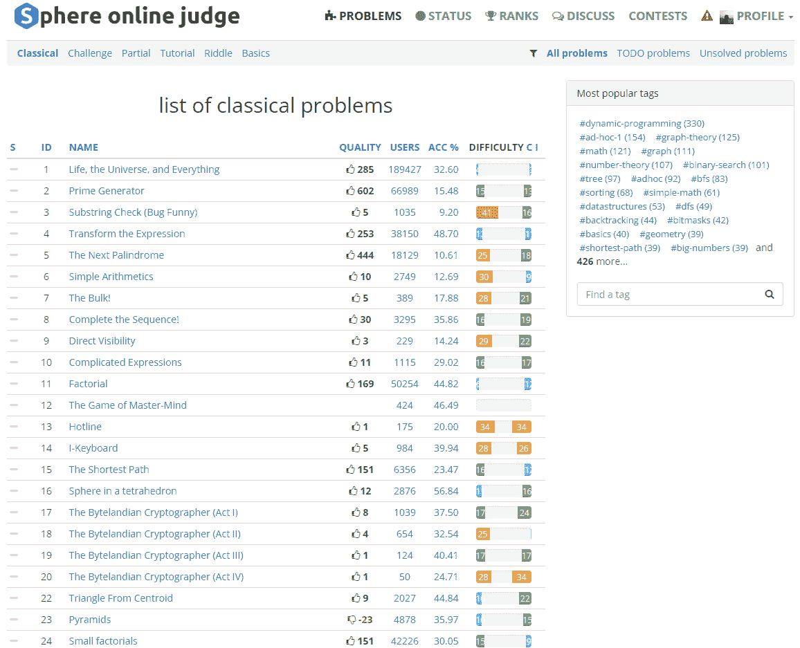

您还可以在这里获得一个不错的用户资料页面，您可以用它来展示您的问题解决技能。

## 13.[编码名称](https://www.codingame.com/)

在 CodinGame 中，您可以通过超过 25 种编程语言的有趣练习来提高您的编码技能。

对于中级和高级软件工程师来说，这是一个很好的网站，他们可以在继续保持技能的同时享受乐趣。此外，挑战是游戏化的，多人游戏意味着用户可以挑战朋友和同事。

## 14.GeeksforGeeks(俗称 GFG)

你可能想知道为什么我在这篇文章中包括 GFG，因为它只提供算法，教程，等等。

嗯，那不是他们提供的全部。是的，GFG 因其教程、算法等而非常受欢迎，但他们也提供了一个很好的解决问题的平台。

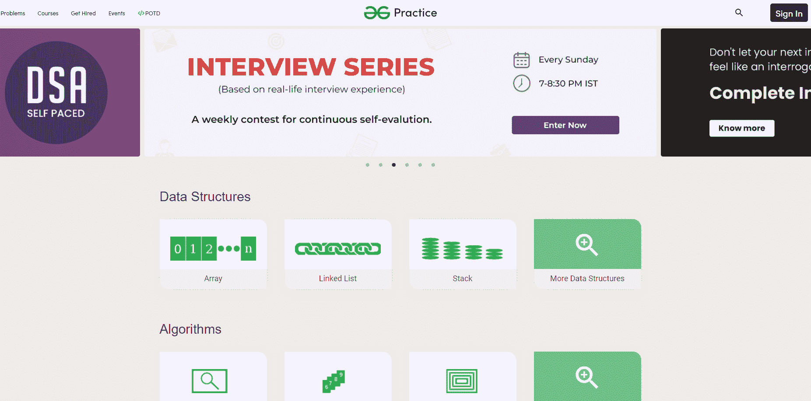

你也可以过滤你认为适合自己的问题。

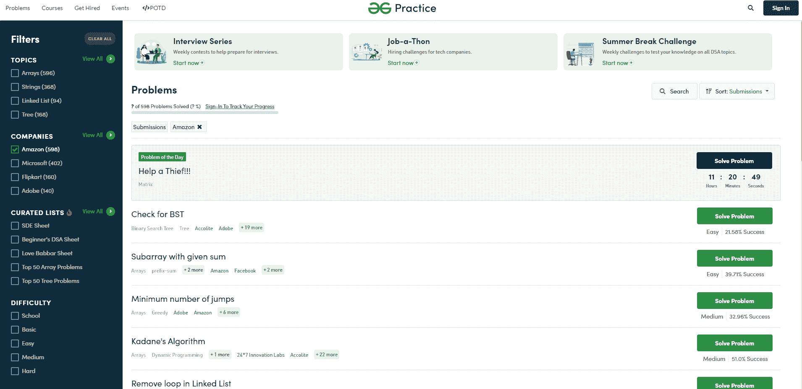

您还将获得您的个人资料页面，在那里您可以显示您在 GFG 网站上解决问题的进展。

## 15.[顶部](https://toph.co/)

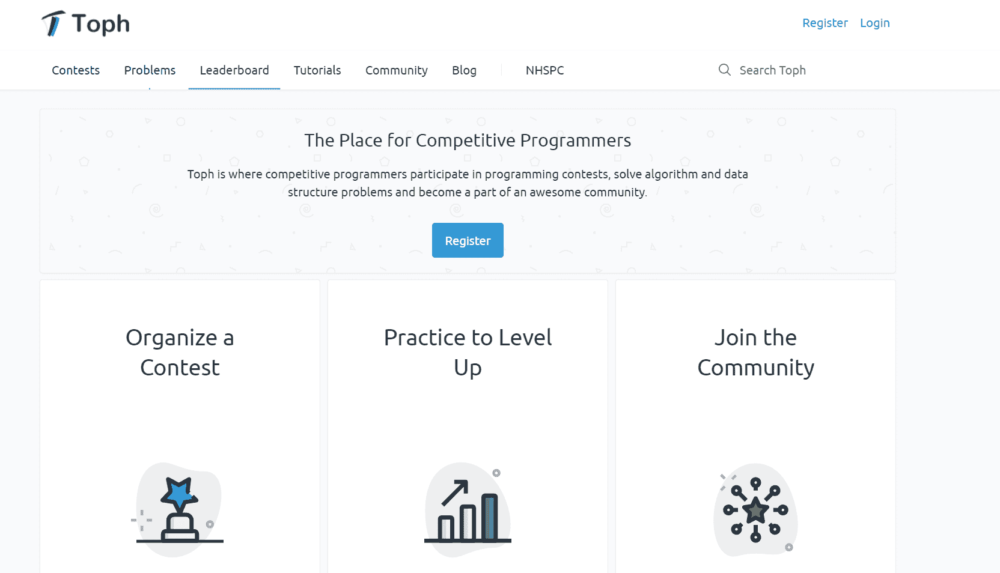

有竞争力的程序员参加编程比赛，在这个网站上解决很多问题。这个网站对孟加拉人民来说有点特别，因为孟加拉的大学通过它安排了许多编程比赛。

你可以在这个网站上解决不同类别的问题，他们还为你提供了一个不错的个人资料页面。他们还根据你在编程竞赛中的表现提供排名。

如果你是一个完全的问题解决初学者，那么这个网站可以帮助你开始你的问题解决之旅。

## 16. [LightOJ](https://lightoj.com/)

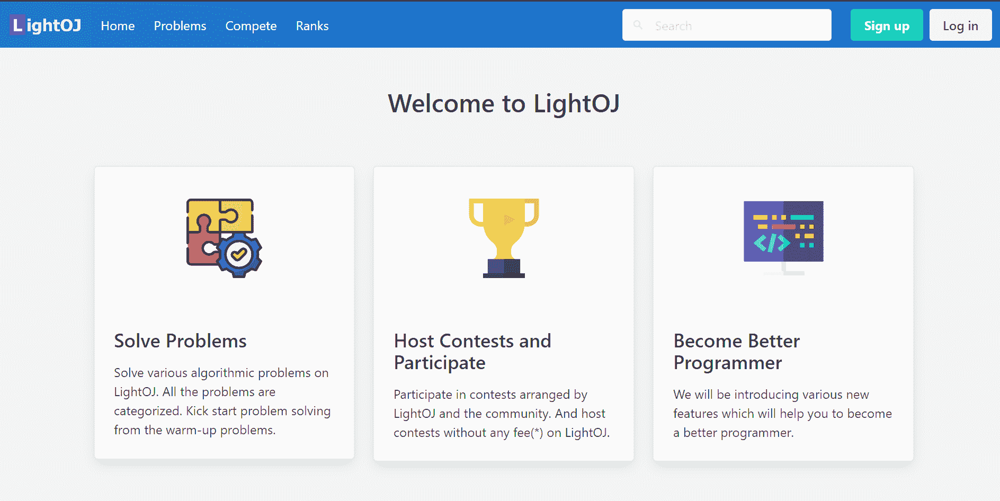

在 LightOJ 中，你可以解决很多分类问题。它高度基于解决算法问题。他们的问题分类如下:

*   LightOJ 卷
*   热身
*   高级搜索技术
*   数据库ˌ资料库
*   数据结构
*   分步解决
*   动态规划
*   快速傅里叶变换
*   流量/匹配
*   博弈论
*   几何学
*   图论
*   贪婪的
*   数学
*   [数]矩阵
*   解析/语法
*   递归/分支和界限
*   线

他们还为你提供了一个漂亮的个人资料页面，你可以在那里看到你的活动。这可能看起来很奇怪，但有时我发现这个网站在某些情况下比 LeetCode 更好。而且，你在这个网站上做的一切都是完全免费的！

## 17.[练习](https://exercism.org/)

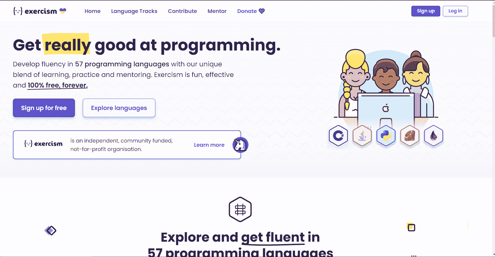

你可以用 57 种不同的编程语言通过学习、实践和指导的独特结合来提高你的编程流畅性。

Exercism 是完全免费的，是由我们这样的人建立的。你也可以贡献或捐赠给他们，免费支持他们的惊人服务。

他们还提供了一个非常漂亮的用户资料页面，显示你在他们网站上所做的一切，从发布到维护。

在他们的 [tracks](https://exercism.org/tracks) 页面上，你会得到一个 57 种不同编程语言的列表，在那里你可以开始你的实践。

在他们的网站上解决问题对我来说非常有趣。我真的很喜欢他们管理网站的方式。

## 18.[在线判断](https://onlinejudge.org/)(俗称 UVa)

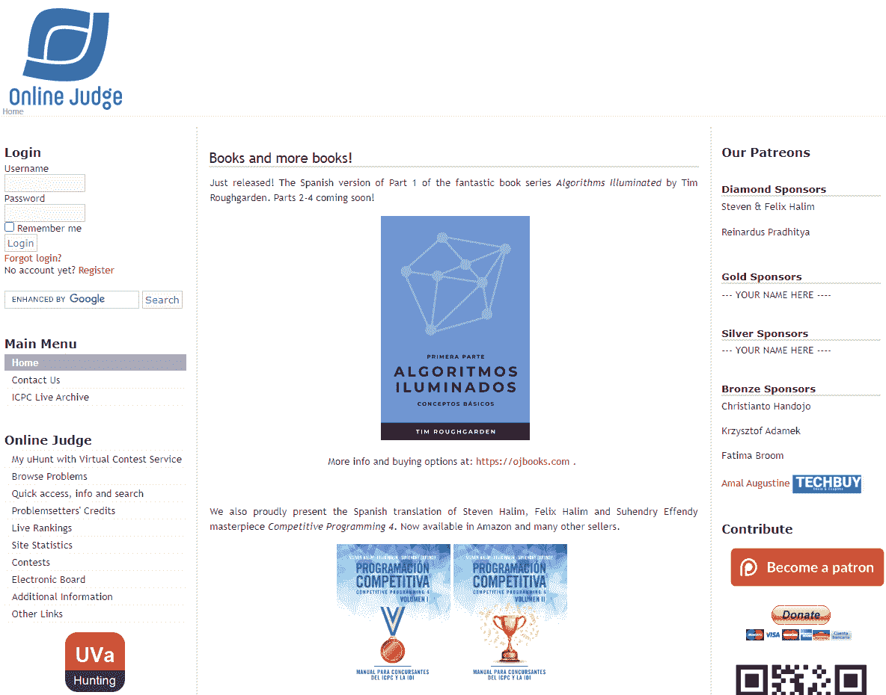

这是解决编程相关问题的最古老的网站之一。我仍然觉得对初学者来说这是一个非常难的网站。网站的 UI 和导航也很陈旧。

所有的问题都有一个 PDF 文档。如果你想解决问题，你需要下载问题的 PDF 文件，因为它们不提供问题的直接预览。

他们在自己的网站上有很多问题集。我仍然发现现在有很多用户在使用这个网站。所以，我在这里提了一下。

## 19.[黑客地球](https://www.hackerearth.com/)

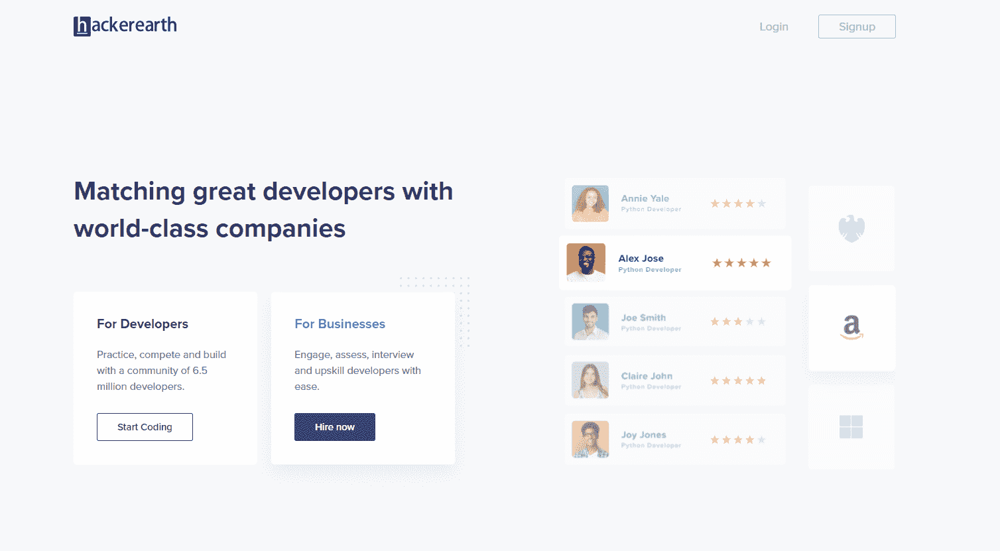

> HackerEarth 是一家总部位于美国旧金山的印度软件公司，提供企业软件，帮助企业满足技术招聘需求。黑客地球被组织用于技术技能评估和远程视频面试。

你可以从他们的[练习](https://www.hackerearth.com/practice/)页面练习解决问题的技巧。此外，你可以从他们的[挑战](https://www.hackerearth.com/challenges/)页面参与编程挑战和黑客马拉松。

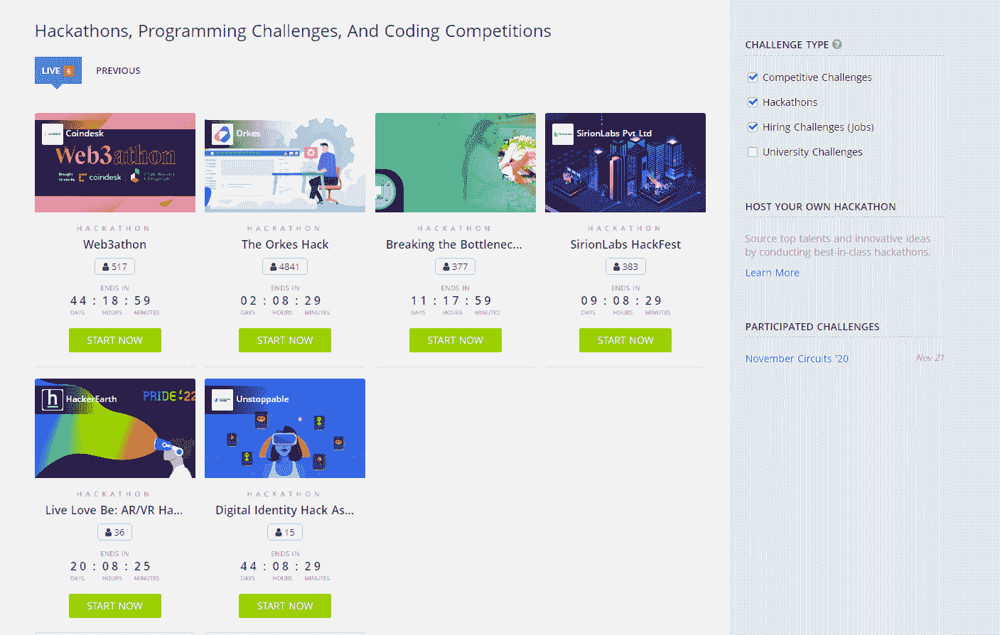

他们的[面试准备](https://www.hackerearth.com/practice/interviews/)部分相当惊艳。您可以参加 Adobe 编码测试、脸书编码测试和亚马逊编码测试的模拟评估。

他们还为每个人提供了一个很好的用户档案。

## 20.[代码堵塞——谷歌的编码竞赛](https://codingcompetitions.withgoogle.com/codejam)

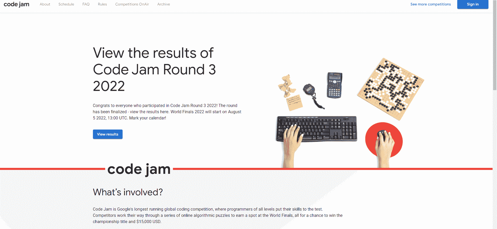

> Google Code Jam 是一项由 Google 主办和管理的国际编程竞赛。比赛始于 2003 年。竞赛由一组必须在固定时间内解决的算法问题组成。

如果你有兴趣参加 Code Jam 竞赛，那么他们的[档案区](https://codingcompetitions.withgoogle.com/codejam/archive)里有很多令人惊奇的资源，你可以在那里得到早期的问题并练习它们。

他们还在比赛中提供大量奖金。一个例子可以是:

> 在数千名参与者中，只有前 25 名将进入世界总决赛，争夺世界冠军的头衔和高达 15，000 美元的现金奖金。还会有很多其他奖品——前 1000 名参赛者将赢得一件独家 Code Jam 2022 t 恤。

## 21. [ICPC](https://icpc.global/) -国际大学生编程竞赛

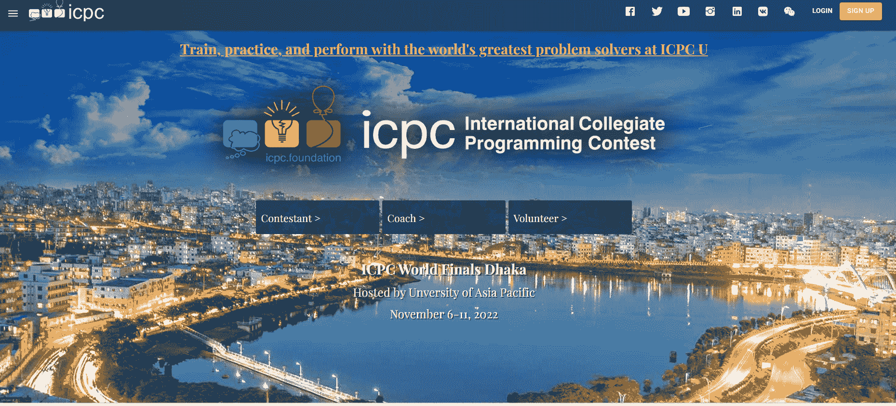

ICPC 是世界上最负盛名的编程比赛之一。

> 国际大学生编程竞赛，也称为 ICPC，是世界各地大学之间一年一度的多层次竞争性编程竞赛。

谁有资格获得 ICPC 奖？

> ACM/ICPC 是一项以团队为基础的比赛，对参赛者有一定的要求:只有年龄不超过 24 岁的大专学生和研究生一年级学生才有资格参加；每个小组由三名成员组成。一个人参加总决赛不超过两次，参加地区赛不超过五次。

# 个人观点

如果你是一个完全的初学者，那么从 [beecrowd](#1beecrowdformerlyuri) 开始。如果你想在学习一门特定的编程语言的同时开始解决问题，那么就从 [HackerRank](#2hackerrank) 开始吧。

在 beecrowd 或 HackerRank 上解决了差不多 50+个问题后，开始在 [Codeforces](#3codeforces) 上解决问题。第一次，你不能在 Codeforces 的编程竞赛中做得那么好，这完全没关系——这很自然。你只需要定期尝试。这些问题对你来说似乎很难，但在不断解决问题后，它会一天比一天容易。

当你开始在 Codeforces 上解决问题的时候，你可以参加 [AtCoder](#7atcoder) 。你也可以试试 [CodeChef](#6codechef) ，但是我发现 Codeforces 在这种情况下已经足够了。

这将为你准备好 [ICPC](#21icpcinternationalcollegiateprogrammingcontest) 和[代码阻塞](#20codejamgooglescodingcompetitions)。不要忘记解决前面关于代码阻塞的问题。

如果你想获得数据科学方面的专业知识，那就去参加 [Kaggle](#5kaggle) 吧。

如果你想获得算法方面的专业知识，那么 [LeetCode](#4leetcode) 和 [LightOJ](#16lightoj) 是你唯一的去处。[geeksforgeoks](#14geeksforgeekspopularlyknownasgfg)也会在这方面帮到你。

对于 LeetCode，可以从尼克·怀特那里得到一些帮助。他的 [LeetCode Solution](https://www.youtube.com/playlist?list=PLU_sdQYzUj2keVENTP0a5rdykRSgg9Wp-) 播放列表到今天为止有 189 个视频，相信我，你会从他身上学到很多东西！

另一个很好的资源是 [Neetcode](https://neetcode.io/) ,在那里你可以从 LeetCode 中获得精选的问题及其解决方案。Neetcode 的官方 [YouTube 频道也是一个很棒的频道。](https://www.youtube.com/c/NeetCode/featured)

# 其他网站

你可能会发现下面的网站也很有用！

## [StopStalk](https://www.stopstalk.com/)

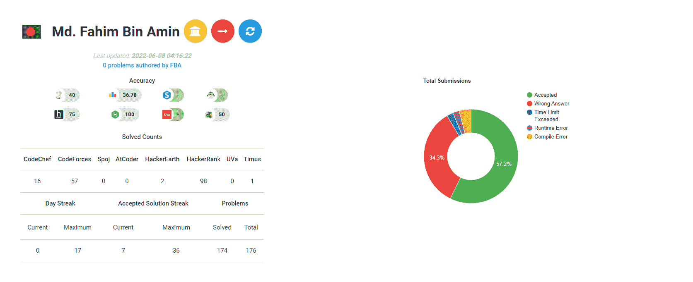

该网站从各种竞争网站(如 Codeforces、SPOJ、HackerRank、Timus 等)检索您的朋友最近提交的内容，并在一个地方显示所有内容。你可以从[这里](https://www.stopstalk.com/user/profile/FBA)查看我的 StopStalk 简介。

## ⭐ [编码员排名](https://codersrank.io/)

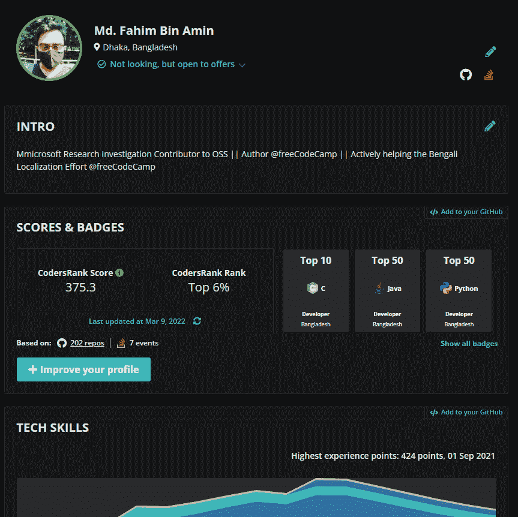

这是一个帮助开发者求职和职业成长的平台。在这里，你的 CodersRank 档案作为你的编码知识的一个被证明的跟踪记录。

您必须从 GitHub 连接您的私有和公共库，以生成您真正的 CodersRank 配置文件。你也可以从[这里](https://profile.codersrank.io/user/fahimfba/)查看我的 CodersRank 资料。

# 结论

感谢您阅读整篇文章。我希望它在你解决问题的旅程中对你有很大的帮助，无论你是一个有经验的开发人员还是刚刚开始你的学习之旅。

此外，如果你想分享你的宝贵反馈或想与我聊天，那么我的 [Twitter](https://twitter.com/Fahim_FBA) 和 [LinkedIn](https://www.linkedin.com/in/fahimfba/) 账户都可以为你服务。

如果你对开源感兴趣，那么你可以在 GitHub 上关注我，因为我在那里非常活跃。

如果你喜欢与编程相关的内容，那么我也建议你订阅我的 YouTube 频道，因为我会尽力在那里发布高质量的内容。:)

额外收获:你也可以查看我的[网站](https://fahimbinamin.com/)、 [Instagram](https://www.instagram.com/fahimbinamin) 或者我的[发展集锦](https://www.polywork.com/fahimbinamin)！