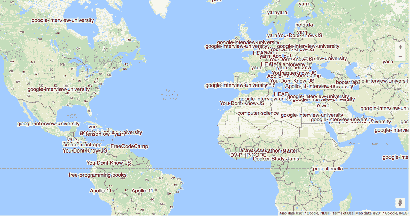
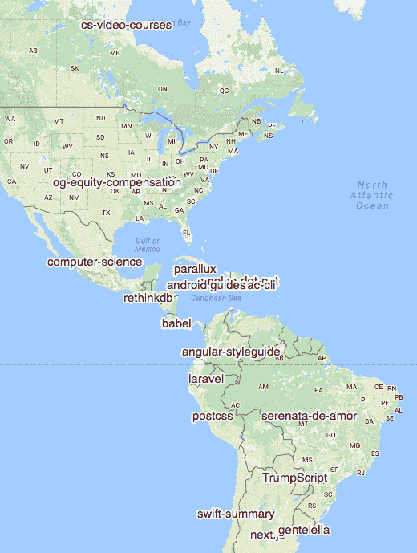
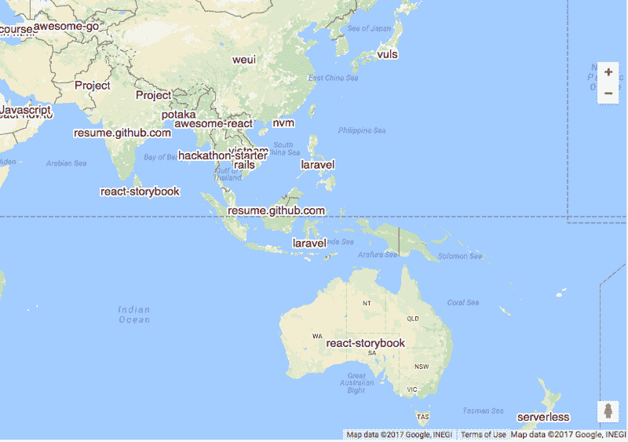
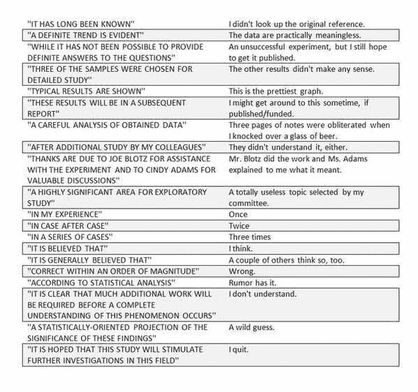

# 每个国家 GitHub 上最受欢迎的开源项目

> 原文：<https://www.freecodecamp.org/news/the-most-popular-open-source-projects-on-github-in-each-country-f31812959e91/>

这些是 2016 年 GitHub 上每个国家最受欢迎的开源项目。

每个国家第二受欢迎的项目是:

以下是每个国家的顶级项目，去掉了前 75 个总存储库:

这些是基于对 2016 年 GitHub 星级总数的简单统计。所有这些图片都来自谷歌工程师 Felipe Hoffa 的分析，你可以在这里阅读全文。

以下是其他三个值得你花时间去做的链接:

1.  我的大型 JavaScript 基础课程现在在 YouTube 上直播。而且是 100%免费的( [5 分钟阅读](http://bit.ly/2oRqCIp))
2.  印度如何从贪婪的公司手中拯救互联网
3.  大图机器学习:用神经网络和 TensorFlow 对文本进行分类( [12 分钟阅读](http://bit.ly/2oqC2lt))

### 想到这一天:

> “一个好的程序员总是在穿过单行道之前先往两边看。”——道格·林德

### 今日趣事:

如何阅读一篇学术论文 [Academia Obscura](http://bit.ly/2nO0tGe)

### 今日学习小组:

[休斯敦自由代码营](http://bit.ly/2oNNY1L)

编码快乐！

–昆西·拉森，自由代码营的老师

如果你从这些邮件中获得了价值，你应该考虑[支持我们的非营利组织](http://bit.ly/donate-to-fcc)？