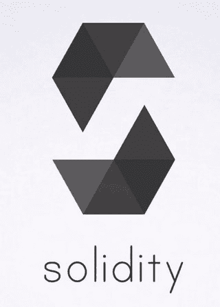
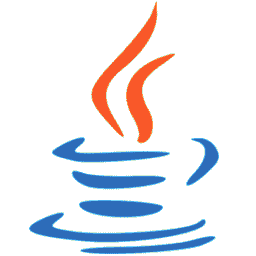
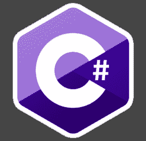
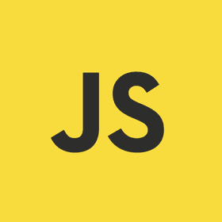
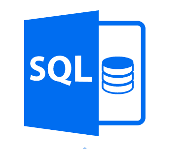
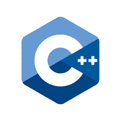
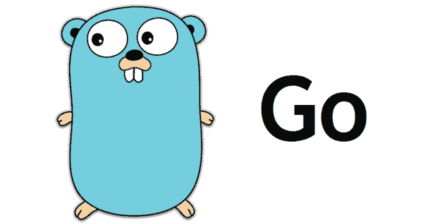

# 区块链开发中使用的最流行的编程语言

> 原文：<https://www.freecodecamp.org/news/the-most-popular-programming-languages-used-in-blockchain-development-5133a0a207dc/>

迈克尔·德雷珀

随着区块链的发展，我们目前正处于一个新兴产业的中期。

区块链技术在很大程度上处于萌芽阶段，然而这种颠覆性技术已经成功地席卷了世界，并在最近经历了前所未有的繁荣。

随着许多资金充足的项目现在急于建立他们的区块链网络，并在其上部署分散的应用程序，有能力、有能力的区块链开发人员严重短缺。

随着数十亿美元资金投入这一领域，区块链开发商的薪酬和需求都在上升，各项目竞相吸引市场上剩下的最优秀的区块链人才。

这种淘金热可能会让一些开发人员怀疑他们是否有能力进入这个行业，尤其是在这个新行业中什么编程语言最受欢迎。几乎所有流行的编程语言都在区块链行业中使用，但是开发人员必须考虑他们想要进行什么类型的开发，因为某些区块链项目和应用程序使用不同的语言。

这里有一个不同语言和利用它们的项目的简要概述，作为那些希望更深入研究这个行业的人的基本理解和基础。

****——一种新的简单的编程语言，在以太坊开发者中很流行，因为它是用于开发以太坊智能合约的语言。 **Solidity** 是一种面向契约的图灵完全编程语言[开发者的数量估计超过 20 万](https://www.trustnodes.com/2018/07/22/ethereums-ecosystem-estimated-200000-developers-truffle-seeing-80000-downloads-month)。****

****随着以太坊在智能合约方面走在了前面，许多替代的区块链平台正在确保它们是 Solidity(或 ERC-20)兼容的，从而允许智能合约很容易地从以太坊移植到他们新的区块链网络中。****

****[**以太坊**](https://www.ethereum.org/)**——**技术上以太坊的功能是以太坊虚拟机(EVM)作为“世界计算机”，由 C++、Python、Ruby、Go、Java 等多种语言组成。JavaScript 充当以太坊的主干，因为它充当脚本执行的运行时环境。****

********

****Java 是一种通用的编程语言，它是并发的、面向对象的、基于类的，它的设计使得 Java 很少依赖于实现。自从 1995 年发布以来，Java 已经成为三大编程语言之一，并且理所当然地拥有超过 900 万开发人员。 [**NEM 的**](https://nem.io/) 核心区块链网已经全部用 Java 编写(即将是 C++)。****

********

******C#** —一种面向对象的语言，使开发人员能够构建运行在。NET 框架，至少有全球[的 2M 开发者](https://blogs.msdn.microsoft.com/zxue/2016/10/24/how-many-developers-use-c-vs-c-vs-other-programming-languages/)。C#是在 2000 年开发的。自诞生以来，它已经成为一种流行的编程语言，用于构建强大的跨平台代码，可以在多种操作系统上工作，如 Windows、Mac、Linux 和 Android。用 C#编写的区块链项目包括:****

*   ****[**Stratis**](https://stratisplatform.com/) 微软支持的区块链即服务提供商，允许企业建立自己的私有区块链系统。****
*   ****[**NEO**](https://neo.org/) 是用 C#编写的，不过它也支持 Javascript、Java、Python、Go 等多种编程语言。****

********

******Javascript —** 通常缩写为 JS，这是一种多范式语言，支持事件驱动、函数式和命令式(包括面向对象和基于原型的)编程风格。它是世界上最流行的编程语言之一，全球至少有[970 万开发者在使用它](https://appdevelopermagazine.com/9.7m-developers-use-javascript/)。****

****[**Lisk 的**](https://lisk.io/) 侧链开发套件(SDK)是用 JavaScript 编写的，允许开发者在 Lisk 的区块链平台上构建应用。****

********

******SQL —** 结构化查询语言或“Sequel”是 IBM 开发的一种编程语言，用于与存储、查询和操作数据的数据库进行通信。据估计，今天有[700 万 SQL 开发者](https://blog.jetbrains.com/datagrip/2015/12/23/how-many-sql-developers-is-out-there-a-jetbrains-report/)。流行的数据库如 MySQL、PostgreSQL、SQL Server、DB2、Oracle 等都使用 SQL 来开发应用程序。包含 SQL 的区块链项目是:****

*   ****[**阿尔戈**](https://www.aergo.io/)**—**Blocko 在其专有的 Coinstack 技术下开发的企业级区块链解决方案利用了 SQL 智能合同。Aergo 链具有基于 SQL 的智能合同平台，允许企业实体在商业环境中创建和执行高级智能合同。****

********

****C++ —一种通用编程语言，估计有[440 万开发人员](https://blog.jetbrains.com/clion/2015/07/infographics-cpp-facts-before-clion/)，它最大的优势在于能够扩展资源密集型应用程序，并使它们能够平稳运行，从而使其成为一种非常受欢迎的 3D 游戏编程语言。使用 C++的区块链项目包括:****

*   ****[**EOS**](https://eos.io/) — C++是 EOS 的主要编程语言，因其在区块链上运行大量应用程序的灵活性而受到青睐。EOS 还支持编译成 WebAssembly (WASM)的任何语言****

> *****随机事实:比特币核心的网络是用 C++编程的。*****

********

****[**Golang**](https://golang.org/) —一种基于 C 编程语言语法的开源通用编程语言，Golang 易于开发人员学习，也易于测试人员理解。目前大约有 [800，000 多名开发人员](https://research.swtch.com/gophercount)使用 Golang 语言，该联盟网络使用这种语言:****

*   ****[**HyperLedger Fabric**](https://hyperledger-fabric.readthedocs.io/en/release-1.3/)**——**大部分 chaincode(使用 HyperLedger Fabric 构建的智能合约)都是用 Golang 编写的。他们还有一个用于开发区块链应用程序的 Java SDK。****

****希望这已经为你提供了一个基本的概述，如果你对区块链行业感兴趣，你可以从哪里开始，进一步挖掘什么。毫无疑问，在未来十年左右，随着技术的进步和真实应用案例的出现，这个行业将会继续迅猛发展。****