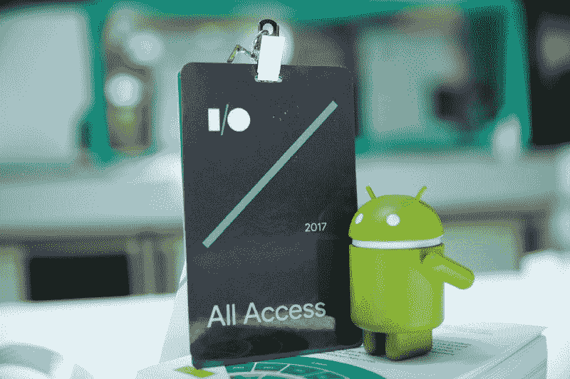
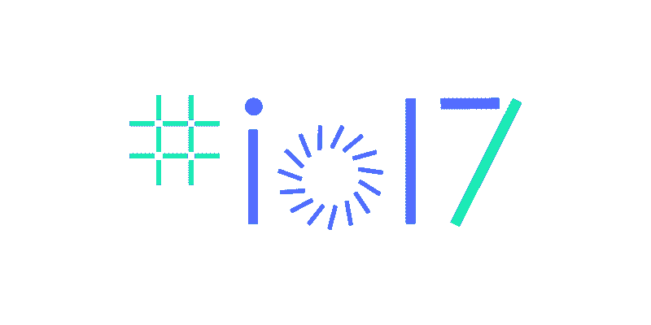
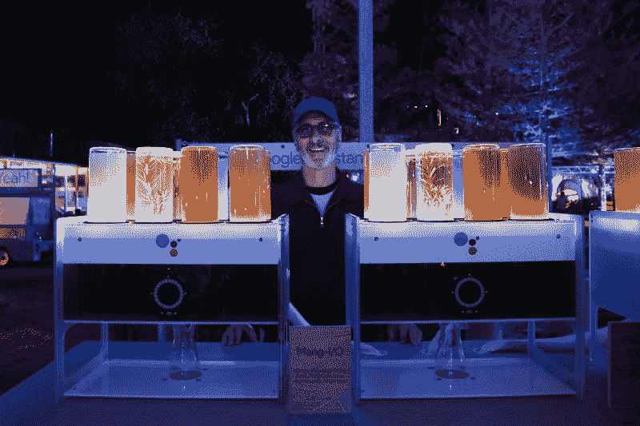
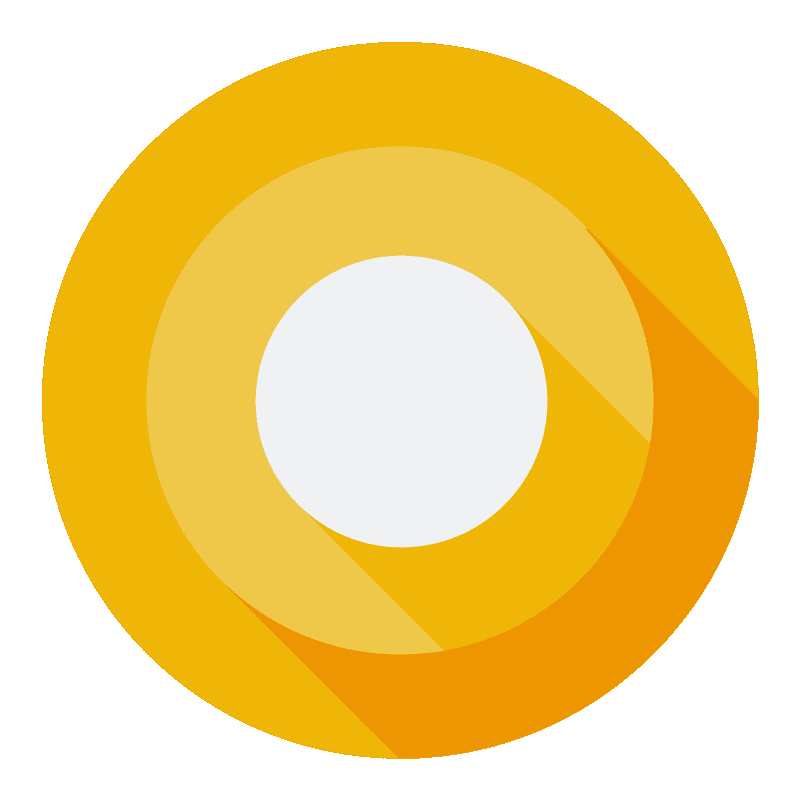
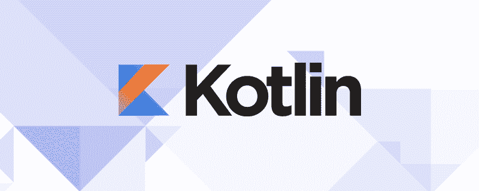
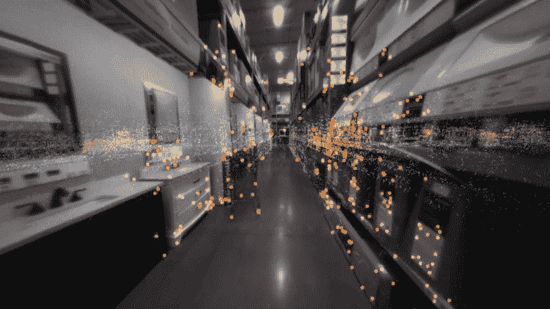

# 谷歌 I/O 2017 最有希望的突破

> 原文：<https://www.freecodecamp.org/news/the-most-promising-breakthroughs-from-google-i-o-2017-40d3accd42/>

作者:阿拉文·普特勒乌

# 谷歌 I/O 2017 最有希望的突破

Google I/O 是最大的开发者大会之一。今年特别令人兴奋。有两个主题演讲:一个来自谷歌首席执行官桑德尔·皮帅，另一个来自 T2，谷歌负责开发者产品的副总裁杰森·泰特斯。

在这篇文章中，我将总结 Google I/O 2017 的主要公告，并分享我作为开发人员对它们的看法。

### 我们开始吧！

我喜欢他们今年通过展示他们的[“一个想法的故事”](https://www.youtube.com/watch?v=cXtbWJsbvzk)视频剪辑来开始他们的活动的方式。这象征着当一个人着眼于推进一个想法时，他们可能会面临许多障碍。但最终当世界开始关注努力和辛勤工作时，这些努力才真正开始发光。

主题演讲以 Sundar 描述谷歌的主要产品和这些服务的运营规模开始。

在过去的几年里，我们中的许多人没有一天不使用谷歌搜索、Gmail、YouTube、Android 或其他谷歌产品。这显示了谷歌在将人们一次又一次带到同一个平台上所拥有的卓越工程技术。

### **从移动第一到 AI 第一**

谷歌的主要竞争对手可能在某些领域处于领先地位，比如云和社交媒体。但是谷歌比他们有优势，因为它有更多的世界数据。所有这些数据都使他们更容易将人工智能集成到他们的产品中。

因此，今天我们看到谷歌的每个产品都增加了大量新功能，而没有影响用户体验。

> “我们越能让人工智能技术的使用民主化，每个人就能越早受益。”—桑德尔·皮帅

### 谷歌镜头

谷歌不仅成功地降低了其语音识别的错误率，而且实际上已经接近典型人类理解语音的能力。如今，Google Home 能够理解家中不同的声音，并给出相应的结果。

同样，谷歌眼镜将使机器能够向外看，并描述他们所看到的东西。

### 云张量处理单元(TPU)

作为一个机器学习爱好者，我知道今天训练一个机器学习模型有多难。因此，想象一下有一个巨大的数据集和一个机器学习模型的情况。在任何计算能力较低的典型计算机(如笔记本电脑)上训练模型都不容易。为此，您需要一台处理能力更强的机器，以便您能够以经济高效的方式执行这些任务。

Google’s new TPUs.

由于大多数云供应商都是按时间收费的，因此随着时间的增加，完成任务的成本也会增加。有了更好的底层基础设施，人们可以在给定的时间内用更多的数据点来训练模型。

因为一个模型在各种各样的数据上训练得越多，推论就变得越准确。

在这种背景下，云 TPU(第二代 TPU)将是一项重大创新。随着云 TPU 集成到谷歌云平台(GCP)，我们可以预计，GCP 可以成为所有机器学习用例的必去之地。

### **Google.ai**

谷歌总是谈论开源和其技术的民主化。这也有助于生态系统的繁荣。 [Tensorflow](http://tensorflow.org) 就是一个很好的例子。

同样，我相信 Google.ai 会成为一个可以找到谷歌所有人工智能工作的地方。

**AutoML** 很疯狂，展示了谷歌能把 AI 带多远。一个例子是**神经网络建立另一个神经网络**。记住我们还在 **2017** 。

将机器学习的进步应用到医疗保健领域([糖尿病视网膜病变](https://www.walmart.com/ip/Google-Home/54742302?utm_source=madebygoogle&utm_medium=home)、[乳腺癌诊断](https://research.googleblog.com/2016/11/deep-learning-for-detection-of-diabetic.html))提醒我们，技术可以改变生活，帮助我们活得更长。

在这一点上，看看这个高中生努力解决最棘手的医学预测问题的视频。

有趣的是，你听说过[自动绘制](https://www.autodraw.com/)吗？去吧，你会看到人工智能在行动。

### 谷歌助手

谷歌搜索仍然是谷歌的主要收入来源。

谷歌助手本质上是谷歌搜索——但它使用语音作为其模态。通过让人们使用谷歌助手，他们让用户更频繁地搜索，并引入更多有趣的功能，如使其更具对话性，将其注入所有形式的因素，并最终将其作为一个[平台](https://developers.google.com/assistant/sdk/)开放。

Google Assistant powered drink mixer [[learn more](http://deeplocal.com/mocktailsmixer/)]

要了解更多关于开发“谷歌上的动作”的信息，请看这个精彩的 [API.ai](https://github.com/rominirani/api-ai-workshop) 演示。

### 谷歌主页

谷歌助手或多或少会驱动 [Google Home](https://madeby.google.com/home/) 。它将自己定位为 T2 亚马逊 Alexa 平台 T3 的竞争对手。

现在我们可能会认为谷歌正在追赶亚马逊，但凭借谷歌拥有的数据量，以及用户与谷歌服务的日常互动，它可能会超越 Alexa。

许多人将关注这场战斗的结果。

以下是 Google Home 的一些核心功能:

*   主动协助
*   免提通话
*   对附近合适屏幕的视觉反应
*   与谷歌现有服务整合，如地图、Chromecast、日历和 YouTube

### Google 相册

从发布的那天起，Google Photos(以前叫做 Picasa)就获得了巨大的成功。凭借分析和组织信息的能力，谷歌又推出了另一个功能:建议分享。这减轻了制作相册并与爱人分享的时间压力。现在只需轻轻一点。

共享图书馆和相册也是如此。并且与谷歌镜头进行了巧妙的整合。

谷歌将机器学习应用于一切。

### 油管（国外视频网站）

YouTube 首席执行官苏珊·沃西基展示了该平台解决社会问题的有趣能力。这让我想起了社交媒体最初承诺的力量。

今天，还没有能与 YouTube 相提并论的开放视频服务，YouTube 能赚很多钱。然而，谷歌并没有固步自封。它正在以各种可能的形式向 YouTube 引入新功能，无论是你的电脑、智能手机还是电视。

### 机器人

哦！我怎么能忘记呢？世界上最流行的移动操作系统。

谷歌正在全速前进，推出新版本的安卓系统。这不仅仅是修补东西，这是一些主要的新功能。

作为一名 Android 开发者，我想祝贺并感谢 Android 的整个团队又一次漂亮的发布。

Android O (Oreo?)

尽管 Android 本身很受欢迎，但它仍然存在一些问题，比如电池寿命和操作系统版本碎片化。但随着每一个新版本的发布，谷歌都在通过让 Android 更强大来解决这些问题。

[Android](https://source.android.com/) O 通过*画中画、通知点、自动填充、*和*智能文本选择*等功能改善用户体验。

其中我最喜欢的是*画中画。*尽管多窗口功能在以前的 Android 版本中可用，但这次多窗口主要适用于大尺寸(包括平板电脑)的外形。

在机器学习方面，我相信“TensorflowLite”和新的硬件支持的神经网络 API 将让任何手机在本地运行简单的模型，以获得更快的效益。当然，我们需要学习如何正确使用它，这样我们才不会妨碍用户体验。

电池寿命、安全性、启动时间和稳定性等其他重要因素也很重要，并且是当前的真正需求。

在一家安全公司工作后，我亲眼目睹了有多少安卓应用违反平台规则，在灰色地带做事。

为了找到这样的应用程序，“Google Play Protect”开始行动，扫描应用程序并确保一切正常。谷歌不会告诉你他们扫描你的应用程序时到底是什么样的，但在我看来，这将是许多常规和行为安全扫描技术的结合。

他们还对后台运行的服务实施了边界限制，从而节省了电池电量。

### 我的锅

谷歌宣布支持是完全出乎意料的。Kotlin 是一种基于 JVM 的开源编程语言，目前正在积极开发中。

但是我想快速强调一些主要的好处:

*   Android Studio 支持
*   它可以和 Java 互换
*   更简洁的代码

你可以加入官方 Kotlin Slack 群，在这里了解更多 Kotlin [。](https://kotlinlang.slack.com/)

Android Go 是另一项旨在改善 Android 在发展中国家的存在的举措，在这些国家，连接和数据是一个问题。这是他们的 [Youtube Go 应用](https://play.google.com/store/apps/details?id=com.google.android.apps.youtube.mango&hl=en)。

### 沉浸式计算(虚拟现实/增强现实)

基本上，计算的工作方式和我们一样。这是一个刚刚起步的利基市场，谷歌不想成为后来者。他们去年推出了 Daydream，这一次他们已经在解决关键问题上迈出了大步。

独立的虚拟现实耳机是虚拟现实领域的一项重要成就，因为 [Vive](https://www.vive.com/) 和 [Oculus](https://www.oculus.com/) 都需要额外的硬件来让设备工作。

有了增强现实，你的 GPS 可以得到你的准确位置。然后视觉定位服务(VPS)可以让你在一个社区内找到一个家的确切位置。

谷歌探险可以带学生进行身临其境的虚拟旅程。

全部完成！那是一个包裹。

一般来说，我们会从 Google I/O 上听到重大的产品发布，但是今年没有这样的发布。相反，有大量的更新和新功能，几乎所有的产品都很诱人。除此之外，这表明谷歌相信人工智能是前进的方向。

#### 额外资源

1.  [Google I/O 2017 所有会议的视频记录。](https://www.youtube.com/playlist?list=PLOU2XLYxmsIKC8eODk_RNCWv3fBcLvMMy)
2.  [在 Google I/O 2017 上进行的代码实验室会议](https://codelabs.developers.google.com/io2017)
3.  [活动现场拍摄的照片](https://goo.gl/photos/yQ7YqkpkAmtGbSBh8)。

#### 关于我

我是一名工程师，在[迈克菲有限责任公司](https://www.mcafee.com/us/index.html)从事[云安全产品](https://www.mcafee.com/in/products/move-anti-virus.aspx)的工作。我热衷于传播技术，会见开发者并帮助解决他们的问题。

你可以在这里了解更多关于我的信息。