# 如何构建最强大、最安全的家庭自动化系统

> 原文：<https://www.freecodecamp.org/news/the-most-robust-and-secure-home-automation-system-6d0ddbb39f29/>

由阿米尔关闭

# 如何建立最强大和安全的家庭番茄系统

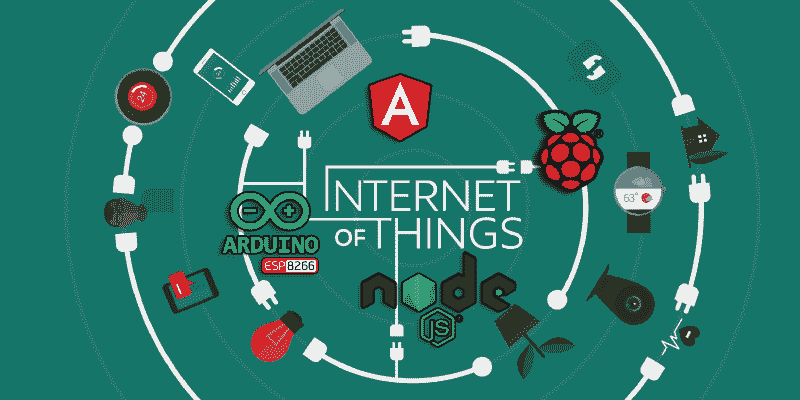

Image source: ID 50165322 © Bakhtiar Zein | Dreamstime.com

*在这篇文章中，我将讨论如何在不依赖任何外部云服务的情况下，在树莓 Pi 上使用 Angular 和 Node.js 构建智能家庭自动化系统。*

### 介绍

在过去的几天里，我花了几个晚上的时间，使用 Angular 和 Node.js 设计和开发了一个基于 JavaScript 的家庭自动化系统。

事实证明，天涯何处无芳草——关于如何实现家庭自动化系统，有很多解决方案。一些人在“云中”提供付费服务，其他人解释如何使用一种叫做 MQTT 的技术来构建自己的服务。

没有一个解决方案对我有任何意义。所有选项要么价格昂贵，要么实施不便，甚至存在安全缺陷。

但是，在我们进一步讨论之前，让我们解释一下什么是 MQTT。MQTT 代表 **MQ 遥测传输**。它是一个发布/订阅、极其简单和轻量级的消息传递协议。MQTT 是为受限设备和低带宽、高延迟或不可靠的网络设计的。

设计原则是最小化网络带宽和设备资源需求，同时试图确保可靠性和某种程度的交付保证。这些原则也使协议[成为](http://mqtt.org)新兴的“机器对机器”(M2M)或联网设备的“物联网”世界的理想选择，并适用于带宽和电池电量非常宝贵的移动应用。

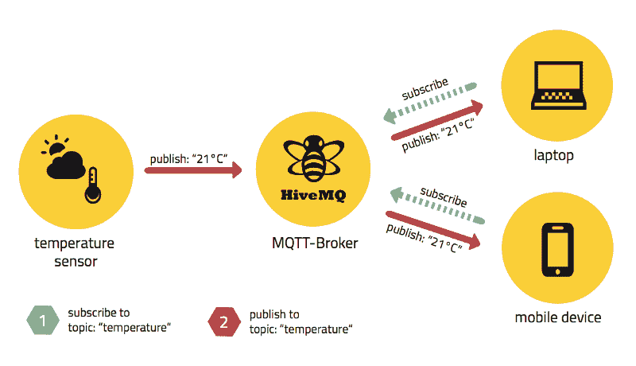

MQTT Publish/Subscribe Architecture (Image source: [HiveMQ.com](https://www.freecodecamp.org/news/the-most-robust-and-secure-home-automation-system-6d0ddbb39f29/www.hivemq.com))

为什么我不相信使用 MQTT，或者我在互联网上找到的任何解决方案？两个原因:

1.  虽然 MQTT 技术对于物联网设备来说似乎非常方便，但我仍然认为没有必要。我将在下面的教程中展示的系统运行在物联网设备所在的相同介质中。MQTT 在“快”和“低带宽”方面的所有优势都变得无关紧要。此外，它的实现还会带来很多麻烦，并且需要额外的 npm 包才能在 JavaScript 环境中工作。相反，我将只使用通用 JavaScript 和 Node.js 库，仅此而已！
2.  安全部分呢？嗯，我不是“云”或云计算的狂热粉丝。在某些情况下，它可能非常有益，但在大多数情况下，它只是不必要的。想一想:为什么你需要一个服务来控制你的家用电器，并把它托管在“云”的其他地方，而不是你自己的网络中？


*Comic by [Geek and Poke](http://geekandpoke.typepad.com/geekandpoke/2009/11/good-consultants.html)*

有人可能认为“云”提供了通过互联网从世界任何地方访问你的家用电器的能力。

但是想想这个:当你的家庭网络没有互联网连接时，“云”就变得多余了。更重要的是，即使您的家庭自动化系统托管在本地网络上，您仍然可以使用端口转发功能从互联网访问它。

这是我“点击”的时候，我想在一个树莓 Pi 上托管整个系统，并将其保存在我的本地网络中。

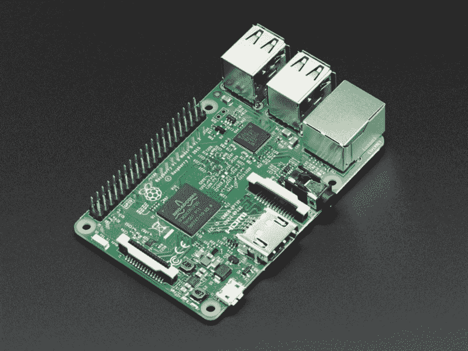

A Raspberry Pi 3 Model B

### 这项技术

1.  **软件:**我之所以选择 Angular 和 Node.js，是因为它们基于 JavaScript，我已经很熟悉了。毕竟，我想设计和开发一个渐进式 web 应用程序，通过 HTTP 与我的物联网设备进行通信 JavaScript 提供了我需要的所有功能。
2.  **硬件:**该系统可与 Arduino Uno/Mega/Du/MKR1000、Adafruit HUZZAH CC3000 等微控制器以及任何其他具有 WiFi 连接的微控制器配合使用。我正在使用 [**ESP8266**](https://medium.com/p/deb7bd1841c1?source=user_profile---------3------------------) 作为我的家庭自动化系统的基础组件。这是一个具有微控制器功能的低成本 WiFi 微芯片。它有我需要的一切，而且价格便宜！最后，我们需要将系统托管在本地网络的某个地方——那么还有什么比 Raspberry Pi 更好的呢？

这不会是一个让我深入研究编码的编码教程，因为这个项目是开源的，我将在 GitHub 上发布所有内容。我将只演示如何实现您自己的家庭自动化系统，并将经历每一步。如果你是一名开发人员，请 [**叉**](https://github.com/ameer157/smarthaus) 仓库并参与改进它。

### 设置

我估计完成整个设置需要大约 40 分钟，再加上在线搜索安装错误解决方案的时间。

#### 需要什么？

需要一份树莓派。在我的例子中，我使用的是 Raspberry Pi 3，但它应该适用于大多数版本。需要的组件有:

1.  树莓皮板
2.  MicroSD 卡(建议使用 16 GB 或更高的 10 类卡)
3.  USB MicroSD 读卡器或 SD 卡适配器
4.  HDMI 显示器和 USB 键盘(仅在首次启动 Raspberry Pi 时临时需要)
5.  以太网电缆(Raspberry Pi 3 不需要，因为它内置了 WiFi)

#### 在 Raspberry Pi 上安装 Raspbian OS

Raspbian 是基于 Debian Linux 的免费操作系统，针对 Raspberry Pi 进行了优化。

**我推荐**无头的“精简版”。它没有桌面环境或任何图形用户界面，可以通过 SSH 从同一网络上的计算机或设备远程访问。我们保持事情简单，因为这是我们访问 Raspberry Pi 的唯一方式。精简版拥有我们需要的所有功能。

1.  从树莓派官方网站下载 [**最新**](https://www.raspberrypi.org/downloads/raspbian/) Raspbian 图片。
2.  用 [**蚀刻机**](https://etcher.io/) 或者你选择的任何其他操作系统映像刻录软件将 Raspbian 操作系统映像刷新到 SD 卡。

#### 设置树莓 Pi

要准备好启动 Raspberry Pi，我们需要:

1.  将 MicroSD 卡插入 Raspberry Pi
2.  连接 USB 键盘和 HDMI 电缆
3.  连接以太网电缆，或者如果您有 Raspberry Pi 3 并想使用 WiFi，您应该在下一部分设置网络

当 Raspberry Pi 完成启动后，使用用户名`pi`和密码`raspberry`登录

#### 启用 WiFi 并连接到网络

**如果您选择使用以太网电缆连接，请跳过此步骤**。

1.  打开“wpa-恳求者”配置文件

```
$ sudo nano /etc/wpa_supplicant/wpa_supplicant.conf
```

2.添加您的 wifi 名称和密码时，在文件底部添加以下内容:

```
network={
```

```
 ssid="your_networks_name"   psk="your_networks_password"
```

```
}
```

**3。**按`Ctrl+X`保存代码。用`Y`然后用`Enter`确认

**4。**使用以下命令重新启动 Raspberry Pi:

```
$ sudo reboot
```

#### **启用 SSH 并更改用户名和密码**

现在 Raspberry Pi 已连接到互联网，建议更改默认密码。

1.  打开 Raspberry Pi 配置工具，单击第二个选项“更改用户密码”,然后按照说明进行操作

```
$ sudo raspi-config
```

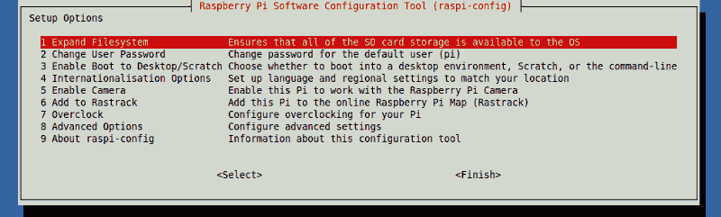

**2。**选择选项 5“接口选项”,然后激活 SSH

**3。**重启树莓 Pi。当它启动时，您已经启用了 SSH，并且可以从您的桌面计算机远程访问它

```
$ sudo reboot
```

#### 配置对 Raspberry Pi 的远程访问

现在，最后，我们在 Raspberry Pi 上安装所需软件的部分。这一部分可以使用 HDMI 监视器和 USB 键盘，通过终端直接在 Pi 上执行。为了方便起见，由于我们启用了远程 SSH 连接，我们将从另一个桌面环境进行连接。无论何时需要更改和配置，这都是远程访问和控制 Pi 的最佳和最简单的方法。

所以，基本上，这就是你如何使用 SSH 从另一台计算机或同一网络上的任何设备远程访问 Raspberry Pi 的命令行界面。这可以通过两种方式实现:

1.  使用命令提示符或 PowerShell(我在台式计算机上使用的是 Windows)，替换为您的用户名和 IP 地址

```
$ ssh username@ipaddress
```

如果你**不知道**的 IP 地址，在 Raspberry Pi 命令行中键入“`hostname -I"`”。

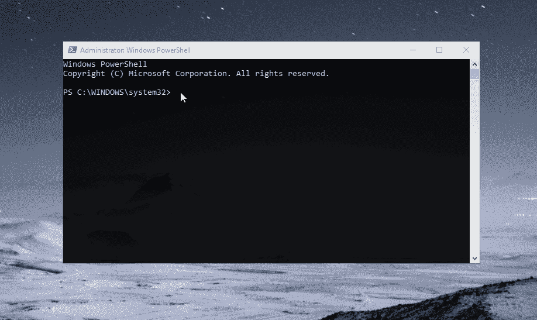

**2。**第二种方法是使用客户端程序，如 [**PuTTY**](https://www.putty.org/) 或任何 [**其他**](https://www.google.co.il/search?q=ssh+client) 运行正常的客户端 SSH 软件。这里有一个简单的使用油灰的 [**指南**](https://www.raspberrypi.org/documentation/remote-access/ssh/windows.md) 。

#### 在 Raspberry Pi 上安装所需的软件

在安装任何东西之前，建议更新 Raspberry Pi 的操作系统和软件包。定期这样做将使它保持最新。

1.  使用以下命令更新系统软件包列表:

```
$ sudo apt-get update
```

**2。**将所有已安装的软件包升级到最新版本:

```
$ sudo apt-get dist-upgrade
```

**3。**下载并安装 Node.js 的最新版本:

```
// To download$ curl -sL https://deb.nodesource.com/setup_8.x | sudo -E bash -
```

```
// To install$ sudo apt-get install -y nodejs
```

```
// Check if the installation was successful:$ node -v
```

**4。**全球安装 Angular CLI:

```
$ npm install -g @angular/cli
```

**5。**安装 Git 版本控制系统:

```
$ sudo apt-get install git
```

#### 安装数据库(MongoDB)

我们需要一个数据库来存储注册用户和他们的凭证。以下是必需的步骤:

1.  安装 MongoDB

```
$ sudo apt-get install mongodb
```

2.启动 MongoDB 进程

```
$ sudo service mongodb start
```

3.启动 mongo Shell

```
$ mongo
```

3.创建名为“smarthaus”的数据库

```
$ use smarthaus
```

在 MongoDB 中，默认数据库是 test。如果您没有创建任何数据库，那么集合将被存储在测试数据库中。

#### 安装智能房屋

**1。**使用以下命令检查当前工作目录:

```
$ pwd
```

```
/* It will probably print "/home/pi"   where "pi" is the current user directory */
```

**建议**在 pi 的用户目录下克隆项目的存储库，但是如果您确定的话，您可以导航到其他地方。

**2。**从以下位置克隆存储库:

```
$ git clone https://github.com/ameer157/smarthaus.git
```

确保使用以下命令在目录中导航:

```
$ cd smarthaus
```

在使用“npm install”安装任何 npm 软件包之前，请参考 [**npm 指南以修复权限**](https://docs.npmjs.com/getting-started/fixing-npm-permissions#option-two-change-npms-default-directory) ，了解如何修复您在安装过程中可能面临的任何“ **EACCESS** ”错误。这是**非常重要的**，因为它将防止任何 npm 权限错误，并允许您在不使用 sudo 的情况下全局安装软件包。不建议将 sudo 与 npm 一起使用，并且应避免使用[](https://medium.com/@ExplosionPills/dont-use-sudo-with-npm-still-66e609f5f92)**。**

****3。**安装项目所需的所有软件包:**

```
`$ npm install`
```

**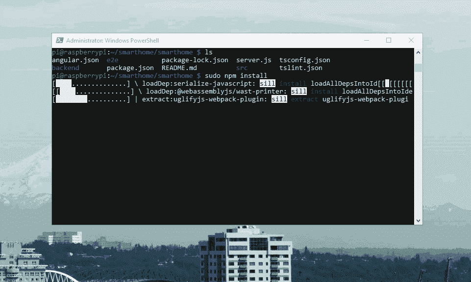**

#### **启动 Node.js 服务器**

**在启动服务器之前，我们需要使用 Angular CLI 工具构建项目。最后，我们配置 Raspberry Pi，以便它在启动时运行服务器。**

1.  **使用以下方式构建项目:**

```
`$ ng build --prod`
```

****2。**使用`nano`编辑`rc.local`文件:**

```
`$ sudo nano /etc/rc.local`
```

****3。**在`exit 0`前一行添加以下内容，然后退出并保存文件:**

```
`su pi -c 'cd /home/pi/smarthaus/backend && sudo node server.js > log.txt &'`
```

**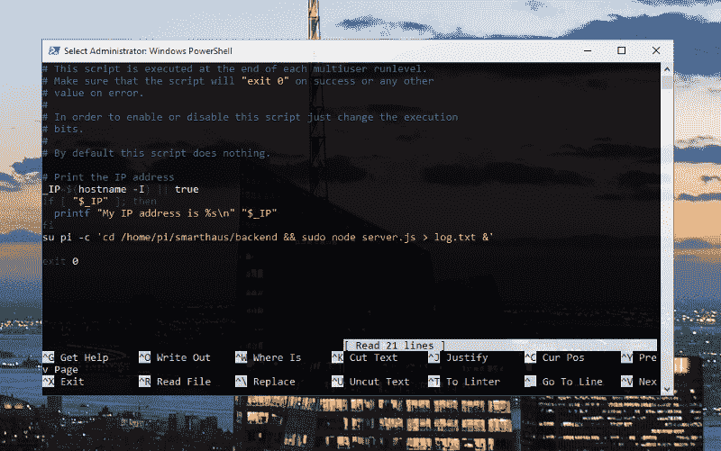**

**Node.js 服务器现在已经准备好了！它将在每次系统启动时运行，并将日志保存在同一目录下的“log.txt”文件中。**

**让我们现在运行它，看看使用这个命令是否有效:**

```
`$ sudo node server`
```

**现在，您可以通过 Raspberry Pi 的 IP 地址从网络上的任何设备访问该系统。**

**请继续进行 [**叉**](https://github.com/ameer157/smarthaus) 这个项目，并参与开发缺失的部分？**

### **结束了**

**我们在本地网络中的 Raspberry Pi 上安全地运行了一个家庭自动化系统，而没有使用“云”或其他人的服务器。**

**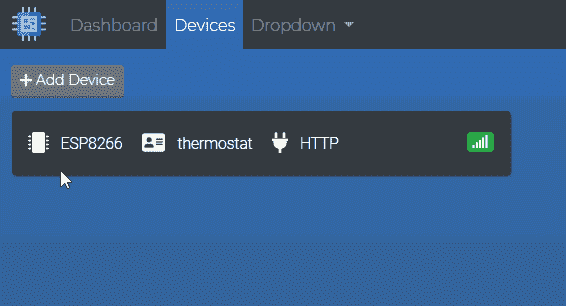****

Real-time device status synchronization** **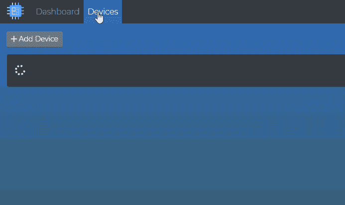****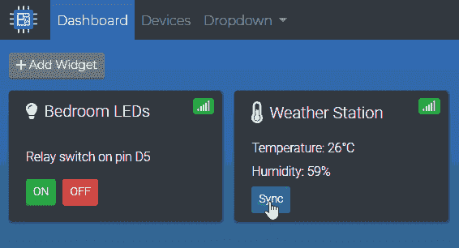

Adding a new device synchronising data on-demand** 

**我的树莓派坐在客厅我的 [**Fingbox**](http://bit.ly/2OiO1Pm) 和路由器旁边？**

**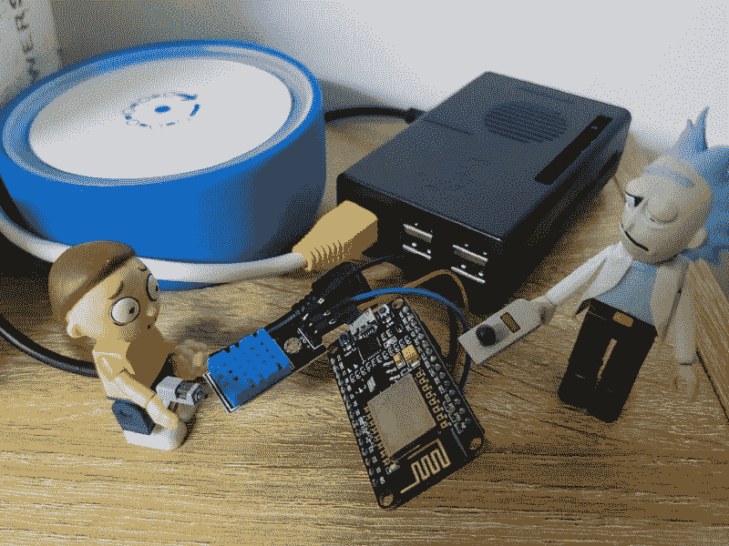

Rick and Morty providing tech support ??** 

**我希望你喜欢阅读，
请 [**关注**](https://medium.com/@ameer157) 和**分享**更多科技内容？？**

****