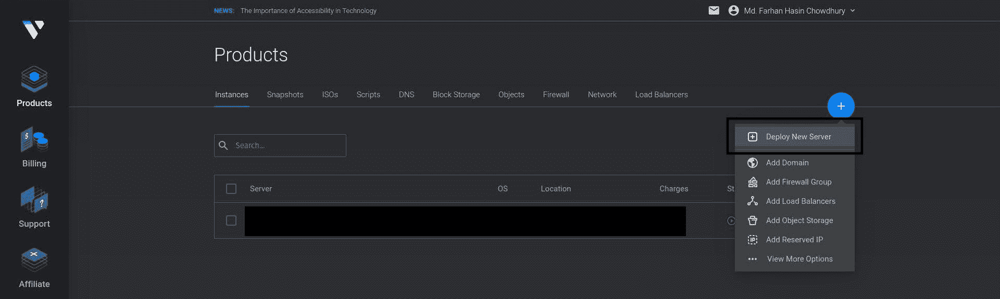
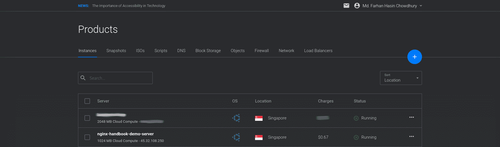
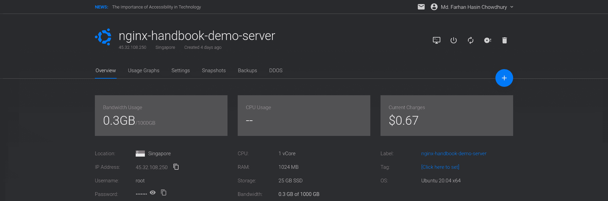
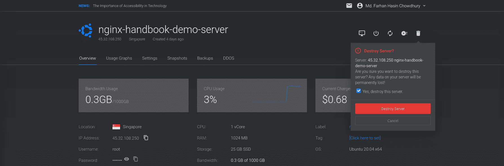
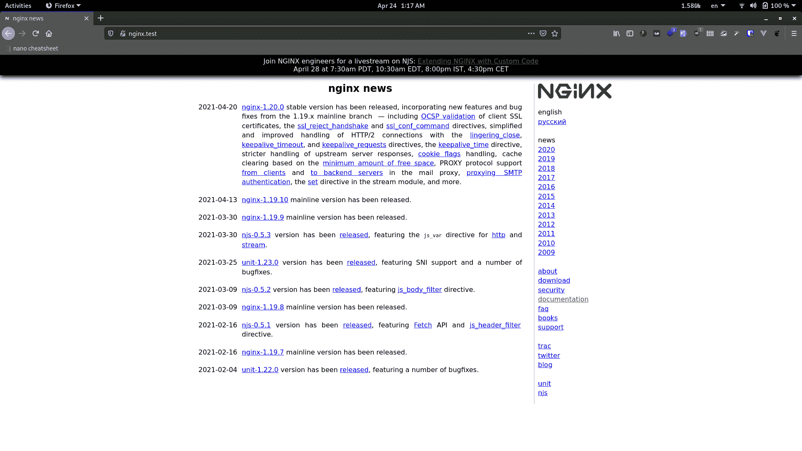
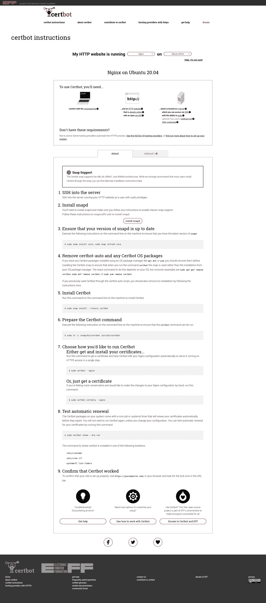
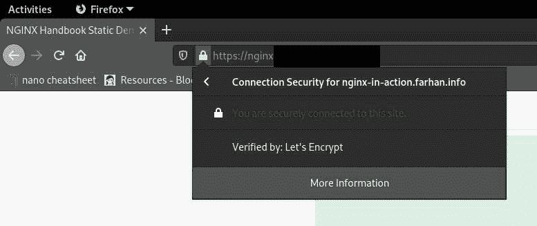
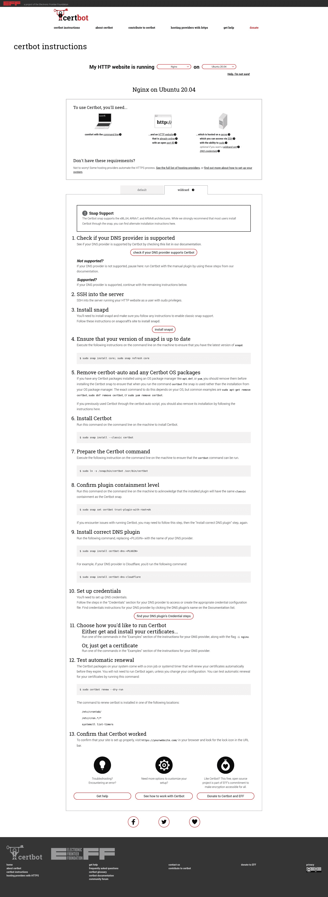
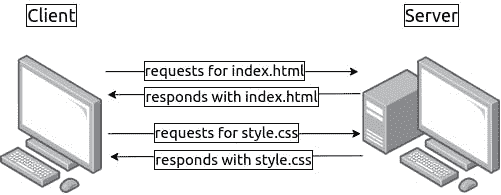
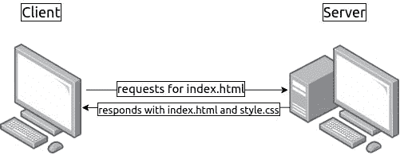

# NGINX 手册——初学者学习 NGINX

> 原文：<https://www.freecodecamp.org/news/the-nginx-handbook/>

一位名叫伊戈尔·塞索耶夫的年轻俄罗斯开发人员因旧的网络服务器无法处理超过 1 万个并发请求而感到沮丧。这是一个被称为 [C10k 问题](https://en.wikipedia.org/wiki/C10k_problem)的问题。作为对这个问题的回答，他早在 2002 年就开始开发新的网络服务器。

NGINX 于 2004 年根据 [2 条款 BSD](https://en.wikipedia.org/wiki/2-clause_BSD) 许可条款首次向公众发布。根据【2021 年 3 月的网络服务器调查，NGINX 拥有 35.3%的市场份额，共有 4.196 亿个网站。

多亏了像[数字海洋](https://digitalocean.com/)的 [NGINXConfig](https://www.digitalocean.com/community/tools/nginx) 这样的工具和互联网上大量预先编写的配置文件，当涉及到配置 NGINX 时，人们倾向于进行大量的复制粘贴，而不是试图理解。


Trust me, it's not that hard...

我不是说抄袭代码不好，但是不理解就抄袭代码是一个很大的“不可以”。

此外，NGINX 是一种应该根据要服务的应用程序的要求和主机上的可用资源进行精确配置的软件。

这就是为什么不要盲目地复制，你应该理解并微调你所复制的东西——这也是这本手册出现的原因。

通读整本书后，您应该能够:

*   理解流行工具生成的配置文件以及各种文档中的配置文件。
*   从头开始将 NGINX 配置为 web 服务器、反向代理服务器和负载平衡器。
*   优化 NGINX 以获得服务器的最大性能。

## 先决条件

*   熟悉 Linux 终端和常用的 Unix 程序，如`ls`、`cat`、`ps`、`grep`、`find`、`nproc`、`ulimit`、`nano`。
*   一台强大到足以运行虚拟机或 5 美元虚拟专用服务器的计算机。
*   了解 web 应用程序和编程语言，如 JavaScript 或 PHP。

## 目录

*   [NGINX 简介](#introduction-to-nginx)
*   [如何安装 NGINX](#how-to-install-nginx)
    *   [如何配置本地虚拟机](#how-to-provision-a-local-virtual-machine)
    *   [如何配置虚拟专用服务器](#how-to-provision-a-virtual-private-server)
    *   [如何在已配置的服务器或虚拟机上安装 NGINX](#how-to-install-nginx-on-a-provisioned-server-or-virtual-machine)
*   [NGINX 配置文件介绍](#introduction-to-nginx-s-configuration-files)
*   [如何配置基本 Web 服务器](#how-to-configure-a-basic-web-server)
    *   [如何编写你的第一个配置文件](#how-to-write-your-first-configuration-file)
    *   [如何验证和重新加载配置文件](#how-to-validate-and-reload-configuration-files)
    *   [如何理解 NGINX 中的指令和上下文](#how-to-understand-directives-and-contexts-in-nginx)
    *   [如何使用 NGINX 提供静态内容](#how-to-serve-static-content-using-nginx)
    *   [NGINX 中的静态文件类型处理](#static-file-type-handling-in-nginx)
    *   [如何包含部分配置文件](#how-to-include-partial-config-files)
*   [NGINX 中的动态路由](#dynamic-routing-in-nginx)
    *   [位置匹配](#location-matches)
    *   [NGINX 中的变量](#variables-in-nginx)
    *   [重定向和重写](#redirects-and-rewrites)
    *   [如何尝试多个文件](#how-to-try-for-multiple-files)
*   [登录 NGINX](#logging-in-nginx)
*   [如何使用 NGINX 作为反向代理](#how-to-use-nginx-as-a-reverse-proxy)
    *   [带有 NGINX 的 Node.js】](#node-js-with-nginx)
    *   [使用 NGINX 的 PHP](#php-with-nginx)
*   [如何使用 NGINX 作为负载均衡器](#how-to-use-nginx-as-a-load-balancer)
*   [如何优化 NGINX 以获得最佳性能](#how-to-optimize-nginx-for-maximum-performance)
    *   [如何配置工作进程和工作连接](#how-to-configure-worker-processes-and-worker-connections)
    *   [如何缓存静态内容](#how-to-cache-static-content)
    *   [如何压缩响应](#how-to-compress-responses)
*   [如何理解主配置文件](#how-to-understand-the-main-configuration-file)
*   [如何配置 SSL 和 HTTP/2](#how-to-configure-ssl-and-http-2)
    *   [如何配置 SSL](#how-to-configure-ssl)
    *   [如何启用 HTTP/2](#how-to-enable-http-2)
    *   [如何启用服务器推送](#how-to-enable-server-push)
*   [结论](#conclusion)

## 项目代码

您可以在以下存储库中找到示例项目的代码:

[fhsinchy/nginx-handbook-projectsProject codes used in “The NGINX Handbook” . Contribute to fhsinchy/nginx-handbook-projects development by creating an account on GitHub.fhsinchyGitHub](https://github.com/fhsinchy/nginx-handbook-projects)

spare a ⭐ to keep me motivated

## NGINX 简介

NGINX 是一款高性能的网络服务器，旨在满足现代网络日益增长的需求。它专注于高性能、高并发性和低资源使用。尽管 NGINX 通常被称为 web 服务器，但其核心是一个[反向代理](https://en.wikipedia.org/wiki/Reverse_proxy)服务器。

然而，NGINX 并不是市场上唯一的网络服务器。它最大的竞争对手之一是 Apache HTTP Server(httpd)T1，最早发布于 1995 年。尽管 Apache HTTP Server 更加灵活，但服务器管理员通常更喜欢 NGINX，原因有两个:

*   它可以处理更多的并发请求。
*   它以较低的资源使用量提供更快的静态内容。

我不会深入讨论整个 Apache vs NGINX 的争论。但是如果你想详细了解它们之间的区别，贾斯汀·艾林伍德在[发表的这篇优秀的](https://www.digitalocean.com/community/users/jellingwood)[文章](https://www.digitalocean.com/community/tutorials/apache-vs-nginx-practical-considerations)可能会有所帮助。

事实上，为了解释 NGINX 的请求处理技术，我想在这里引用 Justin 文章中的两段话:

> Nginx 在 Apache 之后出现，对大规模站点面临的并发问题有了更多的认识。利用这些知识，Nginx 被从头设计为使用异步、非阻塞、事件驱动的连接处理算法。
> 
> Nginx 衍生出 worker 进程，每个进程可以处理成千上万个连接。工作进程通过实现快速循环机制来实现这一点，该机制持续检查和处理事件。将实际工作从连接中分离出来，使得每个工作者只在新事件被触发时才关心连接。

如果理解起来有点复杂，不要担心。现在对内部工作有一个基本的了解就足够了。


NGINX 在静态内容交付方面速度更快，同时占用的资源相对较少，因为它没有嵌入动态编程语言处理器。当对静态内容的请求到来时，NGINX 只是用文件来响应，而不运行任何额外的进程。

这并不意味着 NGINX 不能处理需要动态编程语言处理器的请求。在这种情况下，NGINX 简单地将任务委托给单独的进程，如 [PHP-FPM](https://www.php.net/manual/en/install.fpm.php) 、 [Node.js](https://nodejs.org/) 或 [Python](https://python.org/) 。然后，一旦该进程完成了它的工作，NGINX 反向代理响应返回给客户端。


NGINX 的配置也更加容易，这要归功于从各种脚本语言中获得的配置文件语法，这种语法产生了紧凑的、易于维护的配置文件。

## 如何安装 NGINX

在基于 Linux 的系统上安装 NGINX 非常简单。你可以使用一个运行 [Ubuntu](https://ubuntu.com/) 的虚拟私有服务器作为你的游乐场，或者你可以在你的本地系统上使用 vagger 提供一个虚拟机。

在大多数情况下，提供一个本地虚拟机就足够了，这就是我在本文中使用的方法。

### 如何调配本地虚拟机

对于那些不知道的人来说，[vagger](https://vagrantup.com/)是由[哈希公司](https://www.hashicorp.com/)开发的一款开源工具，它允许你使用简单的配置文件来配置虚拟机。

为了让这种方法工作，你需要 [VirtualBox](https://www.virtualbox.org/wiki/Downloads/) 和[流浪者](https://www.vagrantup.com/downloads/)，所以先安装它们吧。如果你需要就这个话题做点热身，这个[教程](https://learn.hashicorp.com/collections/vagrant/getting-started/)可能会有所帮助。

用一个合理的名字在系统中的某个地方创建一个工作目录。我的是`~/vagrant/nginx-handbook`目录。

在工作目录中创建一个名为`Vagrantfile`的文件，并将以下内容放入其中:

```
Vagrant.configure("2") do |config|

    config.vm.hostname = "nginx-handbook-box"

    config.vm.box = "ubuntu/focal64"

    config.vm.define "nginx-handbook-box"

    config.vm.network "private_network", ip: "192.168.20.20"

    config.vm.provider "virtualbox" do |vb|
      vb.cpus = 1
      vb.memory = "1024"
      vb.name = "nginx-handbook"
    end

  end
```

这个`Vagrantfile`就是我前面讲的配置文件。它包含虚拟机名称、CPU 数量、RAM 大小、IP 地址等信息。

要使用此配置启动虚拟机，请在工作目录中打开您的终端并执行以下命令:

```
vagrant up

# Bringing machine 'nginx-handbook-box' up with 'virtualbox' provider...
# ==> nginx-handbook-box: Importing base box 'ubuntu/focal64'...
# ==> nginx-handbook-box: Matching MAC address for NAT networking...
# ==> nginx-handbook-box: Checking if box 'ubuntu/focal64' version '20210415.0.0' is up to date...
# ==> nginx-handbook-box: Setting the name of the VM: nginx-handbook
# ==> nginx-handbook-box: Clearing any previously set network interfaces...
# ==> nginx-handbook-box: Preparing network interfaces based on configuration...
#     nginx-handbook-box: Adapter 1: nat
#     nginx-handbook-box: Adapter 2: hostonly
# ==> nginx-handbook-box: Forwarding ports...
#     nginx-handbook-box: 22 (guest) => 2222 (host) (adapter 1)
# ==> nginx-handbook-box: Running 'pre-boot' VM customizations...
# ==> nginx-handbook-box: Booting VM...
# ==> nginx-handbook-box: Waiting for machine to boot. This may take a few minutes...
#     nginx-handbook-box: SSH address: 127.0.0.1:2222
#     nginx-handbook-box: SSH username: vagrant
#     nginx-handbook-box: SSH auth method: private key
#     nginx-handbook-box: Warning: Remote connection disconnect. Retrying...
#     nginx-handbook-box: Warning: Connection reset. Retrying...
#     nginx-handbook-box: 
#     nginx-handbook-box: Vagrant insecure key detected. Vagrant will automatically replace
#     nginx-handbook-box: this with a newly generated keypair for better security.
#     nginx-handbook-box: 
#     nginx-handbook-box: Inserting generated public key within guest...
#     nginx-handbook-box: Removing insecure key from the guest if it's present...
#     nginx-handbook-box: Key inserted! Disconnecting and reconnecting using new SSH key...
# ==> nginx-handbook-box: Machine booted and ready!
# ==> nginx-handbook-box: Checking for guest additions in VM...
# ==> nginx-handbook-box: Setting hostname...
# ==> nginx-handbook-box: Configuring and enabling network interfaces...
# ==> nginx-handbook-box: Mounting shared folders...
#     nginx-handbook-box: /vagrant => /home/fhsinchy/vagrant/nginx-handbook

vagrant status

# Current machine states:

# nginx-handbook-box           running (virtualbox) 
```

在您的系统上，`vagrant up`命令的输出可能不同，但是只要`vagrant status`说机器正在运行，您就可以开始了。

假设虚拟机现在正在运行，您应该能够 SSH 到它。为此，请执行以下命令:

```
vagrant ssh nginx-handbook-box

# Welcome to Ubuntu 20.04.2 LTS (GNU/Linux 5.4.0-72-generic x86_64)
# vagrant@nginx-handbook-box:~$ 
```

如果一切正常，您应该登录到您的虚拟机，这将通过您终端上的`vagrant@nginx-handbook-box`行显示出来。

该虚拟机可在您本地机器上的 **http://192.168.20.20** 上访问。您甚至可以通过向您的**主机**文件添加一个条目来为虚拟机分配一个自定义域，如**http://nginx-handbook . test**:

```
# on mac and linux terminal
sudo nano /etc/hosts

# on windows command prompt as administrator
notepad c:\windows\system32\drivers\etc\hosts
```

现在将下面一行附加到文件的末尾:

```
192.168.20.20   nginx-handbook.test 
```

现在，您应该能够在浏览器中访问**http://nginx-handbook . test**URI 上的虚拟机。

您可以通过在工作目录中执行以下命令来停止或销毁虚拟机:

```
# to stop the virtual machine
vagrant halt

# to destroy the virtual machine
vagrant destroy 
```

如果你想了解更多的流浪命令，这个[备忘单](https://gist.github.com/wpscholar/a49594e2e2b918f4d0c4)可能会派上用场。

现在你的系统上已经有了一个正常运行的 Ubuntu 虚拟机，剩下要做的就是[安装 NGINX](#how-to-install-nginx-on-a-provisioned-server-or-virtual-machine) 。

### 如何设置虚拟专用服务器

在这个演示中，我将使用 [Vultr](https://vultr.com/) 作为我的提供者，但是你也可以使用 [DigitalOcean](https://digitalocean.com/) 或者任何你喜欢的提供者。

假设您已经拥有提供商的帐户，请登录该帐户并部署新的服务器:



在 DigitalOcean 上，它通常被称为液滴。在下一个屏幕上，选择一个离你近的位置。我住在孟加拉国，这也是我选择新加坡的原因:


下一步，您必须选择操作系统和服务器大小。选择 Ubuntu 20.04 和尽可能小的服务器大小:


虽然生产服务器往往比这更大更强大，但是对于本文来说，一个微型服务器就足够了。

最后，对于最后一步，将类似于**nginx-hadnbook-demo-server**的东西作为服务器主机和标签。如果你愿意，你甚至可以让它们空着。

一旦您对自己的选择感到满意，请按下**立即部署**按钮。

部署过程可能需要一段时间才能完成，但完成后，您将在仪表板上看到新创建的服务器:



还要注意**状态——**应该是**运行**而不是**准备**或**停止**。要连接到服务器，您需要用户名和密码。



进入您的服务器的概述页面，您应该会看到服务器的 IP 地址、用户名和密码:

使用 SSH 登录服务器的通用命令如下:

```
ssh <username>@<ip address> 
```

所以在我的服务器中，它将是:

```
ssh root@45.77.251.108

# Are you sure you want to continue connecting (yes/no/[fingerprint])? yes
# Warning: Permanently added '45.77.251.108' (ECDSA) to the list of known hosts.

# root@45.77.251.108's password: 
# Welcome to Ubuntu 20.04.2 LTS (GNU/Linux 5.4.0-65-generic x86_64)

# root@localhost:~# 
```

系统会询问您是否要继续连接到此服务器。用`yes`回答，然后你会被要求输入密码。从服务器概览页面复制密码，并粘贴到您的终端。

如果你做的一切都正确，你应该登录到你的服务器——你会在你的终端上看到`root@localhost`行。这里的`localhost`是服务器主机名，在您的情况下可能会有所不同。

您可以通过该服务器的 IP 地址直接访问它。或者，如果您拥有任何自定义域，您也可以使用它。

在整篇文章中，你会看到我将测试域添加到操作系统的`hosts`文件中。在真实服务器的情况下，您必须使用您的 DNS 提供商来配置这些服务器。

请记住，只要使用这台服务器，您就要付费。虽然费用应该很少，但我还是要警告你。您可以随时通过点击服务器概述页面上的垃圾箱图标来销毁服务器:



如果您拥有自定义域名，您可以给此服务器分配一个子域。现在你已经进入了服务器，剩下的就是[安装 NGINX](#how-to-install-nginx-on-a-provisioned-server-or-virtual-machine) 。

### 如何在已配置的服务器或虚拟机上安装 NGINX

假设您已经登录到您的服务器或虚拟机，您应该做的第一件事就是执行更新。为此，请执行以下命令:

```
sudo apt update && sudo apt upgrade -y 
```

更新后，通过执行以下命令安装 NGINX:

```
sudo apt install nginx -y
```

一旦安装完成，NGINX 应该自动注册为一个`systemd`服务，并且应该正在运行。要进行检查，请执行以下命令:

```
sudo systemctl status nginx

# ● nginx.service - A high performance web server and a reverse proxy server
#      Loaded: loaded (/lib/systemd/system/nginx.service; enabled; vendor preset: enabled)
#      Active: active (running) 
```

如果状态显示为`running`，那么您可以开始了。否则，您可以通过执行以下命令来启动该服务:

```
sudo systemctl start nginx
```

最后，为了直观地验证一切正常，请使用您最喜欢的浏览器访问您的服务器/虚拟机，您应该会看到 NGINX 的默认欢迎页面:


NGINX 通常安装在`/etc/nginx`目录下，我们在接下来的章节中的大部分工作将在这里完成。

恭喜你！如何在你的服务器/虚拟机上运行 NGINX？现在是时候一头扎进 NGINX 了。

## NGINX 配置文件介绍

作为一个 web 服务器，NGINX 的工作是向客户端提供静态或动态内容。但是如何提供内容通常由配置文件控制。

NGINX 的配置文件以扩展名`.conf`结尾，通常位于`/etc/nginx/`目录中。让我们首先进入这个目录并获得所有文件的列表:

```
cd /etc/nginx

ls -lh

# drwxr-xr-x 2 root root 4.0K Apr 21  2020 conf.d
# -rw-r--r-- 1 root root 1.1K Feb  4  2019 fastcgi.conf
# -rw-r--r-- 1 root root 1007 Feb  4  2019 fastcgi_params
# -rw-r--r-- 1 root root 2.8K Feb  4  2019 koi-utf
# -rw-r--r-- 1 root root 2.2K Feb  4  2019 koi-win
# -rw-r--r-- 1 root root 3.9K Feb  4  2019 mime.types
# drwxr-xr-x 2 root root 4.0K Apr 21  2020 modules-available
# drwxr-xr-x 2 root root 4.0K Apr 17 14:42 modules-enabled
# -rw-r--r-- 1 root root 1.5K Feb  4  2019 nginx.conf
# -rw-r--r-- 1 root root  180 Feb  4  2019 proxy_params
# -rw-r--r-- 1 root root  636 Feb  4  2019 scgi_params
# drwxr-xr-x 2 root root 4.0K Apr 17 14:42 sites-available
# drwxr-xr-x 2 root root 4.0K Apr 17 14:42 sites-enabled
# drwxr-xr-x 2 root root 4.0K Apr 17 14:42 snippets
# -rw-r--r-- 1 root root  664 Feb  4  2019 uwsgi_params
# -rw-r--r-- 1 root root 3.0K Feb  4  2019 win-utf
```

在这些文件中，应该有一个名为 **nginx.conf** 的文件。这是 NGINX 的主要配置文件。您可以使用`cat`程序查看该文件的内容:

```
cat nginx.conf

# user www-data;
# worker_processes auto;
# pid /run/nginx.pid;
# include /etc/nginx/modules-enabled/*.conf;

# events {
#     worker_connections 768;
#     # multi_accept on;
# }

# http {

#     ##
#     # Basic Settings
#     ##

#     sendfile on;
#     tcp_nopush on;
#     tcp_nodelay on;
#     keepalive_timeout 65;
#     types_hash_max_size 2048;
#     # server_tokens off;

#     # server_names_hash_bucket_size 64;
#     # server_name_in_redirect off;

#     include /etc/nginx/mime.types;
#     default_type application/octet-stream;

#     ##
#     # SSL Settings
#     ##

#     ssl_protocols TLSv1 TLSv1.1 TLSv1.2 TLSv1.3; # Dropping SSLv3, ref: POODLE
#     ssl_prefer_server_ciphers on;

#     ##
#     # Logging Settings
#     ##

#     access_log /var/log/nginx/access.log;
#     error_log /var/log/nginx/error.log;

#     ##
#     # Gzip Settings
#     ##

#     gzip on;

#     # gzip_vary on;
#     # gzip_proxied any;
#     # gzip_comp_level 6;
#     # gzip_buffers 16 8k;
#     # gzip_http_version 1.1;
#     # gzip_types text/plain text/css application/json application/javascript text/xml application/xml application/xml+rss text/javascript;

#     ##
#     # Virtual Host Configs
#     ##

#     include /etc/nginx/conf.d/*.conf;
#     include /etc/nginx/sites-enabled/*;
# }

# #mail {
# #    # See sample authentication script at:
# #    # http://wiki.nginx.org/ImapAuthenticateWithApachePhpScript
# # 
# #    # auth_http localhost/auth.php;
# #    # pop3_capabilities "TOP" "USER";
# #    # imap_capabilities "IMAP4rev1" "UIDPLUS";
# # 
# #    server {
# #        listen     localhost:110;
# #        protocol   pop3;
# #        proxy      on;
# #    }
# # 
# #    server {
# #        listen     localhost:143;
# #        protocol   imap;
# #        proxy      on;
# #    }
# #}
```

哇哦！那是一大堆东西。试图理解这个文件的当前状态将是一场噩梦。因此，让我们重命名该文件并创建一个新的空文件:

```
# renames the file
sudo mv nginx.conf nginx.conf.backup

# creates a new file
sudo touch nginx.conf
```

我**强烈建议**不要编辑原始`nginx.conf`文件，除非你完全知道自己在做什么。出于学习的目的，你可以重新命名它，但是[稍后在](#how-to-understand-the-main-configuration-file)，我将向你展示你应该如何在现实生活中配置一个服务器。

## 如何配置基本 Web 服务器

在本书的这一部分中，您将最终通过从头开始配置一个基本的静态 web 服务器来动手。本节的目标是向您介绍 NGINX 配置文件的语法和基本概念。

### 如何编写您的第一个配置文件

首先使用 [nano](https://www.nano-editor.org/) 文本编辑器打开新创建的`nginx.conf`文件:

```
sudo nano /etc/nginx/nginx.conf
```

在整本书中，我将使用 nano 作为我的文本编辑器。如果你愿意，你可以使用更现代的东西，但是在现实生活中，你最有可能在服务器上使用 [nano](https://www.nano-editor.org/) 或 [vim](https://www.vim.org/) 而不是其他任何东西。所以，把这本书作为提高你纳米技能的一个机会。还有官方的[小抄](https://www.nano-editor.org/dist/latest/cheatsheet.html)随时供你参考。

打开文件后，将其内容更新为如下所示:

```
events {

}

http {

    server {

        listen 80;
        server_name nginx-handbook.test;

        return 200 "Bonjour, mon ami!\n";
    }

}
```

如果您有构建 REST APIs 的经验，那么您可能会从`return 200 "Bonjour, mon ami!\n";`行猜到服务器已经被配置为用状态代码 200 和消息“Bonjour，mon ami！”来响应。

如果你现在不明白更多的东西，也不要担心。我将逐行解释这个文件，但是首先让我们看看这个配置的运行情况。

### 如何验证和重新加载配置文件

在编写新的配置文件或更新旧的配置文件之后，首先要做的是检查文件是否有语法错误。`nginx`二进制文件包含一个选项`-t`来完成这个任务。

```
sudo nginx -t

# nginx: the configuration file /etc/nginx/nginx.conf syntax is ok
# nginx: configuration file /etc/nginx/nginx.conf test is successful
```

如果您有任何语法错误，这个命令会让您知道它们，包括行号。

虽然配置文件没问题，但是 NGINX 不会用。NGINX 的工作方式是，它读取一次配置文件，并在此基础上继续工作。

如果您更新配置文件，那么您必须明确地指示 NGINX 重新加载配置文件。有两种方法可以做到。

*   您可以通过执行`sudo systemctl restart nginx`命令来重启 NGINX 服务。
*   您可以通过执行`sudo nginx -s reload`命令向 NGINX 发送一个`reload`信号。

`-s`选项用于向 NGINX 发送各种信号。可用的信号有`stop`、`quit`、`reload`和`reopen`。在我刚刚提到的两种方法中，我更喜欢第二种，因为它需要更少的输入。

一旦您通过执行`nginx -s reload`命令重新加载了配置文件，您可以通过向服务器发送一个简单的 get 请求来查看它的运行情况:

```
curl -i http://nginx-handbook.test

# HTTP/1.1 200 OK
# Server: nginx/1.18.0 (Ubuntu)
# Date: Wed, 21 Apr 2021 10:03:33 GMT
# Content-Type: text/plain
# Content-Length: 18
# Connection: keep-alive

# Bonjour, mon ami!
```

服务器以状态代码 200 和预期的消息进行响应。恭喜你走到这一步！现在是解释的时候了。

### 如何理解 NGINX 中的指令和上下文

您在这里编写的几行代码，虽然看起来很简单，但是介绍了 NGINX 配置文件中两个最重要的术语。它们是**指令**和**语境**。

从技术上讲，NGINX 配置文件中的一切都是一个**指令**。指令有两种类型:

*   简单指令
*   块指令

一个简单的指令由指令名和空格分隔的参数组成，如`listen`、`return`等。简单指令以分号结束。

块指令类似于简单指令，除了它们不是以分号结尾，而是以一对花括号`{ }`结束，花括号中包含了额外的指令。

能够包含其他指令的块指令称为上下文，即`events`、`http`等等。NGINX 中有四个核心上下文:

*   `events { }`—`events`上下文用于设置关于 NGINX 如何在一般级别上处理请求的全局配置。一个有效的配置文件中只能有一个`events`上下文。
*   `http { }`–顾名思义，`http` context 用于定义服务器如何处理 HTTP 和 HTTPS 请求的配置。一个有效的配置文件中只能有一个`http`上下文。
*   `server { }`–`server`上下文嵌套在`http`上下文中，用于配置单个主机中的特定虚拟服务器。在一个有效的配置文件中，可以有多个`server`上下文嵌套在`http`上下文中。每个`server`上下文被认为是一个虚拟主机。
*   `main`–`main`上下文是配置文件本身。任何写在前面提到的三个上下文之外的东西都在`main`上下文中。

您可以像对待其他编程语言中的作用域一样对待 NGINX 中的上下文。其中也有传承感。你可以在官方的 NGINX 文档中找到按字母顺序排列的指令索引。

我已经提到过，在一个配置文件中可以有多个`server`上下文。但是当一个请求到达服务器时，NGINX 如何知道哪一个上下文应该处理这个请求呢？

`listen`指令是在配置中识别正确的`server`上下文的方法之一。考虑以下场景:

```
http {
    server {
        listen 80;
        server_name nginx-handbook.test;

        return 200 "hello from port 80!\n";
    }

    server {
        listen 8080;
        server_name nginx-handbook.test;

        return 200 "hello from port 8080!\n";
    }
} 
```

现在，如果你发送一个请求到 http://nginx-handbook.test:80，你将会收到“你好，来自端口 80！”作为回应。如果你发送一个请求到 http://nginx-handbook . test:8080，你会收到“hello from port 8080！”作为回应:

```
curl nginx-handbook.test:80

# hello from port 80!

curl nginx-handbook.test:8080

# hello from port 8080!
```

这两个服务器块就像两个人拿着电话听筒，当请求到达其中一个号码时等待响应。它们的编号由`listen`指令表示。

除了`listen`指令，还有`server_name`指令。考虑以下假想的图书馆管理应用程序的场景:

```
http {
    server {
        listen 80;
        server_name library.test;

        return 200 "your local library!\n";
    }

    server {
        listen 80;
        server_name librarian.library.test;

        return 200 "welcome dear librarian!\n";
    }
} 
```

这是虚拟主机概念的一个基本例子。您在同一台服务器上以不同的服务器名称运行两个独立的应用程序。

如果您向 http://library.test 发送一个请求，那么您将得到“您的本地库！”作为回应。如果你发送一个请求到 http://librarian.library.test，你会得到“欢迎亲爱的图书管理员！”作为回应。

```
curl http://library.test

# your local library!

curl http://librarian.library.test

# welcome dear librarian!
```

为了让这个演示在您的系统上运行，您必须更新您的`hosts`文件，以包含这两个域名:

```
192.168.20.20   library.test
192.168.20.20   librarian.library.test
```

最后，`return`指令负责向用户返回有效的响应。这个指令有两个参数:状态代码和要返回的字符串消息。

### 如何使用 NGINX 提供静态内容

现在您已经很好地理解了如何为 NGINX 编写一个基本的配置文件，让我们升级配置以服务静态文件而不是纯文本响应。

为了提供静态内容，首先必须将它们存储在服务器上的某个地方。如果您使用`ls`列出服务器根目录下的文件和目录，您会在那里找到一个名为`/srv`的目录:

```
ls -lh /

# lrwxrwxrwx   1 root    root       7 Apr 16 02:10 bin -> usr/bin
# drwxr-xr-x   3 root    root    4.0K Apr 16 02:13 boot
# drwxr-xr-x  16 root    root    3.8K Apr 21 09:23 dev
# drwxr-xr-x  92 root    root    4.0K Apr 21 09:24 etc
# drwxr-xr-x   4 root    root    4.0K Apr 21 08:04 home
# lrwxrwxrwx   1 root    root       7 Apr 16 02:10 lib -> usr/lib
# lrwxrwxrwx   1 root    root       9 Apr 16 02:10 lib32 -> usr/lib32
# lrwxrwxrwx   1 root    root       9 Apr 16 02:10 lib64 -> usr/lib64
# lrwxrwxrwx   1 root    root      10 Apr 16 02:10 libx32 -> usr/libx32
# drwx------   2 root    root     16K Apr 16 02:15 lost+found
# drwxr-xr-x   2 root    root    4.0K Apr 16 02:10 media
# drwxr-xr-x   2 root    root    4.0K Apr 16 02:10 mnt
# drwxr-xr-x   2 root    root    4.0K Apr 16 02:10 opt
# dr-xr-xr-x 152 root    root       0 Apr 21 09:23 proc
# drwx------   5 root    root    4.0K Apr 21 09:59 root
# drwxr-xr-x  26 root    root     820 Apr 21 09:47 run
# lrwxrwxrwx   1 root    root       8 Apr 16 02:10 sbin -> usr/sbin
# drwxr-xr-x   6 root    root    4.0K Apr 16 02:14 snap
# drwxr-xr-x   2 root    root    4.0K Apr 16 02:10 srv
# dr-xr-xr-x  13 root    root       0 Apr 21 09:23 sys
# drwxrwxrwt  11 root    root    4.0K Apr 21 09:24 tmp
# drwxr-xr-x  15 root    root    4.0K Apr 16 02:12 usr
# drwxr-xr-x   1 vagrant vagrant   38 Apr 21 09:23 vagrant
# drwxr-xr-x  14 root    root    4.0K Apr 21 08:34 var
```

该`/srv`目录旨在包含由该系统提供的站点特定数据。现在`cd`进入这个目录，克隆本书附带的代码库:

```
cd /srv

sudo git clone https://github.com/fhsinchy/nginx-handbook-projects.git
```

在`nginx-handbook-projects`目录中应该有一个名为`static-demo`的目录，总共包含四个文件:

```
ls -lh /srv/nginx-handbook-projects/static-demo

# -rw-r--r-- 1 root root 960 Apr 21 11:27 about.html
# -rw-r--r-- 1 root root 960 Apr 21 11:27 index.html
# -rw-r--r-- 1 root root 46K Apr 21 11:27 mini.min.css
# -rw-r--r-- 1 root root 19K Apr 21 11:27 the-nginx-handbook.jpg
```

现在您已经有了要提供的静态内容，请按如下方式更新您的配置:

```
events {

}

http {

    server {

        listen 80;
        server_name nginx-handbook.test;

        root /srv/nginx-handbook-projects/static-demo;
    }

} 
```

代码几乎是一样的，除了现在用一个`root`指令代替了`return`指令。该指令用于声明站点的根目录。

通过编写`root /srv/nginx-handbook-projects/static-demo`,您告诉 NGINX，如果有任何请求到达这个服务器，就在`/srv/nginx-handbook-projects/static-demo`目录中查找文件。由于 NGINX 是一个 web 服务器，它足够智能，可以默认提供`index.html`文件。

让我们看看这是否有效。测试并重新加载更新后的配置文件，然后访问服务器。您应该会看到一个有点破损的 HTML 站点:


虽然 NGINX 已经正确地提供了 index.html 文件，但从三个导航链接的外观来看，CSS 代码似乎不起作用。

你可能认为 CSS 文件有问题。但实际上，问题出在配置文件中。

### NGINX 中的静态文件类型处理

要调试您现在面临的问题，请向服务器发送 CSS 文件请求:

```
curl -I http://nginx-handbook/mini.min.css

# HTTP/1.1 200 OK
# Server: nginx/1.18.0 (Ubuntu)
# Date: Wed, 21 Apr 2021 12:17:16 GMT
# Content-Type: text/plain
# Content-Length: 46887
# Last-Modified: Wed, 21 Apr 2021 11:27:06 GMT
# Connection: keep-alive
# ETag: "60800c0a-b727"
# Accept-Ranges: bytes
```

注意**的内容类型**，看看它怎么说**文本/普通**而不是**文本/css** 。这意味着 NGINX 将这个文件作为纯文本而不是样式表提供。

尽管 NGINX 足够聪明，可以默认找到`index.html`文件，但在解释文件类型时却相当笨拙。要解决此问题，请再次更新您的配置:

```
events {

}

http {

    types {
        text/html html;
        text/css css;
    }

    server {

        listen 80;
        server_name nginx-handbook.test;

        root /srv/nginx-handbook-projects/static-demo;
    }
}
```

我们对代码所做的唯一更改是在`http`块中嵌套了一个新的`types`上下文。正如您可能已经从名称中猜到的那样，这个上下文用于配置文件类型。

通过在这个上下文中编写`text/html html`,您告诉 NGINX 将任何文件解析为以`html`扩展名结尾的`text/html`。

您可能认为配置 CSS 文件类型就足够了，因为 HTML 解析得很好——但事实并非如此

如果在配置中引入一个`types`上下文，NGINX 会变得更笨，只解析你配置的文件。因此，如果您只在这个上下文中定义了`text/css css`，那么 NGINX 将开始把 HTML 文件解析为纯文本。

验证并重新加载新更新的配置文件，并再次访问服务器。再次发送对 CSS 文件的请求，这次该文件应该被解析为一个 **text/css** 文件:

```
curl -I http://nginx-handbook.test/mini.min.css

# HTTP/1.1 200 OK
# Server: nginx/1.18.0 (Ubuntu)
# Date: Wed, 21 Apr 2021 12:29:35 GMT
# Content-Type: text/css
# Content-Length: 46887
# Last-Modified: Wed, 21 Apr 2021 11:27:06 GMT
# Connection: keep-alive
# ETag: "60800c0a-b727"
# Accept-Ranges: bytes
```

访问服务器进行视觉验证，这次站点应该看起来更好:


如果您已经正确地更新和重新加载了配置文件，并且您仍然看到旧站点，请执行硬刷新。

### 如何包含部分配置文件

在`types`上下文中映射文件类型可能适用于小项目，但是对于更大的项目来说可能会很麻烦并且容易出错。

NGINX 为这个问题提供了解决方案。如果您再次列出`/etc/nginx`目录中的文件，您会看到一个名为`mime.types`的文件。

```
ls -lh /etc/nginx

# drwxr-xr-x 2 root root 4.0K Apr 21  2020 conf.d
# -rw-r--r-- 1 root root 1.1K Feb  4  2019 fastcgi.conf
# -rw-r--r-- 1 root root 1007 Feb  4  2019 fastcgi_params
# -rw-r--r-- 1 root root 2.8K Feb  4  2019 koi-utf
# -rw-r--r-- 1 root root 2.2K Feb  4  2019 koi-win
# -rw-r--r-- 1 root root 3.9K Feb  4  2019 mime.types
# drwxr-xr-x 2 root root 4.0K Apr 21  2020 modules-available
# drwxr-xr-x 2 root root 4.0K Apr 17 14:42 modules-enabled
# -rw-r--r-- 1 root root 1.5K Feb  4  2019 nginx.conf
# -rw-r--r-- 1 root root  180 Feb  4  2019 proxy_params
# -rw-r--r-- 1 root root  636 Feb  4  2019 scgi_params
# drwxr-xr-x 2 root root 4.0K Apr 17 14:42 sites-available
# drwxr-xr-x 2 root root 4.0K Apr 17 14:42 sites-enabled
# drwxr-xr-x 2 root root 4.0K Apr 17 14:42 snippets
# -rw-r--r-- 1 root root  664 Feb  4  2019 uwsgi_params
# -rw-r--r-- 1 root root 3.0K Feb  4  2019 win-utf
```

让我们看看这个文件的内容:

```
cat /etc/mime.types

# types {
#     text/html                             html htm shtml;
#     text/css                              css;
#     text/xml                              xml;
#     image/gif                             gif;
#     image/jpeg                            jpeg jpg;
#     application/javascript                js;
#     application/atom+xml                  atom;
#     application/rss+xml                   rss;

#     text/mathml                           mml;
#     text/plain                            txt;
#     text/vnd.sun.j2me.app-descriptor      jad;
#     text/vnd.wap.wml                      wml;
#     text/x-component                      htc;

#     image/png                             png;
#     image/tiff                            tif tiff;
#     image/vnd.wap.wbmp                    wbmp;
#     image/x-icon                          ico;
#     image/x-jng                           jng;
#     image/x-ms-bmp                        bmp;
#     image/svg+xml                         svg svgz;
#     image/webp                            webp;

#     application/font-woff                 woff;
#     application/java-archive              jar war ear;
#     application/json                      json;
#     application/mac-binhex40              hqx;
#     application/msword                    doc;
#     application/pdf                       pdf;
#     application/postscript                ps eps ai;
#     application/rtf                       rtf;
#     application/vnd.apple.mpegurl         m3u8;
#     application/vnd.ms-excel              xls;
#     application/vnd.ms-fontobject         eot;
#     application/vnd.ms-powerpoint         ppt;
#     application/vnd.wap.wmlc              wmlc;
#     application/vnd.google-earth.kml+xml  kml;
#     application/vnd.google-earth.kmz      kmz;
#     application/x-7z-compressed           7z;
#     application/x-cocoa                   cco;
#     application/x-java-archive-diff       jardiff;
#     application/x-java-jnlp-file          jnlp;
#     application/x-makeself                run;
#     application/x-perl                    pl pm;
#     application/x-pilot                   prc pdb;
#     application/x-rar-compressed          rar;
#     application/x-redhat-package-manager  rpm;
#     application/x-sea                     sea;
#     application/x-shockwave-flash         swf;
#     application/x-stuffit                 sit;
#     application/x-tcl                     tcl tk;
#     application/x-x509-ca-cert            der pem crt;
#     application/x-xpinstall               xpi;
#     application/xhtml+xml                 xhtml;
#     application/xspf+xml                  xspf;
#     application/zip                       zip;

#     application/octet-stream              bin exe dll;
#     application/octet-stream              deb;
#     application/octet-stream              dmg;
#     application/octet-stream              iso img;
#     application/octet-stream              msi msp msm;

#     application/vnd.openxmlformats-officedocument.wordprocessingml.document    docx;
#     application/vnd.openxmlformats-officedocument.spreadsheetml.sheet          xlsx;
#     application/vnd.openxmlformats-officedocument.presentationml.presentation  pptx;

#     audio/midi                            mid midi kar;
#     audio/mpeg                            mp3;
#     audio/ogg                             ogg;
#     audio/x-m4a                           m4a;
#     audio/x-realaudio                     ra;

#     video/3gpp                            3gpp 3gp;
#     video/mp2t                            ts;
#     video/mp4                             mp4;
#     video/mpeg                            mpeg mpg;
#     video/quicktime                       mov;
#     video/webm                            webm;
#     video/x-flv                           flv;
#     video/x-m4v                           m4v;
#     video/x-mng                           mng;
#     video/x-ms-asf                        asx asf;
#     video/x-ms-wmv                        wmv;
#     video/x-msvideo                       avi;
# }
```

该文件包含一长串文件类型及其扩展名。要在您的配置文件中使用该文件，请更新您的配置，如下所示:

```
events {

}

http {

    include /etc/nginx/mime.types;

    server {

        listen 80;
        server_name nginx-handbook.test;

        root /srv/nginx-handbook-projects/static-demo;
    }

}
```

旧的`types`上下文现在已经被新的`include`指令所取代。顾名思义，这个指令允许您包含来自其他配置文件的内容。

验证并重新加载配置文件，并再次发送对`mini.min.css`文件的请求:

```
curl -I http://nginx-handbook.test/mini.min.css

# HTTP/1.1 200 OK
# Server: nginx/1.18.0 (Ubuntu)
# Date: Wed, 21 Apr 2021 12:29:35 GMT
# Content-Type: text/css
# Content-Length: 46887
# Last-Modified: Wed, 21 Apr 2021 11:27:06 GMT
# Connection: keep-alive
# ETag: "60800c0a-b727"
# Accept-Ranges: bytes
```

在下面关于如何理解主配置文件的部分，我将演示如何使用`include`来模块化您的虚拟服务器配置。

## NGINX 中的动态路由

您在上一节中编写的配置是一个非常简单的静态内容服务器配置。它所做的只是匹配与客户端访问的 URI 相对应的站点根目录中的文件，并作出响应。

因此，如果客户端请求存在于根目录下的文件，如`index.html`、`about.html`或`mini.min.css`，NGINX 将返回该文件。但是如果你访问一个像 http://nginx-handbook.test/nothing,这样的路线，它会用默认的 404 页面响应:


在本书的这一部分，您将了解到`location`上下文、变量、重定向、重写和`try_files`指令。这一部分不会有新的项目，但是您在这里学到的概念在接下来的部分中是必要的。

此外，本节中的配置会频繁更改，所以不要忘记在每次更新后验证并重新加载配置文件。

### 位置匹配

我们将在本节讨论的第一个概念是`location`上下文。按如下方式更新配置:

```
events {

}

http {

    server {

        listen 80;
        server_name nginx-handbook.test;

        location /agatha {
            return 200 "Miss Marple.\nHercule Poirot.\n";
        }
    }
}
```

我们已经用新的`location`上下文替换了`root`指令。这个上下文通常嵌套在`server`块中。在一个`server`上下文中可以有多个`location`上下文。

如果你向 http://nginx-handbook.test/agatha,发送一个请求，你会得到 200 个响应代码和由阿加莎·克里斯蒂创作的角色列表。

```
curl -i http://nginx-handbook.test/agatha

# HTTP/1.1 200 OK
# Server: nginx/1.18.0 (Ubuntu)
# Date: Wed, 21 Apr 2021 15:59:07 GMT
# Content-Type: text/plain
# Content-Length: 29
# Connection: keep-alive

# Miss Marple.
# Hercule Poirot.
```

现在，如果你向 http://nginx-handbook.test/agatha-christie,发出请求，你会得到同样的响应:

```
curl -i http://nginx-handbook.test/agatha-christie

# HTTP/1.1 200 OK
# Server: nginx/1.18.0 (Ubuntu)
# Date: Wed, 21 Apr 2021 15:59:07 GMT
# Content-Type: text/plain
# Content-Length: 29
# Connection: keep-alive

# Miss Marple.
# Hercule Poirot.
```

这是因为，通过编写`location /agatha`，你告诉 NGINX 匹配任何以“agatha”开头的 URI。这种匹配被称为**前缀匹配**。

要执行**精确匹配**，您必须按如下方式更新代码:

```
events {

}

http {

    server {

        listen 80;
        server_name nginx-handbook.test;

        location = /agatha {
            return 200 "Miss Marple.\nHercule Poirot.\n";
        }
    }

}
```

在位置 URI 前添加一个`=`符号将指示 NGINX 只有在 URL 完全匹配时才做出响应。现在，如果您向除了`/agatha`之外的任何东西发送请求，您将得到 404 响应。

```
curl -I http://nginx-handbook.test/agatha-christie

# HTTP/1.1 404 Not Found
# Server: nginx/1.18.0 (Ubuntu)
# Date: Wed, 21 Apr 2021 16:14:29 GMT
# Content-Type: text/html
# Content-Length: 162
# Connection: keep-alive

curl -I http://nginx-handbook.test/agatha

# HTTP/1.1 200 OK
# Server: nginx/1.18.0 (Ubuntu)
# Date: Wed, 21 Apr 2021 16:15:04 GMT
# Content-Type: text/plain
# Content-Length: 29
# Connection: keep-alive
```

NGINX 中的另一种匹配是**正则表达式匹配**。使用这种匹配，您可以根据复杂的正则表达式检查位置 URL。

```
events {

}

http {

    server {

        listen 80;
        server_name nginx-handbook.test;

        location ~ /agatha[0-9] {
        	return 200 "Miss Marple.\nHercule Poirot.\n";
        }
    }

}
```

通过用一个`~`符号替换之前使用的`=`符号，您告诉 NGINX 执行一个正则表达式匹配。将位置设置为`~ /agatha[0-9]`意味着 NIGINX 只有在单词“agatha”后面有数字时才会响应:

```
curl -I http://nginx-handbook.test/agatha

# HTTP/1.1 404 Not Found
# Server: nginx/1.18.0 (Ubuntu)
# Date: Wed, 21 Apr 2021 16:14:29 GMT
# Content-Type: text/html
# Content-Length: 162
# Connection: keep-alive

curl -I http://nginx-handbook.test/agatha8

# HTTP/1.1 200 OK
# Server: nginx/1.18.0 (Ubuntu)
# Date: Wed, 21 Apr 2021 16:15:04 GMT
# Content-Type: text/plain
# Content-Length: 29
# Connection: keep-alive
```

默认情况下，正则表达式匹配是区分大小写的，这意味着如果您将任何字母大写，位置将不起作用:

```
curl -I http://nginx-handbook.test/Agatha8

# HTTP/1.1 404 Not Found
# Server: nginx/1.18.0 (Ubuntu)
# Date: Wed, 21 Apr 2021 16:14:29 GMT
# Content-Type: text/html
# Content-Length: 162
# Connection: keep-alive
```

要将这变成不区分大小写，您必须在`~`符号后添加一个`*`。

```
events {

}

http {

    server {

        listen 80;
        server_name nginx-handbook.test;

        location ~* /agatha[0-9] {
        	return 200 "Miss Marple.\nHercule Poirot.\n";
        }
    }

}
```

这将告诉 NGINX 放弃类型敏感性并匹配位置。

```
curl -I http://nginx-handbook.test/agatha8

# HTTP/1.1 200 OK
# Server: nginx/1.18.0 (Ubuntu)
# Date: Wed, 21 Apr 2021 16:15:04 GMT
# Content-Type: text/plain
# Content-Length: 29
# Connection: keep-alive

curl -I http://nginx-handbook.test/Agatha8

# HTTP/1.1 200 OK
# Server: nginx/1.18.0 (Ubuntu)
# Date: Wed, 21 Apr 2021 16:15:04 GMT
# Content-Type: text/plain
# Content-Length: 29
# Connection: keep-alive
```

NGINX 为这些匹配分配优先级值，正则表达式匹配的优先级高于前缀匹配。

```
events {

}

http {

    server {

        listen 80;
        server_name nginx-handbook.test;

		location /Agatha8 {
        	return 200 "prefix matched.\n";
        }

        location ~* /agatha[0-9] {
        	return 200 "regex matched.\n";
        }
    }

}
```

现在，如果您向 http://nginx-handbook.test/Agatha8,发送请求，您将得到以下响应:

```
curl -i http://nginx-handbook.test/Agatha8

# HTTP/1.1 200 OK
# Server: nginx/1.18.0 (Ubuntu)
# Date: Thu, 22 Apr 2021 08:08:18 GMT
# Content-Type: text/plain
# Content-Length: 15
# Connection: keep-alive

# regex matched.
```

但是这个优先级可以稍微改一下。NGINX 中的最后一种匹配是**优先前缀匹配**。要将前缀匹配转换为优先匹配，您需要在位置 URI 之前包含`^~`修饰符:

```
events {

}

http {

    server {

        listen 80;
        server_name nginx-handbook.test;

		location ^~ /Agatha8 {
        	return 200 "prefix matched.\n";
        }

        location ~* /agatha[0-9] {
        	return 200 "regex matched.\n";
        }
    }

}
```

现在，如果您向 http://nginx-handbook.test/Agatha8,发送请求，您将得到以下响应:

```
curl -i http://nginx-handbook.test/Agatha8

# HTTP/1.1 200 OK
# Server: nginx/1.18.0 (Ubuntu)
# Date: Thu, 22 Apr 2021 08:13:24 GMT
# Content-Type: text/plain
# Content-Length: 16
# Connection: keep-alive

# prefix matched.
```

这一次，前缀匹配获胜。因此，所有匹配项的列表按优先级降序排列如下:

| 比赛 | 修饰语 |
| --- | --- |
| 确切的 | `=` |
| 优先前缀 | `^~` |
| 正则表达式 | `~`或`~*` |
| 前缀 | `None` |

### NGINX 中的变量

NGINX 中的变量类似于其他编程语言中的变量。`set`指令可用于在配置文件中的任何地方声明新变量:

```
set $<variable_name> <variable_value>;

# set name "Farhan"
# set age 25
# set is_working true
```

变量可以有三种类型

*   线
*   整数
*   布尔代数学体系的

除了您声明的变量，NGINX 模块中还有嵌入的变量。变量的字母索引可在官方文件中找到。

要查看运行中的一些变量，请按如下方式更新配置:

```
events {

}

http {

    server {

        listen 80;
        server_name nginx-handbook.test;

        return 200 "Host - $host\nURI - $uri\nArgs - $args\n";
    }

}
```

现在，向服务器发送请求后，您应该会得到如下响应:

```
# curl http://nginx-handbook.test/user?name=Farhan

# Host - nginx-handbook.test
# URI - /user
# Args - name=Farhan
```

如您所见，`$host`和`$uri`变量分别保存根地址和请求的相对于根的 URI。如您所见，`$args`变量包含了所有的查询字符串。

您可以使用`$arg`变量访问单个值，而不是打印查询字符串的文字字符串形式。

```
events {

}

http {

    server {

        listen 80;
        server_name nginx-handbook.test;

        set $name $arg_name; # $arg_<query string name>

        return 200 "Name - $name\n";
    }

}
```

现在，来自服务器的响应应该如下所示:

```
curl http://nginx-handbook.test?name=Farhan

# Name - Farhan
```

我在这里演示的变量嵌入在 [ngx_http_core_module](https://nginx.org/en/docs/http/ngx_http_core_module.html) 中。对于配置中可访问的变量，NGINX 必须用嵌入变量的模块构建。从动态模块的源代码和用法构建 NGINX 稍微超出了本文的范围。但我肯定会在我的博客上写下这一点。

### 重定向和重写

NGINX 中的重定向与任何其他平台中的重定向是一样的。要演示重定向是如何工作的，请更新您的配置，如下所示:

```
events {

}

http {

    include /etc/nginx/mime.types;

    server {

        listen 80;
        server_name nginx-handbook.test;

        root /srv/nginx-handbook-projects/static-demo;

        location = /index_page {
                return 307 /index.html;
        }

        location = /about_page {
                return 307 /about.html;
        }
    }
}
```

现在，如果你向 http://nginx-handbook.test/about_page,发送请求，你将被重定向到 http://nginx-handbook.test/about.html:

```
curl -I http://nginx-handbook.test/about_page

# HTTP/1.1 307 Temporary Redirect
# Server: nginx/1.18.0 (Ubuntu)
# Date: Thu, 22 Apr 2021 18:02:04 GMT
# Content-Type: text/html
# Content-Length: 180
# Location: http://nginx-handbook.test/about.html
# Connection: keep-alive
```

如您所见，服务器响应的状态代码为 307，位置显示为 http://nginx-handbook.test/about.html.。如果您从浏览器访问 http://nginx-handbook.test/about_page，您会看到 URL 会自动更改为 http://nginx-handbook.test/about.html.

然而,`rewrite`指令的工作方式略有不同。它在内部改变 URI，而不让用户知道。要查看它的运行情况，请按如下方式更新您的配置:

```
events {

}

http {

    include /etc/nginx/mime.types;

    server {

        listen 80;
        server_name nginx-handbook.test;

        root /srv/nginx-handbook-projects/static-demo;

        rewrite /index_page /index.html;

        rewrite /about_page /about.html;
    }
}
```

现在，如果你发送一个请求到 http://nginx-handbook/about _ page URI，你将得到一个 200 响应代码和 about.html 文件的 HTML 代码作为响应:

```
curl -i http://nginx-handbook.test/about_page

# HTTP/1.1 200 OK
# Server: nginx/1.18.0 (Ubuntu)
# Date: Thu, 22 Apr 2021 18:09:31 GMT
# Content-Type: text/html
# Content-Length: 960
# Last-Modified: Wed, 21 Apr 2021 11:27:06 GMT
# Connection: keep-alive
# ETag: "60800c0a-3c0"
# Accept-Ranges: bytes

# <!DOCTYPE html>
# <html lang="en">
# <head>
#     <meta charset="UTF-8">
#     <meta http-equiv="X-UA-Compatible" content="IE=edge">
#     <meta name="viewport" content="width=device-width, initial-scale=1.0">
#     <title>NGINX Handbook Static Demo</title>
#     <link rel="stylesheet" href="mini.min.css">
#     <style>
#         .container {
#             max-width: 1024px;
#             margin-left: auto;
#             margin-right: auto;
#         }
# 
#         h1 {
#             text-align: center;
#         }
#     </style>
# </head>
# <body class="container">
#     <header>
#         <a class="button" href="index.html">Index</a>
#         <a class="button" href="about.html">About</a>
#         <a class="button" href="nothing">Nothing</a>
#     </header>
#     <div class="card fluid">
#         
#     </div>
#     <div class="card fluid">
#         <h1>this is the <strong>about.html</strong> file</h1>
#     </div>
# </body>
# </html>
```

如果您使用浏览器访问 URI，您将看到 about.html 页面，而 URL 保持不变:


除了处理 URI 更改的方式，重定向和重写之间还有另一个区别。当重写发生时，`server`上下文被 NGINX 重新评估。因此，重写比重定向开销更大。

### 如何尝试多个文件

我将在本节展示的最后一个概念是`try_files`指令。`try_files`指令让您检查多个文件的存在，而不是用单个文件来响应。

```
events {

}

http {

    include /etc/nginx/mime.types;

    server {

        listen 80;
        server_name nginx-handbook.test;

        root /srv/nginx-handbook-projects/static-demo;

        try_files /the-nginx-handbook.jpg /not_found;

        location /not_found {
                return 404 "sadly, you've hit a brick wall buddy!\n";
        }
    }
}
```

如您所见，添加了一个新的`try_files`指令。通过编写`try_files /the-nginx-handbook.jpg /not_found;`,您可以指示 NGINX 在收到请求时在根目录下查找名为 the-nginx-handbook.jpg 的文件。如果不存在，请转到`/not_found`位置。

所以现在如果你访问服务器，你会看到图像:


但是，如果您更新配置以尝试一个不存在的文件，如 blackhole.jpg，您将得到一个 404 响应，并带有消息“很遗憾，您遇到了一个砖墙伙计！”。

现在，以这种方式编写`try_files`指令的问题是，不管你访问什么 URL，只要服务器收到请求，并且在磁盘上找到 the-nginx-handbook.jpg 文件，NGINX 就会把它发送回来。


这就是为什么`try_files`经常与`$uri` NGINX 变量一起使用。

```
events {

}

http {

    include /etc/nginx/mime.types;

    server {

        listen 80;
        server_name nginx-handbook.test;

        root /srv/nginx-handbook-projects/static-demo;

        try_files $uri /not_found;

        location /not_found {
                return 404 "sadly, you've hit a brick wall buddy!\n";
        }
    }
}
```

通过编写`try_files $uri /not_found;`,您指示 NGINX 首先尝试客户端请求的 URI。如果它找不到那个，那就试试下一个。

所以现在如果你去 http://nginx-handbook.test/index.html，你应该会看到以前的 index.html 页面。about.html 页面也是如此:


但是如果您请求一个不存在的文件，您将得到来自`/not_found`位置的响应:

```
curl -i http://nginx-handbook.test/nothing

# HTTP/1.1 404 Not Found
# Server: nginx/1.18.0 (Ubuntu)
# Date: Thu, 22 Apr 2021 20:01:57 GMT
# Content-Type: text/plain
# Content-Length: 38
# Connection: keep-alive

# sadly, you've hit a brick wall buddy!
```

您可能已经注意到，如果您访问服务器根目录 http://nginx-handbook.test，您会得到 404 响应。

这是因为当您访问服务器根目录时，`$uri`变量并不对应于任何现有文件，因此 NGINX 为您提供了后备位置。如果要解决此问题，请按如下方式更新您的配置:

```
events {

}

http {

    include /etc/nginx/mime.types;

    server {

        listen 80;
        server_name nginx-handbook.test;

        root /srv/nginx-handbook-projects/static-demo;

        try_files $uri $uri/ /not_found;

        location /not_found {
                return 404 "sadly, you've hit a brick wall buddy!\n";
        }
    }
}
```

通过编写`try_files $uri $uri/ /not_found;`,您指示 NGINX 首先尝试请求的 URI。如果这不起作用，那么尝试将请求的 URI 作为一个目录，每当 NGINX 进入一个目录时，它就会自动开始寻找一个 index.html 文件。

现在，如果您访问服务器，您应该会得到正确的 index.html 文件:


`try_files`是一种可以在许多变体中使用的指令。在接下来的部分中，您将会遇到一些其他的变化，但是我建议您自己在互联网上做一些关于这个指令的不同用法的研究。

## 登录 NGINX

默认情况下，NGINX 的日志文件位于`/var/log/nginx`内。如果您列出该目录的内容，您可能会看到如下内容:

```
ls -lh /var/log/nginx/

# -rw-r----- 1 www-data adm     0 Apr 25 07:34 access.log
# -rw-r----- 1 www-data adm     0 Apr 25 07:34 error.log
```

让我们从清空这两个文件开始。

```
# delete the old files
sudo rm /var/log/nginx/access.log /var/log/nginx/error.log

# create new files
sudo touch /var/log/nginx/access.log /var/log/nginx/error.log

# reopen the log files
sudo nginx -s reopen
```

如果你不向 NGINX 发送一个`reopen`信号，它将继续向先前打开的流写入日志，新文件将保持为空。

现在要在访问日志中创建一个条目，向服务器发送一个请求。

```
curl -I http://nginx-handbook.test

# HTTP/1.1 200 OK
# Server: nginx/1.18.0 (Ubuntu)
# Date: Sun, 25 Apr 2021 08:35:59 GMT
# Content-Type: text/html
# Content-Length: 960
# Last-Modified: Sun, 25 Apr 2021 08:35:33 GMT
# Connection: keep-alive
# ETag: "608529d5-3c0"
# Accept-Ranges: bytes

sudo cat /var/log/nginx/access.log 

# 192.168.20.20 - - [25/Apr/2021:08:35:59 +0000] "HEAD / HTTP/1.1" 200 0 "-" "curl/7.68.0"
```

如您所见，access.log 文件中添加了一个新条目。默认情况下，对服务器的任何请求都将记录到该文件中。但是我们可以使用`access_log`指令来改变这种行为。

```
events {

}

http {

    include /etc/nginx/mime.types;

    server {

        listen 80;
        server_name nginx-handbook.test;

        location / {
            return 200 "this will be logged to the default file.\n";
        }

        location = /admin {
            access_log /var/logs/nginx/admin.log;

            return 200 "this will be logged in a separate file.\n";
        }

        location = /no_logging {
            access_log off;

            return 200 "this will not be logged.\n";
        }
    }
}
```

/admin 位置块中的第一个`access_log`指令指示 NGINX 将这个 URI 的任何访问日志写入到`/var/logs/nginx/admin.log`文件中。/no_logging 位置中的第二个选项完全关闭该位置的访问日志。

验证并重新加载配置。现在，如果您向这些位置发送请求并检查日志文件，您应该会看到如下内容:

```
curl http://nginx-handbook.test/no_logging
# this will not be logged

sudo cat /var/log/nginx/access.log
# empty

curl http://nginx-handbook.test/admin
# this will be logged in a separate file.

sudo cat /var/log/nginx/access.log
# empty

sudo cat /var/log/nginx/admin.log 
# 192.168.20.20 - - [25/Apr/2021:11:13:53 +0000] "GET /admin HTTP/1.1" 200 40 "-" "curl/7.68.0"

curl  http://nginx-handbook.test/
# this will be logged to the default file.

sudo cat /var/log/nginx/access.log 
# 192.168.20.20 - - [25/Apr/2021:11:15:14 +0000] "GET / HTTP/1.1" 200 41 "-" "curl/7.68.0"
```

另一方面，error.log 文件保存失败日志。要在 error.log 中创建一个条目，您必须让 NGINX 崩溃。为此，请按如下方式更新您的配置:

```
events {

}

http {

    include /etc/nginx/mime.types;

    server {

        listen 80;
        server_name nginx-handbook.test;

        return 200 "..." "...";
    }

}
```

如您所知，`return`指令只有两个参数——但我们在这里给出了三个。现在尝试重新加载配置，您将看到一条错误消息:

```
sudo nginx -s reload

# nginx: [emerg] invalid number of arguments in "return" directive in /etc/nginx/nginx.conf:14
```

检查错误日志的内容，消息也应该出现在那里:

```
sudo cat /var/log/nginx/error.log 

# 2021/04/25 08:35:45 [notice] 4169#4169: signal process started
# 2021/04/25 10:03:18 [emerg] 8434#8434: invalid number of arguments in "return" directive in /etc/nginx/nginx.conf:14
```

错误消息有级别。错误日志中的`notice`条目是无害的，但是`emerg`或紧急条目必须立即处理。

有八个级别的错误消息:

*   `debug`–有助于确定问题所在的有用调试信息。
*   `info`–不需要阅读但了解一下可能会有好处的信息性消息。
*   发生了一些值得注意的正常事情。
*   发生了一些意想不到的事情，但没什么可担心的。
*   某事不成功。
*   有些问题需要认真解决。
*   `alert`–需要立即采取行动。
*   `emerg`–系统处于不可用状态，需要立即关注。

默认情况下，NGINX 记录所有级别的消息。您可以使用`error_log`指令来覆盖这种行为。如果您想将消息的最低级别设置为`warn`，请按如下方式更新您的配置文件:

```
events {

}

http {

    include /etc/nginx/mime.types;

    server {

        listen 80;
        server_name nginx-handbook.test;

    	error_log /var/log/error.log warn;

        return 200 "..." "...";
    }

}
```

验证并重新加载配置，从现在开始，只有级别为`warn`或以上的消息才会被记录。

```
cat /var/log/nginx/error.log

# 2021/04/25 11:27:02 [emerg] 12769#12769: invalid number of arguments in "return" directive in /etc/nginx/nginx.conf:16
```

与前面的输出不同，这里没有`notice`条目。`emerg`是比`warn`更高级别的错误，这就是它被记录的原因。

对于大多数项目，保持错误配置不变应该没问题。我唯一的建议是将最小误差水平设置为`warn`。这样，您就不必查看错误日志中不必要的条目。

但是如果你想了解更多关于在 NGINX 中定制日志的信息，这个官方文档的链接可能会有所帮助。

## 如何使用 NGINX 作为反向代理

当配置为反向代理时，NGINX 位于客户端和后端服务器之间。客户端向 NGINX 发送请求，然后 NGINX 将请求传递给后端。

一旦后端服务器处理完请求，它就将请求发送回 NGINX。反过来，NGINX 将响应返回给客户端。

在整个过程中，客户机不知道是谁在处理请求。这听起来很复杂，但是一旦你自己做了，你就会发现 NGINX 让它变得多么简单。

让我们来看一个非常基本且不切实际的反向代理示例:

```
events {

}

http {

    include /etc/nginx/mime.types;

    server {
        listen 80;
        server_name nginx.test;

        location / {
                proxy_pass "https://nginx.org/";
        }
    }
} 
```

除了验证和重新加载配置之外，您还必须将这个地址添加到您的`hosts`文件中，以使这个演示在您的系统上工作:

```
192.168.20.20   nginx.test
```

现在如果你访问 http://nginx.test，你会看到原来的[https://nginx.org](https://nginx.org)网站，而 URI 保持不变。



你甚至可以在一定程度上浏览这个网站。如果你访问 http://nginx.test/en/docs/，你会得到 http://nginx.org/en/docs/页面的回复。

如你所见，在基本层面上，`proxy_pass`指令只是将客户端的请求传递给第三方服务器，并将响应反向代理给客户端。

### 使用 NGINX 的 Node.js

现在您已经知道了如何配置一个基本的反向代理服务器，您可以服务一个由 NGINX 反向代理的 Node.js 应用程序。我在本文附带的存储库中添加了一个演示应用程序。

> 我假设您有使用 Node.js 的经验，并且知道如何使用 PM2 启动 Node.js 应用程序。

如果您已经在`/srv/nginx-handbook-projects`中克隆了存储库，那么`node-js-demo`项目应该在`/srv/nginx-handbook-projects/node-js-demo`目录中可用。

为了让这个演示运行，您需要在您的服务器上安装 Node.js。你可以按照[这里](https://github.com/nodesource/distributions#debinstall)的说明来做。

这个演示应用程序是一个简单的 HTTP 服务器，它用一个 200 状态代码和一个 JSON 有效负载进行响应。你可以通过简单地执行`node app.js`来启动应用程序，但是更好的方法是使用 [PM2](https://pm2.keymetrics.io) 。

对于那些不知道的人，PM2 是一个守护进程管理器，广泛用于 Node.js 应用程序的生产中。如果你想了解更多，这个[链接](https://pm2.keymetrics.io/docs/usage/quick-start/)可能会有帮助。

通过执行`sudo npm install -g pm2`来全局安装 PM2。安装完成后，在`/srv/nginx-handbook-projects/node-js-demo`目录中执行以下命令:

```
pm2 start app.js

# [PM2] Process successfully started
# ┌────┬────────────────────┬──────────┬──────┬───────────┬──────────┬──────────┐
# │ id │ name               │ mode     │ ↺    │ status    │ cpu      │ memory   │
# ├────┼────────────────────┼──────────┼──────┼───────────┼──────────┼──────────┤
# │ 0  │ app                │ fork     │ 0    │ online    │ 0%       │ 21.2mb   │
# └────┴────────────────────┴──────────┴──────┴───────────┴──────────┴──────────┘
```

或者，你也可以在服务器的任何地方做`pm2 start /srv/nginx-handbook-projects/node-js-demo/app.js`。您可以通过执行`pm2 stop app`命令来停止应用程序。

应用程序现在应该正在运行，但不应该从服务器外部访问。要验证应用程序是否正在运行，请从服务器内部向 http://localhost:3000 发送 get 请求:

```
curl -i localhost:3000

# HTTP/1.1 200 OK
# X-Powered-By: Express
# Content-Type: application/json; charset=utf-8
# Content-Length: 62
# ETag: W/"3e-XRN25R5fWNH2Tc8FhtUcX+RZFFo"
# Date: Sat, 24 Apr 2021 12:09:55 GMT
# Connection: keep-alive
# Keep-Alive: timeout=5

# { "status": "success", "message": "You're reading The NGINX Handbook!" }
```

如果您得到 200 响应，那么服务器运行良好。现在，要将 NGINX 配置为反向代理，请打开您的配置文件并更新其内容，如下所示:

```
events {

}

http {
    listen 80;
    server_name nginx-handbook.test

    location / {
        proxy_pass http://localhost:3000;
    }
}
```

这里没有什么新的东西需要解释。您只是将收到的请求传递给在端口 3000 上运行的 Node.js 应用程序。现在，如果您从外部向服务器发送请求，您应该会得到如下响应:

```
curl -i http://nginx-handbook.test

# HTTP/1.1 200 OK
# Server: nginx/1.18.0 (Ubuntu)
# Date: Sat, 24 Apr 2021 14:58:01 GMT
# Content-Type: application/json
# Transfer-Encoding: chunked
# Connection: keep-alive

# { "status": "success", "message": "You're reading The NGINX Handbook!" }
```

虽然这适用于这样的基本服务器，但是您可能需要添加一些指令，以便根据您的应用程序的需求使它在真实的场景中工作。

例如，如果您的应用程序处理 web 套接字连接，那么您应该按如下方式更新配置:

```
events {

}

http {
    listen 80;
    server_name nginx-handbook.test

    location / {
        proxy_pass http://localhost:3000;
        proxy_http_version 1.1;
        proxy_set_header Upgrade $http_upgrade;
        proxy_set_header Connection 'upgrade';
    }
}
```

`proxy_http_version`指令为服务器设置 HTTP 版本。默认情况下它是 1.0，但是 web socket 要求它至少是 1.1。`proxy_set_header`指令用于在后端服务器上设置头。该指令的通用语法如下:

```
proxy_set_header <header name> <header value>
```

因此，通过编写`proxy_set_header Upgrade $http_upgrade;`,您正在指示 NGINX 将`$http_upgrade`变量的值作为名为`Upgrade`的头传递——对于`Connection`头也是如此。

如果你想了解更多关于 web socket 代理的知识，这个到官方 NGINX 文档的链接可能会有所帮助。

根据应用程序所需的标题，您可能需要设置更多的标题。但是上面提到的配置通常用于服务 Node.js 应用程序。

### 使用 NGINX 的 PHP

PHP 和 NGINX 形影不离。毕竟 LEMP 堆栈中的 E 和 P 代表 NGINX 和 PHP。

> 我假设你有 PHP 经验，知道如何运行 PHP 应用程序。

我已经在本文附带的存储库中包含了一个演示 PHP 应用程序。如果您已经在`/srv/nginx-handbook-projects`目录中克隆了它，那么应用程序应该在`/srv/nginx-handbook-projects/php-demo`中。

为了让这个演示运行，你必须安装一个名为 PHP-FPM 的包。要安装该软件包，您可以执行以下命令:

```
sudo apt install php-fpm -y
```

为了测试这个应用程序，在`/srv/nginx-handbook-projects/php-demo`目录中执行下面的命令来启动一个 PHP 服务器:

```
php -S localhost:8000

# [Sat Apr 24 16:17:36 2021] PHP 7.4.3 Development Server (http://localhost:8000) started
```

或者，你也可以在服务器的任何地方做`php -S localhost:8000 /srv/nginx-handbook-projects/php-demo/index.php`。

应用程序应该在端口 8000 上运行，但是不能从服务器外部访问它。要进行验证，请从服务器内部向 http://localhost:8000 发送 get 请求:

```
curl -I localhost:8000

# HTTP/1.1 200 OK
# Host: localhost:8000
# Date: Sat, 24 Apr 2021 16:22:42 GMT
# Connection: close
# X-Powered-By: PHP/7.4.3
# Content-type: application/json

# {"status":"success","message":"You're reading The NGINX Handbook!"}
```

如果您得到 200 响应，那么服务器运行良好。就像 Node.js 配置一样，现在您可以简单地向 localhost:8000 发出请求——但是使用 PHP，有一种更好的方法。

PHP-FPM 中的 FPM 部分代表 FastCGI 进程模块。FastCGI 是一种类似 HTTP 的协议，用于交换二进制数据。该协议比 HTTP 稍快，并提供更好的安全性。

要使用 FastCGI 而不是 HTTP，请按如下方式更新您的配置:

```
events {

}

http {

      include /etc/nginx/mime.types;

      server {

          listen 80;
          server_name nginx-handbook.test;
          root /srv/nginx-handbook-projects/php-demo;

          index index.php;

          location / {
              try_files $uri $uri/ =404;
          }

          location ~ \.php$ {
              fastcgi_pass unix:/var/run/php/php7.4-fpm.sock;
              fastcgi_param REQUEST_METHOD $request_method;
              fastcgi_param SCRIPT_FILENAME $realpath_root$fastcgi_script_name;
      }
   }
}
```

让我们从新的`index`指令开始。如您所知，NGINX 默认情况下会寻找一个 index.html 文件来服务。但在演示项目中，它被称为 index.php。因此，通过编写`index index.php`，您正在指示 NGINX 使用 index.php 文件作为根。

这个指令可以接受多个参数。如果你写了类似`index index.php index.html`的东西，NGINX 会先找 index.php。如果找不到该文件，它将查找 index.html 文件。

第一个`location`上下文中的`try_files`指令与您在上一节中看到的相同。结尾的`=404`表示如果找不到任何文件时抛出的错误。

第二个`location`街区是主要魔法发生的地方。如你所见，我们已经用新的`fastcgi_pass`取代了`proxy_pass`指令。顾名思义，它用于将请求传递给 FastCGI 服务。

默认情况下，PHP-FPM 服务运行在主机的端口 9000 上。因此，您可以直接将请求传递给`http://localhost:9000`，而不是像我在这里所做的那样使用 Unix 套接字。但是使用 Unix 套接字更安全。

如果您安装了多个 PHP-FPM 版本，您可以通过执行以下命令简单地列出所有套接字文件的位置:

```
sudo find / -name *fpm.sock

# /run/php/php7.4-fpm.sock
# /run/php/php-fpm.sock
# /etc/alternatives/php-fpm.sock
# /var/lib/dpkg/alternatives/php-fpm.sock
```

`/run/php/php-fpm.sock`文件是指安装在你的系统上的 PHP-FPM 的最新版本。我更喜欢用有版本号的。这样，即使 PHP-FPM 得到更新，我也能确定我正在使用的版本。

与通过 HTTP 传递请求不同，通过 FPM 传递请求需要我们传递一些额外的信息。

向 FPM 服务传递额外信息的一般方式是使用`fastcgi_param`指令。至少，您必须将请求方法和脚本名称传递给后端服务，代理才能工作。

`fastcgi_param REQUEST_METHOD $request_method;`将请求方法传递给后端，`fastcgi_param SCRIPT_FILENAME $realpath_root$fastcgi_script_name;`行传递要运行的 PHP 脚本的确切位置。

在这种情况下，您的配置应该可以工作。要进行测试，请访问您的服务器，您应该会看到类似这样的信息:


这太奇怪了。500 错误意味着 NGINX 由于某种原因崩溃了。这就是错误日志派上用场的地方。让我们看看 error.log 文件中的最后一项:

```
tail -n 1 /var/log/nginx/error.log

# 2021/04/24 17:15:17 [crit] 17691#17691: *21 connect() to unix:/var/run/php/php7.4-fpm.sock failed (13: Permission denied) while connecting to upstream, client: 192.168.20.20, server: nginx-handbook.test, request: "GET / HTTP/1.1", upstream: "fastcgi://unix:/var/run/php/php7.4-fpm.sock:", host: "nginx-handbook.test"
```

看起来 NGINX 进程被拒绝访问 PHP-FPM 进程。

出现权限被拒绝错误的主要原因之一是用户不匹配。看看拥有 NGINX 工作进程的用户。

```
ps aux | grep nginx

# root         677  0.0  0.4   8892  4260 ?        Ss   14:31   0:00 nginx: master process /usr/sbin/nginx -g daemon on; master_process on;
# nobody     17691  0.0  0.3   9328  3452 ?        S    17:09   0:00 nginx: worker process
# vagrant    18224  0.0  0.2   8160  2552 pts/0    S+   17:19   0:00 grep --color=auto nginx
```

如您所见，该流程目前由`nobody`所有。现在检查 PHP-FPM 进程。

```
# ps aux | grep php

# root       14354  0.0  1.8 195484 18924 ?        Ss   16:11   0:00 php-fpm: master process (/etc/php/7.4/fpm/php-fpm.conf)
# www-data   14355  0.0  0.6 195872  6612 ?        S    16:11   0:00 php-fpm: pool www
# www-data   14356  0.0  0.6 195872  6612 ?        S    16:11   0:00 php-fpm: pool www
# vagrant    18296  0.0  0.0   8160   664 pts/0    S+   17:20   0:00 grep --color=auto php
```

另一方面，这个过程由`www-data`用户拥有。这就是 NGINX 被拒绝访问这个进程的原因。

要解决此问题，请按如下方式更新您的配置:

```
user www-data;

events {

}

http {

      include /etc/nginx/mime.types;

      server {

          listen 80;
          server_name nginx-handbook.test;
          root /srv/nginx-handbook-projects/php-demo;

          index index.php;

          location / {
              try_files $uri $uri/ =404;
          }

          location ~ \.php$ {
              fastcgi_pass unix:/var/run/php/php7.4-fpm.sock;
              fastcgi_param REQUEST_METHOD $request_method;
              fastcgi_param SCRIPT_FILENAME $realpath_root$fastcgi_script_name;
      }
   }
}
```

`user`指令负责设置 NGINX 工作进程的所有者。现在再次检查 NGINX 流程:

```
# ps aux | grep nginx

# root         677  0.0  0.4   8892  4264 ?        Ss   14:31   0:00 nginx: master process /usr/sbin/nginx -g daemon on; master_process on;
# www-data   20892  0.0  0.3   9292  3504 ?        S    18:10   0:00 nginx: worker process
# vagrant    21294  0.0  0.2   8160  2568 pts/0    S+   18:18   0:00 grep --color=auto nginx
```

毫无疑问，这个过程现在归`www-data`用户所有。向您的服务器发送请求以检查它是否工作:

```
# curl -i http://nginx-handbook.test

# HTTP/1.1 200 OK
# Server: nginx/1.18.0 (Ubuntu)
# Date: Sat, 24 Apr 2021 18:22:24 GMT
# Content-Type: application/json
# Transfer-Encoding: chunked
# Connection: keep-alive

# {"status":"success","message":"You're reading The NGINX Handbook!"}
```

如果您得到一个带有 JSON 有效负载的 200 状态代码，那么您就可以开始了。

这个简单的配置对于演示应用程序来说很好，但是在实际项目中，您必须传递一些额外的参数。

为此，NGINX 包含了一个名为`fastcgi_params`的部分配置。该文件包含最常见的 FastCGI 参数列表。

```
cat /etc/nginx/fastcgi_params

# fastcgi_param  QUERY_STRING       $query_string;
# fastcgi_param  REQUEST_METHOD     $request_method;
# fastcgi_param  CONTENT_TYPE       $content_type;
# fastcgi_param  CONTENT_LENGTH     $content_length;

# fastcgi_param  SCRIPT_NAME        $fastcgi_script_name;
# fastcgi_param  REQUEST_URI        $request_uri;
# fastcgi_param  DOCUMENT_URI       $document_uri;
# fastcgi_param  DOCUMENT_ROOT      $document_root;
# fastcgi_param  SERVER_PROTOCOL    $server_protocol;
# fastcgi_param  REQUEST_SCHEME     $scheme;
# fastcgi_param  HTTPS              $https if_not_empty;

# fastcgi_param  GATEWAY_INTERFACE  CGI/1.1;
# fastcgi_param  SERVER_SOFTWARE    nginx/$nginx_version;

# fastcgi_param  REMOTE_ADDR        $remote_addr;
# fastcgi_param  REMOTE_PORT        $remote_port;
# fastcgi_param  SERVER_ADDR        $server_addr;
# fastcgi_param  SERVER_PORT        $server_port;
# fastcgi_param  SERVER_NAME        $server_name;

# PHP only, required if PHP was built with --enable-force-cgi-redirect
# fastcgi_param  REDIRECT_STATUS    200;
```

如您所见，该文件还包含了`REQUEST_METHOD`参数。您可以在您的配置中包含这个文件，而不是手动传递它:

```
user www-data;

events {

}

http {

      include /etc/nginx/mime.types;

      server {

          listen 80;
          server_name nginx-handbook.test;
          root /srv/nginx-handbook-projects/php-demo;

          index index.php;

          location / {
              try_files $uri $uri/ =404;
          }

          location ~ \.php$ {
              fastcgi_pass unix:/var/run/php/php7.4-fpm.sock;
              fastcgi_param SCRIPT_FILENAME $realpath_root$fastcgi_script_name;
              include /etc/nginx/fastcgi_params;
      }
   }
}
```

您的服务器应该表现得一样。除了`fastcgi_params`文件，您可能还会遇到`fastcgi.conf`文件，它包含一组稍微不同的参数。我建议您避免这样做，因为它的行为有些不一致。

## 如何使用 NGINX 作为负载均衡器

由于 NGINX 的反向代理设计，您可以轻松地将其配置为负载平衡器。

我已经在本文附带的存储库中添加了一个演示。如果您已经在`/srv/nginx-handbook-projects/`目录中克隆了存储库，那么演示应该在`/srv/nginx-handbook-projects/load-balancer-demo/`目录中。

在现实生活中，分布在多个服务器上的大规模项目可能需要负载平衡。但是对于这个简单的演示，我已经创建了三个非常简单的 Node.js 服务器，用一个服务器号和 200 个状态代码进行响应。

为了让这个演示运行，您需要在服务器上安装 Node.js。您可以在此[链接](https://github.com/nodesource/distributions#debinstall)中找到帮助您安装它的说明。

除此之外，您还需要 [PM2](https://pm2.keymetrics.io/) 来对本演示中提供的 Node.js 服务器进行后台管理。

如果您还没有安装 PM2，请执行`sudo npm install -g pm2`来安装它。安装完成后，执行以下命令启动三台 Node.js 服务器:

```
pm2 start /srv/nginx-handbook-projects/load-balancer-demo/server-1.js

pm2 start /srv/nginx-handbook-projects/load-balancer-demo/server-2.js

pm2 start /srv/nginx-handbook-projects/load-balancer-demo/server-3.js

pm2 list

# ┌────┬────────────────────┬──────────┬──────┬───────────┬──────────┬──────────┐
# │ id │ name               │ mode     │ ↺    │ status    │ cpu      │ memory   │
# ├────┼────────────────────┼──────────┼──────┼───────────┼──────────┼──────────┤
# │ 0  │ server-1           │ fork     │ 0    │ online    │ 0%       │ 37.4mb   │
# │ 1  │ server-2           │ fork     │ 0    │ online    │ 0%       │ 37.2mb   │
# │ 2  │ server-3           │ fork     │ 0    │ online    │ 0%       │ 37.1mb   │
# └────┴────────────────────┴──────────┴──────┴───────────┴──────────┴──────────┘
```

三个 Node.js 服务器应该分别运行在 localhost:3001，localhost:3002，localhost:3003 上。

现在更新您的配置，如下所示:

```
events {

}

http {

    upstream backend_servers {
        server localhost:3001;
        server localhost:3002;
        server localhost:3003;
    }

    server {

        listen 80;
        server_name nginx-handbook.test;

        location / {
            proxy_pass http://backend_servers;
        }
    }
}
```

`server`上下文中的配置与您已经看到的相同。然而，`upstream`的背景是新的。NGINX 中的上游是一组服务器，可以被视为一个单独的后端。

所以你开始使用 PM2 的三个服务器可以放在一个单独的上游，你可以让 NGINX 平衡它们之间的负载。

为了测试配置，您必须向服务器发送许多请求。您可以在 bash 中使用一个`while`循环来自动化这个过程:

```
while sleep 0.5; do curl http://nginx-handbook.test; done

# response from server - 2.
# response from server - 3.
# response from server - 1.
# response from server - 2.
# response from server - 3.
# response from server - 1.
# response from server - 2.
# response from server - 3.
# response from server - 1.
# response from server - 2.
```

你可以按键盘上的`Ctrl + C`键取消循环。从服务器的响应中可以看出，NGINX 会自动平衡服务器的负载。

当然，根据项目规模的不同，负载平衡可能比这复杂得多。但是本文的目标是让您入门，我相信您现在已经对使用 NGINX 进行负载平衡有了基本的了解。你可以通过执行`pm2 stop server-1 server-2 server-3`命令来停止三台正在运行的服务器(这里是个好主意)。

## 如何优化 NGINX 以获得最佳性能

在本文的这一部分中，您将了解从服务器获得最大性能的许多方法。

其中一些方法是特定于应用程序的，这意味着它们可能需要根据您的应用程序需求进行调整。但是其中一些将是通用的优化技术。

就像前几节一样，在这一节中，配置的更改会很频繁，所以不要忘记每次都要验证和重新加载您的配置文件。

### 如何配置工作进程和工作连接

正如我在上一节已经提到的，NGINX 可以产生多个工作进程，每个进程能够处理数千个请求。

```
sudo systemctl status nginx

# ● nginx.service - A high performance web server and a reverse proxy server
#      Loaded: loaded (/lib/systemd/system/nginx.service; enabled; vendor preset: enabled)
#      Active: active (running) since Sun 2021-04-25 08:33:11 UTC; 5h 45min ago
#        Docs: man:nginx(8)
#    Main PID: 3904 (nginx)
#       Tasks: 2 (limit: 1136)
#      Memory: 3.2M
#      CGroup: /system.slice/nginx.service
#              ├─ 3904 nginx: master process /usr/sbin/nginx -g daemon on; master_process on;
#              └─16443 nginx: worker process
```

如您所见，现在系统上只有一个 NGINX 工作进程。然而，这个数字可以通过对配置文件做一个小的改变来改变。

```
worker_processes 2;

events {

}

http {

    server {

        listen 80;
        server_name nginx-handbook.test;

        return 200 "worker processes and worker connections configuration!\n";
    }
}
```

在`main`上下文中编写的`worker_process`指令负责设置要生成的工作进程的数量。现在再次检查 NGINX 服务，您应该看到两个工作进程:

```
sudo systemctl status nginx

# ● nginx.service - A high performance web server and a reverse proxy server
#      Loaded: loaded (/lib/systemd/system/nginx.service; enabled; vendor preset: enabled)
#      Active: active (running) since Sun 2021-04-25 08:33:11 UTC; 5h 54min ago
#        Docs: man:nginx(8)
#     Process: 22610 ExecReload=/usr/sbin/nginx -g daemon on; master_process on; -s reload (code=exited, status=0/SUCCESS)
#    Main PID: 3904 (nginx)
#       Tasks: 3 (limit: 1136)
#      Memory: 3.7M
#      CGroup: /system.slice/nginx.service
#              ├─ 3904 nginx: master process /usr/sbin/nginx -g daemon on; master_process on;
#              ├─22611 nginx: worker process
#              └─22612 nginx: worker process
```

设置工作进程的数量很容易，但是确定工作进程的最佳数量需要更多的工作。

工作进程本质上是异步的。这意味着它们会以硬件所能达到的速度处理传入的请求。

现在，假设您的服务器运行在单核处理器上。如果您将工作进程的数量设置为 1，则该单个进程将利用 100%的 CPU 容量。但是，如果您将它设置为 2，这两个进程将能够各利用 50%的 CPU。因此，增加工作进程的数量并不意味着更好的性能。

确定工作进程最佳数量的经验法则是**工作进程数量= CPU 内核数量**。

如果您运行的服务器具有双核 CPU，那么工作进程的数量应该设置为 2。在四核中，它应该设置为 4...你就明白了。

在 Linux 上，确定服务器上的 CPU 数量非常容易。

```
nproc

# 1
```

我在一个单 CPU 虚拟机上，所以`nproc`检测到有一个 CPU。现在您已经知道了 CPU 的数量，剩下要做的就是在配置中设置数量。

这当然很好，但是每当您升级服务器并且 CPU 数量发生变化时，您就必须手动更新服务器配置。

NGINX 提供了一种更好的方法来处理这个问题。您可以简单地将工作进程的数量设置为`auto`，NGINX 将根据 CPU 的数量自动设置进程的数量。

```
worker_processes auto;

events {

}

http {

    server {

        listen 80;
        server_name nginx-handbook.test;

        return 200 "worker processes and worker connections configuration!\n";
    }
}
```

再次检查 NGINX 流程:

```
sudo systemctl status nginx

# ● nginx.service - A high performance web server and a reverse proxy server
#      Loaded: loaded (/lib/systemd/system/nginx.service; enabled; vendor preset: enabled)
#      Active: active (running) since Sun 2021-04-25 08:33:11 UTC; 6h ago
#        Docs: man:nginx(8)
#     Process: 22610 ExecReload=/usr/sbin/nginx -g daemon on; master_process on; -s reload (code=exited, status=0/SUCCESS)
#    Main PID: 3904 (nginx)
#       Tasks: 2 (limit: 1136)
#      Memory: 3.2M
#      CGroup: /system.slice/nginx.service
#              ├─ 3904 nginx: master process /usr/sbin/nginx -g daemon on; master_process on;
#              └─23659 nginx: worker process
```

工作进程的数量又回到了 1，因为这是服务器的最佳状态。

除了工作进程之外，还有工作连接，表示单个工作进程可以处理的最大连接数。

就像工作进程的数量一样，这个数量也与您的 CPU 内核的数量以及您的操作系统允许每个内核打开的文件数量有关。

在 Linux 上找到这个数字非常容易:

```
ulimit -n

# 1024
```

现在您已经有了号码，剩下的就是在配置中设置它:

```
worker_processes auto;

events {
    worker_connections 1024;
}

http {

    server {

        listen 80;
        server_name nginx-handbook.test;

        return 200 "worker processes and worker connections configuration!\n";
    }
}
```

`worker_connections`指令负责在一个配置中设置工作连接的数量。这也是您第一次使用`events`上下文。

在上一节中，我提到这个上下文用于设置 NGINX 在一般级别上使用的值。工作连接配置就是这样一个例子。

### 如何缓存静态内容

优化服务器的第二项技术是缓存静态内容。不管您服务的应用程序是什么，总会有一定数量的静态内容被提供，比如样式表、图像等等。

考虑到这些内容不太可能经常更改，所以最好将它们缓存一段时间。NGINX 也使这项任务变得简单。

```
worker_processes auto;

events {
    worker_connections 1024;
}

http {

    include /env/nginx/mime.types;

    server {

        listen 80;
        server_name nginx-handbook.test;

        root /srv/nginx-handbook-demo/static-demo;

        location ~* \.(css|js|jpg)$ {
            access_log off;

            add_header Cache-Control public;
            add_header Pragma public;
            add_header Vary Accept-Encoding;
            expires 1M;
        }
    }
}
```

通过编写`location ~* .(css|js|jpg)$`，您可以指示 NGINX 匹配请求以`.css`、`.js`和`.jpg`结尾的文件的请求。

在我的应用程序中，我通常以 [WebP](https://developers.google.com/speed/webp) 格式存储图像，即使用户提交了不同的格式。这样，配置静态缓存对我来说变得更加容易。

您可以使用`add_header`指令在对客户端的响应中包含一个头。之前您已经看到了用于设置后端服务器正在进行的请求的头的`proxy_set_header`指令。另一方面，`add_header`指令只给响应添加一个给定的头。

通过将`Cache-Control`头设置为 public，您告诉客户端这个内容可以以任何方式缓存。`Pragma`报头只是`Cache-Control`报头的旧版本，做的事情或多或少是一样的。

下一个标头`Vary`负责让客户端知道缓存的内容可能会有所不同。

`Accept-Encoding`的值意味着内容可能因客户端接受的内容编码而异。这将在下一节中进一步阐明。

最后，`expires`指令允许您方便地设置`Expires`标题。`expires`指令占用缓存有效的时间。通过将它设置为`1M`，您告诉 NGINX 将内容缓存一个月。您也可以将其设置为`10m`或 10 分钟、`24h`或 24 小时，依此类推。

现在，为了测试配置，从服务器发送了一个 the-nginx-handbook.jpg 文件请求:

```
curl -I http://nginx-handbook.test/the-nginx-handbook.jpg

# HTTP/1.1 200 OK
# Server: nginx/1.18.0 (Ubuntu)
# Date: Sun, 25 Apr 2021 15:58:22 GMT
# Content-Type: image/jpeg
# Content-Length: 19209
# Last-Modified: Sun, 25 Apr 2021 08:35:33 GMT
# Connection: keep-alive
# ETag: "608529d5-4b09"
# Expires: Tue, 25 May 2021 15:58:22 GMT
# Cache-Control: max-age=2592000
# Cache-Control: public
# Pragma: public
# Vary: Accept-Encoding
# Accept-Ranges: bytes
```

如您所见，消息头已经添加到响应中，任何现代浏览器都应该能够解释它们。

### 如何压缩响应

我今天要展示的最后一种优化技术非常简单:压缩响应以减小其大小。

```
worker_processes auto;

events {
    worker_connections 1024;
}

http {
    include /env/nginx/mime.types;

    gzip on;
    gzip_comp_level 3;

    gzip_types text/css text/javascript;

    server {

        listen 80;
        server_name nginx-handbook.test;

        root /srv/nginx-handbook-demo/static-demo;

        location ~* \.(css|js|jpg)$ {
            access_log off;

            add_header Cache-Control public;
            add_header Pragma public;
            add_header Vary Accept-Encoding;
            expires 1M;
        }
    }
}
```

如果你还不熟悉的话， [GZIP](https://www.gnu.org/software/gzip/) 是应用程序用于文件压缩和解压缩的一种流行文件格式。NGINX 可以利用这种格式来压缩使用`gzip`指令的响应。

通过在`http`上下文中编写`gzip on`，您正在指示 NGINX 压缩响应。`gzip_comp_level`指令设定了压缩级别。您可以将其设置为一个非常高的数值，但这并不能保证更好的压缩。在 1 - 4 之间设置一个数字可以得到一个有效的结果。例如，我喜欢将其设置为 3。

默认情况下，NGINX 压缩 HTML 响应。要压缩其他文件格式，您必须将它们作为参数传递给`gzip_types`指令。通过编写`gzip_types text/css text/javascript;`,您告诉 NGINX 压缩任何 mime 类型为 text/css 和 text/javascript 的文件。

在 NGINX 中配置压缩是不够的。客户端必须请求压缩的响应，而不是未压缩的响应。我希望您还记得上一节关于缓存的第`add_header Vary Accept-Encoding;`行。这个头让客户端知道，响应可能会根据客户端接受的内容而有所不同。

例如，如果您想从服务器请求 mini.min.css 文件的未压缩版本，您可以这样做:

```
curl -I http://nginx-handbook.test/mini.min.css

# HTTP/1.1 200 OK
# Server: nginx/1.18.0 (Ubuntu)
# Date: Sun, 25 Apr 2021 16:30:32 GMT
# Content-Type: text/css
# Content-Length: 46887
# Last-Modified: Sun, 25 Apr 2021 08:35:33 GMT
# Connection: keep-alive
# ETag: "608529d5-b727"
# Expires: Tue, 25 May 2021 16:30:32 GMT
# Cache-Control: max-age=2592000
# Cache-Control: public
# Pragma: public
# Vary: Accept-Encoding
# Accept-Ranges: bytes
```

如你所见，这里没有关于压缩的内容。现在，如果你想获得文件的压缩版本，你必须发送一个额外的文件头。

```
curl -I -H "Accept-Encoding: gzip" http://nginx-handbook.test/mini.min.css

# HTTP/1.1 200 OK
# Server: nginx/1.18.0 (Ubuntu)
# Date: Sun, 25 Apr 2021 16:31:38 GMT
# Content-Type: text/css
# Last-Modified: Sun, 25 Apr 2021 08:35:33 GMT
# Connection: keep-alive
# ETag: W/"608529d5-b727"
# Expires: Tue, 25 May 2021 16:31:38 GMT
# Cache-Control: max-age=2592000
# Cache-Control: public
# Pragma: public
# Vary: Accept-Encoding
# Content-Encoding: gzip
```

正如您在响应头中看到的，`Content-Encoding`现在被设置为`gzip`，这意味着这是文件的压缩版本。

现在，如果您想比较文件大小的差异，您可以这样做:

```
cd ~
mkdir compression-test && cd compression-test

curl http://nginx-handbook.test/mini.min.css > uncompressed.css

curl -H "Accept-Encoding: gzip" http://nginx-handbook.test/mini.min.css > compressed.css

ls -lh

# -rw-rw-r-- 1 vagrant vagrant 9.1K Apr 25 16:35 compressed.css
# -rw-rw-r-- 1 vagrant vagrant  46K Apr 25 16:35 uncompressed.css
```

文件的未压缩版本是`46K`，压缩版本是`9.1K`，几乎小了六倍。在现实生活中的网站，样式表可以大得多，压缩可以使您的响应更小更快。

## 如何理解主配置文件

我希望您还记得您在前面部分中重命名的原始`nginx.conf`文件。根据 Debian wiki 的说法，这个文件应该由 NGINX 维护者而不是服务器管理员来修改，除非他们知道自己在做什么。

但是在整篇文章中，我都是在这个文件中教您配置服务器的。然而，在这一节中，我将告诉您应该如何在不更改`nginx.conf`文件的情况下配置您的服务器。

首先，删除或重命名修改后的`nginx.conf`文件，并恢复原来的文件:

```
sudo rm /etc/nginx/nginx.conf

sudo mv /etc/nginx/nginx.conf.backup /etc/nginx/nginx.conf

sudo nginx -s reload
```

现在 NGINX 应该回到原来的状态了。让我们通过执行`sudo cat /etc/nginx/nginx.conf`文件再次查看该文件的内容:

```
user www-data;
worker_processes auto;
pid /run/nginx.pid;
include /etc/nginx/modules-enabled/*.conf;

events {
	worker_connections 768;
	# multi_accept on;
}

http {

	##
	# Basic Settings
	##

	sendfile on;
	tcp_nopush on;
	tcp_nodelay on;
	keepalive_timeout 65;
	types_hash_max_size 2048;
	# server_tokens off;

	# server_names_hash_bucket_size 64;
	# server_name_in_redirect off;

	include /etc/nginx/mime.types;
	default_type application/octet-stream;

	##
	# SSL Settings
	##

	ssl_protocols TLSv1 TLSv1.1 TLSv1.2 TLSv1.3; # Dropping SSLv3, ref: POODLE
	ssl_prefer_server_ciphers on;

	##
	# Logging Settings
	##

	access_log /var/log/nginx/access.log;
	error_log /var/log/nginx/error.log;

	##
	# Gzip Settings
	##

	gzip on;

	# gzip_vary on;
	# gzip_proxied any;
	# gzip_comp_level 6;
	# gzip_buffers 16 8k;
	# gzip_http_version 1.1;
	# gzip_types text/plain text/css application/json application/javascript text/xml application/xml application/xml+rss text/javascript;

	##
	# Virtual Host Configs
	##

	include /etc/nginx/conf.d/*.conf;
	include /etc/nginx/sites-enabled/*;
}

#mail {
#	# See sample authentication script at:
#	# http://wiki.nginx.org/ImapAuthenticateWithApachePhpScript
# 
#	# auth_http localhost/auth.php;
#	# pop3_capabilities "TOP" "USER";
#	# imap_capabilities "IMAP4rev1" "UIDPLUS";
# 
#	server {
#		listen     localhost:110;
#		protocol   pop3;
#		proxy      on;
#	}
# 
#	server {
#		listen     localhost:143;
#		protocol   imap;
#		proxy      on;
#	}
#}
```

现在，您应该能够毫不费力地理解这个文件了。在主上下文`user www-data;`中，`worker_processes auto;`行应该很容易被你识别。

行`pid /run/nginx.pid;`为 NGINX 进程设置进程 ID，而`include /etc/nginx/modules-enabled/*.conf;`包括在`/etc/nginx/modules-enabled/`目录中找到的任何配置文件。

这个目录是为 NGINX 动态模块准备的。我没有在本文中介绍动态模块，所以我将跳过它。

现在，在`http`上下文中，在基本设置下，您可以看到一些常用的优化技术。这些技术的作用如下:

*   `sendfile on;`禁用静态文件的缓冲。
*   `tcp_nopush on;`允许在一个数据包中发送响应报头。
*   `tcp_nodelay on;`禁用 [Nagle 的算法](https://en.wikipedia.org/wiki/Nagle's_algorithm)，导致更快的静态文件交付。

`keepalive_timeout`指令指示连接保持打开的时间，而`types_hash_maxsize`指令设置类型散列图的大小。默认情况下，它还包括`mime.types`文件。

我将跳过 SSL 设置，因为我们在本文中没有涉及到它们。我们已经讨论了日志和 gzip 设置。你可能会看到一些关于 gzip 的指令。只要你明白你在做什么，你就可以自定义这些设置。

您使用`mail`上下文将 NGINX 配置为邮件服务器。到目前为止，我们只讨论了作为 web 服务器的 NGINX，所以我也将跳过这一步。

现在，在虚拟主机设置下，您应该会看到如下两行:

```
##
# Virtual Host Configs
##

include /etc/nginx/conf.d/*.conf;
include /etc/nginx/sites-enabled/*;
```

这两行命令 NGINX 包含在`/etc/nginx/conf.d/`和`/etc/nginx/sites-enabled/`目录中找到的任何配置文件。

在看到这两行之后，人们常常把这两个目录作为放置他们的配置文件的理想位置，但这是不对的。

还有另一个目录`/etc/nginx/sites-available/`用来存储虚拟主机的配置文件。`/etc/nginx/sites-enabled/`目录用于存储从`/etc/nginx/sites-available/`目录到文件的符号链接。

事实上有一个配置示例:

```
ln -lh /etc/nginx/sites-enabled/

# lrwxrwxrwx 1 root root 34 Apr 25 08:33 default -> /etc/nginx/sites-available/default
```

如您所见，该目录包含一个指向`/etc/nginx/sites-available/default`文件的符号链接。

这个想法是在`/etc/nginx/sites-available/`目录中编写多个虚拟主机，并通过将它们符号链接到`/etc/nginx/sites-enabled/`目录来激活其中一些虚拟主机。

为了演示这个概念，让我们配置一个简单的静态服务器。首先，删除默认虚拟主机符号链接，在此过程中停用此配置:

```
sudo rm /etc/nginx/sites-enabled/default

ls -lh /etc/nginx/sites-enabled/

# lrwxrwxrwx 1 root root 41 Apr 25 18:01 nginx-handbook -> /etc/nginx/sites-available/nginx-handbook
```

通过执行`sudo touch /etc/nginx/sites-available/nginx-handbook`创建一个新文件，并将以下内容放入其中:

```
server {
    listen 80;
    server_name nginx-handbook.test;

    root /srv/nginx-handbook-projects/static-demo;
}
```

目录`/etc/nginx/sites-available/`中的文件应该包含在主`http`上下文中，所以它们应该只包含`server`块。

现在，通过执行以下命令，在`/etc/nginx/sites-enabled/`目录中创建一个指向该文件的符号链接:

```
sudo ln -s /etc/nginx/sites-available/nginx-handbook /etc/nginx/sites-enabled/nginx-handbook

ls -lh /etc/nginx/sites-enabled/

# lrwxrwxrwx 1 root root 34 Apr 25 08:33 default -> /etc/nginx/sites-available/default
# lrwxrwxrwx 1 root root 41 Apr 25 18:01 nginx-handbook -> /etc/nginx/sites-available/nginx-handbook
```

在验证和重新加载配置文件之前，您必须重新打开日志文件。否则，您可能会得到一个权限被拒绝的错误。发生这种情况是因为这次由于交换旧的`nginx.conf`文件而导致进程 ID 不同。

```
sudo rm /var/log/nginx/*.log

sudo touch /var/log/nginx/access.log /var/log/nginx/error.log

sudo nginx -s reopen
```

最后，验证并重新加载配置文件:

```
sudo nginx -t

# nginx: the configuration file /etc/nginx/nginx.conf syntax is ok
# nginx: configuration file /etc/nginx/nginx.conf test is successful

sudo nginx -s reload
```

访问服务器，您应该会看到 NGINX 手册页面:


如果您已经正确配置了服务器，但仍然看到旧的 NGINX 欢迎页面，请执行硬刷新。浏览器经常保留旧资产，需要一点清理。

## 如何配置 SSL 和 HTTP/2

HTTP/2 是广受欢迎的超文本传输协议的最新版本。基于谷歌的实验性 [SPDY](https://en.wikipedia.org/wiki/SPDY) 协议，HTTP/2 通过引入诸如完全请求和响应复用、报头字段的更好压缩、服务器推送和请求优先级等特性来提供更好的性能。

HTTP/2 的一些显著特征如下:

1.  **二进制协议**-HTTP/1 . x 是一种基于文本的协议，而 HTTP/2 是一种二进制协议，可减少数据传输过程中的错误。
2.  **复用流** -所有 HTTP/2 连接都是复用流，这意味着多个文件可以在一个二进制数据流中传输。
3.  **压缩报头** - HTTP/2 在响应中压缩报头数据，从而加快数据传输。
4.  **服务器推送**——这个功能允许服务器自动将链接的资源发送给客户端，大大减少了对服务器的请求数量。
5.  **数据流优先级** - HTTP/2 可以根据数据流的类型对其进行优先级排序，从而在必要时实现更好的带宽分配。

> 如果你想了解更多关于 HTTP/2 的改进，这篇由 [Kinsta](https://kinsta.com/) 撰写的[文章](https://kinsta.com/learn/what-is-http2/)可能会有所帮助。

虽然 HTTP/2 是对其前身的重大升级，但它并没有得到应有的广泛应用。在这一节中，我将向您介绍前面提到的一些新特性，还将向您展示如何在 NGINX 服务器上启用 HTTP/2。

对于这一部分，我将使用`static-demo`项目。我假设您已经在`/srv/nginx-handbook-projects`目录中克隆了存储库。如果你还没有，现在是时候这样做了。此外，这一部分必须在虚拟专用服务器上完成，而不是在虚拟机上。

为了简单起见，我将使用`/etc/nginx/sites-available/default`文件作为我的配置。如果你喜欢，用`nano`或`vi`打开文件。

```
nano /etc/nginx/sites-available/default
```

按如下方式更新文件内容:

```
server {
        listen 80;
        server_name nginx-handbook.farhan.dev;  

        root /srv/nginx-handbook-projects/static-demo;
}
```

如您所见，`/srv/nginx-handbook-projects/static-demo;`目录被设置为该站点的根目录，而`nginx-handbook.farhan.dev`被设置为服务器名。如果您没有设置自定义域，您可以在这里使用您的服务器的 IP 地址作为服务器名称。

```
nginx -t

# nginx: the configuration file /etc/nginx/nginx.conf syntax is ok
# nginx: configuration file /etc/nginx/nginx.conf test is successful

nginx -s reload
```

通过执行`nginx -t`测试配置，并通过执行`nginx -s reload`命令重新加载配置。

最后访问您的服务器，您应该会看到一个简单的静态 HTML 页面。


让 HTTP/2 在您的服务器上工作的先决条件之一是拥有一个有效的 SSL 证书。让我们先做那件事。

### 如何配置 SSL

对于那些可能不知道的人来说，SSL 证书允许服务器从 HTTP 迁移到 HTTPS。这些证书是由证书颁发机构(CA)颁发的。大多数权威机构对颁发证书收取费用，但是像[让我们加密](https://letsencrypt.org/)这样的非营利机构免费颁发证书。

> 如果你想更详细地了解 SSL 的理论，这篇在 [Cloudflare 学习中心](https://www.cloudflare.com/learning/)上的[文章](https://www.cloudflare.com/learning/ssl/what-is-an-ssl-certificate/)可能会有所帮助。

多亏了像 [Certbot](https://github.com/certbot/certbot) 这样的开源工具，安装一个免费证书变得非常容易。前往 certbot.eff.org[的](https://certbot.eff.org/)链接。现在选择为您的服务器供电的软件和系统。


我在 Ubuntu 20.04 上运行 NGINX，如果你已经阅读了这篇文章，你应该有相同的组合。

选择您的软件和系统组合后，您将转到一个新页面，其中包含安装 certbot 和新 SSL 证书的分步说明。



certbot 的安装步骤可能会因系统而异，但其余说明应该是相同的。在 Ubuntu 上，推荐的方式是使用 [snap](https://snapcraft.io/) 。

```
snap install --classic certbot

# certbot 1.14.0 from Certbot Project (certbot-eff✓) installed

certbot --version

# certbot 1.14.0
```

Certbot 现在已经安装完毕，可以使用了。在安装新证书之前，请确保 NGINX 配置文件包含所有必需的服务器名称。例如，如果您想为`yourdomain.tld`和`www.yourdomain.tld`安装一个新的证书，您必须在您的配置中包含它们。

一旦您对自己的配置感到满意，您就可以为您的服务器安装新提供的证书。为此，使用`--nginx`选项执行`certbot`程序。

```
certbot --nginx

# Saving debug log to /var/log/letsencrypt/letsencrypt.log
# Plugins selected: Authenticator nginx, Installer nginx
# Enter email address (used for urgent renewal and security notices)
#  (Enter 'c' to cancel): shovik.is.here@gmail.com

# - - - - - - - - - - - - - - - - - - - - - - - - - - - - - - - - - - - - - - - -
# Please read the Terms of Service at
# https://letsencrypt.org/documents/LE-SA-v1.2-November-15-2017.pdf. You must
# agree in order to register with the ACME server. Do you agree?
# - - - - - - - - - - - - - - - - - - - - - - - - - - - - - - - - - - - - - - - -
# (Y)es/(N)o: Y

# - - - - - - - - - - - - - - - - - - - - - - - - - - - - - - - - - - - - - - - -
# Would you be willing, once your first certificate is successfully issued, to
# share your email address with the Electronic Frontier Foundation, a founding
# partner of the Let's Encrypt project and the non-profit organization that
# develops Certbot? We'd like to send you email about our work encrypting the web,
# EFF news, campaigns, and ways to support digital freedom.
# - - - - - - - - - - - - - - - - - - - - - - - - - - - - - - - - - - - - - - - -
# (Y)es/(N)o: N
# Account registered.

# Which names would you like to activate HTTPS for?
# - - - - - - - - - - - - - - - - - - - - - - - - - - - - - - - - - - - - - - - -
# 1: nginx-handbook.farhan.dev
# - - - - - - - - - - - - - - - - - - - - - - - - - - - - - - - - - - - - - - - -
# Select the appropriate numbers separated by commas and/or spaces, or leave input
# blank to select all options shown (Enter 'c' to cancel): 
# Requesting a certificate for nginx-handbook.farhan.dev
# Performing the following challenges:
# http-01 challenge for nginx-handbook.farhan.dev
# Waiting for verification...
# Cleaning up challenges
# Deploying Certificate to VirtualHost /etc/nginx/sites-enabled/default
# Redirecting all traffic on port 80 to ssl in /etc/nginx/sites-enabled/default

# - - - - - - - - - - - - - - - - - - - - - - - - - - - - - - - - - - - - - - - -
# Congratulations! You have successfully enabled
# https://nginx-handbook.farhan.dev
# - - - - - - - - - - - - - - - - - - - - - - - - - - - - - - - - - - - - - - - -

# IMPORTANT NOTES:
#  - Congratulations! Your certificate and chain have been saved at:
#    /etc/letsencrypt/live/nginx-handbook.farhan.dev/fullchain.pem
#    Your key file has been saved at:
#    /etc/letsencrypt/live/nginx-handbook.farhan.dev/privkey.pem
#    Your certificate will expire on 2021-07-30\. To obtain a new or
#    tweaked version of this certificate in the future, simply run
#    certbot again with the "certonly" option. To non-interactively
#    renew *all* of your certificates, run "certbot renew"
#  - If you like Certbot, please consider supporting our work by:

#    Donating to ISRG / Let's Encrypt:   https://letsencrypt.org/donate
#    Donating to EFF:                    https://eff.org/donate-le
```

您将被要求提供紧急联系电子邮件地址、许可协议以及您是否愿意接收他们的电子邮件。

certbot 程序将自动从您的配置文件中读取服务器名称，并向您显示它们的列表。如果您的服务器上有多个虚拟主机，certbot 也会识别它们。

最后，如果安装成功，程序会祝贺你。要验证一切是否正常，这次请使用 HTTPS 访问您的服务器:



如您所见，HTTPS 已成功启用，您可以确认证书已通过[加密](https://letsencrypt.org/)机构的验证。稍后，如果您使用新域或子域向此服务器添加新的虚拟主机，您必须重新安装证书。

也可以为一些受支持的 DNS 管理器安装通配符证书，如`*.yourdomain.tld`。详细说明可在之前显示的安装说明页面上找到。



新安装的证书有效期为 90 天。之后，将需要续订。Certbot 会自动进行更新。您可以使用`--dry-run`选项执行`certbot renew`命令来测试自动更新功能。

```
certbot renew --dry-run

# Saving debug log to /var/log/letsencrypt/letsencrypt.log

# - - - - - - - - - - - - - - - - - - - - - - - - - - - - - - - - - - - - - - - -
# Processing /etc/letsencrypt/renewal/nginx-handbook.farhan.dev.conf
# - - - - - - - - - - - - - - - - - - - - - - - - - - - - - - - - - - - - - - - -
# Cert not due for renewal, but simulating renewal for dry run
# Plugins selected: Authenticator nginx, Installer nginx
# Account registered.
# Simulating renewal of an existing certificate for nginx-handbook.farhan.dev
# Performing the following challenges:
# http-01 challenge for nginx-handbook.farhan.dev
# Waiting for verification...
# Cleaning up challenges

# - - - - - - - - - - - - - - - - - - - - - - - - - - - - - - - - - - - - - - - -
# new certificate deployed with reload of nginx server; fullchain is
# /etc/letsencrypt/live/nginx-handbook.farhan.dev/fullchain.pem
# - - - - - - - - - - - - - - - - - - - - - - - - - - - - - - - - - - - - - - - -

# - - - - - - - - - - - - - - - - - - - - - - - - - - - - - - - - - - - - - - - -
# Congratulations, all simulated renewals succeeded: 
#   /etc/letsencrypt/live/nginx-handbook.farhan.dev/fullchain.pem (success)
# - - - - - - - - - - - - - - - - - - - - - - - - - - - - - - - - - - - - - - - -
```

该命令将模拟证书更新，以测试其设置是否正确。如果成功了，程序会祝贺你。此步骤结束了在服务器上安装 SSL 证书的过程。

为了理解 certbot 在幕后做了什么，再次打开`/etc/nginx/sites-available/default`文件，看看它的内容是如何改变的。

```
server {

    server_name nginx-handbook.farhan.dev;  

    root /srv/nginx-handbook-projects/static-demo;

    listen [::]:443 ssl ipv6only=on; # managed by Certbot
    listen 443 ssl; # managed by Certbot
    ssl_certificate /etc/letsencrypt/live/nginx-handbook.farhan.dev/fullchain.pem; # managed by Certbot
    ssl_certificate_key /etc/letsencrypt/live/nginx-handbook.farhan.dev/privkey.pem; # managed by Certbot
    include /etc/letsencrypt/options-ssl-nginx.conf; # managed by Certbot
    ssl_dhparam /etc/letsencrypt/ssl-dhparams.pem; # managed by Certbot

}
server {
    if ($host = nginx-handbook.farhan.dev) {
        return 301 https://$host$request_uri;
    } # managed by Certbot

    listen 80;
    listen [::]:80;

    server_name nginx-handbook.farhan.dev;
    return 404; # managed by Certbot
}
```

如您所见，certbot 在这里添加了相当多的行。我来解释一下那些值得注意的。

```
server {
    # ...
    listen [::]:443 ssl ipv6only=on; # managed by Certbot
    listen 443 ssl; # managed by Certbot
    # ...
}
```

像 80 端口一样，443 被广泛用于监听 HTTPS 请求。通过写`listen 443 ssl;`, cert bot 指示 NGINX 在端口 443 上监听任何 HTTPS 请求。`listen [::]:443 ssl ipv6only=on;`线路用于处理 IPV6 连接。

```
 server {
    # ...
    ssl_certificate /etc/letsencrypt/live/nginx-handbook.farhan.dev/fullchain.pem; # managed by Certbot
    ssl_certificate_key /etc/letsencrypt/live/nginx-handbook.farhan.dev/privkey.pem; # managed by Certbot
    include /etc/letsencrypt/options-ssl-nginx.conf; # managed by Certbot
    ssl_dhparam /etc/letsencrypt/ssl-dhparams.pem; # managed by Certbot
    # ...
}
```

`ssl_certificate`指令用于指示证书和私钥文件在服务器上的位置。`/etc/letsencrypt/options-ssl-nginx.conf;`包括一些 SSL 必需的通用指令。

最后，`ssl_dhparam`指示文件定义 OpenSSL 将如何执行[Diffie–Hellman 密钥交换](https://en.wikipedia.org/wiki/Diffie%E2%80%93Hellman_key_exchange)。如果你想了解更多关于`/etc/letsencrypt/ssl-dhparams.pem;`文件的用途，这个栈交换[线程](https://security.stackexchange.com/questions/94390/whats-the-purpose-of-dh-parameters)也许能帮到你。

```
server {
    if ($host = nginx-handbook.farhan.dev) {
        return 301 https://$host$request_uri;
    } # managed by Certbot

    listen 80;
    listen [::]:80;

    server_name nginx-handbook.farhan.dev;
    return 404; # managed by Certbot
}
```

这个新添加的服务器块负责将所有 HTTP 请求重定向到 HTTPS，从而完全禁用 HTTP 访问。

### 如何启用 HTTP/2

一旦在服务器上成功安装了有效的 SSL 证书，就可以启用 HTTP/2 了。SSL 是 HTTP/2 的先决条件，所以很快您就可以看到，安全性在 HTTP/2 中不是可选的。

NGINX 的 HTTP/2 支持由 [ngx_http_v2_module](https://nginx.org/en/docs/http/ngx_http_v2_module.html) 模块提供。大多数系统上预先构建的 NGINX 二进制文件都内置了这个模块。但是，如果您已经从源代码构建了 NGINX，那么您必须手动包含这个模块。

在升级到 HTTP/2 之前，向您的服务器发送一个请求，并查看当前的协议版本。

```
curl -I -L https://nginx-handbook.farhan.dev

# HTTP/1.1 200 OK
# Server: nginx/1.18.0 (Ubuntu)
# Date: Sat, 01 May 2021 10:46:36 GMT
# Content-Type: text/html
# Content-Length: 960
# Last-Modified: Fri, 30 Apr 2021 20:14:48 GMT
# Connection: keep-alive
# ETag: "608c6538-3c0"
# Accept-Ranges: bytes 
```

如您所见，默认情况下，服务器使用 HTTP/1.1 协议。下一步，我们将根据需要更新配置文件以启用 HTTP/2。

要在服务器上启用 HTTP/2，请再次打开`/etc/nginx/sites-available/default`文件。找到显示`listen [::]:443 ssl ipv6only=on;`或`listen 443 ssl;`的地方，分别更新为`listen [::]:443 ssl http2 ipv6only=on;`和`listen 443 ssl http2;`。

```
server {

    server_name nginx-handbook.farhan.dev;  

    root /srv/nginx-handbook-projects/static-demo;

    listen [::]:443 ssl http2 ipv6only=on; # managed by Certbot
    listen 443 ssl http2; # managed by Certbot
    ssl_certificate /etc/letsencrypt/live/nginx-handbook.farhan.dev/fullchain.pem; # managed by Certbot
    ssl_certificate_key /etc/letsencrypt/live/nginx-handbook.farhan.dev/privkey.pem; # managed by Certbot
    include /etc/letsencrypt/options-ssl-nginx.conf; # managed by Certbot
    ssl_dhparam /etc/letsencrypt/ssl-dhparams.pem; # managed by Certbot

}
server {
    if ($host = nginx-handbook.farhan.dev) {
        return 301 https://$host$request_uri;
    } # managed by Certbot

    listen 80;
    listen [::]:80;

    server_name nginx-handbook.farhan.dev;
    return 404; # managed by Certbot
}
```

通过执行`niginx -t`测试配置文件，并通过执行`nginx -s reload`命令重新加载配置。现在再次向您的服务器发送请求。

```
curl -I -L https://nginx-handbook.farhan.dev

# HTTP/2 200 
# server: nginx/1.18.0 (Ubuntu)
# date: Sat, 01 May 2021 09:03:10 GMT
# content-type: text/html
# content-length: 960
# last-modified: Fri, 30 Apr 2021 20:14:48 GMT
# etag: "608c6538-3c0"
# accept-ranges: bytes
```

如您所见，HTTP/2 已经为任何支持新协议的客户机启用。

### 如何启用服务器推送

服务器推送是 HTTP/2 带来的众多特性之一。这意味着服务器可以将文件推送到客户端，而无需客户端请求它们。在 HTTP/1.x 服务器中，对静态内容的典型请求可能如下所示:



但是在启用了服务器推送的 HTTP/2 服务器上，它可能如下所示:



对于对 index.html 文件的单个请求，服务器也会用 style.css 文件进行响应，从而最大限度地减少了请求的数量。

在本节中，我将使用一个名为 [Nghttp2](https://nghttp2.org/) 的开源 HTTP 客户端来测试服务器。

```
apt install nghttp2-client -y

# Reading package lists... Done
# Building dependency tree       
# Reading state information... Done
# The following additional packages will be installed:
#   libev4 libjansson4 libjemalloc2
# The following NEW packages will be installed:
#   libev4 libjansson4 libjemalloc2 nghttp2-client
# 0 upgraded, 4 newly installed, 0 to remove and 0 not upgraded.
# Need to get 447 kB of archives.
# After this operation, 1,520 kB of additional disk space will be used.
# Get:1 http://archive.ubuntu.com/ubuntu focal/main amd64 libjansson4 amd64 2.12-1build1 [28.9 kB]
# Get:2 http://archive.ubuntu.com/ubuntu focal/universe amd64 libjemalloc2 amd64 5.2.1-1ubuntu1 [235 kB]
# Get:3 http://archive.ubuntu.com/ubuntu focal/universe amd64 libev4 amd64 1:4.31-1 [31.2 kB]
# Get:4 http://archive.ubuntu.com/ubuntu focal/universe amd64 nghttp2-client amd64 1.40.0-1build1 [152 kB]
# Fetched 447 kB in 1s (359 kB/s)     
# Selecting previously unselected package libjansson4:amd64.
# (Reading database ... 107613 files and directories currently installed.)
# Preparing to unpack .../libjansson4_2.12-1build1_amd64.deb ...
# Unpacking libjansson4:amd64 (2.12-1build1) ...
# Selecting previously unselected package libjemalloc2:amd64.
# Preparing to unpack .../libjemalloc2_5.2.1-1ubuntu1_amd64.deb ...
# Unpacking libjemalloc2:amd64 (5.2.1-1ubuntu1) ...
# Selecting previously unselected package libev4:amd64.
# Preparing to unpack .../libev4_1%3a4.31-1_amd64.deb ...
# Unpacking libev4:amd64 (1:4.31-1) ...
# Selecting previously unselected package nghttp2-client.
# Preparing to unpack .../nghttp2-client_1.40.0-1build1_amd64.deb ...
# Unpacking nghttp2-client (1.40.0-1build1) ...
# Setting up libev4:amd64 (1:4.31-1) ...
# Setting up libjemalloc2:amd64 (5.2.1-1ubuntu1) ...
# Setting up libjansson4:amd64 (2.12-1build1) ...
# Setting up nghttp2-client (1.40.0-1build1) ...
# Processing triggers for man-db (2.9.1-1) ...
# Processing triggers for libc-bin (2.31-0ubuntu9.2) ...

nghttp --version

# nghttp nghttp2/1.40.0
```

让我们在没有服务器推送的情况下，通过向服务器发送请求来进行测试。

```
nghttp --null-out --stat https://nginx-handbook.farhan.dev/index.html

# id  responseEnd requestStart  process code size request path
#  13      +836us       +194us    642us  200  492 /index.html

nghttp --null-out --stat --get-assets https://nginx-handbook.farhan.dev/index.html

# id  responseEnd requestStart  process code size request path
#  13      +836us       +194us    642us  200  492 /index.html
#  15     +3.11ms      +2.65ms    457us  200  45K /mini.min.css
#  17     +3.23ms      +2.65ms    578us  200  18K /the-nginx-handbook.jpg
```

第一次请求时，`--null-out`表示放弃下载的数据，`--stat`表示在终端上打印统计数据。对于第二个请求，`--get-assets`也意味着下载链接到这个文件的资产，如样式表、图像和脚本。因此，您可以通过`requestStart`时间判断出，css 文件和图像是在 html 文件下载后不久下载的。

现在，让我们为样式表和图像启用服务器推送。打开`/etc/nginx/sites-available/default`文件，更新其内容如下:

```
server {

    server_name nginx-handbook.farhan.dev;

    root /srv/nginx-handbook-projects/static-demo;

    listen [::]:443 ssl http2 ipv6only=on; # managed by Certbot
    listen 443 ssl http2; # managed by Certbot
    ssl_certificate /etc/letsencrypt/live/nginx-handbook.farhan.dev/fullchain.pem; # managed by Certbot
    ssl_certificate_key /etc/letsencrypt/live/nginx-handbook.farhan.dev/privkey.pem; # managed by Certbot
    include /etc/letsencrypt/options-ssl-nginx.conf; # managed by Certbot
    ssl_dhparam /etc/letsencrypt/ssl-dhparams.pem; # managed by Certbot

    location = /index.html {
        http2_push /mini.min.css;
        http2_push /the-nginx-handbook.jpg;
    }

    location = /about.html {
        http2_push /mini.min.css;
        http2_push /the-nginx-handbook.jpg;
    }

}
server {
    if ($host = nginx-handbook.farhan.dev) {
        return 301 https://$host$request_uri;
    } # managed by Certbot

    listen 80;
    listen [::]:80;

    server_name nginx-handbook.farhan.dev;
    return 404; # managed by Certbot
}
```

添加了两个位置块，以精确匹配`/index.html`和`/about.html`位置。`http2_push`指令用于发回额外的响应。现在，每当 NGINX 收到对这两个位置之一的请求时，它会自动发回 css 和图像文件。

通过执行`nginx -t`测试配置，并通过执行`nginx -s reload`命令重新加载配置。

```
nginx -t

# nginx: the configuration file /etc/nginx/nginx.conf syntax is ok
# nginx: configuration file /etc/nginx/nginx.conf test is successful

nginx -s reload
```

现在使用`nghttp`向服务器发送另一个请求，不要包含`--get-assets`选项。

```
nghttp --null-out --stat https://nginx-handbook.farhan.dev/index.html

# id  responseEnd requestStart  process code size request path
#  13     +1.49ms       +254us   1.23ms  200  492 /index.html
#   2     +1.56ms *    +1.35ms    212us  200  45K /mini.min.css
#   4     +1.71ms *    +1.39ms    318us  200  18K /the-nginx-handbook.jpg
```

正如您所看到的，尽管资产没有被请求，但是服务器已经将它们发送给了客户机。看一下时间测量，处理时间下降了，三个响应几乎同时结束。

这是一个非常简单的服务器推送示例，但是根据项目的需要，这种配置可能会变得非常复杂。由[欧文·加勒特](https://www.nginx.com/people/owen-garrett/)在官方 NGINX 博客上发表的这篇[文章](https://www.nginx.com/blog/nginx-1-13-9-http2-server-push/)可以帮助你进行更复杂的服务器推送配置。

## 结论

我衷心感谢您花时间阅读这篇文章。我希望您已经享受了这段时间，并且已经了解了 NGINX 的所有基本知识。

除了这本书，我还在 [freeCodeCamp](https://www.freecodecamp.org/news/author/farhanhasin/) 上免费写过关于其他复杂主题的长篇手册。

这些手册是我的使命的一部分，为每个人简化难以理解的技术。这些手册中的每一本都需要花费大量的时间和精力来编写。

如果你喜欢我的写作，想让我保持动力，可以考虑在 [GitHub](https://github.com/fhsinchy/) 上离开 starts，并在 [LinkedIn](https://www.linkedin.com/in/farhanhasin/) 上为我的相关技能背书。我也接受赞助，所以如果你愿意，你可以考虑[请我喝咖啡](https://www.buymeacoffee.com/farhanhasin)。

我总是乐于接受 Twitter 或 T2 LinkedIn 上的建议和讨论。用直接信息打击我。

最后，考虑与他人分享资源，因为

> 分享知识是友谊最基本的行为。因为这是一种你可以给予而不失去的方式。—理查德·斯托尔曼

直到下一个，保持安全，继续学习。