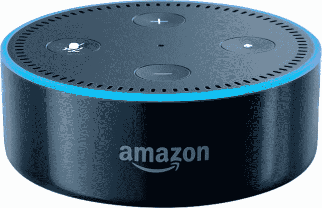
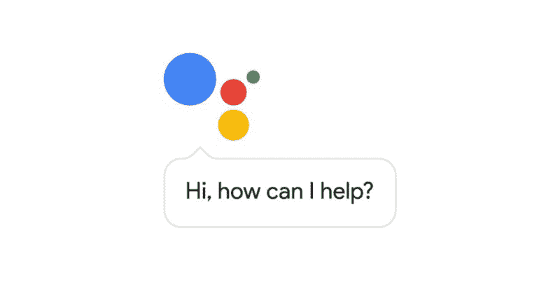

# 为什么虚拟助手前途光明

> 原文：<https://www.freecodecamp.org/news/the-number-1-reason-virtual-assistants-will-go-completely-viral-c4a8bb20e262/>

作者史蒂夫

# 为什么虚拟助手前途光明

我在 1999 年夏天购买了我的第一部手机。我 17 岁，在英国中部一个不起眼的小镇长大。人口不到 5 万。

对于那些想知道的人来说，这是一个萨基姆 RC 922。它拥有足够的内存来存储一个有 100 个联系人的地址簿。它也有一个外部天线。这部手机将继续被诺基亚的强大力量所摧毁。

我的手机没有 GPS。没有彩色屏幕。没有 [WAP](https://en.wikipedia.org/wiki/Wireless_Application_Protocol) 。没有耳机插孔。

它提供短信、语音通话和计算器。

然而，它带有一张漂亮的塑料卡，承诺 10 英镑的信用——如果你刮掉银箔并将数字输入手机。

它花了我将近 100 英镑。我在大学学习期间，晚上在一家工厂兼职，攒下了这笔钱。

### 超越怀旧

我的表哥托马斯，比我大几岁；我买手机的时候我父亲和我在一起。我们在一家咖啡店坐下来，打开了我新买的东西。我打开电源，开始输入免费积分的密码。

“那个是什么*？”他们问。*

“我的新手机，”我回答。

我爸爸只是看起来很困惑。“但是……你为什么买了手机？”

我耸耸肩。

接着，我的表弟托马斯闪电般地说:“我想要一个。你从哪儿弄来的？”

他去了当地的商店，两分钟后回来了，手里得意洋洋地抓着他的奖品。我的爸爸是一名蓝领卡车司机，他对此感到困惑。为什么他的儿子和侄子在新东西上投入了这么多？

### 这对虚拟助手意味着什么

6 个月前，我妻子给我买了一份礼物。这是一个亚马逊回声点。作为一个整天在技术部门工作的人，她认为这是一份生日礼物。

然而，它保持了近六个月的装箱。两个星期前，她很生气，把它放在了厨房里。起初这是一件新奇的事。

*   “Alexa，为什么 Siri 更好？”*【snark】*
*   *“Alexa，你有男朋友吗？”【英国禁忌幽默】*

*最终，它被用于与每个回声点相同的目的:*

*   *“Alexa，设置 10 分钟的提醒，当烤箱薯条完成后”*

*昨天，我下楼看到我四岁的儿子坐在厨房里。他经常用凳子从橱柜里拿碗麦片。*

*今天早上，他给自己端了一碗巧克力牛奶，还在听收音机里的一首歌。至少我是这么认为的。这首歌是由博·布莱克创作的。否则你可能会知道它是《明天几英里后的 T2》主题曲。*

> *“我是个地地道道的英雄。我要去探索。出路！”*

*我抓起一碗麦片，坐在他旁边。*

*“你是怎么打开收音机的？”*

*他若有所思地咀嚼着。*

*“我没有。它为我播放歌曲。”*

*我看了看。果不其然，回声点是迪士尼流行盛典的源头。*

> *“它为我播放歌曲”*

*它当然会播放歌曲。它就在营销文献上。我知道它连接了很多服务。它应该是天衣无缝的。*

*然而，作为一个成年人，我发现这令人沮丧。可能是因为我试图挫败它。例如:*

*" Alexa，打开 Spotify，播放《Coding and Crushing It》播放列表，选择汉斯·季默的《时间》. "*

*哈！看啊。它不能。第一代产品。Pfft。*

*但是对于我的儿子——他 4 周前才开始上学——Alexa 是他的朋友。Alexa 播放了*他的*歌曲。早餐时，他继续兴高采烈地谈论着亚历克莎。我意识到他把它拟人化了。Alexa 相当于一只宠物。它是家的一部分。*

*没有人告诉他如何使用它。他只是喊着命令。*

*还在吃，他说:“Alexa，拜托你现在玩 PJ 面具！”*

*果然，Alexa 在 Spotify 上弹出了 PJ Masks 主题曲。从消费者的角度来看，他完全满意。*

*所有这些都补充了我之前在我的女儿 Darcey (7 岁)和 Holly (5 岁)身上看到的行为。*

*他们都没有在谷歌上输入搜索查询。他们默认对几乎所有东西进行语音搜索。比如最近:*

*“谷歌，后代 2 什么时候发布？”*

**

*在与虚拟数字助理或人工智能机器人互动时，儿童不会表现出成年人的先入之见。*

*他们很少生气或责怪技术。就在那里。他们采用了语音控制，就像我在 1999 年采用手机技术一样随意。*

*也就是说，他们没有真正的需求感。我从来没有因为我的手机缺乏功能而生气。我只是对能够交流感到非常满意。我的手机使用案例仅限于打电话和发短信。我的孩子对 Alexa 也有类似的有限使用案例。*

*这是常态。在他们的生活中，技术的存在是为了满足他们的需求。那些内容可能是一个笑话，或者一首歌，一部电影，一个灯光的改变，或者一个问题的答案。*

*Alexa 和 Google Assistant 提供了对他们想要的内容的无障碍访问。他们对即时想法的反应比打字快得多。*

*作为一个成年人，我仍然有意识地在公共场合说“OK Google”来触发助手。*

*我有一副带有谷歌助手按钮的 Bose QC-35 无线耳机，但我不愿使用它。在公共场合感觉不正常。感觉是在炫耀。*

*然而，我的女儿们可以对着手机大喊“好的，谷歌，告诉我最近的玩具店”，不管她们在哪里。*

### *为什么我的孩子从 Alexa 获得更好的回应？*

*虽然成年人可能经常试图欺骗算法，但儿童已经能够用简单的句子结构说话。这些非常适合人工智能所需的用户输入。*

*这是没有摩擦的，因为他们的意图是纯洁的，他们的要求是简单的。对于使用语音激活的孩子来说，满足感的障碍要低得多。他们对 Alexa 的期望是零——除了它总是可用的例外。儿童是证明声控家庭的最佳人群。*

*家庭自动化的真正考验不是:“在我到家前 10 分钟，温度会上升吗？”结合使用智能手机、兼容集线器和 if TTT T1 来编写程序并不困难。*

*真正的测试是“一个孩子能调暗他们的灯泡来反映睡觉时间吗？一个孩子可以通过智能扬声器点播小熊维尼的磁带书吗？”*

*我相信 2017 年我们已经过了那个点。儿童是这项技术的未来消费者。出于这个原因，我认为市场估值是悲观的。*

*广泛采用语音控制的目标人群不是千禧一代。相反，是那些在 2010 年至 2020 年间出生的人。他们是在语音控制的家庭中长大的人，会期望这项技术成为标准。*

*语音人工智能将在未来二十年无处不在。我毫不怀疑。*

### *未来会怎样？*

*我完全相信亚马逊会赢得这场比赛。这是因为供应商锁定至关重要。如果转换的障碍很高，那么一旦你买了一个家庭扬声器或集线器，你就极不可能转换平台。*

*2016 年初，Alexa 应用程序或“技能”的数量[刚刚超过 130 个。到年底，这个数字已经从](https://techcrunch.com/2016/01/04/amazons-other-app-store-alexas-skills-section-has-quietly-grown-to-over-130-apps/)[增长到超过 5000](https://developer.amazon.com/blogs/post/Tx3PW7BACQVE53B/introducing-the-alexa-skills-kit-built-in-library-offering-developers-hundreds-of-new-voice-interactions-developer-preview)。今天，有超过 7000 个。2016 年下半年，应用增长超过 500%。*

*对于任何落后于谷歌、苹果和亚马逊的人来说，本土采用的前景看起来很黯淡。*

*对语音助手提供商来说，最好的机会是在共享处理层之上提供一个显示/语音接口层。然而，人工智能服务的优势在于卓越的数据处理能力。这意味着这种合作开发不太可能发生。*

*相反，我们将看到一个支离破碎的市场出现。这将是一个市场，根据硬件购买情况，你将被迫使用默认的人工智能提供商。这将导致消费者摩擦和第三方解决方案“移除”现有解决方案。*

*就我个人而言，我觉得亚马逊从作为一家商业公司中受益，而谷歌仍然享有“老大哥”的美誉。*

*这个品牌障碍是谷歌要求亚马逊打破的。如果谷歌率先上市，我敢肯定语音控制的家庭自动化会在推出时夭折。亚马逊是路标，或者说是扫雷器。*

### *移动反转*

*奇怪的是，这个品牌问题在移动设备上正好相反。谷歌助手正在碾压 Alexa 和 Bixby 等 Android 竞争对手。根据 Ovum 市场调查:*

> *谷歌助手将以 23.3%的市场份额主导[语音人工智能(AI)设备市场](http://www.ioti.com/engineering-and-development/race-ai-enabled-natural-language-and-voice-interface-platforms)，紧随其后的是三星的 bix by(14.5%)，[苹果的 Siri](http://www.ioti.com/iot-trends-and-analysis/fastest-growing-skills-topped-engineering-build-next-siri) (13.1%)，[亚马逊的 Alexa](http://www.ioti.com/iot-trends-and-analysis/amazon-wants-put-alexa-just-about-everything) (3.9%)和微软的 Cortana (2.3%)*

*[TechCrunch 最近在 VoiceLabs 报告中报道了](https://techcrunch.com/2017/01/24/24-5m-voice-first-devices-expected-to-ship-this-year-but-apps-struggle-to-retain-users/):*

> *“因此，尽管这不是一个赢家通吃的市场，但 VoiceLabs 预测，2017 年这将是一个赢家通吃的市场，”报告称。这给硬件提供商带来了快速分发设备的压力。"*

*毫无疑问，亚马逊拥有丰富的消费电子产品销售经验。这使其在分销渠道中占有优势。*

*与此同时，它也使开发人员能够轻松地为其 Echo 系列设备构建 Alexa 语音应用程序。它投资于应用程序开发工具。*

*然而，我的最后一个想法是，亚马逊在将年轻的内容消费者纳入亚马逊生态系统方面取得了重大进展。这是通过使用 Kindle Fire Kids，这似乎是一场 Alexa 启发的革命的时机已经成熟。*

*“Alexa，帮我理解一下长乘法。”*

**“开启可汗学院，长乘法，视频播放 3，2，1…”**