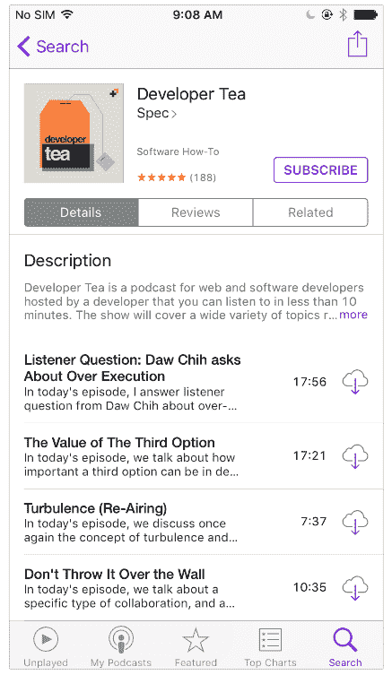
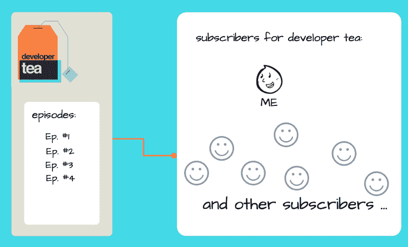
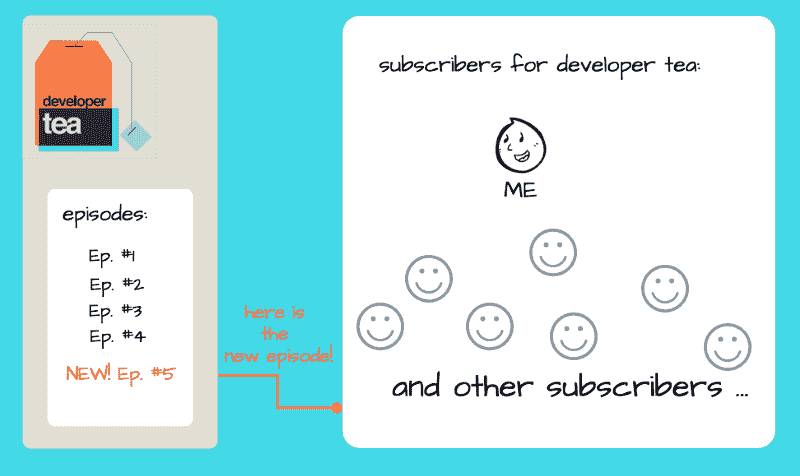
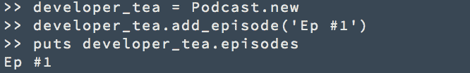
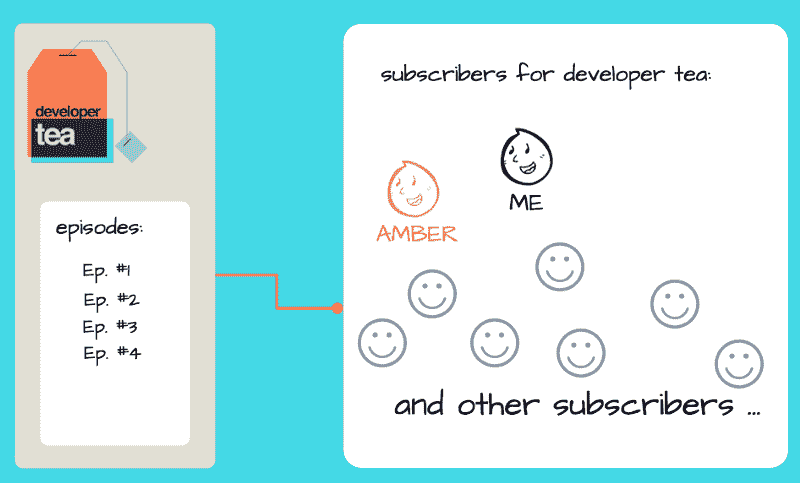
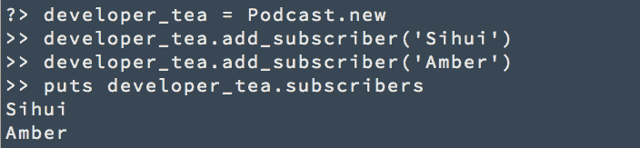
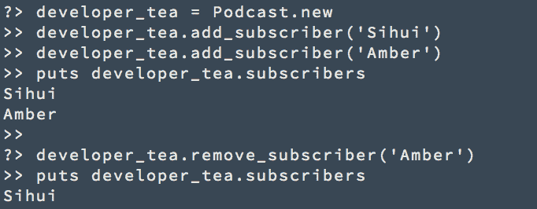

# 观察者设计模式有点像播客

> 原文：<https://www.freecodecamp.org/news/the-observer-design-pattern-is-kind-of-like-a-podcast-cdee5ef9f074/>

作者:黄思慧

# 观察者设计模式有点像播客

如果你听播客，你已经熟悉了观察者模式。其实你就是一个“观察者”。

下面是观察者模式的定义:

> 观察者模式定义了对象之间一对多的依赖关系，因此当一个对象改变状态时，它的所有依赖对象都会得到通知并自动更新。

### 让我们看看与播客相关的定义。

我发现了一个有趣的播客，名叫`developer tea`。

点击`SUBSCRIBE`按钮后，我现在就在他们的订户名单上了。

当`developer tea`发布新一集时，应用程序会通知我和其他订阅者。它为我们下载了新的一集。

这正是观察者模式的定义！

> 观察者模式定义了对象之间一对多的依赖关系，因此当一个对象改变状态时，它的所有依赖对象都会得到通知并自动更新。

`developer tea`播客和`subscribers`之间是一对多的关系。

当`developer tea`改变状态时，比如发布新的一集，所有`developer tea`的`subscribers`都会被通知和更新。

### 让我们用 Ruby 实现它。

从一个简单的版本开始。

`Podcast`类保存一个剧集列表，并有一个方法将`add_episode`添加到列表中。

然后我们可以创建`developer_tea`播客并将第 1 集添加到其中，如下所示:

每当新剧集发布时，我都希望收到通知。

我们可以在列表中添加新一集后更新我:

每当我从`developer_tea`得到更新，我就可以下载最新一集。

我非常喜欢听音乐，所以我把它推荐给我的朋友安柏。现在，Amber 也想订阅它。

我们需要确保 Amber 在新一集发布时也能收到通知:

嗯，这段代码做了我们想做的事情。

但是有一个问题。

每次我们想要添加一个订户，我们都必须重新定义这个类。

有没有一种不用重新定义类就能更新订阅者列表的方法？？？？

### ？？我们可以保留一份订户名单！？？

新的`Podcast`类在两个新方法的帮助下保存订户列表:一个用于添加订户，一个用于删除订户。当一集发布时，我们会更新每个订阅者。

不幸的是，Amber 不像我一样喜欢这个播客，所以决定退订。我们使用`remove_subscriber`方法将她从订户列表中删除。

**？？耶！你刚刚学会了观察者模式！？？**

### 观察者模式背后的设计原则。

**观察者模式利用松耦合设计原则:**

> 努力在交互的对象之间实现松散耦合的设计。

**`Podcast`类不太了解它的订户。它只知道每个用户有一个更新方法。**

这种松散耦合最大限度地减少了播客与其订户之间的依赖性。它还最大限度地提高了灵活性。只要它有更新方法，订阅者可以是任何东西:一个人、一群人、一只动物，甚至一辆汽车。

****外卖** :**

1.  观察者模式定义了对象之间一对多的依赖关系，这样当一个对象改变状态时，它所有的依赖对象都会得到通知并自动更新。
2.  **松耦合设计原则:在交互的对象之间争取松耦合设计。**

**感谢阅读。您还能想到其他观察者模式的真实例子吗？？**

我给 [sihui.io](http://www.sihui.io/) 周刊投稿。

订阅吧，这样你就不会错过本系列的下一篇文章。

**下次我们将谈论…**

