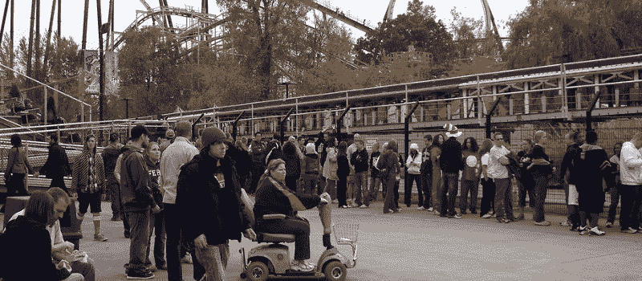
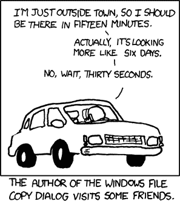
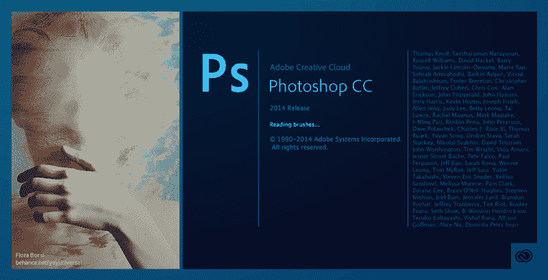
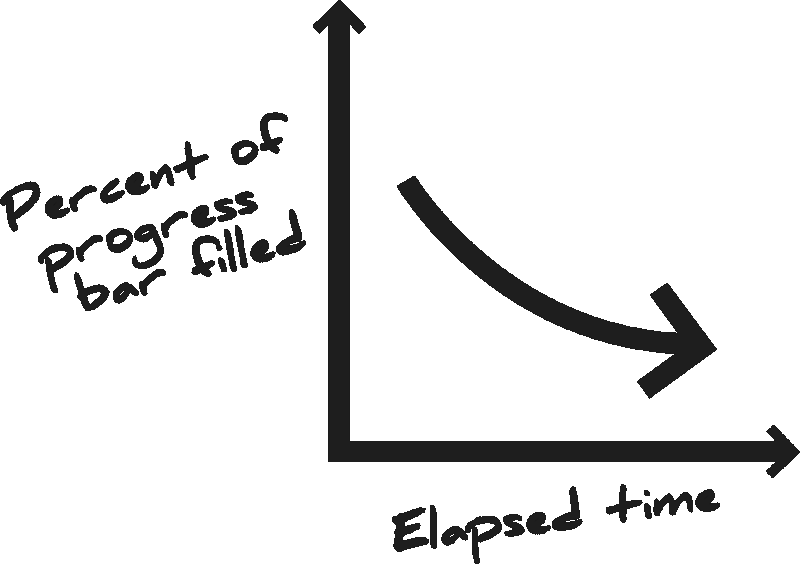
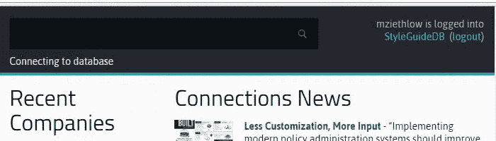

# 等待的痛苦——穿越 7 级进度指标地狱

> 原文：<https://www.freecodecamp.org/news/the-pain-of-waiting-navigating-the-7-levels-of-progress-indicator-hell-decd3e019495/>

作者:迈克·泽特洛

# 等待的痛苦——穿越 7 级进度指标地狱

你愿意让你的用户经历多少痛苦？

当然，你想给出的答案是“没有！”但是如果你正在开发 web 应用程序，你会让你的用户在某个时候等待结果。

> “虽然快速响应时间是最好的，但有时即使服务器升级也无法让您满足系统速度的要求。在这种情况下，你只需让用户放心，电脑并没有出去吃午饭，而是忠实地按照他们的要求工作。”— [进度指标让缓慢的系统变得不那么难以忍受](https://www.nngroup.com/articles/progress-indicators/)

等待是一个痛点。没有人最喜欢过山车的那一段，是到达终点之前的等待。

Totally looks like fun.

如果等待是必然的，为了用户，我们应该尽我们所能减少这种痛苦。迪士尼已经为他们的游乐设施试验了“[互动等候线](https://www.youtube.com/watch?v=zuJlaVqe69I)”。虽然听起来很有趣，但至少还是有点意思的。

在 web 开发中，我们做一些几乎同样有趣的事情:进度指示器。(也称为:进度条、跳动条、加载条、加载圆、加载图标、旋转风车或等待光标。)

以下是从最不痛苦到最痛苦的 7 级进展指标。

### 第一级进度指标地狱

#### 准确的进度显示

这是一个进度指示器，显示您的应用程序的准确状态。这很难做好，需要很多额外的代码(除了做用户要求应用程序做的事情)。这对用户来说很好——但仍然属于地狱，因为无论等待时间有多精确，等待都是一个痛点。

准确的进度显示很难实现。开发人员已经为这个问题奋斗了几十年。如果你是推销它的 UX 人，你的团队可能会问你是否能在不做太多开发工作的情况下达到类似的效果。

### 进度指标地狱的第二层

#### 半精确进度显示

许多应用程序可以估计用户的等待时间。进度指示器可以触及请求的不同阶段，并让用户知道。这不是很好，因为每个阶段花费的时间可能相差很大，导致进度条“跳动”。

例如，调用可能花费 20%的时间，查询花费 70%的时间，排序花费 2%的时间，返回花费 8%的时间。用户大部分时间都在盯着一个 20%满的条，然后突然它跳了一下就结束了。

Credit: [https://xkcd.com/612/](https://xkcd.com/612/)

### 第三层进步指标地狱

#### 感知技巧的悸动者

一个[跳动器](https://en.wikipedia.org/wiki/Throbber)是一个简单的旋转或加载指示器，它可以无限地活动。在这一级，我们增加了感知技巧，让用户感觉加载速度比实际速度快。

> 有人认为，主观时间不仅最容易操纵，而且也是最重要的。毕竟，我们的感知就是我们的现实。我们不必为了让计算机感觉更快而制造更快的计算机。”克里斯·哈里森

你也可以在精确和半精确的进度显示上使用感知技巧。但是他们在第三级进度指标地狱和更低的级别是最需要的，在那里向前的进度没有被测量，等待可能是最令人沮丧的。

以下是我最喜欢的三个:

#### 感知技巧#1:视觉增强

并不是所有的进度条设计都是一样的。有些人似乎比其他人填充得更快。[克里斯·哈里森](http://www.chrisharrison.net/index.php/Research/ProgressBars2)对此进行了研究，将各种设计进行了面对面的对比:

UX 设计师必须在应用/品牌设计中平衡这种感知技巧。

#### 感知技巧#2:文本状态更新

向用户提供一些关于应用程序状态的文本(真或假)。

> “很多时候，如果用户被告知，他们可能会更有耐心。通过包含文本来告诉用户正在发生的事情或解释用户等待的原因，会有助于增加清晰度。”— [砸弹匣](https://www.smashingmagazine.com/2016/12/best-practices-for-animated-progress-indicators/)

Adobe 在这方面做得很好。看看下面的“阅读画笔…”。(Adobe 会根据加载到用户机器上的时间长短，在几十种状态之间循环。)

#### 感知技巧 3:幽默

研究表明幽默能有效缓解焦虑。像西南航空公司这样精明的企业经常在潜在的焦虑时期使用幽默:

等待应用程序的响应无疑会提高用户的焦虑程度，而幽默是缓解这种焦虑的一个很好的工具。(这在面向消费者的应用程序中是最好的，因为它在一些企业应用程序中可能是不可接受的。)

### 第四级进度指标地狱

#### 永不停止的进度条

对用户来说，进度条似乎移动得有点快，然后它慢下来，越来越慢，直到最后他们根本不知道它是否在移动。

这是一个吸引用户的非常卑鄙的伎俩，尽管开发者可能除了良好的意图之外什么也没有。开发人员编写了一个进度指示器，它本质上是一个跳动的指示器，但看起来像一个填满的长条。当请求花费的时间越长，它的速度就越慢，以无穷小的非零速度沿着渐近线爬行，直到请求完成(如果请求完成的话！)，在这一点上，米拍摄到满。

对开发人员来说，这看起来是一个数学上优雅的工作解决方案。可惜用户讨厌。

> 速度的变化会被注意到，并会影响用户的满意度:如果进度很快，只是停留在最后一个百分比，用户会变得沮丧，显示进度的好处会被抵消— [进度指标让缓慢的系统变得不那么难以忍受](https://www.nngroup.com/articles/progress-indicators/)

### 第五级进度指标地狱

#### 悸动者

你可以在所有的软件应用中看到这一点。

这些只是循环播放的动画。跳动者告诉用户应用程序正在处理一个请求，但是让他们等太久，他们会放弃它。悸动最好用于简短的请求。如果与感知技巧一起使用，他们可以提升两级进度指标地狱。否则，他们留在这里。

> “在循环上显示动画图形提供了系统正在工作的反馈，但它没有给出用户必须等待多长时间的任何信息……如果旋转器无限旋转，用户不能确定系统是否仍在工作或是否已经停止，因此他们可能会决定完全放弃这项任务。”— [进度指标让缓慢的系统变得不那么难以忍受](https://www.nngroup.com/articles/progress-indicators/)

### 第六级进度指示器地狱

#### 静态文字

或者:

你通常会在政府网站或应用程序上看到这种情况，消费者在市场上几乎没有选择。(我的健康保险门户网站最近把这个丢给了我。)

从智力上来说，这和一个无限循环的动画没有什么区别。但静文就是感觉如此*。*

*使用这种进度指示器，用户更容易觉得你的应用程序卡住了或者坏了。*

*尼尔森诺曼集团说得好:“静态进度指标:不要使用它们。”*

**

### *第七级进度指标地狱*

#### *没有任何东西*

*没有任何进展指标。*

*只是你的应用程序冻结的界面的外壳在后台努力工作，而用户坐在那里困惑，沮丧，祈祷末日的到来。*

**

### *案例研究:连接进度指示器*

*使用基于网络的保险管理应用程序 [Connections](https://chsiconnections.com/) ，我们有时会让用户处于进度指标地狱的第七层。我的目标是让我们至少达到第三层。*

*我们在标题中实现了一个受 YouTube 启发的进度条来显示用户数据库请求的进度。*

**

*这基本上是一种悸动，但我们使用了一些感知技巧来缓解等待用户的焦虑:*

1.  ***与我们的品牌设计相匹配的视觉增强** —等待时从右到左出现条纹，然后加载时条从左到右快速填充。动画的速度也比框架默认显示的要快(引导，我正看着你)，所以[感觉更快](https://codepen.io/149203/pen/bWzwrb)。*
2.  ***文本状态更新** —我们显示几十种文本状态(“连接到数据库”、“获取连接”等)。).它们以随机的 2 到 4 秒的间隔显示，以感受真实。*
3.  ***幽默** —如果查询时间超过 12 秒左右(很痛苦，但有时是必要的)，我们的文本状态更新会变得更有趣、更奇怪。我们希望查询不会花那么长时间，但如果真的这样，我们会试着用幽默来减少焦虑。*

### *等待是一种痛苦*

*是每个软件应用的痛点。希望我已经展示了，通过一点 UX 和设计工作，您的应用程序可以从深处升起。不要让你的用户在进度指标地狱的深渊里打滚。最高级的精确进度显示在您的应用程序中可能做不到，但是只要有一点创造力，您就可以提高进度并减少等待的痛苦。*