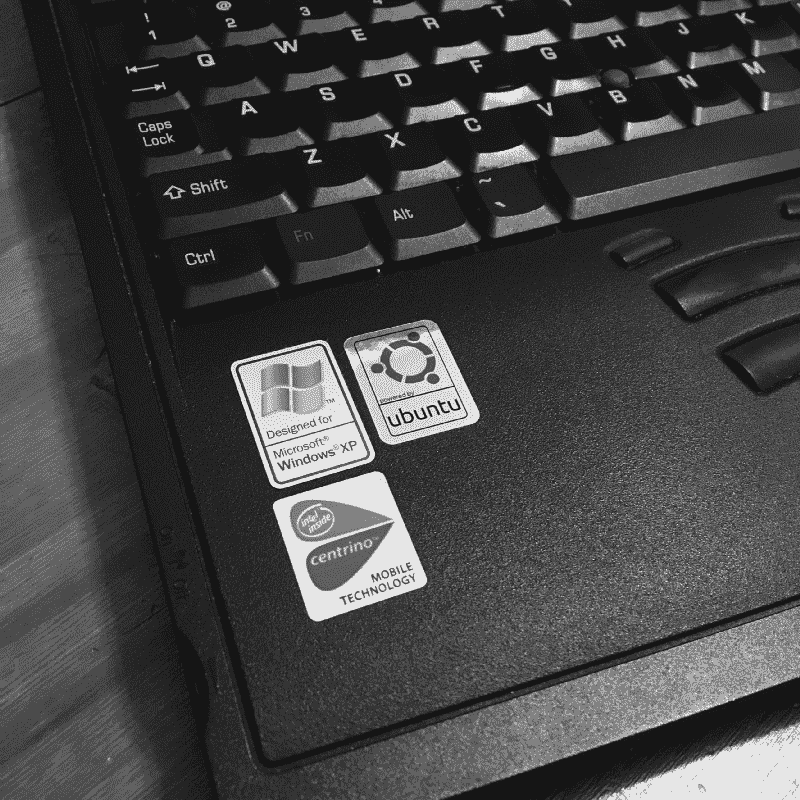

# 企鹅凤凰哲学

> 原文：<https://www.freecodecamp.org/news/the-penguin-phoenix-philosophy-8a8dcda178aa/>

伊丽莎白·沃塔瓦

# 企鹅凤凰哲学

#### 用 Linux 让一台旧笔记本起死回生教会了我什么关于技术、编码和我自己

Photo by [Ian Parker](https://unsplash.com/photos/TLcLDigmTKE?utm_source=unsplash&utm_medium=referral&utm_content=creditCopyText) on [Unsplash](https://unsplash.com/search/photos/penguin?utm_source=unsplash&utm_medium=referral&utm_content=creditCopyText)

如果你在一个正常的工作日看到我，你很可能会看到我在电脑上的几个应用程序之间来回切换。Excel、Access，可能还有 VBA 宏、大型多维数据库和 SQL Server Management Studio。

我并不是计算机资源的轻量级用户。我一直在尝试新的概念和不同的技术，以找到合适的工具来解决挑战，或者更有效地执行流程。

令人惊讶的是，我业余时间最喜欢的笔记本电脑是一台有 14 年历史的东芝 Satellite M20，也就是众所周知的 Penguin Phoenix。听起来可能很奇怪，我重建、重新格式化和测试这台笔记本电脑的经历与我成长为今天的财务建模师和系统管理员的经历是并行的。

### 起源故事

大学四年级的时候买的东芝卫星 M20。我主修经济学和金融学，并通过杜兰大学的 Burkenroad Reports 项目完成学业。Burkenroad Reports 项目为学生提供了作为卖方股票分析师的第一手经验。

在这个课程中，我遇到了我的第一个综合财务报表预测模型——资产负债表的变化可以更新损益表和现金流量表。不幸的是，这也是一个相当大的电子表格，需要比我的第一台笔记本电脑提供更多的资源。我需要升级。死亡的蓝屏越来越频繁，令人不安。

结果我订了我的东芝卫星 M20。开箱即用，它配备了英特尔赛扬处理器、256MB 内存和 Windows XP。我想避免未来的蓝屏，所以我决定积极主动地购买一些额外的 RAM 芯片，将机器提升到 512MB。对于这一代人来说，它轻得惊人，配有全尺寸键盘和大屏幕。触控板还不是标准的——东芝在键盘中间有一个操纵杆旋钮。它甚至有两个 USB 端口，这是一个相对较新的功能。

一个额外的好处是:它有一个内置 Wi-Fi 卡。在此之前，我必须携带局域网电缆，并找到一个端口来访问网络。或者，我需要使用我的 Wi-Fi 卡，这是一种信用卡大小的设备，可以插入我的电脑，可以接收无线信号。

那台机器带着我度过了高三剩下的时光，后来又完成了我的硕士课程。后来我买了一台新机器，但我永远不会放弃我的东芝卫星。

### 企鹅凤凰

几年前，我的东芝卫星找到了新用途和新名字。微软刚刚宣布它将停止支持 Windows XP。我还没准备好让东芝退役，所以我决定开始探索硬件的新用途。

我一直想探索 Linux，一个免费的开源操作系统。Linux 的轻量级特性使它成为像我的东芝这样的老电脑的理想选择。在对各种风格的 Linux 操作系统进行了几周的研究后，我选定了 lubuntu，这是 Linux Ubuntu 的一个轻量级版本。虽然启动失败了几次，但我成功地启动了新的操作系统，企鹅凤凰诞生了。

为什么是企鹅凤凰？这只企鹅是向 Linux 的吉祥物 Tux 致敬。凤凰是重生的象征。

Tux Image By [lewing@isc.tamu.edu](mailto:lewing@isc.tamu.edu) Larry Ewing and The GIMP, Attribution, [https://commons.wikimedia.org/w/index.php?curid=80930](https://commons.wikimedia.org/w/index.php?curid=80930)

凤凰的死亡和再生循环也提供了一个恰当的比喻。开发人员已经为老机器创建了各种轻量级版本的 Linux。每当我决定安装一个新的操作系统时，企鹅凤凰就会重生。我对我今天运行的 Ubuntu 版本 LXLE 非常满意。

企鹅凤凰的重生是计算机如何工作的速成班:

*   什么是 BIOS 以及如何更新它
*   如何预览和安装操作系统
*   如何撬开机器的背面来安装额外的内存(对于那些正在计算的人，我们现在是 1GB)

最重要的是，我克服了对弄坏电脑的恐惧。我把它拆开又装回去，当我打开它的时候，它仍然可以启动。我清除了 Windows，换成了 Linux，它还是能加载。我开始理解成为软件的超级用户和熟练使用机器本身之间的区别。

Designed for Windows XP, Powered by Ubuntu (Elizabeth Wotawa)

### 企鹅凤凰学会如何飞翔

建造企鹅凤凰也让我看到了是什么让我丈夫对计算机如此感兴趣。他已经做了几年的 IT 前台代理，现在他用 Ruby on Rails 和 JavaScript 编写代码。我自己阅读文档和安装步骤是一回事。有人和我一起接受挑战并填补书面步骤之间的空白完全是另一回事。

他也分享了一些欢笑。在我安装了 lubuntu 之后，我只能在连接到墙上的时候才能上网。用户界面中没有任何东西能告诉我出了什么问题。我决定上无线网络。(还记得那个内置 Wi-Fi 卡吗？)我丈夫帮我潜入终端，查看哪些硬件组件在工作。当我们找出根本原因时，我们都大笑了一场:Wi-Fi 开关被设置为关闭。

开机后就像魔咒一样好用。

这些早期与企鹅凤凰的经历教会了我一些关于自己的事情。第一，好奇很好玩。我提出了一个假设——我的电脑可以运行 Ubuntu——并成功测试了它。第二，我克服了对弄坏电脑的恐惧。保修几年前就过期了，如果没有别的，我已经备份了机器，随时可以重新安装 Windows XP。最后，我学会了谦逊地向知识渊博的人寻求帮助。作为回报，我丈夫不仅指导我完成了计算机成像过程，还给了我一些工具，让我自己探索机器的组件。

### 企鹅凤凰迎接新的挑战

企鹅凤凰的下一次冒险是在我报名参加 [**微软专业计划数据科学证书**](https://www.edx.org/microsoft-professional-program-data-science) 的时候。从我的经济学本科课程开始，我就对数据和回归分析着迷。这个 edX 证书系列让我赶上了数据科学中流行的最新理论和技术:Excel、PowerBI 和 SQL 中的数据清理和分析，R 中的回归分析和机器学习，以及微软 Azure 机器学习。

我在新的 Windows 7 电脑上完成了早期的课程。但是，当我到达课程的 R 编程部分时，我意识到我的 PC 没有资源来处理我需要运行 ggplot2(课程所需的数据可视化包)的 R 版本。

不过，企鹅凤凰做到了。

在从 Ubuntu 的 Precise Pangolin (12.04)升级到 Trusty Tahr (14.04)之后，我可以加载 R 3.0.2、R Studio 和 ggplot2 包了。

Penguin Phoenix 可能需要额外的几秒钟来运行 R Studio 中一些更复杂的数据加载和命令，但它在其他方面的表现非常出色。我能够完成 R 课程和数据科学证书。

我从这次经历中学到的不仅仅是 R 编程和数据科学。我还了解到，有时候，最新的工具并不总是最灵活或最可靠的。如果我十四岁的机器愿意运行 R，我至少可以学习如何用 R 编码。

### 企鹅凤凰探索移动网络

企鹅凤凰也加入了我对网络开发的探索。我有幸参加了 2017 JazzCon。通过 NOLA 科技界女性的慷慨解囊，在新奥尔良召开了一次科技大会。在一场接一场的会议中，我被演讲者对两件事的热情所鼓舞:第一，寻找复杂挑战的优雅解决方案的动力，第二，对最终用户体验的关注。

我在会议上的笔记充满了改进工作流程的想法和未来自我驱动学习项目的笔记。现在我只需要学习如何实现 HTML、CSS 和 JavaScript 等技术。 [Tech Talent South](https://www.techtalentsouth.com/locations/new-orleans/) 的**网站设计与创作入门**教会了我一些基础知识，并帮助我建立了自 20 世纪 90 年代中期以来的第一个网站。然后我找到了 [**freeCodeCamp**](https://www.freecodecamp.org/) ，这是一个在线训练营，培训学生进行全栈开发，并将他们与支持非营利组织的项目联系起来。

这些经历让我有信心申请谷歌开发者挑战赛奖学金 **项目**，这是谷歌和 Udacity 的合作项目。我很兴奋地发现我已经被移动网络专家课程录取了，在那里我将学习离线优先的开发和 JavaScript 中最新的 ES6 特性。

我决定看看企鹅凤凰在网络开发方面是否能像在数据科学方面一样出色。我没有失望。安装了几个程序之后——git、node.js、npm 和 Visual Studio 代码——我实际上可以从 Linux 终端运行一个网站了！此外，我可以编辑驱动网站的代码，并且在我编写它们的时候几乎立刻就能看到变化。我在我的 Linux 机器上有了概念证明和一个正常工作的 web 开发环境。

事实上，这足以证明我被项目的第二阶段接受了。我目前获得了 Udacity 的**移动网络专家纳米学位**和谷歌一起成长奖学金。我们正在探索一切，从响应性和可访问的网页设计到离线优先的方法，比如缓存和服务工作者。而且，由于 Penguin Phoenix 的 Linux 环境，我可以使用 Python 运行本地主机 web 服务器来测试我在 Chromium 中的 Nanodegree 项目。

企鹅凤凰和我都通过这些经历学到了一些新技能。对于 Penguin Phoenix 来说，从命令行运行的新包屈指可数。

对我来说，这是一个新的视角。网页的机制和设计让我着迷，我喜欢把我的空闲时间用来研究这个学科。Web 开发将我引入了一个寻求复杂挑战的优雅解决方案的社区，这种影响影响了我的学习和工作。

### 企鹅凤凰哲学

企鹅凤凰挑战我超越我作为 Excel 超级用户的专业角色。我在 Penguin Phoenix 的工作与我从公用事业费率谈判的角色转变为建立和维护支持这些谈判的系统的角色相平行。

我在 Penguin Phoenix 的成功给了我承担新角色所需的信心:

**当我们的专家讨论支持我们流程的硬件要求时，我理解他们在谈论什么** *。*我可以更明智地说出我的工作机器的能力和局限性，它告诉我如何以及何时使用某些软件或运行某些程序。

我意识到当我找到复杂问题的解决方案时，我处于最佳状态 *。*对旧笔记本电脑重新编程导致了在 SQL 中构建和调整视图、学习新的业务逻辑、配置公用事业费率设定流程所需的复杂计算，以及开发网页。

我更加努力工作，对学习新技术或流程的团队成员保持耐心 *。*计算机是复杂的设备，运行在其上的软件并不总是用户友好的。我至少能做的是去见一个处于学习曲线上的人。

我鼓励我的读者去寻找他们自己的爱好，这将会让他们对一个新的主题和他们自己有所了解。如果我们在未来的黑客之夜或女性技术研讨会上相遇，不要惊讶我会从包里拿出一个贴满标签的东芝 M20 卫星。企鹅凤凰总是准备迎接新的挑战。

The Penguin Phoenix (Elizabeth Wotawa)

#科技#生活课程#免费代码营#与谷歌一起成长#谷歌城市学者