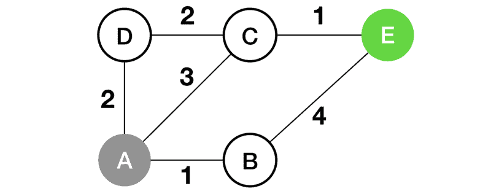
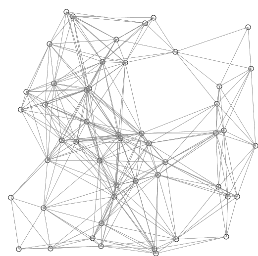
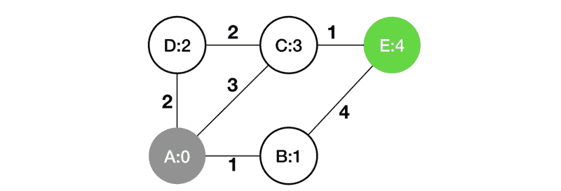

# 编程的哲学

> 原文：<https://www.freecodecamp.org/news/the-philosophy-of-programming-e901bd37363a/>

作者:陈浩贤

# 编程的哲学

#### 逻辑思维===好软件


Photo by [Giammarco Boscaro](https://unsplash.com/@giamboscaro?utm_source=medium&utm_medium=referral) on [Unsplash](https://unsplash.com?utm_source=medium&utm_medium=referral)

编程是一种新的文化。但是我们如何写出好的程序呢？以下是我们需要解决的常见问题:

*   我们如何提出一个问题的算法解决方案？
*   那么，我们如何知道解决方案实际上是可行的呢？
*   即使我们确定它有效，我们如何告诉计算机执行它？

有趣的事实——如果你很难思考这些问题中的任何一个，你实际上是在做哲学。

要了解原因，让我们来看看编程和哲学推理之间一些有趣的相似之处。

### 第一个原则:你得努力思考。

计算机并不比我们做得更聪明——不同的是，它们做得更快。

但是他们不能解决一个实际的问题，比如“我如何从家里到办公室？”

> 一个有效的方法(原则上)可以由一个人在没有任何机器帮助的情况下完成，除了纸笔。

> — [丘奇-图灵论题](https://plato.stanford.edu/entries/church-turing/#ThesHist)

编程的可取之处还是在于推理部分。也就是说，将现实世界的问题转化为计算机可以执行的简单指令。

当然，不同的编程语言有不同层次的语义抽象。Python 程序可能比它的 C 对应物更短。但这只是改变了翻译的数量。我们不能摆脱翻译工作。但是我们将把这个讨论留到以后。

#### 程序员的推理流程

现在我们正盯着一些问题描述。我们可以首先寻找小规模投入产出的例子来理解这个问题:

**感应。**我们需要一种能够处理这类例子的算法。现在你在做归纳:从经验中归纳原则。

**演绎。**我们怎么知道它对其他未知输入是否有效？我们做了推导来证明我们算法的正确性。

**本体**。我们必须在计算机内存中保存数据。我们的目标是让计算机高效地处理它们。换句话说，什么样的数据结构最能捕捉我的信息的动态流动？

**再次感应**。接下来是最后一个阶段:调试。我们从分析意外输出中归纳出程序的错误部分。

#### 一个例子

现在让我们通过下面这个真实的例子来检验上述过程:寻找从顶点 A 到顶点 e 的最短路径。



A simple map. Numbers denote the edge distance.

对于小规模的问题，我们可以凭直觉解决。对我们来说，通过观察就能很直接地识别出解决方案 A-C-E。

但是更复杂的拓扑结构呢？不同的边权重呢？

我们需要计算机的帮助。然而，告诉计算机做什么并不是直截了当的。人类的思维方式和计算机的工作方式之间存在差距。

### 该过程

#### 1.从经验中归纳原则:算法

为了告诉计算机做什么，我们需要首先提出一个算法程序。

贪婪的策略是一种自然的前进方式。即从源顶点 A 开始，沿着已知的最短路径一路走下去。继续探索新的顶点，直到我们到达目的地 e。事实上，这种方法满足我们的例子。

直觉告诉我们，沿着到目的地的最短路径，每个中间节点也以最短路径被访问。(当然这种直觉假设所有的边都有正权重。这可能不成立，取决于应用。这个我们后面会详细讨论)。

这是算法程序:



Dijkstra’s algorithm animation, by [Shiyu Ji](https://commons.wikimedia.org/wiki/User:Shiyu_Ji) from [Wikipedia](https://commons.wikimedia.org/wiki/File:DijkstraDemo.gif)

1.  一些设置:(1)记录我们访问过的顶点:一个集合(`visited`)，(2)记住已知的到每个顶点的最短距离**只使用发现的顶点**:另一个集合`distance(u)`。每个顶点的距离最初是无穷大，除了源顶点是 0。
2.  现在我们开始探索:首先我们**访问**到目前为止已知最短路径的顶点，假设它是`u`。(最初它将是源顶点)。
3.  当站在顶点`u`时，我们环顾向外的边缘。比如说`(u,v)`，每条边都给我们一条到顶点`v`的路径，这条路径使用顶点`u`作为最后也是唯一的一步。如果它们中的任何一条确实是到`v`的更短路径，或者是我们找到的到`v`的第一条路径，万岁，我们现在可以更新我们的最短路径集了。否则忽略，继续走。
4.  我们完成了顶点`u`，所以我们将它添加到我们的`visited`集合中。
5.  回到步骤 2，继续探索，直到我们已经访问了所有的顶点。

`distance`现在可以告诉我们全局最短距离，因为它只使用访问过的节点来保持最短距离。并且当算法完成时，所有顶点都被访问。

我们只是重新发明了迪克斯特拉的算法。当然，还有很多其他的寻找最短路径的算法。但关键是，我们需要一个算法程序来解决这个问题。

#### 2.通过演绎验证一般原则

我们如何确保算法的原理是正确的？我们可以通过用更多的输入例子来测试这个原理来增加我们的信心，或者，更有效地，我们可以找到一个严格的数学证明。

就像哲学中的一个[先验命题](https://www.iep.utm.edu/apriori/)一样，算法的正确性与其执行无关。换句话说，测试不能保证算法的正确性。我们需要证明它。

这是证明的基本流程:

1.对于所有访问过的顶点，我们找到最短的路径。

2.目的地被访问。

3.因此，我们找到了到达目的地的最短路径。

他们是不是有点眼熟？像这样:

1.所有的人都会死。

2.苏格拉底是个男人。

3.所以，苏格拉底是凡人。

其实这就是[三段论](https://en.wikipedia.org/wiki/Syllogism)，演绎推理的经典形式。这几乎就是逻辑学家正在做的事情。

另一个有趣的历史事实是:计算的正式概念是由逻辑学家在 20 世纪 30 年代首次提出的。他们需要知道某些逻辑问题实际上是否可以解决(这样他们就可以避免浪费时间去解决一些无法解决的问题)。为了回答这个问题，他们提出了可计算性的概念。

1936 年晚些时候，阿隆佐·邱奇和艾伦·图灵同时独立地提出了可计算性的正式定义。这篇[论文](https://onlinelibrary.wiley.com/doi/full/10.1002/0470018860.s00209)给出了计算的历史回顾。

结论的正确性取决于前两个前提。在我们的证明中，第二个前提是微不足道的，因为我们的算法实际上是访问所有节点。然而，要证明第一个前提，即我们在访问一个节点时找到最短路径，还需要做一些工作。

**数学归纳法**可以帮忙。它实际上是证明许多其他算法正确性的最有用的技术之一。

一般流程如下。首先，如果一个算法对输入`0`起作用，第二，如果它对输入`n`起作用的事实意味着它也对输入`n+1` 起作用，那么它对所有大于或等于`0`的输入起作用。在这一点上，你能够保证你的算法的正确性。

为了简单起见，我会让你参考这个[讲义](http://www.cs.yale.edu/homes/spielman/365/shortestPaths.pdf)来获得这个路径寻找算法的完整证明。

注意不要混淆数学归纳法和哲学归纳法。根据哲学定义，数学归纳法是一种演绎推理过程，因为它的正确性包含在自身之中，不需要任何外部观察。

教训是:当我们提出一个算法时，它应该能够处理所有可能的执行情况。

在实践中，进行严格的数学证明可能不是最有效的策略。但至少我们想考虑尽可能多的执行案例，尤其是对抗性的案例。这种做法将提高我们代码的健壮性。

您可能已经注意到，在我们的示例路径查找算法中，如果边权重为负，它就不起作用。你可以在这个[讲义](http://www.cs.yale.edu/homes/spielman/365/shortestPaths.pdf)里找到原因。为了处理负权重图，你可以使用[贝尔曼-福特算法](https://en.wikipedia.org/wiki/Bellman–Ford_algorithm)。

#### 3.本体问题:数据结构

到目前为止，我们说服自己，我们有一个正确的算法。但这只是成功的一半。

下一个问题是，我们如何将信息输入计算机？人类喜欢可视化的信息，如图表或直方图。但是今天的计算机只处理二进制位。

我们需要提出一个包含基本信息的数据结构。同时对一个程序进行处理应该是高效的。

让我们继续我们的路径查找示例。路径是一个有序列表。但是处理起来很气人，和整数比起来。注意，在我们的算法中，我们必须从我们发现的路径集中找到最短的路径。然后一直迭代到结束。似乎我们必须用一个数组或内存来存储每条路径。

我们能做得更好吗？请注意，在有效路径中，连续出现的元素必须对应于图中的一条边。但是，我们已经有了边缘信息，它们对于所有路径都是相同的。为什么我们不能去掉这些多余的信息？

好吧，我们可以去掉名单。原来，为了聚集最短路径，中间步骤是确定你需要去的下一跳是什么。我们需要检索的从源 A 到任何目标节点的最短路径只是图本身，以及从 A 到每个节点的最短距离。



Information to retrieve shortest path from A to any node. (Numbers within vertices denote the distance from A.)

上图是一个直观的表示。这种表示是内存高效的。程序处理起来也更有效率。

这就是它如何仅使用距离向量来构建最短路径。从目的顶点开始，一条空路径。通过引入的边查找中间顶点。选择`distance`中数值最低的一个。将它添加到路径的开头。重复直到我们到达源头。这个技巧实际上有一个正式的符号，叫做[回溯](https://en.wikipedia.org/wiki/Backtracking)。

哲学家寻求永恒的真理。程序员希望找到最能捕捉信息动态的精确数据结构。正如您在路径查找示例中看到的，给出最短路径所需要的只是一个向量，告诉您到每个顶点的最短距离。这适用于任何图形，不管顶点或边的数量。

#### 4.后验命题:调试

大多数程序员都经历过无数次这种推理。我敢打赌，这是任何编程任务中最困难和最耗时的部分之一。

例如，C 程序中的分段错误经常是由空指针引用引起的。在处理了大量的 C/C++分段错误之后，我学到了这一点。当然，还有更微妙的情况与个人编程习惯有关。

下面的例子是一个程序员犯的语法错误。if 条件应该是`is_float==1`，但是程序员把逻辑等号运算符`==`错当成了求值运算符`=`。这仍然会通过编译器的检查，因为两者都是正确的语法。

```
if (is_float = 1) {  // do something}
```

这是一个归纳推理的过程。只有当您观察到足够多的程序执行时，您的调试诊断才有意义。

这就是实践的价值所在。无论你正在学习哪种技术，你都必须收集足够的实用数据。否则，你没有足够的经验来进行归纳。

你应该留意你的错误代码中反复出现的模式。当你发现一个 bug，修复它是不够的。您需要对自己的编程实践进行一些额外的因果分析。问问你自己:我编程习惯的这一部分是否特别容易受到这类 bug 的攻击？

### 那么，这有什么关系呢？

编程不仅仅是写代码，它还是一种系统的推理方式。因为代码，或者说指令，只是达到目的的一种手段。随着程序合成技术的发展，你甚至可以不用自己写代码和调试了。重要的是你能否告诉电脑该做什么。

作为提高编程技能的第一步，本文揭示了我们在编程时可能都没有意识到的基本推理模式。我们大多数人依靠潜意识的、自动的反射来完成大部分日常任务。但是改进从何而来呢？它首先来自于注意到我们在推理过程中犯的一些谬误或错误。

对于实用的建议，我推荐这篇关于如何像程序员一样思考的文章和这本关于相同主题但有更多细节的 T2 的书。

#### 参考

*   [关于计算、哲学的问题。](https://onlinelibrary.wiley.com/doi/full/10.1002/0470018860.s00209)马蒂亚斯·舍茨。
*   [丘奇-图灵论题](https://plato.stanford.edu/entries/church-turing/#ThesHist)。
*   像程序员一样思考:创造性解决问题入门。安东.斯普拉。