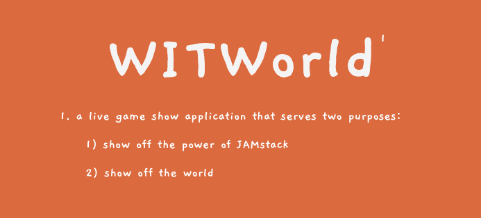
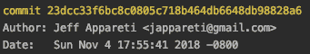
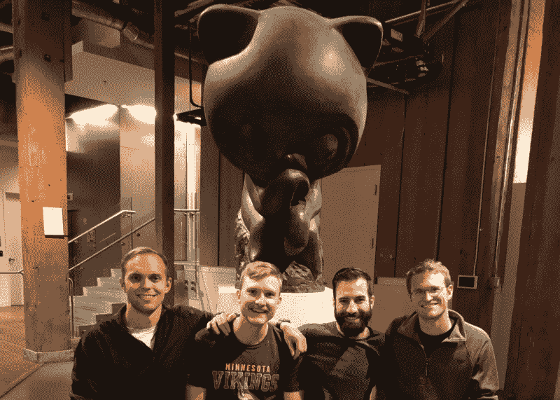

# JAMstack 的力量:4 个陌生人如何在短短的周末建立一个互动的现场游戏节目应用程序

> 原文：<https://www.freecodecamp.org/news/the-power-of-jamstack-how-4-strangers-built-an-interactive-live-game-show-app-in-a-short-weekend-f8c1fec4f55b/>

塔达斯·安塔纳维丘斯

# JAMstack 的力量:4 个陌生人如何在短短的周末建立一个互动的现场游戏节目应用程序

### 问题:你能用下面的东西做什么？

*   周六+周日
*   16 小时的头脑风暴、设计和开发时间
*   4 个陌生人在周六早上的早餐会上相遇
*   在 GitHub 举办的[freeCodeCamp/Netlify jam stack 2018 黑客马拉松](https://medium.freecodecamp.org/winners-from-the-2018-freecodecamp-jamstack-hackathon-at-github-2a39bd1db878)的组织者提供了黑客空间、免费食物和一系列黑客马拉松美食

### 答:一个功能性的在线“游戏秀”应用程序。

*   建立在至少 18 个重要的免费软件的基础上(保守估计)
*   大约 80 个并发玩家在现场最终演示
*   4 美元总费用(针对一个域名)
*   从 28 个团队和数百名提交作品的参与者中选出一名 500 美元大奖

世界各地团队的最终投票结果是:

> “游戏秀”web 应用程序，向现场参与的观众展示来自世界各地的精选图片。在每个游戏中，观众被要求在地图上标出照片拍摄的位置。玩家离实际位置越近，他们在排行榜上的位置就越高。

[见此处储存库。](https://github.com/tadasant/where-in-the-world)

术语“**静态站点**”伴随着许多包袱。这感觉像是互联网早期的遗物，当时静态网页被认为是“为所有用户显示来自所有上下文的相同信息”——在撰写本文时，这种说法仍然存在于维基百科的[静态网页](https://en.wikipedia.org/wiki/Static_web_page)条目中。

因此，当我们说一个 [JAMstack](https://jamstack.org/) 应用程序的根本基础是它以一个静态网站为中心时，肯定会引起很多人的惊讶。毕竟，今天网络的个性化、信息负载的本质似乎表明静态网页是不可行的。

这种心态导致了全栈开发人员的激增。各地的训练营和课程都在宣扬像 MERN (MongoDB、Express、React 和 Node)这样的全套技能的必要性。

这种方法当然有价值——但是还有另一种方法。

进入 JAMstack。其使命:**赋能前端工程师**。

更好的性能。更高的安全性。易于扩展。所有这些都只需要 JavaScript、API 和标记。

需要学习像 MERN 这样的全套技术，才能开发出有价值的技术应用，这不再是唯一的途径。绝大多数业务用例不需要你在后端重新发明轮子。认证是一个已经解决的问题。接受付款是一个已经解决的问题。诸如此类:你可以专注于成为一个 CSS 和 JavaScript 向导来构建你的应用程序，并拼凑出可靠、真实和安全的 API 来填补空白。

每一个新的 API 都会带来一个新的用例世界——一个比一个更加动态。

事实上，世界各地的团队正着手展示这些可能性。

### 炫耀 JAMstack，炫耀世界

是的，这是我们为 WITWorld 带来的俗气口号。

杰夫、[泰勒](https://twitter.com/TJVickOH)、[加布](https://twitter.com/GabeGreenfield)和我在早餐时相遇(谢谢你，GitHub，为我们提供了无穷无尽的美食)，我们讨论了我们可以做些什么的想法。

> 这里有一个。这是那些要么非常好，要么非常非常糟糕的想法之一。你们知道总部的琐事吗？…

早餐后的主题演讲结束后，杰夫轻声对我们说:

> *嘿，让我们称之为“世界上的哪里”*

我们去了赛马场。

### 在黑客马拉松上，你正在为演示而构建

我们早期所做的最好的决定之一是选择我们的北极星，削减脂肪，并专注于一个目标。这个目标——在大多数黑客马拉松中都应该如此——是:让我们构建演示所需的步骤。不多不少。

这意味着这将不是一个生产就绪的应用程序。这意味着我们的 API 键被硬编码到我们的客户端代码中。这意味着如果任何一个玩家决定点击浏览器上的“后退”按钮，我们的应用就会爆炸。CSS 间距关闭。万圣节我们的调色板晚了一周。意大利面条，但它有效？运走了。

[我们的库是公开的](https://github.com/tadasant/where-in-the-world)，但是请，请不要看我们的代码。简直是一塌糊涂。事实上，我们最后一次提交是在下午 5:56，而代码完成的截止时间是下午 6:00，这就足够了。

Netlify’s painless webhook-based CI setup had this 5:56 PM commit live on [https://witworld.live/](https://witworld.live/) a minute later

### 有了 JAMstack，我们坐在巨人的肩膀上

早期，我们对虚拟世界在技术上的形成有一个粗略的想法。很明显，GraphQL 订阅必须是它的核心:sockets 是制作一个“活的”web 应用程序的最佳方式，GraphQL 已经巧妙地将这个概念打包成了一个“订阅”。

只有一个问题:我们中没有人曾经写过 GraphQL 订阅。

哈苏拉前来救援。

Hasura 提供了“几分钟内通过 Postgres 数据库的 GraphQL 服务器和事件触发器”，并且是黑客马拉松的赞助商之一。

用 Hasura 的文档来说，将我们的应用程序从典型的读写推拉模式转换成基于 web 套接字的实时模式是一件简单的事情:

> *您可以将任何查询转换为订阅，只需将`query`替换为`subscription`作为操作类型。*

和几行 Apollo 配置，以插入 Hasura 方便的 web socket 端点。

这只是一个例子。我们一次又一次地经历了这种简单的“两行代码和 XYZ 主要功能准备就绪”的范例:

*   脸书的`[create-react-app](https://github.com/facebook/create-react-app)`给了我们一个完整的、生产就绪的 webapp 架构，只需要几个命令行调用
*   将该应用部署到 Netlify 上的全球 CDN 上，只需点击漂亮的用户界面
*   Apollo 和 T2 graph QL 规范的结合意味着客户端的每一种数据操作都有一个清晰的标准
*   保持我们应用程序中 CSS 的易用性和模块化
*   谷歌地图应用程序接口(API)意味着我们在阅读了一个小时的文件后，我们的应用程序中集成了一个交互式的世界地图
*   Netlify 的功能——AWS Lambda 上的抽象——给了我们一个完美的地方来集中我们的“游戏大师”操作，这对于一个流畅的演示来说至关重要

更不用说我们使用的所有小的 FOSS npm 库了，这样我们就不用花太多时间去弄清楚纬度和经度实际上意味着什么，以及其他的粘合物。

我们不要忘记在 Chrome 和 Firefox 等现代浏览器中投入了多少工作，也不要忘记负责 Netlify-Slack webhooks 的人员，每当我们的构建失败时，他们都会提醒我们，或者 React 本身的行业转移存在。即使是像 Heroku 这样的工具，我们只需点击一下就可以部署一个 Hasura 实例——这证明了它们是多么令人印象深刻，它们在我们几乎意识不到它们的主要作用的情况下运行如此顺畅。

最好的部分:**以上都不需要花费一美元来使用**。无论如何都比不上黑客马拉松的规模。

### 总之，我们是幸运的

​ *(Left to right) Tadas, Gabe, Jeff, and Tyler. GitHub’s Octocat was evidently watching over us.*

在本周末的剩余时间里，如果这些场景中的任何一个没有发生，我们可能就不会谈论今天的 WITWorld 了:

*   在我们上台展示最终演示的 2 分钟前，Tyler 在我们的演示设置中发现了一个错误，这个错误会使每个游戏都运行相同的图片。一分钟后，他已经诊断并修复了它。
*   我们的应用程序充满了安全漏洞和缺陷。在任何演示过程中，有人都可能在两秒钟内清除我们的数据库。
*   我们碰巧选了一个以“W”开头的队名。这意味着我们有幸在最后进行评审面试，最后进行最后陈述。由于整个过程时间紧迫，额外准备的每一分钟都是宝贵的。
*   还记得你随机挑选的大学室友吗？很有可能这是一次可怕的经历。然后是我们:四个陌生人奇迹般地熬过了周末，没有一点分歧。
*   我们广泛的技能和能力意味着，在有人介入并快速修复他们在自己的工作中遇到的问题之前，我们从未在任何特定的开发问题上停留超过很短的时间。众所周知，黑客马拉松项目会因为一些烦人的 bug 而告吹，没人能在几个小时内搞清楚——我们设法避开了这一切。
*   在我们上台处理 70+之前，我们从未与超过少数人一起测试过我们的应用程序。我们相信 Heroku 可以在其免费层上处理这么多的 websocket 连接，这是一种盲目的信念。

我可以继续。这个周末就像过山车一样，然而一次又一次，事情都回到正轨。

### WITWorld 将作为一个开源项目存在

由于我们对 WITWorld 的未来没有具体的计划，不久的将来我们将清理代码库，建立 MIT 许可证和一些结构化问题，并将它推向 JAMstack 技术的合理公开展示。

所有技能水平的贡献者都非常受欢迎！无论你是想贡献一份力量，还是想关注任何进展，我们都乐意让你知道。[加入邮件列表](http://eepurl.com/dNYsno)。

### JAMstack 正被一个地狱般的社区所引领

在 21 世纪初，你需要购买自己的服务器机架空间来建立一个网站。AWS 和其他云提供商在 2010 年颠覆了这个概念。

如今，我们正处于这种进化的下一个阶段:你不需要后端或开发运维专家来构思你的下一个应用。Netlify 和 API 经济的其他部分有望在 2020 年前翻过这一页。

非常感谢那些参与黑客马拉松的人:

*   真实世界反应的本杰明·邓菲——黑客马拉松的杰出组织者
*   自由代码营的昆西·拉森——派对生活和谦逊的自由代码营帝国缔造者
*   Netlify 的马特·比尔曼和菲尔·霍克斯沃斯也参加了 [JAMstack_conf](https://jamstackconf.com/) 的比赛
*   GitHub 的布莱恩·道格拉斯——亲切的主人和食物提供者
*   所有的 API 赞助商:哈苏拉、弗娜、福姆施普雷、克拉里菲和皮隆

幕后有更多的人。

像这次黑客马拉松这样的事件以及相应的 JAMstack_conf 只是一个开始。我们期待 JAMstack 社区的美好未来！

非常感谢 Jeff Appareti、Gabe Greenfield 和 Tyler Vick 审阅了这篇文章的草稿。和一个很棒的团队共度周末。

这篇文章最初发表于[tadasant.com](https://tadasant.com/blog/power-of-jamstack-live-game-show-application)