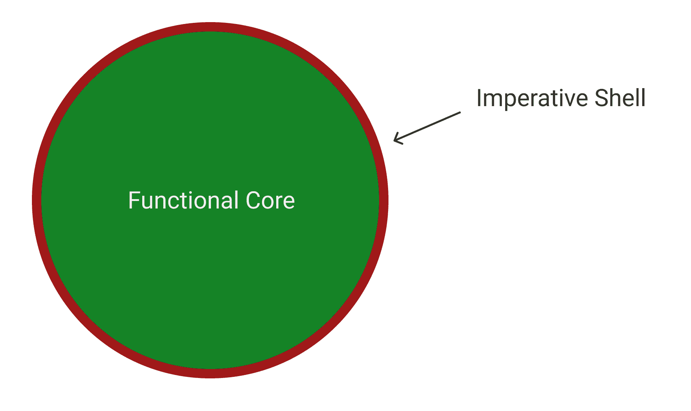
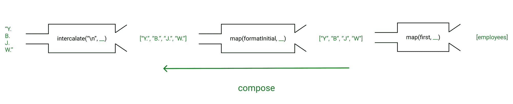
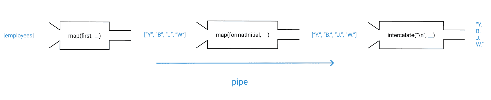
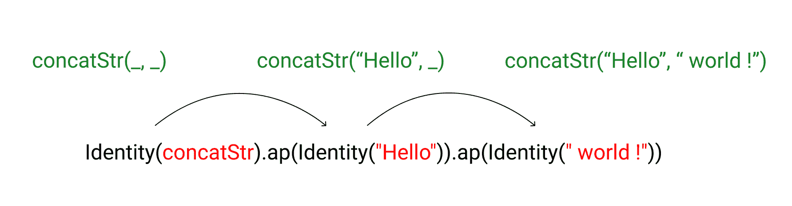

# 函数式编程的原理

> 原文：<https://www.freecodecamp.org/news/the-principles-of-functional-programming/>

在这篇文章中，我将阐述函数式编程的主要原则，从基础开始，然后探索更高级的概念。

我将首先谈论为什么你应该为函数式编程而烦恼，也就是它什么时候有用，什么时候没用。

我们将在这里讨论很多内容，所以请按照您自己的进度进行。在阅读间隙休息一下，做我建议的练习。

当然，你可以根据自己的需要跳过某些部分，或者反复阅读。

这篇文章有意针对几种读者:

1.  那些对 FP 几乎一无所知但对 JavaScript 非常熟悉的人
2.  那些对 FP 有中级知识，对范式有一些熟悉，但希望对整体有一个更清晰的了解，并希望探索高级概念的人
3.  那些非常了解 FP 并且想要一个备忘单的人，如果需要的话，可以重温一些概念

我邀请你仔细思考每一句话，而不是像我们都习惯的那样匆忙浏览内容。

我希望这篇文章将是你进入函数式编程之旅的一个重要里程碑，也是你需要时可以参考的信息来源。

不过，只是提醒一下——这篇文章并不构成事实的唯一来源，而是邀请你在阅读后继续深入。

换句话说，这意味着要用更多的资源和实践来重新审视和扩展。

希望能理清你心目中的功能景观，激发你对自己不知道的东西的兴趣，更重要的是为你的日常项目提供有用的工具。

事不宜迟，我们开始吧！

## 为什么是函数式编程？

在我看来，FP 有 3 个主要的好处和 3 个(小)缺点:

优势:

1.  可读性更强，可维护性更好
2.  更少的错误，尤其是在并发的上下文中
3.  解决问题的新思路
4.  (个人奖励)非常值得学习！

缺点:

1.  可能会有性能问题
2.  处理状态和 I/O 时不够直观
3.  大多数人都不熟悉+数学术语会减缓学习过程

现在我来解释为什么我会这么想。

### 可读性增强

首先，函数式编程通常可读性更好，因为它的**声明性**本质。

换句话说，代码专注于描述计算的结果，而不是计算本身。

凯尔·辛普森是这样表述的:

> 声明性代码是更注重描述“什么”结果的代码。命令式代码(相反)专注于精确地指导计算机“如何”做某事。

因为我们大部分时间都在阅读代码(我猜大约 80%的时间)而不是编写代码，所以为了提高编程效率，可读性是我们应该增强的第一件事。

也很有可能你会在几周不碰它之后回到一个项目，所以你短期记忆中的所有内容都会消失。

因此，理解你的**命令式**代码不会像以前那么容易。

同样的事情也适用于和你一起工作的潜在同事。

所以可读性对于一个更重要的目的来说是一个巨大的优势:可维护性。

我可以就此停止争论。增加可读性应该会给你学习函数式编程的主要动力。

幸运的是，随着您对该范例的熟悉，您将会越来越多地体验到这一优势。

不需要成为专家。当你写一行声明性的代码时，你就会体验到它。

现在是第二个论点。

### 错误较少的代码

函数式程序更少出错，尤其是在并发环境中。

因为函数式风格努力避免突变，所以共享资源不会有意外的内容。

例如，假设两个线程访问同一个变量。

如果这个变量可以变异，那么，随着程序的增长，当你重新访问它时，你可能得不到你想要的。

此外，多处理器系统的兴起允许多个线程并行执行。

所以现在也有重叠的风险(一个线程可能试图写，而另一个试图读)。

不利用硬件有点可惜，因为我们无法让软件工作。

然而，JavaScript 是单线程的，我个人的经验并没有超出这个范围。

因此，我对这个论点不太有信心，但是更有经验的程序员似乎同意这个事实(就我所听到/读到的而言)。

### 问题解决

最后，最后一个优势——也是比您想象的更重要的优势——是函数式编程为您提供了一种解决问题的新思路。

您可能太习惯于使用类和对象(面向对象编程)来解决问题，以至于您甚至不认为可能有更好的方法来这样做。

我并不是说函数式编程总是更好。

我是说在某些情况下会更好，拥有这些知识会(重新)打开你的思维，让你成为一个更好的程序员。

因为现在你将有更多的工具和更大的能力来为手头的问题选择正确的方法。

我甚至认为 FP 中的一些核心原则可以转化为计算机领域之外的问题解决。

现在来看看弊端。

### 性能问题

第一个是，通过应用 FP 技术，你最终会使用大量的时间和/或内存。

因为你不想让事情变异，所以过程基本上就是复制数据，然后变异那个副本，把它作为当前状态。

这意味着原始数据保持不变，但您分配了大量时间和内存来制作新的副本。

因此，当您制作大量副本(非常大的嵌套对象)或使用类似递归的技术(在调用堆栈中累积层)时，可能会出现性能问题。

然而，许多解决方案(结构共享、尾调用优化)使得性能不佳的情况非常少见。

### 不太直观

第二个缺点是当你需要状态或者 I/O 操作的时候。

好吧，你会说:

> 计算机是有状态的机器！最终我需要调用我的数据库，或者在屏幕上显示一些东西，或者写一个文件。

我完全同意。

重要的是要记住，函数式编程是一种对人类来说很方便的方式，但是机器一直在进行命令式操作(也就是突变)。

这只是它在最底层的工作方式。

计算机在给定时刻处于一种状态，它一直在变化。

FP 的要点是简化我们对代码的推理，这增加了从代码中产生的混乱的东西实际工作的机会。

而函数式反应式编程帮助我们处理状态(如果你想了解更多，在帖子末尾有链接)。

即使命令式代码乍一看似乎更容易/更直观，您最终也会迷失方向。我很有信心，如果你开始努力学习 FP，它会有回报的。

对于 I/O——输入/输出的缩写，即与计算机和外围设备之间传输数据的代码——我们不能再拥有纯粹孤立的功能。

为了解决这个问题，我们可以采用[功能核心命令外壳](https://www.destroyallsoftware.com/screencasts/catalog/functional-core-imperative-shell)方法。

换句话说，我们希望以函数的方式做尽可能多的事情，并将 I/O 操作推回到程序的外层:



### 更陡峭的学习曲线

最后，最后一个缺点是函数式编程充斥着数学术语。当开发人员试图学习它时，这经常会产生不必要的摩擦。

这可能是因为这种编程风格首先出现在学术界，并在出现和变得更加流行之前停留了很长时间。

然而，这些技术上的/不熟悉的术语不应该让你忽视它们背后非常强大的数学原理。

总而言之，我认为 FP 的优点大于缺点。

对于大多数通用 JavaScript 编程来说，函数式编程很有意义。

请记住，很少有特殊需求的程序不适合 FP。但是如果这不是你的情况，没有理由不利用这个范例。

现在，如果你是一个完全的初学者，你可能会感到有点失落。没关系，忍耐一下。以下部分将阐明我在这里提到的概念。

现在让我们深入了解函数式编程的具体细节。

## 数据、计算和操作

在 FP 中，你可以把你的程序分成 3 个部分:数据、计算和动作。

### 数据

数据就是数据。在我们的语言中，它们有不同的形式，不同的类型。

在 JavaScript 中，有数字、字符串、数组、对象等等。但归根结底，它们只是一点点。

数据是程序的组成部分。没有这些就像水上公园里没有水一样。

然后我们可以用这些数据做一些事情:计算或者行动。

### 计算

计算是类似数学的数据转换。

函数是创建它们的一种方式。你提供给它一组输入，它返回给你一组输出。

就是这样。

它在函数之外什么也不做，就像在数学中一样。函数周围的世界不受影响。

此外，如果您多次向函数提供相同的输入，它应该总是给您相同的输出。

这类函数的一个常见术语是**纯函数**。

因为它的特性，它的整个行为是预先知道的。事实上，因为它只是返回一个值，我们可以把它当作那个值，当作数据。

换句话说，我们可以用函数调用返回的值来代替它，这不会改变程序的状态。

这被称为**参照透明度**。因此，它们很容易推理，你可以把它们作为函数的输入或输出，并把它们赋给变量。

这几类函数称为**一级**函数。在 JavaScript 中，所有的函数都是一流的。

使用纯函数是安全的，因为它们就像值一样。

对于不仅仅是返回值的函数，你依赖于人的记忆。这是一个糟糕的策略，尤其是对于多人参与的大型软件。

所以你可以用**纯函数**代替**计算**。他们是相同的。

现在我们来谈谈行动。

### 行动

当然，我们也需要影响外部世界的功能，真正做一些事情的功能。否则，你的程序将是一个没有屏幕的计算器。

当一个功能影响到自身以外的事物时，我们说它有**副作用**。与纯函数相反，它被说成是**不纯的**。

常见的副作用是函数外部变量的赋值/突变、登录到控制台、进行 API 调用等等。

所以基本上，**动作**和**不纯功能**是一样的。

这里有一个简单的例子来说明这些概念:

```
 // ↓ variable
//      ↓ data
let a = 3;

// Calculation / Pure function
const double = (x) => x * 2;

double(a);
// 6

// Action / Impure function
const IncThenPrint = () => {
  // assignment of a variable outside the scope of the function
  a = a + 1;

  // do something (here printing) outside the function
  console.log(a);
};

IncThenPrint();
// console: 4
```

### 函数式编程中的数据、计算和动作

在 FP 中，目标是分离数据、计算和动作，同时努力用计算完成大部分工作。

为什么？因为行动依赖于外界。我们不能完全控制它。

因此，我们可能会得到意想不到的结果/行为。所以如果你的程序大部分是由动作组成的，它很快就会变得一团糟。

以前面的例子为例，如果在程序中的某个地方，有人决定将一个对象赋给变量`a`，该怎么办？

当运行`IncThenPrint`时，我们会得到一个意想不到的结果，因为给一个对象加 1 是没有意义的:

```
let a = 3;

// ...
a = { key: "value" };
// ...

// Action / Impure function
const IncThenPrint = () => {
  // assignment of a variable outside the scope of the function
  a = a + 1;

  // do something (here printing) outside the function
  console.log(a);
  // prints: 4
};

IncThenPrint();
// prints: [object Object]1
// (Because JavaScript is a dynamically-typed language, it converts both operands of the + operator
// to strings so it can perform the operation, thus explaining the result.
// But obviously, that not what was intended.)
```

在程序中区分数据、计算和操作的能力是一项需要培养的基本技能。

### 绘图

在函数式编程的世界中，映射是一个相当琐碎但非常重要的概念。

“从 A 到 B 的映射”意味着通过某种关联从 A 到 B。

换句话说，A 通过它们之间的某种链接指向 B。

例如，一个纯函数将一个输入映射到一个输出。我们可以这样写:输入->输出；其中箭头表示功能。

另一个例子是 JavaScript 中的对象。它们将键映射到值。

在其他语言中，这种数据结构通常被称为“map”或“hash-map ”,这更能说明问题。

就像后一个术语推断的那样，幕后发生的事情是，每个键都通过一个*散列*函数链接到它的值。密钥被传递给*散列*函数，该函数返回存储它们的数组中相应值的索引。

在没有深入细节的情况下，我想介绍这个术语，因为我将在本文中使用它。

### 更多关于副作用的信息

在我们继续之前，我想更深入地了解 JavaScript 的副作用，并展示一个您可能没有意识到的恶性陷阱。

提醒我们自己，说一个函数有副作用就等于说，“当这个函数运行时，它范围之外的一些东西会改变。”

如我所说，它可以是登录到控制台，进行 API 调用，更改外部变量，等等。

让我们看一个后者的例子:

```
let y;

const f = (x) => {
  y = x * x;
};

f(5);
y; // 25
```

这很容易理解。

当`f`运行时，它给外部变量`y`分配一个新值，这是一个副作用。

这个例子的一个简单版本是:

```
const f = (x) => x * x;

const y = f(5);
// 25
```

但是还有另一种方法来改变一个更微妙的外部变量:

```
let myArr = [1, 2, 3, { key: "value" }, "a string", 4];

const g = (arr) => {
  let total = 0;

  for (let i = 0; i < arr.length; i++) {
    if (Number.isNaN(Number(arr[i]))) {
      arr[i] = 0;
    }
    total += arr[i];
  }

  return total;
};

g(myArr);
// 10
myArr;
// [1, 2, 3, 0, 0, 4]
// Oops, all elements that were not numbers have been changed to 0 !
```

这是为什么呢？

在 JavaScript 中，当把一个值赋给一个变量或者传递给一个函数时，它会被自动复制。

但是这里有一个区别。

**原始值** ( `null`、`undefined`、字符串、数字、布尔和符号)总是由**值复制**赋值/传递。

相比之下，**复合值**像对象、数组和函数(顺便说一下，数组和函数是 JavaScript 中的对象，但为了清楚起见，我不把它们称为对象)在赋值或传递时通过**引用**创建副本。

所以在前面的例子中，传递给`g`的值是一个复合值，数组`myArr`。

所发生的是`g`将`myArr`的内存地址存储在`arr`中，这是函数体中使用的参数名。

换句话说，在`myArr`中没有您所期望的每个元素的值副本。因此，当你操作或改变`arr`时，它实际上会进入`myArr`的内存位置并执行你指定的任何计算。

所以，是的，要意识到这个怪癖。

### 练习(第一套)

1.  在下面的代码片段中，找到纯函数和不纯函数:

```
// a
const capitalizeFirst = (str) => str.charAt(0).toUpperCase() + str.slice(1);

// b
const greeting = (persons) => {
  persons.forEach((person) => {
    const fullname = `${capitalizeFirst(person.firstname)} ${capitalizeFirst(
      person.lastname
    )}`;

    console.log(`Hello ${fullname} !`);
  });
};

// c
const getLabels = async (endpoint) => {
  const res = await fetch("https://my-database-api/" + endpoint);
  const data = await res.json();
  return data.labels;
};

// d
const counter = (start, end) => {
  return start === end
    ? "End"
    : // e
      () => counter(start + 1, end);
};
```

2.将这段代码转换成一个纯函数(如果需要，可以创建多个函数):

```
const people = [
  { firstname: "Bill", lastname: "Harold", age: 54 },
  { firstname: "Ana", lastname: "Atkins", age: 42 },
  { firstname: "John", lastname: "Doe", age: 57 },
  { firstname: "Davy", lastname: "Johnson", age: 34 },
];

const parsePeople = (people) => {
  const parsedPeople = [];

  for (let i = 0; i < people.length; i++) {
    people[i].firstname = people[i].firstname.toUpperCase();
    people[i].lastname = people[i].lastname.toUpperCase();
  }

  const compareAges = (person1, person2) => person1.age - person2.age;

  return people.sort(compareAges);
};

parsePeople(people);
// [
//   {firstname: "DAVY", lastname: "JOHNSON", age: 34},
//   {firstname: "ANA", lastname: "ATKINS", age: 42},
//   {firstname: "BILL", lastname: "HAROLD", age: 54},
//   {firstname: "JOHN", lastname: "DOE", age: 57},
// ]
```

[检查答案](https://www.freecodecamp.org/news/the-principles-of-functional-programming/#set-1)。

## 不变

就像我们之前看到的，一个常见的副作用是变异一个变量。

你不会想在函数式编程中那样做。所以函数式程序的一个重要特征是数据的**不变性**。

在 Clojure 和 Haskell 这样的函数式语言中，这个特性是内置的——除非语言允许，否则您没有办法改变数据。无论如何，你必须有意识地选择这样做。

但是在 JavaScript 中，情况并非如此。

所以这更多的是关于拥有“不变性”的心态，而不是这个特性的真正健壮的实现。

这意味着你基本上可以复制你想要处理的数据。

在第一部分中，我们看到 JavaScript 函数自动复制传递的参数。虽然原始值是通过值来复制的，但是复合值只能通过引用来复制，所以仍然有可能对它们进行变异。

因此，当在一个函数中处理一个对象/数组时，你应该做一个拷贝，然后对它进行操作。

顺便说一下，请注意，有些内置函数不会改变它所调用的值，而其他函数会。

例如， [Array.prototype.map](https://developer.mozilla.org/en-US/docs/Web/JavaScript/Reference/Global_Objects/Array/map) ， [Array.prototype.filter](https://developer.mozilla.org/en-US/docs/Web/JavaScript/Reference/Global_Objects/Array/filter) ，或者 [Array.prototype.reduce](https://developer.mozilla.org/en-US/docs/Web/JavaScript/Reference/Global_Objects/Array/reduce) 都是不要对原数组进行变异。

另一方面， [Array.prototype.reverse](https://developer.mozilla.org/en-US/docs/Web/JavaScript/Reference/Global_Objects/Array/reverse) 和 [Array.prototype.push](https://developer.mozilla.org/en-US/docs/Web/JavaScript/Reference/Global_Objects/Array/push) 都是对原数组进行变异。

您可以在文档中找到内置函数是否改变了它所调用的值，所以如果您不确定，可以查看一下。

这很烦人，而且最终也不完全安全。

### 浅层拷贝与深层拷贝

从 ES6 开始，很容易通过扩散记号、 [`Array.from()`](https://developer.mozilla.org/fr/docs/Web/JavaScript/Reference/Objets_globaux/Array/from) 、 [`Object.assign()`](https://developer.mozilla.org/fr/docs/Web/JavaScript/Reference/Objets_globaux/Object/assign) 制作对象/数组副本。

例如:

```
// arrays
const fruits = ["apple", "strawberry", "banana"];
const fruitsCopy = [...fruits];
fruitsCopy[0] = "mutation";
// fruitsCopy: ['mutation', 'strawberry', 'banana']
// fruits (not mutated): ['apple', 'strawberry', 'banana']

// objects
const obj = { a: 1, b: 2, c: 3 };
const objCopy = { ...obj };
objCopy.a = "mutation";
// objCopy: {a: "mutation", b: 2, c: 3}
// obj (not mutated): {a: 1, b: 2, c: 3}
console.log(obj);
console.log(objCopy);
```

这很酷，但有一个问题。

扩展数组/对象只有第一级按值复制，也称为**浅**复制。

因此所有后续级别仍然是可变的:

```
// But with nested objects/arrays, that doesn't work
const nestedObj = { a: { b: "canBeMutated" } };
const nestedObjCopy = { ...nestedObj };
nestedObjCopy.a.b = "hasBeenMutated!";
console.log(nestedObj);
console.log(nestedObjCopy);
// nestedObjCopy: {a: {b: "hasBeenMutated!"}}}
// nestedObj (mutated): {a: {b: "hasBeenMutated!"}}
```

为了解决这个问题，我们需要一个自定义函数来做**深度**拷贝。这篇[文章](https://medium.com/javascript-in-plain-english/how-to-deep-copy-objects-and-arrays-in-javascript-7c911359b089)讨论了多种解决方案。

下面是其中提出的自定义函数的简化版本:

```
// works for arrays and objects
const deepCopy = (obj) => {
  if (typeof obj !== "object" || obj === null) {
    return obj; // Return the value if obj is not an object
  }

  // Create an array or object to hold the values
  let newObj = Array.isArray(obj) ? [] : {};

  for (let key in obj) {
    // Recursively (deep) copy for nested objects, including arrays
    newObj[key] = deepCopy(obj[key]);
  }

  return newObj;
};

const nestedObj = {
  lvl1: { lvl2: { lvl3: { lvl4: "tryToMutateMe" } } },
  b: ["tryToMutateMe"],
};
const nestedObjCopy = deepCopy(nestedObj);

nestedObjCopy.lvl1.lvl2.lvl3.lvl4 = "mutated";
nestedObjCopy.b[0] = "mutated";

console.log(nestedObj);
// { lvl1: { lvl2: { lvl3: { lvl4: "tryToMutateMe" } } }, b: ["tryToMutateMe"]}
console.log(nestedObjCopy);
// { lvl1: { lvl2: { lvl3: { lvl4: "mutated" } } }, b: ["mutated"]}
```

如果您已经使用了一个提供功能实用程序的库，那么它很可能有一个可以进行深层复制的库。我个人喜欢[拉姆达](https://ramdajs.com)。看它的[克隆](https://ramdajs.com/docs/#clone)功能。

如果浅拷贝和深拷贝之间的区别仍然不清楚，请检查一下这个。

现在来说说性能。

显然，制作拷贝不是没有成本的。

对于程序中对性能敏感的部分，或者在频繁发生变化的情况下，由于处理和内存的原因，创建新的数组或对象(尤其是当它包含大量数据时)是不可取的。

在这些情况下，使用像 [Immutable.js](https://immutable-js.github.io/immutable-js/) 这样的库中的不可变数据结构可能是一个更好的主意。

他们使用一种叫做**结构共享**的技术，我在这篇文章前面谈到 FP 的缺点时提到过。

查看这篇精彩的[演讲](https://www.youtube.com/watch?v=I7IdS-PbEgI&list=PLts8-qGf74Q5QfIkOPGqwO_7d1ljMWa8p&index=22&t=0s)以了解更多信息。

因此，在我看来，处理不可变数据是函数式程序员工具箱中的第二项技能。

## 组成和携带

### 作文

毫不奇怪，函数式程序的基本构件是函数。

因为你的函数没有副作用，而且被认为是一流的，所以我们可以编写它们。

如我所说，*一级*意味着它们被视为常规数据结构，可能被赋给变量，作为参数传递，或者从其他函数返回。

构图是一个强有力的想法。

从微小的功能开始，你可以把它们的功能加起来，形成一个更复杂的功能，但是不需要预先准备。

此外，你还能获得更大的灵活性，因为你可以轻松地重新安排你的作品。

有了数学定律的支持，我们知道只要我们遵循它们，一切都会成功。

让我们引入一些代码来使事情具体化:

```
const map = (fn, arr) => arr.map(fn);

const first = (xs) => xs[0];

const formatInitial = (x) => x.toUpperCase() + ".";

const intercalate = (sep, arr) => arr.join(sep);

const employees = ["Yann", "Brigitte", "John", "William"];

const initials = intercalate("\n", map(formatInitial, map(first, employees)));
// Y.
// B.
// J.
// W.
```

哎哟——这里有一点筑巢。

花些时间去理解发生了什么。如您所见，有一些函数调用作为参数传递给外部函数。

借助`map`的力量，我们本质上组合了`first`、`formatInitial`和`join`的功能，最终将它们应用在`employees`阵列上。

相当酷！

但是如你所见，嵌套很烦人。这使得事情更难阅读。

### 携带

为了让这些东西变得扁平，让构图变得轻而易举，我们必须谈论一下**奉承**。

这个术语可能会吓到你，但是别担心，这只是一个简单概念的术语:一次给一个函数输入一个参数。

通常，当我们进行函数调用时，我们会一次提供所有参数并返回结果:

```
const add = (x, y) => x + y;

add(3, 7);
// 10
```

但是，如果我们只能传递一个参数，并在以后提供第二个参数呢？

嗯，我们可以这样做:

```
const add = (x) => (y) => x + y;

const addTo3 = add(3);
// (y) => 3 + y

// ...later
addTo3(7);
// 10
```

如果我们还没有所有的论点，这可能是有用的。

你可能不明白为什么我们没有事先进行所有的争论，但是你以后会明白的。

多亏了闭包，我们一步一步地预加载函数及其参数，直到最终运行它。

如果你很难理解关闭的概念，检查[这个](https://www.youtube.com/watch?v=CQqwU2Ixu-U)，然后[这个](https://github.com/getify/You-Dont-Know-JS/blob/2nd-ed/scope-closures/ch7.md#chapter-7-using-closures)来深入了解。

简而言之，闭包允许内部函数访问外部函数作用域的变量。这就是为什么我们可以在来自外部作用域`add`的`addTo3`作用域中访问`x`。

通常情况下，你不会想用这种特殊的形式来编写函数。此外，你不能总是这样写它们，例如，当你使用外部库函数和几乎任何你没有写但使用的东西时。

出于这个原因，有一个常见的助手来处理一个函数(来自凯尔·辛普森的书 YDKJS ):

```
const curry = (fn, arity = fn.length) => {
  return (function nextCurried(prevArgs) {
    return function curried(...nextArgs) {
      const args = [...prevArgs, ...nextArgs];

      return args.length < arity ? nextCurried(args) : fn(...args);
    };
  })([]);
};
```

`curry`取一个函数和一个名为 **arity** 的数(可选)。

函数的 arity 是它接受的参数的数量。

在`add`的情况下，是 2。

我们需要这些信息来知道什么时候所有的参数都在那里，从而决定运行这个函数或者返回另一个接受剩余参数的 curried 函数。

所以让我们用`add`来重构我们的例子:

```
const add = curry((x, y) => x + y);

const addTo3 = add(3);

addTo3(7);
// 10
```

或者我们仍然可以直接调用`add`及其所有参数:

```
const add = curry((x, y) => x + y);

add(3, 7);
// 10
```

### 部分应用

实际上， *curried* 严格地说是“一次接受一个参数”，不多也不少。

当我们可以提供我们想要的参数数量时，我们实际上是在讨论**部分应用**。

因此，局部应用是一种受约束的形式。

让我们来看一个与 currying 相比更明确的部分应用示例:

```
const listOf4 = curry((a, b, c, d) => `1\. ${a}\n2\. ${b}\n3\. ${c}\n4\. ${d}`);

// strict currying

const a = listOf4("First")("Second")("Third")("Fourth");
// or
const b = listOf4("First");
// later
const c = b("Second")("Third");
// later
const d = c("Fourth");

// partial application

const e = listOf4("First", "Second", "Third", "Fourth");
// or
const b = listOf4("First");
// later
const c = b("Second", "Third");
// later
const d = c("Fourth");
```

你看出区别了吗？

对于 currying，您应该一次提供一个参数。如果您想要输入多个参数，那么您需要进行一个新的函数调用，因此每个参数都有一对括号。

老实说，那只是风格问题。

不习惯的时候看起来有点别扭，但另一方面，也有人觉得偏应用风格比较乱。

我介绍的`curry`助手可以让你两者兼得。

它延伸了奉承的真正定义，但我更喜欢两种功能都有，不喜欢凯尔·辛普森在书中使用的名字`looseCurry`。所以，我作弊了一点。

请记住不同之处，并意识到你在图书馆找到的助手可能遵循严格的定义。

### 数据排在最后

我想说的最后一点是，我们通常把数据作为最后一个参数。

对于我之前使用的函数，这并不明显，因为所有的参数都是数据。但是看看这个:

```
const replace = curry((regex, replacement, str) =>
  str.replace(regex, replacement)
);
```

您可以看到数据(`str`)在最后的位置，因为它可能是我们最不想通过的东西。

你会发现在构造函数的时候就是这种情况。

### 把所有的东西放在一起

现在，为了利用 currying 和展平我们之前嵌套的混乱，我们还需要一个用于合成的助手。

你猜对了，它叫`compose`！：

```
const compose = (...fns) =>
  fns.reverse().reduce((fn1, fn2) => (...args) => fn2(fn1(...args)));
```

`compose`将函数作为参数，并返回另一个函数，该函数将参数传递给整个管道。

由于`fns.reverse()`，功能从右向左应用。

因为`compose`返回一个接受未来参数的函数，我们可以自由地关联我们的函数而不调用它们，这允许我们创建中间函数。

我们最初的例子是:

```
const map = (fn, arr) => arr.map(fn);

const first = (xs) => xs[0];

const formatInitial = (x) => x.toUpperCase() + ".";

const intercalate = (sep, arr) => arr.join(sep);

const getInitials = compose(formatInitial, first);

const employees = ["Yann", "Brigitte", "John", "William"];

const initials = intercalate("\n", map(getInitials, employees));
// Y.
// B.
// J.
// W.
```

`first`和`formatInitial`已经接受了一个参数。

但是`map`和`intercalate`有两个参数，所以我们不能把它们包含在我们的`compose`助手中，因为只有一个参数被传递。在这种情况下，它是一个数组，两者都作为最终参数(记住，数据是最后传递的)。

最好能提前给出`map`和`intercalate`各自的第一个论点。

等一下——我们可以用咖喱招待他们！：

```
// ...

const map = curry((fn, arr) => arr.map(fn));

const intercalate = curry((sep, arr) => arr.join(sep));

const formatInitials = compose(
  intercalate("\n"),
  map(formatInitial),
  map(first)
);

const employees = ["Yann", "Brigitte", "John", "William"];

const initials = formatInitials(employees);
// Y.
// B.
// J.
// W.
```

这么干净！

就像我说的，`compose`用我们给它的函数做了一个管道，从右到左调用它们。

所以让我们想象一下解析`formatInitials(employees)`时会发生什么:



就我个人而言，我更喜欢从左到右，因为在写函数时，我喜欢考虑先应用什么转换，写下来，然后重复，直到管道结束。

而对于`compose`，我必须后退一步来编写下一个转换。这打断了我的思路。

幸运的是，为了从左到右调整它并不复杂。

我们只需要去掉`.reverse()`部分。

让我们称我们的新助手为:

```
const pipe = (...fns) => fns.reduce((fn1, fn2) => (...args) => f2(f1(...args))); 
```

因此，如果我们重构前面的代码片段，我们会得到:

```
const formatInitials = pipe(map(first), map(formatInitial), intercalate("\n")); 
```

对于可视化，与`compose`相同，但顺序相反:



## 亨德利-米尔纳型签名

如你所知，一个完整的程序最终会包含相当多的函数。

当你在几个星期后重新投入到一个项目中时，你没有上下文来容易地理解每个功能是做什么的。

为了解决这个问题，你只重读你需要的部分。但是这可能会很乏味。

如果有一种快速而强大的方法来记录您的函数并一目了然地解释它们是做什么的，那就太好了。

这就是类型签名的用武之地。它们是记录一个功能如何运行及其输入和输出的一种方式。

例如:

```
// ↓ function name
//                  ↓ input
//                            ↓ output
// formatInitial :: String -> String
const formatInitial = (x) => x.toUpperCase() + ".";
```

这里我们看到`formatInitial`接受一个`String`并返回一个`String`。

我们不关心实现。

让我们看另一个例子:

```
// first :: [a] -> a
const first = (xs) => xs[0]; 
```

类型可以用变量来表示(通常是`a`、`b`等)。)而括号的意思是里面的“一个数组”。

所以我们可以这样解读这个签名:

`first`接受一个数组`a`并返回一个`a`，其中`a`可以是任何类型。

但是因为作为输入的类型与作为输出返回的类型相同，所以我们使用相同的变量。

如果输出是另一种类型，我们会使用`b`:

```
// imaginaryFunction :: a -> b 
```

警告！

这并不能确保`a`和`b`是不同的类型。它们仍然可以是相同的。

最后，让我们来看看`intercalate`的情况，它稍微复杂一点:

```
// intercalate :: String -> [a] -> String
const intercalate = curry((sep, arr) => arr.join(sep)); 
```

好的，这里有两个箭头，可以替换为“返回...”。

它们表示功能。

所以`intercalate`接受一个`String`然后返回一个函数，该函数接受一个`a`数组，该数组返回一个`String`。

哇，这很难保持跟踪。

我们可以这样写签名:

```
// intercalate :: String -> ([a] -> String) 
```

现在更明显的是，它首先返回一个函数，这个函数在这里的括号里。然后该函数将把`[a]`作为输入并返回`String`。

但是为了清楚起见，我们通常不使用它们。基本上，如果你偶然发现表单的签名:

```
// imaginaryFunction :: a -> b -> c -> d -> e

// or

// imaginaryFunction :: a -> (b -> (c -> (d -> e)))

// ...you see how parens nesting affects readability 
```

`e`，右边的类型，是输出。

而之前的一切都是一个一个给定的输入，这表明函数是 curried。

现在，我们通常有类型系统，如 TypeScript 或 Flow，当我们将鼠标悬停在函数名称上时，IDE 能够给我们函数的类型签名。因此，可能没有必要将它们作为注释写在代码中。

但是这仍然是你工具箱中的一个很好的工具，因为很多函数库在它们的文档中使用这些类型签名。惯用的函数式语言(如 Haskell)大量使用它们。

所以如果你给他们一个机会，你就不会完全迷失。

为自己已经读到这里而感到自豪。

现在，您应该能够处理高阶函数了。高阶函数只是将函数作为输入和/或返回它们的函数。

事实上，这正是我们所做的。

例如，`curry`是一个高阶函数，因为它将一个函数作为输入，返回一个函数作为输出。

`compose`、`pipe`、`map`和`reduce`都是高阶函数，因为它们至少接受一个函数作为输入。

它们非常酷，因为它们允许创建非常强大的抽象。

聊够了。让我们练习一下。

### 练习(第二套)

1.  给定以下形式的字符串:

```
const input = "Lorem ipsum dolor sit amet, consectetur adipiscing elit, sed do eiusmod tempor incididunt ut labore et dolore magna aliqua. Ut enim ad minim veniam, quis nostrud exercitation ullamco laboris nisi ut aliquip ex ea commodo consequat. Duis aute irure dolor in reprehenderit in voluptate velit esse cillum dolore eu fugiat nulla pariatur. Excepteur sint occaecat cupidatat non proident, sunt in culpa qui officia deserunt mollit anim id est laborum."; 
```

...这些助手:

```
// filter :: (a -> Boolean) -> [a] -> [a]
const filter = curry((fn, arr) => arr.filter(fn));

// removeDuplicates :: [a] -> [a]
const removeDuplicates = (arr) => Array.from(new Set(arr));

// getChars :: String -> [Character]
const getChars = (str) => str.split("");

// lowercase :: String -> String
const lowercase = (str) => str.toLowerCase();

// sort :: [a] -> [a]
const sort = (arr) => [...arr].sort();
```

创建一个函数`getLetters`,返回一个字符串中所有的字母，不重复，按字母顺序，小写。

目标是使用`compose`和/或`pipe`:

```
// getLetters :: String -> [Character]
const getLetters = ... 
```

注意:您可能需要在最终函数之前创建中间函数。

2.假设您有一个对象，其中组名作为键，对象数组将人表示为值:

```
{
  "groupName": [
    {firstname: "John", lastname: "Doe", age: 35, sex: "M"},
    {firstname: "Maria", lastname: "Talinski", age: 28, sex: "F"},
    // ...
  ],
  // ...
} 
```

创建一个函数，返回以下形式的对象:

```
{
  "groupName": {
    "medianAgeM": 34,
    "medianAgeF": 38,
  },
  // ...
} 
```

其中`medianAgeM`是组中男性的平均年龄，`medianAgeF`是女性的平均年龄。

这里有一些帮手:

```
// map :: (a -> b) -> [a] -> [b]
const map = curry((fn, arr) => arr.map(fn));

// getEntries :: Object -> [[Key, Val]]
const getEntries = (o) => Object.entries(o);

// fromEntries:: [[Key, Val]] -> Object
const fromEntries = (entries) => Object.fromEntries(entries);

// mean :: Number -> Number -> Number
const mean = curry((x, y) => Math.round((x + y) / 2));

// reduceOverVal :: (b -> a -> b) -> b -> [Key, [a]] -> [Key, b]
const reduceOverVal = curry((fn, initVal, entry) => [
  entry[0],
  entry[1].reduce(fn, initVal),
]);
```

您可能必须在最终函数之前创建中间函数，像以前一样，尝试使用`compose`和`pipe`:

```
// groupsMedianAges :: Object -> Object
const groupsMedianAges = ... 
```

3.找到`reduce`的类型签名:

```
const reduce = curry((fn, initVal, arr) => arr.reduce(fn, initVal));
```

4.找到`curry`的类型签名:

```
const curry = (fn, arity = fn.length) => {
  return (function nextCurried(prevArgs) {
    return function curried(...nextArgs) {
      const args = [...prevArgs, ...nextArgs];

      return args.length < arity ? nextCurried(args) : fn(...args);
    };
  })([]);
};
```

[检查答案](https://www.freecodecamp.org/news/the-principles-of-functional-programming/#set-2)。

## 使用盒子:从函子到单子

你可能已经被这一部分的标题压得喘不过气来了。你可能会想，“函子和单子到底是什么？”

或者你可能听说过单子，因为它们是出了名的“难以理解”。

不幸的是，我不能预测你一定会理解这些概念，或者在你做的任何工作中有效地应用它们。

事实上，如果我在本教程的最后谈论它们，那是因为我认为它们是我们不经常需要的非常强大的工具。

令人欣慰的是:像世界上的任何东西一样，它们不是魔法。

它们遵循和其他事物一样的物理规则(更具体地说是计算机科学和数学)。

所以说到底，他们是可以理解的。只是需要适量的时间和精力。

此外，它们本质上建立在我们之前讨论过的基础之上:类型、映射和组合。

现在，在你的工具箱里找到那管*毅力*，让我们开始吧。

### 为什么要用盒子？

我们想让我们的程序具有纯粹的功能。然后，我们使用组合来指定在数据上运行它们的顺序。

然而，我们如何处理`null`或`undefined`？我们如何处理异常？

此外，我们如何在不失去控制的情况下管理副作用，因为有一天我们将需要执行它们？

前两种情况涉及分支。要么值是`null`我们做这个，要么做那个。要么有一个错误，我们这样做，要么成功，我们这样做。

处理分支的通常方法是控制流。

然而，控制流是必须的。它描述了代码“如何”运行。

所以函数式程序员想出了使用包含两个可能值之一的盒子的主意。

我们使用那个盒子作为函数的输入/输出，不管里面是什么。

但是因为那些盒子也有抽象函数应用的特定行为，我们可以在盒子上应用一个函数，它将根据它的内部值决定如何实际执行它。

因此，我们不必根据数据调整函数。我们不必用不属于它们的逻辑来把它们搞得乱七八糟。

比如:

```
const myFunc = (x) => {
  // ...
  if (x !== null) {
    // ...
  } else {
    // ...
  }
};
```

有了它，我们可以在只使用函数和保持组合的同时实现分支(和其他东西)。

我们将看到的名为**代数数据类型** (ADT)的盒子，使我们能够在保持数据和函数分离的同时做更多的事情。

函子和单子确实是代数数据类型。

### 函子

函子是保存数据和一个`map`方法的容器/数据结构/类型。

这个`map`方法允许我们对函子中包含的值应用一个函数。返回的是同一个仿函数，但包含函数调用的结果。

先介绍一下`Identity`，最简单的函子:

我们可以用一个类来实现它，但这里我将使用常规函数:

```
const Identity = (x) => ({
  inspect: () => `Identity(${x})`,
  map: (fn) => Identity(fn(x)),
  value: x,
});

// add5 :: Number -> Number
const add5 = (x) => x + 5;

const myFirstFunctor = Identity(1);

myFirstFunctor.map(add5);
// Identity(6)
```

你看到了吗？没那么复杂！

`Identity`相当于`identity`函数，但在函子的世界中。

`identity`是 FP 中一个众所周知的函数，乍一看似乎没什么用:

```
// identity :: a -> a
const identity = (x) => x; 
```

它对数据不做任何处理，只是按原样返回。

但在做像合成这样的事情时，它可能是有用的，因为有时，你不想对数据做任何事情，只是传递它。

因为组合使用函数而不是原始值，所以您需要将它们包装到`identity`函数中。

`Identity`服务于相同的目的，但当组成函子。

稍后会详细介绍。

回到前面的代码片段，我们可以做`map(add5, 1)`，它会给我们同样的结果，除了它周围没有容器。

所以这里没有额外的功能。

现在让我们看看另一个叫做`Maybe`的函子:

```
const Nothing = () => ({
  inspect: () => `Nothing()`,
  map: Nothing,
});

const Maybe = { Just, Nothing };

// Just is equivalent to Identity
```

`Maybe`是两个函子的混合，`Just`和`Nothing`。

`Nothing`包含，嗯，什么都没有。但它仍然是一个函子，所以我们可以在任何需要函子的地方使用它。

`Maybe`，顾名思义，*可能*包含一个值(`Just`)也可能不包含(`Nothing`)。

现在我们该如何使用它呢？

大多数时候，它用在可以返回`null`或`undefined`的函数中:

```
// isNothing :: a -> Boolean
const isNothing = (x) => x === null || x === undefined;

// safeProp :: String -> Object -> Maybe a
const safeProp = curry((prop, obj) =>
  isNothing(obj[prop]) ? Maybe.Nothing() : Maybe.Just(obj[prop])
);

const o = { a: 1 };

const a = safeProp("a", o);
// Just(1)

const b = safeProp("b", o);
// Nothing

a.map(add5);
// Just(6)

b.map(add5);
// Nothing
```

你看到谎言的力量了吗？

您可以安全地对函子`safeProp`返回的内部值应用函数，您不会得到意外的`NaN`结果，因为您添加了一个带有`null`或`undefined`的数字。

感谢`Nothing`仿函数，映射的函数根本不会被调用。

然而，`Maybe`实现经常通过在单子内部做`isNothing`检查来欺骗一点，而严格纯单子不应该:

```
const Maybe = (x) => ({
  map: (fn) => (x === null || x === undefined ? Maybe(x) : Maybe(fn(x))),
  inspect: () => `Maybe(${x})`,
  value: x,
});

// safeProp :: String -> Object -> Maybe a
const safeProp = curry((prop, obj) => Maybe(obj[prop]));

const o = { a: 1 };

const c = safeProp("a", o);
// Maybe(1)

const d = safeProp("b", o);
// Maybe(undefined)

c.map(add5);
// Maybe(6)

d.map(add5);
// Maybe(undefined)
```

拥有这些仿函数的好处是，要被称为“仿函数”，它们必须实现一个特定的接口，在本例中是`map`。

因此，每种类型的函子都有独特的功能，同时具有所有函子共享的能力，这使得它们是可预测的。

在实际情况中使用`Maybe`时，我们最终需要对数据做一些事情来释放值。

此外，如果操作采用了不需要的分支并且失败了，我们将得到`Nothing`。

假设我们想要打印从前面例子中的`o`获取的值。

如果操作失败，我们可能希望打印出比`"Nothing"`对用户更有用的东西。

因此，为了释放值并在我们得到`Nothing`时提供一个后备，我们有一个叫做`maybe`的小助手:

```
// maybe :: c -> (a -> b) -> Maybe a -> b | c
const maybe = curry((fallbackVal, fn, maybeFunctor) =>
  maybeFunctor.val === undefined ? fallbackVal : fn(maybeFunctor.val)
);

// ...

const o = { a: 1 };

const printVal1 = pipe(
  safeProp("a"),
  maybe("Failure to retrieve the value.", add5),
  console.log
);

const printVal2 = pipe(
  safeProp("b"),
  maybe("Failure to retrieve the value.", add5),
  console.log
);

printVal1(o);
// console: 6
printVal2(o);
// console: "Failure to retrieve the value."
```

太好了！

如果这是你第一次接触这个概念，可能会显得不清楚和陌生。

但实际上，这是你已经熟悉的东西。

如果您熟悉 JavaScript，那么您很可能使用过内置的`map`:

```
[1, 2, 3].map((x) => x * 2);
// [2, 4, 6] 
```

记住函子的定义。这是一个有`map`方法的数据结构。

现在看看前面的片段:这里有一个`map`方法的数据结构是什么？

`Array`！JavaScript 中的原生`Array`类型是函子！

它的特点是可以包含多个值。但是`map`的本质保持不变:它接受一个值作为输入，并将它返回/映射到一个输出。

因此，在这种情况下，mapper 函数会针对每个值运行。

酷！

现在我们知道了什么是函子，让我们继续扩展它的接口。

### 尖的

指向函子是指有一个`of`(又名`pure`、`unit`)方法的函子。

所以通过`Maybe`我们得到:

```
const Maybe = {Just, Nothing, of: Just}; 
```

`of`意在将给定值放入函子的**默认最小上下文**中。

你可能会问:

> 为什么是`Just`而不是`Nothing`？

当使用`of`时，我们希望能够立即绘制地图。

如果我们使用`Nothing`，它将忽略我们映射的所有内容。

`of`希望您插入一个“成功”值。

因此，您仍然可以通过插入`undefined`来搬起石头砸自己的脚，然后映射一个不需要这个值的函数:

```
Maybe.of(undefined).map((x) => x + 1);
// Just(NaN) 
```

让我们引入另一个函子，以便更好地理解它什么时候有用:

```
const IO = (dangerousFn) => ({
  inspect: () => `IO(?)`,
  map: (fn) => IO(() => fn(dangerousFn())),
});

IO.of = (x) => IO(() => x);
```

与`Just`不同的是，`IO`不直接获取值，而是需要将它包装在函数中。

这是为什么呢？

*I/O* 代表*输入/输出*。

该术语用于描述任何程序、操作或设备，这些程序、操作或设备将数据传输到计算机或从计算机传输数据，以及将数据传输到外围设备或从外围设备传输数据。

因此，它旨在用于输入/输出操作，这是副作用，因为它们依赖/影响外部世界。

查询 DOM 就是一个例子:

```
// getEl :: String -> DOM
const getEl = (sel) => document.querySelector(sel); 
```

这个函数是不纯的，因为给定相同的输入，它可以返回不同的输出:

```
getEl("#root");
// <div id="root"></div>

// or

getEl("#root");
// <div id="root">There's text now !</div>

// or

getEl("#root");
// null
```

而通过插入中间函数，`getEl`总是返回相同的输出:

```
// getEl :: String -> _ -> DOM
const getEl = (sel) => () => document.querySelector(sel);

getEl("#root");
// function... 
```

无论传递的参数是什么，`getEl`总会返回一个函数，允许它是纯函数。

然而，我们并没有神奇地消除这种影响，因为现在，返回的函数是不纯的。

我们从懒惰中获得纯洁。

外部功能只是作为一个保护箱，我们可以安全地通过。当我们准备释放效果时，我们调用返回函数的函数。

因为我们要小心这样做，我们将函数命名为`unsafePerformIO`以提醒程序员它是危险的。

在那之前，我们可以平静地进行制图和构图。

所以这就是`IO`使用的机制。

如果您直接向它传递一个值，它必须是一个与`getEl`返回的函数具有相同签名的函数:

```
const a = IO(() => document.querySelector("#root"));

// and not:

const invalid = IO(document.querySelector("#root"));
```

但是正如您所想象的，在将我们的值传递给`IO`之前，总是将它包装在一个函数中很快就会变得乏味。

下面是`of`的亮点——它将为我们做到这一点:

```
const betterNow = IO.of(document.querySelector("#root")); 
```

我说的**默认最小上下文**就是这个意思。

在`IO`的例子中，它将原始值包装在一个函数中。但也可以是别的，这取决于所讨论的函子。

### 练习(第三套)

1.  写一个函数`uppercaseF`，在仿函数中大写一个字符串:

```
// uppercaseF :: Functor F => F String -> F String
const uppercaseF = ... 
```

2.使用您之前构建的`uppercaseF`函数、`maybe`和`safeProp`来创建一个函数，该函数检索用户的名字并打印其大写版本。

用户对象具有以下形式:

```
{
  name: "Yann Salmon",
  age: 18,
  interests: ["Programming", "Sport", "Reading", "Math"],
  // ...
} 
```

```
// safeProp :: String -> Object -> Maybe a

// maybe :: c -> (a -> b) -> Maybe a -> b | c

// printUsername :: User -> _
const printUsername = ... 
```

[检查答案](https://www.freecodecamp.org/news/the-principles-of-functional-programming/#set-3)。

### 应用

如果您使用函子，您将会遇到这样的情况:您有多个函子，其中包含您想要对其应用函数的值:

```
// concatStr :: String -> String -> String
const concatStr = curry((str1, str2) => str1 + str2);

const a = Identity("Hello");

const b = Identity(" world !");
```

不幸的是，我们不能将函子作为参数传递给`concatStr`,因为它需要字符串。

`Applicative`接口解决了这个问题。

实现它的函子就是实现`ap`方法的函子。`ap`以一个函子作为参数，返回同类型的函子。

在返回的仿函数中，将会有映射被调用的仿函数`ap`的值的结果，超过先前作为参数的仿函数的值。

我知道这很难消化。花些时间让它深入人心。

让我们继续我们之前的片段来看看它的运行情况:

```
// concatStr :: String -> String -> String
const concatStr = curry((str1, str2) => str1 + str2);

const a = Identity("Hello");

const b = Identity(" world !");

const c = a.map(concatStr);
// Identity(concatStr("Hello", _))

const result = c.ap(b);
// Identity("Hello world !")
```

首先，我们将`concatStr`映射到`a`上。发生的情况是，`concatStr("Hello")`被调用并成为`c`的内部值，仍然是一个`Identity`函子。

记住，返回的是什么？另一个等待剩余参数的函数！

的确，`concatStr`是咖喱。

注意，为了使用这种技术，奉承是必要的。

然后，如我所说，`ap`将它所调用的函子的值映射(在这个例子中是`c`，所以它将`concatStr("Hello")`映射到作为参数的函子的值上(这里是包含`" world !"`的`b`)。

所以`result`最后是一个包含`concatStr("Hello")(" world !")`结果的`Identity`函子(与`b`同类型)，也就是`"Hello world !"`！

实现如下:

```
const Identity = (x) => ({
  inspect: () => `Identity(${x})`,
  // Functor interface
  map: (fn) => Identity(fn(x)),
  // Applicative interface
  ap: (functor) => functor.map(x),
  value: x,
});

// Pointed interface
Identity.of = (x) => Identity(x);
```

正如你所看到的，被调用的仿函数`ap`必须包含一个函数。不然就不行了。在我们之前的例子中，这是`c`步骤。

如果我们内联所有内容，我们会得到:

```
// concatStr :: String -> String -> String
const concatStr = curry((str1, str2) => str1 + str2);

const result = Identity("Hello").map(concatStr).ap(Identity(" world !"));
// Identity("Hello world !")
```

关于`ap`有一个有趣的数学特性:

```
F(x).map(fn) === F(fn).ap(F(x)); 
```

等式的左边对应于我们之前所做的。

所以接下来的右边，`result`也可以这样写:

```
const result = Identity(concatStr)
  .ap(Identity("Hello"))
  .ap(Identity(" world !"));
```

如果你感到不知所措，花时间重读。

后一个版本比前一个版本更适合常规函数调用。我们以从左到右的方式输入`concatStr`的参数:



所有这些都发生在我们的保护容器里。

最后，我们可以用参数化来进一步清理这个过程。

一个名为`liftA2`的函数会这样做:

```
// liftA2 :: Apply functor F => (a -> b -> c) -> F a -> F b -> F c
const liftA2 = curry((fn, F1, F2) => F1.map(fn).ap(F2));

// ...

const result = liftA2(concatStr, Identity("Hello"), Identity(" world !"));
```

我相信大家都同意这个名字确实很别扭。

我想这对函数式编程的先驱是有意义的，他们可能是“数学”人士。

但是无论如何，你可以把它想象成“提升”一个函数和它的参数，然后把它们放入一个函子中，以便使它们相互关联。

然而，这个比喻只是部分正确，因为参数已经在它们的容器中给出了。

有趣的部分是函数的主体。

你可以注意到它使用了我们之前看到的数学属性的左侧。

如果我们使用右边来实现它，我们需要知道函子`F1`和`F2`是什么类型，因为我们需要用相同的来包装函数:

```
const liftA2 = curry((fn, F1, F2) => F(fn).ap(F1).ap(F2));
//                                   ↑ what's F ? We need the precise constructor. 
```

所以通过使用左边的版本，我们免费抽象出函子类型。

现在你可能会想，“好吧，但是如果函数需要 3 个、4 个或更多的参数呢？”

如果是这种情况，您可以通过扩展我们之前的`liftA2`来构建变体:

```
// liftA3 :: Apply functor F => (a -> b -> c -> d) -> F a -> F b -> F c -> F d
const liftA3 = curry((fn, F1, F2, F3) => F1.map(fn).ap(F2).ap(F3));

// liftA4 :: Apply functor F => (a -> b -> c -> d -> e) -> F a -> F b -> F c -> F d -> F e
const liftA4 = curry((fn, F1, F2, F3, F4) => F1.map(fn).ap(F2).ap(F3).ap(F4));

// take3Args :: String -> String -> Number -> String
const take3Args = curry(
  (firstname, lastname, age) =>
    `My name is ${firstname} ${lastname} and I'm ${age}.`
);

// take4Args :: a -> b -> c -> d -> [a, b, c, d]
const take4Args = curry((a, b, c, d) => [a, b, c, d]);

liftA3(take3Args, Identity("Yann"), Identity("Salmon"), Identity(18));
// Identity("My name is Yann Salmon and I'm 18.")

liftA4(take4Args, Identity(1), Identity(2), Identity(3), Identity(4));
// Identity([1, 2, 3, 4])
```

你可以注意到， *A** 指的是参数的数量。

哇！我们已经讨论了很多事情。

我再次祝贺你迄今为止所付出的时间和关注。

我们几乎已经有了一个成熟的工具箱，可以用函数的方式解决现实世界中的问题。

我们现在需要探索一下`Monad`接口。

### 练习(第四套)

在接下来的两个练习中，考虑这个用户对象:

```
const user = {
  id: "012345",
  name: "John Doe",
  hobbies: ["Cycling", "Drawing"],
  friends: [
    {name: "Mickael Bolp", ...},
    // ...
  ],
  partner: {name: "Theresa Doe", ...},
  // ...
} 
```

1.  创建一个函数，如果用户有一个使用给定助手和`ap`的伙伴，则返回描述这对夫妇的短语:

```
// safeProp :: String -> Object -> Maybe a
const safeProp = curry((prop, obj) =>
  obj[prop] === undefined || obj[prop] === null
    ? Maybe.Nothing()
    : Maybe.Just(obj[prop])
);

// getCouplePresentation :: User -> User -> String
const getCouplePresentation = curry(
  (name1, name2) => `${name1} and ${name2} are partners.`
);

// getName :: User -> String
const getName = (user) => user.name;
// I could have written: const getName = safeProp("name")
// but I didn't and that's intentional.
// We assume that a user always has a name.

const couple = ... 
```

2.使用`liftA2`重构上一个答案(之前查看上一个问题的答案):

```
// liftA2 :: Apply functor F => (a -> b -> c) -> F a -> F b -> F c
const liftA2 = curry((fn, F1, F2) => F1.map(fn).ap(F2));

const couple = ... 
```

[检查答案](https://www.freecodecamp.org/news/the-principles-of-functional-programming/#set-4)。

### 单子

在之前的练习中，我给了助手`getName`，而我们可以从`safeProp`中派生出它。

我这样做的原因是因为`safeProp`返回一个`Maybe`函子。

因此，通过尝试获取用户的合作伙伴名称，我们最终得到了两个嵌套的`Maybe`仿函数:

```
 const getPartnerName = pipe(safeProp("partner"), map(safeProp("name")));
// Maybe(Maybe("Theresa Doe"))
```

让我们看看这个问题变得更糟另一个例子:

```
// getUser :: Object -> IO User
const getUser = ({ email, password }) => IO.of(db.getUser(email, password));

// getLastPurchases :: User -> IO [Purchase]
const getLastPurchases = (user) => IO.of(db.purchases(user));

// display :: [Purchase] -> IO _
const display = "some implementation";

// displayUserPurchases :: Object -> IO _
const displayUserPurchases = pipe(
  getUser,
  map(getLastPurchases),
  map(map(display))
);

displayUserPurchases({ email: "johndoe@whatever.com", password: "1234" });
// IO(IO(IO _))
```

如何去除这些迫使我们做嵌套的`map`的容器层，这会降低可读性？

单子来救我们了！单子是可以扁平化的函子。

同样，像常规函子一样，您可能不会经常使用它们。

然而，它们是强大的抽象，将一组特定的行为与一个值捆绑在一起。

它们是由数学定律支持的数据结构，这使得它们非常可预测和可靠。

此外，像复合或结合律告诉我们，我们可以做同样的事情，但以不同的方式进行操作。

记住我们看到的应用程序和`ap`:

```
F(x).map(fn) === F(fn).ap(F(x)); 
```

这些可能是有帮助的，因为某些变体可能在计算上更有效。

问题是，如果我们希望程序尽可能高效，我们喜欢的编写程序的方式可能与它们应该被编写的方式不同。

因此，因为这些法律确保我们所有的变体做同样的事情，我们可以写我们喜欢的方式，并要求编译器稍后使用更有效的变体。

这就是为什么我没有用这些法律来打扰你。但是要意识到它们的效用(当然不止于此)。

回到我们的单子，展平行为通常用一个`chain`(又名`flatMap`、`bind`、`>==`)方法实现:

```
const Identity = (x) => ({
  inspect: () => `Identity(${x})`,
  // Functor interface
  map: (fn) => Identity(fn(x)),
  // Applicative interface
  ap: (functor) => functor.map(x),
  // Monad interface
  chain: (fn) => fn(x),
  value: x,
});

// Pointed interface
Identity.of = (x) => Identity(x);

// chain :: Monad M => (a -> M b) -> M a -> M b
const chain = curry((fn, monad) => monad.chain(fn));

const getPartnerName = pipe(safeProp("partner"), chain(safeProp("name")));
```

在`Identity`的例子中，`chain`类似于`map`，但是没有一个新的`Identity`函子围绕着它。

您可能会想，“这违背了初衷，我们将得到一个未装箱的值！”

但是，我们不会，因为`fn`意味着返回一个函子。

看看这个`chain`助手的类型签名:

```
// chain :: Monad M => (a -> M b) -> M a -> M b
const chain = curry((fn, monad) => monad.chain(fn));
```

事实上，我们也可以这样做，首先应用返回函子的函数，这给了我们一个嵌套的函子，然后移除内部或外部的函子。

例如:

```
const Identity = (x) => ({
  // ...
  chain: (fn) => Identity(x).map(fn).value,
  value: x,
});
```

可以看到我们先包装`x`，然后映射，再抓取内部值。

因为在一个新的`Identity`中包装`x`和最终选择它的内部值是相反的，所以不做第一个版本中那样的事情会更干净。

现在让我们使用`chain`助手重构本节的第一个代码片段(带有嵌套的函子):

```
// BEFORE
// ...

// displayUserPurchases :: Object -> IO _
const displayUserPurchases = pipe(
  getUser,
  map(getLastPurchases),
  map(map(display))
);

displayUserPurchases({ email: "johndoe@whatever.com", password: "1234" });
// IO(IO(IO _))

// AFTER
// ...

const displayUserPurchases = pipe(
  getUser,
  chain(getLastPurchases),
  chain(display)
);

displayUserPurchases({ email: "johndoe@whatever.com", password: "1234" });
// IO _
```

首先，`getUser`返回一个`IO(User)`。

然后，我们链接`getLastPurchases`而不是映射它。

换句话说，我们保留了`getLastPurchases(User)`(也就是`IO(?)`)的结果，去掉了原来包围`User`的`IO`。

这就是为什么单子经常被比作洋葱——展平/链接它们就像去掉洋葱的层。当你这么做的时候，你正在释放可能让你哭泣的潜在的不想要的结果？。

在最后一个例子中，如果第一个计算`getUser`返回了`Nothing`，那么对它调用`chain`也会返回`Nothing`。

这个函子不做任何运算。

然而，我们需要扩展我们在本文前面看到的简单版本，以便给它提供`Applicative`和`Monad`接口。

否则，我们不能这样使用它:

```
const Nothing = () => ({
  inspect: () => `Nothing()`,
  map: Nothing,
  ap: Nothing,
  chain: Nothing,
});

Nothing.of = () => Nothing();
```

只要你保持至少一层(也就是一个函子)直到你准备好释放效果，那就可以了。

但是如果你把单子变平，得到到处都包含的原始值，因为你不知道如何组合它，那就违背了目的。

### 概述

**函子**将函数应用于包装值(`map`)。

**指向的**仿函数有一个方法可以在仿函数的默认最小上下文(`of`)中放置一个值。

**应用**将一个包装函数应用于一个包装值(`ap` + `of`)。

**单子**应用一个函数，将一个包装值返回给一个包装值(`chain` + `of`)。

### 练习(第五套)

1.  考虑这个对象:

```
const restaurant = {
  name: "The Creamery",
  address: {
    city: "Los Angeles",
    street: {
      name: "Melrose Avenue",
    },
  },
  rating: 8,
};
```

创建一个函数`getStreetName`，顾名思义，返回餐馆的街道名称。

使用`safeProp`(和`chain`，以及你需要的任何其他功能助手)以一种纯粹的方式来做这件事。

```
// safeProp :: String -> Object -> Maybe a
const safeProp = curry((prop, obj) =>
  obj[prop] === undefined || obj[prop] === null
    ? Maybe.Nothing()
    : Maybe.Just(obj[prop])
);

// getStreetName :: Object -> Maybe String
const getStreetName = ... 
```

[检查答案](https://www.freecodecamp.org/news/the-principles-of-functional-programming/#set-5)。

## 练习答案

我提出的答案并不是唯一的。你可能会提出你自己的，甚至更好的解决方案。

只要你的解决方案可行，那就太好了。

### 集合 1

[回去锻炼](https://www.freecodecamp.org/news/the-principles-of-functional-programming/#exercises-set-1-)。

1.  纯函数:a，d，e /不纯函数:b，c

对于 *e* 来说，答案可能不容易理解。

正是这个功能:

```
const counter = (start, end) => {
  // ...

  // e
  () => counter(start + 1, end);
};
```

所以这是一个函数在另一个函数里面。

我们说过一个纯函数不应该依赖于外部，但是在这里，它访问其作用域之外的变量，那些它有闭包(`counter`、`start`和`end`)的变量。

在纯函数语言中，与 JavaScript 不同的是，`counter`、`start`和`end`将是不可变的，所以 *e* 将是纯的，因为对于相同的输入(在这种情况下没有)，我们将总是得到相同的输出。

然而，默认情况下，JavaScript 中的值是可变的。

因此，如果`start`是一个物体，不管出于什么原因，它都可能在`counter`之外或者在 *e* 本身之内发生变异。

在这种情况下， *e* 将被视为不纯。

但是因为这里不是这样，所以我把它归为纯函数。

更多细节见此[线程](https://softwareengineering.stackexchange.com/questions/235175/are-closures-considered-impure-functional-style)。

2.

```
const people = [
  { firstname: "Bill", lastname: "Harold", age: 54 },
  { firstname: "Ana", lastname: "Atkins", age: 42 },
  { firstname: "John", lastname: "Doe", age: 57 },
  { firstname: "Davy", lastname: "Johnson", age: 34 },
];

const uppercaseNames = (person) => ({
  firstname: person.firstname.toUpperCase(),
  lastname: person.lastname.toUpperCase(),
  age: person.age,
});

// "sort" mutates the original array it's applied on.
// So I make a copy before ([...people]) to not mutate the original argument.
const sortByAge = (people) =>
  [...people].sort((person1, person2) => person1.age - person2.age);

const parsePeople = (people) => sortByAge(people.map(uppercaseNames));

// NOT SURE TO INCLUDE
// If you have already read the section on Composition (after this one), you may come up with
// a more readable version for "parsePeople":
const parsePeople = pipe(map(uppercaseNames), sortByAge);
// or
const parsePeople = compose(sortByAge, map(uppercaseNames));

parsePeople(people);
// [
//   {firstname: "DAVY", lastname: "JOHNSON", age: 34},
//   {firstname: "ANA", lastname: "ATKINS", age: 42},
//   {firstname: "BILL", lastname: "HAROLD", age: 54},
//   {firstname: "JOHN", lastname: "DOE", age: 57},
// ]
```

这是我带来的版本，但是任何变体从没有副作用的那一刻起就起作用了。

练习中的函数确实改变了作为参数传递的对象。

但是您可以验证原始的`people`数组在这次修正中没有改变。

### 集合 2

[回去锻炼](https://www.freecodecamp.org/news/the-principles-of-functional-programming/#exercises-set-2-)。

```
const input =
  "Lorem ipsum dolor sit amet, consectetur adipiscing elit, sed do eiusmod tempor incididunt ut labore et dolore magna aliqua. Ut enim ad minim veniam, quis nostrud exercitation ullamco laboris nisi ut aliquip ex ea commodo consequat. Duis aute irure dolor in reprehenderit in voluptate velit esse cillum dolore eu fugiat nulla pariatur. Excepteur sint occaecat cupidatat non proident, sunt in culpa qui officia deserunt mollit anim id est laborum.";

// ...

// keepLetters :: [Character] -> [Character] | []
const keepLetters = filter((char) =>
  "abcdefghijklmnopqrstuvwxyz".includes(char)
);

// getLetters :: String -> [Character]
const getLetters = pipe(
  lowercase,
  getChars,
  keepLetters,
  removeDuplicates,
  sort
);
// or
const getLetters = compose(
  sort,
  removeDuplicates,
  keepLetters,
  getChars,
  lowercase
);

getLetters(input);
// ["a", "b", "c", "d", "e", "f", "g", "h", "i", "l", "m", "n", "o", "p", "q", "r", "s", "t", "u", "v", "x"]
```

2.

```
// getMedianAges :: [Key, [Person]] ->  [Key, Object]
const getMedianAges = reduceOverVal((acc, person) => {
  const key = `medianAge${person.sex}`;

  return !acc[key]
    ? { ...acc, [key]: person.age }
    : { ...acc, [key]: mean(acc[key], person.age) };
}, {});

// groupsMedianAges :: Object -> Object
const groupsMedianAges = pipe(getEntries, map(getMedianAges), fromEntries);
// or
const groupsMedianAges = compose(fromEntries, map(getMedianAges), getEntries);
```

3.

```
// reduce :: (b -> a -> b) -> b -> [a] -> b 
```

4.

```
// curry :: ((a, b, ...) -> c) -> a -> b ->  ... -> c 
```

### 第三组

[回去锻炼](https://www.freecodecamp.org/news/the-principles-of-functional-programming/#exercises-set-3-)。

```
const uppercaseF = map((str) => str.toUpperCase())

// Example:
const myFunctor = Just("string")

uppercaseF(myFunctor)
// Just("STRING") 
```

2.

```
const uppercaseF = map((str) => str.toUpperCase());

// Example:
const myFunctor = Just("string");

uppercaseF(myFunctor);
// Just("STRING")
```

2.

```js
// printUsername :: User -> _
const printUsername = pipe(
  safeProp("name"),
  uppercaseF,
  maybe("Username not found !", console.log)
);

// Example:
printUsername({
  name: "Yann Salmon",
  age: 18,
  interests: ["Programming", "Sport", "Reading", "Math"],
  // ...
});
// console: YANN SALMON
```

### 第四集

[回去锻炼](https://www.freecodecamp.org/news/the-principles-of-functional-programming/#exercises-set-4-)。

```
// getPartnerName :: User -> Maybe String
const getPartnerName = pipe(safeProp("partner"), map(getName));

// userName :: Maybe String
const userName = Maybe.of(getName(user));
// partnerName :: Maybe String
const partnerName = getPartnerName(user);

// couple :: Maybe String
const couple = Maybe.of(getCouplePresentation).ap(userName).ap(partnerName);
// Just("John Doe and Theresa Doe are partners.")
```

2.

```
// ...

const couple = liftA2(getCouplePresentation, userName, partnerName);
```

### 第五集

[回去锻炼](https://www.freecodecamp.org/news/the-principles-of-functional-programming/#exercises-set-5-)。

```
// ...

// getStreetName :: Object -> Maybe String
const getStreetName = pipe(
  safeProp("address"),
  chain(safeProp("street")),
  chain(safeProp("name"))
);

getStreetName(restaurant);
// Just("Melrose Avenue")
```

## 更进一步

这篇文章的灵感主要来自于我从这三个令人惊奇的资源中学到的东西(按难度排序):

*   [Fun 趣味功能播放列表](https://www.youtube.com/playlist?list=PL0zVEGEvSaeEd9hlmCXrk5yUyqUag-n84)(视频)
*   [功能轻 JavaScript](https://github.com/getify/Functional-Light-JS) (书)
*   函数式编程的基本指南(书)

像我一样，一开始你肯定会发现一些概念很难理解。

但是请继续。睡个好觉后，不要犹豫倒带视频和重读段落。

我向你保证会有回报的。

还有一个很棒的 [Github 资源库](https://github.com/stoeffel/awesome-fp-js)，它收集了关于 JavaScript 函数式编程的资源。

除了别的以外，您还会发现一些提供函数助手的不错的库。我当时最喜欢的是 [Ramda JS](https://ramdajs.com/) 。其他的也提供像[避难所](https://sanctuary.js.org/)这样的单子。

我当然不是对函数式编程了如指掌，所以有些话题我没有涉及到。

我知道的有:

*   一种叫做**传感**的技术。简而言之，这是一种将`map`、`filter`和`reduce`操作组合在一起的方式。查看[这个](https://github.com/getify/Functional-Light-JS/blob/master/manuscript/apA.md/#appendix-a-transducing)和[那个](https://www.youtube.com/watch?v=6mTbuzafcII)了解更多信息。
*   其他常见的单子类型:要么，映射，列表
*   其他代数结构，如半群和幺半群
*   [功能反应编程](https://www.learnrxjs.io/)

## 结论

就是这样！

在我们结束之前，我想提醒你潜在的错误。

我不是函数式编程的专家，所以当你了解更多的时候，请批评这篇文章。我总是乐于讨论和改进。

无论如何，我希望我已经奠定了我所认为的让你在日常工作中更有效率所必需的基础，同时也给了你继续前进的工具和兴趣。

就这样，继续编码！？